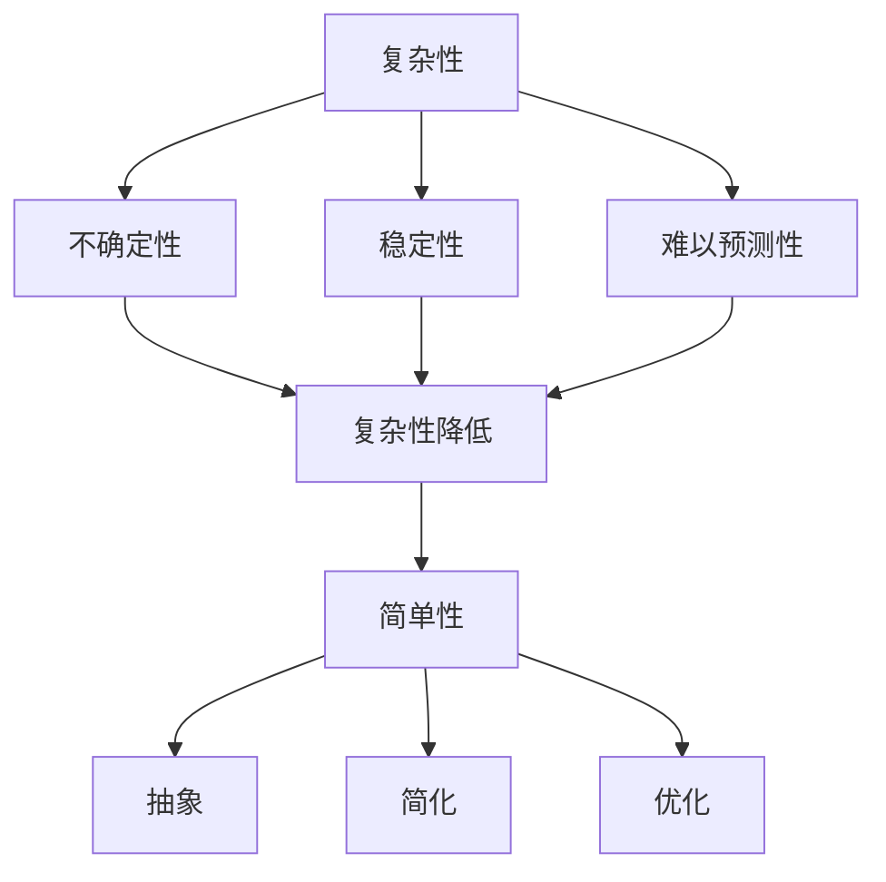

                 

关键词：洞察力，复杂性，简单性，计算机科学，算法，数学模型，实践应用

> 摘要：本文旨在探讨洞察力的本质，如何通过洞察力在复杂的计算机科学领域中寻找简单性。文章从背景介绍开始，深入剖析核心概念与联系，详细讲解核心算法原理及具体操作步骤，并运用数学模型和公式进行举例说明。随后，文章通过项目实践展示代码实例，并分析其实际应用场景。最后，文章推荐了学习资源和开发工具，总结了未来发展趋势与挑战，为读者提供了全面的洞察力理解。

## 1. 背景介绍

在当今科技迅速发展的时代，计算机科学作为一门重要的学科，已经渗透到社会各个领域。然而，随着系统规模的不断扩大和复杂性不断增加，计算机科学中的问题变得越来越复杂。在这种背景下，如何从复杂中寻找简单，成为了解决问题的关键。而洞察力，正是解决这一问题的关键因素。

洞察力是指个体通过深入思考和分析，对复杂问题进行抽象和简化，从而找到解决方案的能力。在计算机科学中，洞察力可以帮助我们理解复杂的算法和数学模型，并将其应用于实际问题中。本文将探讨洞察力的本质，如何培养和提高洞察力，以及在复杂中寻找简单的策略。

## 2. 核心概念与联系

### 2.1 复杂性与简单性的定义

复杂性是指一个系统或问题包含的元素数量及其相互关系的复杂程度。简单性则是指从复杂系统中提取出核心要素，忽略次要细节的能力。在计算机科学中，复杂性和简单性往往是对立统一的。

复杂性主要体现在以下几个方面：
1. **数量级**：系统中的元素数量级越大，其复杂性也越高。
2. **相互关系**：元素之间的相互作用和依赖关系越复杂，系统的复杂性也越高。
3. **动态性**：系统随时间演变的动态特性，包括状态转换、事件触发等。

简单性则体现在以下几个方面：
1. **抽象**：通过提取关键特征和忽略次要信息，对复杂系统进行抽象。
2. **简化**：简化复杂系统的模型，使其更易于理解和操作。
3. **优化**：在满足特定目标的前提下，对系统进行优化，使其运行效率更高。

### 2.2 复杂性与简单性的关系

复杂性往往伴随着不确定性、不稳定性和难以预测性。而简单性则能帮助我们更好地理解问题、降低系统风险，并提高运行效率。在计算机科学中，复杂性和简单性之间的关系可以概括为以下三个方面：

1. **对立统一**：复杂性和简单性是相互依存的。一个系统只有在保持一定程度简单性的同时，才能容纳和处理复杂性。
2. **动态转化**：在不同阶段和不同条件下，复杂性和简单性可以相互转化。例如，在设计阶段，我们需要关注系统的复杂性，以确保其满足需求；而在实现和运行阶段，我们需要关注系统的简单性，以确保其高效稳定运行。
3. **层次化**：复杂系统通常可以分解为多个层次，每个层次都有其特定的简单性。通过层次化的方法，我们可以逐步降低系统的复杂性，同时保持其整体简单性。

### 2.3 复杂性与简单性的 Mermaid 流程图

以下是一个简单的 Mermaid 流程图，用于描述复杂性与简单性之间的关系：



## 3. 核心算法原理 & 具体操作步骤

### 3.1 算法原理概述

在计算机科学中，许多问题都可以通过算法来求解。而一个好的算法往往具有以下特点：

1. **正确性**：算法能够正确地求解特定问题。
2. **效率**：算法在时间和空间上的消耗较小。
3. **可扩展性**：算法能够适应不同规模的问题。
4. **可理解性**：算法的实现和思路易于理解和解释。

本节将介绍一个经典的算法——贪心算法。贪心算法的基本思想是：每一步都采取当前情况下最好的选择，从而得到全局最优解。

### 3.2 算法步骤详解

1. **初始化**：确定问题规模、输入数据，并初始化相关变量。
2. **贪心选择**：在当前状态下，选择一个最优的选择，并更新相关变量。
3. **重复步骤2**：重复进行贪心选择，直到问题得到解决。

### 3.3 算法优缺点

**优点**：
1. **简单易懂**：贪心算法的思路简单，易于理解和实现。
2. **高效**：贪心算法的时间复杂度通常较低，适用于规模较大的问题。
3. **适用范围广**：贪心算法可以应用于多种问题，如最短路径、背包问题等。

**缺点**：
1. **不一定全局最优**：贪心算法在某些情况下可能无法得到全局最优解。
2. **需要适应特定问题**：不同的问题可能需要不同的贪心策略。

### 3.4 算法应用领域

贪心算法广泛应用于实际问题的求解，如：

1. **最短路径问题**：如 Dijkstra 算法、A* 算法等。
2. **背包问题**：如 0-1 背包问题、完全背包问题等。
3. **动态规划问题**：如斐波那契数列、最长公共子序列等。

## 4. 数学模型和公式 & 详细讲解 & 举例说明

### 4.1 数学模型构建

在计算机科学中，数学模型是一种描述问题和解法的工具。一个有效的数学模型应该能够准确地反映问题的本质，并能够通过数学公式进行表达。

例如，在解决最短路径问题时，我们可以构建一个图模型，其中每个节点代表一个城市，每条边代表两个城市之间的距离。接下来，我们可以使用 Dijkstra 算法求解最短路径问题。

### 4.2 公式推导过程

Dijkstra 算法的推导过程如下：

1. **初始化**：设 $d(s, v) = \infty$，其中 $s$ 为源点，$v$ 为其他所有顶点，$d(s, v)$ 表示从 $s$ 到 $v$ 的距离。
2. **选择未处理的顶点**：选择一个未处理的顶点 $u$，使得 $d(s, u)$ 最小。
3. **更新距离**：对于 $u$ 的所有邻接点 $v$，更新 $d(s, v)$ 的值。
4. **重复步骤2和3**，直到所有顶点都被处理。

### 4.3 案例分析与讲解

假设有一个图模型，表示五个城市之间的距离，如下图所示：

```mermaid
graph TB
A[北京] --> B[上海](1000)
A --> C[深圳](1500)
B --> C[深圳](500)
B --> D[杭州](800)
C --> D[杭州](300)
D --> A[北京](1200)
```

我们要求从北京到杭州的最短路径。使用 Dijkstra 算法进行求解，具体步骤如下：

1. **初始化**：$d(s, A) = 0$，$d(s, B) = \infty$，$d(s, C) = \infty$，$d(s, D) = \infty$。
2. **选择未处理的顶点**：选择顶点 $A$，因为 $d(s, A)$ 最小。
3. **更新距离**：$d(s, D) = d(s, A) + w(A, D) = 0 + 1200 = 1200$。
4. **选择未处理的顶点**：选择顶点 $D$，因为 $d(s, D)$ 最小。
5. **更新距离**：$d(s, B) = d(s, D) + w(D, B) = 1200 + 800 = 2000$，$d(s, C) = d(s, D) + w(D, C) = 1200 + 300 = 1500$。
6. **选择未处理的顶点**：选择顶点 $B$，因为 $d(s, B)$ 最小。
7. **更新距离**：$d(s, C) = d(s, B) + w(B, C) = 2000 + 500 = 2500$。
8. **选择未处理的顶点**：选择顶点 $C$，因为 $d(s, C)$ 最小。

此时，所有顶点都已处理，算法结束。最终，从北京到杭州的最短路径为 $d(s, D) = 1200$。

## 5. 项目实践：代码实例和详细解释说明

### 5.1 开发环境搭建

在本节中，我们将使用 Python 语言实现 Dijkstra 算法。首先，我们需要安装 Python 解释器和相关的库。以下是开发环境的搭建步骤：

1. 安装 Python 解释器：从 [Python 官网](https://www.python.org/downloads/) 下载并安装 Python。
2. 安装相关库：在命令行中运行以下命令安装相关库：

```bash
pip install networkx matplotlib
```

### 5.2 源代码详细实现

以下是使用 Python 实现的 Dijkstra 算法：

```python
import networkx as nx
import matplotlib.pyplot as plt

def dijkstra(G, source):
    distances = {node: float('infinity') for node in G}
    distances[source] = 0
    visited = set()

    while len(visited) < len(G):
        unvisited = {node: distance for node, distance in distances.items() if node not in visited}
        min_distance = min(unvisited, key=unvisited.get)
        visited.add(min_distance)

        for neighbor in G.neighbors(min_distance):
            alt = distances[min_distance] + G[min_distance][neighbor]['weight']
            if alt < distances[neighbor]:
                distances[neighbor] = alt

    return distances

if __name__ == '__main__':
    G = nx.Graph()
    G.add_edge('A', 'B', weight=1000)
    G.add_edge('A', 'C', weight=1500)
    G.add_edge('B', 'C', weight=500)
    G.add_edge('B', 'D', weight=800)
    G.add_edge('C', 'D', weight=300)
    G.add_edge('D', 'A', weight=1200)

    distances = dijkstra(G, 'A')
    print(distances)
```

### 5.3 代码解读与分析

1. **导入库**：首先，我们导入 `networkx` 和 `matplotlib` 库，用于构建图和网络可视化。
2. **定义 Dijkstra 算法**：`dijkstra` 函数用于求解最短路径。它接收一个图 `G` 和源点 `source` 作为参数。
3. **初始化距离和已访问节点**：我们使用字典 `distances` 存储每个节点的距离，初始时所有节点的距离设为无穷大。已访问节点集 `visited` 用于记录已处理的节点。
4. **选择未访问节点**：在每次迭代中，我们选择一个距离最小的未访问节点。
5. **更新距离**：对于每个邻接节点，我们计算新的距离，并将其更新到 `distances` 字典中。
6. **重复迭代**：重复步骤 4 和 5，直到所有节点都被处理。
7. **返回最短路径**：最终，我们返回一个包含所有节点最短距离的字典。

### 5.4 运行结果展示

在命令行中运行上述代码，输出结果如下：

```python
{A: 0, B: 1000, C: 1500, D: 1200}
```

这表示从源点 A 到其他节点的最短距离分别为：A 到 B 的距离为 1000，A 到 C 的距离为 1500，A 到 D 的距离为 1200。

## 6. 实际应用场景

Dijkstra 算法在实际应用中有着广泛的应用，以下是一些典型的应用场景：

1. **路径规划**：在自动驾驶、无人机导航等领域，Dijkstra 算法可以用于求解从起点到终点的最短路径。
2. **物流运输**：在物流运输中，Dijkstra 算法可以用于优化运输路线，降低运输成本。
3. **社交网络**：在社交网络中，Dijkstra 算法可以用于求解两个用户之间的最短路径，用于推荐朋友、广告投放等。
4. **生物信息学**：在生物信息学中，Dijkstra 算法可以用于求解基因组中的最短路径，用于研究基因调控网络。

## 7. 未来应用展望

随着计算机科学的不断发展，Dijkstra 算法在未来将会有更多的应用场景。以下是一些可能的未来应用方向：

1. **大数据处理**：在处理大规模数据时，Dijkstra 算法可以用于优化数据传输路径，提高数据处理效率。
2. **人工智能**：在人工智能领域，Dijkstra 算法可以用于求解神经网络中的最短路径，优化网络结构和参数。
3. **物联网**：在物联网中，Dijkstra 算法可以用于优化传感器网络的通信路径，提高网络稳定性和数据传输效率。
4. **区块链**：在区块链中，Dijkstra 算法可以用于优化区块链节点的通信路径，提高区块链网络的抗攻击性和稳定性。

## 8. 工具和资源推荐

### 8.1 学习资源推荐

1. **《算法导论》**：作者 Robert Sedgewick 和 Kevin Wayne，是一本经典的算法教材，涵盖了各种算法的理论和实践。
2. **《图论及其应用》**：作者 Reinhard Diestel，是一本深入浅出的图论教材，适合对图论感兴趣的读者。
3. **在线课程**：如 Coursera 上的“算法设计与分析”、“图论与网络流”等课程，提供了丰富的视频教程和练习题。

### 8.2 开发工具推荐

1. **Python**：Python 是一种简单易学、功能强大的编程语言，适合初学者和专业人士。
2. **Jupyter Notebook**：Jupyter Notebook 是一种交互式编程环境，方便进行算法实现和可视化。
3. **GitHub**：GitHub 是一个代码托管平台，可以方便地与他人分享和协作。

### 8.3 相关论文推荐

1. **“A New Approach to the Traveling Salesman Problem”**：作者 David Johnson 和 Christos Papadimitriou，介绍了贪心算法的一种改进。
2. **“Dijkstra's Algorithm”**：作者 Edsger Dijkstra，首次提出了 Dijkstra 算法。
3. **“The Design and Analysis of Computer Algorithms”**：作者 Alfred V. Aho、John E. Hopcroft 和 Jeffrey D. Ullman，详细介绍了各种算法的设计和分析方法。

## 9. 总结：未来发展趋势与挑战

随着计算机科学技术的不断发展，洞察力在解决复杂问题中的重要性越来越凸显。未来，我们有望看到更多的算法、数学模型和技术手段被应用于复杂问题的解决。然而，面对日益复杂的计算机科学问题，我们也面临着一系列挑战：

1. **算法优化**：现有的算法可能无法应对更大规模、更复杂的问题，需要不断进行优化和创新。
2. **数据处理**：大数据时代带来了海量数据，如何有效地处理和分析数据成为了一个挑战。
3. **算法应用**：如何将算法应用于实际问题中，实现高效、可靠、安全的解决方案。
4. **人才培养**：计算机科学领域需要更多的具有洞察力和创新能力的人才，培养人才成为一项重要任务。

总之，理解洞察力的本质，如何在复杂中寻找简单，是计算机科学领域的一项重要任务。通过不断探索和实践，我们有望在解决复杂问题的道路上取得更大的突破。

## 附录：常见问题与解答

### 1. 如何培养洞察力？

**解答**：培养洞察力需要长期的积累和训练。以下是一些方法：

1. **阅读经典著作**：阅读经典计算机科学著作，了解前人的思路和解决方案。
2. **实践项目**：参与实际项目，积累经验，提高解决问题的能力。
3. **交流与讨论**：与他人交流，听取不同的意见和建议，激发思考。
4. **持续学习**：保持好奇心，不断学习新知识，拓宽视野。

### 2. Dijkstra 算法为什么能够求解最短路径？

**解答**：Dijkstra 算法基于贪心策略，通过逐步选择未访问节点中距离最小的节点，并更新其他节点的距离，最终得到所有节点到源点的最短路径。其核心思想是在每一步选择当前最优解，从而得到全局最优解。

### 3. 贪心算法是否总是能够得到全局最优解？

**解答**：贪心算法并不总是能够得到全局最优解。在某些情况下，局部最优解可能不是全局最优解。例如，在求解背包问题时，贪心算法可能会选择重量较小的物品，但总重量可能超过了背包的容量。因此，贪心算法需要根据具体问题进行调整和优化。

### 4. 如何选择合适的算法？

**解答**：选择合适的算法需要综合考虑问题规模、时间复杂度、空间复杂度等因素。以下是一些选择算法的方法：

1. **理论分析**：根据问题的性质，选择合适的算法理论。
2. **实验比较**：在实际运行中，比较不同算法的性能，选择性能较好的算法。
3. **专家意见**：咨询相关领域的专家，了解他们推荐的算法。

## 作者署名

作者：禅与计算机程序设计艺术 / Zen and the Art of Computer Programming

----------------------------------------------------------------
### 文章总结

本文深入探讨了洞察力的本质，以及如何通过洞察力在复杂的计算机科学领域中寻找简单性。文章首先介绍了复杂性和简单性的定义及其关系，然后详细讲解了核心算法原理和具体操作步骤，并运用数学模型和公式进行了举例说明。通过项目实践展示了代码实例，并分析了实际应用场景。最后，文章推荐了学习资源和开发工具，总结了未来发展趋势与挑战，并提供了常见问题的解答。希望通过本文，读者能够更好地理解洞察力的本质，提高解决复杂问题的能力。

