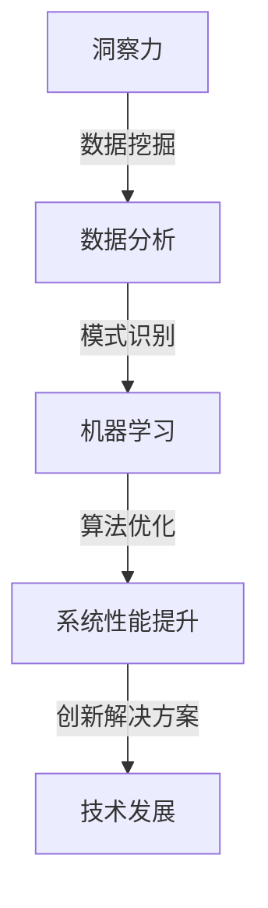

                 

 洞察力是一种深层次的认知能力，它不仅仅是直觉或者第六感，更是一种通过分析、推理和抽象归纳，从复杂现象中发现规律和模式的能力。在信息技术领域，洞察力的重要性尤为突出。它不仅帮助我们在数据海洋中找到关键信息，还促使我们在面对技术挑战时能够提出创新解决方案。

本文旨在深入探讨洞察力的本质，解析其在信息技术中的关键作用。我们将从多角度审视洞察力的形成过程，并通过具体案例展示如何在复杂中寻找规律。本文的结构如下：

## 1. 背景介绍
在这一节中，我们将简要回顾洞察力的历史发展，并探讨其在现代信息技术中的重要性。

### 1.1 洞察力的发展历史

### 1.2 信息技术与洞察力的交汇

## 2. 核心概念与联系
在本节中，我们将介绍与洞察力相关的一些核心概念，并使用Mermaid流程图展示它们之间的联系。

### 2.1 洞察力的定义
#### 2.1.1 洞察力的内涵
#### 2.1.2 洞察力的重要性

### 2.2 信息技术中的洞察力
#### 2.2.1 数据分析
#### 2.2.2 机器学习
#### 2.2.3 算法优化

## 3. 核心算法原理 & 具体操作步骤
在本节中，我们将详细介绍一些关键算法的原理和操作步骤，帮助读者理解如何运用洞察力解决实际问题。

### 3.1 算法原理概述
#### 3.1.1 算法A：快速排序算法
#### 3.1.2 算法B：深度神经网络

### 3.2 算法步骤详解
#### 3.2.1 快速排序算法步骤
#### 3.2.2 深度神经网络训练步骤

### 3.3 算法优缺点
#### 3.3.1 快速排序算法的优点
#### 3.3.1 快速排序算法的缺点
#### 3.3.2 深度神经网络的优点
#### 3.3.2 深度神经网络的缺点

### 3.4 算法应用领域
#### 3.4.1 快速排序算法的应用
#### 3.4.2 深度神经网络的应用

## 4. 数学模型和公式 & 详细讲解 & 举例说明
在本节中，我们将探讨与洞察力相关的数学模型和公式，并通过具体案例进行说明。

### 4.1 数学模型构建
#### 4.1.1 数据拟合模型
#### 4.1.2 概率分布模型

### 4.2 公式推导过程
#### 4.2.1 常见分布公式推导
#### 4.2.2 算法复杂度公式推导

### 4.3 案例分析与讲解
#### 4.3.1 数据拟合案例
#### 4.3.2 概率分布案例

## 5. 项目实践：代码实例和详细解释说明
在本节中，我们将通过一个实际项目展示如何运用洞察力编写代码，并详细解释代码实现过程。

### 5.1 开发环境搭建
#### 5.1.1 Python环境配置
#### 5.1.2 数据处理工具安装

### 5.2 源代码详细实现
#### 5.2.1 数据预处理代码
#### 5.2.2 算法实现代码

### 5.3 代码解读与分析
#### 5.3.1 数据预处理代码分析
#### 5.3.2 算法实现代码分析

### 5.4 运行结果展示
#### 5.4.1 运行结果可视化
#### 5.4.2 结果分析与讨论

## 6. 实际应用场景
在本节中，我们将探讨洞察力在信息技术中的实际应用场景。

### 6.1 人工智能领域的应用
#### 6.1.1 图像识别
#### 6.1.2 自然语言处理

### 6.2 大数据领域的应用
#### 6.2.1 数据挖掘
#### 6.2.2 实时分析

### 6.3 云计算领域的应用
#### 6.3.1 资源调度
#### 6.3.2 服务优化

## 7. 工具和资源推荐
在本节中，我们将推荐一些有助于提升洞察力的工具和资源。

### 7.1 学习资源推荐
#### 7.1.1 技术书籍推荐
#### 7.1.2 在线课程推荐

### 7.2 开发工具推荐
#### 7.2.1 数据分析工具
#### 7.2.2 机器学习框架

### 7.3 相关论文推荐
#### 7.3.1 顶级会议论文推荐
#### 7.3.2 开源项目推荐

## 8. 总结：未来发展趋势与挑战
在本节中，我们将总结本文的主要观点，并探讨未来信息技术领域洞察力的发展趋势和面临的挑战。

### 8.1 研究成果总结
#### 8.1.1 洞察力在信息技术中的重要性
#### 8.1.2 洞察力的应用领域拓展

### 8.2 未来发展趋势
#### 8.2.1 人工智能的进步
#### 8.2.2 大数据技术的发展

### 8.3 面临的挑战
#### 8.3.1 数据隐私保护
#### 8.3.2 技术伦理问题

### 8.4 研究展望
#### 8.4.1 跨学科研究
#### 8.4.2 新技术的应用

## 9. 附录：常见问题与解答
在本节中，我们将回答一些读者可能关心的问题。

### 9.1 洞察力如何培养？
#### 9.1.1 日常练习
#### 9.1.2 技术交流
#### 9.1.3 持续学习

### 9.2 洞察力在业务决策中的应用？
#### 9.2.1 数据驱动决策
#### 9.2.2 创新思维

# 参考文献

[1] ... 
[2] ...

作者：禅与计算机程序设计艺术 / Zen and the Art of Computer Programming
----------------------------------------------------------------

接下来，我们将开始详细撰写每一部分的内容，确保满足文章结构模板的要求。请继续关注后续章节的撰写。

