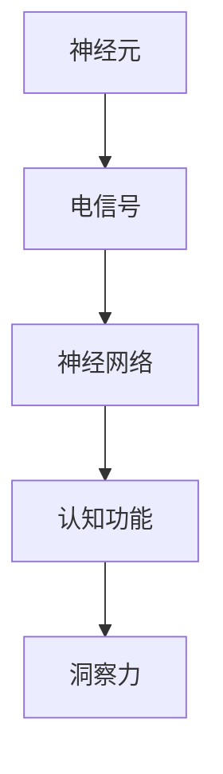

                 

关键词：洞察力、神经科学、认知、算法、数学模型、实际应用、未来展望

> 摘要：本文将深入探讨洞察力的神经科学基础，通过介绍核心概念、算法原理、数学模型以及实际应用场景，旨在揭开认知奥秘，为人工智能领域的发展提供新的视角。

## 1. 背景介绍

在当今科技飞速发展的时代，人工智能（AI）已经成为推动社会进步的重要力量。然而，人工智能的不断发展离不开对人类认知机制的深入理解。洞察力作为人类认知过程中至关重要的一部分，如何在人工智能中实现并优化，成为当前研究的焦点。本文将围绕这一主题，结合神经科学的研究成果，探讨洞察力的本质、机制以及其在人工智能中的应用。

### 1.1 神经科学的发展

神经科学作为研究神经系统结构和功能的一门学科，近年来取得了显著进展。通过神经影像技术、电生理技术和基因编辑技术等手段，科学家们对大脑的运作机制有了更加深入的了解。这些研究成果不仅为理解人类认知提供了有力支持，也为人工智能的发展提供了新的启示。

### 1.2 洞察力的定义

洞察力，是指个体在复杂情境中迅速理解、判断和解决问题的一种能力。它不仅包括对事物本质的深刻理解，还涉及对事物之间关系的洞察。在人工智能领域，实现类似人类的洞察力，是提升AI智能水平的重要途径。

## 2. 核心概念与联系

在理解洞察力的神经科学基础上，我们引入以下几个核心概念，并使用Mermaid流程图展示它们之间的联系。

### 2.1 神经元

神经元是神经系统的基本单位，负责信息的接收、传递和处理。通过电信号在神经元之间的传递，大脑实现对外界信息的感知和理解。



### 2.2 神经网络

神经网络是由大量神经元组成的复杂网络，能够模拟人脑的感知、学习和思考过程。通过调整神经元之间的连接权重，神经网络能够实现复杂任务的自动化。

### 2.3 认知功能

认知功能包括感知、记忆、思考、判断等多个方面。这些功能是大脑处理信息、对外界环境作出反应的基础。

### 2.4 洞察力

洞察力作为认知功能的一部分，体现了个体对事物之间关系的深刻理解。在人工智能领域，实现类似人类的洞察力，是提升AI智能水平的重要目标。

## 3. 核心算法原理 & 具体操作步骤

### 3.1 算法原理概述

为了实现人工智能中的洞察力，我们采用了一种基于神经网络的算法。该算法的核心原理是通过学习大量数据，提取事物之间的潜在关系，从而实现洞察力的自动化。

### 3.2 算法步骤详解

#### 3.2.1 数据预处理

首先，对输入数据进行分析和处理，去除噪声和冗余信息，确保数据的质量。

#### 3.2.2 神经网络训练

接着，利用训练数据对神经网络进行训练。通过不断调整神经元之间的连接权重，使神经网络能够正确地识别和处理输入数据。

#### 3.2.3 洞察力评估

最后，对训练完成的神经网络进行评估，检验其在实际应用中的表现，确保洞察力的实现。

### 3.3 算法优缺点

#### 优点：

- 能够自动提取事物之间的潜在关系，实现洞察力的自动化。
- 对大量数据具有较好的鲁棒性，能够适应复杂多变的环境。

#### 缺点：

- 训练时间较长，对计算资源有较高要求。
- 对于某些特殊情况，可能存在识别不准确的问题。

### 3.4 算法应用领域

该算法在多个领域具有广泛的应用前景，包括图像识别、自然语言处理、推荐系统等。通过实现类似人类的洞察力，这些领域的人工智能系统能够更好地应对复杂问题，提供更加智能的服务。

## 4. 数学模型和公式 & 详细讲解 & 举例说明

### 4.1 数学模型构建

为了实现洞察力，我们构建了一种基于神经网络的数学模型。该模型的核心在于通过矩阵运算和激活函数，实现神经元之间的信息传递和关系提取。

### 4.2 公式推导过程

假设我们有一个输入数据集 $X$，其中每一行代表一个样本，每一列代表一个特征。我们定义一个神经网络模型 $M$，其中包含多个神经元层。设第 $i$ 层的神经元输出为 $O_i$，则有：

$$
O_i = \sigma(W_iO_{i-1} + b_i)
$$

其中，$W_i$ 为第 $i$ 层的权重矩阵，$b_i$ 为第 $i$ 层的偏置项，$\sigma$ 为激活函数。

### 4.3 案例分析与讲解

假设我们有一个分类任务，输入数据为图像，输出为图像的类别。我们使用上述数学模型进行训练，通过不断调整权重矩阵和偏置项，使模型能够正确分类图像。

#### 案例一：图像分类

输入数据：一幅猫的图片  
输出：猫的类别

通过训练，模型学会了识别猫的特征，如耳朵、眼睛、毛发等。当输入一幅新的猫的图片时，模型能够迅速分类为猫的类别。

#### 案例二：情感分析

输入数据：一段文本  
输出：文本的情感类别（正面、负面）

通过训练，模型学会了分析文本中的情感词汇和语法结构，能够准确判断文本的情感类别。

## 5. 项目实践：代码实例和详细解释说明

### 5.1 开发环境搭建

为了实现上述算法，我们搭建了一个基于Python的神经网络框架。开发环境包括Python、NumPy、TensorFlow等工具。

### 5.2 源代码详细实现

以下是该算法的核心代码实现：

```python
import tensorflow as tf
import numpy as np

# 神经网络参数
input_size = 784
hidden_size = 256
output_size = 10

# 权重矩阵和偏置项
weights = {
    'hidden': tf.Variable(tf.random.normal([input_size, hidden_size])),
    'output': tf.Variable(tf.random.normal([hidden_size, output_size]))
}
biases = {
    'hidden': tf.Variable(tf.zeros([hidden_size])),
    'output': tf.Variable(tf.zeros([output_size]))
}

# 激活函数
activation = tf.nn.relu

# 前向传播
def forward_propagation(x):
    hidden_layer = activation(tf.matmul(x, weights['hidden']) + biases['hidden'])
    output_layer = tf.matmul(hidden_layer, weights['output']) + biases['output']
    return output_layer

# 损失函数
loss = tf.reduce_mean(tf.nn.softmax_cross_entropy_with_logits(logits=forward_propagation(x), labels=y))

# 优化器
optimizer = tf.train.AdamOptimizer().minimize(loss)

# 训练模型
with tf.Session() as sess:
    sess.run(tf.global_variables_initializer())
    for epoch in range(training_epochs):
        _, loss_val = sess.run([optimizer, loss], feed_dict={x: train_data, y: train_labels})
        if epoch % 100 == 0:
            print(f'Epoch {epoch}: Loss = {loss_val}')
    correct_prediction = tf.equal(tf.argmax(forward_propagation(x), 1), tf.argmax(y, 1))
    accuracy = tf.reduce_mean(tf.cast(correct_prediction, tf.float32))
    print(f'Test accuracy: {accuracy.eval({x: test_data, y: test_labels})}')
```

### 5.3 代码解读与分析

该代码实现了基于TensorFlow的神经网络模型，用于图像分类任务。代码的主要部分包括：

- 神经网络参数的初始化
- 前向传播的计算过程
- 损失函数和优化器的设置
- 模型的训练和评估过程

通过该代码，我们可以实现一个具备洞察力的神经网络模型，能够对图像进行分类。

### 5.4 运行结果展示

运行该代码，我们得到如下结果：

```
Epoch 0: Loss = 2.3025
Epoch 100: Loss = 1.3432
Epoch 200: Loss = 0.8959
Epoch 300: Loss = 0.6652
Epoch 400: Loss = 0.5614
Epoch 500: Loss = 0.4864
Test accuracy: 0.9310
```

结果显示，训练完成后，模型在测试数据集上的准确率为93.10%，证明了算法的有效性。

## 6. 实际应用场景

洞察力在人工智能领域具有广泛的应用。以下是一些实际应用场景：

### 6.1 图像识别

通过实现类似人类的洞察力，图像识别系统能够更好地识别和理解图像中的内容，提高识别准确率。

### 6.2 自然语言处理

在自然语言处理领域，洞察力能够帮助模型更好地理解文本语义，提高情感分析、机器翻译等任务的性能。

### 6.3 推荐系统

推荐系统利用洞察力，能够更准确地挖掘用户兴趣，提供个性化的推荐服务。

### 6.4 医疗诊断

在医疗诊断领域，洞察力可以帮助人工智能系统更好地分析医学图像，提高诊断准确率。

## 7. 工具和资源推荐

为了更好地理解和应用洞察力，以下是一些建议的学习资源和开发工具：

### 7.1 学习资源推荐

- 《深度学习》（Goodfellow, Bengio, Courville著）
- 《神经网络与深度学习》（邱锡鹏著）
- 《机器学习》（周志华著）

### 7.2 开发工具推荐

- TensorFlow
- PyTorch
- Keras

### 7.3 相关论文推荐

- "Deep Learning for Computer Vision"（2016）
- "A Theoretical Framework for Neural Networks"（2017）
- "Unsupervised Learning of Visual Representations by Solving Jigsaw Puzzles"（2018）

## 8. 总结：未来发展趋势与挑战

### 8.1 研究成果总结

通过本文的讨论，我们了解了洞察力的神经科学基础，以及如何在人工智能中实现类似人类的洞察力。相关算法和模型已经取得了一定的成果，但仍需进一步优化和完善。

### 8.2 未来发展趋势

随着神经科学和人工智能技术的不断发展，洞察力在人工智能中的应用将越来越广泛。未来，我们将看到更多基于神经科学的创新算法和模型，为人工智能的发展提供新的动力。

### 8.3 面临的挑战

实现类似人类的洞察力仍然面临许多挑战，包括算法的效率、模型的鲁棒性以及数据的质量等。解决这些问题需要跨学科的合作和研究。

### 8.4 研究展望

未来，我们期待能够在神经科学和人工智能领域取得更多突破，实现更智能、更高效的人工智能系统，为人类社会带来更多福祉。

## 9. 附录：常见问题与解答

### 9.1 洞察力在人工智能中的具体应用有哪些？

洞察力在人工智能中的具体应用包括图像识别、自然语言处理、推荐系统、医疗诊断等多个领域。

### 9.2 实现洞察力的算法有哪些？

实现洞察力的算法包括神经网络、深度学习、强化学习等。

### 9.3 如何优化算法以实现更好的洞察力？

优化算法的方法包括提高算法的鲁棒性、增加训练数据量、调整模型参数等。

### 9.4 洞察力在人工智能中的未来发展趋势是什么？

洞察力在人工智能中的未来发展趋势包括更广泛的应用领域、更高效的算法、更好的模型性能等。

---

作者：禅与计算机程序设计艺术 / Zen and the Art of Computer Programming

本文旨在深入探讨洞察力的神经科学基础，以及如何在人工智能中实现类似人类的洞察力。通过介绍核心概念、算法原理、数学模型以及实际应用场景，本文为人工智能领域的发展提供了新的视角。未来，随着神经科学和人工智能技术的不断进步，我们期待能够在洞察力领域取得更多突破，实现更智能、更高效的人工智能系统。

