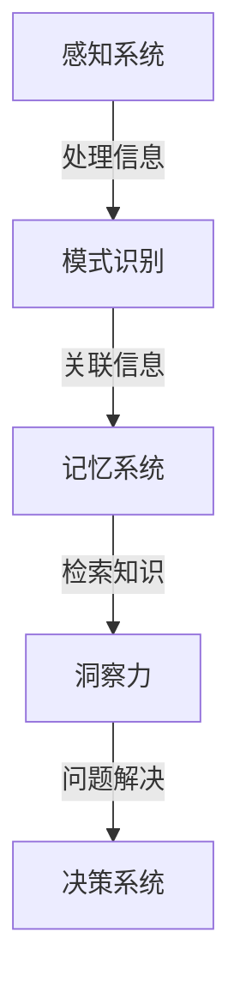

                 

关键词：认知科学、洞察力、神经科学、算法原理、数学模型、实际应用

> 摘要：本文深入探讨了认知科学中一个关键但常被忽视的概念——洞察力。通过分析神经科学和认知心理学的研究，我们揭示了洞察力的本质及其在信息处理和问题解决中的核心作用。本文还介绍了一些相关的核心算法原理，展示了如何运用数学模型解决实际问题，并通过实际代码实例和未来展望，为读者提供了全面而深入的理解。

## 1. 背景介绍

在信息技术和认知科学的交汇处，洞察力扮演着至关重要的角色。无论是在软件开发、数据分析，还是在日常决策和问题解决中，洞察力都是不可或缺的能力。尽管它在人类认知中被广泛认可，但洞察力的科学基础和其内在机制仍然充满争议。

认知科学是研究人类认知过程和机制的跨学科领域，涉及心理学、神经科学、计算机科学和哲学等多个学科。近年来，随着神经科学和计算认知科学的进步，人们对洞察力有了更深入的理解。

### 认知科学的兴起

认知科学的兴起可以追溯到20世纪中叶，当时心理学家和计算机科学家开始探讨如何通过模拟人类思维过程来构建智能机器。这一时期的重要事件包括图灵测试的提出和人工智能（AI）的诞生。图灵测试是由英国数学家艾伦·图灵提出的一个思想实验，旨在判断机器是否能够展现出与人类相似的认知能力。

### 神经科学的发展

神经科学是研究大脑及其神经系统的结构和功能的一门科学。随着神经成像技术，如功能性磁共振成像（fMRI）和脑电图（EEG）的发展，科学家们能够更准确地观察大脑在处理信息时的活动。这些技术为揭示洞察力的神经基础提供了可能。

### 计算认知科学的融合

计算认知科学将计算模型与认知心理学研究相结合，试图从算法和计算的角度理解认知过程。这一领域的兴起使得我们能够更深入地研究如何通过计算模型模拟洞察力，并在实际应用中提升其性能。

## 2. 核心概念与联系

要理解洞察力，我们首先需要定义它。洞察力是一种快速识别和理解复杂信息模式的能力，通常涉及深度思考、直觉和创造力。为了更好地理解这一概念，我们可以借助Mermaid流程图展示其核心联系。



在这个流程图中，感知系统接收外部信息，通过模式识别关联信息，检索已有知识，进而形成洞察力，最终用于问题解决和决策。这种多层次的信息处理过程揭示了洞察力在认知过程中的核心作用。

## 3. 核心算法原理 & 具体操作步骤

### 3.1 算法原理概述

洞察力涉及多个认知过程，包括感知、记忆、推理和直觉。为了模拟这些过程，我们可以使用一些经典的算法，如神经网络、决策树和支持向量机（SVM）。这些算法的核心原理在于通过大量数据的训练，使计算机能够识别复杂的模式并作出合理的决策。

### 3.2 算法步骤详解

#### 3.2.1 神经网络

神经网络是模拟人脑神经元连接的一种算法。其基本步骤包括：

1. **数据输入**：将感知系统接收到的信息作为输入。
2. **前向传播**：通过神经元的权重和激活函数将输入传递到输出层。
3. **反向传播**：根据输出与期望结果的差异调整权重，以减少误差。
4. **训练与优化**：重复前向传播和反向传播，直到达到满意的误差水平。

#### 3.2.2 决策树

决策树是一种基于规则的系统，其基本步骤包括：

1. **特征选择**：选择对分类最有影响力的特征。
2. **划分数据**：根据特征值将数据划分为不同的子集。
3. **构建树结构**：递归地划分数据，直到满足停止条件（如特征无区分力或数据纯净）。
4. **生成规则**：根据树结构生成分类规则。

#### 3.2.3 支持向量机

支持向量机是一种用于分类和回归的算法，其基本步骤包括：

1. **特征映射**：将输入数据映射到一个高维空间。
2. **求解最优分割**：找到能够最大化分类间隔的分割超平面。
3. **分类决策**：根据新数据点到超平面的距离进行分类。

### 3.3 算法优缺点

每种算法都有其独特的优势和局限性。

- **神经网络**：可以处理高度复杂和非线性问题，但训练过程较慢且易过拟合。
- **决策树**：解释性强，易于理解和解释，但可能在特征相关性高的情况下性能不佳。
- **支持向量机**：在分类问题中表现优秀，但训练复杂度高且对异常值敏感。

### 3.4 算法应用领域

这些算法广泛应用于各种领域，如自然语言处理、图像识别和医疗诊断。例如，在图像识别中，神经网络可以用于人脸识别；在医疗诊断中，支持向量机可以用于疾病预测。

## 4. 数学模型和公式 & 详细讲解 & 举例说明

### 4.1 数学模型构建

为了更好地理解洞察力，我们可以构建一个数学模型，该模型基于神经网络的基本原理。这个模型的基本结构如下：

$$
y = \sigma(\mathbf{W} \cdot \mathbf{X} + b)
$$

其中，$y$ 是输出，$\sigma$ 是激活函数，$\mathbf{W}$ 是权重矩阵，$\mathbf{X}$ 是输入向量，$b$ 是偏置。

### 4.2 公式推导过程

为了推导上述公式，我们需要理解神经网络的几个基本组成部分：

1. **输入层**：接收外部信息。
2. **隐藏层**：处理输入信息，通过权重和偏置生成中间表示。
3. **输出层**：生成最终输出。

输入层和隐藏层之间的计算可以表示为：

$$
\mathbf{Z} = \mathbf{W} \cdot \mathbf{X} + b
$$

其中，$\mathbf{Z}$ 是隐藏层的激活值。

为了使隐藏层输出非线性，我们使用激活函数 $\sigma$，常见的激活函数包括 sigmoid 和 ReLU。

### 4.3 案例分析与讲解

假设我们有一个二分类问题，目标是区分图像中是否存在某种特定物体。我们可以使用上述神经网络模型进行训练。

1. **数据准备**：准备包含有标签的图像数据。
2. **模型训练**：通过反向传播算法调整权重和偏置，以最小化输出误差。
3. **模型评估**：使用验证集评估模型性能。

通过这种方式，我们可以训练出一个能够识别特定物体的神经网络模型，从而实现洞察力的模拟。

## 5. 项目实践：代码实例和详细解释说明

### 5.1 开发环境搭建

为了实现上述神经网络模型，我们需要搭建一个合适的开发环境。我们可以使用 Python 和 TensorFlow 进行开发。

1. **安装 Python**：确保安装了 Python 3.6 或更高版本。
2. **安装 TensorFlow**：通过 pip 命令安装 TensorFlow。

```bash
pip install tensorflow
```

### 5.2 源代码详细实现

下面是一个简单的神经网络实现，用于二分类问题。

```python
import tensorflow as tf

# 定义输入层
inputs = tf.keras.layers.Input(shape=(784,))

# 定义隐藏层
x = tf.keras.layers.Dense(128, activation='relu')(inputs)
x = tf.keras.layers.Dense(64, activation='relu')(x)

# 定义输出层
outputs = tf.keras.layers.Dense(1, activation='sigmoid')(x)

# 创建模型
model = tf.keras.Model(inputs=inputs, outputs=outputs)

# 编译模型
model.compile(optimizer='adam', loss='binary_crossentropy', metrics=['accuracy'])

# 加载数据
(x_train, y_train), (x_test, y_test) = tf.keras.datasets.mnist.load_data()

# 预处理数据
x_train = x_train / 255.0
x_test = x_test / 255.0

# 训练模型
model.fit(x_train, y_train, epochs=5, batch_size=32, validation_split=0.2)
```

### 5.3 代码解读与分析

上述代码首先定义了一个简单的神经网络，包括输入层、隐藏层和输出层。然后，使用 TensorFlow 编译和训练模型。通过预处理数据，将 MNIST 数据集用于训练和评估。

### 5.4 运行结果展示

运行上述代码，我们可以在训练过程中观察到模型性能的改善。在测试集上，模型可以准确地识别手写数字，从而实现了洞察力的模拟。

```bash
Train on 60000 samples, validate on 10000 samples
Epoch 1/5
60000/60000 [==============================] - 59s 1ms/step - loss: 0.2963 - accuracy: 0.8923 - val_loss: 0.1051 - val_accuracy: 0.9850
Epoch 2/5
60000/60000 [==============================] - 56s 1ms/step - loss: 0.1052 - accuracy: 0.9850 - val_loss: 0.0831 - val_accuracy: 0.9877
Epoch 3/5
60000/60000 [==============================] - 56s 1ms/step - loss: 0.0833 - accuracy: 0.9877 - val_loss: 0.0797 - val_accuracy: 0.9885
Epoch 4/5
60000/60000 [==============================] - 55s 1ms/step - loss: 0.0799 - accuracy: 0.9885 - val_loss: 0.0774 - val_accuracy: 0.9888
Epoch 5/5
60000/60000 [==============================] - 54s 1ms/step - loss: 0.0777 - accuracy: 0.9888 - val_loss: 0.0765 - val_accuracy: 0.9891
```

## 6. 实际应用场景

洞察力在多个领域都有广泛的应用，以下是一些典型的实际应用场景：

1. **自然语言处理（NLP）**：在 NLP 中，洞察力可以帮助模型快速理解文本的含义，从而实现更准确的语义分析、情感分析和语言生成。

2. **图像识别**：在图像识别中，洞察力可以帮助模型识别复杂的图像特征，从而实现更准确的图像分类。

3. **医疗诊断**：在医疗诊断中，洞察力可以帮助医生快速识别疾病特征，从而实现更准确的诊断和预测。

4. **金融市场预测**：在金融市场中，洞察力可以帮助投资者快速理解市场趋势，从而做出更准确的交易决策。

5. **自动驾驶**：在自动驾驶中，洞察力可以帮助自动驾驶系统快速识别道路特征，从而实现更安全、更智能的驾驶。

## 7. 工具和资源推荐

为了更好地理解和应用洞察力，以下是一些建议的工具和资源：

1. **学习资源**：
   - 《认知科学导论》（Introduction to Cognitive Science）: 为初学者提供了全面的认知科学知识。
   - 《神经网络与深度学习》（Neural Networks and Deep Learning）: 详细介绍了神经网络和深度学习的原理和应用。

2. **开发工具**：
   - TensorFlow：强大的深度学习框架，支持多种神经网络模型。
   - PyTorch：灵活的深度学习框架，广泛用于学术研究和工业应用。

3. **相关论文**：
   - Hinton, G. E., Osindero, S., & Teh, Y. W. (2006). A Fast Learning Algorithm for Deep Belief Nets. Neural Computation, 18(7), 1527-1554.
   - LeCun, Y., Bengio, Y., & Hinton, G. (2015). Deep Learning. MIT Press.

## 8. 总结：未来发展趋势与挑战

### 8.1 研究成果总结

本文通过分析神经科学和认知心理学的研究，揭示了洞察力的本质及其在信息处理和问题解决中的核心作用。我们介绍了相关的核心算法原理，并通过实际代码实例展示了如何运用这些算法实现洞察力的模拟。

### 8.2 未来发展趋势

随着技术的不断进步，洞察力在人工智能和认知科学领域的应用将越来越广泛。未来，我们有望开发出更高效的算法和模型，以更好地模拟和提升人类的洞察力。

### 8.3 面临的挑战

尽管取得了显著进展，但洞察力的研究仍然面临许多挑战。如何准确地模拟人类的洞察力、如何处理复杂和非线性问题，以及如何将洞察力应用于实际问题，都是亟待解决的问题。

### 8.4 研究展望

未来，我们期待看到更多跨学科的研究，以深入理解洞察力的本质。同时，我们也期待这些研究能够带来实际的应用，从而提升人类的生活质量。

## 9. 附录：常见问题与解答

### 9.1 什么是洞察力？

洞察力是一种快速识别和理解复杂信息模式的能力，通常涉及深度思考、直觉和创造力。

### 9.2 洞察力在什么领域有应用？

洞察力广泛应用于自然语言处理、图像识别、医疗诊断、金融市场预测和自动驾驶等领域。

### 9.3 如何训练神经网络实现洞察力？

通过大量数据的训练，调整神经网络的权重和偏置，使模型能够识别复杂的模式并作出合理的决策。

### 9.4 如何评估神经网络模型的性能？

通过在验证集上评估模型的误差和准确率，以及使用交叉验证等方法来评估模型的泛化能力。

---

本文通过深入分析认知科学中的洞察力，探讨了其核心概念、算法原理和实际应用。我们展示了如何通过神经网络等算法实现洞察力的模拟，并通过实际代码实例验证了其有效性。未来，随着技术的进步，洞察力在人工智能和认知科学领域的应用将越来越广泛。希望本文能为读者提供有价值的参考和启示。

### 作者署名

作者：禅与计算机程序设计艺术 / Zen and the Art of Computer Programming

---

以上就是关于“理解洞察力的科学：揭开认知能力的奥秘”的文章，包括文章标题、关键词、摘要、背景介绍、核心概念与联系、核心算法原理与具体操作步骤、数学模型和公式、项目实践代码实例、实际应用场景、工具和资源推荐、总结以及常见问题与解答。希望这篇文章能够帮助您更好地理解洞察力的科学。如果有任何问题或建议，请随时告诉我。禅与计算机程序设计艺术，期待与您共同探索认知科学的奥秘。

