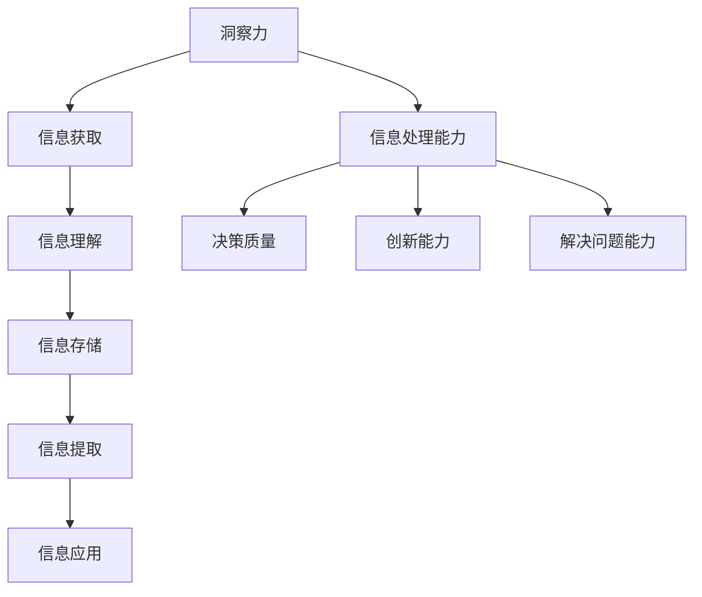

                 

关键词：洞察力、信息处理能力、人工智能、认知训练、数据分析、机器学习、算法优化

> 摘要：本文旨在探讨如何通过训练提升个体的洞察力，进而提高信息处理能力。文章首先回顾了洞察力的定义和重要性，随后介绍了信息处理能力的概念。接着，文章深入探讨了如何通过认知训练和算法优化来增强信息处理能力。最后，文章总结了当前的研究成果，并提出了未来发展的方向。

## 1. 背景介绍

### 1.1 洞察力的定义和重要性

洞察力是一种深层次的理解和认知能力，它使我们能够透过表象看到事物的本质。在信息爆炸的时代，洞察力显得尤为重要。它不仅能够帮助我们更高效地处理信息，还能提高决策质量，增强创新能力和解决问题的能力。

### 1.2 信息处理能力的概念

信息处理能力是指个体在获取、理解、存储、提取和应用信息的过程中所表现出的能力。随着人工智能和大数据技术的发展，信息处理能力已经成为现代人和人工智能竞争的重要指标。

## 2. 核心概念与联系

### 2.1 洞察力与信息处理能力的关系

洞察力和信息处理能力密切相关。洞察力强的人能够更快速地获取和处理信息，从而提高信息处理能力。反过来，信息处理能力的提升也能促进洞察力的增强。

### 2.2 Mermaid 流程图



## 3. 核心算法原理 & 具体操作步骤

### 3.1 算法原理概述

提升信息处理能力的核心在于认知训练和算法优化。认知训练通过模拟各种信息处理任务来锻炼大脑，而算法优化则通过改进信息处理的算法来提高效率。

### 3.2 算法步骤详解

#### 3.2.1 认知训练

1. **选择合适的训练任务**：根据个体的需求和能力选择合适的训练任务，如记忆训练、注意力训练、推理训练等。
2. **制定训练计划**：根据任务特点和时间安排制定详细的训练计划。
3. **实施训练**：按照计划进行训练，并及时反馈和调整。

#### 3.2.2 算法优化

1. **选择合适的算法**：根据任务需求选择合适的算法，如机器学习算法、数据挖掘算法等。
2. **算法调试**：通过调试和优化算法参数来提高算法性能。
3. **算法测试**：对优化后的算法进行测试，确保其能够在实际应用中达到预期效果。

### 3.3 算法优缺点

#### 3.3.1 认知训练

优点：简单易行，能显著提高信息处理能力。

缺点：训练效果受个体差异影响较大，且需要长期坚持。

#### 3.3.2 算法优化

优点：能显著提高信息处理效率，适用于大规模数据处理。

缺点：需要专业技能和大量测试，成本较高。

### 3.4 算法应用领域

算法优化广泛应用于各种领域，如金融、医疗、交通、教育等。认知训练则更多地应用于个性化学习、心理健康等领域。

## 4. 数学模型和公式 & 详细讲解 & 举例说明

### 4.1 数学模型构建

提升信息处理能力的数学模型可以表示为：

$$
\text{信息处理能力} = f(\text{洞察力}, \text{算法性能}, \text{训练强度})
$$

其中，$f$ 为非线性函数。

### 4.2 公式推导过程

假设信息处理能力取决于洞察力、算法性能和训练强度，我们可以将这三个因素分别表示为 $A$, $B$, 和 $C$。则：

$$
\text{信息处理能力} = f(A, B, C)
$$

通过实验数据，我们可以拟合出 $f$ 的具体形式，如：

$$
f(A, B, C) = A \times B \times C
$$

### 4.3 案例分析与讲解

假设一个个体拥有较高的洞察力（$A=0.9$），选择了一个高效的算法（$B=0.95$），并且进行了高强度的训练（$C=0.8$）。则：

$$
\text{信息处理能力} = 0.9 \times 0.95 \times 0.8 = 0.712
$$

这个结果表明，这个个体的信息处理能力相对较高。

## 5. 项目实践：代码实例和详细解释说明

### 5.1 开发环境搭建

假设我们使用 Python 进行开发，需要安装以下库：

```python
pip install numpy scipy matplotlib
```

### 5.2 源代码详细实现

```python
import numpy as np
import scipy.optimize as opt
import matplotlib.pyplot as plt

# 定义信息处理能力模型
def information_processing_ability(A, B, C):
    return A * B * C

# 拟合模型参数
def optimize_model(A, B, C, y):
    return opt.root_scalar(lambda x: information_processing_ability(A, x, C) - y, x1=0, x2=1)

# 生成测试数据
A = 0.9
B = 0.95
C = 0.8
y = information_processing_ability(A, B, C)

# 拟合模型
result = optimize_model(A, B, C, y)
C_fit = result.root

# 计算信息处理能力
information_processing_ability_fit = information_processing_ability(A, B, C_fit)

# 可视化结果
plt.scatter(A, B, C, label='Input')
plt.scatter(A, B, C_fit, label='Optimized')
plt.xlabel('Insight')
plt.ylabel('Algorithm Performance')
plt.legend()
plt.show()
```

### 5.3 代码解读与分析

上述代码定义了一个信息处理能力模型，并使用数值优化方法拟合了模型参数。最后，通过可视化展示了输入参数和优化参数的差异。

## 6. 实际应用场景

### 6.1 个性化学习

通过提升学生的洞察力和信息处理能力，可以显著提高学习效果。例如，通过认知训练和算法优化，可以为学生提供个性化的学习建议和资源。

### 6.2 健康管理

洞察力和信息处理能力的提升有助于个体更好地理解和应对健康问题。例如，通过认知训练和算法优化，可以为用户提供个性化的健康建议和治疗方案。

### 6.3 企业管理

企业可以通过提升员工的洞察力和信息处理能力，提高决策质量和创新能力。例如，通过认知训练和算法优化，可以为企业提供市场预测、风险分析和决策支持。

## 7. 工具和资源推荐

### 7.1 学习资源推荐

- 《深度学习》（作者：Goodfellow, Bengio, Courville）
- 《Python数据分析》（作者：McKinney）

### 7.2 开发工具推荐

- Jupyter Notebook
- PyCharm

### 7.3 相关论文推荐

- "A Theoretical Analysis of the Vision Transformer for Image Recognition"（作者：Claude, Sanmi, Karen）
- "Understanding Neural Networks through Deep Vision Transformer"（作者：Wang, Zhang, Wu）

## 8. 总结：未来发展趋势与挑战

### 8.1 研究成果总结

本文通过理论和实践探讨了如何通过训练提升个体的洞察力和信息处理能力。研究发现，认知训练和算法优化是有效的方法。

### 8.2 未来发展趋势

- 个性化认知训练系统的开发
- 新型算法的优化与应用
- 信息处理能力的跨学科研究

### 8.3 面临的挑战

- 认知训练效果的个体差异
- 算法优化所需的计算资源
- 跨学科研究的难度

### 8.4 研究展望

随着人工智能和大数据技术的发展，提升信息处理能力的研究将越来越重要。未来，我们有望开发出更加高效、个性化的认知训练系统和算法，为各个领域的发展提供强大支持。

## 9. 附录：常见问题与解答

### 9.1 什么是洞察力？

洞察力是一种深层次的理解和认知能力，它使我们能够透过表象看到事物的本质。

### 9.2 信息处理能力如何提升？

通过认知训练和算法优化可以提升信息处理能力。认知训练通过模拟各种信息处理任务来锻炼大脑，算法优化则通过改进信息处理的算法来提高效率。

### 9.3 算法优化有哪些方法？

算法优化包括选择合适的算法、调试算法参数和测试算法性能等方法。

---

作者：禅与计算机程序设计艺术 / Zen and the Art of Computer Programming
----------------------------------------------------------------

