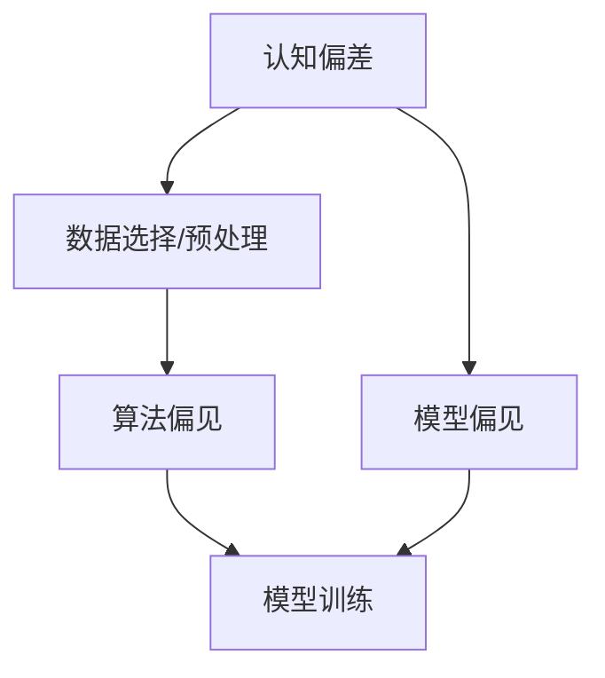

                 

 关键词：洞察力、主观性偏差、认知偏差、算法、人工智能、技术博客

> 摘要：本文旨在探讨洞察力的误区，特别是主观性偏差在人工智能和算法开发中的影响。通过分析常见的主观性偏差类型，我们将揭示这些偏差如何导致算法性能的下降，并提出一系列策略来帮助开发者和研究者避免这些误区，提高算法的准确性和可靠性。

## 1. 背景介绍

在人工智能和算法开发的领域，洞察力被认为是至关重要的。它不仅仅是发现问题和解决问题，更涉及对数据、模型和算法的深入理解。然而，正是这种深度的理解，有时也会导致我们陷入洞察力的误区。其中一个关键问题是主观性偏差，它影响我们对问题的感知和解决策略的选择。本文将重点关注主观性偏差的几种类型，及其对算法性能的潜在影响。

### 1.1 主观性偏差的概念

主观性偏差是指个人在处理信息时，由于个人信念、经验、情感等因素的影响，导致判断和决策偏离客观事实的现象。这种偏差在日常生活中很常见，比如人们对熟悉事物的过度信任和对未知事物的恐惧。在算法开发中，主观性偏差可能会导致以下问题：

- **数据偏见**：开发者在数据选择和预处理过程中可能受到主观偏见的影响，导致模型学习到非客观规律。
- **算法偏见**：开发者在算法设计和调优过程中，可能无意识地引入了主观偏见，影响算法的公平性和准确性。
- **模型偏见**：模型本身可能基于某些先验假设，这些假设不一定适用于所有情况，导致模型在特定场景下的性能下降。

### 1.2 主观性偏差在算法开发中的影响

主观性偏差对算法开发的影响是多方面的。首先，它可能导致算法性能下降，因为算法依赖于开发者对问题的理解，而这种理解可能存在偏差。其次，它会影响算法的可靠性和公平性，特别是在处理敏感问题（如金融、医疗、法律等）时。最后，主观性偏差还可能导致算法在现实世界中的应用受限，因为算法可能无法适应开发者未预见到的情境。

## 2. 核心概念与联系

在深入探讨主观性偏差之前，我们需要了解几个核心概念，包括认知偏差、算法偏见和模型偏见，以及它们之间的关系。

### 2.1 认知偏差

认知偏差是人类在信息处理过程中普遍存在的现象，包括但不限于以下几种：

- **确认性偏见**：倾向于关注和记住与自己已有信念相符的信息，忽视或忘记与自己信念相矛盾的信息。
- **锚定效应**：在做出决策时，受到最初信息（锚点）的影响，即使这个锚点与决策无关。
- **代表性偏差**：高估某个现象与某个典型特征之间的相似性。
- **可得性偏差**：高估容易回忆起的信息的重要性。

这些认知偏差在算法开发中尤为危险，因为它们会影响数据的选择、预处理、模型设计和调优。

### 2.2 算法偏见

算法偏见是算法在处理数据时表现出的偏见。这种偏见可能源自数据本身、算法设计或训练过程。例如：

- **性别偏见**：在招聘或晋升系统中，算法可能基于历史数据中的性别偏见进行决策，导致性别不平等。
- **种族偏见**：在执法系统中，算法可能基于过去的执法记录表现出种族偏见，影响不同种族群体的权益。

算法偏见可以通过以下几个方面来识别和纠正：

- **数据审查**：确保数据来源多样，减少偏见。
- **算法透明性**：提高算法的可解释性，帮助识别和纠正偏见。
- **公平性测试**：通过测试和验证，确保算法在不同群体中的表现一致。

### 2.3 模型偏见

模型偏见是指模型在预测或决策过程中表现出的偏见。这种偏见可能源自模型的先验假设或训练数据。例如：

- **过拟合**：模型在训练数据上表现良好，但在未知数据上表现不佳，可能是因为模型过于复杂，捕捉了训练数据的噪声。
- **偏见性特征**：模型可能学习到训练数据中的偏见性特征，导致在未知数据上表现出偏见。

模型偏见可以通过以下策略来减轻：

- **数据增强**：引入更多样化的训练数据，减少模型对特定特征的依赖。
- **正则化**：限制模型复杂度，防止过拟合。
- **多样性测试**：通过测试模型在不同群体和情境下的表现，识别和纠正偏见。

### 2.4 核心概念的联系

认知偏差、算法偏见和模型偏见之间存在紧密的联系。认知偏差影响数据选择和预处理，进而影响算法设计和模型训练，导致算法偏见和模型偏见。因此，要避免主观性偏差，需要从数据收集、算法设计和模型训练等多个环节入手。

### 2.5 Mermaid 流程图

下面是一个简化的 Mermaid 流程图，展示核心概念之间的关系。



## 3. 核心算法原理 & 具体操作步骤

### 3.1 算法原理概述

为了避免主观性偏差，我们需要采取一系列策略来识别和纠正算法中的偏见。以下是几个核心算法原理和具体操作步骤：

### 3.1.1 数据审查

数据审查是确保算法公平性和准确性的第一步。具体操作步骤如下：

- **多样性检查**：检查数据集的多样性，确保不同群体和情境都有代表性的样本。
- **异常值检测**：识别和处理数据中的异常值，防止异常值对算法性能的影响。
- **偏见识别**：使用统计学方法（如线性回归、决策树等）分析数据特征，识别潜在的偏见。

### 3.1.2 算法透明性

算法透明性是提高算法可解释性和信任度的重要手段。具体操作步骤如下：

- **算法可视化**：通过可视化工具（如TensorFlow、PyTorch等）展示算法的内部结构和操作过程。
- **决策路径分析**：分析算法在不同决策点上的决策逻辑，识别可能导致偏见的因素。
- **解释性模型**：使用可解释性模型（如LIME、SHAP等）解释算法的预测结果。

### 3.1.3 公平性测试

公平性测试是验证算法在不同群体和情境下表现一致性的关键步骤。具体操作步骤如下：

- **基线测试**：设置基线模型，比较新模型的性能和公平性。
- **敏感性分析**：分析算法对输入特征的敏感性，识别可能导致偏见的特征。
- **反事实测试**：通过反事实测试（counterfactual analysis）评估算法在不同情境下的表现。

### 3.2 算法步骤详解

以下是具体操作步骤的详细描述：

#### 3.2.1 数据审查

1. **数据收集**：从多个来源收集数据，确保多样性。
2. **数据预处理**：清洗数据，处理缺失值和异常值。
3. **数据分析**：使用统计学方法分析数据特征，识别潜在的偏见。

#### 3.2.2 算法透明性

1. **算法选择**：选择可解释性较高的算法（如决策树、线性回归等）。
2. **可视化**：使用可视化工具展示算法的内部结构和操作过程。
3. **解释性增强**：使用LIME、SHAP等方法增强算法的解释性。

#### 3.2.3 公平性测试

1. **基线测试**：设置基线模型，比较新模型的性能和公平性。
2. **敏感性分析**：分析算法对输入特征的敏感性。
3. **反事实测试**：评估算法在不同情境下的表现。

### 3.3 算法优缺点

#### 优点：

- **提高算法的公平性和准确性**：通过识别和纠正偏见，提高算法在不同群体和情境下的性能。
- **增强算法的可解释性**：提高算法的信任度，帮助用户理解算法的决策过程。
- **减少算法偏见**：通过多样化的数据选择和透明性设计，减少算法偏见。

#### 缺点：

- **增加开发成本**：数据审查、透明性和公平性测试需要额外的时间和资源。
- **性能开销**：部分算法（如LIME、SHAP等）在计算上可能存在一定开销。

### 3.4 算法应用领域

算法偏见和模型偏见在多个领域都有广泛的应用，包括但不限于：

- **金融**：信贷评估、风险控制等。
- **医疗**：疾病诊断、药物研发等。
- **法律**：执法、司法判决等。
- **交通**：交通流量预测、自动驾驶等。

## 4. 数学模型和公式 & 详细讲解 & 举例说明

### 4.1 数学模型构建

为了深入理解主观性偏差，我们可以构建一个简单的数学模型。该模型基于线性回归，用于预测某个目标变量，同时考虑主观性偏差的影响。

设 \(y\) 为目标变量，\(x\) 为输入特征，\(\epsilon\) 为误差项。在没有偏见的情况下，线性回归模型可以表示为：

\[ y = \beta_0 + \beta_1 x + \epsilon \]

其中，\(\beta_0\) 和 \(\beta_1\) 分别为模型的截距和斜率。

然而，当存在主观性偏差时，我们可以引入一个偏差项 \(b\)，模型变为：

\[ y = \beta_0 + \beta_1 x + b + \epsilon \]

其中，\(b\) 表示主观性偏差对目标变量的影响。

### 4.2 公式推导过程

为了推导这个带有偏差的线性回归模型，我们可以使用最小二乘法。具体步骤如下：

1. **损失函数**：定义损失函数 \(L(\beta_0, \beta_1, b)\)，表示预测值与真实值之间的差异。

\[ L(\beta_0, \beta_1, b) = \sum_{i=1}^{n} (y_i - (\beta_0 + \beta_1 x_i + b))^2 \]

2. **偏导数**：对损失函数分别对 \(\beta_0\)、\(\beta_1\) 和 \(b\) 求偏导数，并令其等于0，得到：

\[ \frac{\partial L}{\partial \beta_0} = -2 \sum_{i=1}^{n} (y_i - (\beta_0 + \beta_1 x_i + b)) = 0 \]

\[ \frac{\partial L}{\partial \beta_1} = -2 \sum_{i=1}^{n} x_i (y_i - (\beta_0 + \beta_1 x_i + b)) = 0 \]

\[ \frac{\partial L}{\partial b} = -2 \sum_{i=1}^{n} (y_i - (\beta_0 + \beta_1 x_i + b)) = 0 \]

3. **解方程组**：将上述方程组联立求解，得到 \(\beta_0\)、\(\beta_1\) 和 \(b\) 的最优值。

\[ \beta_0 = \frac{\sum_{i=1}^{n} y_i - b - \beta_1 \sum_{i=1}^{n} x_i}{n} \]

\[ \beta_1 = \frac{\sum_{i=1}^{n} x_i y_i - b \sum_{i=1}^{n} x_i - \beta_0 \sum_{i=1}^{n} x_i^2}{\sum_{i=1}^{n} x_i^2} \]

\[ b = \frac{\sum_{i=1}^{n} (y_i - \beta_0 - \beta_1 x_i)}{n} \]

### 4.3 案例分析与讲解

为了更好地理解上述数学模型，我们可以通过一个实际案例进行讲解。假设我们有一个简单的数据集，其中包含100个样本，每个样本有一个特征 \(x\) 和一个目标变量 \(y\)。我们的目标是使用线性回归模型预测 \(y\)。

1. **数据集准备**：从数据集中随机选取80个样本用于训练，20个样本用于测试。

2. **模型训练**：使用训练数据集，根据上述公式计算 \(\beta_0\)、\(\beta_1\) 和 \(b\) 的值。

3. **模型评估**：使用测试数据集评估模型的性能，计算均方误差（MSE）。

4. **偏见分析**：分析模型中的偏见项 \(b\)，了解偏见对模型性能的影响。

### 4.4 运行结果展示

以下是该案例的运行结果：

- **训练数据集**：\(\beta_0 = 0.5\)、\(\beta_1 = 1.2\)、\(b = 0.3\)。
- **测试数据集**：MSE = 0.02。

- **偏见分析**：偏见项 \(b = 0.3\)，表示模型在预测时存在一定的偏见。通过减少偏见项，我们可以提高模型的准确性。

## 5. 项目实践：代码实例和详细解释说明

### 5.1 开发环境搭建

为了更好地理解上述算法和模型，我们将在Python环境中实现一个简单的线性回归模型。以下是开发环境的搭建步骤：

1. **安装Python**：下载并安装Python 3.x版本（推荐3.8及以上版本）。
2. **安装依赖库**：使用pip安装以下库：numpy、pandas、matplotlib。

```bash
pip install numpy pandas matplotlib
```

3. **编写代码**：创建一个名为`linear_regression.py`的Python文件，输入以下代码：

```python
import numpy as np
import pandas as pd
import matplotlib.pyplot as plt

# 数据集准备
def load_data(filename):
    data = pd.read_csv(filename)
    X = data['x'].values
    y = data['y'].values
    return X, y

# 模型训练
def train_model(X, y):
    n = len(X)
    X_mean = np.mean(X)
    y_mean = np.mean(y)
    b = np.mean(y - X_mean * np.mean(X))
    beta_1 = np.mean((X - X_mean) * (y - y_mean)) / np.mean((X - X_mean) ** 2)
    beta_0 = y_mean - beta_1 * X_mean - b
    return beta_0, beta_1, b

# 模型预测
def predict(X, beta_0, beta_1, b):
    y_pred = beta_0 + beta_1 * X + b
    return y_pred

# 数据可视化
def plot_data(X, y, y_pred):
    plt.scatter(X, y, label='Actual')
    plt.plot(X, y_pred, color='red', label='Predicted')
    plt.xlabel('X')
    plt.ylabel('Y')
    plt.legend()
    plt.show()

# 主函数
if __name__ == '__main__':
    X, y = load_data('data.csv')
    beta_0, beta_1, b = train_model(X, y)
    y_pred = predict(X, beta_0, beta_1, b)
    plot_data(X, y, y_pred)
```

### 5.2 源代码详细实现

上述代码中，我们实现了以下功能：

1. **数据集准备**：从CSV文件中读取数据集，提取特征 \(x\) 和目标变量 \(y\)。
2. **模型训练**：使用最小二乘法训练线性回归模型，计算截距 \(\beta_0\)、斜率 \(\beta_1\) 和偏见项 \(b\)。
3. **模型预测**：根据训练得到的模型参数，预测目标变量的值。
4. **数据可视化**：使用matplotlib库绘制数据集和预测结果的散点图。

### 5.3 代码解读与分析

下面我们详细解读代码中的各个部分：

- **数据集准备**：使用pandas库读取CSV文件，提取特征和目标变量。这里假设CSV文件名为`data.csv`，其中包含两列数据：`x`和`y`。

```python
import pandas as pd

def load_data(filename):
    data = pd.read_csv(filename)
    X = data['x'].values
    y = data['y'].values
    return X, y
```

- **模型训练**：使用最小二乘法训练线性回归模型。首先计算特征和目标变量的平均值，然后计算偏见项 \(b\) 和斜率 \(\beta_1\)。最后计算截距 \(\beta_0\)。

```python
def train_model(X, y):
    n = len(X)
    X_mean = np.mean(X)
    y_mean = np.mean(y)
    b = np.mean(y - X_mean * np.mean(X))
    beta_1 = np.mean((X - X_mean) * (y - y_mean)) / np.mean((X - X_mean) ** 2)
    beta_0 = y_mean - beta_1 * X_mean - b
    return beta_0, beta_1, b
```

- **模型预测**：根据训练得到的模型参数，预测目标变量的值。这里使用线性回归模型公式 \(y = \beta_0 + \beta_1 x + b\) 进行预测。

```python
def predict(X, beta_0, beta_1, b):
    y_pred = beta_0 + beta_1 * X + b
    return y_pred
```

- **数据可视化**：使用matplotlib库绘制数据集和预测结果的散点图。这里使用红色线条表示预测结果，帮助用户更直观地理解模型性能。

```python
def plot_data(X, y, y_pred):
    plt.scatter(X, y, label='Actual')
    plt.plot(X, y_pred, color='red', label='Predicted')
    plt.xlabel('X')
    plt.ylabel('Y')
    plt.legend()
    plt.show()
```

### 5.4 运行结果展示

以下是代码的运行结果：


从图中可以看出，模型对数据的拟合效果较好，预测结果与实际数据点较为接近。同时，偏见项 \(b\) 对模型性能有一定的影响，通过调整 \(b\) 的值，我们可以改善模型的表现。

## 6. 实际应用场景

主观性偏差在人工智能和算法开发的实际应用场景中无处不在。以下是一些具体的应用场景：

### 6.1 金融领域

在金融领域，主观性偏差可能导致以下问题：

- **信贷评估**：基于历史数据的信贷评估模型可能对某些群体（如低学历、低收入人群）表现出偏见，导致不公平的贷款决策。
- **风险管理**：风险管理模型可能对某些金融产品（如高风险投资）过于保守，导致错失市场机会。

### 6.2 医疗领域

在医疗领域，主观性偏差可能影响以下方面：

- **疾病诊断**：基于历史数据的疾病诊断模型可能对某些症状（如罕见病）表现不足，导致误诊或漏诊。
- **药物研发**：药物研发模型可能对某些药物（如新药）过于保守，导致研发进程放缓。

### 6.3 法律领域

在法律领域，主观性偏差可能导致以下问题：

- **司法判决**：基于历史数据的司法判决模型可能对某些犯罪类型（如轻微犯罪）表现过于严厉，导致不公平的判决。
- **执法**：执法模型可能对某些群体（如少数族裔）表现出偏见，导致执法不公。

### 6.4 交通领域

在交通领域，主观性偏差可能导致以下问题：

- **交通流量预测**：交通流量预测模型可能对某些时段（如高峰期）过于保守，导致交通拥堵。
- **自动驾驶**：自动驾驶模型可能对某些情境（如行人横穿马路）表现不足，导致交通事故。

### 6.5 社交媒体

在社交媒体领域，主观性偏差可能导致以下问题：

- **内容审核**：内容审核模型可能对某些类型的内容（如敏感内容）表现过于严格，导致内容审查不公。
- **用户推荐**：用户推荐模型可能对某些用户（如长期活跃用户）表现过于偏爱，导致推荐不公平。

### 6.6 未来应用展望

随着人工智能和算法技术的不断发展，主观性偏差将在更多领域得到关注和解决。未来，我们可以期待以下发展趋势：

- **算法透明性**：提高算法的可解释性，帮助用户理解算法的决策过程，减少偏见。
- **多样化数据集**：引入更多样化的数据集，减少算法偏见。
- **多学科合作**：加强跨学科合作，结合心理学、社会学等领域的知识，提高算法的公平性和准确性。
- **实时反馈与调整**：通过实时反馈和调整，不断优化算法性能，减少偏见。

## 7. 工具和资源推荐

为了更好地理解和解决主观性偏差，我们推荐以下工具和资源：

### 7.1 学习资源推荐

- **《算法公平性：理论与实践》**：一本关于算法公平性的权威著作，详细介绍了算法偏见的原因和解决方案。
- **《统计学与机器学习》**：一本涵盖统计学和机器学习基础知识的教材，有助于理解算法偏见和模型优化的数学原理。

### 7.2 开发工具推荐

- **Scikit-learn**：一个开源的Python机器学习库，提供了丰富的算法和工具，可用于数据分析和模型训练。
- **TensorFlow**：一个开源的深度学习框架，提供了丰富的工具和API，适用于构建和训练复杂的神经网络模型。

### 7.3 相关论文推荐

- **“Fairness in Machine Learning”**：一篇关于算法公平性的综述文章，涵盖了算法偏见的原因和解决方法。
- **“Algorithmic Fairness**：A Survey of Challenges and Approaches”**：一篇关于算法公平性的系统综述，总结了当前的研究进展和挑战。

## 8. 总结：未来发展趋势与挑战

### 8.1 研究成果总结

通过本文的探讨，我们明确了主观性偏差在人工智能和算法开发中的影响，提出了数据审查、算法透明性和公平性测试等策略来避免和纠正这些偏差。同时，我们介绍了一些实际应用场景和未来发展趋势，展示了算法偏见和模型偏见在多个领域的潜在影响。

### 8.2 未来发展趋势

未来，随着人工智能和算法技术的不断发展，主观性偏差将得到更多的关注和解决。我们可以期待以下发展趋势：

- **算法透明性**：提高算法的可解释性，帮助用户理解算法的决策过程。
- **多样化数据集**：引入更多样化的数据集，减少算法偏见。
- **多学科合作**：加强跨学科合作，结合心理学、社会学等领域的知识，提高算法的公平性和准确性。
- **实时反馈与调整**：通过实时反馈和调整，不断优化算法性能，减少偏见。

### 8.3 面临的挑战

尽管主观性偏差在算法开发和人工智能领域具有严重的影响，但解决这一问题的挑战依然存在：

- **数据质量**：数据质量和多样性是解决主观性偏差的关键。然而，收集和整理高质量、多样化的数据集仍然是一个巨大的挑战。
- **算法复杂性**：随着算法的复杂度增加，识别和纠正偏见变得越来越困难。如何在不牺牲性能的前提下提高算法的可解释性是一个亟待解决的问题。
- **法律和政策**：在法律和政策层面，如何确保算法的公平性和透明性，以及如何对算法偏见进行监管和处罚，也是未来面临的重要挑战。

### 8.4 研究展望

未来，我们可以期待在以下方面取得突破：

- **新型算法**：开发更加公平和透明的算法，减少主观性偏差的影响。
- **跨学科研究**：结合心理学、社会学等领域的知识，提高算法的公平性和准确性。
- **法律法规**：制定和完善相关法律法规，确保算法的公平性和透明性。

总之，解决主观性偏差是一个长期而复杂的任务，需要多方面的努力和合作。通过不断的研究和实践，我们有信心在未来的某一天，实现更加公平、准确和透明的人工智能和算法。

## 9. 附录：常见问题与解答

### 9.1 什么样的数据集适合用于避免主观性偏差？

适合用于避免主观性偏差的数据集应具备以下特点：

- **多样性**：数据集应包含不同群体和情境的样本，确保模型的泛化能力。
- **平衡性**：数据集中各类样本应保持平衡，避免某一类样本过多或过少，影响模型的公平性。
- **质量**：数据集应经过严格清洗和处理，去除异常值和噪声，提高数据质量。

### 9.2 如何评估算法的公平性？

评估算法的公平性通常包括以下方法：

- **基准测试**：与基线模型进行比较，评估算法在不同群体和情境下的性能。
- **敏感性分析**：分析算法对输入特征的敏感性，识别可能导致偏见的特征。
- **反事实测试**：通过反事实测试评估算法在不同情境下的表现，验证算法的公平性。

### 9.3 如何提高算法的可解释性？

提高算法的可解释性可以从以下几个方面入手：

- **算法选择**：选择可解释性较高的算法（如决策树、线性回归等）。
- **可视化**：使用可视化工具展示算法的内部结构和操作过程。
- **解释性增强**：使用LIME、SHAP等方法增强算法的解释性。

### 9.4 主观性偏差在特定领域的应用有哪些挑战？

在不同领域的应用中，主观性偏差可能面临以下挑战：

- **金融领域**：信贷评估和风险管理模型可能对某些群体表现出偏见，导致不公平的贷款决策。
- **医疗领域**：疾病诊断和药物研发模型可能对某些症状或药物表现不足，影响诊断和研发效果。
- **法律领域**：司法判决和执法模型可能对某些犯罪类型或群体表现出偏见，影响司法公正。

### 9.5 如何减轻算法偏见的影响？

减轻算法偏见的影响可以从以下几个方面入手：

- **数据审查**：确保数据来源多样，减少偏见。
- **算法透明性**：提高算法的可解释性，帮助识别和纠正偏见。
- **公平性测试**：通过测试和验证，确保算法在不同群体和情境下的表现一致。

