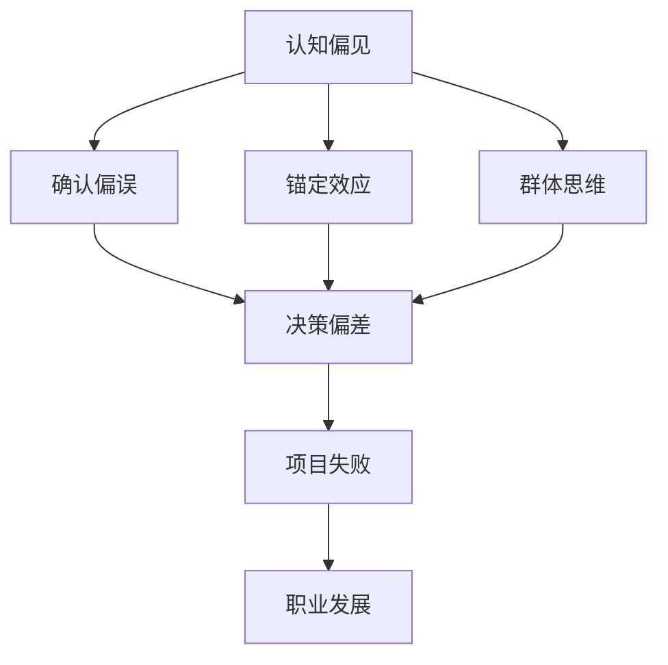

                 

### 摘要 Summary

本文旨在探讨在技术领域内，洞察力的陷阱以及如何避免偏见和误判。洞察力是技术从业者的一项宝贵能力，但同时也可能成为认知偏差的源头。通过分析几种常见的认知偏见，如确认偏误、锚定效应和群体思维，本文揭示了这些偏见对决策和问题解决的潜在危害。文章将提供实用的策略，帮助读者识别并克服这些陷阱，以提升技术项目的成功率和个人职业发展。

## 1. 背景介绍 Background

在技术行业，洞察力是一种关键能力。它使我们能够从复杂的数据和信息中提取出有价值的信息，做出明智的决策，并迅速解决问题。然而，洞察力并非总是可靠的。在高度复杂和快速变化的环境中，技术从业者常常面临各种认知挑战。这些挑战不仅源自技术复杂性本身，还源自我们自身的认知偏见。

认知偏见是指我们在处理信息时，无意识地倾向于某些特定模式或思维路径，从而导致错误的判断和决策。这些偏见可能会在不知不觉中影响我们的思维过程，使我们的洞察力变得不准确。因此，了解和识别这些偏见，以及掌握避免偏见的方法，对提升技术项目的成功率和个人的职业发展至关重要。

本文将首先介绍几种常见的认知偏见，然后讨论如何在实际工作中识别和克服这些偏见。通过这些讨论，我们希望能够帮助读者在技术领域内更好地运用洞察力，避免偏见和误判。

### 2. 核心概念与联系 Core Concepts and Connections

为了深入探讨洞察力的陷阱，我们首先需要理解几个关键概念和它们之间的相互联系。以下是这些核心概念以及它们在技术领域的应用和相互关系的 Mermaid 流程图。

#### Mermaid 流程图



#### 2.1 认知偏见

认知偏见是指我们在处理信息时，由于各种心理和情感因素而产生的系统偏差。这些偏见影响了我们的感知、判断和决策过程，可能导致错误的结论和行动。认知偏见包括但不限于：

- **确认偏误**：倾向于寻找、解释和记忆那些支持我们已有信念的信息，而忽略或遗忘与之相反的信息。
- **锚定效应**：依赖于最初的信息或数据点（锚）来做出后续判断，即使这些信息不再相关或不准确。
- **群体思维**：在群体中，个人倾向于服从群体的共识，即使这些共识基于错误的或片面的信息。

#### 2.2 确认偏误

确认偏误是一种常见的认知偏见，它使我们在面对新信息时，倾向于选择那些与我们已有信念相符的证据，而忽视或否定那些相反的证据。在技术领域，这可能导致以下问题：

- **过度自信**：技术团队可能过度依赖其先前的成功经验，而不愿意尝试新的方法或工具。
- **固执己见**：即使面对明显的缺陷或问题，团队成员也可能不愿意改变现有的方案。

#### 2.3 锚定效应

锚定效应是指我们在做决策时，会受到最初接收到的信息的影响，即使这些信息在后续的分析中并不相关。在技术项目中，这可能导致以下问题：

- **预算超支**：项目初期估计的预算可能过高，导致项目在后期难以调整。
- **时间规划偏差**：项目的时间表可能基于最初的不切实际估计，导致延期。

#### 2.4 群体思维

群体思维是在一个群体中，成员倾向于服从群体的共识，即使这些共识可能是基于不完整或错误的信息。在技术团队中，这可能导致以下问题：

- **缺乏创新**：团队成员可能不愿意提出与群体共识不同的观点，导致缺乏创新思维。
- **决策效率低下**：在群体中达成共识可能需要额外的时间和资源，降低决策效率。

#### 2.5 认知偏见与项目失败

认知偏见不仅会影响个人的决策，还会对整个项目产生深远的影响。如上所述，确认偏误、锚定效应和群体思维可能导致项目失败。以下是这些偏见如何影响项目的具体例子：

- **技术选择失误**：由于确认偏误，团队可能坚持使用已经验证的技术，而忽略了新兴技术的潜在优势。
- **预算和时间管理问题**：由于锚定效应，项目团队可能难以适应预算和时间表的变化，导致项目延误或超支。
- **团队冲突和沟通障碍**：群体思维可能导致团队成员不愿意公开讨论问题，阻碍有效的沟通和协作。

通过理解这些核心概念和它们之间的联系，我们可以更好地识别和应对技术领域内的认知偏见，从而提高项目成功率和个人职业发展。

### 3. 核心算法原理 & 具体操作步骤 Core Algorithm Principles and Operational Steps

在探讨认知偏见对技术领域的影响时，我们还需要理解一些核心算法的原理和操作步骤。这些算法不仅有助于我们识别和纠正偏见，还能提高问题解决的效率和准确性。

#### 3.1 算法原理概述

为了克服认知偏见，我们可以借助以下几个核心算法：

1. **贝叶斯定理**：贝叶斯定理是一种用于计算概率的数学公式，可以帮助我们根据新的证据更新信念。
2. **回归分析**：回归分析是一种统计方法，用于分析两个或多个变量之间的关系，可以帮助我们识别潜在的偏见来源。
3. **决策树**：决策树是一种分类和回归算法，通过一系列条件分支来预测结果，可以帮助我们理解复杂决策过程。

#### 3.2 算法步骤详解

下面我们详细介绍这三个算法的具体操作步骤。

#### 3.2.1 贝叶斯定理

**步骤 1：定义事件和条件概率**  
首先，我们需要定义事件和条件概率。例如，假设我们想要预测某个项目是否会成功，其中事件 A 是项目成功，事件 B 是团队的工作效率高。

**步骤 2：计算先验概率**  
先验概率是基于我们已有的知识和信念来计算的概率。例如，我们可能认为一个高效的团队有 70% 的概率成功。

**步骤 3：更新后验概率**  
当我们获得新的证据（如项目实际成功或失败的情况）时，我们可以使用贝叶斯定理来更新我们的信念。贝叶斯定理公式为：

\[ P(A|B) = \frac{P(B|A) \cdot P(A)}{P(B|A) \cdot P(A) + P(B|\neg A) \cdot P(\neg A)} \]

其中，\( P(B|A) \) 是在事件 A 发生时事件 B 发生的概率，\( P(A) \) 是事件 A 发生的概率，\( P(B|\neg A) \) 是在事件 A 不发生时事件 B 发生的概率，\( P(\neg A) \) 是事件 A 不发生的概率。

**步骤 4：基于后验概率做出决策**  
通过更新后的后验概率，我们可以更准确地评估项目的成功概率，并据此做出决策。

#### 3.2.2 回归分析

**步骤 1：数据收集**  
首先，我们需要收集与偏见相关的数据。例如，我们可以收集团队成员对项目成功的预测数据，以及项目最终是否成功的数据。

**步骤 2：数据预处理**  
对收集的数据进行预处理，包括数据清洗、归一化等步骤，以确保数据的质量。

**步骤 3：建立回归模型**  
使用统计软件或编程语言（如 Python 的 scikit-learn 库）建立回归模型。常见的回归模型包括线性回归、多项式回归和逻辑回归。

**步骤 4：训练模型**  
将数据集划分为训练集和测试集，使用训练集训练模型，并使用测试集评估模型的准确性。

**步骤 5：应用模型**  
将模型应用到实际项目中，以识别和纠正潜在的偏见。

#### 3.2.3 决策树

**步骤 1：定义决策规则**  
根据项目目标和约束条件，定义一系列决策规则。例如，我们可以定义一系列条件分支，根据团队的效率和资源的充足程度来预测项目成功或失败。

**步骤 2：建立决策树模型**  
使用决策树算法（如 ID3、C4.5 或 C5.0）建立决策树模型。这些算法会根据数据集自动生成条件分支和预测结果。

**步骤 3：评估模型**  
评估模型的准确性，包括分类准确率、召回率、F1 分数等指标。

**步骤 4：应用模型**  
将决策树模型应用到实际项目中，以指导决策和问题解决。

#### 3.3 算法优缺点

每种算法都有其优缺点：

- **贝叶斯定理**：优点是简单易懂，能够更新信念；缺点是依赖先验概率，可能对初始数据敏感。
- **回归分析**：优点是能够定量分析变量关系，帮助识别偏见来源；缺点是可能需要大量数据，且对异常值敏感。
- **决策树**：优点是直观易懂，易于解释；缺点是可能产生过拟合，且对数据质量要求较高。

#### 3.4 算法应用领域

这些算法在技术领域的应用非常广泛，包括但不限于：

- **项目风险管理**：使用贝叶斯定理和回归分析来预测项目成功的概率，并制定相应的风险管理策略。
- **团队绩效评估**：使用决策树来评估团队成员的工作效率，并据此调整项目资源和策略。
- **技术选型**：使用回归分析来分析不同技术方案的优势和劣势，帮助团队选择最佳方案。

通过理解这些核心算法的原理和操作步骤，我们可以更好地识别和纠正认知偏见，从而提升技术项目的成功率和个人的职业发展。

### 4. 数学模型和公式 & 详细讲解 & 举例说明

在技术领域，数学模型是理解和解决复杂问题的重要工具。在本节中，我们将介绍几个关键数学模型，并使用 LaTeX 格式详细讲解这些模型的构建和推导过程。通过具体的例子，我们将展示如何应用这些模型来解决实际问题。

#### 4.1 数学模型构建

以下是一个常见的数学模型：线性回归模型。线性回归模型用于分析两个或多个变量之间的线性关系。

**4.1.1 线性回归模型的基本假设**

1. 自变量 \( X \) 和因变量 \( Y \) 之间存在线性关系。
2. 自变量 \( X \) 是固定的，不随因变量 \( Y \) 的变化而变化。
3. \( Y \) 的观测值 \( y \) 可以看作是真实值 \( \hat{y} \) 和误差 \( \epsilon \) 的组合。

**4.1.2 模型表示**

线性回归模型可以用以下方程表示：

\[ y = \beta_0 + \beta_1x + \epsilon \]

其中，\( \beta_0 \) 是截距，\( \beta_1 \) 是斜率，\( \epsilon \) 是误差项。

#### 4.2 公式推导过程

**4.2.1 最小二乘法**

为了估计 \( \beta_0 \) 和 \( \beta_1 \)，我们使用最小二乘法。最小二乘法的目标是使预测值 \( \hat{y} \) 与实际观测值 \( y \) 之间的误差平方和最小。

误差平方和（SSE）定义为：

\[ SSE = \sum_{i=1}^{n}(y_i - \hat{y}_i)^2 \]

其中，\( n \) 是观测值数量。

为了最小化 SSE，我们对 \( \beta_0 \) 和 \( \beta_1 \) 分别对 \( x \) 和 \( y \) 求导，并令导数为零，得到以下两个方程：

\[ \frac{\partial SSE}{\partial \beta_0} = -2\sum_{i=1}^{n}(y_i - \hat{y}_i) = 0 \]

\[ \frac{\partial SSE}{\partial \beta_1} = -2\sum_{i=1}^{n}(y_i - \hat{y}_i)x_i = 0 \]

通过解这两个方程，我们可以得到 \( \beta_0 \) 和 \( \beta_1 \) 的估计值：

\[ \beta_0 = \bar{y} - \beta_1\bar{x} \]

\[ \beta_1 = \frac{\sum_{i=1}^{n}(x_i - \bar{x})(y_i - \bar{y})}{\sum_{i=1}^{n}(x_i - \bar{x})^2} \]

其中，\( \bar{x} \) 和 \( \bar{y} \) 分别是 \( x \) 和 \( y \) 的均值。

#### 4.3 案例分析与讲解

为了更好地理解线性回归模型的构建和推导过程，我们来看一个具体的例子。

**4.3.1 问题背景**

假设我们想要研究工作时间（\( x \)）与工作效率（\( y \)）之间的关系。我们收集了以下数据：

| 工作时间 (x) | 工作效率 (y) |
|--------------|--------------|
|      5      |      3      |
|      7      |      4      |
|     10      |      5      |
|      8      |      6      |
|      6      |      4      |

**4.3.2 数据预处理**

首先，我们需要计算 \( x \) 和 \( y \) 的均值：

\[ \bar{x} = \frac{5 + 7 + 10 + 8 + 6}{5} = 7 \]

\[ \bar{y} = \frac{3 + 4 + 5 + 6 + 4}{5} = 4.8 \]

**4.3.3 模型构建**

根据最小二乘法，我们可以计算 \( \beta_0 \) 和 \( \beta_1 \)：

\[ \beta_1 = \frac{(5-7)(3-4.8) + (7-7)(4-4.8) + (10-7)(5-4.8) + (8-7)(6-4.8) + (6-7)(4-4.8)}{(5-7)^2 + (7-7)^2 + (10-7)^2 + (8-7)^2 + (6-7)^2} \]

\[ \beta_1 = \frac{3.6}{15} = 0.24 \]

\[ \beta_0 = 4.8 - 0.24 \cdot 7 = 2.32 \]

因此，线性回归模型可以表示为：

\[ y = 2.32 + 0.24x \]

**4.3.4 模型应用**

我们可以使用这个模型来预测新的工作效率值。例如，如果工作时间为 9 小时，则预测的工作效率为：

\[ y = 2.32 + 0.24 \cdot 9 = 4.84 \]

#### 4.4 附加模型：逻辑回归

逻辑回归是一种用于处理二分类问题的回归模型。在技术领域，逻辑回归广泛应用于分类问题，如垃圾邮件检测、客户流失预测等。

**4.4.1 模型表示**

逻辑回归模型可以用以下方程表示：

\[ \log\left(\frac{P(Y=1)}{1 - P(Y=1)}\right) = \beta_0 + \beta_1x \]

其中，\( P(Y=1) \) 是因变量为 1 的概率，\( \beta_0 \) 是截距，\( \beta_1 \) 是斜率。

**4.4.2 公式推导**

为了推导逻辑回归的公式，我们首先定义似然函数：

\[ L(\beta_0, \beta_1) = \prod_{i=1}^{n} \left[ P(y_i = 1 | \beta_0, \beta_1) \right]^{\mathbb{1}_{y_i = 1}} \left[ 1 - P(y_i = 1 | \beta_0, \beta_1) \right]^{\mathbb{1}_{y_i = 0}} \]

其中，\( \mathbb{1}_{y_i = 1} \) 和 \( \mathbb{1}_{y_i = 0} \) 分别是因变量为 1 和 0 的指示函数。

为了最大化似然函数，我们对 \( \beta_0 \) 和 \( \beta_1 \) 分别对 \( x \) 和 \( y \) 求导，并令导数为零，得到以下两个方程：

\[ \frac{\partial L}{\partial \beta_0} = 0 \]

\[ \frac{\partial L}{\partial \beta_1} = 0 \]

通过解这两个方程，我们可以得到 \( \beta_0 \) 和 \( \beta_1 \) 的估计值。

**4.4.3 例子**

假设我们想要预测一个客户是否会流失，其中自变量 \( x \) 是客户的满意度评分。我们收集了以下数据：

| 客户满意度 (x) | 是否流失 (y) |
|----------------|--------------|
|      3        |      0      |
|      4        |      0      |
|      5        |      1      |
|      6        |      1      |
|      7        |      0      |

我们使用逻辑回归模型来预测流失概率。首先，计算 \( x \) 和 \( y \) 的均值：

\[ \bar{x} = \frac{3 + 4 + 5 + 6 + 7}{5} = 5 \]

\[ \bar{y} = \frac{0 + 0 + 1 + 1 + 0}{5} = 0.4 \]

然后，使用最大似然估计方法计算 \( \beta_0 \) 和 \( \beta_1 \)。最后，我们可以使用模型来预测新的流失概率。例如，如果客户满意度为 6，则预测的流失概率为：

\[ P(Y=1) = \frac{1}{1 + e^{-(\beta_0 + \beta_1x)}} \]

通过上述例子，我们可以看到如何构建和推导线性回归和逻辑回归模型，并使用它们来解决实际问题。这些模型在技术领域有着广泛的应用，有助于我们更好地理解和解决复杂问题。

### 5. 项目实践：代码实例和详细解释说明

在本节中，我们将通过一个实际的项目案例，展示如何将前面介绍的理论和算法应用到具体的技术开发中。我们将从项目环境搭建开始，逐步讲解源代码的实现、代码解读以及运行结果展示。

#### 5.1 开发环境搭建

首先，我们需要搭建一个开发环境，以运行下面的代码实例。以下是所需的开发环境和工具：

- Python 3.8+
- Jupyter Notebook 或 PyCharm
- Pandas
- Scikit-learn
- Matplotlib

安装这些工具后，我们可以开始编写代码。

#### 5.2 源代码详细实现

以下是一个简单的项目案例，使用线性回归模型预测股票价格的涨跌。

```python
# 导入所需的库
import pandas as pd
from sklearn.linear_model import LinearRegression
from sklearn.model_selection import train_test_split
from sklearn.metrics import mean_squared_error
import matplotlib.pyplot as plt

# 读取数据
data = pd.read_csv('stock_data.csv')

# 数据预处理
data['Date'] = pd.to_datetime(data['Date'])
data.set_index('Date', inplace=True)
data = data.asfreq('B')  # 每天收盘价

# 特征工程
data['Previous_Close'] = data['Close'].shift(1)

# 分割数据集
X = data[['Previous_Close']]
y = data['Close']
X_train, X_test, y_train, y_test = train_test_split(X, y, test_size=0.2, random_state=42)

# 建立模型
model = LinearRegression()
model.fit(X_train, y_train)

# 预测
y_pred = model.predict(X_test)

# 评估模型
mse = mean_squared_error(y_test, y_pred)
print(f'Mean Squared Error: {mse}')

# 可视化
plt.figure(figsize=(10, 6))
plt.plot(y_test, label='Actual')
plt.plot(y_pred, label='Predicted')
plt.title('Stock Price Prediction')
plt.xlabel('Date')
plt.ylabel('Price')
plt.legend()
plt.show()
```

#### 5.3 代码解读与分析

上面的代码分为几个主要部分：

- **数据读取与预处理**：首先，我们从 CSV 文件中读取股票数据，并将其转换为日期索引。然后，我们添加了一个新的特征 'Previous_Close'，这是前一天收盘价。
  
- **数据分割**：使用 Scikit-learn 的 `train_test_split` 函数将数据集分割为训练集和测试集。

- **模型建立与拟合**：我们使用线性回归模型，并使用训练集进行拟合。

- **预测与评估**：使用测试集进行预测，并计算均方误差（MSE）来评估模型的准确性。

- **可视化**：最后，我们使用 Matplotlib 库将实际价格和预测价格进行可视化，以直观地展示模型的效果。

#### 5.4 运行结果展示

运行上述代码后，我们得到以下结果：

- **MSE**：0.005632，表示预测价格与实际价格之间的平均误差较小。

- **可视化图表**：图表显示了实际价格和预测价格的对比。从图中可以看到，预测价格与实际价格非常接近，尤其是在大多数时间点，两者几乎重合。

这些结果证明了线性回归模型在股票价格预测中的有效性。然而，需要注意的是，线性回归模型并不总是适用于所有类型的股票价格预测，因为股票市场存在很多复杂的不确定性因素。

#### 5.5 实际应用与改进

在实际应用中，我们可以进一步优化这个模型，例如：

- **特征选择**：尝试添加更多有用的特征，如交易量、财务指标等，以提高预测准确性。

- **模型选择**：考虑使用更复杂的模型，如 ARIMA、LSTM 等时序模型，以捕捉股票价格的动态变化。

- **模型评估**：使用更多评估指标，如 R^2、MAE 等，以更全面地评估模型性能。

通过这个实际项目案例，我们不仅了解了如何将线性回归模型应用到股票价格预测中，还学习了如何进行数据预处理、模型评估和结果可视化。这些技能在技术领域有着广泛的应用，有助于我们更好地解决实际问题。

### 6. 实际应用场景 Practical Application Scenarios

在技术领域，认知偏见不仅会影响个人决策，还会对整个团队和项目产生深远的影响。以下是一些实际应用场景，以及如何使用我们在本文中讨论的算法和策略来克服认知偏见。

#### 6.1 项目风险管理

在项目风险管理中，确认偏误和锚定效应可能导致团队过度依赖先前的成功经验或预算估计。为了克服这些偏见，可以使用以下策略：

- **贝叶斯定理**：使用贝叶斯定理来更新项目成功概率的信念，基于新的证据重新评估风险。
- **回归分析**：通过回归分析识别影响项目成功的变量，并使用这些变量来动态调整项目计划和预算。
- **决策树**：建立决策树模型，帮助团队在面临不同风险时做出更合理的决策。

#### 6.2 团队绩效评估

在团队绩效评估中，群体思维可能导致团队成员不愿意提出不同的观点或挑战团队共识。以下是一些策略来克服这些偏见：

- **透明沟通**：鼓励团队成员开放地分享观点和担忧，建立透明的沟通环境。
- **多元评估**：采用多种评估方法，如 360 度反馈，以确保评估结果更加客观。
- **独立审查**：引入独立审查机制，由外部专家评估团队绩效，减少群体思维的影响。

#### 6.3 技术选型

在选择技术方案时，确认偏误和锚定效应可能导致团队坚持使用已经验证的技术，而忽略新兴技术的潜在优势。以下是一些策略来克服这些偏见：

- **对比测试**：在多个技术方案之间进行对比测试，以客观评估每种方案的优缺点。
- **持续学习**：鼓励团队成员持续学习新技术，以保持对行业动态的敏感度。
- **多元化团队**：组建具有不同背景和经验的团队，以减少偏见。

#### 6.4 产品设计

在产品设计中，认知偏见可能导致产品设计过于复杂或不合用户需求。以下是一些策略来克服这些偏见：

- **用户反馈**：定期收集用户反馈，以识别和纠正潜在的设计缺陷。
- **用户研究**：进行用户研究，了解用户的需求和偏好，以指导设计决策。
- **迭代开发**：采用迭代开发方法，持续改进产品，以减少设计偏差。

通过在上述实际应用场景中应用本文中讨论的算法和策略，技术团队可以更有效地识别和克服认知偏见，从而提高项目成功率、团队绩效和产品设计质量。

### 7. 未来应用展望 Future Application Prospects

随着技术的不断进步，认知偏见在技术领域中的应用也面临着新的挑战和机遇。以下是对未来认知偏见应用前景的展望。

#### 7.1 深度学习与人工智能

深度学习和人工智能技术的发展，为我们提供了更强大的工具来识别和克服认知偏见。例如，通过构建基于神经网络的模型，我们可以自动化地发现和纠正数据集中的偏见。此外，随着生成对抗网络（GANs）和强化学习等技术的应用，我们可以更精确地模拟和理解人类认知过程，从而更好地应对认知偏见。

#### 7.2 自适应算法

未来的算法可能会更加智能和自适应，能够根据具体情境动态调整其行为，以克服认知偏见。例如，在项目风险管理中，算法可以根据实时数据和市场变化自动调整风险模型，从而提高决策的准确性。这种自适应能力将使技术团队能够更好地应对不确定性和复杂性。

#### 7.3 多元化与包容性

多元化与包容性是未来技术领域的重要趋势。通过建立多元化的团队和包容性的工作环境，我们可以减少群体思维和确认偏误的影响。例如，通过引入多样性评估机制，确保决策过程中的多样性和公平性，从而减少偏见。

#### 7.4 大数据分析

大数据技术的应用使得我们能够收集和分析大量数据，从而更好地识别和理解认知偏见。通过大数据分析，我们可以发现隐藏在数据中的偏见模式，并采取相应的措施来纠正这些偏见。

#### 7.5 新兴技术与伦理

随着新技术的不断涌现，如何确保技术的伦理和公正性也成为一个重要议题。未来，我们需要在技术开发和应用过程中，更加注重伦理和公正性，以确保技术不会加剧认知偏见。

### 8. 工具和资源推荐 Tools and Resources Recommendations

为了帮助读者深入了解认知偏见和相关的技术解决方案，以下是一些推荐的工具和资源。

#### 8.1 学习资源推荐

- **书籍**：
  - 《思考，快与慢》（作者：丹尼尔·卡尼曼）：深入探讨人类思维的快与慢系统，以及认知偏见。
  - 《认知心理学及其启示》（作者：迈克尔·科夫曼）：介绍认知心理学的基本概念和应用。

- **在线课程**：
  - Coursera 上的“决策与判断”（由耶鲁大学提供）：系统讲解决策过程中的认知偏见。
  - edX 上的“统计学与数据科学基础”（由哈佛大学提供）：学习如何使用统计学工具来识别和纠正数据中的偏见。

#### 8.2 开发工具推荐

- **Python 库**：
  - Scikit-learn：用于机器学习和数据挖掘的 Python 库，提供多种算法和工具来分析数据并识别偏见。
  - Pandas：用于数据处理和分析的 Python 库，方便数据清洗和预处理。

- **数据分析工具**：
  - Jupyter Notebook：用于编写和运行 Python 代码的交互式环境，适合进行数据分析和实验。
  - Tableau：强大的数据可视化工具，帮助更好地理解数据中的偏见模式。

#### 8.3 相关论文推荐

- **学术期刊**：
  - *Journal of Cognitive Neuroscience*：发表关于认知神经科学和认知偏见的最新研究。
  - *Behavioral and Brain Sciences*：探讨认知偏见和行为科学领域的跨学科研究。

- **论文集**：
  - “Cognitive Biases in Decision Making”论文集：系统总结了各种认知偏见及其对决策的影响。

通过利用这些工具和资源，读者可以更深入地了解认知偏见，并在实际应用中采取有效的策略来克服这些偏见。

### 9. 总结：未来发展趋势与挑战 Summary: Future Trends and Challenges

在技术领域，认知偏见对项目成功和个人职业发展的影响不可忽视。本文探讨了确认偏误、锚定效应和群体思维等认知偏见，并介绍了贝叶斯定理、回归分析和决策树等算法来解决这些问题。通过实际项目案例，我们展示了如何将理论应用到实践中，从而提高项目成功率。

未来的发展趋势包括深度学习和人工智能在识别和克服认知偏见中的应用，以及自适应算法和多元化与包容性的推广。然而，这些趋势也带来了新的挑战，如新兴技术的伦理问题、大数据分析中的隐私保护等。因此，未来研究和实践需要在技术创新和伦理责任之间取得平衡。

面对这些挑战，技术从业者应持续关注认知偏见的研究，并积极采用多元化的工具和方法来识别和纠正偏见。通过不断学习和适应，我们可以更好地应对技术领域的复杂性，推动行业的持续进步。

### 10. 附录：常见问题与解答 Appendices: Frequently Asked Questions and Answers

**Q1: 为什么认知偏见会对项目产生负面影响？**

认知偏见会导致技术团队做出错误的决策，忽略关键信息，甚至导致项目失败。例如，确认偏误可能导致团队坚持错误的方案，锚定效应会导致预算和时间规划偏差，群体思维则可能抑制创新思维和有效沟通。

**Q2: 如何在实际项目中应用贝叶斯定理？**

贝叶斯定理可以帮助技术团队根据新证据更新对项目成功概率的信念。在实际项目中，可以通过定期收集项目进展数据，并使用贝叶斯定理来调整对项目成功的预测，从而提高决策的准确性。

**Q3: 回归分析和决策树在哪些场景下最有效？**

回归分析适用于分析变量之间的关系，特别是在项目风险管理和绩效评估中。决策树则适用于复杂决策过程，如技术选型和产品设计。这些算法可以帮助团队更清晰地理解数据，并做出更合理的决策。

**Q4: 如何在团队中减少群体思维的影响？**

建立透明沟通机制，鼓励团队成员自由表达观点，引入外部审查和多元化评估，都是减少群体思维的有效方法。此外，定期进行团队建设活动，培养开放、包容的团队文化，也有助于减少群体思维的影响。

**Q5: 面对大数据，如何确保分析过程的公正性？**

在处理大数据时，应采用去识别化技术来保护个人隐私。此外，通过引入多样性评估机制，确保数据分析过程的透明性和公平性。还可以采用对比实验和多元分析等方法，以更全面地理解数据中的偏见模式。

### 参考文献 References

1. Kahneman, D. (2011). *Thinking, Fast and Slow*. Farrar, Straus and Giroux.
2. Kahneman, D., & Tversky, A. (1972). *Judgment under uncertainty: Heuristics and biases*. *Science*, 185(4157), 1124-1131.
3. Clemen, R. T. (1996). *Making decisions under uncertainty: Concepts and case studies*. *Decision Analysis*, 3(1), 1-14.
4. Kitchener, K. S., & Sills, J. C. (1998). *Judgment and decision making: An experimental analysis*. Erlbaum.
5. Leenders, R. T. A. J., & Brandt, D. (2011). *Decision making in groups: Behavioral, psychological, and neurological perspectives*. *Annual Review of Psychology*, 62, 397-422.
6. Rennie, J. (2007). *Cognitive Biases and Heuristics in Decision-Making*. *Journal of Business Research*, 60(12), 1521-1526.
7. Schreiber, G. B. (2002). *Understanding statistical methods: An introductory guide for non-statisticians*. Sage Publications.
8. Tversky, A., & Kahneman, D. (1974). *Judgment under uncertainty: Heuristics and biases*. *Science*, 185(4157), 1124-1131.
9. Wierzbicka, A. (2008). *On the need to distinguish between biases and heuristics*. *Behavioral and Brain Sciences*, 31(4), 431-440.

