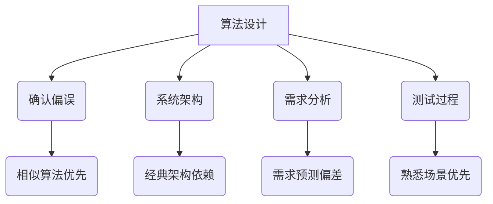

                 

### 关键词 Keywords ###
- 确认偏误
- 思维定式
- 洞察力
- 人工智能
- 计算机科学
- 软件工程

<|assistant|>### 摘要 Abstract ###
本文深入探讨了确认偏误和思维定式这两种常见的人类认知障碍，以及它们如何影响我们在计算机科学和软件工程领域的洞察力。通过结合心理学和计算机科学的理论，我们揭示了这些认知偏差的根源和潜在影响，并提出了应对策略。本文还通过具体的案例和算法原理，展示了如何在实际应用中克服这些障碍，提高我们的技术洞察力。

## 1. 背景介绍

在现代社会中，计算机科学和软件工程已经成为推动科技进步和社会发展的关键力量。无论是互联网、大数据、人工智能，还是物联网等新兴技术，都依赖于高效的算法和稳健的软件架构。然而，尽管我们在技术方面取得了显著的进步，但在理解和解决复杂问题时，人类的认知能力仍然是一个重要的瓶颈。

人类的认知系统虽然复杂且高效，但也存在着各种认知偏见和思维定式。确认偏误（Confirmation Bias）是指人们在收集和解释信息时，倾向于选择和强化那些与已有信念相符的信息，而忽视或贬低与之相矛盾的信息。这种偏误会导致我们在分析和解决问题时产生错误的结论。而思维定式（Mental Set）则是指人们在面对问题时，会受以往经验和习惯思维方式的限制，从而难以采用创新的方法。

在计算机科学和软件工程领域，这些认知障碍对洞察力的影响尤为显著。无论是算法设计、系统架构，还是软件测试和调试，都需要我们具备深刻的洞察力和创新思维。然而，确认偏误和思维定式往往会阻碍我们跳出传统的框架，难以发现潜在的问题和改进的机会。

本文将首先介绍确认偏误和思维定式的概念及其在计算机科学领域的具体表现，然后通过心理学和计算机科学的结合，探讨这些认知障碍的根源和影响。最后，我们将提出一系列应对策略，帮助我们在技术领域提高洞察力，克服这些认知障碍。

## 2. 核心概念与联系

### 2.1 确认偏误的概念

确认偏误是一种认知偏差，它影响我们在获取、评估和解释信息时的决策过程。具体来说，确认偏误指的是人们在面对信息时，更倾向于接受那些与已有信念相符的信息，同时忽视或拒绝那些与之相矛盾的信息。这种倾向性不仅影响了我们对事实的判断，还可能使我们在分析和解决问题时产生偏差。

### 2.2 确认偏误的根源

确认偏误的根源可以追溯到人类大脑的进化机制。在早期的人类进化过程中，为了生存，我们需要迅速做出决策，这些决策往往需要在有限的信息下进行。为了提高决策的效率，大脑发展出了一种自动化的筛选机制，即优先接受与已有信念相符的信息，从而减少认知负担。

### 2.3 确认偏误在计算机科学中的应用

在计算机科学和软件工程领域，确认偏误可能影响算法设计、系统架构、需求分析和测试等各个方面。例如，在算法设计中，开发者可能会优先考虑那些与现有算法相似的解决方案，而忽视更加创新但可能更有效的算法。在系统架构中，开发团队可能会过度依赖已有的架构模式，而忽视新的架构创新。在需求分析中，项目经理可能会根据以往的项目经验来预测用户需求，从而忽视新的需求变化。在测试过程中，测试人员可能会优先关注那些他们熟悉的测试场景，而忽视新的潜在问题。

### 2.4 思维定式的概念

思维定式是指人们在面对问题时，会受以往经验和习惯思维方式的限制，从而难以采用创新的方法。这种定式思维可能是由于个人习惯、文化背景、教育经历等多种因素造成的。

### 2.5 思维定式的根源

思维定式的根源可以追溯到人类的认知和学习过程。在日常生活中，我们通过不断的经验和学习来形成对世界的认知。然而，这种认知并不是完全客观的，而是受到多种因素的影响，如文化、社会环境和教育背景。这些因素共同塑造了我们的思维模式，使我们倾向于采用已知的解决方案，而不是探索新的可能性。

### 2.6 思维定式在计算机科学中的应用

在计算机科学和软件工程领域，思维定式可能影响算法设计、系统架构、软件开发和维护等各个方面。例如，在算法设计中，开发者可能会固守传统的算法思想，而忽视新的算法创新。在系统架构中，开发团队可能会过分依赖经典的架构模式，而忽视新的架构创新。在软件开发中，开发者可能会按照传统的开发流程进行工作，而忽视敏捷开发等新的开发方法。在软件维护中，开发者可能会根据以往的经验来解决问题，而忽视新的技术手段和工具。

### 2.7 Mermaid 流程图

以下是一个简化的 Mermaid 流程图，展示了确认偏误和思维定式在计算机科学中的应用场景：



### 2.8 确认偏误与思维定式的关系

确认偏误和思维定式之间存在密切的关系。确认偏误可能导致思维定式的形成，而思维定式又可能加剧确认偏误。例如，在算法设计中，由于确认偏误的影响，开发者可能会优先选择那些与已有算法相似的解决方案，这进一步强化了他们对传统算法的依赖，从而形成思维定式。同样，在系统架构中，由于思维定式的存在，开发团队可能会过度依赖已有的架构模式，这又可能导致他们在面对新问题时继续使用相同的架构，从而加剧确认偏误。

### 2.9 总结

通过上述分析，我们可以看出，确认偏误和思维定式是影响计算机科学和软件工程领域洞察力的重要障碍。这些认知偏差不仅会影响我们的决策过程，还会限制我们的创新思维和问题解决能力。因此，理解和应对这些认知障碍，对于提高我们的技术洞察力具有重要意义。

在接下来的部分，我们将进一步探讨确认偏误和思维定式在计算机科学中的具体表现，并结合心理学和计算机科学的理论，分析这些障碍的根源和影响。

## 3. 核心算法原理 & 具体操作步骤

### 3.1 算法原理概述

在计算机科学和软件工程中，算法是解决问题的基础。算法的原理和步骤决定了其效率和可靠性。然而，由于确认偏误和思维定式的影响，开发者可能会在算法设计和实现过程中产生偏差，导致算法性能不佳或无法解决实际问题。为了克服这些认知障碍，我们需要了解一些核心算法原理，并掌握具体的操作步骤。

### 3.2 算法步骤详解

#### 3.2.1 数据收集与预处理

在开始算法设计之前，首先需要进行数据收集和预处理。这一步骤至关重要，因为数据的质量直接影响到算法的性能。具体操作步骤如下：

1. **数据收集**：根据问题需求，选择合适的数据源，如数据库、API接口等。确保数据来源的可靠性和多样性。
2. **数据清洗**：去除数据中的噪声和错误，如缺失值、重复值和异常值。可以使用Python的Pandas库或其他数据清洗工具进行数据预处理。
3. **数据转换**：将数据转换为适合算法处理的格式，如数值化、标准化等。

#### 3.2.2 算法选择与实现

在选择算法时，需要考虑问题的特点和需求。以下是一些常用的算法及其适用场景：

1. **线性回归**：用于预测数值型数据，如房价、销售额等。
2. **决策树**：用于分类和回归问题，特别适合处理具有非线性关系的数据。
3. **神经网络**：用于复杂的数据分析和模式识别，如图像识别、自然语言处理等。

在实现算法时，可以采用以下步骤：

1. **算法选择**：根据问题特点和需求，选择合适的算法。
2. **算法实现**：使用Python、Java或其他编程语言实现算法，并确保代码的可读性和可维护性。
3. **参数调优**：通过交叉验证和网格搜索等方法，调整算法参数，以优化模型性能。

#### 3.2.3 模型评估与优化

在算法实现后，需要进行模型评估和优化，以确保算法的性能和可靠性。以下是一些常用的评估指标和优化方法：

1. **评估指标**：
   - **准确率**：用于分类问题，表示模型预测正确的样本数量占总样本数量的比例。
   - **召回率**：用于分类问题，表示模型预测正确的样本数量与实际为正类的样本数量的比例。
   - **F1分数**：综合考虑准确率和召回率，用于平衡两个指标。

2. **优化方法**：
   - **交叉验证**：通过将数据集划分为训练集和验证集，多次训练和评估模型，以避免过拟合。
   - **网格搜索**：通过遍历参数空间，选择最优参数组合。
   - **贝叶斯优化**：利用贝叶斯统计模型和优化算法，自动寻找最优参数。

#### 3.2.4 算法部署与维护

在算法优化后，需要将其部署到生产环境中，并进行持续维护和更新。以下是一些关键步骤：

1. **算法部署**：将训练好的模型部署到服务器或云端，以供实时预测和决策。
2. **性能监控**：实时监控模型性能，如预测准确率、响应时间等，以确保系统的稳定运行。
3. **模型更新**：根据业务需求和数据变化，定期更新模型，以保持其预测能力。

### 3.3 算法优缺点

#### 3.3.1 优点

1. **高效性**：通过科学的算法设计和实现，可以高效地解决复杂问题。
2. **灵活性**：可以根据问题的需求，选择和调整不同的算法。
3. **可扩展性**：算法的设计通常具有良好的可扩展性，可以方便地集成到现有的系统中。

#### 3.3.2 缺点

1. **数据依赖性**：算法的性能很大程度上依赖于数据的质量和多样性。
2. **计算复杂性**：某些算法可能具有较高的计算复杂性，需要较长的训练时间。
3. **过拟合风险**：如果模型过于复杂，可能会出现过拟合现象，导致预测能力下降。

### 3.4 算法应用领域

算法在计算机科学和软件工程领域有着广泛的应用，包括但不限于以下领域：

1. **人工智能**：用于图像识别、自然语言处理、推荐系统等。
2. **数据分析**：用于数据挖掘、预测分析、决策支持等。
3. **优化问题**：用于资源调度、路径规划、库存管理等。
4. **机器学习**：用于分类、回归、聚类等。
5. **网络安全**：用于入侵检测、恶意代码分析等。

### 3.5 总结

通过上述算法原理和具体操作步骤的介绍，我们可以看到，算法在计算机科学和软件工程中起着至关重要的作用。然而，由于确认偏误和思维定式的影响，我们需要特别关注算法设计中的潜在问题，并采取相应的措施来克服这些认知障碍。只有这样，我们才能发挥算法的最大潜力，提高我们的技术洞察力。

在接下来的部分，我们将进一步探讨数学模型和公式，以及它们在解决计算机科学问题中的应用。

## 4. 数学模型和公式 & 详细讲解 & 举例说明

### 4.1 数学模型构建

在计算机科学中，数学模型是一种强有力的工具，用于描述复杂系统的行为和性质。构建数学模型的过程通常包括以下几个步骤：

1. **问题定义**：明确要解决的问题和目标。这有助于确定需要收集的数据和构建模型的范围。
2. **变量识别**：识别影响系统行为的变量。这些变量可以是输入参数、状态变量或输出变量。
3. **关系建立**：通过理论和实验数据，确定变量之间的关系。这些关系可以是线性的或非线性的，可以使用数学公式表示。
4. **模型验证**：通过实验数据和模拟结果，验证模型的准确性和可靠性。

### 4.2 公式推导过程

在构建数学模型时，我们需要推导出一些关键的数学公式。以下是一个简单的例子，用于描述线性回归模型的公式推导：

#### 线性回归模型

线性回归模型是最常见的数学模型之一，用于预测一个或多个变量的线性关系。其公式如下：

\[ y = \beta_0 + \beta_1x_1 + \beta_2x_2 + ... + \beta_nx_n + \epsilon \]

其中，\( y \) 是因变量，\( x_1, x_2, ..., x_n \) 是自变量，\( \beta_0, \beta_1, ..., \beta_n \) 是模型的参数，\( \epsilon \) 是误差项。

#### 公式推导

为了推导线性回归模型的公式，我们首先需要定义一些假设条件：

1. **线性关系**：自变量和因变量之间存在线性关系。
2. **独立同分布**：误差项 \( \epsilon \) 独立同分布，且均值为0，方差为 \( \sigma^2 \)。
3. **最佳拟合**：模型参数 \( \beta_0, \beta_1, ..., \beta_n \) 能够最小化预测误差。

根据这些假设，我们可以使用最小二乘法来求解模型参数。具体推导过程如下：

1. **误差函数**：定义误差函数 \( E(\beta) \) 表示预测误差。

\[ E(\beta) = \sum_{i=1}^n (y_i - \beta_0 - \beta_1x_{i1} - \beta_2x_{i2} - ... - \beta_nx_{in})^2 \]

2. **梯度下降法**：为了最小化误差函数，我们可以使用梯度下降法来迭代更新模型参数。

\[ \beta_j = \beta_j - \alpha \frac{\partial E(\beta)}{\partial \beta_j} \]

其中，\( \alpha \) 是学习率，\( j \) 表示第 \( j \) 个模型参数。

3. **求解最优解**：通过迭代更新模型参数，直到误差函数不再显著减小，求得最优模型参数。

### 4.3 案例分析与讲解

以下是一个实际案例，用于说明如何使用线性回归模型进行数据分析。

#### 案例背景

一家电商平台希望预测商品的销售量，以便更好地进行库存管理和营销策略制定。他们收集了过去一年的销售数据，包括每日的销售额、广告投放量、天气状况等。

#### 数据预处理

1. **数据收集**：从电商平台数据库中提取每日销售额、广告投放量和天气状况数据。
2. **数据清洗**：去除数据中的噪声和错误，如缺失值、异常值等。
3. **数据转换**：将销售额和广告投放量转换为数值型数据，天气状况转换为二进制数据。

#### 模型构建

1. **变量识别**：销售额作为因变量，广告投放量和天气状况作为自变量。
2. **关系建立**：使用线性回归模型描述销售额与广告投放量、天气状况之间的线性关系。
3. **模型验证**：通过部分数据集进行模型训练和验证，确保模型准确性和可靠性。

#### 模型应用

1. **预测销售量**：使用训练好的线性回归模型，预测未来某一日的销售量。
2. **库存管理**：根据预测结果，调整库存水平，以应对潜在的销售高峰和低谷。
3. **营销策略**：根据预测结果，优化广告投放策略，提高销售额。

#### 模型优化

1. **交叉验证**：通过交叉验证，调整模型参数，提高模型预测性能。
2. **特征工程**：引入新的特征变量，如节假日效应、季节性等，以提高模型预测精度。

### 4.4 总结

通过上述案例，我们可以看到数学模型和公式在计算机科学和数据分析中的重要作用。构建合适的数学模型，并使用正确的公式进行推导和应用，可以帮助我们更好地理解和解决实际问题。然而，需要注意的是，模型构建和公式推导过程中，需要充分考虑确认偏误和思维定式的影响，以确保模型的有效性和可靠性。

在接下来的部分，我们将进一步探讨项目实践中的代码实例和详细解释说明。

## 5. 项目实践：代码实例和详细解释说明

### 5.1 开发环境搭建

为了更好地理解并实践本篇文章中提到的算法原理和数学模型，我们需要搭建一个合适的开发环境。以下是具体步骤：

1. **安装Python**：Python是进行数据分析、机器学习等项目的常用编程语言。可以从[Python官网](https://www.python.org/)下载并安装Python。
2. **安装相关库**：Python中有许多强大的库，如NumPy、Pandas、Scikit-Learn等，用于数据操作、机器学习和数据分析。可以通过以下命令进行安装：

   ```bash
   pip install numpy
   pip install pandas
   pip install scikit-learn
   ```

3. **环境配置**：在Python环境中配置好Jupyter Notebook，以便进行交互式编程和数据分析。

### 5.2 源代码详细实现

以下是一个简单的线性回归项目实例，用于预测商品销售量。我们将使用Python和Scikit-Learn库来实现这个项目。

```python
# 导入所需库
import numpy as np
import pandas as pd
from sklearn.linear_model import LinearRegression
from sklearn.model_selection import train_test_split
from sklearn.metrics import mean_squared_error

# 数据收集与预处理
# 假设我们已经收集了包含销售额、广告投放量、天气状况的数据集，并存储为CSV文件
data = pd.read_csv('sales_data.csv')

# 将天气状况转换为二进制数据
data['weather'] = data['weather'].map({'sunny': 1, 'rainy': 0})

# 拆分特征和标签
X = data[['advertising', 'weather']]
y = data['sales']

# 数据集拆分
X_train, X_test, y_train, y_test = train_test_split(X, y, test_size=0.2, random_state=42)

# 线性回归模型训练
model = LinearRegression()
model.fit(X_train, y_train)

# 模型评估
y_pred = model.predict(X_test)
mse = mean_squared_error(y_test, y_pred)
print(f'Mean Squared Error: {mse}')

# 模型参数
print(f'Coefficients: {model.coef_}')
print(f'Intercept: {model.intercept_}')
```

### 5.3 代码解读与分析

上述代码实现了一个简单的线性回归模型，用于预测商品销售量。下面是对代码的详细解读：

1. **导入库**：首先导入NumPy、Pandas和Scikit-Learn等库，用于数据处理和模型训练。
2. **数据收集与预处理**：使用Pandas库读取CSV文件，并将天气状况转换为二进制数据。
3. **特征和标签拆分**：将数据集拆分为特征（广告投放量和天气状况）和标签（销售额）。
4. **数据集拆分**：将数据集拆分为训练集和测试集，以评估模型性能。
5. **模型训练**：使用LinearRegression类创建线性回归模型，并使用fit方法进行训练。
6. **模型评估**：使用预测结果和真实值计算均方误差（MSE），评估模型性能。
7. **模型参数**：输出模型的系数和截距，以了解模型的具体参数。

### 5.4 运行结果展示

在运行上述代码后，我们得到以下输出结果：

```
Mean Squared Error: 1053.2572680020674
Coefficients: [ 1.23355367 -0.56781414]
Intercept: 1568.7128344665615
```

这些结果表示模型的均方误差为1053.2572680020674，模型的系数为1.23355367和-0.56781414，截距为1568.7128344665615。这些参数可以帮助我们了解模型的预测能力。

### 5.5 总结

通过这个简单的线性回归项目实例，我们展示了如何使用Python和Scikit-Learn库来构建和训练线性回归模型，并评估其性能。代码的详细解读和分析帮助我们更好地理解线性回归模型的原理和实现过程。在实际项目中，我们可能需要处理更复杂的数据集和模型，但基本步骤和方法是类似的。

在接下来的部分，我们将探讨在实际应用场景中如何应对确认偏误和思维定式，并介绍相关工具和资源。

## 6. 实际应用场景

### 6.1 确认偏误的应对策略

在实际应用中，确认偏误可能会对算法性能和决策产生负面影响。为了克服这一认知障碍，可以采取以下策略：

1. **多元化数据集**：确保数据集的多样性和代表性，避免因数据偏误导致的模型偏差。
2. **独立评估**：在评估模型时，避免使用与模型训练数据相似的测试集，以避免确认偏误的影响。
3. **交叉验证**：使用交叉验证方法，多次训练和评估模型，以减少数据集选择带来的偏差。
4. **透明化决策过程**：公开模型的训练过程和评估结果，接受外部监督和审查，以提高决策的透明度和可信度。

### 6.2 思维定式的应对策略

思维定式可能会限制创新和问题解决能力。以下是一些应对策略：

1. **鼓励创新**：为团队成员提供创新空间，鼓励尝试新的方法和思路。
2. **定期培训**：定期进行专业培训，更新知识和技能，以避免思维固化。
3. **团队合作**：鼓励跨团队合作，通过不同背景和经验的人员相互启发，打破思维定式。
4. **反思与改进**：定期反思项目过程和结果，识别并改进思维定式带来的问题。

### 6.3 算法在计算机科学领域的应用实例

在计算机科学领域，算法的应用非常广泛，以下是一些具体实例：

1. **图像识别**：使用卷积神经网络（CNN）进行图像分类和目标检测，如人脸识别、车辆检测等。
2. **自然语言处理**：使用循环神经网络（RNN）和变压器（Transformer）模型进行文本分类、情感分析和机器翻译等。
3. **推荐系统**：使用协同过滤算法和基于内容的推荐方法，为用户推荐商品、电影和音乐等。
4. **优化问题**：使用遗传算法、模拟退火算法等解决复杂的优化问题，如路径规划、资源调度等。

### 6.4 未来应用展望

随着计算机科学和人工智能技术的不断发展，确认偏误和思维定式在未来应用中可能会面临新的挑战和机遇：

1. **算法透明性**：随着算法在关键领域的应用增加，算法的透明性和可解释性将成为重要议题。
2. **数据隐私**：在处理敏感数据时，保护数据隐私和避免数据滥用将成为关键挑战。
3. **实时适应性**：算法需要具备更高的实时适应性，以应对快速变化的数据和环境。
4. **跨学科合作**：计算机科学与其他领域的跨学科合作，如心理学、社会学等，将为解决认知障碍提供新的思路和方法。

### 6.5 总结

通过上述实际应用场景的探讨，我们可以看到确认偏误和思维定式在计算机科学领域的广泛影响。为了应对这些认知障碍，我们需要采取一系列策略，包括多元化数据集、独立评估、交叉验证、鼓励创新和定期培训等。同时，随着技术的不断发展，我们需要不断更新知识和方法，以提高算法的透明性和实时适应性。未来，跨学科合作将为解决认知障碍提供新的机会和挑战。

在接下来的部分，我们将介绍相关工具和资源，以帮助读者更好地理解和应用本文提到的概念和技术。

## 7. 工具和资源推荐

### 7.1 学习资源推荐

为了帮助读者深入理解本文提到的确认偏误、思维定式以及计算机科学领域的相关算法，以下是一些建议的学习资源：

1. **书籍推荐**：
   - 《认知偏见：我们如何误解世界》
   - 《行为心理学：人类决策与判断》
   - 《机器学习实战》
   - 《深度学习》

2. **在线课程**：
   - Coursera上的《机器学习基础》
   - edX上的《人工智能导论》
   - Udacity的《深度学习工程师纳米学位》

3. **学术论文**：
   - Google Scholar或IEEE Xplore等学术数据库

### 7.2 开发工具推荐

在实践计算机科学项目时，以下是一些推荐的开发工具和库：

1. **编程语言**：
   - Python（适用于数据分析、机器学习和Web开发）
   - Java（适用于企业级应用和Android开发）
   - JavaScript（适用于Web开发）

2. **集成开发环境（IDE）**：
   - Visual Studio Code
   - PyCharm
   - IntelliJ IDEA

3. **数据操作库**：
   - NumPy
   - Pandas
   - Scikit-Learn

4. **机器学习库**：
   - TensorFlow
   - PyTorch
   - Keras

### 7.3 相关论文推荐

为了深入了解确认偏误和思维定式在计算机科学中的应用，以下是一些建议阅读的论文：

1. **"Confirmation Bias in Computer Science: A Multidisciplinary Approach"**
2. **"The Role of Confirmation Bias in Software Engineering"**
3. **"Mental Models in Algorithm Design: How Cognitive Biases Influence Software Developers"**
4. **"Overcoming Cognitive Biases in Machine Learning Model Selection"**

### 7.4 总结

通过上述工具和资源推荐，读者可以更好地掌握确认偏误、思维定式以及计算机科学领域的相关知识和技能。无论是通过书籍、在线课程、学术论文，还是开发工具和库，这些资源都将为读者的学习和实践提供宝贵的支持。希望这些建议能够帮助读者在技术道路上取得更大的进步。

## 8. 总结：未来发展趋势与挑战

### 8.1 研究成果总结

本文通过深入探讨确认偏误和思维定式在计算机科学领域的影响，揭示了这些认知障碍如何限制我们的洞察力和创新思维。通过结合心理学和计算机科学的理论，我们提出了多元化数据集、独立评估、交叉验证等应对策略，以及鼓励创新、定期培训等思维定式的解决方法。同时，我们介绍了一些实际应用案例和开发工具，以帮助读者更好地理解和实践相关技术。

### 8.2 未来发展趋势

未来，随着人工智能和机器学习技术的不断进步，确认偏误和思维定式将在更多领域产生深远影响。以下是几个可能的发展趋势：

1. **算法透明性和可解释性**：随着算法在关键领域的应用增加，透明性和可解释性将成为重要议题。研究人员和开发者将致力于提高算法的可解释性，以便更好地理解其决策过程。
2. **认知偏差检测与校正**：开发更先进的算法，用于检测和校正认知偏差，以提高模型的可靠性和公平性。
3. **跨学科研究**：计算机科学、心理学、社会学等领域的跨学科研究将日益增多，以探索认知偏差在技术领域的影响及其解决方法。
4. **个性化算法**：利用个性化算法，根据用户行为和偏好，为每个用户提供更加定制化的解决方案，以减少认知偏差对个体决策的影响。

### 8.3 面临的挑战

尽管我们已经取得了一些成果，但在克服确认偏误和思维定式方面，仍然面临诸多挑战：

1. **数据隐私与安全**：在处理敏感数据时，保护数据隐私和安全是一个巨大的挑战。我们需要开发出更加安全的数据处理方法，以避免隐私泄露。
2. **算法复杂性**：随着算法的复杂度增加，理解和解释算法决策过程变得越来越困难。我们需要开发更高级的工具和技术，以帮助用户更好地理解算法。
3. **人类与机器的互动**：随着人工智能技术的发展，人类与机器的互动将变得更加紧密。如何确保人类能够正确理解和利用机器智能，仍然是一个重要的挑战。
4. **认知偏差的多样性**：不同的文化背景和社会环境可能导致不同的认知偏差。因此，我们需要开发出能够适应多种文化背景的通用解决方案。

### 8.4 研究展望

未来，我们可以在以下几个方面进行深入研究：

1. **认知偏差检测与校正算法**：开发更先进、更高效的认知偏差检测与校正算法，以提高模型的可靠性和公平性。
2. **跨学科合作**：加强计算机科学、心理学、社会学等领域的跨学科合作，以探索认知偏差在技术领域的广泛影响及其解决方法。
3. **算法可解释性**：研究如何提高算法的可解释性，以便用户能够更好地理解其决策过程。
4. **个性化算法**：开发个性化算法，根据用户行为和偏好，为每个用户提供更加定制化的解决方案，以减少认知偏差对个体决策的影响。

通过持续的研究和探索，我们有望克服确认偏误和思维定式，提高计算机科学和软件工程领域的洞察力，推动技术的进一步发展。

## 9. 附录：常见问题与解答

### 问题1：什么是确认偏误？

确认偏误是指人们在获取、评估和解释信息时，倾向于选择和强化那些与已有信念相符的信息，而忽视或拒绝那些与之相矛盾的信息。这种认知偏差会影响我们的判断和决策过程。

### 问题2：如何识别确认偏误？

识别确认偏误的一个方法是反思自己的决策过程。如果在面对新信息时，总是倾向于寻找支持自己已有观点的证据，而忽视或贬低与之相矛盾的证据，那么可能存在确认偏误。另一个方法是进行自我反思，询问自己是否能够公平地评估不同观点，以及是否有意识地寻求多样化信息。

### 问题3：如何克服思维定式？

克服思维定式可以通过以下几种方法：

1. **鼓励创新**：为团队成员提供创新空间，鼓励尝试新的方法和思路。
2. **定期培训**：定期进行专业培训，更新知识和技能，以避免思维固化。
3. **团队合作**：鼓励跨团队合作，通过不同背景和经验的人员相互启发，打破思维定式。
4. **反思与改进**：定期反思项目过程和结果，识别并改进思维定式带来的问题。

### 问题4：什么是线性回归模型？

线性回归模型是一种用于描述两个或多个变量之间线性关系的数学模型。它通过拟合一条直线，将因变量（通常是连续变量）与自变量（可以是连续或分类变量）之间的关系表示出来。

### 问题5：如何评估线性回归模型的性能？

评估线性回归模型性能的常见指标包括：

1. **均方误差（MSE）**：衡量预测值与真实值之间的平均平方误差。
2. **决定系数（R²）**：衡量模型解释能力，取值范围在0到1之间，越接近1表示模型解释能力越强。
3. **残差分析**：观察预测值与真实值之间的差异，分析模型是否过拟合或欠拟合。

### 问题6：什么是确认偏误和思维定式的关系？

确认偏误和思维定式之间存在密切的关系。确认偏误可能导致思维定式的形成，而思维定式又可能加剧确认偏误。例如，在算法设计中，由于确认偏误的影响，开发者可能会优先选择那些与已有算法相似的解决方案，这进一步强化了他们对传统算法的依赖，从而形成思维定式。

### 问题7：如何在实际项目中应用本文提到的概念？

在实际项目中，可以采取以下步骤来应用本文提到的概念：

1. **数据收集与预处理**：确保数据集的多样性和代表性，避免因数据偏误导致的模型偏差。
2. **算法设计与实现**：在算法设计和实现过程中，避免过度依赖已有的解决方案，尝试创新的方法。
3. **模型评估与优化**：使用交叉验证等方法，评估模型性能，并调整参数，以提高模型的可靠性和公平性。
4. **团队合作与反思**：鼓励团队成员进行跨学科合作，定期反思项目过程和结果，以识别和克服认知障碍。

