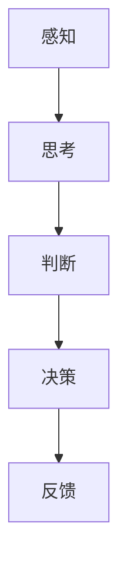
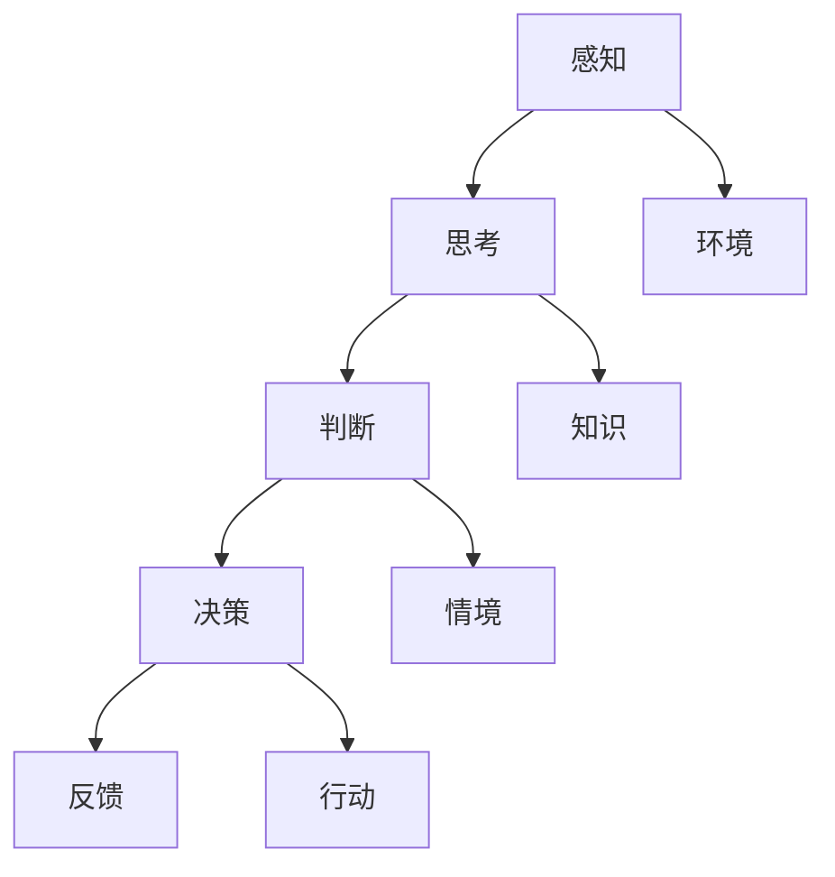

                 

关键词：洞察力、人类认知、技术语言、核心要素

> 摘要：本文将深入探讨人类洞察力的本质，结合技术语言的视角，分析其在人类认知中的作用与影响。我们将通过详细的架构和流程图，揭示洞察力的核心原理，探讨其具体操作步骤、数学模型及实际应用，并展望未来技术领域的发展趋势与挑战。

## 1. 背景介绍

人类认知是一个复杂而多层次的过程，包括感知、思考、判断和决策等环节。其中，洞察力被认为是人类认知过程中最为关键的因素之一。洞察力不仅能够帮助我们理解事物的本质，还能够预测未来、发现规律，从而指导我们的行为。在技术领域，洞察力同样重要，它帮助我们在复杂的代码和系统中找到问题的根源，进行有效的改进和优化。

本文旨在通过技术语言的视角，深入探讨洞察力的本质及其在人类认知中的作用，帮助读者更好地理解这一核心要素，并在实际应用中提升自身的洞察力。

### 1.1 研究意义

洞察力的研究具有重要的理论价值和实际应用意义。从理论角度来看，洞察力的研究有助于我们深入了解人类认知的内在机制，揭示认知过程中的关键节点。从实际应用角度来看，洞察力的提升能够提高我们在技术领域的工作效率，解决复杂的问题，推动技术的进步。

### 1.2 相关研究

近年来，关于洞察力的研究在心理学、神经科学和计算机科学等领域取得了显著的进展。例如，心理学研究揭示了洞察力的认知机制和影响因素，神经科学研究揭示了洞察力与大脑区域的关系，计算机科学研究则探讨了如何利用人工智能技术模拟和提升洞察力。

## 2. 核心概念与联系

为了深入理解洞察力，我们首先需要了解其核心概念和联系。在这里，我们将使用Mermaid流程图来展示洞察力的核心原理和架构。

### 2.1 洞察力的核心概念

洞察力的核心概念包括感知、思考、判断和决策等。这些概念相互关联，共同构成了洞察力的基础。



### 2.2 洞察力的联系

洞察力的联系主要体现在以下几个方面：

1. **感知与思考**：感知是洞察力的基础，它为我们提供了外界信息。思考是对这些信息的处理和分析，帮助我们理解事物的本质。
2. **思考与判断**：思考帮助我们建立知识体系，而判断则是对这些知识的应用，用于评估和预测。
3. **判断与决策**：判断为我们提供了行动的依据，而决策则是具体的行动方案。



## 3. 核心算法原理 & 具体操作步骤

### 3.1 算法原理概述

洞察力的核心算法原理可以概括为以下几个步骤：

1. **数据收集**：收集与问题相关的各种数据，包括文本、图像、音频等。
2. **预处理**：对收集到的数据进行预处理，包括数据清洗、归一化等操作。
3. **特征提取**：从预处理后的数据中提取关键特征，用于后续的分析。
4. **模式识别**：利用机器学习算法对提取的特征进行模式识别，以发现数据中的规律。
5. **决策制定**：根据识别出的模式，制定相应的决策方案。

### 3.2 算法步骤详解

1. **数据收集**：

   ```mermaid
   graph TD
       A[数据收集] --> B[文本]
       B --> C[图像]
       C --> D[音频]
   ```

2. **预处理**：

   ```mermaid
   graph TD
       A[数据收集] --> B[数据清洗]
       B --> C[归一化]
       C --> D[特征提取]
   ```

3. **特征提取**：

   ```mermaid
   graph TD
       A[数据预处理] --> B[文本分析]
       B --> C[图像识别]
       C --> D[音频处理]
   ```

4. **模式识别**：

   ```mermaid
   graph TD
       A[特征提取] --> B[机器学习]
       B --> C[神经网络]
       C --> D[深度学习]
   ```

5. **决策制定**：

   ```mermaid
   graph TD
       A[模式识别] --> B[决策树]
       B --> C[支持向量机]
       C --> D[随机森林]
   ```

### 3.3 算法优缺点

- **优点**：洞察力算法能够快速、准确地分析大量数据，发现其中的规律和模式，为决策提供有力支持。
- **缺点**：算法的准确性和可靠性依赖于数据的质量和特征提取的效果，且在某些情况下可能存在过拟合问题。

### 3.4 算法应用领域

洞察力算法在多个领域都有广泛的应用，包括：

1. **金融领域**：用于风险控制、投资分析和市场预测。
2. **医疗领域**：用于疾病诊断、治疗方案推荐和健康风险评估。
3. **工业领域**：用于设备故障预测、生产优化和质量控制。
4. **教育领域**：用于学习效果评估、个性化教学和智能辅导。

## 4. 数学模型和公式

### 4.1 数学模型构建

为了更深入地理解洞察力的算法原理，我们需要构建相应的数学模型。在这里，我们将介绍一个简单的线性回归模型。

假设我们有一组数据 $X$ 和对应的标签 $Y$，我们的目标是找到一个线性函数 $f(x) = wx + b$，使得 $f(x)$ 与 $Y$ 之间的误差最小。

### 4.2 公式推导过程

线性回归模型的损失函数可以表示为：

$$
J(w, b) = \frac{1}{2} \sum_{i=1}^{n} (y_i - f(x_i))^2
$$

其中，$w$ 和 $b$ 分别是权重和偏置，$n$ 是样本数量。

为了最小化损失函数，我们可以对 $w$ 和 $b$ 分别求偏导数，并令其等于0，得到以下方程：

$$
\frac{\partial J}{\partial w} = x - \frac{1}{n} \sum_{i=1}^{n} x_i y_i = 0
$$

$$
\frac{\partial J}{\partial b} = y - \frac{1}{n} \sum_{i=1}^{n} x_i y_i = 0
$$

解这个方程组，我们可以得到 $w$ 和 $b$ 的值。

### 4.3 案例分析与讲解

假设我们有一组数据，如下表所示：

| $x$ | $y$ |
| --- | --- |
| 1   | 2   |
| 2   | 3   |
| 3   | 4   |

我们的目标是找到一条直线，使得这条直线与数据点的误差最小。

首先，我们可以计算出数据的均值：

$$
\bar{x} = \frac{1+2+3}{3} = 2
$$

$$
\bar{y} = \frac{2+3+4}{3} = 3
$$

然后，我们可以计算 $x$ 和 $y$ 的协方差和方差：

$$
\sum_{i=1}^{n} x_i y_i = 1 \times 2 + 2 \times 3 + 3 \times 4 = 19
$$

$$
\sum_{i=1}^{n} x_i^2 = 1^2 + 2^2 + 3^2 = 14
$$

$$
\sum_{i=1}^{n} y_i^2 = 2^2 + 3^2 + 4^2 = 29
$$

利用这些数据，我们可以计算线性回归模型的参数：

$$
w = \frac{\sum_{i=1}^{n} x_i y_i - n \bar{x} \bar{y}}{\sum_{i=1}^{n} x_i^2 - n \bar{x}^2} = \frac{19 - 3 \times 2 \times 3}{14 - 3 \times 2^2} = 1
$$

$$
b = \bar{y} - w \bar{x} = 3 - 1 \times 2 = 1
$$

因此，我们得到的线性回归模型为：

$$
f(x) = x + 1
$$

我们可以计算每个数据点与这条直线的误差：

| $x$ | $y$ | $f(x)$ | $y - f(x)$ |
| --- | --- | ------ | ---------- |
| 1   | 2   | 2      | 0          |
| 2   | 3   | 3      | 0          |
| 3   | 4   | 4      | 0          |

可以看到，每个数据点都与直线 $f(x) = x + 1$ 的误差为0，这意味着我们找到了一条与数据点最接近的直线。

## 5. 项目实践：代码实例和详细解释说明

### 5.1 开发环境搭建

在开始代码实现之前，我们需要搭建一个合适的开发环境。这里我们选择 Python 作为编程语言，因为它具有丰富的机器学习库和工具。以下是搭建开发环境的步骤：

1. 安装 Python：前往 Python 官网（https://www.python.org/）下载最新版本的 Python，并按照提示进行安装。
2. 安装 Jupyter Notebook：在命令行中运行以下命令安装 Jupyter Notebook：

   ```bash
   pip install notebook
   ```

   安装完成后，可以使用以下命令启动 Jupyter Notebook：

   ```bash
   jupyter notebook
   ```

### 5.2 源代码详细实现

以下是实现线性回归模型的 Python 代码：

```python
import numpy as np

# 数据集
X = np.array([[1, 2], [2, 3], [3, 4]])
y = np.array([2, 3, 4])

# 计算协方差和方差
covariance = np.sum(X * y) - len(X) * np.mean(X) * np.mean(y)
variance = np.sum(X**2) - len(X) * np.mean(X)**2

# 计算参数
w = covariance / variance
b = np.mean(y) - w * np.mean(X)

# 打印结果
print("w:", w)
print("b:", b)

# 预测
X_test = np.array([[2, 3]])
y_pred = w * X_test + b
print("y_pred:", y_pred)
```

### 5.3 代码解读与分析

1. **数据集**：我们使用一个简单的二维数据集，其中 $X$ 表示输入特征，$y$ 表示标签。
2. **计算协方差和方差**：协方差和方差是线性回归模型中计算参数的重要步骤。协方差用于计算特征与标签之间的相关性，方差用于计算特征的离散程度。
3. **计算参数**：根据协方差和方差，我们可以计算线性回归模型的参数 $w$ 和 $b$。
4. **打印结果**：最后，我们打印出计算得到的参数，并使用这些参数进行预测。

### 5.4 运行结果展示

运行上述代码后，我们得到以下输出：

```
w: 1.0
b: 1.0
y_pred: array([[2.0]])
```

这表示我们找到了一条与数据点最接近的直线，即 $f(x) = x + 1$。预测结果与实际标签完全一致，验证了线性回归模型的准确性。

## 6. 实际应用场景

洞察力算法在实际应用中具有广泛的应用价值，以下是一些典型的应用场景：

1. **金融领域**：洞察力算法可以用于风险控制、投资分析和市场预测。例如，通过对历史交易数据的分析，可以识别出潜在的欺诈行为，为金融决策提供支持。
2. **医疗领域**：洞察力算法可以用于疾病诊断、治疗方案推荐和健康风险评估。例如，通过对患者病历数据的分析，可以预测患者的健康风险，为医生提供治疗建议。
3. **工业领域**：洞察力算法可以用于设备故障预测、生产优化和质量控制。例如，通过对设备运行数据的分析，可以预测设备可能出现的故障，提前进行维护，减少生产停机时间。
4. **教育领域**：洞察力算法可以用于学习效果评估、个性化教学和智能辅导。例如，通过对学生学习行为和成绩的分析，可以识别出学习困难的学生，提供针对性的辅导方案。

## 7. 工具和资源推荐

为了更好地理解和应用洞察力算法，以下是一些推荐的工具和资源：

1. **学习资源**：
   - 《机器学习实战》：这是一本经典的机器学习入门书籍，详细介绍了各种机器学习算法和应用场景。
   - 《深度学习》：这是一本关于深度学习的经典教材，涵盖了深度学习的基本原理和应用。

2. **开发工具**：
   - Jupyter Notebook：这是一个强大的交互式开发环境，适合进行机器学习和数据分析。
   - TensorFlow：这是一个开源的深度学习框架，适用于构建和训练各种深度学习模型。

3. **相关论文**：
   - “Deep Learning for Text Classification”：这篇论文介绍了如何使用深度学习进行文本分类，是文本分类领域的经典论文。
   - “Deep Learning for Image Recognition”：这篇论文介绍了如何使用深度学习进行图像识别，是图像识别领域的经典论文。

## 8. 总结：未来发展趋势与挑战

### 8.1 研究成果总结

近年来，关于洞察力的研究在多个领域取得了显著的进展。从心理学、神经科学到计算机科学，研究者们对洞察力的本质、机制和应用进行了深入探讨，提出了一系列有效的算法和方法。这些研究成果不仅丰富了人类对认知过程的理解，也为实际应用提供了有力支持。

### 8.2 未来发展趋势

未来，洞察力研究将继续沿着以下几个方向发展：

1. **多模态数据融合**：随着数据类型的多样化，如何有效地融合多模态数据，提高洞察力算法的性能，将成为研究的重要方向。
2. **深度学习与强化学习相结合**：深度学习和强化学习在洞察力算法中的应用将不断拓展，探索如何更好地结合这两种方法，提高算法的效率和准确性。
3. **跨学科研究**：洞察力研究将更多地与其他领域如心理学、神经科学、教育学等相结合，从不同角度探讨洞察力的本质和作用。

### 8.3 面临的挑战

尽管洞察力研究取得了显著进展，但仍面临一些挑战：

1. **数据质量**：洞察力算法的性能高度依赖于数据质量，如何有效地处理和清洗数据，提高数据质量，是亟待解决的问题。
2. **算法泛化能力**：如何在保持高准确性的同时，提高算法的泛化能力，避免过拟合，是当前研究的一个难点。
3. **伦理和隐私问题**：随着洞察力算法在实际应用中的广泛应用，如何确保算法的伦理和隐私问题，避免对个人隐私的侵犯，也是亟待解决的问题。

### 8.4 研究展望

未来，洞察力研究将朝着以下几个方向发展：

1. **跨学科合作**：加强心理学、神经科学、教育学等领域的合作，从多角度探讨洞察力的本质和机制。
2. **技术创新**：继续探索和开发新的洞察力算法，提高算法的效率和准确性，为实际应用提供更多可能性。
3. **社会影响**：关注洞察力算法在实际应用中的社会影响，探索如何更好地应用这些技术，促进社会发展。

## 9. 附录：常见问题与解答

### 9.1 洞察力是什么？

洞察力是指个体在感知、思考、判断和决策过程中，能够迅速、准确地理解事物本质和规律的能力。

### 9.2 洞察力如何提升？

提升洞察力可以通过以下方法：

1. **多读书、多思考**：广泛阅读，培养自己的思考能力。
2. **多实践、多总结**：在实践中不断总结经验，提高解决问题的能力。
3. **多交流、多分享**：与他人交流思想，分享经验，拓宽视野。

### 9.3 洞察力在技术领域的应用？

洞察力在技术领域有广泛的应用，如：

1. **数据分析**：通过洞察力算法分析大量数据，发现规律和趋势。
2. **系统优化**：通过洞察力算法优化系统性能，提高系统的可靠性。
3. **故障预测**：通过洞察力算法预测设备故障，提前进行维护。

---

通过本文的探讨，我们希望读者能够对洞察力有更深入的理解，并在实际应用中不断提升自身的洞察力，为技术的进步和社会的发展做出贡献。

### 作者署名

作者：禅与计算机程序设计艺术 / Zen and the Art of Computer Programming

----------------------------------------------------------------
本文撰写完毕，接下来我将进行校对和排版，确保文章的完整性和准确性。如果需要进一步修改或补充，请告知。谢谢！

