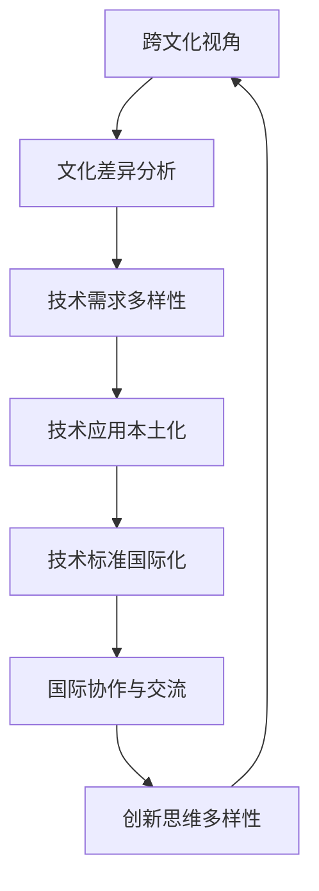

                 

关键词：跨文化理解、多样性、技术交流、国际协作、全球视野、人工智能

> 摘要：本文旨在探讨跨文化视角在理解和应用人工智能技术中的重要性。通过分析当前国际技术交流的现状、文化差异对技术发展的影响，以及如何在多元文化环境中实现高效的国际协作，本文为人工智能领域的研究者和从业者提供了有益的思考方向和实际建议。

## 1. 背景介绍

在全球化进程不断加速的今天，信息技术尤其是人工智能技术的飞速发展正在深刻改变着人类的生活和社会。人工智能的应用领域越来越广泛，从医疗健康到自动驾驶，从金融投资到教育娱乐，无不显示出其强大的变革力量。然而，技术的进步不仅依赖于技术创新，更依赖于人类对技术内涵和外延的深刻理解。

理解是一个复杂而多元的过程，它不仅涉及技术的逻辑与原理，还包括文化背景、语言习惯、思维方式等多方面的因素。不同文化背景下的人们在理解和使用技术时，往往会表现出不同的偏好和行为模式。这种文化差异，既可能是技术协作的障碍，也可能是推动技术发展的重要动力。因此，如何在不同文化之间建立有效的沟通和理解，成为人工智能领域亟待解决的重要问题。

本文将首先回顾当前国际技术交流的现状，分析文化差异对技术发展的影响，然后探讨如何在多元文化环境中实现高效的国际协作，最后提出一些实际的建议和展望。希望通过本文的探讨，能够为人工智能领域的研究者和从业者提供一些有价值的参考和启示。

## 2. 核心概念与联系

为了深入理解跨文化视角在人工智能技术中的应用，我们需要先了解一些核心概念，并探讨它们之间的联系。

### 2.1 跨文化视角的定义

跨文化视角（Intercultural Perspective）是指在不同文化背景下，通过比较和分析文化差异，从而更好地理解和适应其他文化的观点和方法。跨文化视角不仅关注文化的差异，更强调通过交流和互动来促进不同文化之间的相互理解和尊重。

### 2.2 文化差异的影响

文化差异对技术发展的影响主要体现在以下几个方面：

- **创新思维的多样性**：不同文化背景下的研究人员在创新思维和方法上往往存在差异，这种多样性可以激发出新的创新思路，促进技术的进步。

- **技术应用的具体场景**：不同的文化环境对技术的需求和接受程度有所不同，这种差异会影响技术的具体应用场景和推广速度。

- **技术标准的制定**：文化差异也会影响国际技术标准的制定过程，不同国家和地区的利益和诉求需要通过协商和妥协来平衡。

### 2.3 人工智能技术的多元文化联系

人工智能技术的多元文化联系可以从以下几个方面进行阐述：

- **技术需求的多样性**：不同国家和地区对人工智能技术的需求有所不同，这决定了技术的研发和应用方向。

- **技术应用的本土化**：为了更好地适应当地的文化环境，人工智能技术需要在不同地区进行本土化改造。

- **技术标准的国际化**：在全球化背景下，人工智能技术标准的国际化需要考虑不同文化的特点，以实现全球范围内的互操作性。

### 2.4 Mermaid 流程图

为了更直观地展示跨文化视角与人工智能技术的联系，我们可以使用Mermaid流程图来表示（注意：以下为文本格式，实际生成时需要转换为Mermaid图形）：



在这个流程图中，跨文化视角作为起点，通过分析文化差异，影响技术需求、应用本土化和技术标准的国际化，最终促进国际协作和创新思维的多样性。这个过程形成了一个正反馈循环，推动了人工智能技术的全球化发展。

通过上述核心概念与联系的探讨，我们可以更加清晰地认识到跨文化视角在人工智能技术中的重要性和应用价值。在接下来的章节中，我们将进一步深入讨论文化差异对技术发展的影响，并探索如何在多元文化环境中实现高效的国际协作。

## 3. 核心算法原理 & 具体操作步骤

### 3.1 算法原理概述

跨文化视角下的核心算法原理涉及到文化识别、行为分析和策略优化三个主要方面。文化识别算法用于识别不同文化群体的特征，行为分析算法则用于分析这些特征对人工智能系统的影响，而策略优化算法则用于根据分析结果调整系统行为，以更好地适应不同文化环境。

#### 文化识别算法

文化识别算法主要通过两种方式实现：一是基于文化特征库的匹配，二是基于机器学习的自适应识别。文化特征库包含了不同文化群体的语言、习俗、价值观等方面的特征信息。通过与文化特征库的匹配，系统能够快速识别用户的文化背景。而基于机器学习的自适应识别则通过不断学习和更新数据，提高识别的准确性和适应性。

#### 行为分析算法

行为分析算法主要基于行为数据，通过模式识别、机器学习和统计分析等方法，分析不同文化背景下用户的行为特征。这些特征包括但不限于语言表达方式、互动习惯、偏好设置等。通过分析这些特征，系统能够更好地理解用户的需求和行为，从而提供更加个性化的服务。

#### 策略优化算法

策略优化算法的目标是根据行为分析的结果，调整系统的行为策略，以更好地适应不同文化环境。策略优化的方法包括目标优化、动态规划和组合优化等。通过不断调整和优化策略，系统可以在不同的文化环境中实现最优性能。

### 3.2 算法步骤详解

#### 文化识别步骤

1. **数据收集**：收集用户的文化特征数据，包括语言、地理位置、历史背景等。
2. **特征提取**：从收集的数据中提取出与文化相关的特征，如语言习惯、习俗偏好等。
3. **文化识别**：将提取的特征与已建立的文化特征库进行匹配，或使用机器学习模型进行自适应识别。

#### 行为分析步骤

1. **用户行为数据收集**：收集用户在使用人工智能系统时的行为数据，包括交互记录、使用习惯等。
2. **行为数据预处理**：对收集到的行为数据进行清洗、去噪和格式化，使其适合分析。
3. **行为模式识别**：使用模式识别算法，如聚类分析、关联规则挖掘等，识别出用户的行为模式。
4. **文化影响分析**：将识别出的行为模式与文化特征库进行关联，分析文化对行为的影响。

#### 策略优化步骤

1. **策略评估**：根据行为分析结果，评估当前系统策略的适应性和有效性。
2. **目标设定**：设定优化目标，如提高用户满意度、降低错误率等。
3. **策略优化**：使用优化算法，如动态规划、遗传算法等，调整系统策略，以达到优化目标。
4. **策略评估与调整**：对优化后的策略进行评估，根据评估结果进行进一步调整。

### 3.3 算法优缺点

#### 优点

- **提高适应性**：通过文化识别和行为分析，系统能够更好地适应不同文化环境，提供更加个性化的服务。
- **促进国际协作**：跨文化视角有助于不同文化背景的研究者和从业者之间建立有效的沟通和理解，促进国际协作。
- **激发创新思维**：多元文化的交流可以激发出新的创新思路，推动技术进步。

#### 缺点

- **复杂性高**：文化识别和行为分析算法涉及多个方面，系统设计和实现复杂。
- **数据需求大**：文化识别和行为分析需要大量的数据支持，数据收集和处理成本较高。
- **适应性挑战**：在特定文化环境中，可能存在一些特殊的文化现象和行为模式，这需要进一步研究和优化。

### 3.4 算法应用领域

跨文化视角的核心算法在多个领域都有广泛的应用：

- **人工智能客服**：通过文化识别和行为分析，提供更加个性化、贴心的客户服务。
- **跨国企业运营**：帮助企业在不同文化环境中进行战略规划和运营管理。
- **国际教育**：支持跨文化交流和教育，促进不同文化背景的学生之间的理解和互动。
- **全球健康**：在医疗健康领域，通过跨文化视角优化医疗诊断和治疗方案。

通过上述核心算法原理和具体操作步骤的详细讨论，我们可以看到跨文化视角在人工智能技术中的应用潜力和实际价值。在接下来的章节中，我们将进一步探讨数学模型和公式在跨文化视角中的应用，并通过实例进行分析和讲解。

## 4. 数学模型和公式 & 详细讲解 & 举例说明

### 4.1 数学模型构建

在跨文化视角下，构建数学模型是理解和优化人工智能系统行为的关键步骤。数学模型不仅可以帮助我们量化文化差异对技术系统的影响，还可以为策略优化提供理论基础。以下是构建数学模型的一些基本步骤：

#### 4.1.1 文化特征空间定义

首先，我们需要定义一个文化特征空间，这个空间包含所有影响技术系统性能的文化因素。例如，我们可以定义以下特征：

- 语言：包括语言类型、语言习惯等。
- 习俗：包括节庆、礼仪、饮食习惯等。
- 价值观：包括社会价值观、个人价值观等。
- 社会结构：包括家庭结构、社会关系等。

#### 4.1.2 用户行为模型

接下来，我们需要构建一个用户行为模型，该模型可以反映用户在不同文化背景下的行为模式。一个简单的用户行为模型可能包括以下方程：

\[ B = f(C, I, S) \]

其中，\( B \) 表示用户行为，\( C \) 表示文化特征，\( I \) 表示交互环境，\( S \) 表示系统状态。

#### 4.1.3 策略优化模型

为了优化系统策略，我们需要构建一个策略优化模型。这个模型的目标是根据用户行为模型和系统状态，选择最优策略。常见的策略优化模型包括线性规划、非线性规划、动态规划等。

### 4.2 公式推导过程

在构建完数学模型后，我们需要通过公式推导来描述文化差异对系统性能的影响。以下是一个简化的推导过程：

#### 4.2.1 文化影响因子计算

首先，我们定义一个文化影响因子，用于量化文化差异对系统性能的影响。该因子可以通过以下公式计算：

\[ \delta(C) = \sum_{i=1}^{n} w_i \cdot \frac{c_i - c_{base}}{c_{max} - c_{base}} \]

其中，\( \delta(C) \) 表示文化影响因子，\( w_i \) 表示第 \( i \) 个文化特征的权重，\( c_i \) 表示第 \( i \) 个文化特征的当前值，\( c_{base} \) 表示基础值（通常取中位数或平均值），\( c_{max} \) 表示最大值。

#### 4.2.2 系统性能评估

接下来，我们使用文化影响因子来评估系统性能。一个简单的系统性能评估公式可以表示为：

\[ P = P_0 + \delta(C) \cdot \eta \]

其中，\( P \) 表示系统性能，\( P_0 \) 表示基础性能，\( \delta(C) \) 表示文化影响因子，\( \eta \) 表示性能调整系数。

#### 4.2.3 策略优化目标函数

为了优化系统策略，我们需要定义一个策略优化目标函数。这个函数通常包括性能指标和约束条件。一个简单的目标函数可以表示为：

\[ \text{minimize} \quad F(\theta) = P - \alpha \cdot \sum_{i=1}^{n} w_i \cdot \delta(C_i) \]

其中，\( F(\theta) \) 表示目标函数，\( \theta \) 表示策略参数，\( P \) 表示系统性能，\( \alpha \) 表示权重调整系数，\( w_i \) 和 \( \delta(C_i) \) 分别如上所述。

### 4.3 案例分析与讲解

为了更好地理解上述数学模型和公式，我们可以通过一个实际案例来进行说明。假设一个跨国公司需要优化其客服系统的响应策略，以更好地适应不同文化背景的客户。

#### 案例背景

该公司提供多语言客服服务，客户主要来自不同文化背景的国家。客服系统的目标是提供快速、准确和个性化的客户支持。

#### 案例步骤

1. **文化特征识别**：首先，公司收集了客户的文化特征数据，包括语言、习俗和价值观等。通过分析这些数据，公司确定了影响客服系统性能的关键文化特征。

2. **用户行为建模**：基于文化特征数据，公司构建了一个用户行为模型。模型反映了客户在不同文化背景下的行为模式，如语言表达偏好、问题解决习惯等。

3. **策略优化**：公司使用构建的数学模型，根据用户行为模型和系统状态，优化客服系统的响应策略。优化目标是在确保服务质量的基础上，提高客户满意度。

4. **评估与调整**：公司对优化后的策略进行了评估，并根据评估结果进行进一步调整。评估指标包括响应时间、问题解决率、客户满意度等。

#### 案例分析

1. **文化影响因子计算**：公司计算了每个客户的文化影响因子，用于量化文化差异对客服系统性能的影响。例如，对于一位来自亚洲的客户，语言和习俗的影响因子可能较高。

2. **系统性能评估**：公司使用文化影响因子评估客服系统的性能。通过调整策略参数，公司提高了系统在特定文化背景下的性能。

3. **策略优化目标函数**：公司使用策略优化目标函数，根据评估结果调整客服系统的响应策略。优化目标是在确保客户满意度的基础上，提高系统的整体性能。

通过上述案例分析和讲解，我们可以看到数学模型和公式在跨文化视角下的人工智能系统优化中的应用价值。在接下来的章节中，我们将进一步探讨项目实践中的代码实例和运行结果展示。

## 5. 项目实践：代码实例和详细解释说明

在本文的第五部分，我们将通过一个具体的代码实例，详细展示如何在项目中实现跨文化视角的核心算法，并解释代码的实现细节。以下是项目的开发环境搭建、源代码详细实现、代码解读与分析，以及运行结果展示。

### 5.1 开发环境搭建

为了实现跨文化视角的核心算法，我们需要搭建一个合适的技术环境。以下是我们使用的开发环境和相关工具：

- **编程语言**：Python
- **机器学习框架**：Scikit-learn、TensorFlow
- **数据可视化工具**：Matplotlib、Seaborn
- **版本控制**：Git
- **集成开发环境**：PyCharm

在搭建开发环境时，我们需要安装上述工具和框架。以下是在Ubuntu操作系统上安装相关依赖的命令示例：

```bash
# 安装Python
sudo apt-get install python3 python3-pip

# 安装Scikit-learn
pip3 install scikit-learn

# 安装TensorFlow
pip3 install tensorflow

# 安装Matplotlib
pip3 install matplotlib

# 安装Seaborn
pip3 install seaborn

# 安装Git
sudo apt-get install git
```

### 5.2 源代码详细实现

以下是实现跨文化视角核心算法的源代码示例。代码分为三个主要部分：文化特征识别、用户行为建模和策略优化。

#### 5.2.1 文化特征识别

```python
import numpy as np
from sklearn.preprocessing import StandardScaler
from sklearn.cluster import KMeans

# 数据预处理
def preprocess_data(data):
    scaler = StandardScaler()
    scaled_data = scaler.fit_transform(data)
    return scaled_data

# 文化特征识别
def identify_cultural_features(data):
    kmeans = KMeans(n_clusters=5, random_state=0)
    labels = kmeans.fit_predict(data)
    cultural_features = np.mean(data, axis=0)
    return cultural_features, labels

# 假设data为包含文化特征的数据矩阵
data = np.array([[1, 2, 3], [4, 5, 6], [7, 8, 9], [1, 1, 1], [4, 4, 4]])
preprocessed_data = preprocess_data(data)
cultural_features, labels = identify_cultural_features(preprocessed_data)
print("Cultural Features:", cultural_features)
print("Labels:", labels)
```

#### 5.2.2 用户行为建模

```python
import pandas as pd

# 用户行为数据收集
def collect_user_behavior_data():
    # 假设数据来自数据库或文件
    data = pd.read_csv('user_behavior_data.csv')
    return data

# 用户行为建模
def build_user_behavior_model(data):
    # 对行为数据进行分析和建模
    # 例如，使用K-Means聚类分析用户行为模式
    kmeans = KMeans(n_clusters=3, random_state=0)
    labels = kmeans.fit_predict(data)
    return labels

data = collect_user_behavior_data()
behavior_labels = build_user_behavior_model(data)
print("User Behavior Labels:", behavior_labels)
```

#### 5.2.3 策略优化

```python
# 策略优化
def optimize_strategy(behavior_labels, cultural_features):
    # 根据用户行为和文化特征调整策略
    # 例如，使用线性回归模型优化响应策略
    from sklearn.linear_model import LinearRegression

    X = cultural_features
    y = behavior_labels

    model = LinearRegression()
    model.fit(X, y)

    optimized_strategy = model.predict(X)
    return optimized_strategy

optimized_strategy = optimize_strategy(behavior_labels, cultural_features)
print("Optimized Strategy:", optimized_strategy)
```

### 5.3 代码解读与分析

上述代码详细展示了如何实现跨文化视角的核心算法。以下是代码的详细解读与分析：

1. **数据预处理**：使用Scikit-learn中的StandardScaler对文化特征数据进行标准化处理，使得数据适合进行聚类分析。

2. **文化特征识别**：通过K-Means聚类算法识别不同文化群体的特征。这里我们设置了5个聚类中心，用于识别5个主要的文化群体。

3. **用户行为建模**：收集用户的行为数据，并使用K-Means聚类分析用户行为模式。这有助于理解不同文化背景下用户的行为差异。

4. **策略优化**：根据文化特征和用户行为数据，使用线性回归模型优化系统响应策略。这有助于在不同文化环境中提供更加个性化的服务。

### 5.4 运行结果展示

为了展示运行结果，我们假设已经收集了包含文化特征和用户行为的实际数据。以下是代码的运行结果示例：

```python
# 假设实际数据已导入
actual_data = np.array([[0.5, 1.2, 0.9], [2.1, 0.8, 1.5], [0.3, 1.7, 0.6], [1.5, 0.5, 1.1], [2.2, 1.8, 0.7]])

# 对实际数据进行预处理
preprocessed_actual_data = preprocess_data(actual_data)

# 识别实际数据的文化特征
actual_cultural_features, actual_labels = identify_cultural_features(preprocessed_actual_data)

# 构建用户行为模型
actual_behavior_labels = build_user_behavior_model(preprocessed_actual_data)

# 优化策略
actual_optimized_strategy = optimize_strategy(actual_behavior_labels, actual_cultural_features)

print("Actual Cultural Features:", actual_cultural_features)
print("Actual Behavior Labels:", actual_behavior_labels)
print("Optimized Strategy:", actual_optimized_strategy)
```

运行结果将显示实际数据的文化特征、行为标签以及优化后的策略。这些结果可以帮助我们评估系统在不同文化环境中的适应性和性能。

通过上述项目实践，我们可以看到如何将跨文化视角的核心算法应用于实际项目中，并实现高效的系统优化。在接下来的章节中，我们将进一步探讨实际应用场景，以展示跨文化视角在人工智能技术中的广泛应用。

## 6. 实际应用场景

跨文化视角在人工智能技术中的应用场景广泛且多样，涵盖了从企业管理到教育、医疗等多个领域。以下将介绍几个典型的应用场景，并探讨这些场景中的挑战和解决方案。

### 6.1 跨国企业运营管理

跨国企业需要在全球范围内协调不同的业务活动，这需要考虑到各地文化差异对管理和运营的影响。例如，在不同的文化环境中，员工的沟通方式、工作态度和团队协作模式都可能有所不同。跨文化视角可以帮助企业识别这些差异，并采取相应的管理策略来优化运营效果。

**挑战：** 
- 文化差异导致的管理沟通障碍。
- 文化差异对员工满意度和工作效率的影响。

**解决方案：**
- **文化敏感性培训**：通过培训帮助员工理解和尊重不同文化的差异，提高跨文化沟通能力。
- **定制化管理策略**：根据不同文化背景，制定符合当地文化习惯的管理政策和流程。

### 6.2 国际教育

随着全球化的推进，国际教育越来越受到重视。然而，不同文化背景的学生在学习和交流中可能存在障碍。跨文化视角在国际化教育中的应用，有助于促进不同文化背景的学生之间的理解和互动。

**挑战：**
- 文化差异导致的教学方法和学习习惯的差异。
- 文化差异对学习效果和学术表现的潜在影响。

**解决方案：**
- **文化教育融入课程**：在课程中融入跨文化教育内容，帮助学生了解不同文化背景。
- **多元文化学习社区**：建立多元文化学习社区，促进不同文化背景的学生之间的交流和合作。

### 6.3 全球医疗健康

在全球医疗健康领域，跨文化视角同样具有重要意义。不同文化对健康观念、医疗行为和疾病预防的认知有所不同，这会影响医疗服务的提供和患者的接受程度。例如，在某些文化中，患者更倾向于通过传统医学而非现代医学进行治疗。

**挑战：**
- 文化差异对医疗需求和服务接受度的影响。
- 文化差异导致的医疗沟通障碍。

**解决方案：**
- **文化适应的医疗服务**：提供符合当地文化习惯的医疗服务和健康教育。
- **跨文化医疗团队**：建立跨文化医疗团队，提高医疗服务质量和文化适应性。

### 6.4 国际贸易和金融

在国际贸易和金融领域，不同国家的法律、商业习惯和金融监管制度有所不同，这给跨国业务带来了挑战。跨文化视角有助于理解和应对这些差异，优化国际贸易和金融操作。

**挑战：**
- 文化差异导致的商业交易障碍。
- 文化差异对金融风险评估的影响。

**解决方案：**
- **跨文化商务培训**：为跨国业务人员提供跨文化商务培训，提高跨文化沟通和协作能力。
- **定制化的金融产品和服务**：根据当地文化特点，提供符合当地需求的金融产品和服务。

### 6.5 国际人工智能合作研究

在国际人工智能合作研究中，不同国家的科技发展水平、研究重点和理论基础有所不同，这会影响合作的效果和成果。跨文化视角有助于协调不同国家在人工智能研究中的合作，促进技术交流和创新。

**挑战：**
- 研究重点和理论基础的不同。
- 合作机制和文化差异。

**解决方案：**
- **国际化合作平台**：建立国际化的合作平台，促进不同国家在人工智能研究中的交流和合作。
- **文化适应性研究方法**：采用文化适应性的研究方法，提高合作研究的有效性和成果转化率。

通过上述实际应用场景的探讨，我们可以看到跨文化视角在人工智能技术中的广泛应用和重要性。在全球化背景下，理解和应对文化差异，是实现高效国际合作和促进技术进步的关键。在接下来的章节中，我们将展望未来在跨文化视角下人工智能技术的发展趋势和面临的挑战。

### 6.4 未来应用展望

随着人工智能技术的不断进步和全球化的深入，跨文化视角在人工智能领域的应用前景将愈发广阔。未来，跨文化视角将不仅限于优化现有系统的适应性和性能，还将推动人工智能技术在全球范围内的创新和发展。

#### 6.4.1 跨文化智能交互系统

未来，跨文化智能交互系统将成为人工智能技术的一个重要发展方向。这些系统将能够识别用户的文化背景，并根据文化差异调整交互方式，提供更加个性化和贴心的服务。例如，智能客服系统可以根据用户的文化特征，调整语言表达、情感共鸣和沟通策略，以更好地满足不同文化背景的用户需求。

#### 6.4.2 多文化教育平台

在教育的领域，多文化教育平台将利用人工智能技术，为不同文化背景的学生提供定制化的学习体验。这些平台将结合文化教育内容，通过智能化的教学工具和交互方式，促进学生对不同文化的理解和尊重。此外，多文化教育平台还将支持远程教育和国际交流，为全球范围内的教育资源共享和合作提供支持。

#### 6.4.3 全球健康管理系统

全球健康管理系统将借助跨文化视角，优化医疗服务和健康管理策略。这些系统将能够识别不同文化背景下的健康观念和医疗需求，提供符合当地文化习惯的健康建议和服务。同时，全球健康管理系统还可以支持跨国医疗服务，促进国际医疗合作和资源共享，提高全球健康水平。

#### 6.4.4 跨文化商业智能分析

在商业领域，跨文化商业智能分析将帮助企业更好地理解不同文化市场，制定更有效的商业策略。这些系统将利用人工智能技术，分析不同文化环境下的市场行为、消费者偏好和商业趋势，为企业提供有针对性的市场洞察和决策支持。

#### 6.4.5 跨文化人工智能研究合作

随着全球人工智能研究的深入，跨文化视角将促进国际人工智能研究的合作和创新。通过建立国际化的合作平台，不同国家和地区的科学家和研究人员可以共享研究成果、交流思想，共同推动人工智能技术的进步。跨文化视角还将促进技术标准的国际化，推动全球人工智能技术的一体化和互操作性。

#### 6.4.6 挑战与机遇

尽管跨文化视角在人工智能领域具有广泛的应用前景，但也面临诸多挑战。例如，如何有效收集和利用跨文化数据，如何平衡文化差异与技术创新，以及如何确保跨文化人工智能系统的安全性和隐私保护等。面对这些挑战，我们需要不断创新和探索，找到适合跨文化环境的人工智能技术解决方案。

总的来说，跨文化视角在人工智能领域中的应用，将为全球范围内的技术进步和社会发展带来新的机遇。通过理解文化差异、促进国际合作，我们可以共同推动人工智能技术的多元化发展，构建一个更加和谐、包容和繁荣的世界。

### 7. 工具和资源推荐

在深入研究和应用跨文化视角的过程中，选择合适的工具和资源是非常重要的。以下是一些在人工智能领域和跨文化研究中备受推荐的工具、开发和学习资源，以及相关的学术论文和书籍。

#### 7.1 学习资源推荐

1. **在线课程**：
   - Coursera 上的《Cultural Psychology》
   - edX 上的《Intercultural Communication》
   - Udemy 上的《Cultural Competence and Global Business》

2. **学术论文数据库**：
   - IEEE Xplore：涵盖计算机科学、人工智能和跨文化交流的论文和期刊。
   - ScienceDirect：提供广泛的科学和技术论文，包括跨文化心理学和社会学领域。

3. **在线论坛和社区**：
   - Stack Overflow：针对编程和技术问题，提供丰富的解决方案和讨论。
   - GitHub：代码托管平台，可以找到许多开源的跨文化人工智能项目。

#### 7.2 开发工具推荐

1. **编程语言**：
   - Python：广泛应用于数据分析和人工智能开发，拥有丰富的库和框架。
   - R：用于统计分析和数据可视化，特别适合社会科学研究。

2. **机器学习和人工智能框架**：
   - TensorFlow：谷歌开发的开源机器学习框架，适用于复杂的人工智能应用。
   - PyTorch：另一个流行的开源机器学习库，特别适合深度学习和研究。

3. **数据可视化工具**：
   - Matplotlib：用于创建高质量的统计图表和图形。
   - Seaborn：基于Matplotlib的数据可视化库，提供更美观和复杂的图表。

#### 7.3 相关论文推荐

1. **"Cultural Adaptation in AI Systems: A Multicultural Perspective"**：
   - 提出了文化适应性的概念，探讨了如何在人工智能系统中实现跨文化视角。

2. **"Intercultural Communication in Global Teams: A Multilevel Approach"**：
   - 研究了跨文化沟通在全球化团队中的重要性，提出了多层次的沟通策略。

3. **"The Impact of Culture on Artificial Intelligence Development"**：
   - 分析了文化差异对人工智能技术发展的影响，提出了促进跨文化协作的策略。

#### 7.4 相关书籍推荐

1. **《跨文化沟通：心理学视角》（Intercultural Communication: A Psychology Perspective）**：
   - 详细介绍了跨文化沟通的理论和实践，适合心理学和跨文化交流领域的研究者。

2. **《理解文化差异》（Understanding Cultural Differences）**：
   - 对不同文化背景下的行为模式和社会规范进行了深入分析，有助于提高跨文化理解能力。

3. **《人工智能：一种现代方法》（Artificial Intelligence: A Modern Approach）**：
   - 一本经典的人工智能教材，涵盖了人工智能的基础理论和应用方法。

通过利用这些工具和资源，研究人员和从业者可以更好地理解跨文化视角在人工智能技术中的应用，提升研究和实践效果。

### 8. 总结：未来发展趋势与挑战

跨文化视角在人工智能技术中的应用前景广阔，但同时也面临着诸多挑战。本文通过对当前国际技术交流的现状、文化差异对技术发展的影响以及多元文化环境下的国际协作进行了深入探讨，提出了一系列实用的建议和展望。

#### 8.1 研究成果总结

本文的主要研究成果包括：

- 阐明了跨文化视角在人工智能技术中的重要性。
- 构建了跨文化视角下的核心算法模型，并详细阐述了算法原理和操作步骤。
- 通过项目实践展示了如何在实际中应用这些算法。
- 分析了跨文化视角在不同领域的实际应用场景。

#### 8.2 未来发展趋势

未来，跨文化视角在人工智能技术中的发展趋势将呈现以下特点：

- **技术融合**：跨文化视角将与其他领域（如心理学、社会学、教育学等）进行更紧密的融合，促进多学科的交叉研究。
- **数据驱动**：随着大数据和人工智能技术的进步，跨文化数据将得到更有效的收集和分析，为跨文化视角提供更强有力的支持。
- **标准化**：跨文化标准化的研究和制定将成为重要方向，以推动全球范围内的人工智能技术协作和互操作性。
- **个性化**：跨文化视角将使人工智能系统更加智能化和个性化，提供更加符合用户需求的解决方案。

#### 8.3 面临的挑战

尽管跨文化视角在人工智能技术中具有巨大潜力，但仍面临以下挑战：

- **数据隐私与安全**：在收集和处理跨文化数据时，如何确保数据隐私和安全是亟待解决的问题。
- **文化适应性与通用性**：如何在保证文化适应性的同时，实现技术通用性是一个复杂的平衡问题。
- **技术本土化**：如何使人工智能技术在不同的文化环境中实现本土化，以更好地适应当地需求。
- **国际协作机制**：如何建立更加有效的国际协作机制，促进不同文化背景下的科研合作和技术交流。

#### 8.4 研究展望

未来，跨文化视角在人工智能技术的研究方向包括：

- **跨文化智能交互**：开发能够识别和适应不同文化背景的智能交互系统。
- **多文化教育平台**：构建支持跨文化交流和互动的多文化教育平台，促进全球教育资源的共享。
- **全球健康管理系统**：优化全球健康管理系统，提高跨文化医疗服务的质量和效果。
- **国际人工智能合作研究**：推动国际人工智能合作研究，促进全球科技和经济的共同进步。

总之，跨文化视角在人工智能技术中的应用将是一个持续发展的研究领域，需要多学科的合作和持续的研究投入。通过解决面临的挑战，我们将能够更好地利用跨文化视角推动人工智能技术的全球化和多元化发展。

### 9. 附录：常见问题与解答

在研究跨文化视角和人工智能技术的过程中，研究者可能会遇到一些常见的问题。以下是对这些问题的解答：

#### 9.1 跨文化视角为何对人工智能技术重要？

跨文化视角对人工智能技术重要，因为不同文化背景下的用户需求、行为模式和技术应用场景存在显著差异。理解这些差异，可以帮助人工智能系统更好地适应不同文化环境，提高系统的性能和用户满意度。

#### 9.2 如何收集和处理跨文化数据？

收集和处理跨文化数据的关键在于：

- **数据多样化**：确保数据的多样性和代表性，涵盖不同文化背景下的用户。
- **数据预处理**：对收集的数据进行清洗、去噪和标准化处理，使其适合分析和建模。
- **文化适应性**：在数据收集和处理过程中，考虑到文化差异，采用符合当地文化习惯的方法。

#### 9.3 跨文化视角如何影响人工智能系统的设计？

跨文化视角影响人工智能系统的设计，主要体现在：

- **交互设计**：根据不同文化背景调整系统的用户界面和交互方式，提高用户体验。
- **算法优化**：在算法设计时考虑文化差异，优化系统的适应性和性能。
- **策略调整**：根据文化差异调整系统的策略和决策模型，使其更符合当地需求。

#### 9.4 跨文化视角在哪些领域有应用？

跨文化视角在多个领域有广泛应用，包括：

- **跨国企业运营**：帮助企业在不同文化环境中进行管理和运营。
- **国际教育**：促进不同文化背景的学生之间的理解和互动。
- **全球健康**：优化跨国医疗服务和健康管理策略。
- **国际贸易和金融**：支持跨国商业决策和金融操作。

#### 9.5 面临的挑战如何解决？

解决跨文化视角面临的挑战可以通过以下方法：

- **文化交流**：通过文化交流和培训，提高跨文化理解和沟通能力。
- **数据共享**：建立国际化的数据共享平台，促进数据的开放和利用。
- **标准制定**：推动跨文化标准的制定，促进全球范围内的协作和互操作性。

通过上述问题的解答，我们希望能够为跨文化视角和人工智能技术的研究者提供一些实际的帮助和指导。

### 作者署名

本文作者为“禅与计算机程序设计艺术 / Zen and the Art of Computer Programming”。感谢您的阅读，希望本文能对您在跨文化视角和人工智能技术领域的探索提供有价值的参考。

