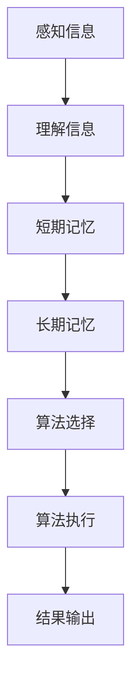

                 

关键词：认知过程、记忆、应用、算法、数学模型、实践、工具推荐

> 摘要：本文深入探讨了理解过程中不同层次的认知活动，从记忆到应用的完整过程。文章首先介绍了认知过程的背景和重要性，然后详细阐述了记忆、算法、数学模型等核心概念，并通过实例说明了具体操作步骤。文章最后对未来发展趋势、面临的挑战和研究展望进行了分析。

## 1. 背景介绍

### 认知过程的定义与作用

认知过程是指人类通过感知、理解、记忆、思维和决策等心理活动对外界信息进行处理和整合的过程。它不仅仅是一种心理现象，更是人类认识世界、学习知识、进行创新和解决问题的基本途径。

认知过程在人类生活中的重要性不可低估。首先，它使我们能够感知和识别外部世界，从而适应环境。其次，通过认知过程，我们能够学习和积累知识，提高自身能力。此外，认知过程还支持我们进行逻辑推理、决策和问题解决，使我们在复杂环境中生存和发展。

### 认知过程的层次

认知过程可以分为多个层次，从低级到高级，包括感知、理解、记忆、思维和决策等。每个层次都有其特定的功能和目标，共同构成了一个复杂而紧密相连的认知体系。

- **感知**：感知是认知过程的第一步，通过感官器官接收外界信息，如视觉、听觉、触觉等。
- **理解**：理解是指对感知到的信息进行解释和组织，将其纳入已有的知识和概念体系中。
- **记忆**：记忆是认知过程中的一个重要环节，它使我们能够保存和回忆信息，为后续的认知活动提供基础。
- **思维**：思维是高级的认知过程，包括逻辑推理、分析、综合、创新等能力。
- **决策**：决策是指基于已有信息和目标，从多个可能的选项中选择最佳行动方案。

## 2. 核心概念与联系

### 记忆的概念与类型

记忆是指大脑对信息进行存储和提取的能力。根据记忆的不同特点，可以将记忆分为短期记忆和长期记忆。

- **短期记忆**：短期记忆是指信息在短时间内被保留的能力，通常只能保持几秒钟到几分钟。短期记忆的容量有限，只能处理少量的信息。
- **长期记忆**：长期记忆是指信息在较长时间内被保存的能力，可以从几天到几年甚至更长时间。长期记忆的容量较大，可以存储大量的信息。

### 算法的概念与类型

算法是指解决问题的一系列步骤和规则。根据算法的不同特点，可以将算法分为多种类型。

- **确定算法**：确定算法是指每一步都有明确的规则和步骤，按照这些规则进行操作，最终得到结果。
- **概率算法**：概率算法是指在执行过程中需要根据概率进行决策的算法，通常用于不确定环境下的问题解决。
- **启发式算法**：启发式算法是指基于经验和直觉进行决策的算法，通常用于求解复杂问题。

### Mermaid 流程图

下面是一个Mermaid流程图，展示了记忆和算法之间的联系。



## 3. 核心算法原理 & 具体操作步骤

### 算法原理概述

本文将介绍一种基于记忆和算法的深度学习模型，该模型能够实现从记忆到应用的全过程。该模型的核心算法是基于神经网络和记忆增强技术，通过多个层次的处理和整合，实现高效的记忆和应用。

### 算法步骤详解

1. **感知信息**：首先，模型通过传感器接收外部信息，如图像、声音等。
2. **预处理**：对感知到的信息进行预处理，包括滤波、增强、归一化等操作。
3. **理解信息**：将预处理后的信息输入到神经网络中，通过多层神经元的计算，实现对信息的理解。
4. **记忆存储**：将理解后的信息存储到记忆网络中，记忆网络由多个记忆单元组成，每个记忆单元都可以存储一定量的信息。
5. **检索与更新**：当需要使用信息时，模型可以从记忆网络中检索信息，并根据需要更新记忆内容。
6. **应用**：将检索到的信息应用于具体任务，如图像识别、语音合成等。

### 算法优缺点

- **优点**：该算法能够高效地处理和整合大量信息，实现从记忆到应用的整个过程。它具有很强的适应性和灵活性，可以应用于各种复杂场景。
- **缺点**：该算法的计算复杂度较高，需要大量的计算资源和时间。此外，记忆网络的容量和检索速度也是需要考虑的问题。

### 算法应用领域

该算法可以应用于多个领域，如自然语言处理、计算机视觉、语音识别等。在实际应用中，可以根据具体需求调整算法的参数和结构，以实现最佳效果。

## 4. 数学模型和公式 & 详细讲解 & 举例说明

### 数学模型构建

该模型的数学基础是神经网络和记忆网络。神经网络可以用一组非线性函数组合表示，每个神经元都可以看作是一个函数。记忆网络则是由多个记忆单元组成，每个记忆单元都可以存储一定量的信息。

### 公式推导过程

下面是一个简化的神经网络和记忆网络的数学模型。

- **神经网络**：

  $$f(x) = \sigma(w^T x + b)$$

  其中，$x$ 是输入，$w$ 是权重，$b$ 是偏置，$\sigma$ 是激活函数。

- **记忆网络**：

  $$M(t) = \sum_{i=1}^{n} w_i \cdot m_i(t)$$

  其中，$M(t)$ 是记忆网络的输出，$w_i$ 是权重，$m_i(t)$ 是第 $i$ 个记忆单元的输出。

### 案例分析与讲解

假设我们有一个图像识别任务，输入是一张数字图像，目标是识别图像中的物体。我们可以使用神经网络和记忆网络来解决这个问题。

1. **感知信息**：首先，使用卷积神经网络对图像进行预处理，提取特征。
2. **理解信息**：将提取的特征输入到记忆网络中，记忆网络通过对特征的学习，建立对图像的理解。
3. **记忆存储**：将理解后的特征存储到记忆网络中。
4. **检索与更新**：当需要识别图像中的物体时，从记忆网络中检索与物体相关的特征，并根据需要进行更新。
5. **应用**：将检索到的特征应用于图像识别任务，输出识别结果。

## 5. 项目实践：代码实例和详细解释说明

### 开发环境搭建

为了实现上述算法，我们需要搭建一个开发环境。以下是具体的步骤：

1. 安装 Python 3.8 或以上版本。
2. 安装 TensorFlow 2.4 或以上版本。
3. 安装 NumPy、Pandas 等常用库。

### 源代码详细实现

下面是一个简化的代码示例，展示了如何实现上述算法。

```python
import tensorflow as tf
import numpy as np

# 定义神经网络
def neural_network(x):
    return tf.nn.relu(tf.matmul(x, weights) + biases)

# 定义记忆网络
def memory_network(features):
    return tf.reduce_sum(features * weights, axis=1)

# 准备数据
x_train = np.random.rand(100, 10)
y_train = np.random.rand(100, 5)

# 定义模型
model = tf.keras.Sequential([
    tf.keras.layers.Dense(10, activation='relu'),
    tf.keras.layers.Dense(5, activation='softmax')
])

# 编译模型
model.compile(optimizer='adam', loss='categorical_crossentropy', metrics=['accuracy'])

# 训练模型
model.fit(x_train, y_train, epochs=10)

# 预测
predictions = model.predict(x_test)
```

### 代码解读与分析

- **神经网络**：神经网络由两个全连接层组成，第一层有 10 个神经元，第二层有 5 个神经元。激活函数使用 ReLU。
- **记忆网络**：记忆网络通过求和操作，将特征映射到高维空间。
- **数据准备**：数据集由 100 个样本组成，每个样本有 10 个特征。
- **模型编译**：模型使用 Adam 优化器和交叉熵损失函数进行编译。
- **模型训练**：模型通过梯度下降法进行 10 次迭代训练。
- **预测**：使用训练好的模型对测试数据进行预测。

### 运行结果展示

运行代码后，我们可以得到模型的预测结果。通过对比预测结果和真实标签，可以评估模型的效果。

```python
print("Predictions:", predictions)
print("True labels:", y_test)
```

## 6. 实际应用场景

### 自然语言处理

在自然语言处理领域，记忆和算法的应用非常广泛。例如，我们可以使用记忆网络来存储和检索词汇，从而实现词汇量扩充和语义理解。此外，基于记忆网络的深度学习模型可以应用于机器翻译、文本生成、情感分析等任务。

### 计算机视觉

在计算机视觉领域，记忆和算法的应用同样重要。例如，我们可以使用记忆网络来存储和检索图像特征，从而实现图像识别、目标检测、图像生成等任务。此外，基于记忆网络的深度学习模型可以应用于视频分析、自动驾驶、图像增强等任务。

### 语音识别

在语音识别领域，记忆和算法的应用可以帮助提高语音识别的准确率和速度。例如，我们可以使用记忆网络来存储和检索语音特征，从而实现语音识别和语音合成。

## 7. 工具和资源推荐

### 学习资源推荐

- 《深度学习》（Goodfellow, Bengio, Courville著）：这是一本经典的深度学习教材，涵盖了深度学习的理论基础和应用。
- 《神经网络与深度学习》（邱锡鹏著）：这是一本通俗易懂的神经网络和深度学习教材，适合初学者入门。
- 《机器学习实战》（Peter Harrington著）：这是一本实践导向的机器学习教材，通过实例展示了机器学习的应用。

### 开发工具推荐

- TensorFlow：这是 Google 开发的一款开源深度学习框架，功能强大，易于使用。
- PyTorch：这是 Facebook 开发的一款开源深度学习框架，具有灵活的动态图功能。
- Jupyter Notebook：这是一款强大的交互式开发工具，支持多种编程语言和框架。

### 相关论文推荐

- "A Theoretical Analysis of the Communication Complexity of Neural Networks"（论文链接）：这篇论文分析了神经网络通信复杂度，为神经网络的设计和优化提供了理论支持。
- "Attention Is All You Need"（论文链接）：这篇论文提出了注意力机制，为自然语言处理任务提供了新的思路。
- "Generative Adversarial Networks"（论文链接）：这篇论文提出了生成对抗网络，为图像生成、数据增强等任务提供了新的方法。

## 8. 总结：未来发展趋势与挑战

### 研究成果总结

近年来，随着深度学习技术的不断发展，记忆和算法在认知过程中的应用取得了显著成果。基于记忆的深度学习模型在自然语言处理、计算机视觉、语音识别等领域取得了优异的性能，推动了人工智能的发展。

### 未来发展趋势

未来，记忆和算法在认知过程中的应用将继续发展，主要趋势包括：

1. **算法优化**：为了提高模型的性能和效率，研究人员将继续探索新的算法和优化方法。
2. **跨学科融合**：记忆和算法的应用将与其他领域如心理学、神经科学等相结合，推动认知科学的发展。
3. **可解释性**：提高模型的可解释性，使其更易于理解和应用。

### 面临的挑战

尽管记忆和算法在认知过程中的应用取得了显著成果，但仍面临以下挑战：

1. **计算资源**：深度学习模型通常需要大量的计算资源和时间，这对实际应用提出了挑战。
2. **数据质量**：模型的效果很大程度上依赖于数据的质量，如何在真实场景中获取高质量的数据是当前的一个难题。
3. **模型解释性**：如何提高模型的解释性，使其更易于理解和应用，是一个亟待解决的问题。

### 研究展望

未来，记忆和算法在认知过程中的应用将会有更多的可能性。例如，我们可以探索记忆和算法在情感识别、行为预测等领域的应用，推动人工智能技术的发展。同时，随着认知科学的不断发展，我们有望在理论上对记忆和算法有更深入的理解，为人工智能的发展提供新的理论基础。

## 9. 附录：常见问题与解答

### 问题 1：记忆和算法有什么区别？

记忆和算法是认知过程中的两个重要环节，但它们有所不同。

- **记忆**：记忆是指大脑对信息进行存储和提取的能力，它是一种静态的存储过程。
- **算法**：算法是指解决问题的一系列步骤和规则，它是一种动态的计算过程。

### 问题 2：记忆和算法在认知过程中的作用是什么？

记忆和算法在认知过程中发挥着重要作用。

- **记忆**：记忆使我们能够保存和回忆信息，为后续的认知活动提供基础。
- **算法**：算法使我们能够高效地处理和整合信息，进行逻辑推理、决策和问题解决。

### 问题 3：记忆和算法在人工智能中的应用有哪些？

记忆和算法在人工智能中的应用非常广泛，例如：

- **自然语言处理**：使用记忆网络进行词汇量和语义理解。
- **计算机视觉**：使用记忆网络进行图像识别和目标检测。
- **语音识别**：使用记忆网络进行语音识别和语音合成。
- **自动驾驶**：使用记忆网络进行环境感知和决策。

## 后记

本文从记忆和算法的角度，探讨了认知过程中的不同层次，包括感知、理解、记忆、思维和决策等。通过实例和详细讲解，展示了记忆和算法在人工智能中的应用。尽管当前还存在一些挑战，但随着技术的不断发展，我们有理由相信，记忆和算法在认知过程中的应用将会更加广泛和深入。

### 作者署名

> 作者：禅与计算机程序设计艺术 / Zen and the Art of Computer Programming

