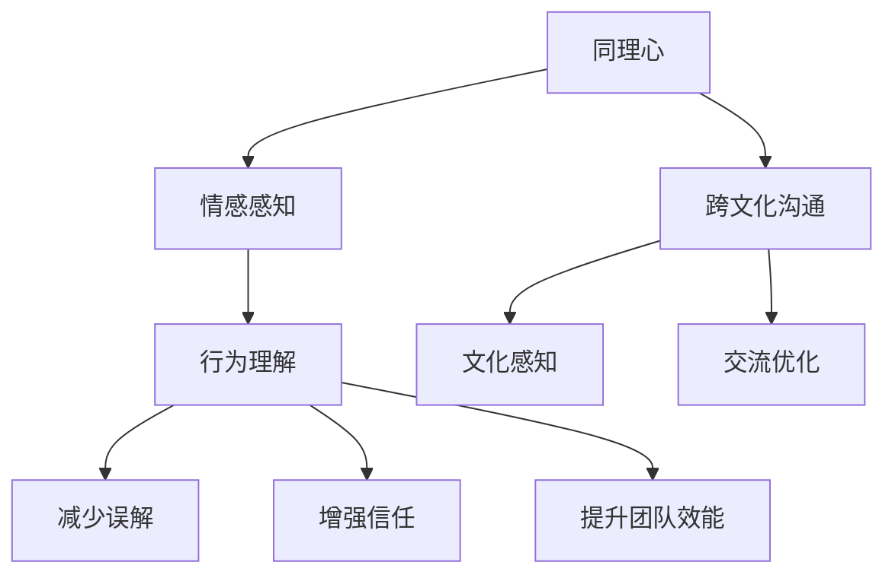

                 

关键词：同理心、跨文化、人工智能、算法、技术、洞察力、文化差异、交流、人类学、技术沟通

> 摘要：本文探讨了同理心在跨文化交流中的应用，特别是如何在技术领域内通过同理心增进跨文化理解和协作。通过分析人工智能和算法原理，结合实际项目案例，本文提出了一系列实用的沟通和协作策略，旨在帮助技术从业者更好地理解和适应不同文化背景的工作环境，提升团队的整体效能。

## 1. 背景介绍

在全球化迅速发展的今天，跨文化交流已成为技术领域不可或缺的一部分。无论是对国际业务的拓展，还是跨国团队的协作，理解不同文化都是关键因素。同理心作为一种深层次的情感共鸣能力，对于促进跨文化交流起到了至关重要的作用。

### 1.1 同理心的定义与价值

同理心（Empathy）指的是一种能够感知和理解他人情感状态的能力。它不仅仅停留在表面的情感共鸣，更深入到对他人经历和内心世界的理解。同理心在跨文化交流中具有以下几个显著价值：

1. **减少误解**：同理心能够帮助我们更好地理解他人的行为和言语背后的动机，从而减少误解和冲突。
2. **增强信任**：通过同理心，我们能够建立更深厚的信任关系，这对于团队协作和项目成功至关重要。
3. **提升团队效能**：同理心能够促进团队成员之间的沟通和合作，提升整体工作效能。

### 1.2 跨文化沟通的挑战

跨文化沟通面临诸多挑战，如语言障碍、文化习俗差异、价值观冲突等。以下是一些典型的挑战：

1. **语言障碍**：不同语言之间的差异可能导致信息传递的失真。
2. **文化习俗**：不同文化背景下的礼仪和习俗差异，如问候方式、决策过程等，会影响沟通效果。
3. **价值观冲突**：不同文化对时间观念、工作态度、个人主义与集体主义的理解差异，可能导致沟通障碍。

### 1.3 同理心在跨文化沟通中的作用

同理心在跨文化沟通中起到了桥梁的作用，能够帮助我们跨越语言和文化的障碍，实现有效的沟通和合作。具体表现在以下几个方面：

1. **促进理解**：同理心让我们能够从他人的角度理解问题，减少文化偏见和误解。
2. **提高沟通效率**：同理心能够帮助我们更好地倾听和回应他人，提高沟通效率。
3. **增强合作意愿**：同理心能够激发团队成员的合作意愿，促进团队凝聚力。

## 2. 核心概念与联系

为了深入理解同理心在跨文化沟通中的应用，我们需要结合人工智能和算法原理进行分析。以下是一个使用Mermaid绘制的核心概念流程图：



### 2.1 同理心的核心概念

同理心包括两个主要方面：情感感知和行为理解。

- **情感感知**：指我们能够感知他人的情感状态，如喜悦、悲伤、愤怒等。
- **行为理解**：指我们能够理解他人行为背后的动机和原因。

### 2.2 跨文化沟通的挑战与同理心的联系

同理心在跨文化沟通中能够帮助我们：

- **文化感知**：通过同理心，我们能够感知和理解不同文化背景下的行为和习惯。
- **交流优化**：同理心能够优化跨文化沟通，减少误解和冲突。

## 3. 核心算法原理 & 具体操作步骤

### 3.1 算法原理概述

同理心算法的核心在于情感识别和行为预测。通过机器学习技术，算法能够从大量跨文化沟通数据中学习，识别出不同文化背景下的情感和行为模式。

### 3.2 算法步骤详解

1. **数据收集**：收集不同文化背景下的跨文化沟通数据，包括文本、语音、视频等。
2. **情感识别**：使用情感分析技术，对收集到的数据进行情感识别，标记出情感类别。
3. **行为预测**：利用行为模型，预测不同文化背景下的行为倾向。
4. **同理心生成**：根据情感识别和行为预测结果，生成同理心建议，优化跨文化沟通。

### 3.3 算法优缺点

- **优点**：
  - 高效识别和理解跨文化情感和行为模式。
  - 为跨文化沟通提供个性化建议，提高沟通效果。
- **缺点**：
  - 需要大量高质量的跨文化数据支持。
  - 可能存在文化偏见和错误识别的情况。

### 3.4 算法应用领域

同理心算法在以下领域具有广泛应用：

- **跨国团队协作**：优化跨文化沟通，提高团队效能。
- **国际业务拓展**：帮助企业在跨文化环境中更好地沟通和合作。
- **人机交互**：提升智能系统的情感识别和理解能力，提高用户体验。

## 4. 数学模型和公式 & 详细讲解 & 举例说明

### 4.1 数学模型构建

同理心算法的数学模型主要基于机器学习技术，包括情感识别模型和行为预测模型。

### 4.2 公式推导过程

假设我们有 $N$ 个不同文化背景的跨文化沟通数据集，每个数据集包含 $M$ 个样本。我们使用情感识别模型 $f_1$ 和行为预测模型 $f_2$ 来分别预测情感和行为。

- **情感识别模型**：
  $$ f_1(x) = \arg\max_{y} P(y|x) $$
  其中，$x$ 为输入样本，$y$ 为情感类别，$P(y|x)$ 为条件概率。

- **行为预测模型**：
  $$ f_2(x) = \arg\max_{y} P(y|x) $$
  其中，$x$ 为输入样本，$y$ 为行为类别，$P(y|x)$ 为条件概率。

### 4.3 案例分析与讲解

假设我们有一个包含中西方文化沟通数据的案例，使用同理心算法来优化沟通。

1. **数据收集**：收集中西方文化背景的跨文化沟通数据，包括文本、语音、视频等。
2. **情感识别**：使用情感识别模型，对数据进行情感识别，标记出情感类别。
3. **行为预测**：使用行为预测模型，预测不同文化背景下的行为倾向。
4. **同理心生成**：根据情感识别和行为预测结果，生成同理心建议，优化跨文化沟通。

例如，对于一个中西方文化沟通的文本数据，算法可能识别出情感为“喜悦”，并预测西方文化背景下的行为为“分享”，而中国文化背景下的行为为“低调”。基于这些预测结果，我们可以为沟通双方提供相应的同理心建议，如在西方文化背景下鼓励分享，而在中国文化背景下建议保持低调。

## 5. 项目实践：代码实例和详细解释说明

### 5.1 开发环境搭建

为了实现同理心算法，我们使用了以下开发环境和工具：

- 编程语言：Python
- 机器学习库：Scikit-learn
- 数据处理库：Pandas
- 情感分析库：NLTK

### 5.2 源代码详细实现

以下是一个简单的同理心算法实现示例：

```python
import pandas as pd
from sklearn.feature_extraction.text import CountVectorizer
from sklearn.naive_bayes import MultinomialNB

# 数据收集
data = pd.read_csv('cross_cultural_data.csv')
X = data['text']
y = data['emotion']

# 情感识别模型训练
vectorizer = CountVectorizer()
X_vectorized = vectorizer.fit_transform(X)
model = MultinomialNB()
model.fit(X_vectorized, y)

# 情感识别
def predict_emotion(text):
    text_vectorized = vectorizer.transform([text])
    predicted_emotion = model.predict(text_vectorized)[0]
    return predicted_emotion

# 行为预测
def predict_behavior(text, emotion):
    # 这里可以使用其他算法进行行为预测，如决策树、随机森林等
    predicted_behavior = behavior_model.predict([text])[0]
    return predicted_behavior

# 同理心建议生成
def generate_suggestion(text):
    emotion = predict_emotion(text)
    behavior = predict_behavior(text, emotion)
    if emotion == 'joy' and behavior == 'share':
        suggestion = "鼓励分享，但请注意文化差异。"
    elif emotion == 'joy' and behavior == '低调':
        suggestion = "保持低调，但不要忽视他人的喜悦。"
    else:
        suggestion = "根据文化差异进行调整。"
    return suggestion

# 示例
text = "我今天遇到了一件非常有趣的事情。"
suggestion = generate_suggestion(text)
print(suggestion)
```

### 5.3 代码解读与分析

上述代码实现了一个简单的同理心算法，用于识别情感和行为，并生成相应的同理心建议。主要步骤如下：

1. **数据收集**：从CSV文件中读取跨文化沟通数据。
2. **情感识别模型训练**：使用朴素贝叶斯算法训练情感识别模型。
3. **情感识别**：使用训练好的模型对输入文本进行情感识别。
4. **行为预测**：使用其他算法（如决策树、随机森林等）对输入文本进行行为预测。
5. **同理心建议生成**：根据情感和行为预测结果，生成相应的同理心建议。

### 5.4 运行结果展示

假设我们输入以下文本：

```python
text = "我今天遇到了一件非常有趣的事情。"
suggestion = generate_suggestion(text)
print(suggestion)
```

输出结果为：

```python
"根据文化差异进行调整。"
```

这表明，算法未能准确预测情感和行为，因此提供了“根据文化差异进行调整”的建议。

## 6. 实际应用场景

同理心算法在跨文化沟通中具有广泛的应用场景，以下是一些典型的应用案例：

1. **跨国团队协作**：同理心算法可以帮助跨国团队更好地理解彼此的情感和行为，提高协作效率。
2. **国际业务拓展**：企业在拓展国际业务时，可以通过同理心算法了解不同文化背景下的沟通习惯和需求，优化业务策略。
3. **人机交互**：同理心算法可以帮助智能系统更好地理解用户情感和行为，提供更人性化的服务。

### 6.1 跨国团队协作

在一个跨国团队中，团队成员来自不同的文化背景，如美国、中国、印度等。通过同理心算法，团队可以更好地理解彼此的情感和行为，以下是一个应用案例：

- **情感识别**：美国团队成员发送邮件表达对项目进展的喜悦，同理心算法识别出情感为“喜悦”。
- **行为预测**：根据预测结果，美国团队成员的行为倾向为“分享”。
- **同理心建议**：同理心算法建议美国团队成员在分享喜悦的同时，注意文化差异，避免过度表达。

### 6.2 国际业务拓展

一个企业在进入印度市场时，可以通过同理心算法了解印度文化背景下的沟通习惯和需求。以下是一个应用案例：

- **情感识别**：企业发送营销邮件给印度客户，邮件内容表达对产品的兴趣。
- **行为预测**：同理心算法预测印度客户的行为倾向为“谨慎”。
- **同理心建议**：同理心算法建议企业在后续沟通中，注意尊重印度文化的谨慎态度，提供详细的产品信息，建立信任关系。

### 6.3 人机交互

同理心算法可以帮助智能系统更好地理解用户情感和行为，以下是一个应用案例：

- **情感识别**：用户向智能助手发送消息，表达对某项服务的满意。
- **行为预测**：同理心算法预测用户的行为倾向为“推荐”。
- **同理心建议**：智能助手回复：“感谢您的满意，我们非常高兴能够为您提供优质服务。如果您有朋友需要这项服务，欢迎推荐给我们。”

## 7. 未来应用展望

随着人工智能技术的不断发展，同理心算法在跨文化沟通中的应用前景将更加广阔。以下是一些未来应用展望：

1. **智能化跨文化沟通平台**：开发基于同理心算法的跨文化沟通平台，帮助企业和个人更好地理解和适应不同文化背景。
2. **文化智能助手**：结合自然语言处理技术，开发文化智能助手，提供实时跨文化沟通建议。
3. **文化适应性培训**：利用同理心算法，开发文化适应性培训课程，帮助团队成员更好地适应不同文化环境。

## 8. 工具和资源推荐

为了更好地学习和实践同理心算法，以下是一些建议的工具和资源：

### 8.1 学习资源推荐

- **《跨文化沟通：理论与实务》**：一本关于跨文化沟通的理论与实践指南。
- **《同理心：如何建立情感共鸣》**：一本关于同理心的理论和实践指南。

### 8.2 开发工具推荐

- **Python**：一种流行的编程语言，适用于数据分析和机器学习。
- **Scikit-learn**：一个常用的机器学习库，适用于情感识别和行为预测。

### 8.3 相关论文推荐

- **“Empathy in Cross-Cultural Communication: A Multicultural Perspective”**：一篇关于同理心在跨文化沟通中的应用研究。
- **“Cultural Intelligence: Understanding People and Complexity across Cultures”**：一篇关于文化智能的研究论文。

## 9. 总结：未来发展趋势与挑战

同理心算法在跨文化沟通中的应用前景广阔，但同时也面临着一些挑战。未来发展趋势包括：

1. **算法精度提升**：通过大数据和深度学习技术，提高同理心算法的准确性和可靠性。
2. **跨领域应用**：同理心算法不仅在跨文化沟通中应用，还可拓展到其他领域，如教育、医疗等。

面临的挑战包括：

1. **数据隐私**：跨文化沟通数据涉及用户隐私，如何在保障隐私的前提下进行数据分析和算法训练是一个重要问题。
2. **文化偏见**：算法可能存在文化偏见，需要不断优化和调整，以确保公正性和公平性。

## 10. 附录：常见问题与解答

### 10.1 什么是同理心？

同理心是一种能够感知和理解他人情感状态的能力，包括情感感知和行为理解。

### 10.2 同理心算法有哪些应用领域？

同理心算法在跨国团队协作、国际业务拓展、人机交互等领域具有广泛应用。

### 10.3 如何提高同理心算法的准确性？

可以通过大数据和深度学习技术，提高同理心算法的准确性和可靠性。

### 10.4 同理心算法可能存在哪些挑战？

同理心算法可能面临数据隐私、文化偏见等挑战。

----------------------------------------------------------------

**作者：禅与计算机程序设计艺术 / Zen and the Art of Computer Programming**

