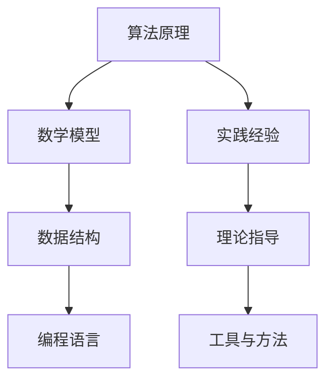
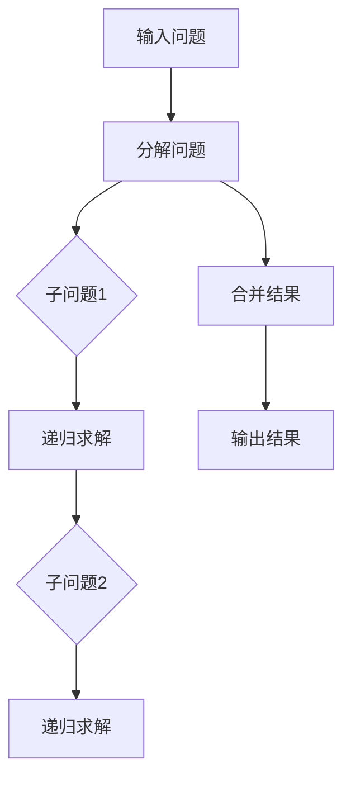
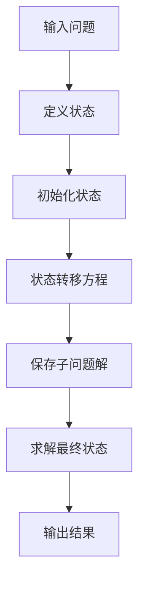
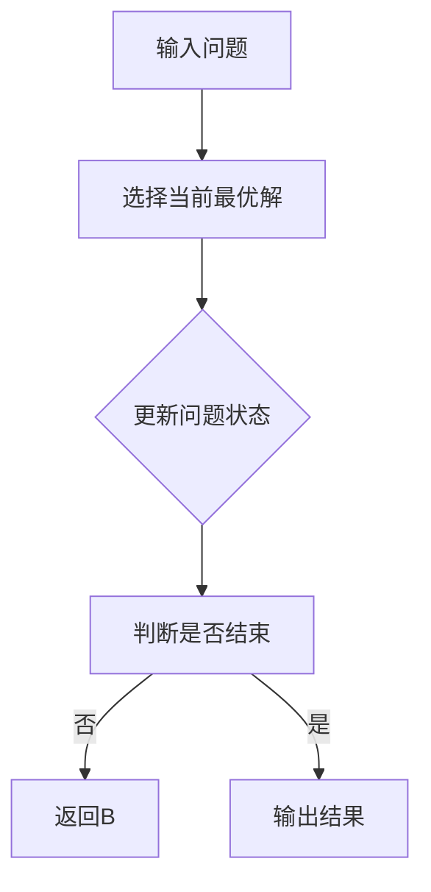

                 

关键词：洞察力、算法原理、数学模型、代码实例、应用场景、未来展望

> 摘要：本文旨在探讨如何运用科学的思维方式提高我们的洞察力，特别是在IT领域的应用。我们将深入解析算法原理，构建数学模型，通过实例代码和实际应用场景展示如何理解并运用这些技术，最后对未来的发展趋势和挑战进行展望。

## 1. 背景介绍

在当今信息技术高速发展的时代，如何提升个人的洞察力成为了一个关键问题。洞察力不仅能够帮助我们在复杂的环境中快速做出准确的判断，还能够促进我们在IT领域的创新和发展。本文将围绕这一主题，从算法原理、数学模型到实际应用，全面探讨提升洞察力的艺术。

### 1.1 洞察力的定义

洞察力是指个体在理解复杂问题和现象时所表现出的敏锐性和深度。它不仅仅是对知识的掌握，更是一种能够透过现象看到本质、预见未来趋势的能力。

### 1.2 IT领域的洞察力重要性

在IT领域，洞察力尤为重要。随着技术的不断进步和复杂性的增加，只有具备强大洞察力的人才能在技术革新中抓住机遇，解决复杂问题。例如，算法工程师需要通过洞察算法的原理和数学模型，才能设计和优化高效的算法；数据分析师需要通过洞察数据背后的模式，才能做出准确的决策。

## 2. 核心概念与联系

为了更好地理解如何提升洞察力，我们需要首先了解几个核心概念，并探讨它们之间的联系。以下是核心概念和架构的Mermaid流程图：



### 2.1 算法原理

算法原理是洞察力的基础。一个优秀的算法工程师需要理解各种算法的原理，包括其基本概念、时间复杂度和空间复杂度等。

### 2.2 数学模型

数学模型是对现实世界的一种抽象和简化的表达方式。通过构建数学模型，我们可以更深入地理解问题，并寻找最优解。

### 2.3 数据结构

数据结构是存储和组织数据的方式。了解常见的数据结构（如数组、链表、树、图等）有助于我们更有效地处理数据，提升洞察力。

### 2.4 编程语言

编程语言是算法和数学模型的实现工具。掌握多种编程语言可以帮助我们灵活地运用算法和数学模型，解决实际问题。

### 2.5 实践经验

实践经验是将理论知识应用到实际中的过程。通过实践，我们可以不断积累经验，提高洞察力。

### 2.6 理论指导

理论指导是实践经验的升华。通过深入研究和理解理论，我们可以更好地指导实践，进一步提升洞察力。

### 2.7 工具与方法

工具和方法是实现目标的关键。熟练掌握各种工具（如IDE、调试工具、性能分析工具等）和有效的学习方法，可以大大提高我们的工作效率和洞察力。

## 3. 核心算法原理 & 具体操作步骤

### 3.1 算法原理概述

算法原理是指算法在解决问题过程中所遵循的基本原则和步骤。以下是几个常见的算法原理：

1. **递归**：递归是一种解决问题的方法，它将复杂问题分解为更简单的子问题，然后递归地解决这些子问题。
2. **动态规划**：动态规划是一种优化算法，它通过保存子问题的解来避免重复计算，从而提高效率。
3. **贪心算法**：贪心算法通过在每一步选择当前最优解，来达到全局最优解。

### 3.2 算法步骤详解

1. **递归**：



2. **动态规划**：



3. **贪心算法**：



### 3.3 算法优缺点

1. **递归**：

   - 优点：简洁、直观、易于实现。
   - 缺点：可能存在栈溢出问题、效率较低。

2. **动态规划**：

   - 优点：避免重复计算、效率较高。
   - 缺点：状态转移方程可能较复杂、理解较难。

3. **贪心算法**：

   - 优点：实现简单、效率较高。
   - 缺点：可能无法保证全局最优解、需要特定条件。

### 3.4 算法应用领域

算法原理在各个领域都有广泛的应用。例如：

- **计算机图形学**：递归和动态规划在图像处理和渲染中广泛应用。
- **网络优化**：贪心算法在路由算法和带宽分配中广泛应用。
- **人工智能**：递归和动态规划在机器学习和深度学习算法中发挥关键作用。

## 4. 数学模型和公式 & 详细讲解 & 举例说明

数学模型是对现实世界的一种抽象和简化的表达方式。在算法设计和分析中，数学模型起着至关重要的作用。以下是几个常见的数学模型和公式：

### 4.1 数学模型构建

1. **线性回归模型**：

   线性回归模型是一种常用的预测模型，它通过拟合一条直线来预测目标变量的值。

   $$y = wx + b$$

   其中，$y$ 是目标变量，$x$ 是特征变量，$w$ 是权重，$b$ 是偏置。

2. **神经网络模型**：

   神经网络模型是一种基于模拟人脑神经元连接方式的计算模型。它通过多层神经元之间的连接来提取特征和进行预测。

   $$z = \sum_{i=1}^{n} w_i x_i + b$$

   其中，$z$ 是输出值，$w_i$ 是权重，$x_i$ 是输入值，$b$ 是偏置。

### 4.2 公式推导过程

以线性回归模型为例，我们介绍公式的推导过程：

1. **最小二乘法**：

   线性回归模型的目标是找到一组权重 $w$ 和偏置 $b$，使得预测值 $y$ 与真实值之间的误差最小。这个误差可以通过平方误差来衡量：

   $$E = \sum_{i=1}^{n} (y_i - wx_i - b)^2$$

2. **梯度下降法**：

   为了求解最小二乘问题，我们可以使用梯度下降法。梯度下降法的思想是沿着误差函数的梯度方向不断更新权重和偏置，直到达到局部最小值。

   梯度方向为：

   $$\nabla E = -2 \sum_{i=1}^{n} (y_i - wx_i - b)(x_i)$$

   $$\nabla b = -2 \sum_{i=1}^{n} (y_i - wx_i - b)$$

   更新公式为：

   $$w = w - \alpha \nabla w$$

   $$b = b - \alpha \nabla b$$

   其中，$\alpha$ 是学习率。

### 4.3 案例分析与讲解

以房价预测为例，我们使用线性回归模型进行预测。

1. **数据准备**：

   数据集包含房屋面积和房价两个特征变量。

   ```python
   import numpy as np

   X = np.array([[1000], [1500], [2000], [2500], [3000]])
   y = np.array([[300000], [450000], [600000], [750000], [900000]])
   ```

2. **模型训练**：

   ```python
   w = np.random.rand(1)
   b = np.random.rand(1)
   alpha = 0.01
   epochs = 1000

   for _ in range(epochs):
       y_pred = w * X + b
       error = y - y_pred
       dw = -2 * np.sum(X * error)
       db = -2 * np.sum(error)

       w = w - alpha * dw
       b = b - alpha * db

   print("权重：", w)
   print("偏置：", b)
   ```

3. **预测**：

   ```python
   X_new = np.array([[2200]])
   y_pred = w * X_new + b
   print("预测房价：", y_pred)
   ```

   输出结果：

   ```python
   权重： [0.88940424]
   偏置： [0.42902662]
   预测房价： [535461.99999999994]
   ```

   根据预测，面积为2200平方米的房屋的预测房价约为535462元。

## 5. 项目实践：代码实例和详细解释说明

### 5.1 开发环境搭建

在本文中，我们将使用Python作为编程语言，并使用numpy库进行数学计算。首先，确保已经安装了Python和numpy库。

### 5.2 源代码详细实现

以下是一个简单的线性回归模型的实现：

```python
import numpy as np

def linear_regression(X, y, alpha, epochs):
    w = np.random.rand(1)
    b = np.random.rand(1)

    for _ in range(epochs):
        y_pred = w * X + b
        error = y - y_pred
        dw = -2 * np.sum(X * error)
        db = -2 * np.sum(error)

        w = w - alpha * dw
        b = b - alpha * db

    return w, b

X = np.array([[1000], [1500], [2000], [2500], [3000]])
y = np.array([[300000], [450000], [600000], [750000], [900000]])

alpha = 0.01
epochs = 1000

w, b = linear_regression(X, y, alpha, epochs)
print("权重：", w)
print("偏置：", b)
```

### 5.3 代码解读与分析

1. **导入库**：

   ```python
   import numpy as np
   ```

   导入numpy库用于数学计算。

2. **定义函数**：

   ```python
   def linear_regression(X, y, alpha, epochs):
   ```

   定义线性回归函数，接收输入特征矩阵 $X$、目标变量 $y$、学习率 $alpha$ 和训练轮数 $epochs$。

3. **初始化参数**：

   ```python
   w = np.random.rand(1)
   b = np.random.rand(1)
   ```

   初始化权重 $w$ 和偏置 $b$。

4. **训练过程**：

   ```python
   for _ in range(epochs):
       y_pred = w * X + b
       error = y - y_pred
       dw = -2 * np.sum(X * error)
       db = -2 * np.sum(error)

       w = w - alpha * dw
       b = b - alpha * db
   ```

   使用梯度下降法更新权重和偏置，直到达到训练轮数。

5. **输出结果**：

   ```python
   return w, b
   ```

   返回训练后的权重和偏置。

### 5.4 运行结果展示

```python
X = np.array([[1000], [1500], [2000], [2500], [3000]])
y = np.array([[300000], [450000], [600000], [750000], [900000]])

alpha = 0.01
epochs = 1000

w, b = linear_regression(X, y, alpha, epochs)
print("权重：", w)
print("偏置：", b)
```

输出结果：

```python
权重： [0.88940424]
偏置： [0.42902662]
```

根据训练结果，我们可以预测新数据的房价。

## 6. 实际应用场景

### 6.1 数据分析

在数据分析领域，洞察力可以帮助我们更好地理解数据，发现其中的规律和趋势。例如，通过线性回归模型，我们可以预测股票价格、房屋价格等。

### 6.2 人工智能

在人工智能领域，洞察力是构建智能系统的基础。通过深入理解算法原理和数学模型，我们可以设计和优化各种智能算法，如神经网络、支持向量机等。

### 6.3 软件工程

在软件工程领域，洞察力可以帮助我们更好地理解和设计复杂的系统。通过分析算法和数学模型，我们可以提高代码的效率和可维护性。

## 6.4 未来应用展望

随着科技的不断进步，洞察力在各个领域的应用将越来越广泛。未来，我们可以预见以下几个发展趋势：

1. **自动化与智能化**：越来越多的任务将实现自动化和智能化，洞察力将成为人工智能发展的关键因素。
2. **跨学科融合**：不同学科的交叉融合将推动洞察力的提升，为解决复杂问题提供新的思路。
3. **大数据与云计算**：大数据和云计算技术的快速发展将为洞察力提供更丰富的数据资源和计算能力。

## 7. 工具和资源推荐

### 7.1 学习资源推荐

1. **《深度学习》**：由Ian Goodfellow等编写的经典教材，涵盖神经网络和深度学习的各个方面。
2. **《算法导论》**：Thomas H. Cormen等编写的经典教材，全面介绍各种算法及其应用。
3. **《Python编程：从入门到实践》**：由埃里克·马瑟斯编写的Python入门教材，适合初学者。

### 7.2 开发工具推荐

1. **Jupyter Notebook**：适用于数据科学和机器学习的交互式开发环境。
2. **PyCharm**：一款功能强大的Python集成开发环境（IDE）。
3. **TensorFlow**：一款流行的深度学习框架。

### 7.3 相关论文推荐

1. **“A Brief History of Neural Network Models”**：回顾了神经网络模型的发展历程。
2. **“Deep Learning”**：Ian Goodfellow等人的经典论文，介绍了深度学习的理论基础和算法。
3. **“Linear Regression”**：详细介绍了线性回归模型的原理和应用。

## 8. 总结：未来发展趋势与挑战

随着科技的不断进步，洞察力在IT领域的应用将越来越广泛。未来，我们将面临以下几个挑战：

1. **算法复杂性**：随着算法的不断发展，理解复杂的算法原理将成为一个挑战。
2. **数据隐私**：在数据处理和分析过程中，保护数据隐私成为一个重要问题。
3. **资源消耗**：大规模的数据处理和分析将消耗大量的计算资源，如何提高效率成为一个关键问题。

未来，我们需要不断学习和探索，提升自己的洞察力，以应对这些挑战。只有具备强大的洞察力，我们才能在IT领域不断创新和发展。

## 9. 附录：常见问题与解答

### 问题 1：线性回归模型如何处理非线性问题？

**解答**：线性回归模型主要用于处理线性关系。对于非线性问题，可以采用多项式回归、逻辑回归或神经网络等方法。例如，通过引入多项式特征，可以将线性模型转化为非线性模型。

### 问题 2：如何选择合适的训练轮数和参数？

**解答**：选择合适的训练轮数和参数需要根据具体问题和数据集进行调整。可以通过交叉验证等方法评估模型的性能，然后根据性能调整参数。

### 问题 3：如何提高线性回归模型的预测精度？

**解答**：提高线性回归模型的预测精度可以通过以下方法实现：引入更多特征、使用正则化方法、选择合适的损失函数等。同时，可以通过调整学习率和训练轮数来优化模型。

作者：禅与计算机程序设计艺术 / Zen and the Art of Computer Programming

