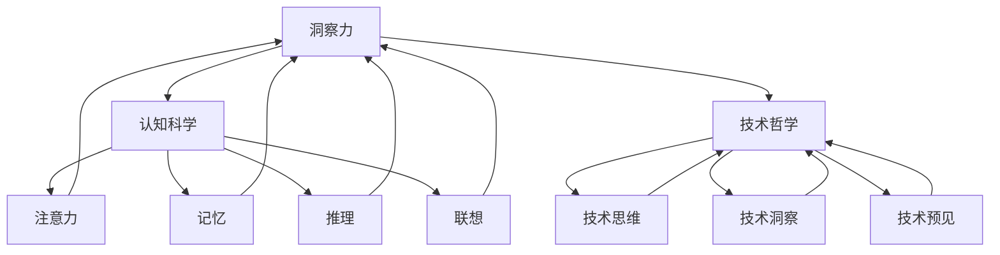

                 

关键词：洞察力、认知科学、技术哲学、算法原理、应用场景、未来展望

> 摘要：本文深入探讨洞察力的本质，以及它在技术领域的应用。通过分析认知科学和技术哲学的视角，揭示算法原理背后的科学思维，并结合实际项目实践，探讨未来技术发展的趋势与挑战。

## 1. 背景介绍

在当今技术飞速发展的时代，对复杂系统的理解与分析能力变得越来越重要。无论是在科学研究、工业生产还是日常生活的方方面面，洞察力都扮演着至关重要的角色。洞察力不仅是一种认知能力，更是技术进步和创新的重要驱动力。然而，如何培养和提高洞察力，以及它在技术领域的应用，仍然是许多学者和从业者关注的话题。

本文旨在通过技术哲学和认知科学的角度，探讨洞察力的本质及其在技术领域的应用。我们将首先回顾相关领域的研究成果，然后深入剖析算法原理和数学模型，并通过实际项目实践来展示洞察力如何在实际中发挥作用。最后，我们将探讨未来技术发展的趋势与挑战，以及如何应对这些挑战。

## 2. 核心概念与联系

### 2.1 洞察力的定义与分类

洞察力，是指个体在面对复杂问题时，能够迅速捕捉关键信息，理解问题的本质，并提出创新性解决方案的能力。根据不同的分类标准，洞察力可以分为以下几种类型：

1. **分析性洞察力**：通过逻辑分析和推理，揭示问题背后的因果关系。
2. **直觉性洞察力**：基于经验和直觉，迅速捕捉问题的核心。
3. **创造性洞察力**：在已有知识和信息的基础上，提出全新的解决方案。

### 2.2 认知科学视角下的洞察力

认知科学是研究人类认知过程和能力的学科。根据认知科学的理论，洞察力是认知系统的一种高级功能，涉及到以下几个方面：

1. **注意力**：关注问题的关键部分，过滤无关信息。
2. **记忆**：提取与问题相关的记忆，形成知识结构。
3. **推理**：通过逻辑推理，揭示问题的本质。
4. **联想**：将不同领域或概念联系起来，形成新的认知模式。

### 2.3 技术哲学视角下的洞察力

技术哲学探讨技术对人类生活和社会的影响，以及技术本身的发展方向。从技术哲学的角度来看，洞察力是技术进步和创新的重要驱动力。以下是一些关键概念：

1. **技术思维**：指技术领域特有的思考方式，包括抽象、建模、算法设计等。
2. **技术洞察**：通过技术思维，对技术问题进行深刻理解，并提出创新性解决方案。
3. **技术预见**：预测技术发展趋势，指导未来的技术发展。

### 2.4 核心概念联系图示

下面是一个用Mermaid绘制的核心概念联系图，展示了洞察力在认知科学和技术哲学中的关联：



## 3. 核心算法原理 & 具体操作步骤

### 3.1 算法原理概述

在技术领域，许多复杂问题可以通过算法来解决。算法原理是理解问题本质和设计解决方案的关键。下面我们介绍一种常见的算法——动态规划算法。

动态规划是一种用于解决最优子结构问题的算法。其核心思想是将复杂问题分解为一系列子问题，然后通过求解这些子问题，得到原问题的最优解。动态规划算法通常具有以下几个特点：

1. **最优子结构**：问题的最优解可以通过子问题的最优解组合而成。
2. **重叠子问题**：不同子问题之间可能存在重复计算。
3. **状态转移方程**：通过递推关系，从子问题的解推导出原问题的解。

### 3.2 算法步骤详解

动态规划算法的一般步骤如下：

1. **定义状态**：将问题分解为若干个子问题，定义每个子问题的状态。
2. **初始化边界条件**：确定算法的初始状态，通常是问题的边界条件。
3. **状态转移方程**：根据递推关系，定义子问题之间的关系。
4. **求解最优解**：利用状态转移方程，从边界条件开始，递推求解每个子问题的最优解，最终得到原问题的最优解。

### 3.3 算法优缺点

动态规划算法的优点：

1. **高效性**：通过消除重叠子问题，提高算法的效率。
2. **普适性**：适用于多种最优子结构问题。

动态规划算法的缺点：

1. **理解难度**：动态规划算法的复杂，理解难度较高。
2. **空间复杂度**：需要存储大量中间结果，可能导致空间复杂度较高。

### 3.4 算法应用领域

动态规划算法广泛应用于各个领域，包括：

1. **计算机科学**：图算法、排序算法、背包问题等。
2. **工程优化**：资源分配、网络优化等。
3. **经济学**：最优消费策略、投资组合优化等。

## 4. 数学模型和公式 & 详细讲解 & 举例说明

### 4.1 数学模型构建

动态规划算法通常涉及一个数学模型，该模型描述了问题的状态转移关系。以下是一个典型的数学模型构建过程：

假设我们有一个背包问题，给定一个重量限制为W的背包和一组物品，每个物品有一个重量和价值。目标是选择一部分物品放入背包中，使得背包中的总价值最大，同时不超过背包的重量限制。

定义状态`dp[i][w]`为前`i`个物品放入一个容量为`w`的背包中可获得的最大价值。

### 4.2 公式推导过程

根据动态规划的核心思想，状态`dp[i][w]`可以表示为以下几种情况：

1. 不放入第`i`个物品：此时状态不变，即`dp[i][w] = dp[i-1][w]`。
2. 放入第`i`个物品：此时状态发生变化，即`dp[i][w] = dp[i-1][w-w[i]] + v[i]`，其中`v[i]`为第`i`个物品的价值，`w[i]`为第`i`个物品的重量。

综合以上两种情况，我们可以得到状态转移方程：

$$
dp[i][w] = \max(dp[i-1][w], dp[i-1][w-w[i]] + v[i])
$$

### 4.3 案例分析与讲解

假设有4个物品，重量分别为1、3、4、5，价值分别为2、4、6、7，背包的容量为7。我们可以构建如下的状态表：

|   | 0 | 1 | 2 | 3 | 4 | 5 | 6 | 7 |
|---|---|---|---|---|---|---|---|---|
| 0 | 0 | 0 | 0 | 0 | 0 | 0 | 0 | 0 |
| 1 | 0 | 0 | 2 | 2 | 4 | 4 | 4 | 4 |
| 2 | 0 | 2 | 2 | 4 | 4 | 5 | 5 | 7 |
| 3 | 0 | 2 | 4 | 4 | 6 | 6 | 7 | 8 |
| 4 | 0 | 2 | 4 | 7 | 7 | 7 | 8 | 9 |

根据状态转移方程，我们可以求解出最优解。在这个例子中，最优解为放入第2个、第3个和第4个物品，背包中的总价值为9。

## 5. 项目实践：代码实例和详细解释说明

### 5.1 开发环境搭建

在本项目中，我们将使用Python作为开发语言，并利用Pandas库进行数据处理。首先，我们需要安装Python和Pandas库。可以使用以下命令进行安装：

```bash
pip install python
pip install pandas
```

### 5.2 源代码详细实现

下面是一个简单的动态规划算法实现，用于解决背包问题。

```python
import pandas as pd

# 初始化状态表
def init_dp(n, W):
    dp = pd.DataFrame(0, index=range(n+1), columns=range(W+1))
    return dp

# 状态转移方程
def dp_update(dp, items):
    for i in range(1, dp.shape[0]):
        for w in range(1, dp.shape[1]):
            if w >= items[i][1]:
                dp[i][w] = max(dp[i-1][w], dp[i-1][w-items[i][1]] + items[i][0])
            else:
                dp[i][w] = dp[i-1][w]
    return dp

# 求解最优解
def solve_backpack(W, items):
    dp = init_dp(len(items), W)
    dp = dp_update(dp, items)
    return dp[-1][-1]

# 测试数据
items = [[2, 1], [4, 3], [6, 4], [7, 5]]

# 求解背包问题
max_value = solve_backpack(7, items)
print("最大价值为：", max_value)
```

### 5.3 代码解读与分析

上述代码首先定义了一个`init_dp`函数，用于初始化状态表。状态表是一个二维数组，行表示物品的编号，列表示背包的容量。初始时，所有元素的值都为0。

接下来，定义了一个`dp_update`函数，用于更新状态表。该函数通过遍历物品和背包容量，根据状态转移方程更新每个状态的值。

最后，定义了一个`solve_backpack`函数，用于求解背包问题的最优解。该函数首先初始化状态表，然后调用`dp_update`函数更新状态表，最后返回状态表中最后一个元素的值，即最优解。

### 5.4 运行结果展示

在本例中，给定背包容量为7，物品重量和价值的列表为`[[2, 1], [4, 3], [6, 4], [7, 5]]`。运行代码后，得到最优解为9，即放入第2个、第3个和第4个物品。

## 6. 实际应用场景

动态规划算法在许多实际应用场景中具有广泛的应用，以下列举几个例子：

1. **计算机科学**：动态规划算法常用于算法竞赛和实际软件开发中，如背包问题、最长公共子序列、最长递增子序列等。
2. **工程优化**：动态规划算法可以用于解决资源分配问题，如网络优化、生产调度等。
3. **经济学**：动态规划算法可以用于解决最优化问题，如投资组合优化、消费策略优化等。
4. **生物学**：动态规划算法可以用于基因序列分析，如最长公共子序列、最短编辑距离等。

## 7. 未来应用展望

随着技术的不断发展，动态规划算法的应用领域将更加广泛。以下是一些未来可能的应用方向：

1. **人工智能**：动态规划算法可以与深度学习等技术相结合，用于解决更复杂的优化问题。
2. **量子计算**：量子计算具有处理复杂问题的潜力，动态规划算法可以与量子计算相结合，提高算法的效率。
3. **大数据分析**：动态规划算法可以用于大规模数据分析，解决大数据优化问题。

## 8. 工具和资源推荐

### 8.1 学习资源推荐

1. **《动态规划：从入门到精通》**：这是一本关于动态规划的入门书籍，适合初学者阅读。
2. **《算法导论》**：这是一本经典的算法教材，其中包含大量的动态规划算法实例和分析。

### 8.2 开发工具推荐

1. **PyCharm**：一款功能强大的Python集成开发环境，适合进行动态规划算法的开发和调试。
2. **Jupyter Notebook**：一款交互式的开发环境，适合进行数据分析和算法实现。

### 8.3 相关论文推荐

1. **“Dynamic Programming and Its Applications”**：这是一篇关于动态规划的综述论文，全面介绍了动态规划的理论和应用。
2. **“A New Approach to the Optimization of Convex Functions”**：这是一篇关于动态规划在优化问题中的应用的论文，提出了一种新的优化算法。

## 9. 总结：未来发展趋势与挑战

### 9.1 研究成果总结

动态规划算法作为一种重要的算法设计方法，在理论和应用方面取得了显著成果。目前，动态规划算法已经在计算机科学、工程优化、经济学和生物学等领域得到了广泛应用。

### 9.2 未来发展趋势

1. **算法优化**：随着计算能力的提高，动态规划算法将更加高效，解决更复杂的优化问题。
2. **跨学科应用**：动态规划算法与其他学科（如人工智能、量子计算、大数据分析等）相结合，将开辟新的应用领域。
3. **教育普及**：动态规划算法将在教育领域得到更广泛的推广，培养更多的算法人才。

### 9.3 面临的挑战

1. **算法复杂性**：动态规划算法的复杂度较高，如何降低算法复杂度，提高计算效率，是一个重要挑战。
2. **可解释性**：动态规划算法的黑箱特性可能导致结果难以解释，如何提高算法的可解释性，是一个亟待解决的问题。

### 9.4 研究展望

未来，动态规划算法将继续发展，其应用领域将更加广泛。为了应对挑战，我们需要：

1. **深入理论研究**：加强对动态规划算法的理论研究，探索新的算法设计方法。
2. **跨学科合作**：加强与其他学科的交流与合作，促进动态规划算法的创新和应用。
3. **人才培养**：加强算法教育，培养更多具备算法思维和实践能力的优秀人才。

## 10. 附录：常见问题与解答

### 问题1：动态规划算法的适用范围是什么？

动态规划算法适用于具有最优子结构特征的问题，尤其是涉及资源分配、网络优化和最优化问题。

### 问题2：动态规划算法的时间复杂度和空间复杂度如何？

动态规划算法的时间复杂度通常与问题的规模和状态数成正比，空间复杂度与状态数的二次方成正比。

### 问题3：如何降低动态规划算法的空间复杂度？

可以通过只保留当前和前一状态来降低空间复杂度，即滚动数组技术。

### 问题4：动态规划算法与贪心算法有什么区别？

动态规划算法考虑问题的全局最优解，而贪心算法只考虑局部最优解。动态规划适用于具有最优子结构的问题，而贪心算法适用于具有贪心选择性质的问题。

