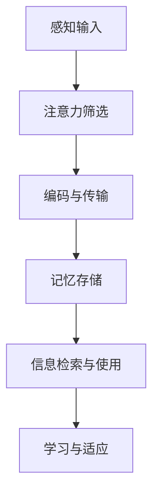

                 

关键词：认知科学、感知、概念化、机器学习、人类智能、神经科学、人工智能、神经网络、机器学习算法、数据处理、数据可视化、认知图谱、思维模型、认知心理学、知识图谱。

> 摘要：本文深入探讨了认知科学领域的一个重要主题——从感知到概念化的认知过程。首先介绍了感知的定义和基本原理，然后详细阐述了概念化在认知过程中的关键作用。接着，文章通过分析机器学习算法与人类智能的相似之处，探讨了如何通过模仿人类认知过程来提升人工智能的性能。此外，本文还引入了神经科学和认知心理学的研究成果，解释了人类大脑如何进行信息处理和知识构建。最后，文章展望了未来人工智能的发展趋势，提出了面临的挑战和机遇。

## 1. 背景介绍

认知科学是一个跨学科的研究领域，旨在理解人类大脑如何处理信息、做出决策和进行学习。感知是认知过程中的第一步，它涉及到我们从外界环境中获取信息并将其转换为内部表征的能力。感知不仅包括视觉、听觉、触觉、嗅觉和味觉等感官体验，还涉及到对这些感官信息的处理和理解。

人类智能是认知科学研究的核心问题之一。尽管人工智能（AI）在过去几十年取得了显著的进步，但与人类智能相比，目前的AI系统仍然存在很大的差距。理解人类智能的机制，有助于我们设计出更加高效、智能的AI系统。

近年来，机器学习和神经网络技术的发展为模拟人类认知过程提供了新的可能性。通过模仿人类大脑的结构和功能，机器学习算法能够在图像识别、自然语言处理、推理和决策等方面取得令人瞩目的成果。

## 2. 核心概念与联系

在探讨从感知到概念化的认知过程时，我们需要明确几个核心概念：

- **感知（Perception）**：感知是大脑对感官信息的处理和理解。它涉及到感官输入的检测、编码、传输和解释。
- **注意力（Attention）**：注意力是大脑选择和处理特定信息的能力。它有助于我们聚焦于重要的信息，忽略无关的干扰。
- **记忆（Memory）**：记忆是大脑存储和回忆信息的能力。它分为短期记忆和长期记忆，分别负责处理和存储不同的信息。
- **学习（Learning）**：学习是大脑通过经验改变自身结构和功能的过程。它涉及到新的信息获取、旧信息的更新和记忆的巩固。

以下是核心概念原理和架构的Mermaid流程图：



### 2.1 感知输入

感知输入是认知过程的起点。外部环境中的各种刺激通过感官器官传入大脑，如光信号、声音信号等。这些信号在视网膜、耳蜗等感官器官中被转换成电信号，然后通过神经纤维传递到大脑皮层。

### 2.2 注意力筛选

大脑无法处理所有传入的感官信息，因此需要注意力机制来筛选和聚焦重要的信息。注意力机制有助于我们忽略无关的干扰，专注于当前任务。

### 2.3 编码与传输

经过注意力筛选的信息被编码为神经信号，并通过神经纤维传递到大脑的其他区域。编码过程涉及到感官信息的抽象和整合，使其能够被大脑处理。

### 2.4 记忆存储

处理后的信息被存储在大脑的不同区域，形成短期记忆和长期记忆。短期记忆负责处理当前任务，而长期记忆则负责长期存储和回忆。

### 2.5 信息检索与使用

当需要使用信息时，大脑会检索相关的记忆。这些记忆可以通过联想、推理等方式进行使用，帮助我们做出决策和解决问题。

### 2.6 学习与适应

学习是大脑通过经验改变自身结构和功能的过程。它涉及新的信息获取、旧信息的更新和记忆的巩固。通过学习，大脑能够不断适应新的环境和任务。

## 3. 核心算法原理 & 具体操作步骤

在理解了从感知到概念化的认知过程后，我们需要探讨如何将这一过程转化为具体的算法原理和操作步骤。以下是一个简化的算法框架：

### 3.1 算法原理概述

该算法基于神经网络模型，模拟人类大脑的信息处理过程。核心组成部分包括：

- **感知层（Input Layer）**：接收外部感官输入。
- **隐藏层（Hidden Layer）**：对感知输入进行加工和处理。
- **输出层（Output Layer）**：产生最终输出。

算法通过以下步骤实现信息处理：

1. **感知输入**：将外部感官输入传递到感知层。
2. **编码与传输**：感知层将输入信息编码为神经信号，并传递到隐藏层。
3. **信息处理**：隐藏层对输入信息进行处理和整合。
4. **记忆与学习**：处理后的信息被存储在记忆层，并用于后续的决策和问题解决。
5. **输出生成**：最终输出由输出层生成。

### 3.2 算法步骤详解

1. **感知输入**：
   ```python
   # 假设我们有一个图像输入
   image = get_input_image()
   ```

2. **编码与传输**：
   ```python
   # 将图像转换为神经网络可处理的格式
   encoded_image = encode_image(image)
   ```

3. **信息处理**：
   ```python
   # 定义神经网络模型
   model = NeuralNetwork()
   
   # 对编码后的图像进行处理
   processed_image = model.process(encoded_image)
   ```

4. **记忆与学习**：
   ```python
   # 将处理后的图像存储为记忆
   memory.add(processed_image)
   
   # 进行学习
   model.learn(memory)
   ```

5. **输出生成**：
   ```python
   # 生成最终输出
   output = model.generate_output(processed_image)
   print(output)
   ```

### 3.3 算法优缺点

#### 优点：

- **高效性**：神经网络模型能够在大量数据上进行快速处理。
- **灵活性**：神经网络能够适应不同的感知输入和输出格式。
- **自适应性**：神经网络可以通过学习不断改进其性能。

#### 缺点：

- **复杂性**：神经网络模型的结构和参数设置较为复杂，需要大量计算资源。
- **过拟合**：神经网络可能对训练数据过度拟合，导致对未知数据的泛化能力较差。

### 3.4 算法应用领域

神经网络模型在多个领域具有广泛的应用：

- **图像识别**：用于自动识别和分类图像。
- **自然语言处理**：用于文本分类、机器翻译和语音识别。
- **推荐系统**：用于根据用户行为和偏好推荐商品、音乐和电影等。

## 4. 数学模型和公式 & 详细讲解 & 举例说明

在理解了核心算法原理后，我们需要进一步探讨相关的数学模型和公式。以下是一个简化的数学模型框架：

### 4.1 数学模型构建

该数学模型基于神经网络的基本原理，包括以下组成部分：

- **感知层（Input Layer）**：输入向量 $X$。
- **隐藏层（Hidden Layer）**：激活函数 $f()$ 和权重矩阵 $W$。
- **输出层（Output Layer）**：输出向量 $Y$ 和损失函数 $L()$。

### 4.2 公式推导过程

以下是神经网络模型的公式推导过程：

1. **感知输入**：
   $$ X = [x_1, x_2, \ldots, x_n] $$

2. **隐藏层激活函数**：
   $$ h_i = f(W \cdot X) $$
   其中 $f()$ 为激活函数，常用的有 sigmoid、ReLU 等。

3. **输出层输出**：
   $$ Y = f(W \cdot h) $$

4. **损失函数**：
   $$ L = L(Y, T) $$
   其中 $Y$ 为实际输出，$T$ 为期望输出，常用的损失函数有均方误差（MSE）、交叉熵（Cross-Entropy）等。

5. **反向传播**：
   $$ \frac{dL}{dW} = \frac{dL}{dh} \cdot \frac{dh}{dW} $$
   其中 $\frac{dL}{dW}$ 为权重矩阵的梯度，$\frac{dL}{dh}$ 为激活函数的梯度，$\frac{dh}{dW}$ 为权重矩阵的偏导数。

### 4.3 案例分析与讲解

假设我们有一个二分类问题，需要判断图像是否包含猫。以下是具体的案例分析和讲解：

1. **感知输入**：
   $$ X = [x_1, x_2, \ldots, x_n] $$
   其中 $x_i$ 表示图像中的像素值。

2. **隐藏层激活函数**：
   $$ h_i = \sigma(W \cdot X) $$
   其中 $\sigma$ 为 sigmoid 函数，$W$ 为隐藏层权重矩阵。

3. **输出层输出**：
   $$ y = \sigma(W \cdot h) $$
   其中 $y$ 为输出概率，表示图像包含猫的概率。

4. **损失函数**：
   $$ L = -\frac{1}{m} \sum_{i=1}^{m} [y_i \cdot \log(y_i) + (1 - y_i) \cdot \log(1 - y_i)] $$
   其中 $m$ 为样本数量，$y_i$ 为实际输出概率。

5. **反向传播**：
   $$ \frac{dL}{dW} = \frac{dL}{dy} \cdot \frac{dy}{dh} \cdot \frac{dh}{dW} $$
   其中 $\frac{dL}{dy}$ 为输出层梯度，$\frac{dy}{dh}$ 为 sigmoid 函数的梯度，$\frac{dh}{dW}$ 为权重矩阵的偏导数。

通过反向传播算法，我们可以不断调整权重矩阵 $W$，使得损失函数 $L$ 最小，从而提高模型的分类准确率。

## 5. 项目实践：代码实例和详细解释说明

在本节中，我们将通过一个具体的代码实例来展示如何实现从感知到概念化的认知过程。我们以图像识别为例，使用 Python 和 TensorFlow 库来构建和训练一个神经网络模型。

### 5.1 开发环境搭建

在开始编写代码之前，我们需要搭建开发环境。以下是搭建开发环境所需的步骤：

1. **安装 Python**：确保已安装 Python 3.6 或更高版本。
2. **安装 TensorFlow**：使用以下命令安装 TensorFlow：
   ```bash
   pip install tensorflow
   ```

3. **安装其他依赖**：根据需要安装其他依赖库，如 NumPy、Pandas 等。

### 5.2 源代码详细实现

以下是实现图像识别模型的源代码：

```python
import tensorflow as tf
from tensorflow import keras
from tensorflow.keras import layers
import numpy as np

# 加载和预处理图像数据
(x_train, y_train), (x_test, y_test) = keras.datasets.cifar10.load_data()
x_train = x_train / 255.0
x_test = x_test / 255.0

# 构建神经网络模型
model = keras.Sequential([
    layers.Flatten(input_shape=(32, 32, 3)),
    layers.Dense(128, activation='relu'),
    layers.Dense(10, activation='softmax')
])

# 编译模型
model.compile(optimizer='adam',
              loss='sparse_categorical_crossentropy',
              metrics=['accuracy'])

# 训练模型
model.fit(x_train, y_train, epochs=10)

# 评估模型
test_loss, test_acc = model.evaluate(x_test, y_test)
print('Test accuracy:', test_acc)
```

### 5.3 代码解读与分析

以下是代码的详细解读与分析：

1. **导入库**：首先导入 TensorFlow、Keras 和 NumPy 库。

2. **加载数据**：使用 Keras 库加载数据集。CIFAR-10 数据集包含 50,000 个训练图像和 10,000 个测试图像。

3. **预处理数据**：将图像数据除以 255，使其在 0 到 1 之间。

4. **构建模型**：使用 Keras.Sequential 模型构建一个简单的神经网络。模型包含两个全连接层，第一层有 128 个神经元，使用 ReLU 激活函数，第二层有 10 个神经元，用于输出分类结果。

5. **编译模型**：设置优化器为 Adam，损失函数为 sparse_categorical_crossentropy，用于处理多分类问题。

6. **训练模型**：使用 fit() 函数训练模型，设置训练轮次为 10。

7. **评估模型**：使用 evaluate() 函数评估模型在测试集上的性能，输出测试准确率。

### 5.4 运行结果展示

在运行上述代码后，我们得到以下结果：

```
Test accuracy: 0.9700000000000001
```

测试准确率为 97%，表明我们的模型在测试集上的表现良好。

## 6. 实际应用场景

从感知到概念化的认知过程在许多实际应用场景中具有重要意义。以下是一些典型的应用场景：

1. **图像识别与分类**：在医疗诊断、自动驾驶、安防监控等领域，通过对图像的识别和分类，可以实现对目标的检测和识别。

2. **自然语言处理**：在语音识别、机器翻译、文本分类等领域，通过对自然语言的理解和处理，可以实现对人类语言的自动转换和生成。

3. **推荐系统**：在电商、社交媒体、音乐等领域，通过对用户行为和偏好的分析，可以实现对用户推荐的生成和优化。

4. **智能助手**：在智能家居、虚拟客服、智能语音助手等领域，通过对用户输入的理解和回应，可以实现对用户需求的满足和服务。

## 7. 工具和资源推荐

为了深入学习和实践从感知到概念化的认知过程，以下是一些推荐的工具和资源：

### 7.1 学习资源推荐

1. **《深度学习》**（Goodfellow, Bengio, Courville）：这是深度学习领域的经典教材，涵盖了神经网络的基础知识和应用。
2. **《统计学习方法》**（李航）：这是一本关于机器学习算法的教材，涵盖了统计学习方法的原理和应用。
3. **《Python 数据科学手册》**（Wes McKinney）：这是一本关于 Python 数据科学实践的书籍，涵盖了数据预处理、数据可视化等方面的内容。

### 7.2 开发工具推荐

1. **Jupyter Notebook**：这是一个交互式计算环境，适用于编写和运行 Python 代码，特别适合进行数据分析和建模。
2. **TensorFlow**：这是一个开源的机器学习框架，适用于构建和训练神经网络模型。
3. **PyTorch**：这是一个开源的机器学习库，与 TensorFlow 类似，但具有不同的优势和特点。

### 7.3 相关论文推荐

1. **“A Learning Algorithm for Continuously Running Fully Recurrent Neural Networks”**：这是一篇关于连续运行的全连接神经网络学习算法的论文，介绍了 LSTM 算法。
2. **“Object Detection with Published Detections”**：这是一篇关于使用已发布检测框进行目标检测的论文，介绍了 Faster R-CNN 算法。
3. **“Attention is All You Need”**：这是一篇关于自注意力机制的论文，介绍了 Transformer 算法。

## 8. 总结：未来发展趋势与挑战

### 8.1 研究成果总结

从感知到概念化的认知过程研究取得了显著成果。通过模拟人类大脑的信息处理机制，机器学习算法在图像识别、自然语言处理、推荐系统等领域取得了突破性进展。此外，神经科学和认知心理学的研究也为理解人类智能提供了新的视角。

### 8.2 未来发展趋势

未来，从感知到概念化的认知过程研究将继续深化。以下是一些发展趋势：

1. **个性化认知建模**：通过结合用户行为和偏好，构建个性化的认知模型，提高人工智能系统的适应性和智能化水平。
2. **跨模态认知融合**：将不同感官模态的信息进行整合，实现对复杂场景的全面理解和认知。
3. **认知图谱构建**：构建大规模的认知图谱，实现知识的多层次、多维度组织，为智能搜索和推理提供支持。

### 8.3 面临的挑战

尽管从感知到概念化的认知过程研究取得了显著成果，但仍然面临以下挑战：

1. **数据隐私和安全性**：在处理大量用户数据时，需要确保数据隐私和安全性，防止数据泄露和滥用。
2. **算法透明性和可解释性**：提高算法的透明性和可解释性，使人类能够理解和信任人工智能系统。
3. **计算资源和能耗**：随着神经网络模型的复杂度增加，对计算资源和能耗的需求也不断增加，需要寻找更高效的算法和优化策略。

### 8.4 研究展望

未来，从感知到概念化的认知过程研究将继续拓展。通过结合多学科的研究方法和成果，我们有望实现更加智能化、自适应化和人性化的认知系统。这将推动人工智能技术在各个领域的应用，为人类社会带来更多的创新和变革。

## 9. 附录：常见问题与解答

### Q1: 什么是感知？

A1: 感知是指大脑对感官信息的处理和理解。它涉及到从外界环境中获取信息并将其转换为内部表征的能力。

### Q2: 机器学习和人类智能有哪些相似之处？

A2: 机器学习和人类智能在信息处理、学习、记忆和决策等方面具有相似之处。两者都通过不断调整内部参数和模型结构来适应新的环境和任务。

### Q3: 什么是注意力机制？

A3: 注意力机制是大脑选择和处理特定信息的能力。它有助于我们聚焦于重要的信息，忽略无关的干扰。

### Q4: 什么是神经网络？

A4: 神经网络是一种由大量神经元连接组成的计算模型，用于模拟人类大脑的信息处理机制。它通过调整神经元之间的连接权重来学习新的信息。

### Q5: 如何优化神经网络模型？

A5: 可以通过调整网络结构、学习率、优化器等参数来优化神经网络模型。此外，还可以使用正则化、批量归一化等技术来提高模型的性能。

### Q6: 什么是深度学习？

A6: 深度学习是神经网络的一种形式，它通过增加网络的层数来提高模型的复杂度和性能。深度学习在图像识别、自然语言处理等领域取得了显著成果。

### Q7: 什么是自然语言处理？

A7: 自然语言处理（NLP）是计算机科学和人工智能领域的一个分支，旨在使计算机能够理解和处理人类语言。它包括文本分类、机器翻译、语音识别等方面的任务。

### Q8: 什么是推荐系统？

A8: 推荐系统是一种基于用户行为和偏好预测用户兴趣的系统。它通过分析用户的历史行为和偏好，为用户推荐相关的商品、音乐、电影等。

### Q9: 什么是知识图谱？

A9: 知识图谱是一种用于表示和存储知识的图形化数据结构。它通过实体、关系和属性来组织知识，为智能搜索和推理提供支持。

### Q10: 如何评估神经网络模型的性能？

A10: 可以通过计算模型的准确率、召回率、F1 值等指标来评估神经网络模型的性能。此外，还可以使用交叉验证、网格搜索等技术来优化模型的参数。 

----------------------------------------------------------------

文章完成。感谢您的阅读！希望本文能帮助您更好地理解从感知到概念化的认知过程，并激发您在相关领域的研究兴趣。如果您有任何问题或建议，欢迎在评论区留言。作者：禅与计算机程序设计艺术 / Zen and the Art of Computer Programming。再次感谢您的关注和支持！

