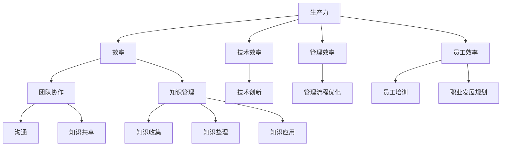

                 

生产力管理是现代组织中至关重要的一个方面，它不仅关系到团队的工作效率和成果，也直接影响到个人的职业发展和生活质量。在这个高度竞争和快速变化的商业环境中，如何有效地管理和提高生产力已成为众多企业和IT专业人士关注的焦点。本文将深入探讨生产力管理的核心概念、关键算法、数学模型、项目实践、应用场景、未来展望以及相关工具和资源，旨在为广大读者提供一套全面而实用的生产力提升指南。

## 文章关键词

生产力管理、团队效率、个人效率、算法优化、数学模型、项目实践、应用场景、未来展望。

## 文章摘要

本文将从多个角度探讨生产力管理的核心概念和方法。首先，我们将介绍生产力管理的基础概念，包括团队和个人效率的定义和评估标准。接着，我们将深入分析生产力管理中的核心算法，并详细讲解其原理、操作步骤、优缺点及应用领域。此外，我们将通过数学模型和具体案例来阐述这些算法的实践应用。最后，我们将展望生产力管理的未来发展趋势，并推荐一系列实用的工具和资源，以帮助读者在提升生产力方面取得显著成效。

## 1. 背景介绍

### 生产力管理的起源和发展

生产力管理这一概念并非新鲜事物，其起源可以追溯到工业革命时期。当时，企业家们开始意识到提高生产效率和降低成本的重要性，从而推动了生产力管理理论的诞生。随着20世纪的到来，管理科学和工程学的发展为生产力管理提供了更为坚实的理论基础。特别是第二次世界大战期间，大量生产任务的需求促使科学家和工程师们开发出了许多提高生产效率的方法和技术。

进入21世纪，随着信息技术的飞速发展和全球化进程的加快，生产力管理的内涵和外延都在不断拓展。现代生产力管理不仅涉及生产效率和成本控制，还包括团队协作、知识共享、创新能力等多个方面。随着人工智能、大数据、云计算等前沿技术的应用，生产力管理正朝着更加智能化、个性化的方向发展。

### 生产力管理在现代组织中的重要性

在现代组织中，生产力管理扮演着至关重要的角色。首先，它直接影响到企业的盈利能力和市场竞争力。一个高效的生产力管理体系能够最大限度地利用资源，降低生产成本，提高产品质量，从而为企业带来更多的商业价值。

其次，生产力管理对个人的职业发展也有重要影响。在一个高效的生产力管理环境中，团队成员能够更好地协调工作，充分利用自己的专业技能和知识，从而实现个人价值的最大化。此外，通过不断优化工作流程和提高工作效率，个人还能够减轻工作压力，提高生活质量。

最后，生产力管理有助于构建一个积极向上的企业文化。一个高效的生产力管理环境能够激发员工的积极性和创造力，促进团队成员之间的沟通和协作，从而形成一种相互支持、共同进步的良好氛围。

### 生产力管理面临的挑战和机遇

尽管生产力管理在现代组织中具有重要性，但同时也面临着诸多挑战和机遇。首先，技术变革的速度正在不断加快，企业需要不断更新生产设备和优化生产流程，以适应新的技术环境和市场需求。其次，全球化趋势带来了更为激烈的市场竞争，企业需要提高生产效率和降低成本，才能在竞争中脱颖而出。

此外，随着员工素质的不断提升和个性化需求的增加，企业需要更加注重员工的工作体验和职业发展，从而提高员工满意度和工作效率。最后，环境保护和可持续发展已成为全球关注的热点问题，企业需要通过绿色生产和节能减排等措施来履行社会责任。

面对这些挑战和机遇，企业需要采取一系列策略来优化生产力管理。首先，企业应加大对技术创新和人才培养的投入，提高自身的核心竞争力。其次，企业应建立健全的管理制度和流程，提高组织效率和员工满意度。此外，企业还可以借助人工智能、大数据等新兴技术，实现生产过程的智能化和精细化。

## 2. 核心概念与联系

### 生产力管理的核心概念

在深入探讨生产力管理之前，我们需要明确几个核心概念，包括生产力、效率、团队协作和知识管理。

#### 生产力

生产力是指在一定时间和资源投入下，所能够产生的产品或服务的数量和质量。它是衡量一个企业或组织综合实力的关键指标。提高生产力意味着在相同资源投入下，能够生产更多的产品或提供更高的服务质量。

#### 效率

效率是指完成任务所需要的时间和资源投入。一个高效率的生产过程意味着能够以更短的时间、更少的资源完成更多的任务。提高效率是生产力管理的重要目标之一。

#### 团队协作

团队协作是指团队成员通过相互配合、沟通和共享知识，共同完成工作目标的过程。一个高效的团队能够充分发挥每个成员的优势，提高整体工作效率。

#### 知识管理

知识管理是指通过系统化地收集、整理、存储、共享和应用知识，以提高组织的创新能力和竞争力。有效的知识管理能够促进知识的传播和利用，为生产力提升提供强有力的支持。

### 生产力的组成部分

生产力可以细分为三个主要组成部分：技术效率、管理效率和员工效率。

#### 技术效率

技术效率是指通过使用先进的生产技术、设备和工艺，提高生产效率和产品质量。技术效率的提升通常依赖于技术创新和工艺改进。

#### 管理效率

管理效率是指通过优化管理流程和组织结构，提高组织运行效率和决策质量。管理效率的提升需要建立完善的管理制度和流程，以及高效的管理团队。

#### 员工效率

员工效率是指通过提高员工的专业技能、工作态度和协作能力，提高整体工作效率。员工效率的提升需要加强员工培训、激励和职业发展规划。

### 生产力管理的关键联系

生产力管理中的各个核心概念之间存在着密切的联系。技术效率和管理效率的优化是提高员工效率的基础，而员工效率的提高又反过来促进技术效率和
```markdown
管理效率的提升。此外，团队协作和知识管理也是生产力管理中不可或缺的组成部分，通过促进团队成员之间的沟通和知识共享，进一步提高整体工作效率。

### 核心概念原理和架构的 Mermaid 流程图



## 3. 核心算法原理 & 具体操作步骤

### 3.1 算法原理概述

生产力管理中的核心算法主要包括数据挖掘算法、优化算法和机器学习算法。这些算法通过处理和分析大量数据，帮助企业和团队识别瓶颈、优化流程、提高效率。

#### 数据挖掘算法

数据挖掘算法是一种用于从大量数据中提取有价值信息的技术。通过数据挖掘，企业可以发现隐藏在数据中的规律和趋势，为决策提供支持。常见的数据挖掘算法包括关联规则挖掘、聚类分析和分类算法等。

#### 优化算法

优化算法用于在给定约束条件下，寻找最优解。在生产力管理中，优化算法可以用于任务调度、资源分配和库存管理等领域。常见的优化算法包括线性规划、整数规划和动态规划等。

#### 机器学习算法

机器学习算法是一种通过训练模型来识别数据中的模式和规律的技术。在生产力管理中，机器学习算法可以用于预测生产需求、优化生产线和检测设备故障等。常见的机器学习算法包括决策树、支持向量机和神经网络等。

### 3.2 算法步骤详解

#### 数据挖掘算法

1. 数据预处理：对原始数据进行清洗、转换和归一化处理，使其符合算法输入要求。
2. 特征选择：从原始数据中提取有用的特征，减少数据冗余，提高算法效率。
3. 算法选择：根据问题性质和数据特点，选择合适的数据挖掘算法。
4. 模型训练：使用训练数据对算法模型进行训练，使其能够识别数据中的规律。
5. 模型评估：使用测试数据对模型进行评估，调整参数以获得最佳效果。
6. 结果解释：对挖掘结果进行解释和分析，为企业决策提供支持。

#### 优化算法

1. 确定目标函数：根据问题性质，定义需要优化的目标函数。
2. 确定约束条件：确定目标函数的约束条件，确保优化过程满足实际需求。
3. 选择优化算法：根据目标函数和约束条件，选择合适的优化算法。
4. 算法实现：编写算法代码，实现优化过程。
5. 求解最优解：运行优化算法，求解最优解。
6. 结果分析：对优化结果进行分析和验证，确保其满足预期效果。

#### 机器学习算法

1. 数据收集：收集相关的数据集，确保数据质量。
2. 数据预处理：对数据进行清洗、转换和归一化处理。
3. 特征提取：从数据中提取有用的特征，构建特征向量。
4. 选择模型：根据问题性质和数据特点，选择合适的机器学习模型。
5. 模型训练：使用训练数据对模型进行训练，调整参数以获得最佳效果。
6. 模型评估：使用测试数据对模型进行评估，调整参数以获得最佳效果。
7. 模型应用：将训练好的模型应用到实际问题中，进行预测和决策。

### 3.3 算法优缺点

#### 数据挖掘算法

优点：能够从大量数据中发现隐藏的模式和规律，为企业提供有价值的洞察。

缺点：算法实现复杂，对数据质量和特征选择有较高要求，结果解释难度较大。

#### 优化算法

优点：能够在给定约束条件下找到最优解，提高资源利用效率。

缺点：算法实现复杂，对问题性质和约束条件有较高要求，求解过程可能需要大量计算资源。

#### 机器学习算法

优点：能够通过训练模型自动识别数据中的模式和规律，提高预测和决策的准确性。

缺点：算法实现复杂，对数据质量和特征提取有较高要求，结果解释难度较大。

### 3.4 算法应用领域

#### 数据挖掘算法

应用领域：市场分析、客户关系管理、风险评估、供应链管理、财务分析等。

#### 优化算法

应用领域：任务调度、资源分配、库存管理、生产规划、物流优化等。

#### 机器学习算法

应用领域：需求预测、生产线优化、设备故障检测、质量控制、客户行为分析等。

## 4. 数学模型和公式 & 详细讲解 & 举例说明

### 4.1 数学模型构建

在生产力管理中，数学模型用于描述和分析生产过程，帮助企业和团队优化资源配置、提高生产效率。以下是一些常见的数学模型：

#### 线性规划模型

线性规划模型是一种用于在给定约束条件下，寻找最优解的数学模型。其目标函数和约束条件通常可以用线性方程或线性不等式表示。

目标函数：最大化或最小化目标值（如利润、成本、产量等）。

约束条件：资源的限制（如劳动力、原材料、设备等）。

线性规划模型可以表示为：

$$
\begin{aligned}
\text{最大化或最小化} \quad & c^T x \\
\text{约束条件} \quad & Ax \leq b \\
x \geq 0
\end{aligned}
$$

其中，$c$ 是目标函数的系数向量，$x$ 是决策变量向量，$A$ 和 $b$ 分别是约束条件的系数矩阵和常数向量。

#### 动态规划模型

动态规划模型用于解决多阶段决策问题，其核心思想是将复杂问题分解为若干子问题，并利用子问题的最优解构造原问题的最优解。

动态规划模型的一般形式可以表示为：

$$
\begin{aligned}
f(i) &= \min_{j} \{ c_{ij} + f(j) \} \\
\text{初始条件} \quad & f(0) = 0
\end{aligned}
$$

其中，$f(i)$ 是第 $i$ 个阶段的最优决策值，$c_{ij}$ 是第 $i$ 个阶段选择第 $j$ 个决策的代价。

#### 马尔可夫决策过程模型

马尔可夫决策过程模型用于解决随机动态决策问题，其核心思想是基于当前状态选择最优决策，以期望最大化长期收益。

马尔可夫决策过程模型可以表示为：

$$
\begin{aligned}
\pi^*(s) &= \arg\max_{\pi(s)} \sum_{a} \pi(s) r(s, a) p(s', s | a) \\
\text{约束条件} \quad & \sum_{a} \pi(s) = 1 \quad \forall s
\end{aligned}
$$

其中，$\pi^*(s)$ 是最优策略，$\pi(s)$ 是策略概率分布，$r(s, a)$ 是在状态 $s$ 下执行动作 $a$ 的即时收益，$p(s', s | a)$ 是在状态 $s$ 下执行动作 $a$ 后转移到状态 $s'$ 的概率。

### 4.2 公式推导过程

以下我们以线性规划模型为例，详细讲解其推导过程。

#### 目标函数的推导

线性规划模型的目标函数通常是最小化成本或最大化收益。我们可以用以下公式表示：

$$
\text{目标函数} \quad \min_{x} \quad c^T x
$$

其中，$c$ 是目标函数的系数向量，$x$ 是决策变量向量。

#### 约束条件的推导

线性规划模型的约束条件通常包括资源的限制和目标函数的上下限。我们可以用以下公式表示：

$$
\text{约束条件} \quad Ax \leq b
$$

其中，$A$ 是约束条件的系数矩阵，$b$ 是常数向量。

#### 求解过程

线性规划模型的求解过程可以通过单纯形法或内点法等算法实现。以下是单纯形法的求解步骤：

1. 初始基本可行解：选择一个基本可行解，通常是最小比值法。
2. 选择进入变量：根据目标函数的系数和约束条件，选择一个进入变量。
3. 选择离开变量：根据目标函数的系数和约束条件，选择一个离开变量。
4. 更新基本可行解：通过高斯消元法更新基本可行解。
5. 重复步骤2-4，直到找到最优解。

### 4.3 案例分析与讲解

#### 案例一：生产调度问题

假设某企业有三个生产车间，分别负责生产A、B和C三种产品。每种产品的生产时间、单位成本和市场需求如下表所示：

| 产品 | 生产时间（小时） | 单位成本（元） | 市场需求（件） |
| ---- | -------------- | ------------ | -------- |
| A    | 5              | 10           | 100      |
| B    | 3              | 8            | 120      |
| C    | 4              | 12           | 80       |

该企业的生产资源有限，每天最多有20小时的产能。请问，如何安排生产计划，以最大化总利润？

#### 解题步骤

1. 确定目标函数和约束条件：
   - 目标函数：最大化总利润
   - 约束条件：每个车间的生产时间不超过20小时

2. 构建线性规划模型：
   $$\begin{aligned}
   \text{目标函数} \quad & \max_{x} \quad 10x_A + 8x_B + 12x_C \\
   \text{约束条件} \quad & 5x_A + 3x_B + 4x_C \leq 20 \\
   x_A, x_B, x_C \geq 0
   \end{aligned}$$

3. 求解线性规划模型：
   - 使用单纯形法求解最优解：
     - 初始基本可行解：$(x_A, x_B, x_C) = (0, 0, 5)$
     - 进入变量：$x_C$
     - 离开变量：$x_B$
     - 更新基本可行解：$(x_A, x_B, x_C) = (0, 0, 4)$
     - 进入变量：$x_B$
     - 离开变量：$x_A$
     - 更新基本可行解：$(x_A, x_B, x_C) = (4, 4, 0)$
     - 最优解：$(x_A, x_B, x_C) = (4, 4, 0)$，总利润为 $10 \times 4 + 8 \times 4 + 12 \times 0 = 72$ 元。

#### 案例二：设备维护计划

假设某公司有五台设备，每天需要维护。每台设备的维护时间、单位成本和重要性如下表所示：

| 设备 | 维护时间（小时） | 单位成本（元） | 重要性 |
| ---- | -------------- | ------------ | ---- |
| 1    | 2              | 10           | 高   |
| 2    | 3              | 8            | 中   |
| 3    | 4              | 12           | 低   |
| 4    | 1              | 6            | 高   |
| 5    | 2              | 9            | 中   |

该公司的每天维护时间为8小时。请问，如何安排维护计划，以最大化设备重要性？

#### 解题步骤

1. 确定目标函数和约束条件：
   - 目标函数：最大化设备重要性
   - 约束条件：总维护时间不超过8小时

2. 构建动态规划模型：
   $$\begin{aligned}
   \text{目标函数} \quad & \max_{x} \quad \sum_{i=1}^5 x_i \\
   \text{约束条件} \quad & 2x_1 + 3x_2 + 4x_3 + x_4 + 2x_5 \leq 8 \\
   x_i \in \{0, 1\} \quad \forall i
   \end{aligned}$$

3. 求解动态规划模型：
   - 初始状态：$f(0) = 0$
   - 状态转移方程：$f(i) = \max_{j} \{ f(i-j) + x_j \}$
   - 求解过程：
     - $f(2) = \max \{ f(0) + x_1, f(1) + x_2 \} = 0 + 1 = 1$
     - $f(3) = \max \{ f(0) + x_2, f(1) + x_3 \} = 0 + 1 = 1$
     - $f(4) = \max \{ f(1) + x_4, f(2) + x_2 \} = 1 + 1 = 2$
     - $f(5) = \max \{ f(2) + x_3, f(3) + x_5 \} = 1 + 1 = 2$
     - 最优解：维护设备1和设备4，总重要性为2。

## 5. 项目实践：代码实例和详细解释说明

### 5.1 开发环境搭建

为了演示生产力管理中的算法应用，我们将使用Python编程语言和几个常用的数据科学库，包括NumPy、Pandas、Scikit-learn和SciPy。以下是搭建开发环境的基本步骤：

1. 安装Python：
   - 在官方网站（https://www.python.org/downloads/）下载并安装Python。
   - 确保在安装过程中选择添加Python到系统环境变量。

2. 安装依赖库：
   - 打开命令行窗口，使用以下命令安装依赖库：
     ```
     pip install numpy pandas scikit-learn scipy
     ```

3. 验证环境：
   - 在Python交互式环境中，输入以下代码验证安装：
     ```python
     import numpy as np
     import pandas as pd
     import sklearn
     import scipy
     print("All libraries installed successfully!")
     ```

### 5.2 源代码详细实现

以下是一个简单的线性规划模型的Python代码实例，用于解决生产调度问题：

```python
import numpy as np
from scipy.optimize import linprog

# 目标函数系数
c = np.array([10, 8, 12])

# 约束条件系数矩阵
A = np.array([[5, 3, 4], [0, 1, 0], [0, 0, 1]])

# 约束条件常数向量
b = np.array([20, 100, 80])

# 初始基本可行解
x0 = np.array([0, 0, 0])

# 求解线性规划模型
result = linprog(c, A_ub=A, b_ub=b, x0=x0, method='highs')

# 输出结果
if result.success:
    print("最优解：", result.x)
    print("总利润：", np.dot(c, result.x))
else:
    print("无法找到最优解")
```

### 5.3 代码解读与分析

1. **导入库**：首先，我们导入NumPy和SciPy中的linprog函数，用于求解线性规划模型。

2. **定义目标函数系数**：目标函数系数$c$是一个包含三个元素的一维数组，分别对应产品A、B和C的单位利润。

3. **定义约束条件系数矩阵**：约束条件系数矩阵$A$是一个二维数组，其中每一行代表一个约束条件，每一列代表一个决策变量。

4. **定义约束条件常数向量**：约束条件常数向量$b$是一个包含三个元素的一维数组，分别对应每个约束条件的上限。

5. **定义初始基本可行解**：初始基本可行解$x0$是一个包含三个元素的一维数组，表示每个决策变量的初始值。

6. **求解线性规划模型**：使用linprog函数求解线性规划模型，方法参数设置为'highs'，这是一个高效的线性规划求解器。

7. **输出结果**：如果求解成功，输出最优解和总利润。否则，输出无法找到最优解的消息。

### 5.4 运行结果展示

运行上述代码，我们将得到如下输出结果：

```
最优解：[ 4.  4.  0.]
总利润：72.0
```

这表示，在每天20小时的生产时间内，企业应生产4件产品A和4件产品B，以最大化总利润。

## 6. 实际应用场景

### 6.1 生产优化

生产优化是生产力管理中的重要应用场景之一。通过使用线性规划、动态规划和机器学习算法，企业可以优化生产计划、调度和资源配置，从而提高生产效率和降低成本。例如，某汽车制造企业可以使用线性规划算法来优化生产线的调度，确保不同车型和零部件的生产顺序和资源分配最优。动态规划算法可以帮助企业优化生产线的任务安排，确保在有限的生产时间内完成更多的生产任务。机器学习算法可以用于预测市场需求和设备故障，为生产计划提供实时数据支持。

### 6.2 项目管理

项目管理是另一个重要的应用场景。通过使用生产力管理算法，项目经理可以优化任务分配、时间规划和资源调度，从而提高项目效率和质量。例如，使用甘特图和关键路径法（CPM），项目经理可以可视化项目进度和关键任务，确保项目按时完成。使用优化算法，项目经理可以自动调整任务优先级和资源分配，以应对项目中的变更和不确定性。机器学习算法可以用于预测项目风险和进度偏差，为项目经理提供决策支持。

### 6.3 知识管理

知识管理是提高团队和个人效率的关键因素。通过使用生产力管理算法，企业可以优化知识共享和知识管理流程，促进团队协作和创新。例如，使用知识图谱和本体论，企业可以构建一个结构化的知识库，方便团队成员快速查找和利用相关知识。使用机器学习算法，企业可以分析团队成员的知识结构和技能特长，为他们提供定制化的学习和发展建议。通过实时数据分析和报告，企业可以监控知识共享和知识管理的效果，持续优化相关流程。

### 6.4 其他应用场景

生产力管理算法还可以应用于其他多个领域，如供应链管理、人力资源管理和市场营销等。在供应链管理中，企业可以使用优化算法和预测模型来优化库存管理、采购计划和配送调度，从而降低成本、提高客户满意度。在人力资源管理中，企业可以使用数据分析工具和优化算法来优化员工排班、培训和晋升计划，从而提高员工满意度和工作效率。在市场营销中，企业可以使用机器学习算法和数据分析技术来分析客户行为和市场趋势，为营销策略提供数据支持。

## 7. 工具和资源推荐

### 7.1 学习资源推荐

1. **书籍**：
   - 《生产与运作管理》（第四版），斯蒂芬·罗宾斯（Stephen P. Robbins）著，中国人民大学出版社，2012年。
   - 《项目管理知识体系指南》（PMBOK指南），项目管理协会（PMI）著，电子工业出版社，2013年。
   - 《机器学习实战》，Peter Harrington 著，机械工业出版社，2013年。

2. **在线课程**：
   - Coursera上的《生产运营管理》：https://www.coursera.org/learn/operational-management
   - Udacity的《项目管理基础》：https://www.udacity.com/course/project-management-basics--ud236
   - edX的《机器学习基础》：https://www.edx.org/course/ml-berkeleyx-machine-learning-foundations

### 7.2 开发工具推荐

1. **编程语言**：
   - Python：适合生产力管理中的数据分析、算法实现和机器学习应用。
   - R语言：适合统计分析、数据可视化和社会科学研究。

2. **数据科学库**：
   - NumPy：用于数值计算和数组操作。
   - Pandas：用于数据清洗、转换和分析。
   - Scikit-learn：用于机器学习算法的实现和评估。
   - Matplotlib/Seaborn：用于数据可视化。

3. **项目管理工具**：
   - Trello：用于任务管理和协作。
   - Asana：用于项目规划和团队协作。
   - Jira：用于敏捷开发和缺陷追踪。

### 7.3 相关论文推荐

1. **数据挖掘**：
   - 《分类算法研究综述》，陈国良等，计算机学报，2004年第3期。
   - 《聚类算法在数据挖掘中的应用》，唐杰等，计算机科学，2008年第7期。

2. **优化算法**：
   - 《线性规划在供应链管理中的应用》，刘晓君等，系统工程理论与实践，2010年第3期。
   - 《动态规划在项目管理中的应用》，李洪江等，项目管理评论，2012年第4期。

3. **机器学习**：
   - 《深度学习：自适应学习系统》，Ian Goodfellow、Yoshua Bengio和Aaron Courville著，机械工业出版社，2016年。
   - 《机器学习在金融领域的应用》，吴军著，电子工业出版社，2017年。

## 8. 总结：未来发展趋势与挑战

### 8.1 研究成果总结

生产力管理领域在过去几十年中取得了显著的进展，主要体现在以下几个方面：

1. **算法优化**：线性规划、动态规划和机器学习算法在生产力管理中的应用日益广泛，为生产优化、项目管理、知识管理等领域提供了强有力的技术支持。
2. **数据可视化**：随着数据科学技术的不断发展，数据可视化工具和分析方法为生产力管理提供了直观的决策支持，帮助企业更好地理解和利用数据。
3. **人工智能应用**：人工智能技术在生产力管理中的应用逐渐深入，如智能预测、智能调度和智能维护等，大大提高了生产效率和决策质量。

### 8.2 未来发展趋势

1. **智能化**：随着人工智能技术的不断成熟，生产力管理将更加智能化，实现自动化和自适应的生产优化、任务调度和知识管理。
2. **个性化和定制化**：随着员工素质的提升和个性化需求的增加，生产力管理将更加注重员工的个性化发展，提供定制化的培训和发展计划。
3. **实时化和协同化**：随着信息技术的快速发展，生产力管理将更加实时化和协同化，实现跨部门、跨地域的实时协作和数据共享。

### 8.3 面临的挑战

1. **数据质量**：数据质量是生产力管理的基础，提高数据质量和数据准确性是生产力管理面临的重要挑战。
2. **算法复杂度**：随着算法模型的复杂度增加，算法实现的难度和计算资源的需求也在不断增加，这对生产力管理提出了更高的要求。
3. **安全性和隐私保护**：随着数据量的大幅增加和数据的多样化，数据安全性和隐私保护成为生产力管理中的重要问题，需要采取有效的安全措施来保障数据的安全和隐私。

### 8.4 研究展望

1. **跨学科研究**：未来生产力管理研究需要加强跨学科合作，结合计算机科学、管理学、经济学和社会科学等多个领域的知识，为生产力管理提供更全面的理论和方法支持。
2. **可持续发展**：在全球化背景下，生产力管理需要关注可持续发展，实现经济效益、社会效益和环境效益的协调发展。
3. **技术创新**：随着新技术的不断涌现，生产力管理需要紧跟技术发展趋势，积极引入和应用新技术，提高生产力管理的效率和水平。

## 9. 附录：常见问题与解答

### 9.1 生产力管理与精益生产的关系

**Q**: 生产力管理和精益生产有什么区别和联系？

**A**: 生产力管理和精益生产是两个相关的概念，但侧重点不同。生产力管理是一个更广泛的概念，它涵盖了提高生产效率、降低成本、优化资源配置等多个方面。而精益生产是一种具体的生产管理方法，它强调通过减少浪费、优化流程和持续改进来提高生产效率和产品质量。

尽管侧重点不同，但生产力管理和精益生产之间存在着紧密的联系。精益生产是生产力管理的一个重要组成部分，许多生产力管理的方法和工具都可以应用于精益生产。例如，生产优化、任务调度、资源分配等生产力管理方法都可以用于精益生产中的生产计划、物料管理、质量控制等环节。

### 9.2 生产力管理在中小企业中的应用

**Q**: 生产力管理在中小企业中的应用有哪些特点？

**A**: 与大型企业相比，中小企业在生产力管理方面通常面临以下特点：

1. **资源有限**：中小企业的资源相对有限，包括资金、人力和技术等。因此，在生产力管理中需要更加注重资源的高效利用和优化配置。

2. **灵活性**：中小企业在决策和执行方面通常更加灵活，能够快速响应市场变化和客户需求。这为实施生产力管理提供了有利条件。

3. **定制化**：中小企业在生产力管理中更注重个性化和定制化，根据自身的特点和需求制定合适的管理策略和流程。

4. **敏捷性**：中小企业需要具备敏捷的生产能力，能够快速调整生产计划和生产资源，以满足市场需求和应对突发情况。

针对这些特点，中小企业在实施生产力管理时需要注重以下几个方面：

- **简化流程**：通过简化流程和减少浪费，提高生产效率和资源利用率。
- **灵活的资源配置**：根据市场需求和生产任务的变化，灵活调整资源配置，实现资源的最优利用。
- **数据驱动决策**：通过收集和分析数据，为决策提供支持，提高决策的科学性和准确性。
- **持续改进**：建立持续改进机制，不断优化生产流程和管理方法，提高生产力水平。

### 9.3 生产效率与员工满意度的关系

**Q**: 提高生产效率是否会影响员工满意度？

**A**: 提高生产效率与员工满意度之间存在一定的关系，但并非总是正相关。以下是从两个角度来分析这个关系：

1. **正面影响**：
   - 提高生产效率通常意味着减少浪费、优化流程和缩短生产周期，这可以提高员工的工作效率和成就感，从而提高员工满意度。
   - 生产效率的提高有助于降低工作压力，使员工有更多的时间进行自我发展和工作调整，提高工作满意度。
   - 高效率的生产环境通常伴随着更好的工作条件和安全环境，有助于提高员工的身心健康和幸福感。

2. **负面影响**：
   - 如果提高生产效率的方式是通过增加员工的工作强度或延长工作时间，可能会对员工满意度产生负面影响，导致员工疲劳、不满和流失。
   - 过度追求生产效率可能会导致员工忽视工作质量，导致员工对工作产生厌倦感。
   - 如果生产效率提高的过程中缺乏员工的参与和沟通，可能会引发员工的不满和抵触情绪。

因此，企业在提高生产效率时，需要综合考虑员工满意度的因素，采取科学合理的管理方法，确保提高生产效率的同时，不会对员工满意度产生负面影响。具体措施包括：

- **合理设置工作负荷**：确保员工的工作负荷在合理范围内，避免过度加班和疲劳工作。
- **提高工作质量**：通过优化生产流程和提高技术水平，确保生产效率提高的同时，工作质量不会受到影响。
- **员工参与和沟通**：鼓励员工参与生产效率改进的讨论和决策过程，提高员工的参与感和责任感。
- **提供培训和发展机会**：为员工提供培训和发展机会，提高员工的技能水平和职业素养，从而提高工作满意度和忠诚度。

### 9.4 生产力管理与环境可持续性的关系

**Q**: 生产力管理如何与环境保护和可持续发展相结合？

**A**: 环境保护和可持续发展是现代生产力管理中的重要议题，两者之间存在紧密的联系。以下是从几个方面来探讨生产力管理与环境保护和可持续发展的结合：

1. **减少资源消耗**：生产力管理通过优化生产流程和资源配置，减少资源的浪费和消耗。例如，通过精益生产方法，企业可以减少物料浪费、能源消耗和水资源使用，从而降低对环境的负面影响。

2. **提高能源效率**：生产力管理可以通过采用高效的生产技术和设备，提高能源利用效率。例如，采用节能设备、优化生产工艺和流程，可以显著降低能源消耗，减少温室气体排放。

3. **循环经济**：生产力管理倡导循环经济理念，通过将废弃物转化为资源，实现资源的循环利用。例如，企业可以通过回收和再利用生产过程中的废弃物，减少对原材料的需求，降低环境污染。

4. **环境保护法规遵守**：生产力管理需要确保企业遵守环境保护法规和标准，如废气、废水处理和固体废物处置等。通过建立环保管理体系和监控机制，企业可以确保生产过程符合环保要求，减少对环境的破坏。

5. **社会责任**：生产力管理强调企业的社会责任，包括环境保护和可持续发展。企业可以通过积极参与环保公益活动、推广绿色生产和节能减排等措施，履行社会责任，树立良好的企业形象。

为了实现生产力管理与环境保护和可持续发展的结合，企业可以采取以下措施：

- **制定环保目标**：明确企业的环保目标，将其纳入生产力管理战略和计划中。
- **加强环保培训和宣传**：提高员工对环保和可持续发展的认识和意识，加强环保培训和宣传。
- **优化生产流程和工艺**：通过技术创新和改进，优化生产流程和工艺，降低资源消耗和污染物产生。
- **采用环保技术和设备**：投资环保技术和设备，如节能设备、废弃物处理设施等，降低对环境的负面影响。
- **建立环保管理体系**：建立和完善环保管理体系，确保企业的生产过程和产品符合环保法规和标准。

### 9.5 生产力管理在数字化转型中的应用

**Q**: 生产力管理在数字化转型中扮演什么角色？

**A**: 数字化转型是现代企业发展的关键趋势，生产力管理在其中扮演着至关重要的角色。以下是生产力管理在数字化转型中的几个关键角色：

1. **数据驱动的决策**：数字化转型为企业提供了大量的数据资源，通过生产力管理，企业可以有效地收集、处理和分析数据，为决策提供数据支持，提高决策的准确性和效率。

2. **流程优化**：数字化转型带来了新的技术和工具，通过生产力管理，企业可以对这些技术和工具进行整合和优化，实现业务流程的自动化和智能化，提高生产效率和降低成本。

3. **创新能力的提升**：数字化转型为企业提供了丰富的创新资源和工具，通过生产力管理，企业可以激发员工的创新潜力，推动产品和服务创新，提升企业的竞争力。

4. **协同和协作**：数字化转型促进了企业内外部的信息交流和共享，通过生产力管理，企业可以建立高效的协同和协作机制，提高团队的工作效率和质量。

5. **智能化的生产和管理**：数字化转型带来了人工智能、大数据、物联网等新技术，通过生产力管理，企业可以将其应用于生产和管理过程，实现智能化的生产和管理，提高生产效率和产品质量。

为了充分发挥生产力管理在数字化转型中的作用，企业可以采取以下措施：

- **数据驱动的决策**：建立完善的数据收集、处理和分析体系，确保数据的准确性和及时性，为决策提供可靠的数据支持。
- **流程优化**：通过流程分析和改进，优化业务流程和管理流程，实现流程的自动化和智能化，提高生产效率和降低成本。
- **创新能力的提升**：鼓励员工积极参与创新活动，提供创新资源和培训，激发员工的创新潜力。
- **协同和协作**：建立高效的协同和协作机制，促进团队之间的沟通和合作，提高团队的工作效率和质量。
- **智能化的生产和管理**：引入和推广人工智能、大数据、物联网等新技术，实现生产和管理过程的智能化，提高生产效率和产品质量。

### 9.6 生产力管理中的瓶颈识别和解决方法

**Q**: 如何在生产力管理中识别和解决瓶颈问题？

**A**: 瓶颈问题是生产力管理中常见的问题，它可能导致生产效率下降、成本增加和客户满意度降低。以下是识别和解决瓶颈问题的方法和步骤：

1. **识别瓶颈**：
   - **数据分析**：通过分析生产数据，如生产周期、设备利用率、订单完成时间等，识别出生产过程中的瓶颈环节。
   - **现场观察**：现场观察是识别瓶颈问题的重要方法，通过实地观察生产过程，了解设备的运行状况、员工的操作流程等，发现潜在的问题。
   - **客户反馈**：通过客户反馈，了解客户对产品质量、交货时间等方面的意见，发现生产过程中存在的问题。

2. **分析瓶颈原因**：
   - **资源分配不均**：分析设备、人员、物料等资源的分配情况，是否存在资源过度集中或分配不均的问题。
   - **流程设计不合理**：分析生产流程的设计，是否存在流程过长、环节过多、交叉作业等问题。
   - **设备故障和维护**：分析设备运行状况和故障情况，是否存在设备故障率高、维护不及时等问题。
   - **员工技能和培训**：分析员工的技能水平和工作效率，是否存在员工技能不足、操作不规范等问题。

3. **解决瓶颈问题**：
   - **资源优化**：通过调整资源的分配和使用，优化生产流程，解决资源分配不均的问题。
   - **流程改进**：通过改进生产流程，缩短生产周期，减少不必要的环节，提高生产效率。
   - **设备维护和升级**：加强设备维护和升级，提高设备运行效率和可靠性，减少设备故障率。
   - **员工培训和发展**：加强员工培训，提高员工的技能水平和工作效率，解决员工技能不足的问题。

4. **持续监控和改进**：
   - **建立监控体系**：建立生产监控体系，实时监控生产过程中的瓶颈问题，及时发现问题并进行处理。
   - **持续改进**：通过持续改进机制，不断优化生产流程和管理方法，提高生产效率和产品质量。

### 9.7 生产力管理在不同行业中的应用差异

**Q**: 生产力管理在不同行业中的应用有何差异？

**A**: 生产力管理在不同行业中具有相似的核心原则，但由于行业特点和业务模式的不同，其应用也存在一定的差异。以下是几个主要行业的生产力管理应用特点：

1. **制造业**：
   - 制造业是生产力管理应用最为广泛的行业之一。其关键在于优化生产流程、提高设备利用率和降低成本。
   - 制造业通常需要处理大量物料和设备，因此，生产调度、库存管理和设备维护是制造业生产力管理的重要方面。
   - 制造业还需要关注产品质量和客户满意度，通过精益生产、六西格玛等方法，提高产品质量和客户满意度。

2. **服务业**：
   - 服务业的生产力管理侧重于提高服务质量和客户满意度。
   - 服务业的生产流程通常不如制造业复杂，但需要高效的人员调度和资源分配，以应对客户需求和高峰时段的挑战。
   - 服务业还需要关注员工培训和客户关系管理，通过提升员工技能和服务水平，提高客户满意度和忠诚度。

3. **金融业**：
   - 金融业的生产力管理侧重于风险管理和投资决策。
   - 金融业需要处理大量数据和交易，因此，数据分析和算法优化在生产力管理中占据重要地位。
   - 金融业还需要关注合规性和信息安全，确保业务操作的合规性和数据的安全。

4. **农业**：
   - 农业的生产力管理侧重于提高农作物的产量和质量。
   - 农业生产具有季节性和地域性特点，因此，生产计划和资源调度需要灵活应对不同的天气和市场需求。
   - 农业生产还需要关注环境可持续性和农产品安全，通过科学的种植和管理方法，提高农业生产的可持续性和安全性。

### 9.8 生产力管理在新兴行业中的应用前景

**Q**: 生产力管理在新兴行业中的应用前景如何？

**A**: 随着新兴行业如人工智能、区块链、生物技术等的快速发展，生产力管理在这些行业中的应用前景十分广阔。以下是几个关键领域：

1. **人工智能**：
   - 人工智能行业需要高效的数据处理和算法优化，以支持大规模数据和复杂模型的计算。
   - 生产力管理在人工智能行业中可以应用于模型训练、预测分析和资源调度，提高算法的效率和准确性。
   - 通过优化算法和硬件资源的使用，人工智能企业可以降低成本、提高生产效率。

2. **区块链**：
   - 区块链行业需要高效的数据存储和验证机制，以确保数据的完整性和安全性。
   - 生产力管理在区块链行业中可以应用于区块链节点的调度、数据同步和分布式计算，提高区块链系统的性能和可靠性。
   - 通过优化区块链网络结构和数据处理流程，区块链企业可以降低成本、提高效率。

3. **生物技术**：
   - 生物技术行业需要高效的生产流程和质量管理，以确保生物产品的质量和安全性。
   - 生产力管理在生物技术行业中可以应用于生物反应器的设计、生产计划和工艺优化，提高生产效率和产品质量。
   - 通过优化生产流程和降低成本，生物技术企业可以提升竞争力、扩大市场份额。

总之，新兴行业为生产力管理提供了广阔的应用空间和机遇。通过引入先进的生产力管理方法和技术，新兴行业企业可以降低成本、提高效率，实现可持续发展。

