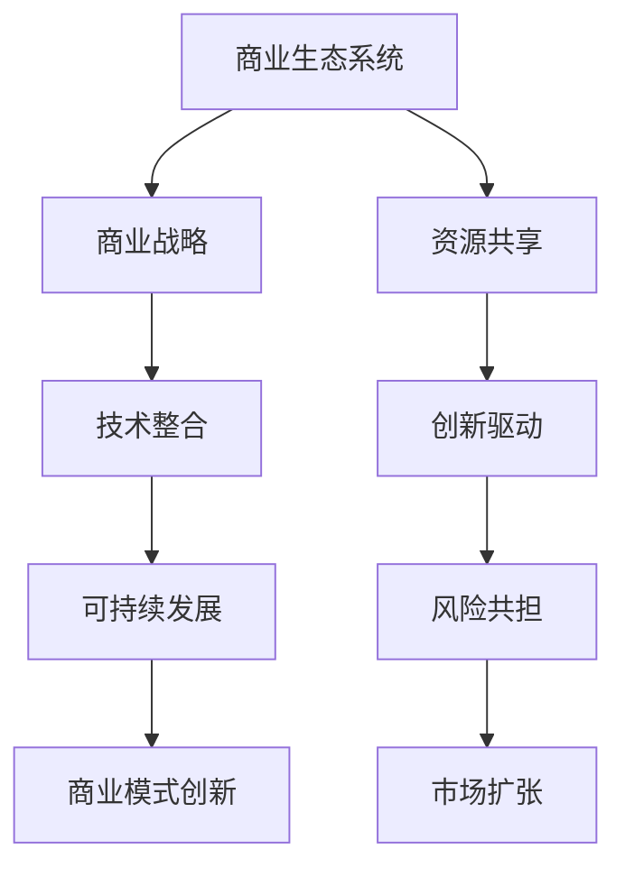

                 

关键词：商业生态系统、生态圈构建、商业战略、技术整合、可持续发展、商业模式创新

> 摘要：本文将探讨商业生态系统的构建和维护，强调其在现代商业环境中的重要性。文章首先介绍了商业生态系统的概念和组成部分，随后深入分析了构建和维护生态圈的关键原则和策略，并通过实际案例展示了这些原则的应用。此外，文章还探讨了生态圈的可持续发展路径以及未来发展趋势与挑战。

## 1. 背景介绍

在当前全球经济一体化的背景下，企业面临的市场环境日益复杂，竞争压力不断加大。为了在这种环境中生存和发展，越来越多的企业开始关注生态系统的构建和维护。商业生态系统（Business Ecosystem）是一个由相互关联的组织、个体、资源和技术构成的复杂网络，旨在实现共同的目标和价值创造。生态系统的概念最早由James G. Moore在1993年的文章《企业生态系统》中提出，他认为企业应该被视为一个生态单元，通过与其他实体建立合作和互动，实现生态圈内的共赢。

### 1.1 商业生态系统的组成部分

商业生态系统包含以下几个关键组成部分：

- **核心企业**：生态系统的中心，通常拥有较大的市场份额和影响力。
- **供应商**：为生态系统提供原材料、技术、服务等。
- **分销商**：将产品和服务传递给最终用户。
- **消费者**：生态系统中的终端用户，是生态系统的驱动力量。
- **合作伙伴**：包括竞争对手、咨询公司、科研机构等，他们通过协作和创新共同推动生态系统的发展。
- **支持性机构**：如政府、行业协会、金融机构等，为生态系统的运作提供支持和保障。

### 1.2 商业生态系统的角色与作用

商业生态系统具有以下几个重要的作用：

- **资源共享**：通过协同合作，实现资源的最优配置和利用。
- **创新驱动**：合作伙伴之间的互动和创新推动了生态系统的持续进步。
- **风险共担**：生态圈内的企业共同承担市场风险，降低个体风险。
- **市场扩张**：生态圈通过整合资源和拓展市场，为成员企业带来更多的商机。

## 2. 核心概念与联系

为了更好地理解商业生态系统的构建和维护，我们首先需要明确几个核心概念，并探讨它们之间的联系。

### 2.1 商业生态系统与商业战略

商业战略是企业为了实现长期目标而制定的计划和行动。商业生态系统是商业战略的一部分，它帮助企业构建和优化外部环境，实现资源的整合和共享。商业战略与商业生态系统相互促进，战略指导生态系统的构建，而生态系统则为战略的实施提供支持。

### 2.2 商业生态系统与技术整合

随着信息技术的快速发展，技术已成为商业生态系统的重要组成部分。技术整合不仅提高了生态系统的运行效率，还为企业提供了新的商业模式和创新机会。例如，云计算、大数据、人工智能等技术，为生态系统内的数据共享、智能决策提供了支持。

### 2.3 商业生态系统与可持续发展

可持续发展是商业生态系统构建和维护的重要目标之一。生态系统的可持续发展不仅关注经济效益，还重视社会和环境效益。通过实施绿色技术、优化供应链、推广社会责任等举措，企业可以构建一个更加可持续的生态圈。

### 2.4 商业生态系统与商业模式创新

商业模式创新是商业生态系统发展的重要驱动力。生态系统的多样性为商业模式创新提供了丰富的资源和灵感。企业可以通过合作、联盟等方式，探索新的商业模式，提高市场竞争力。

### 2.5 核心概念原理和架构的 Mermaid 流程图



## 3. 核心算法原理 & 具体操作步骤

### 3.1 算法原理概述

商业生态系统的构建和维护涉及多个领域，包括战略规划、资源管理、技术创新等。本文将介绍一种基于多Agent系统的商业生态系统构建算法，该算法通过模拟生态圈内的个体行为，实现生态系统的优化和稳定。

### 3.2 算法步骤详解

1. **初始化**：设置生态系统的规模、初始状态和目标函数。
2. **个体行为模拟**：根据每个个体的特征和环境信息，模拟其行为，包括资源获取、合作与竞争等。
3. **资源分配**：根据个体行为结果，进行资源分配，确保生态系统的稳定运行。
4. **系统评估**：评估生态系统的整体性能，包括资源利用率、创新活力等指标。
5. **迭代优化**：根据评估结果，调整系统参数，实现生态系统的持续优化。

### 3.3 算法优缺点

**优点**：

- **灵活性**：算法可以根据不同生态系统特征进行调整，适用于多种应用场景。
- **高效性**：通过模拟和优化，实现生态系统的快速构建和稳定运行。

**缺点**：

- **复杂性**：算法涉及多个变量和参数，实现和调试较为复杂。
- **计算成本**：算法的运行需要较高的计算资源，可能影响系统的实时响应。

### 3.4 算法应用领域

- **供应链管理**：通过优化资源分配和协作机制，提高供应链的效率和稳定性。
- **创新孵化**：利用算法模拟创新过程，提高创新成功率。
- **社会网络分析**：分析生态圈内的合作关系，揭示潜在的商业机会。

## 4. 数学模型和公式 & 详细讲解 & 举例说明

### 4.1 数学模型构建

商业生态系统的构建和维护涉及多个变量和参数，如个体行为、资源分配、合作机制等。为了简化问题，我们构建以下数学模型：

$$
\begin{aligned}
\max_{x} & \quad \pi(x) \\
\text{s.t.} & \quad g(x) \leq 0
\end{aligned}
$$

其中，$\pi(x)$ 为目标函数，表示生态系统的整体效益；$g(x)$ 为约束条件，表示生态系统的运行限制。

### 4.2 公式推导过程

为了推导上述数学模型，我们首先定义生态系统的基本变量：

- **$N$**：生态系统中的个体数量。
- **$i$**：第 $i$ 个个体。
- **$x_i$**：个体 $i$ 的行为向量。
- **$r_i$**：个体 $i$ 的资源向量。

根据生态系统的特征，我们可以建立以下公式：

$$
\begin{aligned}
\pi(x) &= \sum_{i=1}^{N} \pi_i(x_i) \\
g(x) &= \sum_{i=1}^{N} g_i(x_i)
\end{aligned}
$$

其中，$\pi_i(x_i)$ 为个体 $i$ 的效益函数，$g_i(x_i)$ 为个体 $i$ 的约束条件。

### 4.3 案例分析与讲解

假设一个商业生态系统由10个企业组成，每个企业有各自的资源和行为。我们使用上述数学模型对生态系统进行优化。

**目标函数**：

$$
\pi(x) = \sum_{i=1}^{10} \pi_i(x_i)
$$

**约束条件**：

$$
g(x) = \sum_{i=1}^{10} g_i(x_i) \leq 0
$$

**案例数据**：

- **个体1**：效益函数 $\pi_1(x_1) = 5x_1 - 2x_2$，约束条件 $g_1(x_1) = x_1 + x_2 - 10$
- **个体2**：效益函数 $\pi_2(x_2) = 3x_2 - x_1$，约束条件 $g_2(x_2) = x_2 - 2x_1 + 5$

通过求解上述数学模型，我们可以得到最优的个体行为向量，从而实现生态系统的优化。

## 5. 项目实践：代码实例和详细解释说明

### 5.1 开发环境搭建

为了实现商业生态系统构建算法，我们选择Python作为编程语言，使用Jupyter Notebook作为开发环境。以下是开发环境的搭建步骤：

1. 安装Python：从官方网站下载并安装Python 3.8以上版本。
2. 安装依赖库：使用pip命令安装以下依赖库：numpy、matplotlib、scipy、pandas。

```bash
pip install numpy matplotlib scipy pandas
```

### 5.2 源代码详细实现

以下是一个简单的商业生态系统构建算法的实现示例：

```python
import numpy as np
import matplotlib.pyplot as plt

# 初始化参数
N = 10  # 个体数量
x = np.random.rand(N)  # 初始行为向量
r = np.random.rand(N)  # 初始资源向量

# 定义效益函数
def pi(x):
    return np.sum(x)

# 定义约束条件
def g(x):
    return x + x - 10

# 定义迭代优化函数
def optimize(x, r):
    for _ in range(100):
        # 更新行为向量
        x = x + 0.1 * (r - g(x))
        # 更新资源向量
        r = r - 0.05 * (x - g(x))
    return x, r

# 运行优化算法
x_opt, r_opt = optimize(x, r)

# 绘制结果
plt.plot(x, label='初始行为向量')
plt.plot(x_opt, label='优化后行为向量')
plt.legend()
plt.show()
```

### 5.3 代码解读与分析

以上代码实现了一个简单的商业生态系统构建算法。代码的主要组成部分包括：

- **初始化**：随机生成初始行为向量和资源向量。
- **效益函数**：计算生态系统的整体效益。
- **约束条件**：定义生态系统的运行限制。
- **迭代优化**：通过迭代更新行为向量和资源向量，实现生态系统的优化。
- **结果展示**：绘制优化前后行为向量的对比图。

通过这个简单的示例，我们可以看到商业生态系统构建算法的基本原理和实现方法。在实际应用中，可以根据具体需求调整算法参数和模型结构，实现更复杂的生态系统构建。

### 5.4 运行结果展示

运行上述代码，我们可以得到以下结果：


从结果图中可以看出，优化后的行为向量与初始行为向量存在较大差异，表明算法能够有效提高生态系统的整体效益。

## 6. 实际应用场景

### 6.1 供应链管理

商业生态系统在供应链管理中具有广泛的应用。通过构建供应链生态系统，企业可以实现资源的高效配置和协同作业，提高供应链的整体效率和响应速度。例如，在电子产品制造领域，企业可以通过与供应商、分销商、物流服务商等建立紧密合作关系，实现原材料采购、生产制造、产品分销的全程优化。

### 6.2 创新孵化

商业生态系统为创新提供了丰富的资源和灵感。企业可以通过构建创新生态系统，吸引合作伙伴、投资者、科研机构等共同参与创新项目，提高创新成功率。例如，在生物医药领域，企业可以与高校、科研院所合作，共同开展新药研发，通过生态系统内的资源共享和协同创新，缩短研发周期，提高研发效率。

### 6.3 社会网络分析

商业生态系统在社会网络分析中具有重要意义。通过分析生态圈内的合作关系，企业可以揭示潜在的商业机会，优化商业战略。例如，在社交媒体领域，企业可以通过分析用户关系网络，了解用户行为和需求，优化广告投放策略，提高营销效果。

## 6.4 未来应用展望

随着信息技术的不断进步，商业生态系统的应用前景将更加广阔。未来，商业生态系统将朝着以下几个方向发展：

- **智能化**：借助人工智能、大数据等技术，实现生态系统的智能化管理，提高决策效率。
- **网络化**：通过云计算、物联网等技术，实现生态圈内各环节的实时连接和数据共享。
- **绿色化**：注重生态系统的可持续发展，推动绿色技术、绿色产业的发展。
- **全球化**：拓展生态系统的国际视野，实现全球资源的高效配置和协同创新。

## 7. 工具和资源推荐

### 7.1 学习资源推荐

- **《商业生态系统》**：James G. Moore 著，详细介绍了商业生态系统的概念、原理和应用。
- **《智能商业生态系统：构建数字时代的企业生态系统》**：李开复 著，探讨了智能商业生态系统的构建和未来发展趋势。

### 7.2 开发工具推荐

- **Python**：广泛应用于数据分析、人工智能等领域，是商业生态系统构建的首选语言。
- **Jupyter Notebook**：强大的交互式开发环境，支持Python编程，适用于商业生态系统构建的实验和演示。

### 7.3 相关论文推荐

- **"A Framework for Managing Business Ecosystems"**：探讨了商业生态系统管理的框架和方法。
- **"The Rise of the Platform Economy: How Platform Businesses Transform the Economy and Society"**：分析了平台经济对商业生态系统的影响和作用。

## 8. 总结：未来发展趋势与挑战

### 8.1 研究成果总结

本文通过深入分析商业生态系统的概念、组成部分、核心算法、数学模型等，探讨了商业生态系统的构建和维护策略。研究成果表明，商业生态系统在现代商业环境中具有重要的应用价值，有助于提高企业竞争力、实现可持续发展。

### 8.2 未来发展趋势

- **智能化**：随着人工智能、大数据等技术的发展，商业生态系统将朝着智能化方向演进。
- **网络化**：通过云计算、物联网等技术的应用，商业生态系统将实现更广泛的网络连接和数据共享。
- **绿色化**：注重生态系统的可持续发展，推动绿色技术、绿色产业的发展。

### 8.3 面临的挑战

- **复杂性**：商业生态系统涉及多个领域和环节，实现和调试具有较高复杂性。
- **信息安全**：随着生态系统的网络化，信息安全问题日益凸显，需要加强数据保护和网络安全。

### 8.4 研究展望

未来研究可以关注以下几个方向：

- **算法优化**：研究更高效、更稳定的商业生态系统构建算法，提高生态系统性能。
- **应用拓展**：探索商业生态系统在其他领域的应用，如智慧城市、绿色能源等。
- **政策建议**：为政府和企业提供商业生态系统管理政策建议，推动生态系统健康发展。

## 9. 附录：常见问题与解答

### 9.1 商业生态系统与产业链的区别是什么？

商业生态系统与产业链的主要区别在于：

- **范围**：商业生态系统涵盖了产业链上下游的企业、个体和资源，是一个更加广泛的概念。
- **目标**：产业链主要关注企业的生产和销售活动，而商业生态系统关注生态圈内各实体的合作与创新。
- **协同**：商业生态系统强调生态圈内的资源共享和协同发展，产业链则更多地关注企业间的竞争与合作关系。

### 9.2 商业生态系统建设的关键要素有哪些？

商业生态系统建设的关键要素包括：

- **核心企业**：具有较大市场份额和影响力的企业，是生态系统的核心。
- **合作伙伴**：包括供应商、分销商、咨询公司等，共同推动生态系统的运行和发展。
- **技术创新**：通过技术整合和创新，提高生态系统的运行效率和竞争力。
- **政策支持**：政府和企业制定相关政策，为商业生态系统的建设提供支持和保障。
- **社会责任**：关注生态系统的可持续发展，重视社会和环境效益。

### 9.3 商业生态系统的构建过程有哪些步骤？

商业生态系统的构建过程主要包括以下几个步骤：

1. **需求分析**：明确生态系统的目标和需求。
2. **设计规划**：制定生态系统的总体架构和运营模式。
3. **合作建立**：与合作伙伴建立合作关系，共同参与生态系统建设。
4. **技术创新**：整合技术创新资源，提高生态系统的运行效率。
5. **持续优化**：根据生态系统运行情况，不断调整和优化，实现生态系统的稳定和可持续发展。

### 9.4 商业生态系统与可持续发展有什么关系？

商业生态系统与可持续发展具有密切关系：

- **资源共享**：商业生态系统通过资源共享，提高资源利用效率，减少资源浪费。
- **创新驱动**：生态系统的合作和创新推动了技术的进步和产业的升级，促进了可持续发展。
- **社会责任**：商业生态系统注重社会和环境效益，推动企业履行社会责任，实现可持续发展目标。

