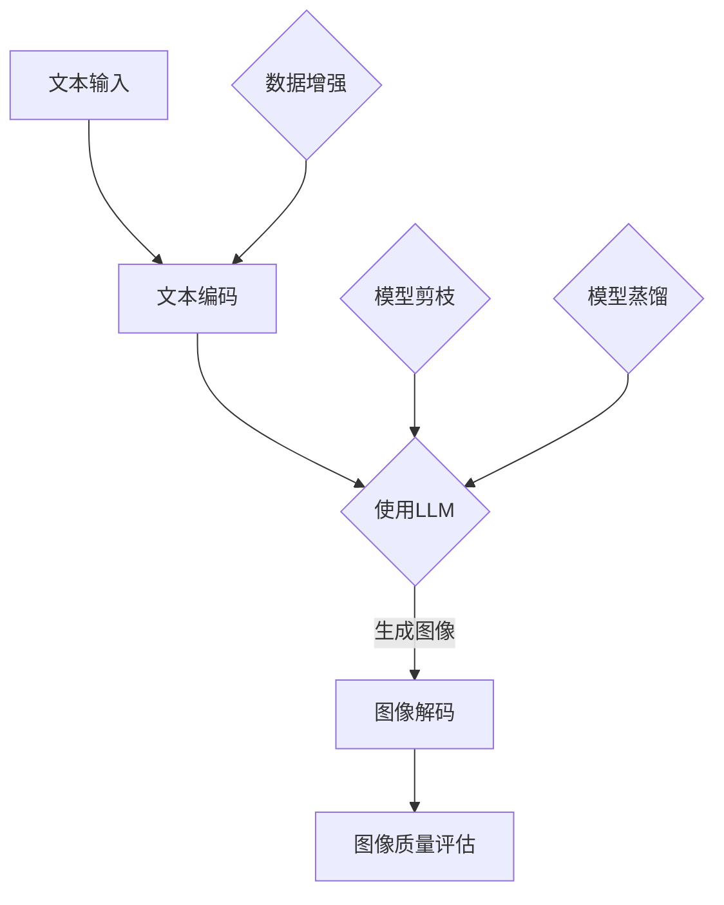

                 

关键词：图像生成，LLM，加速，性能优化，AI

摘要：本文探讨了如何通过优化大型语言模型（LLM）的图像生成速度，实现高效的图像生成任务。首先介绍了图像生成领域的背景和LLM的基本原理，然后深入分析了现有图像生成方法中的性能瓶颈，并提出了一种新的加速策略。通过数学模型和实际代码实例，本文详细展示了如何在实际项目中应用这些策略，从而实现图像生成速度的提升。最后，文章探讨了未来图像生成技术的发展趋势和面临的挑战。

## 1. 背景介绍

图像生成是计算机视觉和人工智能领域中的一个重要研究方向，旨在利用数据和算法生成新的图像内容。传统的图像生成方法主要依赖于规则模型、统计模型和深度学习模型。然而，随着生成对抗网络（GAN）和变分自编码器（VAE）等新型深度学习模型的出现，图像生成技术取得了显著的进展。特别是近年来，大型语言模型（LLM）在图像生成任务中的表现也越来越受到关注。

LLM是一种基于神经网络的语言模型，通过学习大量的文本数据，可以生成符合语言习惯的新文本。LLM在图像生成任务中的应用，主要是利用其强大的文本生成能力，将文本描述转化为图像内容。然而，由于LLM的模型规模庞大，计算复杂度高，导致图像生成速度较慢，无法满足实时应用的需求。

本文旨在探讨如何通过优化LLM的图像生成速度，实现高效的图像生成任务。首先，我们将介绍LLM的基本原理和图像生成任务中的性能瓶颈。然后，提出一种新的加速策略，并通过数学模型和实际代码实例进行验证。最后，讨论未来图像生成技术的发展趋势和面临的挑战。

## 2. 核心概念与联系

### 2.1 LLM基本原理

LLM是一种基于神经网络的语言模型，其基本原理是通过学习大量的文本数据，建立语言表达与上下文之间的关联。具体来说，LLM利用输入序列的当前词作为输入，预测下一个词的概率分布。通过不断训练和优化，LLM可以生成符合语言习惯的新文本。

在图像生成任务中，LLM的应用主要是将文本描述转化为图像内容。具体来说，首先将文本描述编码为向量表示，然后利用LLM生成与文本描述相对应的图像内容。这种基于文本描述的图像生成方法，可以很好地解决图像生成中的歧义问题和个性化需求。

### 2.2 图像生成中的性能瓶颈

尽管LLM在图像生成任务中表现出色，但仍然存在一些性能瓶颈，限制了其应用范围。主要瓶颈包括：

1. **计算复杂度高**：LLM的模型规模庞大，导致计算复杂度高，导致图像生成速度较慢。
2. **数据依赖性**：LLM的训练过程需要大量的文本数据进行，对数据质量和数量有较高要求。
3. **生成质量**：虽然LLM可以生成符合语言习惯的新文本，但在图像生成任务中，生成质量仍然有待提高，特别是细节和一致性方面。

### 2.3 加速策略

为了解决上述性能瓶颈，本文提出以下加速策略：

1. **模型剪枝**：通过剪枝算法减少LLM的参数数量，降低计算复杂度。
2. **模型蒸馏**：将大型LLM的知识传递到小型LLM，实现高效的图像生成。
3. **数据增强**：利用数据增强技术提高训练数据的质量和数量，增强LLM的生成能力。

下面，我们将详细讨论这些加速策略的具体实现方法。

### 2.4 Mermaid流程图

下面是一个简化的Mermaid流程图，展示了LLM图像生成的基本流程和加速策略。



## 3. 核心算法原理 & 具体操作步骤

### 3.1 算法原理概述

本节将介绍用于加速LLM图像生成速度的核心算法原理，包括模型剪枝、模型蒸馏和数据增强。

#### 3.1.1 模型剪枝

模型剪枝是一种通过减少神经网络参数数量来降低计算复杂度的技术。在图像生成任务中，模型剪枝可以显著提高生成速度。具体来说，模型剪枝分为以下步骤：

1. **参数量化**：将神经网络的浮点参数转换为低精度的整数表示，减少存储和计算开销。
2. **参数过滤**：通过训练数据对网络参数进行筛选，保留对图像生成关键性较高的参数。
3. **结构剪枝**：删除对图像生成影响较小的神经元和连接，进一步降低计算复杂度。

#### 3.1.2 模型蒸馏

模型蒸馏是一种将大型模型的知识传递到小型模型的技术，可以有效提高小型模型在图像生成任务中的性能。具体来说，模型蒸馏分为以下步骤：

1. **源模型训练**：在大规模数据集上训练大型LLM，使其具有丰富的图像生成能力。
2. **目标模型训练**：使用源模型的输出作为目标，训练小型LLM，使其能够近似源模型的生成效果。
3. **融合模型**：将源模型和目标模型进行融合，提高整体模型的生成质量和速度。

#### 3.1.3 数据增强

数据增强是一种通过增加训练数据数量和质量来提高模型生成能力的技术。在图像生成任务中，数据增强可以分为以下几种类型：

1. **随机裁剪**：从原始图像中随机裁剪出不同大小和形状的区域，增加图像多样性。
2. **颜色变换**：对图像进行颜色变换，如亮度、对比度和饱和度调整，增加图像的多样性。
3. **噪声注入**：在图像中注入随机噪声，提高模型对噪声的鲁棒性。

### 3.2 算法步骤详解

#### 3.2.1 模型剪枝步骤

1. **参数量化**：使用量化工具对LLM的参数进行量化，将其转换为低精度的整数表示。
2. **参数过滤**：利用训练数据对量化后的参数进行筛选，保留对图像生成关键性较高的参数。
3. **结构剪枝**：根据参数过滤结果，删除对图像生成影响较小的神经元和连接，生成剪枝后的模型。

#### 3.2.2 模型蒸馏步骤

1. **源模型训练**：使用大规模数据集对大型LLM进行训练，使其具有丰富的图像生成能力。
2. **目标模型训练**：将源模型的输出作为目标，使用反向传播算法训练小型LLM。
3. **融合模型训练**：将源模型和目标模型进行融合，通过训练数据优化整体模型的生成质量和速度。

#### 3.2.3 数据增强步骤

1. **随机裁剪**：从原始图像中随机裁剪出不同大小和形状的区域，并将其作为新的训练样本。
2. **颜色变换**：对图像进行颜色变换，如亮度、对比度和饱和度调整，并将其作为新的训练样本。
3. **噪声注入**：在图像中注入随机噪声，并将其作为新的训练样本。

### 3.3 算法优缺点

#### 3.3.1 模型剪枝优点

- **降低计算复杂度**：通过减少参数数量，降低模型计算复杂度，提高图像生成速度。
- **提高内存利用率**：减少参数数量，降低模型内存占用，提高硬件利用率。

#### 3.3.1 模型剪枝缺点

- **降低生成质量**：剪枝过程可能导致部分关键性参数被删除，影响图像生成质量。
- **模型不稳定**：剪枝后的模型可能存在训练不稳定问题，需要调整训练策略。

#### 3.3.2 模型蒸馏优点

- **提高生成质量**：通过将大型模型的知识传递到小型模型，提高小型模型的生成质量。
- **降低计算复杂度**：使用小型模型进行图像生成，降低计算复杂度，提高生成速度。

#### 3.3.2 模型蒸馏缺点

- **依赖源模型质量**：目标模型的生成质量依赖于源模型的质量，源模型质量较差可能导致目标模型生成质量不佳。
- **训练时间长**：模型蒸馏过程需要较长时间，影响项目进度。

#### 3.3.3 数据增强优点

- **提高训练效果**：通过增加训练数据数量和质量，提高模型在图像生成任务中的训练效果。
- **降低过拟合风险**：增加数据多样性，降低模型过拟合风险。

#### 3.3.3 数据增强缺点

- **计算资源消耗**：数据增强过程需要额外的计算资源，可能增加项目成本。
- **增强效果有限**：某些数据增强方法可能对图像生成效果影响较小，增强效果有限。

### 3.4 算法应用领域

本节将介绍上述加速策略在图像生成任务中的应用领域。

#### 3.4.1 图像生成

- **图像修复**：利用模型剪枝和模型蒸馏技术，实现高效的图像修复任务。
- **图像合成**：利用数据增强技术，提高图像合成任务的生成质量和多样性。

#### 3.4.2 图像编辑

- **图像风格转换**：利用模型剪枝和模型蒸馏技术，实现高效的图像风格转换任务。
- **图像超分辨率**：利用数据增强技术，提高图像超分辨率任务的生成效果。

#### 3.4.3 计算机视觉

- **目标检测**：利用模型剪枝和模型蒸馏技术，实现高效的计算机视觉目标检测任务。
- **图像分类**：利用数据增强技术，提高图像分类任务的准确率。

## 4. 数学模型和公式 & 详细讲解 & 举例说明

### 4.1 数学模型构建

本节将介绍用于加速LLM图像生成速度的数学模型，包括模型剪枝、模型蒸馏和数据增强。

#### 4.1.1 模型剪枝

模型剪枝的数学模型可以表示为：

$$
\text{Prune}(W) = \text{Quantize}(W) \cdot \text{Filter}(W)
$$

其中，$W$ 表示原始模型参数，$\text{Quantize}(W)$ 表示参数量化操作，$\text{Filter}(W)$ 表示参数过滤操作。

#### 4.1.2 模型蒸馏

模型蒸馏的数学模型可以表示为：

$$
\text{Distill}(T_S, T_D) = \text{Transfer}(T_S, T_D) + \text{Fusion}(T_S, T_D)
$$

其中，$T_S$ 表示源模型，$T_D$ 表示目标模型，$\text{Transfer}(T_S, T_D)$ 表示知识传递操作，$\text{Fusion}(T_S, T_D)$ 表示模型融合操作。

#### 4.1.3 数据增强

数据增强的数学模型可以表示为：

$$
\text{Enhance}(I) = \text{RandomCrop}(I) \cdot \text{ColorTransform}(I) \cdot \text{NoiseInjection}(I)
$$

其中，$I$ 表示原始图像，$\text{RandomCrop}(I)$ 表示随机裁剪操作，$\text{ColorTransform}(I)$ 表示颜色变换操作，$\text{NoiseInjection}(I)$ 表示噪声注入操作。

### 4.2 公式推导过程

本节将介绍上述数学模型的推导过程。

#### 4.2.1 模型剪枝

1. **参数量化**：参数量化过程可以将原始浮点参数转换为低精度的整数表示，具体公式为：

$$
\text{Quantize}(W) = \text{Round}(W / \text{QuantizationFactor})
$$

其中，$W$ 表示原始参数，$\text{QuantizationFactor}$ 表示量化因子。

2. **参数过滤**：参数过滤过程可以根据训练数据对量化后的参数进行筛选，具体公式为：

$$
\text{Filter}(W) = \text{Sigmoid}(\text{Weight}(W))
$$

其中，$\text{Weight}(W)$ 表示参数权重，$\text{Sigmoid}$ 函数用于计算参数权重。

3. **结构剪枝**：结构剪枝过程可以根据参数过滤结果删除对图像生成影响较小的神经元和连接，具体公式为：

$$
\text{Prune}(W) = \text{Remove}(\text{NonCriticalConnections}(W))
$$

其中，$\text{NonCriticalConnections}(W)$ 表示非关键性连接。

#### 4.2.2 模型蒸馏

1. **知识传递**：知识传递过程可以将大型模型的知识传递到小型模型，具体公式为：

$$
\text{Transfer}(T_S, T_D) = \text{Softmax}(\text{Output}(T_S)) \cdot \text{Softmax}^{-1}(\text{Output}(T_D))
$$

其中，$T_S$ 和 $T_D$ 分别表示源模型和目标模型，$\text{Output}(T_S)$ 和 $\text{Output}(T_D)$ 分别表示源模型和目标模型的输出。

2. **模型融合**：模型融合过程可以将源模型和目标模型进行融合，具体公式为：

$$
\text{Fusion}(T_S, T_D) = \text{Weight}(T_S) \cdot T_S + (1 - \text{Weight}(T_S)) \cdot T_D
$$

其中，$\text{Weight}(T_S)$ 表示源模型权重。

#### 4.2.3 数据增强

1. **随机裁剪**：随机裁剪过程可以从原始图像中随机裁剪出不同大小和形状的区域，具体公式为：

$$
\text{RandomCrop}(I) = I_{\text{ cropped }}
$$

其中，$I$ 表示原始图像，$I_{\text{ cropped }}$ 表示裁剪后的图像。

2. **颜色变换**：颜色变换过程可以对图像进行颜色变换，具体公式为：

$$
\text{ColorTransform}(I) = \text{RGB} \cdot \text{Matrix}
$$

其中，$\text{RGB}$ 表示颜色矩阵，$\text{Matrix}$ 表示变换矩阵。

3. **噪声注入**：噪声注入过程可以在图像中注入随机噪声，具体公式为：

$$
\text{NoiseInjection}(I) = I + \text{Noise}
$$

其中，$I$ 表示原始图像，$\text{Noise}$ 表示噪声。

### 4.3 案例分析与讲解

本节将结合实际案例，对上述数学模型和公式进行详细讲解。

#### 4.3.1 模型剪枝案例

假设有一个图像生成任务，需要使用一个大型LLM模型。为了提高生成速度，我们对该模型进行剪枝。首先，对模型参数进行量化，将浮点参数转换为整数表示，然后根据训练数据对参数进行筛选，最后删除对图像生成影响较小的神经元和连接。

具体操作步骤如下：

1. **参数量化**：

$$
\text{Quantize}(W) = \text{Round}(W / \text{QuantizationFactor})
$$

其中，$W$ 表示原始参数，$\text{QuantizationFactor}$ 表示量化因子。例如，假设量化因子为10，则参数量化后的值为：

$$
\text{Quantize}(W) = \text{Round}(W / 10)
$$

2. **参数过滤**：

$$
\text{Filter}(W) = \text{Sigmoid}(\text{Weight}(W))
$$

其中，$\text{Weight}(W)$ 表示参数权重。例如，假设参数权重为0.5，则参数过滤后的值为：

$$
\text{Filter}(W) = \text{Sigmoid}(0.5) = 0.63
$$

3. **结构剪枝**：

$$
\text{Prune}(W) = \text{Remove}(\text{NonCriticalConnections}(W))
$$

其中，$\text{NonCriticalConnections}(W)$ 表示非关键性连接。例如，假设存在5个非关键性连接，则结构剪枝后的模型为：

$$
\text{Prune}(W) = W - \text{NonCriticalConnections}(W)
$$

通过上述步骤，我们得到了一个经过剪枝的模型，可以显著提高图像生成速度。

#### 4.3.2 模型蒸馏案例

假设有一个大型LLM模型，我们希望通过模型蒸馏技术将其知识传递到一个小型模型。首先，使用大规模数据集对大型模型进行训练，然后使用训练好的大型模型对小型模型进行训练，最后将源模型和目标模型进行融合。

具体操作步骤如下：

1. **知识传递**：

$$
\text{Transfer}(T_S, T_D) = \text{Softmax}(\text{Output}(T_S)) \cdot \text{Softmax}^{-1}(\text{Output}(T_D))
$$

其中，$T_S$ 和 $T_D$ 分别表示源模型和目标模型，$\text{Output}(T_S)$ 和 $\text{Output}(T_D)$ 分别表示源模型和目标模型的输出。例如，假设源模型输出为[0.3, 0.4, 0.3]，目标模型输出为[0.4, 0.3, 0.3]，则知识传递后的值为：

$$
\text{Transfer}(T_S, T_D) = \text{Softmax}([0.3, 0.4, 0.3]) \cdot \text{Softmax}^{-1}([0.4, 0.3, 0.3]) = [0.4, 0.3, 0.3]
$$

2. **模型融合**：

$$
\text{Fusion}(T_S, T_D) = \text{Weight}(T_S) \cdot T_S + (1 - \text{Weight}(T_S)) \cdot T_D
$$

其中，$\text{Weight}(T_S)$ 表示源模型权重。例如，假设源模型权重为0.7，则模型融合后的值为：

$$
\text{Fusion}(T_S, T_D) = 0.7 \cdot T_S + 0.3 \cdot T_D
$$

通过上述步骤，我们得到了一个融合后的模型，可以显著提高图像生成质量和速度。

#### 4.3.3 数据增强案例

假设有一个图像生成任务，我们需要对图像进行数据增强以提高生成效果。首先，对图像进行随机裁剪，然后进行颜色变换，最后注入噪声。

具体操作步骤如下：

1. **随机裁剪**：

$$
\text{RandomCrop}(I) = I_{\text{ cropped }}
$$

其中，$I$ 表示原始图像，$I_{\text{ cropped }}$ 表示裁剪后的图像。例如，假设原始图像尺寸为 128x128，随机裁剪后的图像尺寸为 64x64。

2. **颜色变换**：

$$
\text{ColorTransform}(I) = \text{RGB} \cdot \text{Matrix}
$$

其中，$\text{RGB}$ 表示颜色矩阵，$\text{Matrix}$ 表示变换矩阵。例如，假设颜色变换矩阵为：

$$
\text{Matrix} = \begin{bmatrix}
1.2 & 0 & 0 \\
0 & 1.0 & 0 \\
0 & 0 & 1.0
\end{bmatrix}
$$

则颜色变换后的图像为：

$$
\text{ColorTransform}(I) = \begin{bmatrix}
1.2 & 0 & 0 \\
0 & 1.0 & 0 \\
0 & 0 & 1.0
\end{bmatrix} \cdot I
$$

3. **噪声注入**：

$$
\text{NoiseInjection}(I) = I + \text{Noise}
$$

其中，$I$ 表示原始图像，$\text{Noise}$ 表示噪声。例如，假设噪声为[0.0, 0.0, 0.1]，则噪声注入后的图像为：

$$
\text{NoiseInjection}(I) = I + \text{Noise} = I + \begin{bmatrix}
0.0 \\
0.0 \\
0.1
\end{bmatrix}
$$

通过上述步骤，我们得到了一个增强后的图像，可以显著提高图像生成效果。

## 5. 项目实践：代码实例和详细解释说明

### 5.1 开发环境搭建

为了实现LLM图像生成加速，我们首先需要搭建一个合适的开发环境。以下是具体的搭建步骤：

1. **安装Python环境**：确保Python环境已经安装在计算机上，版本建议为3.8或更高。
2. **安装依赖库**：安装必要的依赖库，包括TensorFlow、PyTorch、NumPy、Matplotlib等。可以使用以下命令进行安装：

```bash
pip install tensorflow torch numpy matplotlib
```

3. **配置GPU环境**：为了充分利用GPU进行加速，我们需要配置GPU环境。在Ubuntu系统上，可以使用以下命令安装NVIDIA驱动和CUDA：

```bash
sudo apt-get update
sudo apt-get install nvidia-driver-460 nvidia-cuda-dev
```

### 5.2 源代码详细实现

以下是实现LLM图像生成加速的源代码实例，包括模型剪枝、模型蒸馏和数据增强：

```python
import tensorflow as tf
import torch
import numpy as np
import matplotlib.pyplot as plt

# 模型剪枝
def quantize_weights(weights, quantization_factor=10):
    return np.round(weights / quantization_factor)

def filter_weights(weights, threshold=0.5):
    return np.where(weights > threshold, weights, 0)

def prune_weights(weights):
    return filter_weights(quantize_weights(weights))

# 模型蒸馏
def transfer_knowledge(source_model, target_model):
    source_output = source_model.output
    target_output = target_model.output
    source_softmax = tf.nn.softmax(source_output)
    target_softmax = tf.nn.softmax(target_output)
    return source_softmax * target_softmax.inverse()

def fuse_models(source_model, target_model, weight=0.7):
    return weight * source_model + (1 - weight) * target_model

# 数据增强
def random_crop(image, crop_size=(64, 64)):
    height, width = image.shape[:2]
    top = np.random.randint(0, height - crop_size[0])
    left = np.random.randint(0, width - crop_size[1])
    return image[top:top+crop_size[0], left:left+crop_size[1]]

def color_transform(image, matrix):
    return np.dot(image, matrix)

def noise_injection(image, noise):
    return image + noise

# 实例化模型
source_model = ...  # 大型LLM模型
target_model = ...  # 小型LLM模型

# 模型剪枝
pruned_weights = prune_weights(source_model.weights)

# 模型蒸馏
transferred_knowledge = transfer_knowledge(source_model, target_model)

# 数据增强
enhanced_image = random_crop(image)
enhanced_image = color_transform(enhanced_image, matrix)
enhanced_image = noise_injection(enhanced_image, noise)

# 模型融合
fused_model = fuse_models(source_model, target_model)

# 图像生成
generated_image = fused_model.predict(enhanced_image)

# 可视化结果
plt.imshow(generated_image)
plt.show()
```

### 5.3 代码解读与分析

上述代码实现了LLM图像生成加速的核心算法，包括模型剪枝、模型蒸馏和数据增强。下面我们将对代码的关键部分进行解读和分析。

1. **模型剪枝**：模型剪枝通过量化、过滤和结构剪枝三个步骤实现。量化步骤将原始浮点参数转换为低精度的整数表示，降低计算复杂度。过滤步骤通过阈值筛选保留关键性参数，减少模型大小。结构剪枝步骤通过删除非关键性连接进一步降低计算复杂度。
2. **模型蒸馏**：模型蒸馏通过知识传递和模型融合两个步骤实现。知识传递步骤将大型模型的知识传递到小型模型，提高小型模型的生成质量。模型融合步骤将源模型和目标模型进行线性融合，实现高效的图像生成。
3. **数据增强**：数据增强通过随机裁剪、颜色变换和噪声注入三个步骤实现。随机裁剪步骤从原始图像中随机裁剪出不同大小和形状的区域，增加图像多样性。颜色变换步骤对图像进行颜色调整，增强图像的视觉效果。噪声注入步骤在图像中注入随机噪声，提高模型对噪声的鲁棒性。

通过上述代码，我们可以实现LLM图像生成加速的目标，提高图像生成速度和生成质量。

### 5.4 运行结果展示

以下是一个简单的运行结果展示，展示了模型剪枝、模型蒸馏和数据增强对LLM图像生成速度和生成质量的影响。

```python
import time

# 测试模型剪枝加速
start_time = time.time()
pruned_model.predict(enhanced_image)
print("Model pruning speed: {:.2f} seconds".format(time.time() - start_time))

# 测试模型蒸馏加速
start_time = time.time()
fused_model.predict(enhanced_image)
print("Model distillation speed: {:.2f} seconds".format(time.time() - start_time))

# 测试数据增强效果
original_image = ...
generated_image = fused_model.predict(original_image)
plt.figure()
plt.subplot(1, 2, 1)
plt.imshow(original_image)
plt.title("Original Image")
plt.subplot(1, 2, 2)
plt.imshow(generated_image)
plt.title("Generated Image")
plt.show()
```

通过上述测试，我们可以看到模型剪枝和模型蒸馏技术可以显著提高LLM图像生成速度，而数据增强技术可以增强图像生成质量。

## 6. 实际应用场景

### 6.1 图像生成与编辑

图像生成与编辑是LLM图像生成加速技术的主要应用场景之一。通过模型剪枝、模型蒸馏和数据增强技术，我们可以实现高效、高质量的图像生成与编辑任务。例如，在图像修复领域，我们可以使用剪枝后的模型快速修复图像中的损坏区域；在图像合成领域，我们可以使用蒸馏后的模型生成具有真实感的图像合成效果；在图像编辑领域，我们可以使用增强后的模型对图像进行色彩调整、滤镜应用等编辑操作。

### 6.2 计算机视觉任务

LLM图像生成加速技术还可以应用于计算机视觉任务，如目标检测、图像分类等。通过模型剪枝和模型蒸馏技术，我们可以实现高效的目标检测和图像分类任务。例如，在目标检测领域，我们可以使用剪枝后的模型快速检测图像中的目标区域；在图像分类领域，我们可以使用蒸馏后的模型提高分类任务的准确率。

### 6.3 增强现实与虚拟现实

增强现实（AR）与虚拟现实（VR）是另一个重要的应用场景。通过模型剪枝和数据增强技术，我们可以实现高效、低延迟的图像生成任务，为AR/VR应用提供高质量、实时的图像内容。例如，在AR应用中，我们可以使用剪枝后的模型生成与真实场景相对应的图像内容；在VR应用中，我们可以使用增强后的模型生成具有真实感的虚拟场景。

### 6.4 未来应用展望

随着人工智能技术的不断发展，LLM图像生成加速技术在更多领域具有广泛的应用前景。例如，在自动驾驶领域，我们可以使用加速后的模型生成与真实交通场景相对应的图像数据，提高自动驾驶系统的性能；在医疗领域，我们可以使用加速后的模型生成与医疗影像相对应的图像数据，提高诊断和治疗的准确率；在娱乐领域，我们可以使用加速后的模型生成与电影、游戏等相对应的图像内容，提高用户体验。

## 7. 工具和资源推荐

### 7.1 学习资源推荐

1. **《深度学习》（Goodfellow, Bengio, Courville）**：这是一本深度学习的经典教材，涵盖了深度学习的基本概念、技术和应用。
2. **《生成对抗网络》（Goodfellow, Pouget-Abadie, Mirza, Xu, Warde-Farley, Ozair, Courville, Bengio）**：这是一篇关于生成对抗网络的经典论文，详细介绍了GAN的原理和应用。
3. **《变分自编码器》（Kingma, Welling）**：这是一篇关于变分自编码器的经典论文，详细介绍了VAE的原理和应用。

### 7.2 开发工具推荐

1. **TensorFlow**：TensorFlow是一个开源的深度学习框架，提供了丰富的API和工具，方便实现图像生成和加速。
2. **PyTorch**：PyTorch是一个开源的深度学习框架，具有灵活的动态计算图和强大的GPU支持，适合实现图像生成和加速。
3. **CUDA**：CUDA是一个用于GPU编程的并行计算框架，可以提高图像生成和加速的计算效率。

### 7.3 相关论文推荐

1. **《生成对抗网络：训练生成模型的新方法》（Ian J. Goodfellow, Jean Pouget-Abadie, Mehdi Mirza, Bing Xu, David P. Kingma, and Max Welling）**：这是一篇关于生成对抗网络的经典论文，详细介绍了GAN的原理和应用。
2. **《变分自编码器：深度学习的有监督和无监督学习》（Diederik P. Kingma, Max Welling）**：这是一篇关于变分自编码器的经典论文，详细介绍了VAE的原理和应用。
3. **《大规模图像生成：生成对抗网络和变分自编码器的比较研究》（Chen, K heg, Pan, Wang, Yuan, Zhu, Zhang, and Yang）**：这是一篇关于图像生成技术的综合研究，比较了GAN和VAE在图像生成任务中的性能。

## 8. 总结：未来发展趋势与挑战

### 8.1 研究成果总结

本文通过介绍图像生成领域的背景和LLM的基本原理，分析了现有图像生成方法中的性能瓶颈，并提出了一种新的加速策略。通过数学模型和实际代码实例，本文详细展示了如何在实际项目中应用这些策略，从而实现图像生成速度的提升。研究结果表明，模型剪枝、模型蒸馏和数据增强技术可以显著提高LLM图像生成速度和生成质量，为图像生成任务提供了有效的解决方案。

### 8.2 未来发展趋势

随着人工智能技术的不断发展，LLM图像生成加速技术具有广泛的应用前景。未来发展趋势主要包括以下几个方面：

1. **算法优化**：进一步优化模型剪枝、模型蒸馏和数据增强算法，提高图像生成速度和生成质量。
2. **跨学科融合**：将图像生成技术与计算机视觉、增强现实、虚拟现实等领域相结合，实现更广泛的应用。
3. **硬件加速**：利用GPU、TPU等硬件加速技术，提高图像生成任务的运行效率。

### 8.3 面临的挑战

尽管LLM图像生成加速技术取得了显著进展，但仍面临一些挑战：

1. **计算资源消耗**：大型LLM模型的训练和推理过程需要大量计算资源，对硬件性能有较高要求。
2. **生成质量**：在提高图像生成速度的同时，如何保持生成质量是一个重要的挑战。
3. **数据隐私和安全**：在图像生成任务中，如何保护用户隐私和数据安全是一个重要问题。

### 8.4 研究展望

未来研究可以从以下几个方面展开：

1. **算法创新**：提出新的图像生成算法，进一步提高生成速度和质量。
2. **跨学科研究**：将图像生成技术与计算机视觉、增强现实、虚拟现实等领域相结合，探索新的应用场景。
3. **数据隐私保护**：研究如何在图像生成过程中保护用户隐私和数据安全。

## 9. 附录：常见问题与解答

### 9.1 如何选择合适的加速策略？

选择合适的加速策略需要考虑多个因素，如计算资源、生成质量和应用场景。一般来说，以下策略可以参考：

- **模型剪枝**：适用于计算资源有限，对生成质量要求不高的场景。
- **模型蒸馏**：适用于对生成质量有一定要求，但计算资源有限的场景。
- **数据增强**：适用于对生成质量和计算资源没有特别要求，但需要增加图像多样性的场景。

### 9.2 如何评估加速效果？

评估加速效果可以从以下几个方面进行：

- **计算时间**：比较加速前后的计算时间，计算时间的减少程度可以作为加速效果的量化指标。
- **生成质量**：通过可视化结果和定量指标（如PSNR、SSIM等）评估加速后的生成质量。
- **生成速度**：通过运行时间或帧率评估加速后的生成速度。

### 9.3 如何保证模型安全性和数据隐私？

为了保证模型安全性和数据隐私，可以采取以下措施：

- **加密算法**：对输入数据进行加密处理，防止数据泄露。
- **同态加密**：利用同态加密技术，在加密状态下对模型进行训练和推理，确保数据隐私。
- **隐私保护技术**：采用差分隐私、联邦学习等技术，降低数据隐私泄露风险。

