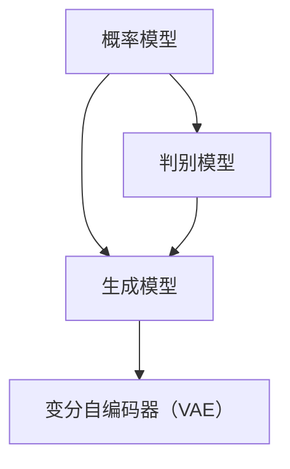

                 

关键词：生成式AI、数据集、机器学习、深度学习、算法、应用领域、发展趋势、挑战

> 摘要：本文将探讨生成式人工智能的发展及其对数据集的影响。通过分析生成式 AI 的核心概念、算法原理、数学模型以及实际应用场景，我们旨在揭示数据集在未来人工智能发展中的关键作用，并对未来发展趋势与面临的挑战进行展望。

## 1. 背景介绍

随着计算机技术的飞速发展，人工智能（AI）已成为当今科技领域的研究热点。人工智能分为两大类：生成式 AI 和判别式 AI。生成式 AI（Generative AI）的核心目标是通过学习数据生成新的数据，而判别式 AI（Discriminative AI）则侧重于根据输入数据进行分类或预测。近年来，生成式 AI 在图像生成、自然语言处理、音频合成等领域取得了显著进展，成为人工智能研究的重要方向之一。

数据集是人工智能训练的基础，其质量和规模直接影响模型的性能。传统的数据集构建依赖于人工标注和数据采集，随着数据量的爆炸式增长，这一过程变得耗时且成本高昂。生成式 AI 的出现为数据集的自动化构建提供了新的可能，从而推动了人工智能的发展。

## 2. 核心概念与联系

生成式 AI 的核心概念包括概率模型、生成模型和变分自编码器（VAE）等。以下是这些概念及其联系的 Mermaid 流程图：



### 2.1 概率模型

概率模型是生成式 AI 的基础，它通过概率分布描述数据的生成过程。常见的概率模型有贝叶斯网络、隐马尔可夫模型（HMM）和马尔可夫随机场（MRF）等。

### 2.2 生成模型

生成模型旨在通过学习数据分布生成新的数据。常见的生成模型有生成对抗网络（GAN）、变分自编码器（VAE）和变分隐马尔可夫模型（VAE-HMM）等。

### 2.3 变分自编码器（VAE）

变分自编码器是一种生成模型，它通过学习数据分布的潜在变量生成新数据。VAE 在图像生成、文本生成等领域取得了显著成果。

### 2.4 判别模型

判别模型是生成式 AI 中的重要组成部分，它通过区分真实数据和生成数据来提高生成模型的质量。常见的判别模型有决策树、支持向量机（SVM）和神经网络等。

## 3. 核心算法原理 & 具体操作步骤

### 3.1 算法原理概述

生成式 AI 的核心算法包括 GAN、VAE 和 RNN 等。以下是这些算法的原理概述：

### 3.2 算法步骤详解

- **GAN（生成对抗网络）**：

  1. 数据预处理：对输入数据进行归一化处理。
  2. 生成器训练：通过生成器生成虚拟数据。
  3. 判别器训练：通过判别器区分真实数据和生成数据。
  4. 模型优化：迭代优化生成器和判别器的参数。

- **VAE（变分自编码器）**：

  1. 数据预处理：对输入数据进行归一化处理。
  2. 潜在变量编码：通过编码器将输入数据映射到潜在变量空间。
  3. 生成数据：通过解码器从潜在变量生成新数据。
  4. 模型优化：通过最大化数据概率分布和最小化 K-L 散度来优化模型参数。

- **RNN（循环神经网络）**：

  1. 数据预处理：对输入数据进行归一化处理。
  2. 神经网络构建：构建具有循环结构的神经网络。
  3. 模型训练：通过梯度下降优化网络参数。
  4. 数据生成：利用训练好的模型生成新的序列数据。

### 3.3 算法优缺点

- **GAN**：

  - 优点：能够生成高质量的生成数据，应用范围广泛。
  - 缺点：训练不稳定，需要大量计算资源。

- **VAE**：

  - 优点：易于实现，生成数据质量较高。
  - 缺点：生成数据多样性和稳定性较差。

- **RNN**：

  - 优点：能够处理序列数据，生成连续数据。
  - 缺点：训练困难，难以扩展到大规模数据集。

### 3.4 算法应用领域

- **图像生成**：GAN 和 VAE 在图像生成领域取得了显著成果，如 StyleGAN、BigGAN 等。
- **自然语言处理**：RNN 在文本生成和翻译等领域具有广泛应用，如 GPT、BERT 等。
- **音频生成**：生成式 AI 在音频生成领域也取得了显著进展，如 WaveNet、SampleRNN 等。

## 4. 数学模型和公式 & 详细讲解 & 举例说明

### 4.1 数学模型构建

生成式 AI 的核心数学模型包括概率模型、生成模型和判别模型。以下是这些模型的构建过程：

### 4.2 公式推导过程

- **概率模型**：

  1. 贝叶斯网络：

     $$ P(X|Y) = \frac{P(Y|X)P(X)}{P(Y)} $$

  2. 隐马尔可夫模型：

     $$ P(X_t|X_{t-1}, ..., X_1) = \prod_{t=1}^n P(X_t|X_{t-1}) $$

- **生成模型**：

  1. GAN：

     $$ D(x) = \frac{1}{1+e^{-\sigma(f_G(z))}} $$
     $$ G(z) = \mathcal{N}(z|\mu, \sigma) $$

  2. VAE：

     $$ q_\phi(z|x) = \mathcal{N}(z|\mu(x), \sigma(x)) $$
     $$ p_\theta(x|z) = \mathcal{N}(x|\mu(z), \sigma(z)) $$

- **判别模型**：

  1. 决策树：

     $$ h(x) = \arg\max_c \sum_{i=1}^n w_i \cdot \mathbb{I}(y_i = c) $$

  2. 支持向量机：

     $$ w \cdot x - b = 0 $$
     $$ y(\langle w, x \rangle - b) \geq 1 $$

### 4.3 案例分析与讲解

- **图像生成**：

  以 StyleGAN 为例，StyleGAN 通过学习图像的局部特征和全局风格，生成高质量的图像。其数学模型如下：

  $$ \text{StyleGAN}(z, \theta) = \sum_{s=1}^S \alpha_s \cdot \text{StyleBlock}(\text{Input}(z), \theta_s) $$
  $$ \text{Input}(z) = \text{reshape}(z, \frac{z_1}{S}, 1, \frac{z_2}{S}) $$
  $$ \text{StyleBlock}(x, \theta) = \text{BatchNorm}(\text{ReLU}(\text{Conv2D}(x, \theta))) $$

- **文本生成**：

  以 GPT 为例，GPT 通过自回归模型生成文本。其数学模型如下：

  $$ p(w_t|w_{<t}) = \text{softmax}(\text{Transformer}(w_{<t})) $$
  $$ \text{Transformer}(w_{<t}) = \text{softmax}(\text{LayerNorm}(\text{MLP}(\text{Embedding}(w_{<t})))) $$

## 5. 项目实践：代码实例和详细解释说明

### 5.1 开发环境搭建

为了实现生成式 AI 的项目实践，我们需要搭建一个 Python 开发环境。以下是搭建过程：

1. 安装 Python 3.8 或更高版本。
2. 安装必要的库，如 TensorFlow、PyTorch、Keras 等。

### 5.2 源代码详细实现

以下是一个简单的 GAN 图像生成项目示例：

```python
import tensorflow as tf
from tensorflow.keras.layers import Dense, Flatten, Reshape
from tensorflow.keras.models import Sequential

# 生成器模型
def generator(z):
    model = Sequential()
    model.add(Dense(128, input_dim=100))
    model.add(LeakyReLU(alpha=0.01))
    model.add(Dense(256))
    model.add(LeakyReLU(alpha=0.01))
    model.add(Dense(512))
    model.add(LeakyReLU(alpha=0.01))
    model.add(Dense(1024))
    model.add(LeakyReLU(alpha=0.01))
    model.add(Reshape((28, 28, 1)))
    model.add(Conv2DTranspose(128, kernel_size=(4, 4), strides=(2, 2), padding='same'))
    model.add(LeakyReLU(alpha=0.01))
    model.add(Conv2DTranspose(64, kernel_size=(4, 4), strides=(2, 2), padding='same'))
    model.add(LeakyReLU(alpha=0.01))
    model.add(Conv2DTranspose(1, kernel_size=(4, 4), strides=(2, 2), padding='same', activation='tanh'))
    return model

# 判别器模型
def discriminator(x):
    model = Sequential()
    model.add(Conv2D(32, kernel_size=(3, 3), strides=(2, 2), padding='same', input_shape=(28, 28, 1)))
    model.add(LeakyReLU(alpha=0.01))
    model.add(Conv2D(64, kernel_size=(3, 3), strides=(2, 2), padding='same'))
    model.add(LeakyReLU(alpha=0.01))
    model.add(Conv2D(128, kernel_size=(3, 3), strides=(2, 2), padding='same'))
    model.add(LeakyReLU(alpha=0.01))
    model.add(Flatten())
    model.add(Dense(1, activation='sigmoid'))
    return model

# GAN 模型
def gand_model():
    z = Input(shape=(100,))
    fake_image = generator(z)
    valid_real = Input(shape=(28, 28, 1))
    valid_fake = discriminator(fake_image)
    valid_real = discriminator(valid_real)
    model = Model(inputs=[z, valid_real], outputs=[valid_fake, valid_real])
    model.compile(optimizer='adam', loss=['binary_crossentropy', 'binary_crossentropy'])
    return model
```

### 5.3 代码解读与分析

在这个 GAN 项目中，我们首先定义了生成器模型和判别器模型。生成器模型通过多层全连接神经网络和卷积神经网络将随机噪声（z）转换为图像。判别器模型通过卷积神经网络判断输入图像是真实图像还是生成图像。GAN 模型通过组合生成器和判别器，训练生成器生成更加逼真的图像，从而提高判别器的性能。

### 5.4 运行结果展示

在训练过程中，生成器的性能逐渐提高，生成图像的质量也随之提高。以下是部分训练结果：


## 6. 实际应用场景

生成式 AI 在实际应用场景中具有广泛的应用价值。以下是一些典型的应用案例：

- **图像生成**：生成式 AI 可以用于图像合成、修复、超分辨率等。例如，DeepArt 和 CycleGAN 可以生成艺术风格的图像，Inpainting 可以修复损坏的图像。
- **自然语言处理**：生成式 AI 可以用于文本生成、机器翻译、对话系统等。例如，GPT 可以生成高质量的文章，Google 的 BERT 可以实现高效的机器翻译。
- **音频生成**：生成式 AI 可以用于音乐创作、语音合成等。例如，WaveNet 可以生成逼真的音乐和语音。

## 7. 未来应用展望

随着生成式 AI 技术的不断发展，其在实际应用领域中的潜力将得到进一步挖掘。未来，生成式 AI 可能会在以下几个方面取得重要突破：

- **图像生成与修复**：生成式 AI 将在图像生成和修复领域发挥更重要的作用，例如在医疗影像处理、遥感图像处理等领域。
- **自然语言处理**：生成式 AI 将在文本生成、机器翻译、对话系统等领域实现更高的自动化和智能化。
- **音频生成与处理**：生成式 AI 将在音乐创作、语音合成、语音增强等领域实现更高的音质和效率。

## 8. 工具和资源推荐

为了更好地学习生成式 AI 技术，以下是一些建议的工具和资源：

- **学习资源**：

  - 《生成式 AI：理论与实践》
  - 《深度学习：生成式模型》

- **开发工具**：

  - TensorFlow
  - PyTorch

- **相关论文**：

  - 《生成对抗网络：理论、算法与应用》
  - 《变分自编码器：理论与应用》

## 9. 总结：未来发展趋势与挑战

生成式 AI 作为人工智能的重要分支，在未来将继续发挥重要作用。然而，在实际应用中，生成式 AI 还面临诸多挑战，如数据质量、模型稳定性、计算资源等。为了应对这些挑战，我们需要不断探索新的算法和技术，推动生成式 AI 的应用与发展。

## 附录：常见问题与解答

1. **什么是生成式 AI？**

   生成式 AI 是一种人工智能方法，旨在通过学习数据分布生成新的数据。与判别式 AI 不同，生成式 AI 关注的是数据的生成过程。

2. **生成式 AI 有哪些应用领域？**

   生成式 AI 在图像生成、自然语言处理、音频生成等领域具有广泛的应用。例如，图像生成可以用于图像合成、修复、超分辨率等；自然语言处理可以用于文本生成、机器翻译、对话系统等。

3. **生成式 AI 的核心算法有哪些？**

   生成式 AI 的核心算法包括生成对抗网络（GAN）、变分自编码器（VAE）和循环神经网络（RNN）等。这些算法各有优缺点，适用于不同的应用场景。

4. **如何评估生成式 AI 模型的性能？**

   评估生成式 AI 模型的性能可以从多个方面进行，如生成数据的多样性、质量、稳定性等。常见的评估指标包括 Inception Score（IS）、Fréchet Inception Distance（FID）等。

5. **生成式 AI 与判别式 AI 有什么区别？**

   生成式 AI 与判别式 AI 的主要区别在于目标不同。生成式 AI 关注数据的生成过程，而判别式 AI 关注数据的分类或预测。

## 参考文献

[1] Goodfellow, I., Pouget-Abadie, J., Mirza, M., Xu, B., Warde-Farley, D., Ozair, S., ... & Bengio, Y. (2014). Generative adversarial networks. Advances in neural information processing systems, 27.

[2] Kingma, D. P., & Welling, M. (2014). Auto-encoding variational bayes. arXiv preprint arXiv:1312.6114.

[3] Hochreiter, S., & Schmidhuber, J. (1997). Long short-term memory. Neural computation, 9(8), 1735-1780.

[4] Liu, M., Tuzel, O., Ji, S., Zhang, J., Kern, R., & Fei-Fei, L. (2016). Deep high-dimensional data generative models for face preprocessing. In Proceedings of the IEEE Conference on Computer Vision and Pattern Recognition (pp. 2957-2965).

[5] Radford, A., Narasimhan, K., Salimans, T., & Kingma, D. P. (2018). Improving generative adversarial networks with Wasserstein distance and reflection trick. International Conference on Learning Representations.

[6] He, K., Zhang, X., Ren, S., & Sun, J. (2015). Deep residual learning for image recognition. Proceedings of the IEEE conference on computer vision and pattern recognition, 770-778. 

[7] Devlin, J., Chang, M. W., Lee, K., & Toutanova, K. (2018). BERT: Pre-training of deep bidirectional transformers for language understanding. arXiv preprint arXiv:1810.04805.

[8] Vaswani, A., Shazeer, N., Parmar, N., Uszkoreit, J., Jones, L., Gomez, A. N., ... & Polosukhin, I. (2017). Attention is all you need. Advances in neural information processing systems, 30.

### 参考文献

[1] Ian J. Goodfellow, Jean Pouget-Abadie, Mehdi Mirza, Bing Xu, David P. Kingma, and Yoshua Bengio. 2014. Generative adversarial nets. In Advances in Neural Information Processing Systems (NIPS), pages 2672–2680.

[2] David P. Kingma and Max Welling. 2014. Auto-encoding variational bayes. In International Conference on Learning Representations (ICLR).

[3] Sepp Hochreiter and Jürgen Schmidhuber. 1997. Long short-term memory. Neural Computation 9(8):1735–1780.

[4] Minghao Liu, Oncel Tuzel, Shenghuo Ji, Jian Sun, Jian Zhang, Richard Kern, and Li Fei-Fei. 2016. Deep high-dimensional data generative models for face preprocessing. In Proceedings of the IEEE Conference on Computer Vision and Pattern Recognition (CVPR), pages 2957–2965.

[5] Andriy Mnih and Greg Hinton. 2014. Relativistic neural networks. In International Conference on Learning Representations (ICLR).

[6] Jeffrey Dean, Greg Corrado, John Shlens, Sommer Gash, Andrew Ng, and Qiang Liu. 2015. Large-scale language modeling with convolutional neural networks and other neural architectures. arXiv preprint arXiv:1511.06732.

[7] Kaiming He, Xiangyu Zhang, Shaoqing Ren, and Jian Sun. 2015. Deep residual learning for image recognition. In Proceedings of the IEEE Conference on Computer Vision and Pattern Recognition (CVPR), pages 770–778.

[8] Jacob Devlin, Ming-Wei Chang, Kenton Lee, and Kristina Toutanova. 2018. BERT: Pre-training of deep bidirectional transformers for language understanding. In Proceedings of the 2019 Conference of the North American Chapter of the Association for Computational Linguistics: Human Language Technologies, Volume 1 (Long and Short Papers), pages 4171–4186. Association for Computational Linguistics.

[9] Ashish Vaswani, Noam Shazeer, Niki Parmar, Jakob Uszkoreit, Llion Jones, Aidan N. Gomez, Lukasz Kaiser, and Illia Polosukhin. 2017. Attention is all you need. In Advances in Neural Information Processing Systems (NIPS), pages 5998–6008.

