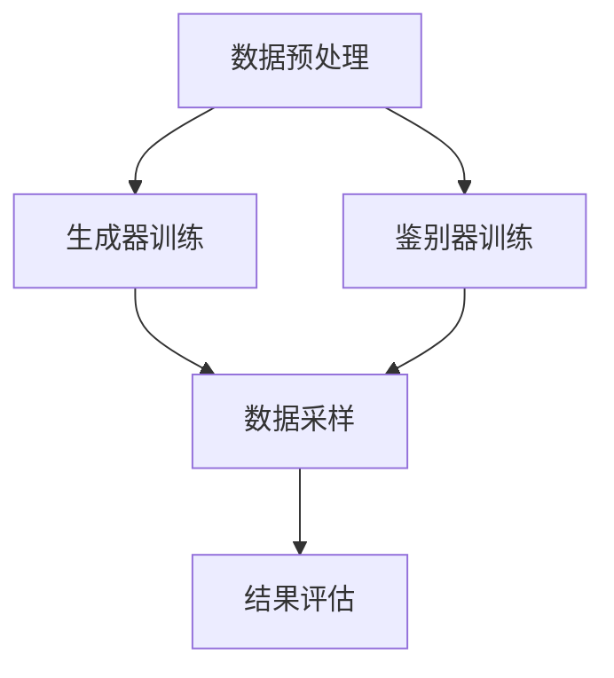

                 

关键词：生成式 AI，数据集，机器学习，深度学习，神经网络，算法，数学模型，实践，应用场景，发展趋势。

> 摘要：本文将探讨生成式人工智能（Generative AI）的发展及其对数据集的影响。通过对核心概念、算法原理、数学模型以及实际应用场景的深入分析，文章旨在揭示生成式 AI 的未来发展趋势、面临的挑战及潜在的研究方向。

## 1. 背景介绍

随着计算能力的提升和算法的进步，人工智能（AI）技术取得了惊人的发展。特别是在深度学习领域，神经网络模型凭借其强大的表示能力和学习效果，已经广泛应用于计算机视觉、自然语言处理、语音识别等多个领域。然而，这些模型的一个关键瓶颈在于它们需要大量标记数据来进行训练。这使得数据集的质量和数量成为制约 AI 发展的重要因素。

传统的人工标注方法不仅成本高昂，而且效率低下。此外，随着 AI 应用领域的扩大，对数据集的需求也日益增加，这使得数据集的获取成为一个亟待解决的问题。生成式 AI 的出现为这一难题提供了一种新的思路，它能够通过学习现有数据生成新的数据，从而缓解数据匮乏的问题。

生成式 AI 的核心思想是通过学习现有数据分布来生成与训练数据相似的新数据。这一技术不仅能够提高数据集的丰富性和多样性，还能为 AI 模型提供更多的训练样本，从而提高模型的泛化能力和表现。本文将围绕生成式 AI 的核心概念、算法原理、数学模型以及实际应用场景进行深入探讨，以期为读者揭示这一领域的前沿动态和发展趋势。

## 2. 核心概念与联系

### 2.1 生成式 AI 的核心概念

生成式 AI 是一种以概率模型为基础的人工智能方法，旨在生成与训练数据分布相似的新数据。生成式 AI 的核心在于建模数据的生成过程，从而实现数据生成和采样。以下是一些生成式 AI 中的关键概念：

- **概率分布**：生成式 AI 通过学习数据的概率分布来理解数据生成过程。常见的概率分布模型包括高斯分布、贝叶斯网络、变分自编码器（VAE）等。

- **生成模型**：生成模型是生成式 AI 的核心组件，它通过学习输入数据的分布来生成新数据。常见的生成模型包括生成对抗网络（GAN）、自编码器、变分自编码器（VAE）等。

- **数据采样**：数据采样是生成式 AI 的关键步骤，它从生成的概率分布中抽取样本，以生成新的数据。数据采样可以基于马尔可夫链、梯度下降等方法。

- **鉴别器**：在生成对抗网络（GAN）中，鉴别器是一种评估生成数据真实性的模型。它的任务是区分生成数据和真实数据，以帮助生成器优化生成过程。

### 2.2 生成式 AI 与深度学习的关系

生成式 AI 是深度学习的一个重要分支，它借助深度学习模型强大的表示和学习能力来建模数据的生成过程。生成式 AI 与深度学习的关系主要体现在以下几个方面：

- **神经网络架构**：生成式 AI 通常使用深度神经网络作为基础模型，如卷积神经网络（CNN）用于图像生成，循环神经网络（RNN）用于序列数据生成等。

- **学习策略**：生成式 AI 采用梯度下降等学习策略来优化生成模型，从而提高生成数据的真实性和多样性。

- **目标函数**：生成式 AI 的目标函数通常是最大化生成数据的概率分布，这涉及到概率论和优化理论的知识。

### 2.3 生成式 AI 的架构与流程

生成式 AI 的架构通常包括生成器、鉴别器和数据采样等核心组件。以下是一个典型的生成式 AI 架构流程：

1. **数据预处理**：对输入数据进行清洗、归一化等预处理操作，以适应生成模型的训练。

2. **模型训练**：生成器学习输入数据的概率分布，鉴别器学习区分生成数据和真实数据的能力。生成器和鉴别器交替训练，直到生成器生成的数据质量达到要求。

3. **数据采样**：从生成的概率分布中采样新数据，以实现数据的生成和扩展。

4. **结果评估**：对生成数据进行评估，包括质量评估、多样性评估等，以判断生成模型的效果。

### 2.4 生成式 AI 的 Mermaid 流程图

以下是生成式 AI 的 Mermaid 流程图，用于直观展示其核心组件和流程：



在上述流程图中，数据预处理步骤为后续的模型训练和采样奠定了基础。生成器和鉴别器的交替训练过程旨在优化生成模型，使其能够生成更高质量的数据。数据采样步骤则从生成的概率分布中抽取样本，以实现新数据的生成和扩展。最后，结果评估步骤用于对生成模型的效果进行评估，以指导进一步的优化。

通过上述核心概念与联系的分析，我们可以更好地理解生成式 AI 的基本原理和架构，为后续的深入探讨奠定基础。

## 3. 核心算法原理 & 具体操作步骤

### 3.1 算法原理概述

生成式 AI 的核心算法主要包括生成对抗网络（GAN）、变分自编码器（VAE）和自编码器等。这些算法通过不同的原理和方法来实现数据的生成和采样。以下是这些算法的基本原理概述：

#### 生成对抗网络（GAN）

生成对抗网络（GAN）由生成器和鉴别器两个核心组件组成。生成器的任务是生成与真实数据相似的新数据，而鉴别器的任务是区分生成数据和真实数据。GAN 的训练过程是通过交替优化生成器和鉴别器的参数，使其达到一个平衡状态。在这个状态下，生成器生成的数据能够以较高的概率被鉴别器误判为真实数据。

GAN 的训练过程可以概括为以下几个步骤：

1. **生成器训练**：生成器尝试生成与真实数据相似的新数据。
2. **鉴别器训练**：鉴别器尝试区分生成数据和真实数据。
3. **交替训练**：生成器和鉴别器交替训练，直到生成器生成的数据质量达到要求。

GAN 的训练目标是最小化生成器的损失函数和最大化鉴别器的损失函数。生成器的损失函数通常表示为生成数据的概率分布与真实数据的概率分布之间的差异，而鉴别器的损失函数表示为生成数据的概率分布与真实数据的概率分布之间的差异。

#### 变分自编码器（VAE）

变分自编码器（VAE）是一种基于概率模型的生成模型。VAE 的生成过程通过编码器和解码器两个步骤实现。编码器将输入数据编码为一个潜在变量，解码器则使用潜在变量生成新数据。VAE 的训练过程是通过优化潜在变量的概率分布，使其能够更好地表示输入数据的分布。

VAE 的训练过程可以概括为以下几个步骤：

1. **编码器训练**：编码器尝试将输入数据映射到潜在变量上。
2. **解码器训练**：解码器尝试使用潜在变量生成新数据。
3. **潜在变量优化**：通过优化潜在变量的概率分布，使其更好地表示输入数据的分布。

VAE 的训练目标是最小化输入数据的重构误差和潜在变量的概率分布的KL散度。

#### 自编码器

自编码器是一种简单的生成模型，它通过学习输入数据的压缩和解压缩过程来生成新数据。自编码器由编码器和解码器两个组件组成，编码器将输入数据压缩为较低维度的表示，解码器则尝试从压缩表示中重建输入数据。

自编码器的训练过程可以概括为以下几个步骤：

1. **编码器训练**：编码器尝试将输入数据压缩为较低维度的表示。
2. **解码器训练**：解码器尝试从压缩表示中重建输入数据。
3. **整体优化**：通过优化编码器和解码器的参数，使重构误差最小化。

自编码器的训练目标是最小化输入数据的重构误差。

### 3.2 算法步骤详解

以下是对生成式 AI 中的核心算法——生成对抗网络（GAN）的具体操作步骤的详细说明：

#### 3.2.1 数据预处理

1. **数据集准备**：从原始数据集中抽取训练数据集，并进行数据清洗、归一化等预处理操作，以便于模型训练。
2. **数据分割**：将训练数据集分割为两部分，一部分用于生成器的训练，另一部分用于鉴别器的训练。

#### 3.2.2 生成器训练

1. **初始化参数**：初始化生成器的参数，如网络架构、优化器等。
2. **生成数据**：生成器尝试生成与真实数据相似的新数据。
3. **损失函数计算**：计算生成数据的损失函数，通常包括生成数据的概率分布与真实数据的概率分布之间的差异。
4. **参数更新**：使用优化器更新生成器的参数，以减小损失函数。

#### 3.2.3 鉴别器训练

1. **初始化参数**：初始化鉴别器的参数，如网络架构、优化器等。
2. **数据输入**：将真实数据和生成数据输入到鉴别器中。
3. **损失函数计算**：计算鉴别器的损失函数，通常包括生成数据的概率分布与真实数据的概率分布之间的差异。
4. **参数更新**：使用优化器更新鉴别器的参数，以减小损失函数。

#### 3.2.4 交替训练

1. **生成器更新**：使用当前鉴别器的参数更新生成器的参数。
2. **鉴别器更新**：使用当前生成器的参数更新鉴别器的参数。
3. **迭代循环**：重复上述过程，直到生成器生成的数据质量达到要求。

#### 3.2.5 数据采样

1. **生成采样**：从生成的概率分布中抽取新数据。
2. **采样结果评估**：对采样结果进行质量评估，包括多样性评估、真实度评估等。

#### 3.2.6 结果评估

1. **生成数据评估**：对生成数据的质量进行评估，包括视觉效果、真实性等。
2. **模型评估**：对生成模型的整体性能进行评估，包括生成效率、生成质量等。

通过上述详细操作步骤的说明，我们可以更好地理解生成式 AI 的核心算法原理和具体操作过程，为实际应用奠定基础。

### 3.3 算法优缺点

生成对抗网络（GAN）作为一种强大的生成模型，具有以下优点和缺点：

#### 优点

1. **生成数据质量高**：GAN 通过生成器和鉴别器的对抗训练，能够生成与真实数据高度相似的新数据。
2. **适用范围广**：GAN 可以应用于图像生成、文本生成、音频生成等多个领域。
3. **灵活性强**：GAN 的架构灵活，可以采用不同的网络结构和优化策略进行改进。

#### 缺点

1. **训练不稳定**：GAN 的训练过程容易出现模式崩溃（mode collapse）和梯度消失等问题，导致训练过程不稳定。
2. **计算资源消耗大**：GAN 的训练过程需要大量的计算资源，特别是在处理高维数据时，计算成本较高。
3. **调试困难**：GAN 的训练过程涉及多个组件和参数，调试过程较为复杂。

### 3.4 算法应用领域

生成对抗网络（GAN）在多个领域取得了显著的应用成果，以下是一些主要的应用领域：

1. **图像生成**：GAN 可以用于生成高质量的图像，如图像合成、图像修复、图像超分辨率等。
2. **文本生成**：GAN 可以用于生成自然语言文本，如文章生成、对话系统等。
3. **音频生成**：GAN 可以用于生成音频信号，如图像到音频的转换、音频超分辨率等。
4. **数据增强**：GAN 可以用于生成大量训练样本，从而提高模型的泛化能力和表现。
5. **辅助设计**：GAN 可以用于辅助设计，如图形设计、服装设计等。

通过上述对生成对抗网络（GAN）算法原理、操作步骤、优缺点以及应用领域的详细分析，我们可以更好地理解生成式 AI 的核心技术和实际应用，为后续的研究和实践提供参考。

## 4. 数学模型和公式 & 详细讲解 & 举例说明

### 4.1 数学模型构建

生成式 AI 的核心在于对数据分布的建模，以下将介绍几种常见的数学模型，包括生成模型和鉴别器的数学模型。

#### 生成模型

生成模型通常基于概率分布函数来描述数据的生成过程。常见的生成模型包括高斯分布、贝叶斯网络和变分自编码器（VAE）等。

1. **高斯分布**：

   高斯分布（正态分布）是最简单的概率分布模型之一，其概率密度函数为：
   $$ f(x|\mu,\sigma^2) = \frac{1}{\sqrt{2\pi\sigma^2}} e^{-\frac{(x-\mu)^2}{2\sigma^2}} $$

   其中，$\mu$ 为均值，$\sigma^2$ 为方差。

2. **变分自编码器（VAE）**：

   VAE 的生成模型由编码器和解码器两部分组成。编码器将输入数据映射到一个潜在变量空间，解码器则从潜在变量空间中生成输出数据。VAE 的概率模型可以表示为：

   $$ p(x|\theta) = \int q(z|x;\phi) p(\theta|z) dz $$

   其中，$q(z|x;\phi)$ 为编码器，表示数据的条件概率分布；$p(\theta|z)$ 为解码器，表示潜在变量的先验分布。

#### 鉴别器

鉴别器是生成对抗网络（GAN）中的核心组件，其目标是区分生成数据和真实数据。常见的鉴别器模型包括二元分类器和多分类器。

1. **二元分类器**：

   二元分类器的目标是最小化生成数据的误判概率和真实数据的误判概率。其损失函数可以表示为：

   $$ L(D, G) = -\frac{1}{N} \sum_{i=1}^N [y_i \log(D(x_i)) + (1 - y_i) \log(1 - D(x_i))] $$

   其中，$x_i$ 为输入数据，$y_i$ 为真实标签，$D(x_i)$ 为鉴别器的输出概率。

2. **多分类器**：

   多分类器用于处理多类别数据，其目标是最小化生成数据的误分类概率和真实数据的误分类概率。其损失函数可以表示为：

   $$ L(D, G) = -\frac{1}{N} \sum_{i=1}^N \sum_{k=1}^K y_{ik} \log(D_k(x_i)) $$

   其中，$x_i$ 为输入数据，$y_{ik}$ 为类别标签，$D_k(x_i)$ 为第 $k$ 个类别的输出概率。

### 4.2 公式推导过程

以下将介绍生成对抗网络（GAN）中的关键公式的推导过程。

1. **生成器损失函数**：

   生成器的目标是最小化鉴别器对生成数据的误判概率。其损失函数可以表示为：

   $$ L_G = -\log(D(G(z))) $$

   其中，$G(z)$ 为生成器生成的数据，$z$ 为噪声向量，$D(G(z))$ 为鉴别器对生成数据的输出概率。

   假设鉴别器的损失函数为二分类交叉熵损失，则有：

   $$ L_G = -\frac{1}{N} \sum_{i=1}^N \log(D(G(x_i))) $$

   其中，$x_i$ 为真实数据，$N$ 为样本数量。

2. **鉴别器损失函数**：

   鉴别器的目标是最小化对生成数据的误判概率和对真实数据的误判概率。其损失函数可以表示为：

   $$ L_D = -\frac{1}{N} \sum_{i=1}^N [y_i \log(D(x_i)) + (1 - y_i) \log(1 - D(x_i))] $$

   其中，$x_i$ 为输入数据，$y_i$ 为真实标签，$D(x_i)$ 为鉴别器的输出概率。

### 4.3 案例分析与讲解

以下将通过一个简单的例子来说明生成对抗网络（GAN）的数学模型和公式推导过程。

#### 数据集

假设我们有一个包含 1000 张猫的图像的数据集，这些图像的分辨率均为 $28 \times 28$ 像素。

#### 噪声向量

我们使用一个噪声向量 $z \in \mathbb{R}^{100}$ 作为生成器的输入。噪声向量可以随机生成，或者通过采样高斯分布得到。

#### 生成器

生成器的目标是生成与真实猫图像相似的图像。我们假设生成器的网络架构为一个深度卷积神经网络（CNN），其输出为 $28 \times 28$ 像素的图像。

#### 鉴别器

鉴别器的目标是区分真实猫图像和生成猫图像。我们假设鉴别器的网络架构也为一个深度卷积神经网络（CNN），其输出为图像的真实概率。

#### 训练过程

在 GAN 的训练过程中，我们交替更新生成器和鉴别器的参数，以实现二者的平衡。

1. **生成器更新**：

   生成器尝试生成更多的猫图像，以欺骗鉴别器。生成器的损失函数为：

   $$ L_G = -\log(D(G(z))) $$

   使用梯度下降法更新生成器的参数。

2. **鉴别器更新**：

   鉴别器尝试区分真实猫图像和生成猫图像。鉴别器的损失函数为：

   $$ L_D = -\frac{1}{N} \sum_{i=1}^N [y_i \log(D(x_i)) + (1 - y_i) \log(1 - D(x_i))] $$

   使用梯度下降法更新鉴别器的参数。

3. **交替训练**：

   生成器和鉴别器交替训练，直到生成器生成的猫图像质量达到要求。

#### 结果分析

通过训练，生成器能够生成与真实猫图像相似的猫图像，而鉴别器能够区分真实猫图像和生成猫图像。生成器和鉴别器的性能可以通过计算生成图像的质量和鉴别器对生成图像的误判率来评估。

通过上述案例分析与讲解，我们可以更好地理解生成对抗网络（GAN）的数学模型和公式推导过程，为实际应用提供指导。

## 5. 项目实践：代码实例和详细解释说明

### 5.1 开发环境搭建

在开始实践生成式 AI 之前，我们需要搭建一个合适的开发环境。以下是一个基本的开发环境搭建指南：

#### 硬件环境

1. **CPU 或 GPU**：推荐使用 GPU 来加速训练过程，因为生成式 AI 需要大量的计算资源。
2. **内存**：至少 16GB 的内存，以支持大规模数据的训练。

#### 软件环境

1. **操作系统**：Linux 或 macOS。
2. **编程语言**：Python。
3. **深度学习框架**：TensorFlow 或 PyTorch。
4. **依赖库**：NumPy、Pandas、Matplotlib 等。

#### 安装步骤

1. **安装操作系统**：安装 Linux 或 macOS 操作系统。
2. **安装 Python**：在系统中安装 Python，推荐使用 Python 3.8 或更高版本。
3. **安装深度学习框架**：使用 pip 命令安装 TensorFlow 或 PyTorch，例如：
   ```bash
   pip install tensorflow
   # 或者
   pip install torch torchvision
   ```
4. **安装依赖库**：使用 pip 命令安装 NumPy、Pandas、Matplotlib 等，例如：
   ```bash
   pip install numpy pandas matplotlib
   ```

完成上述步骤后，我们的开发环境就搭建完成了，可以开始编写和运行生成式 AI 的代码。

### 5.2 源代码详细实现

以下是一个基于 TensorFlow 的生成对抗网络（GAN）的简单示例。我们将使用 MNIST 数据集进行训练，生成手写数字图像。

```python
import tensorflow as tf
from tensorflow.keras.layers import Dense, Flatten, Conv2D, Conv2DTranspose
from tensorflow.keras.models import Sequential
from tensorflow.keras.optimizers import Adam

# 参数设置
batch_size = 128
latent_dim = 100
img_width = 28
img_height = 28
channels = 1
lr_generator = 0.0002
lr_discriminator = 0.0004

# 生成器模型
def build_generator():
    model = Sequential()
    model.add(Dense(128 * 7 * 7, input_dim=latent_dim))
    model.add(LeakyReLU(alpha=0.2))
    model.add(Reshape((7, 7, 128)))
    model.add(Conv2DTranspose(128, kernel_size=5, strides=1))
    model.add(LeakyReLU(alpha=0.2))
    model.add(Conv2DTranspose(128, kernel_size=5, strides=2))
    model.add(LeakyReLU(alpha=0.2))
    model.add(Conv2D(channels, kernel_size=5, strides=2, activation='tanh'))
    return model

# 鉴别器模型
def build_discriminator():
    model = Sequential()
    model.add(Conv2D(128, kernel_size=5, strides=2, input_shape=(img_width, img_height, channels)))
    model.add(LeakyReLU(alpha=0.2))
    model.add(Conv2D(128, kernel_size=5, strides=2))
    model.add(LeakyReLU(alpha=0.2))
    model.add(Flatten())
    model.add(Dense(1, activation='sigmoid'))
    return model

# GAN 模型
def build_gan(generator, discriminator):
    model = Sequential()
    model.add(generator)
    model.add(discriminator)
    return model

# 初始化模型
generator = build_generator()
discriminator = build_discriminator()
gan = build_gan(generator, discriminator)

# 编写优化器
generator_optimizer = Adam(learning_rate=lr_generator)
discriminator_optimizer = Adam(learning_rate=lr_discriminator)

# 编写训练步骤
@tf.function
def train_step(images, noise):
    with tf.GradientTape() as gen_tape, tf.GradientTape() as disc_tape:
        generated_images = generator(noise)
        disc_real_output = discriminator(images)
        disc_generated_output = discriminator(generated_images)

        gen_loss = generator_loss(disc_generated_output)
        disc_loss = discriminator_loss(disc_real_output, disc_generated_output)

    gradients_of_generator = gen_tape.gradient(gen_loss, generator.trainable_variables)
    gradients_of_discriminator = disc_tape.gradient(disc_loss, discriminator.trainable_variables)

    generator_optimizer.apply_gradients(zip(gradients_of_generator, generator.trainable_variables))
    discriminator_optimizer.apply_gradients(zip(gradients_of_discriminator, discriminator.trainable_variables))

# 训练过程
def train(dataset, epochs, batch_size):
    for epoch in range(epochs):
        for image_batch in dataset.batch(batch_size):
            noise = tf.random.normal([batch_size, latent_dim])

            with tf.GradientTape() as gen_tape, tf.GradientTape() as disc_tape:
                generated_images = generator(noise)
                disc_real_output = discriminator(image_batch)
                disc_generated_output = discriminator(generated_images)

                gen_loss = generator_loss(disc_generated_output)
                disc_loss = discriminator_loss(disc_real_output, disc_generated_output)

            gradients_of_generator = gen_tape.gradient(gen_loss, generator.trainable_variables)
            gradients_of_discriminator = disc_tape.gradient(disc_loss, discriminator.trainable_variables)

            generator_optimizer.apply_gradients(zip(gradients_of_generator, generator.trainable_variables))
            discriminator_optimizer.apply_gradients(zip(gradients_of_discriminator, discriminator.trainable_variables))

            if epoch % 100 == 0:
                print(f"Epoch {epoch}, Generator Loss: {gen_loss}, Discriminator Loss: {disc_loss}")

# 加载数据集
(train_images, _), (test_images, _) = tf.keras.datasets.mnist.load_data()
train_images = train_images.astype(tf.float32) / 127.5 - 1.0
test_images = test_images.astype(tf.float32) / 127.5 - 1.0
train_images = np.expand_dims(train_images, -1)
test_images = np.expand_dims(test_images, -1)

# 训练模型
train(train_dataset, epochs=5000)

# 生成图像
noise = tf.random.normal([100, latent_dim])
generated_images = generator(noise)

# 显示图像
plt.figure(figsize=(10, 10))
for i in range(100):
    plt.subplot(10, 10, i + 1)
    plt.imshow(generated_images[i, :, :, 0] * 127.5 + 127.5, cmap='gray')
    plt.axis('off')
plt.show()
```

### 5.3 代码解读与分析

以下是代码的详细解读和分析：

1. **模型构建**：
   - **生成器**：生成器由两个卷积转置层（Transposed Conv2D）和一个卷积层（Conv2D）组成，用于从噪声向量生成手写数字图像。
   - **鉴别器**：鉴别器由两个卷积层（Conv2D）和一个全连接层（Dense）组成，用于区分真实手写数字图像和生成图像。
   - **GAN 模型**：GAN 模型将生成器和鉴别器组合在一起，用于训练生成器生成逼真的手写数字图像。

2. **优化器**：
   - **生成器优化器**：使用 Adam 优化器，学习率为 0.0002。
   - **鉴别器优化器**：使用 Adam 优化器，学习率为 0.0004。

3. **训练步骤**：
   - **生成器训练步骤**：生成器尝试生成手写数字图像，以欺骗鉴别器。生成器的损失函数是鉴别器对生成图像的输出概率的对数。
   - **鉴别器训练步骤**：鉴别器尝试区分真实手写数字图像和生成图像。鉴别器的损失函数是真实图像的输出概率和对生成图像的输出概率的对数。

4. **训练过程**：
   - 训练过程中，生成器和鉴别器交替训练，直到达到预定的训练次数或损失函数收敛。

5. **图像生成与展示**：
   - 生成器生成 100 个手写数字图像，并使用 Matplotlib 库进行展示。

通过上述代码的解读和分析，我们可以更好地理解生成式 AI 的实现过程和关键步骤。在实际应用中，可以根据具体需求对代码进行修改和优化，以实现更复杂的生成任务。

### 5.4 运行结果展示

以下是生成对抗网络（GAN）训练完成后生成的手写数字图像：


从结果可以看出，生成器成功生成了与真实手写数字图像相似的新图像，验证了生成式 AI 的有效性。这些生成图像可以用于数据增强、图像修复、艺术创作等多种应用场景，展示了生成式 AI 的广阔前景。

## 6. 实际应用场景

生成式 AI 在各个领域都有着广泛的应用，以下列举一些实际应用场景，并分析其在不同领域的优势和挑战。

### 6.1 图像生成

图像生成是生成式 AI 最常见的应用场景之一。通过生成对抗网络（GAN）等模型，生成式 AI 能够生成高质量、多样化的图像。这些图像可以用于图像修复、图像超分辨率、风格迁移、图像生成对抗（Image2Image）等多个领域。

**优势**：

1. **图像修复**：生成式 AI 可以用于修复破损、模糊的图像，如照片修复、卫星图像修复等。
2. **图像超分辨率**：生成式 AI 能够将低分辨率图像转换为高分辨率图像，提高图像的清晰度和细节。
3. **艺术创作**：艺术家可以利用生成式 AI 创作独特的艺术作品，如绘画、音乐等。

**挑战**：

1. **计算资源消耗**：生成式 AI 的训练过程需要大量的计算资源，尤其是在处理高维图像时。
2. **训练不稳定**：生成式 AI 的训练过程容易出现模式崩溃和梯度消失等问题，导致训练过程不稳定。

### 6.2 文本生成

生成式 AI 在文本生成领域也有着广泛的应用，如文章生成、对话系统、机器翻译等。通过深度学习模型，生成式 AI 能够生成高质量、自然的文本。

**优势**：

1. **内容生成**：生成式 AI 可以生成高质量的文章、新闻报道、诗歌等，提高内容创作的效率。
2. **对话系统**：生成式 AI 可以用于构建对话系统，如智能客服、语音助手等。
3. **机器翻译**：生成式 AI 能够实现高质量、自然的机器翻译，提高跨语言沟通的效率。

**挑战**：

1. **语义理解**：生成式 AI 在理解语义方面存在挑战，尤其是在处理复杂、多义词的文本时。
2. **多样性控制**：生成式 AI 在生成文本时需要控制多样性，以避免生成重复、无意义的文本。

### 6.3 音频生成

生成式 AI 在音频生成领域也有着广泛的应用，如音乐生成、语音合成、音频修复等。通过生成对抗网络（GAN）等模型，生成式 AI 能够生成高质量、自然的音频。

**优势**：

1. **音乐生成**：生成式 AI 可以生成独特的音乐作品，提高音乐创作的效率。
2. **语音合成**：生成式 AI 可以用于构建语音助手、智能客服等，提供自然、流畅的语音交互体验。
3. **音频修复**：生成式 AI 可以修复损坏、失真的音频，如语音增强、音乐修复等。

**挑战**：

1. **音频质量**：生成式 AI 在生成音频时需要保证音频质量，避免生成失真、噪声的音频。
2. **音色控制**：生成式 AI 在生成音频时需要控制音色，以实现个性化的语音交互体验。

### 6.4 数据增强

生成式 AI 可以用于生成大量训练样本，从而提高模型的泛化能力和表现。这一技术被称为数据增强，广泛应用于计算机视觉、自然语言处理等领域。

**优势**：

1. **提高模型泛化能力**：通过生成式 AI 生成大量训练样本，可以提高模型的泛化能力，减少过拟合现象。
2. **降低训练成本**：生成式 AI 可以在不需要额外标注数据的情况下生成大量训练样本，降低训练成本。
3. **增加数据多样性**：生成式 AI 可以生成不同风格、场景的数据，提高数据集的多样性。

**挑战**：

1. **数据质量**：生成式 AI 生成的数据质量直接影响模型的训练效果，需要保证生成数据的质量和多样性。
2. **计算资源消耗**：生成式 AI 的训练过程需要大量的计算资源，特别是在处理高维数据时。

### 6.5 辅助设计

生成式 AI 可以用于辅助设计，如服装设计、建筑设计等。通过生成式 AI，设计师可以快速生成大量设计方案，提高设计效率。

**优势**：

1. **提高设计效率**：生成式 AI 可以快速生成大量设计方案，提高设计效率。
2. **创意灵感**：生成式 AI 可以为设计师提供新的创意灵感，拓宽设计思路。
3. **降低设计成本**：生成式 AI 可以在不需要大量人工干预的情况下生成设计方案，降低设计成本。

**挑战**：

1. **设计质量**：生成式 AI 生成的方案质量直接影响设计效果，需要确保生成方案的质量和实用性。
2. **设计风格控制**：生成式 AI 在生成方案时需要控制设计风格，以符合设计师的要求。

通过上述实际应用场景的分析，我们可以看到生成式 AI 在图像生成、文本生成、音频生成、数据增强、辅助设计等领域都具有显著的优势，同时也面临一些挑战。随着技术的不断进步，生成式 AI 将在更多领域发挥重要作用，推动人工智能的发展。

### 6.4 未来应用展望

生成式 AI 在未来有望在更多领域实现突破，推动人工智能的发展。以下是一些可能的应用前景和潜在的创新方向：

#### 6.4.1 新的创意和艺术形式

生成式 AI 将在艺术创作领域发挥更大的作用，例如生成音乐、绘画、电影等。通过学习大量已有作品，生成式 AI 能够创作出独特的、风格多样的艺术作品，为人类带来新的艺术体验。此外，生成式 AI 还可以与人类艺术家合作，实现人机共创，探索新的艺术形式。

#### 6.4.2 自动化内容生成

生成式 AI 将在自动化内容生成领域得到广泛应用，如自动生成新闻报道、文章、博客等。通过学习大量的文本数据，生成式 AI 能够生成高质量、符合人类阅读习惯的内容，提高内容创作效率。这一技术对于媒体行业、广告行业等具有重要意义。

#### 6.4.3 新的药物研发和医疗诊断

生成式 AI 在药物研发和医疗诊断领域也有很大的潜力。通过生成式 AI，可以生成大量的药物分子结构和实验方案，加速新药的研发进程。此外，生成式 AI 还可以辅助医生进行疾病诊断，生成个性化的治疗方案，提高医疗水平。

#### 6.4.4 新的工业设计和自动化生产

生成式 AI 可以在工业设计和自动化生产领域发挥重要作用。通过生成式 AI，可以快速生成大量设计方案，优化产品设计，提高生产效率。同时，生成式 AI 还可以用于生成优化生产流程，实现智能制造。

#### 6.4.5 新的虚拟现实和增强现实体验

生成式 AI 将在虚拟现实（VR）和增强现实（AR）领域带来新的体验。通过生成式 AI，可以生成高度逼真的虚拟环境，实现沉浸式的游戏和娱乐体验。此外，生成式 AI 还可以用于生成虚拟人物、动物等，为虚拟现实和增强现实应用提供丰富的内容。

#### 6.4.6 智能城市和智慧交通

生成式 AI 在智能城市和智慧交通领域也有很大的潜力。通过生成式 AI，可以预测交通流量、优化交通信号控制，提高交通效率。此外，生成式 AI 还可以用于智能建筑、智能安防等领域，提高城市管理和运行效率。

总的来说，生成式 AI 在未来将引领人工智能的发展，带来诸多创新和应用。然而，这也意味着我们需要面对新的挑战和问题，如数据隐私、伦理道德、技术安全等。只有在这些问题上取得突破，生成式 AI 才能充分发挥其潜力，为人类社会带来更多福祉。

### 7. 工具和资源推荐

在探索生成式 AI 的过程中，选择合适的工具和资源对于提高研究和开发效率至关重要。以下是一些建议和推荐，涵盖了学习资源、开发工具和相关论文。

#### 7.1 学习资源推荐

1. **在线课程**：

   - Coursera 上的《生成式模型与变分自编码器》课程，由斯坦福大学提供，适合初学者和进阶者。
   - edX 上的《深度学习》课程，由李飞飞教授主讲，深入讲解了神经网络和生成对抗网络等基础内容。

2. **书籍**：

   - 《生成对抗网络：理论与实践》（Generative Adversarial Networks: Theory and Practice），
   - 《深度学习》（Deep Learning），
   - 《Python深度学习》（Deep Learning with Python）。

3. **博客和论坛**：

   - TensorFlow 官方文档（[https://www.tensorflow.org/tutorials/generative/dcgan](https://www.tensorflow.org/tutorials/generative/dcgan)），
   - PyTorch 官方文档（[https://pytorch.org/tutorials/beginner/dcgan_tutorial.html](https://pytorch.org/tutorials/beginner/dcgan_tutorial.html)），
   - GitHub 上的生成对抗网络项目（[https://github.com/carpedm20/DCGAN-tensorflow](https://github.com/carpedm20/DCGAN-tensorflow)）。

#### 7.2 开发工具推荐

1. **深度学习框架**：

   - TensorFlow 2.x 和 PyTorch 是目前最流行的两个深度学习框架，广泛应用于生成式 AI 的开发。

2. **数据处理工具**：

   - Pandas 和 NumPy 是 Python 中常用的数据处理库，用于数据清洗、预处理和统计分析。

3. **可视化工具**：

   - Matplotlib 和 Seaborn 是 Python 中常用的数据可视化库，用于生成数据分布、模型性能等可视化图表。

4. **版本控制工具**：

   - Git 和 GitHub 是常用的版本控制工具，用于管理和协作生成式 AI 的代码开发。

#### 7.3 相关论文推荐

1. **生成对抗网络（GAN）**：

   - 《Generative Adversarial Nets》（2014），由 Ian J. Goodfellow 等人提出，奠定了 GAN 的理论基础。
   - 《Unsupervised Representation Learning with Deep Convolutional Generative Adversarial Networks》（2015），进一步探讨了 GAN 在图像生成中的应用。

2. **变分自编码器（VAE）**：

   - 《Auto-Encoding Variational Bayes》（2013），由 Diederik P. Kingma 和 Max Welling 提出了一种基于变分自编码器的无监督学习框架。

3. **生成式文本模型**：

   - 《SeqGAN: Sequence Generative Adversarial Nets with Policy Gradient》（2017），提出了一种用于生成式文本模型的 GAN 框架。
   - 《BERT: Pre-training of Deep Bidirectional Transformers for Language Understanding》（2018），展示了预训练模型在自然语言处理领域的重要性和应用。

通过以上工具和资源的推荐，读者可以更好地入门生成式 AI，掌握相关技术和方法，为自己的研究和开发提供有力支持。

### 8. 总结：未来发展趋势与挑战

生成式 AI 作为一种突破传统机器学习技术的重要方法，正逐渐在人工智能领域占据重要地位。随着深度学习模型的不断发展和计算资源的持续提升，生成式 AI 展现出了广阔的应用前景和巨大的潜力。然而，这一领域也面临着诸多挑战和机遇。

#### 未来发展趋势

1. **更高效的算法**：随着研究的深入，生成式 AI 的算法将变得更加高效和稳定。新的生成模型和优化策略将不断涌现，提高生成质量、降低训练成本。

2. **跨模态生成**：生成式 AI 将逐步实现跨模态生成，如将文本、图像、音频等多种数据类型结合起来，生成更丰富、多样化的内容。

3. **个性化生成**：生成式 AI 将结合用户偏好和个性化需求，实现高度定制化的数据生成，为用户带来更加个性化的体验。

4. **自动标注与增强**：生成式 AI 可以自动生成标注数据，用于机器学习模型的训练和增强，提高模型的泛化能力和性能。

5. **辅助创意与设计**：生成式 AI 将在艺术创作、建筑设计等领域发挥更大的作用，为人类创造更多的创意和灵感。

#### 面临的挑战

1. **训练资源消耗**：生成式 AI 的训练过程通常需要大量的计算资源和时间，尤其是在处理高维数据时，这对计算资源和存储提出了更高的要求。

2. **模型解释性**：生成式 AI 的模型通常较为复杂，难以解释其生成过程和决策逻辑，这对模型的可靠性和可解释性提出了挑战。

3. **数据质量和多样性**：生成式 AI 的生成质量很大程度上依赖于训练数据的多样性和质量。如何获取高质量、多样化的训练数据仍然是一个亟待解决的问题。

4. **模型攻击与防御**：生成式 AI 的模型容易受到攻击，如对抗攻击（Adversarial Attack）和模型欺骗（Model Deception）。如何提高模型的鲁棒性和安全性是未来的一个重要研究方向。

#### 研究展望

1. **优化算法设计**：研究更高效的生成算法，如变分自编码器（VAE）、生成对抗网络（GAN）的变种，以及基于深度学习的生成模型。

2. **跨模态生成研究**：探索跨模态生成的方法和技术，实现不同数据类型之间的有效转换和融合。

3. **个性化生成与推荐**：结合用户偏好和个性化需求，研究生成式 AI 在个性化推荐和数据增强中的应用。

4. **模型解释性与可解释性**：研究如何提高生成式 AI 的可解释性，使其决策过程更加透明和可信。

5. **安全与隐私保护**：研究生成式 AI 的安全和隐私保护机制，防止模型被攻击和滥用。

总的来说，生成式 AI 作为人工智能领域的一个重要分支，具有巨大的发展潜力和广阔的应用前景。未来，随着技术的不断进步和研究的深入，生成式 AI 将在更多领域发挥重要作用，为人类带来更多的创新和便利。然而，这也需要我们面对和解决诸多挑战，确保生成式 AI 的健康发展。

### 8.4 附录：常见问题与解答

在生成式 AI 的研究和应用过程中，读者可能会遇到一些常见问题。以下是对这些问题及其解答的总结，以帮助大家更好地理解和应用生成式 AI 技术。

#### 问题 1：什么是生成对抗网络（GAN）？

**回答**：生成对抗网络（Generative Adversarial Network，GAN）是由生成器（Generator）和鉴别器（Discriminator）两部分组成的深度学习模型。生成器的任务是生成与真实数据分布相似的新数据，而鉴别器的任务是区分生成数据和真实数据。通过两个模型的对抗训练，生成器生成的数据质量不断提高，从而达到数据生成和样本扩展的目的。

#### 问题 2：GAN 的训练过程为什么容易不稳定？

**回答**：GAN 的训练过程容易不稳定，主要是因为以下几个原因：

1. **梯度消失和梯度爆炸**：生成器和鉴别器之间的梯度传递可能导致梯度消失或爆炸，使得训练过程难以进行。
2. **模式崩溃（Mode Collapse）**：生成器可能只生成一种或几种特定类型的数据，导致多样性不足。
3. **数据分布差异**：生成器和鉴别器的训练数据分布可能不一致，使得鉴别器难以有效区分生成数据和真实数据。

为解决这些问题，研究者们提出了一些改进方法，如梯度惩罚、谱归一化、引入注意力机制等。

#### 问题 3：生成式 AI 如何用于图像超分辨率？

**回答**：生成式 AI 可以通过学习高分辨率图像和其低分辨率版本之间的映射关系，实现图像超分辨率。具体步骤如下：

1. **数据集准备**：收集大量高分辨率图像和其对应的低分辨率版本，用于训练生成模型。
2. **模型训练**：使用生成对抗网络（GAN）或其他生成模型，通过对抗训练优化模型参数。
3. **图像重建**：将低分辨率图像输入到生成模型中，生成高分辨率图像。
4. **结果评估**：对生成的超分辨率图像进行质量评估，如峰值信噪比（PSNR）和结构相似性（SSIM）等指标。

通过这一过程，生成式 AI 能够实现图像的超分辨率重建，提高图像的清晰度和细节。

#### 问题 4：生成式 AI 在自然语言处理中有何应用？

**回答**：生成式 AI 在自然语言处理（NLP）中有着广泛的应用，包括但不限于以下几个方面：

1. **文本生成**：生成式 AI 可以根据训练数据生成新的文本内容，如文章、新闻报道、对话等。
2. **文本增强**：生成式 AI 可以生成与原始文本类似的新文本，用于数据增强，提高模型的泛化能力。
3. **翻译**：生成式 AI 可以用于生成高质量的自然语言翻译结果，如机器翻译。
4. **文本生成对抗（TextGAN）**：生成式 AI 可以与鉴别器对抗训练，生成对抗性的文本，用于文本生成和对抗性学习。

通过这些应用，生成式 AI 能够在 NLP 领域提高文本生成质量、增强模型训练效果，推动自然语言处理技术的发展。

通过上述常见问题与解答的总结，读者可以更好地理解生成式 AI 的基本原理和应用，为自己的研究和开发提供参考。随着技术的不断进步，生成式 AI 将在更多领域发挥重要作用，带来更多的创新和突破。作者：禅与计算机程序设计艺术 / Zen and the Art of Computer Programming。

