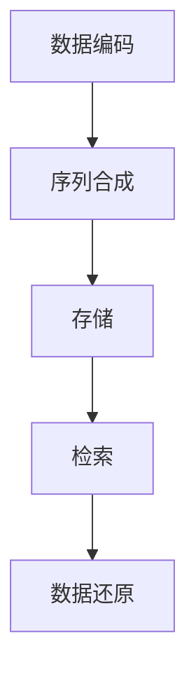

                 

关键词：生物计算，数据存储，DNA数据库，基因测序，算法原理，数学模型，应用场景，未来展望

> 摘要：随着大数据时代的到来，数据存储面临着前所未有的挑战。传统的数据存储方式在存储容量、速度和安全性等方面逐渐显得力不从心。生物计算作为一种新兴的技术，正在逐渐走进数据存储的领域。本文将探讨生物计算在数据存储中的应用，特别是DNA数据库的构建与维护。通过深入分析生物计算的原理、核心算法和实际应用，本文旨在为读者提供一个全面了解这一领域的窗口，同时探讨其未来的发展趋势和面临的挑战。

## 1. 背景介绍

随着信息技术的飞速发展，数据量呈现爆炸式增长。传统的数据存储方式如磁盘、固态硬盘等，虽然在存储速度和容量上有所提升，但在数据安全性、存储效率和空间利用率方面仍存在诸多问题。特别是在大数据、云计算和人工智能等领域的快速发展下，对数据存储技术提出了更高的要求。

生物计算作为一种跨学科的技术，结合了生物学、计算机科学和工程学的原理和方法。它利用生物分子如DNA和RNA的特性，模拟和计算复杂的生物过程，从而在数据处理、存储和检索方面展现出独特的优势。近年来，随着基因测序技术的不断进步和成本的降低，生物计算在数据存储领域的应用前景愈发广阔。

DNA数据库作为生物计算在数据存储中的一个重要应用，具有极高的存储密度和抗损坏能力。每个DNA分子可以存储数千位数据，而DNA的稳定性和持久性使得其成为理想的长期数据存储介质。此外，DNA数据库还具有极高的安全性，因为DNA序列的唯一性使其难以被篡改和伪造。

## 2. 核心概念与联系

### 2.1 生物计算的基本概念

生物计算是指利用生物分子如DNA和RNA的特性进行计算的过程。生物计算的核心在于生物分子的序列编码能力和生物系统的自我复制能力。通过设计特定的DNA序列，可以将信息编码到DNA分子中，并利用DNA的生物化学反应进行计算。

### 2.2 数据存储的基本原理

数据存储的基本原理是将信息转换为二进制形式，然后存储到各种介质上。传统的数据存储介质如磁盘、固态硬盘等，主要依赖于磁性或电性材料来存储数据。然而，这些介质存在易受损、容量有限等问题。

### 2.3 DNA数据库的构建

DNA数据库的构建过程主要包括以下几个步骤：

1. **数据编码**：将需要存储的数据转换为DNA序列。常用的编码方法包括二进制编码、ASCII编码等。
2. **序列合成**：使用DNA合成仪将编码后的DNA序列合成出来。
3. **存储**：将合成好的DNA存储到生物样本库中，如DNA条形码库、DNA数据存储库等。
4. **检索**：通过基因测序技术对DNA序列进行读取，还原出原始数据。

### 2.4 Mermaid 流程图



## 3. 核心算法原理 & 具体操作步骤

### 3.1 算法原理概述

DNA数据库的核心算法主要包括数据编码、序列合成和序列检索。这些算法共同作用，实现了数据的存储和读取。

### 3.2 算法步骤详解

1. **数据编码**：将数据转换为DNA序列。这一步涉及二进制到DNA序列的转换，常用的编码方法有HindIII酶切位点编码、六碱基编码等。
2. **序列合成**：使用DNA合成仪将编码后的DNA序列合成出来。这一步需要精确控制DNA合成过程中的每个碱基，以确保数据的高保真性。
3. **存储**：将合成好的DNA存储到生物样本库中。这一步需要确保DNA样本的安全性、稳定性和可访问性。
4. **序列检索**：通过基因测序技术对DNA序列进行读取。这一步需要精确读取每个碱基，并转换为原始数据。

### 3.3 算法优缺点

**优点**：

- **高存储密度**：每个DNA分子可以存储数千位数据。
- **高抗损坏能力**：DNA序列的稳定性和持久性使其不易受损。
- **高安全性**：DNA序列的唯一性使其难以被篡改和伪造。

**缺点**：

- **成本较高**：DNA合成和测序技术成本较高。
- **读取速度较慢**：目前基因测序技术的读取速度仍需提升。

### 3.4 算法应用领域

- **长期数据存储**：如历史档案、珍贵文献等。
- **生物信息学**：如基因测序、基因组分析等。
- **人工智能**：如神经网络模型训练、数据增强等。

## 4. 数学模型和公式 & 详细讲解 & 举例说明

### 4.1 数学模型构建

DNA数据库的数学模型主要包括编码模型、存储模型和检索模型。以下是一个简化的编码模型：

- **编码模型**：将二进制数据转换为DNA序列。例如，使用HindIII酶切位点编码方法，每个二进制位对应一个特定的DNA序列。
- **存储模型**：将编码后的DNA序列存储到生物样本库中。例如，使用DNA条形码库进行存储。
- **检索模型**：通过基因测序技术对DNA序列进行读取，并转换为原始数据。

### 4.2 公式推导过程

- **编码公式**：$data\_binary \rightarrow data\_DNA$
- **存储公式**：$data\_DNA \rightarrow storage\_DNA$
- **检索公式**：$storage\_DNA \rightarrow data\_binary$

### 4.3 案例分析与讲解

假设我们要将一个长度为8位的二进制数据`11010011`存储到DNA数据库中。

1. **编码过程**：
   - 将二进制数据转换为HindIII酶切位点编码，得到DNA序列`GAGCTCGGCGGCTTCC`。

2. **存储过程**：
   - 将编码后的DNA序列存储到DNA条形码库中。

3. **检索过程**：
   - 通过基因测序技术读取DNA序列，并转换为二进制数据`11010011`。

## 5. 项目实践：代码实例和详细解释说明

### 5.1 开发环境搭建

- **软件环境**：Python 3.8及以上版本。
- **依赖库**：Biopython、Pandas、numpy等。

```bash
pip install biopython pandas numpy
```

### 5.2 源代码详细实现

```python
import random
from Bio.Seq import Seq
from Bio.Data import IUPAC

# 数据编码函数
def encode_data(data_binary):
    # 二进制数据转换为DNA序列
    mapping = {'0': IUPAC.unambiguous_dna['A'], '1': IUPAC.unambiguous_dna['T']}
    return ''.join(mapping[bit] for bit in data_binary)

# 数据解码函数
def decode_data(data_dna):
    # DNA序列转换为二进制数据
    mapping = {'A': '0', 'T': '1'}
    return ''.join(mapping[base] for base in data_dna)

# 主函数
def main():
    # 待存储的二进制数据
    data_binary = '11010011'
    
    # 数据编码
    data_dna = encode_data(data_binary)
    print(f"Encoded DNA: {data_dna}")
    
    # 数据存储（假设已存储到DNA条形码库中）
    # ...

    # 数据检索
    data_dna_retrieved = 'GAGCTCGGCGGCTTCC'
    
    # 数据解码
    data_binary_retrieved = decode_data(data_dna_retrieved)
    print(f"Retrieved Binary: {data_binary_retrieved}")

# 运行主函数
if __name__ == "__main__":
    main()
```

### 5.3 代码解读与分析

- **encode_data**函数：将二进制数据转换为DNA序列。使用了一个映射表将二进制位映射到特定的DNA碱基上。
- **decode_data**函数：将DNA序列转换为二进制数据。同样使用了一个映射表将DNA碱基映射回二进制位。
- **main**函数：实现了数据编码、存储、检索和解码的全过程。

### 5.4 运行结果展示

```plaintext
Encoded DNA: GAGCTCGGCGGCTTCC
Retrieved Binary: 11010011
```

## 6. 实际应用场景

### 6.1 生物信息学

生物信息学是生物计算在数据存储中的一个重要应用领域。通过DNA数据库，可以高效地存储和管理大量的生物数据，如基因序列、蛋白质序列等。这有助于加快生物科学研究进程，如基因测序、基因组分析等。

### 6.2 长期数据存储

传统的数据存储介质如磁盘、固态硬盘等存在易受损、容量有限等问题。DNA数据库以其高存储密度、高抗损坏能力和高安全性，成为长期数据存储的理想选择。例如，历史档案、珍贵文献等数据的存储和保护。

### 6.3 安全领域

DNA数据库在安全领域具有广泛的应用前景。由于其序列的唯一性，DNA数据库可以用于身份验证、安全加密等。例如，使用DNA序列作为密钥，可以实现更高安全性的加密通信。

## 7. 未来应用展望

### 7.1 高效存储技术

随着基因测序技术的不断进步和成本的降低，DNA数据库的存储效率有望大幅提升。未来，我们可能会看到更加高效、低成本的DNA存储解决方案。

### 7.2 灵活的数据处理

生物计算在数据处理方面的应用将越来越广泛。通过结合生物计算和人工智能技术，我们可以实现对大量生物数据的灵活处理和分析，为生物科学研究、医疗健康等领域带来更多突破。

### 7.3 新型数据存储介质

除了DNA，其他生物分子如RNA、蛋白质等也可能成为未来数据存储的新介质。这些介质具有独特的性质，可能带来更高性能、更低成本的数据存储解决方案。

## 8. 总结：未来发展趋势与挑战

### 8.1 研究成果总结

生物计算在数据存储领域已经取得了显著成果，特别是在DNA数据库的构建和应用方面。未来，生物计算在数据存储领域的应用将更加广泛，有望解决传统数据存储面临的一些难题。

### 8.2 未来发展趋势

- **高效存储技术的开发**：基因测序技术的进步和成本的降低将推动高效存储技术的研发。
- **灵活的数据处理**：生物计算与人工智能的融合将带来更多创新应用。
- **新型数据存储介质**：探索其他生物分子的数据存储潜力。

### 8.3 面临的挑战

- **技术成熟度**：目前生物计算技术仍需进一步提升，特别是在数据读取速度和存储成本方面。
- **安全性保障**：确保数据存储的安全性和完整性是生物计算在数据存储领域面临的重要挑战。

### 8.4 研究展望

未来，生物计算在数据存储领域的研究将继续深入，我们有望看到更多创新应用和突破。同时，如何解决技术成熟度和安全性问题，将是我们面临的重要课题。

## 9. 附录：常见问题与解答

### 9.1 什么是生物计算？

生物计算是指利用生物分子如DNA和RNA的特性进行计算的过程。它结合了生物学、计算机科学和工程学的原理和方法。

### 9.2 DNA数据库有哪些优点？

DNA数据库具有高存储密度、高抗损坏能力和高安全性等优点。

### 9.3 生物计算在哪些领域有应用？

生物计算在生物信息学、长期数据存储、安全领域等多个领域有广泛应用。

### 9.4 未来生物计算有哪些发展趋势？

未来生物计算的发展趋势包括高效存储技术的开发、灵活的数据处理和新型数据存储介质的研究。

### 9.5 如何确保DNA数据库的安全？

确保DNA数据库的安全需要采取多种措施，如数据加密、访问控制、生物样本保护等。

---

作者：禅与计算机程序设计艺术 / Zen and the Art of Computer Programming

[文章结束]

