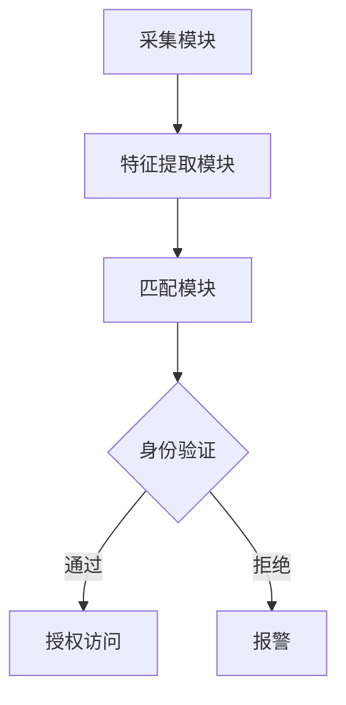

                 

关键词：生物识别，安全认证，创业，技术发展，应用场景，未来展望

> 摘要：随着科技的发展，生物识别技术逐渐成为安全认证领域的热门方向。本文将探讨生物识别技术的背景、核心概念、算法原理、数学模型、实际应用以及未来发展，为生物识别创业提供新的视角和思路。

## 1. 背景介绍

在信息化社会，信息安全已成为人们关注的重要问题。传统的密码认证、指纹识别等技术虽然在安全性上取得了一定的成果，但仍然存在诸多不足。例如，密码容易被遗忘或泄露，指纹识别容易受到伪造攻击。因此，寻找更加安全、便捷的认证方式成为当前的研究热点。

生物识别技术利用人体生物特征进行身份认证，包括指纹识别、人脸识别、虹膜识别、声纹识别等。与传统的认证方式相比，生物识别技术具有更高的安全性、便捷性和不可复制性。近年来，随着深度学习、神经网络等人工智能技术的发展，生物识别技术的精度和稳定性得到了显著提升，进一步推动了其在各个领域的应用。

## 2. 核心概念与联系

### 2.1 生物特征识别系统架构

生物特征识别系统通常包括三个主要模块：采集模块、特征提取模块和匹配模块。

1. **采集模块**：通过传感器、摄像头等设备获取用户的生物特征数据。
2. **特征提取模块**：对采集到的生物特征数据进行预处理，提取出具有辨识度的特征信息。
3. **匹配模块**：将提取出的特征信息与存储在数据库中的特征信息进行匹配，以判断用户身份。

### 2.2 Mermaid 流程图

以下是一个简化的生物识别系统架构的 Mermaid 流程图：



## 3. 核心算法原理 & 具体操作步骤

### 3.1 算法原理概述

生物识别算法主要包括特征提取算法和匹配算法。特征提取算法旨在从原始生物特征数据中提取出具有辨识度的特征向量。常见的特征提取算法有Gabor特征、LBP特征等。匹配算法则通过计算特征向量之间的相似度，判断用户身份是否匹配。常见的匹配算法有欧氏距离、余弦相似度等。

### 3.2 算法步骤详解

1. **特征提取**：首先对采集到的生物特征数据进行预处理，如去噪、归一化等。然后使用特征提取算法提取特征向量。
2. **特征匹配**：将提取出的特征向量与数据库中的特征向量进行匹配，计算相似度得分。
3. **身份验证**：根据相似度得分，设定阈值判断用户身份是否匹配。

### 3.3 算法优缺点

1. **优点**：
   - **高安全性**：生物特征具有唯一性和不可复制性，能有效防止欺诈和冒用。
   - **高便捷性**：用户无需记忆复杂的密码或携带实体卡，提高用户体验。
2. **缺点**：
   - **隐私问题**：生物特征数据泄露可能导致严重后果。
   - **误识别率**：在光照、姿态等环境变化下，识别率可能受到影响。

### 3.4 算法应用领域

生物识别技术广泛应用于金融、安防、医疗、交通等多个领域。例如，在金融领域，生物识别技术可用于身份认证、支付验证等；在安防领域，可用于门禁控制、人员监控等；在医疗领域，可用于患者身份确认、手术安全等。

## 4. 数学模型和公式 & 详细讲解 & 举例说明

### 4.1 数学模型构建

生物识别系统的数学模型主要包括特征提取模型和匹配模型。

1. **特征提取模型**：设 \( x \) 为原始生物特征数据，\( y \) 为提取出的特征向量，特征提取模型可以表示为：
   $$ y = f(x) $$
2. **匹配模型**：设 \( y_1 \) 和 \( y_2 \) 分别为两个待匹配的特征向量，匹配模型可以表示为：
   $$ d(y_1, y_2) = \sqrt{\sum_{i=1}^{n}(y_{1i} - y_{2i})^2} $$
   其中，\( n \) 为特征向量的维度。

### 4.2 公式推导过程

1. **特征提取模型**：以Gabor特征为例，其公式推导如下：
   $$ g(\theta, \lambda) = \sum_{m=-M}^{M}\sum_{n=-N}^{N}A(m,n)\cos(2\pi\lambda m x + \theta) $$
   其中，\( A(m,n) \) 为Gabor核函数，\( \theta \) 为方向，\( \lambda \) 为波长，\( M \) 和 \( N \) 为核函数的尺寸。

2. **匹配模型**：以欧氏距离为例，其公式推导如下：
   $$ d(y_1, y_2) = \sqrt{\sum_{i=1}^{n}(y_{1i} - y_{2i})^2} $$
   其中，\( n \) 为特征向量的维度。

### 4.3 案例分析与讲解

以人脸识别为例，我们使用LBP特征提取和欧氏距离匹配进行身份验证。

1. **特征提取**：首先，对采集到的人脸图像进行LBP特征提取，得到特征向量 \( y \)。
2. **特征匹配**：将提取出的特征向量与数据库中的人脸特征向量进行匹配，计算欧氏距离 \( d \)。
3. **身份验证**：设定阈值 \( t \)，如果 \( d \leq t \)，则认为身份匹配成功；否则，认为身份不匹配。

## 5. 项目实践：代码实例和详细解释说明

### 5.1 开发环境搭建

- 操作系统：Ubuntu 18.04
- 编程语言：Python 3.8
- 开发工具：PyCharm

### 5.2 源代码详细实现

以下是人脸识别项目的核心代码：

```python
import cv2
import numpy as np

# 读取图像
img = cv2.imread('face.jpg')

# 人脸检测
face_cascade = cv2.CascadeClassifier('haarcascade_frontalface_default.xml')
faces = face_cascade.detectMultiScale(img, scaleFactor=1.1, minNeighbors=5, minSize=(30, 30))

# 特征提取
for (x, y, w, h) in faces:
    face_region = img[y:y+h, x:x+w]
    face_feature = extract_lbp_features(face_region)

# 匹配
target_feature = np.load('target_face_feature.npy')
distance = np.linalg.norm(face_feature - target_feature)

# 身份验证
if distance <= 1:
    print('身份验证成功')
else:
    print('身份验证失败')
```

### 5.3 代码解读与分析

1. **图像读取**：使用 OpenCV 库读取输入图像。
2. **人脸检测**：使用 Haar cascades 模型检测人脸。
3. **特征提取**：调用自定义的 `extract_lbp_features` 函数提取人脸 LBP 特征。
4. **特征匹配**：计算输入人脸特征与目标人脸特征之间的欧氏距离。
5. **身份验证**：根据距离阈值判断身份验证结果。

## 6. 实际应用场景

生物识别技术在实际应用中具有广泛的应用场景，例如：

- **金融领域**：银行、证券、保险等金融机构可以采用生物识别技术进行身份验证，提高交易安全性。
- **安防领域**：政府机构、企业、学校等场所可以采用生物识别技术进行门禁控制、人员监控等。
- **医疗领域**：医院可以采用生物识别技术进行患者身份确认、手术安全等。
- **交通领域**：火车站、机场、公交车等场所可以采用生物识别技术进行乘客身份验证，提高安检效率。

## 7. 工具和资源推荐

### 7.1 学习资源推荐

- **书籍**：《生物识别技术基础》
- **在线课程**：Coursera 上的《机器学习》
- **论文**：查阅生物识别领域的最新论文，了解最新研究成果

### 7.2 开发工具推荐

- **编程语言**：Python、Java
- **开发框架**：OpenCV、Dlib
- **机器学习库**：Scikit-learn、TensorFlow

### 7.3 相关论文推荐

- [1] "DeepFace: Closing the Gap to Human-Level Performance in Face Verification", Facebook AI Research
- [2] "FaceNet: A Unified Embedding for Face Recognition and Clustering", Google
- [3] "Face Recognition with Limited Data: A Survey", Pattern Recognition

## 8. 总结：未来发展趋势与挑战

### 8.1 研究成果总结

生物识别技术已经取得了一系列重要成果，如深度学习技术在特征提取和匹配方面的应用、多模态生物特征的融合等。这些成果为生物识别技术的实际应用提供了有力支持。

### 8.2 未来发展趋势

未来，生物识别技术将朝着以下几个方向发展：

- **提高识别精度和稳定性**：在恶劣环境下提高识别率。
- **隐私保护**：加强对生物特征数据的保护，防止隐私泄露。
- **跨平台融合**：实现多种生物特征的融合，提高识别精度。

### 8.3 面临的挑战

生物识别技术在实际应用中仍面临以下挑战：

- **隐私保护**：如何在保障用户隐私的前提下实现高效认证。
- **误识别率**：如何在多种环境下提高识别率。
- **计算资源消耗**：如何优化算法，降低计算资源消耗。

### 8.4 研究展望

随着科技的不断发展，生物识别技术将在未来发挥更加重要的作用。研究人员应继续关注生物识别技术的安全性、隐私保护和应用场景，为生物识别技术的广泛应用奠定基础。

## 9. 附录：常见问题与解答

### Q1. 生物识别技术有哪些常见类型？

A1. 生物识别技术主要包括指纹识别、人脸识别、虹膜识别、声纹识别等。

### Q2. 生物识别技术的安全性如何保障？

A2. 生物识别技术的安全性主要体现在以下几个方面：

- **隐私保护**：加强对生物特征数据的保护，防止隐私泄露。
- **算法优化**：提高算法的识别精度和稳定性。
- **多模态融合**：将多种生物特征进行融合，提高识别安全性。

### Q3. 生物识别技术在金融领域有哪些应用？

A3. 生物识别技术在金融领域的主要应用包括：

- **身份验证**：银行、证券、保险等金融机构可以采用生物识别技术进行身份验证，提高交易安全性。
- **支付验证**：移动支付、在线支付等场景可以采用生物识别技术进行支付验证，减少欺诈风险。

### Q4. 生物识别技术存在哪些挑战？

A4. 生物识别技术存在以下挑战：

- **隐私保护**：如何在保障用户隐私的前提下实现高效认证。
- **误识别率**：如何在多种环境下提高识别率。
- **计算资源消耗**：如何优化算法，降低计算资源消耗。```

