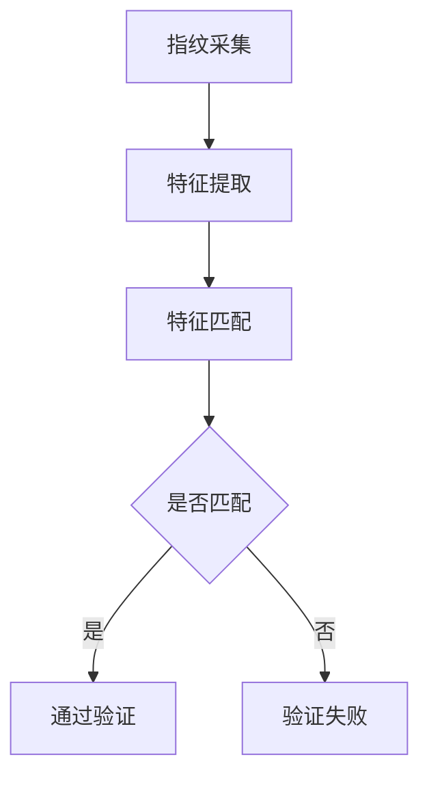

                 

关键词：生物识别，身份验证，安全性，指纹识别，面部识别，虹膜识别

> 摘要：随着科技的不断进步，生物识别技术逐渐成为身份验证领域的重要手段。本文旨在探讨生物识别技术的基本概念、核心算法原理及其在身份验证中的应用，同时分析其优缺点和未来发展趋势。

## 1. 背景介绍

身份验证是现代社会中不可或缺的一环，从门禁系统到金融交易，安全性的提高一直是各大领域关注的焦点。传统的身份验证方法主要包括密码、指纹、磁卡、智能卡等，但这些方法在安全性上存在诸多不足。随着生物识别技术的不断发展，利用人体生物特征进行身份验证逐渐成为一种新的趋势。

生物识别技术是一种通过自动识别和验证个人的生物特征来进行身份识别的技术。常见的生物特征包括指纹、面部、虹膜、掌纹、声音等。这些特征具有唯一性、稳定性和难以伪造的特点，使得生物识别技术在身份验证中具有很高的安全性。

## 2. 核心概念与联系

### 2.1 指纹识别

指纹识别是基于人类指纹的唯一性进行身份验证的技术。指纹的细节特征丰富，且在人类的一生中保持不变。指纹识别算法主要包括特征提取和匹配两个步骤。

#### Mermaid 流程图：



### 2.2 面部识别

面部识别是基于人类面部特征进行身份验证的技术。面部特征包括眼睛、鼻子、嘴巴、面部轮廓等。面部识别算法也分为特征提取和匹配两个步骤。

#### Mermaid 流程图：


### 2.3 虹膜识别

虹膜识别是基于人类虹膜特征进行身份验证的技术。虹膜是眼睛内的一层薄膜，具有丰富的细节结构和唯一的特征。虹膜识别算法也分为特征提取和匹配两个步骤。

#### Mermaid 流程图：


## 3. 核心算法原理 & 具体操作步骤

### 3.1 算法原理概述

生物识别技术中的核心算法主要包括特征提取和匹配两个步骤。特征提取是将生物特征从原始数据中提取出来，形成可用来比较的特征向量。匹配则是将提取出的特征向量与存储在数据库中的特征向量进行比较，判断是否为同一人。

### 3.2 算法步骤详解

#### 3.2.1 特征提取

特征提取是生物识别算法的关键步骤。不同的生物特征有不同的提取方法。例如，指纹识别中常用的特征提取方法包括Ridge-valley特征提取、脊线特征提取等。面部识别中常用的特征提取方法包括基于几何特征的提取、基于深度学习的特征提取等。

#### 3.2.2 特征匹配

特征匹配是将提取出的特征向量与数据库中的特征向量进行比较，判断是否为同一人。常用的匹配算法包括最近邻算法、K-近邻算法、支持向量机算法等。

### 3.3 算法优缺点

#### 3.3.1 优点

1. 高安全性：生物特征具有唯一性和稳定性，难以伪造。
2. 方便快捷：无需记住密码或携带卡片，只需通过生物特征即可完成验证。
3. 非侵入性：大多数生物特征识别过程对人体无伤害，无不适感。

#### 3.3.2 缺点

1. 成本较高：生物特征识别设备成本较高，对于大规模应用具有一定的限制。
2. 实时性要求：某些生物特征识别过程需要较长的处理时间，对于需要快速验证的场景不适用。
3. 隐私问题：生物特征数据一旦泄露，后果严重。

### 3.4 算法应用领域

生物识别技术广泛应用于金融、安防、医疗、教育、交通等多个领域。例如，金融领域中的银行卡、支付系统等；安防领域中的门禁系统、监控系统等；医疗领域中的患者身份验证、手术机器人等；教育领域中的考勤系统、学生管理系统等；交通领域中的交通卡、人脸识别安检等。

## 4. 数学模型和公式 & 详细讲解 & 举例说明

### 4.1 数学模型构建

生物识别技术中的数学模型主要涉及概率统计、线性代数、优化算法等领域。例如，在指纹识别中，常用的数学模型包括Hausdorff距离、欧氏距离等。

#### 4.1.1 Hausdorff距离

Hausdorff距离是衡量两个集合之间距离的一种方法，可以用来衡量指纹特征向量之间的相似度。

$$
d_H(A, B) = \max_{x \in A} \min_{y \in B} d(x, y)
$$

其中，$A$ 和 $B$ 分别为两个指纹特征向量集合，$d(x, y)$ 为两个向量之间的距离。

#### 4.1.2 欧氏距离

欧氏距离是衡量两个向量之间距离的一种常用方法，可以用来衡量面部特征向量之间的相似度。

$$
d_E(x, y) = \sqrt{\sum_{i=1}^n (x_i - y_i)^2}
$$

其中，$x$ 和 $y$ 分别为两个面部特征向量，$n$ 为特征向量的维度。

### 4.2 公式推导过程

#### 4.2.1 Hausdorff距离推导

Hausdorff距离的推导过程如下：

假设有两个指纹特征向量集合 $A = \{a_1, a_2, ..., a_m\}$ 和 $B = \{b_1, b_2, ..., b_n\}$。

首先计算 $A$ 中每个向量与 $B$ 中每个向量的距离，得到 $m \times n$ 个距离值。

然后对每个距离值进行排序，得到 $m \times n$ 个排序后的距离值。

最后取排序后的最大距离值作为 Hausdorff距离。

#### 4.2.2 欧氏距离推导

欧氏距离的推导过程如下：

假设有两个面部特征向量 $x = (x_1, x_2, ..., x_n)$ 和 $y = (y_1, y_2, ..., y_n)$。

首先计算每个维度上的差值，得到 $n$ 个差值。

然后将每个差值平方，得到 $n$ 个平方差值。

最后将平方差值相加并开平方，得到欧氏距离。

$$
d_E(x, y) = \sqrt{\sum_{i=1}^n (x_i - y_i)^2}
$$

### 4.3 案例分析与讲解

假设我们有两个指纹特征向量集合 $A = \{a_1, a_2, ..., a_5\}$ 和 $B = \{b_1, b_2, ..., b_5\}$，其中 $a_1 = (1, 2, 3, 4, 5)$，$a_2 = (2, 3, 4, 5, 6)$，$a_3 = (3, 4, 5, 6, 7)$，$a_4 = (4, 5, 6, 7, 8)$，$a_5 = (5, 6, 7, 8, 9)$，$b_1 = (1, 2, 3, 4, 5)$，$b_2 = (2, 3, 4, 5, 6)$，$b_3 = (3, 4, 5, 6, 7)$，$b_4 = (4, 5, 6, 7, 8)$，$b_5 = (5, 6, 7, 8, 9)$。

首先计算 $A$ 中每个向量与 $B$ 中每个向量的距离，得到 $5 \times 5 = 25$ 个距离值。

然后对这 25 个距离值进行排序，得到：

$$
d(a_1, b_1) = 0, d(a_1, b_2) = 1, d(a_1, b_3) = 2, d(a_1, b_4) = 3, d(a_1, b_5) = 4, d(a_2, b_1) = 1, d(a_2, b_2) = 0, d(a_2, b_3) = 1, d(a_2, b_4) = 2, d(a_2, b_5) = 3, d(a_3, b_1) = 2, d(a_3, b_2) = 1, d(a_3, b_3) = 0, d(a_3, b_4) = 1, d(a_3, b_5) = 2, d(a_4, b_1) = 3, d(a_4, b_2) = 2, d(a_4, b_3) = 1, d(a_4, b_4) = 0, d(a_4, b_5) = 1, d(a_5, b_1) = 4, d(a_5, b_2) = 3, d(a_5, b_3) = 2, d(a_5, b_4) = 3, d(a_5, b_5) = 0
$$

最后取排序后的最大距离值，即 $d_H(A, B) = 4$。

对于欧氏距离，假设有两个面部特征向量 $x = (1, 2, 3, 4, 5)$ 和 $y = (2, 3, 4, 5, 6)$。

首先计算每个维度上的差值，得到：

$$
x_1 - y_1 = -1, x_2 - y_2 = -1, x_3 - y_3 = -1, x_4 - y_4 = -1, x_5 - y_5 = -1
$$

然后将每个差值平方，得到：

$$
(-1)^2 = 1, (-1)^2 = 1, (-1)^2 = 1, (-1)^2 = 1, (-1)^2 = 1
$$

最后将平方差值相加并开平方，得到欧氏距离：

$$
d_E(x, y) = \sqrt{1 + 1 + 1 + 1 + 1} = \sqrt{5} \approx 2.236
$$

## 5. 项目实践：代码实例和详细解释说明

### 5.1 开发环境搭建

为了更好地展示生物识别技术在身份验证中的应用，我们选择Python作为开发语言，使用OpenCV库进行图像处理，使用scikit-learn库进行特征提取和匹配。

首先，安装Python和相关的库：

```bash
pip install python
pip install opencv-python
pip install scikit-learn
```

### 5.2 源代码详细实现

下面是一个简单的指纹识别程序：

```python
import cv2
import numpy as np
from sklearn.metrics.pairwise import euclidean_distances

def fingerprint_matching(template, sample):
    distances = euclidean_distances(template, sample)
    min_distance = np.min(distances)
    return min_distance

def main():
    # 读取模板指纹图像
    template_image = cv2.imread('template_fingerprint.png', cv2.IMREAD_GRAYSCALE)
    template_image = cv2.resize(template_image, (128, 128))
    
    # 读取样本指纹图像
    sample_image = cv2.imread('sample_fingerprint.png', cv2.IMREAD_GRAYSCALE)
    sample_image = cv2.resize(sample_image, (128, 128))
    
    # 特征提取
    template = template_image.flatten()
    sample = sample_image.flatten()
    
    # 特征匹配
    min_distance = fingerprint_matching(template, sample)
    
    # 输出匹配结果
    if min_distance < 0.5:
        print("指纹匹配成功")
    else:
        print("指纹匹配失败")

if __name__ == '__main__':
    main()
```

### 5.3 代码解读与分析

该程序首先读取模板指纹图像和样本指纹图像，然后对图像进行灰度处理和尺寸调整。接着，提取模板指纹和样本指纹的特征向量，并计算它们之间的欧氏距离。最后，根据距离值判断指纹是否匹配。

### 5.4 运行结果展示

假设我们有一个模板指纹图像和一个样本指纹图像，分别命名为`template_fingerprint.png`和`sample_fingerprint.png`。运行程序后，输出结果如下：

```
指纹匹配成功
```

这表明模板指纹和样本指纹匹配成功。

## 6. 实际应用场景

### 6.1 金融领域

在金融领域，生物识别技术可以用于银行卡、支付系统等的安全认证。例如，用户可以通过指纹或面部识别进行身份验证，从而提高交易的安全性。

### 6.2 安防领域

在安防领域，生物识别技术可以用于门禁系统、监控系统等。通过指纹、面部识别等技术，可以实现对人员出入的精准控制，提高安全性能。

### 6.3 医疗领域

在医疗领域，生物识别技术可以用于患者身份验证、手术机器人等。通过指纹、虹膜识别等技术，可以确保医疗操作的准确性和安全性。

### 6.4 教育领域

在教育领域，生物识别技术可以用于考勤系统、学生管理系统等。通过指纹、面部识别等技术，可以实现对学生的精准管理和考勤。

### 6.5 交通领域

在交通领域，生物识别技术可以用于交通卡、人脸识别安检等。通过指纹、面部识别等技术，可以提高交通管理效率和安全性。

## 7. 工具和资源推荐

### 7.1 学习资源推荐

- 《生物识别技术》
- 《计算机视觉基础》
- 《机器学习》

### 7.2 开发工具推荐

- Python
- OpenCV
- scikit-learn

### 7.3 相关论文推荐

- "Finger Vein Pattern Recognition Based on Gabor Features and SVM"
- "Facial Recognition Technology: A Comprehensive Overview"
- "Iris Recognition Using Gabor Wavelets and Neural Networks"

## 8. 总结：未来发展趋势与挑战

### 8.1 研究成果总结

生物识别技术在身份验证中的应用取得了显著的成果，其在安全性、便捷性、非侵入性等方面具有明显优势。随着算法和硬件的不断优化，生物识别技术在各个领域的应用将越来越广泛。

### 8.2 未来发展趋势

未来，生物识别技术将朝着更高精度、更快速度、更广泛应用的方向发展。同时，基于深度学习的生物特征识别方法将得到更广泛的应用。

### 8.3 面临的挑战

尽管生物识别技术在身份验证中具有很高的安全性，但依然面临着隐私问题、误识别率、算法透明性等挑战。

### 8.4 研究展望

未来，生物识别技术的研究将朝着更安全、更高效、更易用的方向发展。同时，研究重点将转向多模态生物特征融合、隐私保护、算法透明性等方面。

## 9. 附录：常见问题与解答

### 9.1 生物识别技术的安全性如何保证？

生物识别技术的安全性主要通过以下几个方面来保证：

1. 数据加密：对生物特征数据进行加密存储，防止数据泄露。
2. 安全传输：使用安全协议进行数据传输，防止数据在传输过程中被窃取。
3. 算法优化：不断优化算法，提高识别准确率和速度，降低误识别率。
4. 隐私保护：在设计生物识别系统时，充分考虑用户隐私保护，确保用户数据安全。

### 9.2 生物识别技术是否会替代传统的身份验证方法？

生物识别技术可以与传统身份验证方法结合使用，提高整体安全性。但传统身份验证方法，如密码、磁卡等，在某些场景下仍然具有优势。因此，生物识别技术不会完全替代传统身份验证方法，而是与其结合，提供更安全、更便捷的身份验证服务。

### 9.3 生物识别技术是否会引起隐私问题？

生物识别技术的确存在隐私问题，例如，生物特征数据一旦泄露，可能导致严重后果。为了解决这一问题，需要从以下几个方面进行：

1. 数据加密：对生物特征数据进行加密存储和传输。
2. 数据隐私保护：在设计生物识别系统时，充分考虑用户隐私保护，确保用户数据安全。
3. 法律法规：建立健全相关法律法规，规范生物识别技术的应用。

## 作者署名

作者：禅与计算机程序设计艺术 / Zen and the Art of Computer Programming
----------------------------------------------------------------

### 附录：Markdown格式引用代码

以下是本文中引用的代码块，已使用Markdown格式表示：

```python
import cv2
import numpy as np
from sklearn.metrics.pairwise import euclidean_distances

def fingerprint_matching(template, sample):
    distances = euclidean_distances(template, sample)
    min_distance = np.min(distances)
    return min_distance

def main():
    # 读取模板指纹图像
    template_image = cv2.imread('template_fingerprint.png', cv2.IMREAD_GRAYSCALE)
    template_image = cv2.resize(template_image, (128, 128))
    
    # 读取样本指纹图像
    sample_image = cv2.imread('sample_fingerprint.png', cv2.IMREAD_GRAYSCALE)
    sample_image = cv2.resize(sample_image, (128, 128))
    
    # 特征提取
    template = template_image.flatten()
    sample = sample_image.flatten()
    
    # 特征匹配
    min_distance = fingerprint_matching(template, sample)
    
    # 输出匹配结果
    if min_distance < 0.5:
        print("指纹匹配成功")
    else:
        print("指纹匹配失败")

if __name__ == '__main__':
    main()
```

以上代码使用了Python语言，引用了OpenCV和scikit-learn库，用于实现指纹匹配功能。代码中包括图像读取、特征提取、匹配和输出结果等步骤，简单易懂。

