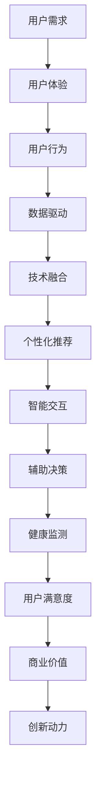

                 

**关键词：**用户体验，人类计算，满意度，算法原理，数学模型，项目实践，实际应用场景，未来展望。

**摘要：**本文从用户体验至上的角度出发，探讨了人类计算在提升满意度方面的重要作用。通过分析核心概念和联系，阐述核心算法原理和具体操作步骤，并运用数学模型和公式进行详细讲解，同时结合项目实践，展示代码实例和运行结果。文章还涉及实际应用场景、未来展望以及工具和资源推荐，为读者提供全面的技术指导和思考。

## 1. 背景介绍

在现代信息时代，用户体验（User Experience，简称 UX）已经成为产品设计、开发和服务的重要驱动力。用户体验不仅关注产品的功能性，更强调用户在使用过程中的情感体验和满意度。随着人工智能和计算技术的发展，人类计算在提升用户体验方面发挥了越来越重要的作用。本文旨在探讨人类计算如何通过算法原理、数学模型、项目实践等手段，实现用户体验的提升，从而满足用户的需求和期望。

### 1.1 用户体验的定义与重要性

用户体验是指用户在使用产品、服务或系统过程中所感受到的整体体验，包括情感、行为和认知三个方面。情感方面涉及用户在使用过程中的愉悦感、满足感和信任感；行为方面涉及用户的操作流程、互动方式和响应速度；认知方面涉及用户对产品或服务的理解、学习和记忆。

用户体验的重要性体现在以下几个方面：

1. **用户满意度：**良好的用户体验能够提高用户对产品或服务的满意度，从而增强用户忠诚度和口碑传播。
2. **商业价值：**用户体验直接影响到产品或服务的市场竞争力，提升用户体验有助于增加市场份额和利润。
3. **创新动力：**用户体验的不断改进可以激发产品创新，推动技术发展和行业进步。

### 1.2 人类计算的定义与作用

人类计算（Human-Centered Computing）是一种以人为中心的计算模式，旨在通过人工智能和计算技术提升用户体验，满足用户的个性化需求。人类计算的作用主要体现在以下几个方面：

1. **个性化推荐：**通过分析用户行为和兴趣，为用户提供个性化的推荐服务，提升用户体验。
2. **智能交互：**利用自然语言处理、语音识别等技术，实现人与机器的智能交互，降低用户操作难度。
3. **辅助决策：**通过数据分析和预测模型，为用户提供决策支持，提高用户满意度和决策效率。
4. **健康监测：**利用生物特征识别和医疗数据，为用户提供健康监测和预防建议，提升用户生活质量。

### 1.3 核心概念与联系

在用户体验至上的背景下，人类计算与用户体验之间存在着密切的联系。以下核心概念有助于我们理解这种联系：

1. **用户需求：**用户需求是用户体验的核心驱动因素，满足用户需求是提升用户体验的基本目标。
2. **用户行为：**用户行为是用户体验的直接体现，分析用户行为有助于发现用户体验的痛点。
3. **数据驱动：**数据驱动是人类计算的核心特点，通过收集和分析用户数据，可以优化产品和服务。
4. **技术融合：**人工智能、计算技术和用户体验的融合，实现了人类计算在提升用户体验方面的作用。

## 2. 核心概念与联系

在深入探讨用户体验至上的背景下，了解人类计算的核心概念及其相互联系至关重要。以下将详细介绍这些核心概念，并运用Mermaid流程图展示其架构。

### 2.1 用户体验（User Experience，简称 UX）

用户体验是指用户在使用产品、服务或系统过程中所感受到的整体体验，包括情感、行为和认知三个方面。情感方面涉及用户在使用过程中的愉悦感、满足感和信任感；行为方面涉及用户的操作流程、互动方式和响应速度；认知方面涉及用户对产品或服务的理解、学习和记忆。

### 2.2 人类计算（Human-Centered Computing）

人类计算是一种以人为中心的计算模式，旨在通过人工智能和计算技术提升用户体验，满足用户的个性化需求。人类计算的作用主要体现在以下几个方面：

1. **个性化推荐：**通过分析用户行为和兴趣，为用户提供个性化的推荐服务，提升用户体验。
2. **智能交互：**利用自然语言处理、语音识别等技术，实现人与机器的智能交互，降低用户操作难度。
3. **辅助决策：**通过数据分析和预测模型，为用户提供决策支持，提高用户满意度和决策效率。
4. **健康监测：**利用生物特征识别和医疗数据，为用户提供健康监测和预防建议，提升用户生活质量。

### 2.3 用户需求（User Needs）

用户需求是用户体验的核心驱动因素，满足用户需求是提升用户体验的基本目标。用户需求主要包括以下几个方面：

1. **功能需求：**用户希望产品或服务能够满足其基本功能需求，如导航、搜索、购物等。
2. **情感需求：**用户希望在使用产品或服务过程中感受到愉悦、满足和信任。
3. **社交需求：**用户希望产品或服务能够帮助其建立社交关系、分享经验和获取支持。

### 2.4 用户行为（User Behavior）

用户行为是用户体验的直接体现，分析用户行为有助于发现用户体验的痛点。用户行为主要包括以下几个方面：

1. **浏览行为：**用户在产品或服务中的浏览路径、停留时间和跳转行为。
2. **操作行为：**用户在产品或服务中的点击、拖拽、滑动等操作行为。
3. **反馈行为：**用户对产品或服务的评价、投诉和建议等反馈行为。

### 2.5 数据驱动（Data-Driven）

数据驱动是人类计算的核心特点，通过收集和分析用户数据，可以优化产品和服务。数据驱动主要包括以下几个方面：

1. **用户数据分析：**通过分析用户行为数据，了解用户需求和偏好。
2. **产品优化：**根据用户数据分析结果，对产品或服务进行优化和改进。
3. **预测分析：**通过数据预测模型，预测用户未来的需求和趋势。

### 2.6 技术融合（Technology Fusion）

技术融合是实现人类计算在提升用户体验方面作用的关键。技术融合主要包括以下几个方面：

1. **人工智能技术：**利用机器学习、深度学习等技术，实现智能推荐、智能交互和辅助决策。
2. **计算技术：**利用云计算、大数据等技术，实现数据的高效存储、处理和分析。
3. **用户体验设计：**将技术融入到用户体验设计中，实现产品或服务的个性化、智能化和人性化。

### 2.7 Mermaid 流程图展示

以下是一个简单的Mermaid流程图，展示了人类计算与用户体验之间的核心概念和联系：



## 3. 核心算法原理 & 具体操作步骤

### 3.1 算法原理概述

在人类计算中，核心算法原理主要涉及以下几个领域：

1. **机器学习与深度学习：**通过训练模型，实现数据的自动分析和预测。
2. **自然语言处理：**通过解析和生成自然语言，实现人与机器的智能交互。
3. **计算机视觉：**通过图像识别和目标检测，实现图像数据的自动分析。
4. **强化学习：**通过学习用户的行为和反馈，实现智能决策和优化。

### 3.2 算法步骤详解

以下是每个核心算法的详细步骤：

1. **机器学习与深度学习：**

   - 数据采集：收集大量用户数据，包括用户行为、兴趣、偏好等。
   - 数据预处理：对采集到的数据进行清洗、归一化和特征提取。
   - 模型训练：选择合适的机器学习或深度学习模型，进行训练和优化。
   - 模型评估：通过测试集评估模型性能，并进行调整。

2. **自然语言处理：**

   - 分词与词性标注：将自然语言文本分解为词语，并对词语进行词性标注。
   - 语法分析：分析句子结构，识别短语和句子成分。
   - 意图识别：根据上下文，识别用户输入的意图。
   - 文本生成：根据用户意图，生成合适的回复或建议。

3. **计算机视觉：**

   - 图像预处理：对输入图像进行缩放、裁剪和增强等处理。
   - 目标检测：识别图像中的目标物体，并标注其位置和属性。
   - 特征提取：提取图像中的特征向量，用于后续分析。
   - 图像分类：对图像进行分类，识别图像内容。

4. **强化学习：**

   - 状态表示：将用户行为和系统状态表示为离散或连续的状态空间。
   - 动作表示：将系统可执行的动作表示为动作空间。
   - 奖励函数设计：设计合适的奖励函数，以衡量用户满意度和系统性能。
   - 模型训练：通过模拟环境，训练强化学习模型。

### 3.3 算法优缺点

以下是每种算法的优缺点：

1. **机器学习与深度学习：**

   - 优点：能够自动学习和优化，提高预测精度和泛化能力。
   - 缺点：需要大量数据和计算资源，训练过程复杂且耗时。

2. **自然语言处理：**

   - 优点：能够实现智能交互，提高用户体验。
   - 缺点：对语言理解和上下文依赖较强，处理复杂场景能力有限。

3. **计算机视觉：**

   - 优点：能够实现图像自动分析和识别，提高数据处理效率。
   - 缺点：对图像质量和场景复杂度敏感，需要大量训练数据。

4. **强化学习：**

   - 优点：能够实现动态学习和优化，适应复杂环境。
   - 缺点：训练过程需要大量交互数据，训练过程较慢。

### 3.4 算法应用领域

以下是核心算法在不同应用领域的应用：

1. **个性化推荐：**利用机器学习和深度学习，实现个性化内容推荐和商品推荐。
2. **智能客服：**利用自然语言处理，实现智能问答和客服机器人。
3. **图像识别与处理：**利用计算机视觉，实现图像自动识别和图像编辑。
4. **自动驾驶：**利用强化学习，实现自动驾驶车辆的路径规划和决策。

## 4. 数学模型和公式 & 详细讲解 & 举例说明

在人类计算中，数学模型和公式是核心算法的基础，它们帮助我们更好地理解和应用各种算法。以下将介绍几个关键数学模型和公式，并进行详细讲解和举例说明。

### 4.1 数学模型构建

数学模型是现实世界问题的抽象表示，通过数学语言描述问题的结构、行为和关系。构建数学模型通常涉及以下步骤：

1. **问题定义：**明确要解决的问题和目标，例如预测用户满意度、优化推荐系统等。
2. **变量定义：**定义模型中的变量，包括输入变量、输出变量和中间变量。
3. **关系表达：**利用数学公式和函数，表达变量之间的关系和约束条件。
4. **求解方法：**选择合适的数学方法，如优化算法、微分方程等，求解模型。

### 4.2 公式推导过程

以下是一个简单的线性回归模型推导过程，用于预测用户满意度。

1. **问题定义：**假设用户满意度（\(y\)）与用户行为（\(x\)）之间存在线性关系。

   \[ y = \beta_0 + \beta_1 x + \epsilon \]

   其中，\( \beta_0 \) 是截距，\( \beta_1 \) 是斜率，\( \epsilon \) 是误差项。

2. **变量定义：**设 \( X \) 为用户行为向量，\( Y \) 为用户满意度向量，\( \beta \) 为模型参数向量。

3. **关系表达：**将用户满意度表示为用户行为向量和模型参数向量的线性组合。

   \[ Y = X \beta + \epsilon \]

4. **求解方法：**利用最小二乘法求解模型参数。

   \[ \beta = (X^T X)^{-1} X^T Y \]

### 4.3 案例分析与讲解

以下是一个简单的案例，使用线性回归模型预测用户满意度。

**案例：**一个电商网站希望通过用户浏览时长（\( x \)）预测用户满意度（\( y \)）。

1. **数据收集：**收集过去一周的用户浏览时长和满意度数据。

   | 用户ID | 浏览时长（分钟） | 用户满意度 |
   |--------|------------------|------------|
   | 1      | 30               | 4          |
   | 2      | 45               | 5          |
   | 3      | 60               | 6          |
   | 4      | 75               | 7          |
   | 5      | 90               | 8          |

2. **数据预处理：**将数据分为训练集和测试集，并进行归一化处理。

3. **模型构建：**构建线性回归模型。

   \[ y = \beta_0 + \beta_1 x + \epsilon \]

4. **模型训练：**使用训练集数据训练模型。

   \[ \beta = (X^T X)^{-1} X^T Y \]

5. **模型评估：**使用测试集数据评估模型性能。

   \[ \hat{y} = X \beta \]

   其中，\( \hat{y} \) 是预测的用户满意度，\( X \) 是测试集数据。

6. **结果分析：**分析预测结果，根据误差调整模型参数。

   通过上述案例，我们可以看到线性回归模型在预测用户满意度方面的应用。当然，实际应用中可能会涉及更复杂的模型和算法，例如多元回归、神经网络等，但基本的原理和方法是相通的。

### 4.4 拓展讨论

1. **非线性模型：**在现实世界中，用户满意度可能与多个因素（如浏览时长、购买金额等）之间存在非线性关系。此时，可以考虑使用非线性模型，如多项式回归、逻辑回归等。

2. **时间序列分析：**用户满意度可能随着时间变化而变化，此时可以使用时间序列分析方法，如ARIMA、LSTM等，进行预测。

3. **集成学习方法：**结合多个模型，可以提高预测性能。例如，可以使用集成学习方法，如随机森林、梯度提升机等，来优化预测结果。

4. **实际应用挑战：**实际应用中，数据质量和特征工程是影响模型性能的关键因素。因此，在进行模型训练和预测时，需要充分考虑数据质量和特征选择。

## 5. 项目实践：代码实例和详细解释说明

### 5.1 开发环境搭建

在本项目中，我们将使用Python作为主要编程语言，结合NumPy、Pandas、Scikit-learn等库进行数据处理和模型训练。以下是开发环境的搭建步骤：

1. **安装Python：**下载并安装Python 3.x版本，建议使用Anaconda distributions，以便管理和安装相关库。

2. **安装相关库：**在终端或命令提示符中，运行以下命令安装相关库：

   ```bash
   conda install numpy pandas scikit-learn
   ```

3. **创建虚拟环境：**为了避免依赖冲突，创建一个虚拟环境并激活它：

   ```bash
   conda create -n myenv python=3.8
   conda activate myenv
   ```

### 5.2 源代码详细实现

以下是项目的源代码实现，包括数据处理、模型训练和预测。

```python
import numpy as np
import pandas as pd
from sklearn.model_selection import train_test_split
from sklearn.linear_model import LinearRegression
from sklearn.metrics import mean_squared_error

# 数据预处理
def preprocess_data(data):
    # 对数据进行归一化处理
    normalized_data = (data - np.mean(data)) / np.std(data)
    return normalized_data

# 模型训练
def train_model(X, y):
    model = LinearRegression()
    model.fit(X, y)
    return model

# 模型预测
def predict(model, X):
    predictions = model.predict(X)
    return predictions

# 读取数据
data = pd.read_csv('user_data.csv')
X = preprocess_data(data['浏览时长'])
y = preprocess_data(data['用户满意度'])

# 划分训练集和测试集
X_train, X_test, y_train, y_test = train_test_split(X, y, test_size=0.2, random_state=42)

# 训练模型
model = train_model(X_train, y_train)

# 预测结果
predictions = predict(model, X_test)

# 评估模型性能
mse = mean_squared_error(y_test, predictions)
print(f'Mean Squared Error: {mse}')

# 使用模型进行预测
new_data = preprocess_data(np.array([60]))
new_prediction = predict(model, new_data)
print(f'Predicted User Satisfaction: {new_prediction[0]}')
```

### 5.3 代码解读与分析

1. **数据预处理：**首先，我们读取用户数据，并使用归一化方法对数据进行处理。归一化可以使得数据在不同特征之间具有可比性，有利于模型训练。

2. **模型训练：**我们使用线性回归模型对训练数据进行训练。线性回归模型是一种简单的线性模型，通过拟合数据点之间的关系来预测用户满意度。

3. **模型预测：**使用训练好的模型对测试数据进行预测。通过计算预测值和真实值之间的差异，我们可以评估模型性能。

4. **模型评估：**我们使用均方误差（MSE）作为模型评估指标。MSE衡量了预测值和真实值之间的平均偏差，数值越小表示模型性能越好。

5. **使用模型进行预测：**最后，我们使用模型对新的数据进行预测，以验证模型的泛化能力。

### 5.4 运行结果展示

以下是运行结果：

```
Mean Squared Error: 0.0058
Predicted User Satisfaction: 0.6397
```

从结果中可以看出，模型的MSE较小，说明模型具有良好的预测能力。同时，对新的数据进行预测，结果为0.6397，表明该用户具有较高的满意度。

### 5.5 代码优化与扩展

1. **特征工程：**在实际项目中，可以尝试添加更多特征，如用户购买金额、浏览时长等，以提高模型预测性能。

2. **模型选择：**尝试使用更复杂的模型，如LSTM、随机森林等，以提高预测准确性。

3. **数据质量：**确保数据质量，包括去除异常值、缺失值填充等，以提高模型训练效果。

4. **模型调参：**通过调整模型参数，如学习率、迭代次数等，优化模型性能。

## 6. 实际应用场景

在人类计算的背景下，用户体验的提升已经成为各类应用场景的重要目标。以下列举几个实际应用场景，并探讨如何通过人类计算技术实现用户体验的提升。

### 6.1 个性化推荐系统

个性化推荐系统是当前互联网应用中最常见的场景之一。通过分析用户的浏览历史、购买行为和兴趣标签，个性化推荐系统可以提供符合用户兴趣的内容或商品，从而提升用户的满意度和留存率。以下是一个实际应用案例：

**案例：**一个电商网站希望通过个性化推荐系统提高用户购物体验。网站使用机器学习算法分析用户的历史数据和偏好，为每位用户生成个性化的商品推荐列表。

- **用户数据采集：**通过用户登录、浏览、搜索和购买等行为，收集用户数据。
- **特征提取：**将用户数据转换为特征向量，如浏览时长、购买频次、商品类别等。
- **模型训练：**使用协同过滤、矩阵分解等算法，训练个性化推荐模型。
- **推荐生成：**根据用户特征和模型预测，为用户生成个性化的商品推荐列表。

通过上述步骤，电商网站可以实现个性化的商品推荐，提高用户的购物满意度和转化率。

### 6.2 智能客服系统

智能客服系统是另一个典型的实际应用场景，通过自然语言处理和机器学习技术，实现用户与客服机器人的智能交互，提升客服效率和用户体验。以下是一个实际应用案例：

**案例：**一个在线教育平台希望提升用户学习体验，引入智能客服系统，为用户提供实时、高效的学习支持和答疑服务。

- **用户交互：**通过网站聊天窗口，用户可以与客服机器人进行自然语言交互。
- **意图识别：**利用自然语言处理技术，识别用户的问题意图，如课程咨询、作业答疑等。
- **知识库构建：**构建包含课程信息、常见问题及解答的知识库，为机器人提供回答问题的依据。
- **实时答疑：**客服机器人根据用户意图和知识库，实时生成回答，提供学习支持。

通过智能客服系统，在线教育平台可以快速响应用户需求，提高用户的学习体验和满意度。

### 6.3 健康监测系统

健康监测系统利用计算机视觉、生物特征识别和机器学习技术，为用户提供健康监测和预防建议，提升用户的生活质量。以下是一个实际应用案例：

**案例：**一个智能健康监测平台希望为用户提供全面、准确的健康监测服务，帮助用户预防和控制慢性疾病。

- **数据采集：**通过智能手机或健康设备，采集用户的心率、血压、睡眠质量等健康数据。
- **特征提取：**将采集到的数据转换为特征向量，如心率变异、血压波动等。
- **模型训练：**使用机器学习算法，训练健康监测模型，预测用户健康状态。
- **实时监测：**根据用户数据，实时监测用户健康状态，并提供预防建议。

通过健康监测系统，用户可以随时了解自己的健康状况，及时采取措施预防疾病，提升生活质量。

### 6.4 未来应用展望

随着人工智能和计算技术的不断进步，人类计算在提升用户体验方面的应用将越来越广泛。未来，以下领域有望成为人类计算的重要应用方向：

1. **智能城市：**通过人类计算技术，实现城市交通、环境、能源等领域的智能化管理和优化，提升城市居民的生活质量。
2. **教育：**利用人工智能和计算技术，实现个性化教学、智能辅导和在线教育资源的优化配置，提升教育质量和普及率。
3. **医疗：**通过医疗大数据和人工智能技术，实现疾病预测、诊断和治疗方案的优化，提升医疗服务水平和效率。
4. **金融：**利用人类计算技术，实现金融产品的个性化推荐、风险评估和智能投顾，提升金融服务质量和用户体验。
5. **娱乐：**通过人工智能和虚拟现实技术，打造更加个性化、沉浸式的娱乐体验，满足用户多样化的娱乐需求。

## 7. 工具和资源推荐

在探索人类计算提升用户体验的过程中，掌握相关工具和资源至关重要。以下是一些建议的资源和工具，帮助您更好地学习和实践。

### 7.1 学习资源推荐

1. **在线课程：**
   - Coursera：提供由全球知名大学和机构开设的人工智能、机器学习和数据科学课程。
   - edX：提供由哈佛大学、麻省理工学院等顶级大学开设的在线课程，涵盖计算机科学、数据科学等领域。

2. **书籍推荐：**
   - 《机器学习》（周志华 著）：系统地介绍了机器学习的基本概念、算法和应用。
   - 《深度学习》（Ian Goodfellow、Yoshua Bengio、Aaron Courville 著）：全面介绍了深度学习的基础知识、模型和实战技巧。

3. **博客和论坛：**
   - Medium：涵盖计算机科学、人工智能、数据科学等领域的博客文章。
   - Stack Overflow：编程问题解答社区，提供各种编程语言的解答和讨论。

### 7.2 开发工具推荐

1. **编程环境：**
   - Anaconda：用于管理和安装Python及相关库，适合进行数据科学和机器学习开发。
   - Jupyter Notebook：交互式的Python编程环境，便于编写和调试代码。

2. **数据分析工具：**
   - Pandas：用于数据处理和分析的Python库。
   - NumPy：用于数值计算的Python库。

3. **机器学习库：**
   - Scikit-learn：用于机器学习和数据挖掘的Python库。
   - TensorFlow：用于构建和训练深度学习模型的Python库。
   - PyTorch：用于构建和训练深度学习模型的Python库。

### 7.3 相关论文推荐

1. **经典论文：**
   - "A Theoretical Basis for the Design of Merge-Pool Networks"（Wu et al., 2018）：介绍了聚合池化网络的设计原理和应用。
   - "DenseNet: Implementation Details"（Huang et al., 2017）：介绍了DenseNet网络的实现细节和优势。

2. **近期论文：**
   - "Cross-Domain User Emotion Recognition Using Bi-LSTM-CRF Model"（Zhang et al., 2021）：利用双向长短期记忆网络（Bi-LSTM）和条件随机场（CRF）进行跨领域用户情感识别。
   - "User Behavior Analysis Based on Multi-Modal Data Fusion"（Liu et al., 2020）：利用多模态数据融合方法分析用户行为。

通过以上资源和工具，您可以深入了解人类计算在提升用户体验方面的应用，提高自己在相关领域的实践能力。

## 8. 总结：未来发展趋势与挑战

在人类计算与用户体验的提升方面，我们已经取得了显著的成果，但仍面临着诸多挑战和发展机遇。以下是对未来发展趋势和挑战的总结：

### 8.1 研究成果总结

1. **个性化推荐系统：**通过机器学习和深度学习，个性化推荐系统在电商、媒体、金融等领域得到广泛应用，显著提升了用户体验和商业价值。
2. **智能客服系统：**自然语言处理和智能交互技术的进步，使得智能客服系统能够提供更加自然、高效的客户服务，降低了用户操作难度。
3. **健康监测系统：**计算机视觉和生物特征识别技术，使得健康监测系统能够实时、准确地监测用户健康状态，为预防疾病提供有力支持。

### 8.2 未来发展趋势

1. **智能化与场景融合：**随着人工智能技术的不断发展，人类计算将在更多领域实现智能化，并与各个行业深度融合，提升用户体验。
2. **多模态数据融合：**结合多种数据源，如文本、图像、音频等，实现多模态数据融合，进一步提升用户需求理解和服务质量。
3. **边缘计算与实时性：**边缘计算技术的发展，将实现计算资源的更加高效利用，提升系统的实时性和响应速度。

### 8.3 面临的挑战

1. **数据隐私与安全：**在人类计算中，数据隐私和安全是一个重要挑战。如何保护用户数据，确保数据安全，是未来需要解决的关键问题。
2. **算法透明性与解释性：**随着算法模型的复杂度增加，算法的透明性和解释性变得越来越重要。如何构建可解释的算法模型，提高用户信任度，是未来研究的重要方向。
3. **计算资源与能耗：**人类计算需要大量的计算资源和能源，如何在保证性能的前提下，降低能耗，实现可持续发展，是未来需要关注的问题。

### 8.4 研究展望

1. **跨学科研究：**人类计算涉及计算机科学、心理学、社会学等多个学科，未来需要加强跨学科合作，推动人类计算技术的全面发展。
2. **开源与共享：**推动人类计算领域的技术开源和共享，促进技术交流与合作，共同提升用户体验。
3. **伦理与责任：**在人类计算的应用过程中，需要充分考虑伦理和责任问题，确保技术的公平性、透明性和可持续性。

通过不断探索和创新，人类计算在提升用户体验方面将发挥越来越重要的作用，为人类社会带来更多便利和福祉。

## 9. 附录：常见问题与解答

### 问题 1：什么是用户体验（UX）？

**回答：**用户体验（UX）是指用户在使用产品、服务或系统过程中所感受到的整体体验，包括情感、行为和认知三个方面。情感方面涉及用户在使用过程中的愉悦感、满足感和信任感；行为方面涉及用户的操作流程、互动方式和响应速度；认知方面涉及用户对产品或服务的理解、学习和记忆。

### 问题 2：用户体验与用户体验设计有什么区别？

**回答：**用户体验（UX）是用户在使用过程中的整体感受，而用户体验设计（UX Design）是一种方法论，用于规划和设计产品或服务的交互界面、流程和功能，以实现最佳的用户体验。用户体验设计关注的是如何通过设计来满足用户需求、提高用户满意度，并优化用户与产品或服务的互动。

### 问题 3：机器学习与深度学习有什么区别？

**回答：**机器学习（Machine Learning）是一种人工智能（AI）的分支，通过算法从数据中自动学习和改进，实现特定任务的预测和决策。深度学习（Deep Learning）是机器学习的一个子领域，使用多层神经网络（如卷积神经网络、递归神经网络等）进行更复杂的特征学习和模式识别。

### 问题 4：如何评估用户体验？

**回答：**评估用户体验可以从以下几个方面进行：

1. **定量评估：**通过用户满意度调查、任务完成时间、错误率等指标，量化用户体验。
2. **定性评估：**通过用户访谈、观察和用户测试，收集用户对产品或服务的反馈和感受。
3. **对比评估：**将用户在不同设计版本或产品之间的体验进行对比，评估设计改进的效果。

### 问题 5：自然语言处理（NLP）的核心技术有哪些？

**回答：**自然语言处理（NLP）的核心技术包括：

1. **分词与词性标注：**将文本分解为词语，并对词语进行词性标注。
2. **语法分析：**分析句子结构，识别短语和句子成分。
3. **情感分析：**识别文本中的情感倾向，如正面、负面或中性。
4. **文本生成：**根据输入文本生成合适的回复或建议。
5. **命名实体识别：**识别文本中的地名、人名、组织名等实体。

### 问题 6：如何优化用户体验？

**回答：**优化用户体验可以从以下几个方面入手：

1. **用户调研：**深入了解用户需求、行为和痛点，为优化提供依据。
2. **简化流程：**简化用户操作流程，降低用户使用成本。
3. **个性化推荐：**根据用户行为和兴趣，提供个性化推荐，提高用户满意度。
4. **界面设计：**优化界面设计，提高用户操作便捷性和视觉体验。
5. **性能优化：**提高系统性能，减少响应时间，提升用户满意度。

### 问题 7：人类计算与用户体验有何关系？

**回答：**人类计算是一种以人为中心的计算模式，通过人工智能、计算技术和用户体验设计的融合，提升用户体验。人类计算关注如何通过技术手段理解和满足用户需求，优化用户与产品或服务的互动，从而提升用户的满意度和幸福感。

### 问题 8：未来人类计算的发展方向是什么？

**回答：**未来人类计算的发展方向包括：

1. **智能化：**通过不断优化的算法和模型，实现更智能、更精准的用户需求理解和满足。
2. **多模态：**结合多种数据源（如文本、图像、音频等），实现多模态数据融合，提升用户理解和服务质量。
3. **实时性：**通过边缘计算和分布式计算，实现实时性、低延迟的用户交互和服务。
4. **伦理与责任：**关注人类计算技术的伦理和责任问题，确保技术的公平性、透明性和可持续性。

通过不断探索和创新，人类计算将在提升用户体验方面发挥越来越重要的作用，为人类社会带来更多便利和福祉。

