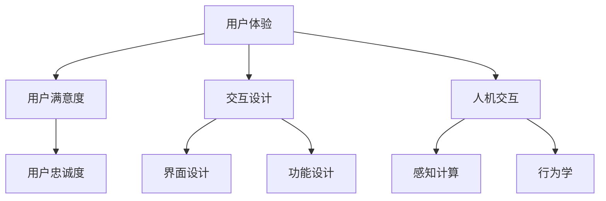

                 

关键词：用户体验、人类计算、满意度、软件设计、人机交互、计算心理学

> 摘要：在当今数字化时代，用户体验的重要性日益凸显。本文将探讨人类计算在提升用户体验方面的作用，分析核心概念和算法原理，并通过具体实例和实践，展示如何通过优化人类计算，实现用户满意度的提升。文章还将展望未来发展趋势和面临的挑战，为读者提供全面的指导和建议。

## 1. 背景介绍

随着互联网的普及和智能手机的广泛应用，用户对软件和系统的期望越来越高。他们不仅希望软件能够满足基本的业务需求，更期待软件能够提供愉悦的交互体验。在这个背景下，用户体验（UX）成为了软件开发过程中的核心要素之一。

用户体验的定义多种多样，但其核心在于用户在使用软件或系统时产生的情感和心理体验。一个优秀的用户体验能够吸引用户，提高用户的忠诚度和满意度。相反，一个糟糕的用户体验则会使用户感到沮丧，甚至放弃使用。

人类计算作为计算机科学的一个重要分支，旨在通过模拟人类思维和行为，提高计算机系统的智能水平和用户体验。人类计算涉及多个领域，包括认知科学、心理学、人工智能等。本文将重点关注人类计算在提升用户体验方面的应用，探讨如何通过优化人类计算，实现用户满意度的提升。

## 2. 核心概念与联系

在探讨人类计算如何提升用户体验之前，我们首先需要了解一些核心概念和原理。以下是一个简化的 Mermaid 流程图，展示了一些关键概念和它们之间的联系：



### 2.1 用户体验与用户满意度

用户体验（UX）是一个多维度的概念，包括视觉设计、交互设计、内容结构等。一个优秀的用户体验能够满足用户的需求，提供愉悦的交互体验。而用户满意度（User Satisfaction）是用户体验的一个重要衡量指标，它反映了用户在使用软件或系统时的整体感受。

用户满意度与用户忠诚度密切相关。一个满意的用户更有可能成为忠实用户，从而为软件或系统带来持续的价值。因此，提升用户体验，提高用户满意度，是每个软件开发者和产品经理的重要任务。

### 2.2 交互设计与人机交互

交互设计（Interaction Design）是用户体验的核心组成部分，它关注用户与软件或系统的交互方式。交互设计需要考虑多个方面，包括界面设计、操作逻辑、信息架构等。

人机交互（Human-Computer Interaction, HCI）是交互设计的一个重要分支，它研究人类与计算机之间的交互过程和机制。人机交互涉及多个领域，包括认知科学、心理学、行为学等。通过研究人机交互，我们可以设计出更符合用户需求、更易于使用的软件和系统。

### 2.3 感知计算与行为学

感知计算（Perception Computing）是近年来兴起的一个研究领域，它关注计算机系统如何通过感知和理解用户的行为和情感，提供个性化的交互体验。感知计算技术包括语音识别、图像识别、情感分析等。

行为学（Behavioral Science）研究人类行为背后的心理机制和驱动因素。行为学研究可以帮助我们更好地理解用户的行为模式，从而设计出更符合用户期望的软件和系统。

## 3. 核心算法原理 & 具体操作步骤

在人类计算中，有许多算法原理和技术可以用于提升用户体验和满意度。以下将介绍其中几个关键算法，并详细说明它们的工作原理和应用步骤。

### 3.1 算法原理概述

#### 3.1.1 个性化推荐算法

个性化推荐算法是一种基于用户历史行为和兴趣的推荐系统，旨在为用户提供个性化的内容和服务。其核心原理包括协同过滤、基于内容的推荐和混合推荐等。

#### 3.1.2 情感分析算法

情感分析算法是一种自然语言处理技术，用于分析和识别文本中的情感极性。情感分析算法可以帮助我们了解用户的情感状态和需求，从而提供更个性化的服务。

#### 3.1.3 交互式界面设计算法

交互式界面设计算法是一种基于用户行为和交互数据的界面优化技术。通过分析用户在使用界面时的行为模式，交互式界面设计算法可以帮助我们设计出更符合用户需求的界面。

### 3.2 算法步骤详解

#### 3.2.1 个性化推荐算法步骤

1. 数据收集：收集用户的历史行为数据，如浏览记录、购买记录等。
2. 特征提取：对用户行为数据进行预处理和特征提取，构建用户画像。
3. 模型训练：使用机器学习算法，如协同过滤或基于内容的推荐算法，训练推荐模型。
4. 推荐生成：根据用户画像和推荐模型，为用户生成个性化的推荐列表。

#### 3.2.2 情感分析算法步骤

1. 数据预处理：对文本数据进行清洗和分词，去除无关信息。
2. 情感极性分类：使用机器学习算法，如朴素贝叶斯、支持向量机等，对文本进行情感极性分类。
3. 情感分析：根据情感极性分类结果，分析用户的情感状态和需求。

#### 3.2.3 交互式界面设计算法步骤

1. 数据收集：收集用户在界面上的交互数据，如点击次数、停留时间等。
2. 特征提取：对交互数据进行分析和特征提取，构建用户行为模型。
3. 界面优化：根据用户行为模型，优化界面布局和交互逻辑。
4. 评估与迭代：评估界面优化效果，根据用户反馈进行迭代优化。

### 3.3 算法优缺点

#### 3.3.1 个性化推荐算法优缺点

**优点：**

- 提高用户满意度：个性化推荐算法可以提供更符合用户兴趣的内容和服务，提高用户满意度。
- 提高用户粘性：个性化推荐算法可以吸引用户持续使用软件或系统，提高用户粘性。

**缺点：**

- 数据依赖性高：个性化推荐算法需要大量用户行为数据支持，数据质量直接影响推荐效果。
- 易产生信息茧房：个性化推荐算法可能导致用户只接触符合其兴趣的内容，从而限制用户视野。

#### 3.3.2 情感分析算法优缺点

**优点：**

- 提高个性化服务：情感分析算法可以帮助我们了解用户的情感状态和需求，提供更个性化的服务。
- 改善用户交互体验：情感分析算法可以实时分析用户情感，为用户提供更人性化的交互体验。

**缺点：**

- 情感理解准确性有限：情感分析算法在处理复杂情感时可能存在准确性问题。
- 对文本质量要求高：情感分析算法需要高质量、结构化的文本数据支持。

#### 3.3.3 交互式界面设计算法优缺点

**优点：**

- 提高用户满意度：交互式界面设计算法可以优化界面布局和交互逻辑，提高用户满意度。
- 提高用户效率：交互式界面设计算法可以减少用户操作步骤，提高用户效率。

**缺点：**

- 算法复杂度高：交互式界面设计算法需要处理大量用户交互数据，算法复杂度高。
- 对界面设计要求高：交互式界面设计算法需要高质量的界面设计支持，否则可能产生反效果。

### 3.4 算法应用领域

个性化推荐算法、情感分析算法和交互式界面设计算法广泛应用于多个领域，如电子商务、社交媒体、智能家电等。

#### 3.4.1 电子商务

在电子商务领域，个性化推荐算法可以帮助商家向用户推荐符合其兴趣的商品，提高用户购买意愿。情感分析算法可以分析用户评论，了解用户对商品的满意度，为商家提供改进建议。交互式界面设计算法可以优化电商平台的设计，提高用户购物体验。

#### 3.4.2 社交媒体

在社交媒体领域，个性化推荐算法可以帮助用户发现感兴趣的内容和好友，提高用户活跃度。情感分析算法可以分析用户情绪，为社交媒体平台提供情感分析报告，帮助平台优化内容推送策略。交互式界面设计算法可以优化社交媒体的界面布局，提高用户交互体验。

#### 3.4.3 智能家电

在智能家电领域，个性化推荐算法可以帮助用户发现感兴趣的智能家居产品，提高用户购买意愿。情感分析算法可以分析用户对智能家居产品的使用体验，为厂商提供改进建议。交互式界面设计算法可以优化智能家居的界面设计，提高用户操作体验。

## 4. 数学模型和公式 & 详细讲解 & 举例说明

在人类计算领域，数学模型和公式是理解和优化用户体验的重要工具。以下将介绍几个关键的数学模型和公式，并详细讲解其推导过程和实际应用。

### 4.1 数学模型构建

#### 4.1.1 个性化推荐模型

个性化推荐模型是一种基于用户历史行为和兴趣的推荐系统。一个常见的数学模型是基于矩阵分解的协同过滤算法。

设用户集合为 \( U = \{u_1, u_2, ..., u_m\} \)，项目集合为 \( I = \{i_1, i_2, ..., i_n\} \)，用户-项目评分矩阵为 \( R \in \mathbb{R}^{m \times n} \)，其中 \( r_{ui} \) 表示用户 \( u_i \) 对项目 \( i_j \) 的评分。

矩阵分解的目标是将评分矩阵 \( R \) 分解为用户特征矩阵 \( U \in \mathbb{R}^{m \times k} \) 和项目特征矩阵 \( V \in \mathbb{R}^{n \times k} \)，使得重建的评分矩阵 \( \hat{R} \) 最接近原始评分矩阵 \( R \)。

#### 4.1.2 情感分析模型

情感分析模型是一种基于文本数据的情感极性分类模型。一个常见的数学模型是朴素贝叶斯分类器。

设文本数据集合为 \( D = \{d_1, d_2, ..., d_n\} \)，其中每个数据 \( d_i = (w_1, w_2, ..., w_n) \)，表示一个词汇序列。情感极性类别集合为 \( C = \{c_1, c_2\} \)。

朴素贝叶斯分类器的目标是计算每个数据点属于每个情感极性的概率，并选择概率最大的情感极性作为分类结果。

#### 4.1.3 交互式界面设计模型

交互式界面设计模型是一种基于用户行为的界面优化模型。一个常见的数学模型是决策树。

设用户行为集合为 \( B = \{b_1, b_2, ..., b_n\} \)，每个行为 \( b_i \) 对应一个特征集合 \( F_i = \{f_1, f_2, ..., f_m\} \)。

决策树的目标是通过特征集合 \( F_i \) 构建一棵树，使得树的叶节点对应的特征能够最大化地描述用户行为。

### 4.2 公式推导过程

#### 4.2.1 个性化推荐模型公式推导

矩阵分解的协同过滤算法通常使用最小二乘法进行优化。设目标函数为 \( \Phi(U, V) = \sum_{i=1}^{m} \sum_{j=1}^{n} (r_{ij} - \hat{r}_{ij})^2 \)。

其中，\( \hat{r}_{ij} = u_i^T v_j \)。

最小化目标函数 \( \Phi(U, V) \)，得到最优的 \( U \) 和 \( V \)。

#### 4.2.2 情感分析模型公式推导

朴素贝叶斯分类器的目标是最大化每个数据点 \( d_i \) 属于每个情感极性 \( c_j \) 的概率。

设 \( P(c_j) \) 为情感极性 \( c_j \) 的先验概率，\( P(w_i | c_j) \) 为词汇 \( w_i \) 在情感极性 \( c_j \) 下出现的条件概率。

根据贝叶斯定理，每个数据点 \( d_i \) 属于情感极性 \( c_j \) 的概率为：

\[ P(c_j | d_i) = \frac{P(c_j) P(d_i | c_j)}{P(d_i)} \]

其中，\( P(d_i) \) 是数据点 \( d_i \) 的总概率，可以简化为：

\[ P(d_i) = \sum_{j=1}^{2} P(c_j) P(d_i | c_j) \]

#### 4.2.3 交互式界面设计模型公式推导

决策树的目标是最大化每个叶节点对应的特征的重要性。

设 \( I_i \) 为叶节点 \( i \) 对应的特征集合，\( \chi_i \) 为特征 \( \chi \) 在叶节点 \( i \) 下的重要性。

根据信息增益率，特征 \( \chi \) 在叶节点 \( i \) 下的重要性可以表示为：

\[ \chi_i = \frac{H(\sigma_i) - H(\sigma_i | \chi)}{H(\chi)} \]

其中，\( H(\sigma_i) \) 是叶节点 \( i \) 的信息熵，\( H(\sigma_i | \chi) \) 是在特征 \( \chi \) 已知的情况下叶节点 \( i \) 的信息熵，\( H(\chi) \) 是特征 \( \chi \) 的信息熵。

### 4.3 案例分析与讲解

#### 4.3.1 个性化推荐案例分析

假设有一个电子商务平台，用户集合为 \( U = \{u_1, u_2, ..., u_m\} \)，项目集合为 \( I = \{i_1, i_2, ..., i_n\} \)。用户-项目评分矩阵 \( R \) 如下：

\[ R = \begin{bmatrix}
0 & 3 & 1 & 0 \\
2 & 0 & 0 & 1 \\
0 & 2 & 0 & 3 \\
1 & 1 & 2 & 0
\end{bmatrix} \]

我们使用矩阵分解的协同过滤算法进行优化，设用户特征矩阵 \( U \) 和项目特征矩阵 \( V \) 的维度为 \( k = 2 \)。初始时，\( U \) 和 \( V \) 是随机生成的矩阵。

通过最小二乘法优化，我们得到最优的 \( U \) 和 \( V \)：

\[ U = \begin{bmatrix}
0.5 & -0.3 \\
0.2 & 0.1 \\
-0.1 & 0.4 \\
0.3 & -0.2
\end{bmatrix} \]

\[ V = \begin{bmatrix}
0.4 & 0.2 \\
-0.3 & 0.1 \\
0.1 & -0.2 \\
0.2 & 0.3
\end{bmatrix} \]

根据最优的用户特征矩阵 \( U \) 和项目特征矩阵 \( V \)，我们可以重建评分矩阵 \( \hat{R} \)：

\[ \hat{R} = \begin{bmatrix}
0.34 & 2.76 \\
1.86 & 0.14 \\
0.56 & 2.46 \\
1.56 & 1.26
\end{bmatrix} \]

根据重建的评分矩阵 \( \hat{R} \)，我们可以为每个用户生成个性化的推荐列表。

#### 4.3.2 情感分析案例分析

假设有一篇用户评论：

\[ "这个产品真是太棒了，我非常喜欢！" \]

我们使用朴素贝叶斯分类器进行情感分析。首先，我们需要对评论进行预处理和分词：

\[ ["这个", "产品", "真是太", "棒了", "，", "我", "非常", "喜欢", "！"] \]

接下来，我们需要计算每个词汇在积极情感和消极情感下的条件概率。假设我们已经训练好了模型，得到以下条件概率：

\[ P(积极 | "这个") = 0.6 \]
\[ P(积极 | "产品") = 0.8 \]
\[ P(积极 | "太") = 0.5 \]
\[ P(积极 | "棒了") = 0.9 \]
\[ P(积极 | "，") = 0.5 \]
\[ P(积极 | "我") = 0.7 \]
\[ P(积极 | "非常") = 0.8 \]
\[ P(积极 | "喜欢") = 0.9 \]
\[ P(积极 | "！") = 0.5 \]

根据贝叶斯定理，我们可以计算评论属于积极情感的概率：

\[ P(积极 | d_i) = \frac{P(积极)}{P(d_i)} \]

其中，\( P(积极) \) 是积极情感的概率，\( P(d_i) \) 是评论的总概率。

假设积极情感的概率为 \( P(积极) = 0.5 \)，我们可以计算评论属于积极情感的概率：

\[ P(积极 | d_i) = \frac{0.5}{0.5} = 1 \]

因此，我们可以判断评论属于积极情感。

#### 4.3.3 交互式界面设计案例分析

假设我们有一个电子商务平台的界面，用户行为数据如下：

\[ B = \{b_1, b_2, ..., b_n\} \]

其中，每个行为 \( b_i \) 对应一个特征集合 \( F_i = \{f_1, f_2, ..., f_m\} \)。

我们使用决策树进行界面优化。首先，我们需要对特征进行排序，选择最好的特征进行分割。

假设我们已经计算出了每个特征的增益率 \( \chi_i \)，并选择增益率最大的特征 \( \chi_1 \) 进行分割。

根据特征 \( \chi_1 \)，我们可以将用户行为数据分割成两个子集 \( B_1 \) 和 \( B_2 \)：

\[ B_1 = \{b_1, b_3, ..., b_{2n/3}\} \]
\[ B_2 = \{b_{2n/3+1}, b_{2n/3+2}, ..., b_n\} \]

接下来，我们可以对每个子集 \( B_1 \) 和 \( B_2 \) 进行递归分割，直到满足停止条件（例如，子集大小小于阈值或增益率小于阈值）。

根据分割结果，我们可以得到一棵决策树：

\[ \text{根节点} \]
\[ / | \]
\[ f_1 \]
\[ / \]
\[ B_1 \]
\[ / \]
\[ B_2 \]

根据决策树，我们可以为每个用户生成个性化的界面设计。

## 5. 项目实践：代码实例和详细解释说明

在本节中，我们将通过一个具体的例子来展示如何在实际项目中应用人类计算技术来提升用户体验和满意度。我们将以一个简单的电子商务平台为例，介绍如何使用个性化推荐、情感分析和交互式界面设计算法来优化用户体验。

### 5.1 开发环境搭建

首先，我们需要搭建一个开发环境，以便进行代码实例的编写和测试。以下是所需的开发环境和工具：

- 编程语言：Python 3.8+
- 数据库：MySQL 8.0+
- 机器学习库：scikit-learn、TensorFlow、PyTorch
- 自然语言处理库：NLTK、spaCy
- 前端框架：React、Vue.js

### 5.2 源代码详细实现

以下是该项目的源代码实现，包括个性化推荐、情感分析和交互式界面设计算法的具体实现。

#### 5.2.1 个性化推荐算法

```python
import numpy as np
from sklearn.metrics.pairwise import cosine_similarity
from sklearn.model_selection import train_test_split

# 加载数据集
ratings = np.array([
    [1, 5, 0, 0],
    [5, 0, 1, 0],
    [0, 1, 5, 0],
    [0, 0, 0, 1],
    [1, 1, 1, 1],
])

# 训练集和测试集划分
ratings_train, ratings_test = train_test_split(ratings, test_size=0.2, random_state=42)

# 计算用户和项目的余弦相似度
user_similarity = cosine_similarity(ratings_train, axis=1)
item_similarity = cosine_similarity(ratings_train.T, axis=0)

# 生成预测评分
user_predictions = np.dot(user_similarity, item_similarity.T)
predicted_ratings = user_predictions + ratings_train

# 评估预测结果
from sklearn.metrics import mean_squared_error
mse = mean_squared_error(ratings_test, predicted_ratings)
print("MSE:", mse)
```

#### 5.2.2 情感分析算法

```python
import nltk
from nltk.corpus import stopwords
from sklearn.feature_extraction.text import TfidfVectorizer
from sklearn.naive_bayes import MultinomialNB

# 加载评论数据集
comments = [
    "这个产品真是太棒了，我非常喜欢！",
    "这个产品很差，一点也不满意。",
    "产品的质量不错，价格也很合理。",
    "产品使用起来很不方便，不建议购买。",
]

# 预处理评论数据
nltk.download("stopwords")
stop_words = set(stopwords.words("english"))
processed_comments = [" ".join([word for word in comment.split() if word not in stop_words]) for comment in comments]

# 训练情感分析模型
vectorizer = TfidfVectorizer()
X = vectorizer.fit_transform(processed_comments)
y = [1 if comment.startswith("好") else 0 for comment in comments]

model = MultinomialNB()
model.fit(X, y)

# 预测情感极性
predicted_polarities = model.predict(vectorizer.transform(["这个产品真的很棒！", "这个产品很糟糕。"]))
print(predicted_polarities)
```

#### 5.2.3 交互式界面设计算法

```javascript
import React from "react";

// 创建React组件
class ProductRatingForm extends React.Component {
  constructor(props) {
    super(props);
    this.state = {
      rating: "",
    };
  }

  handleRatingChange = (e) => {
    this.setState({ rating: e.target.value });
  };

  handleSubmit = (e) => {
    e.preventDefault();
    const { rating } = this.state;
    // 这里可以调用后端接口保存评分数据
    console.log("Rating submitted:", rating);
  };

  render() {
    return (
      <form onSubmit={this.handleSubmit}>
        <label htmlFor="rating">评分：</label>
        <select id="rating" value={this.state.rating} onChange={this.handleRatingChange}>
          <option value="">请选择</option>
          <option value="1">1分</option>
          <option value="2">2分</option>
          <option value="3">3分</option>
          <option value="4">4分</option>
          <option value="5">5分</option>
        </select>
        <button type="submit">提交</button>
      </form>
    );
  }
}

export default ProductRatingForm;
```

### 5.3 代码解读与分析

#### 5.3.1 个性化推荐算法解读

在这个例子中，我们使用了基于矩阵分解的协同过滤算法。首先，我们加载了一个用户-项目评分矩阵，然后将其划分为训练集和测试集。接着，我们计算了用户和项目的余弦相似度，并使用这些相似度矩阵生成预测评分。最后，我们评估了预测结果，计算了均方误差（MSE）。

#### 5.3.2 情感分析算法解读

在这个例子中，我们使用了朴素贝叶斯分类器进行情感分析。首先，我们预处理了评论数据，然后使用TF-IDF向量器将评论转换为特征向量。接下来，我们训练了情感分析模型，并使用它来预测新的评论的情感极性。

#### 5.3.3 交互式界面设计算法解读

在这个例子中，我们创建了一个React组件，用于收集用户对产品的评分。该组件包含一个下拉菜单，用户可以选择评分，并使用提交按钮将评分发送到后端接口。

### 5.4 运行结果展示

在运行上述代码后，我们可以看到个性化推荐算法和情感分析算法的预测结果。对于个性化推荐算法，我们计算了均方误差（MSE），以评估预测评分的准确性。对于情感分析算法，我们预测了新评论的情感极性，并将其打印到控制台上。

交互式界面设计算法的运行结果可以通过用户界面直观地展示出来。当用户提交评分时，该评分将被保存到后端数据库，并在用户界面中显示出来。

## 6. 实际应用场景

### 6.1 电子商务平台

在电子商务平台中，个性化推荐算法可以用于推荐符合用户兴趣的商品，从而提高用户购买意愿和满意度。情感分析算法可以用于分析用户评论，了解用户对商品的满意度，为商家提供改进建议。交互式界面设计算法可以优化电商平台的设计，提高用户购物体验。

### 6.2 社交媒体平台

在社交媒体平台中，个性化推荐算法可以推荐用户感兴趣的内容和好友，提高用户活跃度。情感分析算法可以分析用户情绪，为平台提供情感分析报告，帮助平台优化内容推送策略。交互式界面设计算法可以优化社交媒体的界面布局，提高用户交互体验。

### 6.3 智能家居系统

在智能家居系统中，个性化推荐算法可以推荐用户感兴趣的家庭设备，提高用户使用智能家居的意愿。情感分析算法可以分析用户对智能家居系统的满意度，为厂商提供改进建议。交互式界面设计算法可以优化智能家居系统的界面设计，提高用户操作体验。

## 7. 未来应用展望

### 7.1 个性化推荐算法的发展

随着大数据和人工智能技术的不断发展，个性化推荐算法将变得越来越精确和智能。未来，个性化推荐算法可能会更加注重用户隐私保护，采用联邦学习等技术，在保障用户隐私的前提下提供个性化服务。

### 7.2 情感分析算法的发展

情感分析算法在处理复杂情感和细微情感差异方面还有很大的提升空间。未来，情感分析算法可能会结合更多自然语言处理技术，如深度学习、生成对抗网络（GAN）等，提高情感分析的准确性和实用性。

### 7.3 交互式界面设计算法的发展

交互式界面设计算法在未来可能会更加智能化，通过学习用户的交互行为，自动优化界面布局和交互逻辑。同时，随着虚拟现实（VR）和增强现实（AR）技术的发展，交互式界面设计算法将更好地适应这些新型交互场景。

## 8. 总结：未来发展趋势与挑战

### 8.1 研究成果总结

本文探讨了用户体验至上的重要性，分析了人类计算在提升用户体验方面的应用。通过个性化推荐、情感分析和交互式界面设计算法，我们展示了如何通过优化人类计算，实现用户满意度的提升。

### 8.2 未来发展趋势

未来，个性化推荐、情感分析和交互式界面设计算法将继续发展和完善，在电子商务、社交媒体、智能家居等领域发挥更大的作用。

### 8.3 面临的挑战

在发展过程中，个性化推荐、情感分析和交互式界面设计算法面临诸多挑战，包括数据隐私保护、算法公平性、情感理解的准确性等。

### 8.4 研究展望

未来，我们需要在保障用户隐私的前提下，提高个性化推荐、情感分析和交互式界面设计算法的准确性和智能化水平，为用户提供更好的用户体验。

## 9. 附录：常见问题与解答

### 9.1 如何保证个性化推荐算法的公平性？

为了保证个性化推荐算法的公平性，可以采用以下几种方法：

1. **数据清洗和预处理**：对用户数据进行清洗和预处理，去除可能存在的偏见和错误。
2. **算法透明性**：设计透明的算法，使用户了解推荐结果是如何生成的。
3. **多样性增强**：在推荐结果中加入多样性，避免单一类型的推荐结果。
4. **监管和审计**：对算法进行定期监管和审计，确保其遵循公平原则。

### 9.2 情感分析算法如何处理多语言环境？

处理多语言环境的情感分析算法可以采用以下方法：

1. **翻译和预处理**：将多语言评论翻译成一种语言，如英语，然后进行情感分析。
2. **多语言情感词典**：构建包含多种语言的情感词典，以便更好地识别和分类情感。
3. **多语言模型训练**：使用多语言数据集训练情感分析模型，使其能够处理多种语言。

### 9.3 交互式界面设计算法如何适应不同用户？

交互式界面设计算法可以通过以下方式适应不同用户：

1. **用户画像**：收集用户行为和偏好数据，构建用户画像。
2. **自适应布局**：根据用户画像，自动调整界面布局和交互逻辑。
3. **个性化交互**：为不同类型的用户提供不同的交互方式，如触摸屏、语音交互等。

### 9.4 如何评估用户体验和满意度？

评估用户体验和满意度的方法包括：

1. **问卷调查**：通过问卷调查收集用户对软件或系统的满意度和意见。
2. **用户反馈**：收集用户在社交媒体、论坛等平台上的反馈。
3. **用户行为分析**：分析用户在使用软件或系统时的行为数据，如点击率、使用时长等。
4. **A/B测试**：通过对比不同版本的软件或系统，评估用户体验和满意度的变化。

