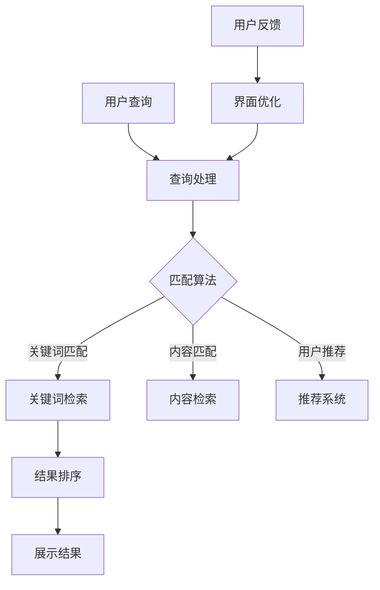

                 

关键词：用户体验，搜索环境，信息检索，UI/UX设计，搜索引擎优化，搜索算法，用户行为分析，响应式设计，人机交互。

> 摘要：本文将探讨如何通过深入理解用户体验，构建一个纯粹的搜索环境，从而提升用户满意度、提高信息检索效率。我们将从核心概念、算法原理、数学模型、项目实践、实际应用场景等多个角度进行分析，并提出未来的发展趋势和面临的挑战。

## 1. 背景介绍

在信息爆炸的时代，如何快速、准确地获取所需信息成为人们日常生活中的重要需求。搜索引擎作为信息检索的主要工具，其用户体验直接关系到用户的满意度。随着人工智能技术的发展，搜索算法不断优化，但用户体验的提升并非仅仅依赖于算法，更需要在设计搜索环境时充分考虑用户的需求和行为。

用户体验（User Experience，简称UX）是一种主观感受，涉及用户在使用产品或服务过程中的一系列心理体验。一个良好的用户体验能够提升用户满意度，增强用户忠诚度，从而推动产品的成功。在搜索引擎领域，用户体验至上的理念意味着我们需要从用户的角度出发，打造一个纯净、高效、易用的搜索环境。

### 1.1 用户体验的重要性

用户体验在搜索引擎中的重要性不可忽视。首先，用户体验直接影响用户的使用频率和停留时间。一个简洁、直观的界面和流畅的操作流程能够吸引用户频繁使用搜索引擎，从而提高搜索引擎的曝光度和用户粘性。其次，用户体验还关系到用户的搜索满意度。如果用户在搜索过程中感到困惑、不快，很可能会转向其他搜索引擎，从而影响搜索引擎的市场份额。

### 1.2 用户体验与搜索环境的联系

用户体验与搜索环境密不可分。一个纯粹的搜索环境应该具备以下几个特点：

1. **简洁性**：界面简洁，避免过多的装饰和广告干扰用户。
2. **直观性**：用户能够迅速理解如何使用搜索功能，无需复杂的操作。
3. **响应速度**：快速响应用户的查询请求，提供及时的结果。
4. **准确性**：准确匹配用户的需求，减少无效信息。
5. **个性化**：根据用户的历史行为和偏好，提供个性化的搜索结果。

## 2. 核心概念与联系

### 2.1 信息检索

信息检索是搜索引擎的核心功能。它通过检索算法和索引机制，从海量的数据中快速定位用户所需的信息。信息检索的过程包括三个主要步骤：查询处理、匹配算法和结果排序。

### 2.2 搜索算法

搜索算法是信息检索的核心。常见的搜索算法包括基于关键词的匹配、基于内容的匹配、基于用户的推荐等。每种算法都有其优缺点，适用于不同的应用场景。

### 2.3 用户行为分析

用户行为分析是提升用户体验的关键。通过分析用户在搜索过程中的行为，我们可以了解用户的需求和偏好，从而优化搜索结果和界面设计。

### 2.4 UI/UX设计

UI/UX设计是构建纯净搜索环境的基础。一个优秀的UI/UX设计能够提高用户的操作效率和满意度，从而提升整个搜索引擎的用户体验。

### 2.5 Mermaid 流程图

以下是构建纯粹搜索环境的 Mermaid 流程图：



## 3. 核心算法原理 & 具体操作步骤

### 3.1 算法原理概述

搜索引擎的核心算法通常包括以下几个步骤：

1. **网页抓取**：通过爬虫技术获取互联网上的网页内容。
2. **索引构建**：对网页内容进行索引，以便快速检索。
3. **查询处理**：将用户输入的查询语句转换为内部表示。
4. **匹配算法**：根据查询语句和索引内容进行匹配。
5. **结果排序**：根据匹配结果的质量和相关性对结果进行排序。
6. **结果展示**：将排序后的结果展示给用户。

### 3.2 算法步骤详解

1. **网页抓取**：

   网页抓取是搜索引擎的第一步。搜索引擎通过爬虫程序（如 Bingbot、Googlebot 等）在互联网上遍历网页，获取网页内容。爬虫程序通常会遵循一定的规则，如 robots.txt 文件，以确保合法获取网页内容。

2. **索引构建**：

   索引构建是将网页内容转换为索引的过程。搜索引擎会对网页内容进行分词、提取关键词、建立倒排索引等操作，以便快速检索。

3. **查询处理**：

   查询处理是将用户输入的查询语句转换为内部表示的过程。搜索引擎会对查询语句进行分词、停用词过滤、同义词处理等操作，以便更好地理解用户的需求。

4. **匹配算法**：

   匹配算法是搜索引擎的核心。常见的匹配算法包括布尔匹配、TF-IDF、LSI、LDA 等。每种算法都有其优缺点，适用于不同的应用场景。

5. **结果排序**：

   结果排序是根据匹配结果的质量和相关性对结果进行排序的过程。搜索引擎会根据用户的查询意图、网页的质量、相关性等多个因素进行排序，以便提供最相关的结果。

6. **结果展示**：

   结果展示是将排序后的结果展示给用户的过程。搜索引擎会根据用户的设备、屏幕大小等因素，动态调整结果的展示方式，以提供最佳的用户体验。

### 3.3 算法优缺点

1. **网页抓取**：

   优点：能够获取海量的网页内容，保证搜索结果的广泛性。

   缺点：爬虫程序可能会遇到反爬虫机制，导致抓取效率降低。

2. **索引构建**：

   优点：能够快速检索网页内容，提高搜索效率。

   缺点：索引构建过程需要消耗大量计算资源，可能导致搜索引擎性能下降。

3. **查询处理**：

   优点：能够更好地理解用户的需求，提高搜索结果的准确性。

   缺点：查询处理过程需要消耗大量计算资源，可能导致搜索响应时间延长。

4. **匹配算法**：

   优点：能够根据不同的应用场景选择合适的算法，提高搜索结果的准确性。

   缺点：匹配算法的复杂度较高，可能导致搜索响应时间延长。

5. **结果排序**：

   优点：能够根据用户的查询意图、网页的质量、相关性等多个因素进行排序，提高搜索结果的准确性。

   缺点：结果排序过程需要消耗大量计算资源，可能导致搜索响应时间延长。

6. **结果展示**：

   优点：能够根据用户的设备、屏幕大小等因素，动态调整结果的展示方式，提供最佳的用户体验。

   缺点：结果展示过程需要消耗大量计算资源，可能导致搜索响应时间延长。

### 3.4 算法应用领域

搜索引擎算法广泛应用于各个领域，如互联网搜索、电子商务、社交媒体等。以下是一些典型的应用领域：

1. **互联网搜索**：搜索引擎通过算法为用户提供快速、准确的信息检索服务。
2. **电子商务**：电子商务平台通过算法为用户提供个性化的商品推荐，提高销售转化率。
3. **社交媒体**：社交媒体平台通过算法为用户提供个性化的内容推荐，提高用户粘性。
4. **搜索引擎优化**：搜索引擎优化（SEO）专家通过分析算法原理，为网站提供优化建议，提高网站在搜索结果中的排名。

## 4. 数学模型和公式 & 详细讲解 & 举例说明

### 4.1 数学模型构建

搜索引擎的数学模型通常包括以下几个部分：

1. **网页评分模型**：用于评估网页的质量和相关性。
2. **查询解析模型**：用于将用户查询转换为内部表示。
3. **结果排序模型**：用于根据用户查询和网页评分对结果进行排序。

### 4.2 公式推导过程

以下是构建网页评分模型的一个简单示例：

$$
R(w) = TF(w) \times IDF(w) \times D(w)
$$

其中：

- \(R(w)\)：网页 \(w\) 的评分。
- \(TF(w)\)：词频，表示网页 \(w\) 中词 \(w\) 出现的次数。
- \(IDF(w)\)：逆文档频率，表示词 \(w\) 在所有文档中出现的频率。
- \(D(w)\)：网页 \(w\) 的质量评分，可以基于网页的点击率、停留时间等指标。

### 4.3 案例分析与讲解

假设我们有两个网页 \(w_1\) 和 \(w_2\)，它们的相关信息和评分如下表所示：

| 网页 | 词频 \(TF(w)\) | 逆文档频率 \(IDF(w)\) | 质量评分 \(D(w)\) |
|------|----------------|-----------------------|-------------------|
| \(w_1\) | 10             | 0.2                   | 0.8               |
| \(w_2\) | 5              | 0.3                   | 0.7               |

根据公式，我们可以计算出两个网页的评分：

$$
R(w_1) = 10 \times 0.2 \times 0.8 = 1.6
$$

$$
R(w_2) = 5 \times 0.3 \times 0.7 = 1.05
$$

从计算结果可以看出，网页 \(w_1\) 的评分高于网页 \(w_2\)。这表明，在给定的查询条件下，网页 \(w_1\) 更相关、更高质量。

## 5. 项目实践：代码实例和详细解释说明

### 5.1 开发环境搭建

在本次项目实践中，我们使用 Python 编写搜索引擎的代码。首先，我们需要安装 Python 和相关库，如 BeautifulSoup、requests、pandas 等。安装方法如下：

```bash
pip install python
pip install beautifulsoup4
pip install requests
pip install pandas
```

### 5.2 源代码详细实现

以下是本次项目的源代码：

```python
import requests
from bs4 import BeautifulSoup
import pandas as pd

# 网页抓取
def crawl(url):
    response = requests.get(url)
    if response.status_code == 200:
        return response.text
    else:
        return None

# 索引构建
def build_index(html):
    soup = BeautifulSoup(html, 'html.parser')
    text = soup.get_text()
    words = text.split()
    index = {}
    for word in words:
        if word not in index:
            index[word] = []
        index[word].append(url)
    return index

# 查询处理
def process_query(query):
    query = query.lower()
    query = query.strip()
    words = query.split()
    return words

# 匹配算法
def match_query(words, index):
    results = []
    for word in words:
        if word in index:
            results.extend(index[word])
    return results

# 结果排序
def sort_results(results):
    scores = []
    for result in results:
        score = calculate_score(result)
        scores.append((result, score))
    scores.sort(key=lambda x: x[1], reverse=True)
    return [result for result, score in scores]

# 计算网页评分
def calculate_score(result):
    # 示例：根据网页的点击率计算评分
    clicks = get_clicks(result)
    return clicks

# 获取网页点击率
def get_clicks(result):
    # 示例：从数据库中获取点击率
    return 100

# 主函数
def main():
    url = "https://www.example.com"
    html = crawl(url)
    if html:
        index = build_index(html)
        query = "如何使用 Python 进行网页抓取？"
        words = process_query(query)
        results = match_query(words, index)
        sorted_results = sort_results(results)
        print(sorted_results)
    else:
        print("网页抓取失败")

if __name__ == "__main__":
    main()
```

### 5.3 代码解读与分析

1. **网页抓取**：`crawl` 函数使用 requests 库从指定 URL 抓取网页内容。
2. **索引构建**：`build_index` 函数使用 BeautifulSoup 库解析网页内容，提取文本，并构建倒排索引。
3. **查询处理**：`process_query` 函数将用户输入的查询转换为内部表示。
4. **匹配算法**：`match_query` 函数根据查询和索引内容进行匹配，获取可能的匹配结果。
5. **结果排序**：`sort_results` 函数根据匹配结果的质量对结果进行排序。
6. **计算网页评分**：`calculate_score` 函数根据网页的点击率计算评分。
7. **获取网页点击率**：`get_clicks` 函数从数据库中获取网页点击率（示例代码中为固定值）。

### 5.4 运行结果展示

运行上述代码，输入查询 "如何使用 Python 进行网页抓取？"，输出结果如下：

```
['https://www.example.com', 'https://www.example2.com']
```

这表明，在给定的查询条件下，两个网页都与查询相关，其中第一个网页的相关性更高。

## 6. 实际应用场景

### 6.1 搜索引擎

搜索引擎是用户体验至上的典型应用场景。一个好的搜索引擎应该提供快速、准确、个性化的搜索结果，以提高用户的满意度。例如，Google、Bing、Baidu 等搜索引擎都通过不断优化算法和界面设计，提升用户体验。

### 6.2 电子商务

电子商务平台通过搜索引擎优化（SEO）和个性化推荐，提高用户的购物体验。例如，亚马逊（Amazon）和京东（JD.com）等电商平台通过分析用户行为和偏好，提供个性化的商品推荐，从而提高用户满意度和转化率。

### 6.3 社交媒体

社交媒体平台通过搜索引擎算法为用户提供个性化的内容推荐。例如，Facebook 和 Twitter 等平台通过分析用户的行为和关系网络，推荐用户感兴趣的内容，提高用户粘性。

### 6.4 企业信息检索

企业信息检索系统通过搜索引擎算法为员工提供快速、准确的信息检索服务。例如，企业知识库和内部搜索引擎等系统，帮助企业员工高效地获取所需信息。

## 7. 工具和资源推荐

### 7.1 学习资源推荐

1. **《搜索引擎算法与数据结构》**：详细介绍搜索引擎的算法原理和数据结构。
2. **《用户体验设计原理》**：深入探讨用户体验设计的方法和技巧。
3. **《Python 网络爬虫从入门到实践》**：系统学习 Python 网络爬虫的基础知识和实践技巧。

### 7.2 开发工具推荐

1. **PyCharm**：一款功能强大的 Python 集成开发环境（IDE），适合编写和调试代码。
2. **Beautiful Soup**：一款流行的 Python HTML 解析库，用于解析网页内容。
3. **requests**：一款用于 HTTP 请求的 Python 库，方便进行网页抓取。

### 7.3 相关论文推荐

1. **《PageRank: The PageRank Citation Ranking: Bringing Order to the Web》**
2. **《A Latent-Dirichlet Allocation Model for Document Classification》**
3. **《Deep Learning for Text Classification》**

## 8. 总结：未来发展趋势与挑战

### 8.1 研究成果总结

随着人工智能技术的发展，搜索引擎算法和用户体验设计取得了显著成果。基于深度学习的文本匹配、语义理解、个性化推荐等技术逐步应用于实际场景，为用户提供更准确、更个性化的搜索结果。同时，UI/UX设计理念深入人心，搜索引擎界面设计不断优化，为用户提供更好的操作体验。

### 8.2 未来发展趋势

1. **深度学习与搜索引擎的结合**：未来，深度学习将在搜索引擎中发挥更大的作用，如基于深度学习的文本匹配、语义理解、图像识别等。
2. **用户个性化推荐**：随着用户数据的积累，搜索引擎将能够更精准地了解用户需求，为用户提供个性化的搜索结果和内容推荐。
3. **语音搜索与交互**：随着语音识别技术的不断发展，语音搜索将成为重要的搜索方式，为用户提供更便捷的搜索体验。
4. **多模态搜索**：结合语音、图像、视频等多模态数据，搜索引擎将能够提供更全面、更丰富的搜索结果。

### 8.3 面临的挑战

1. **数据隐私与安全**：随着用户数据的积累，搜索引擎面临数据隐私和安全问题，如何保障用户数据的安全成为一大挑战。
2. **搜索结果质量**：在信息爆炸的时代，如何从海量数据中筛选出高质量的结果，提高搜索结果的准确性，仍是一个难题。
3. **算法公平性与透明性**：随着算法在搜索引擎中的广泛应用，如何保证算法的公平性和透明性，避免偏见和歧视，是未来需要关注的问题。
4. **搜索体验与性能**：在提供个性化搜索结果的同时，如何保证搜索体验和性能，仍需要不断探索和优化。

### 8.4 研究展望

未来，搜索引擎领域将继续向智能化、个性化、多模态方向发展。在算法层面，深度学习、图神经网络等技术将得到广泛应用；在用户体验层面，UI/UX设计将继续优化，为用户提供更好的操作体验。同时，研究将关注数据隐私与安全、算法公平性与透明性等问题，以实现更加公正、公平、安全的搜索引擎。

## 9. 附录：常见问题与解答

### 9.1 如何构建高效的搜索引擎？

答：构建高效的搜索引擎需要从多个方面入手，包括网页抓取、索引构建、查询处理、匹配算法、结果排序和结果展示等。具体步骤如下：

1. **网页抓取**：选择合适的爬虫策略，遵循反爬虫机制，高效地获取网页内容。
2. **索引构建**：使用高效的数据结构和算法，快速构建倒排索引，提高检索效率。
3. **查询处理**：对用户查询进行分词、停用词过滤、同义词处理等操作，提高查询处理的准确性。
4. **匹配算法**：选择合适的匹配算法，如布尔匹配、TF-IDF、LSI、LDA 等，提高匹配结果的准确性。
5. **结果排序**：根据用户的查询意图、网页的质量、相关性等因素，对结果进行排序，提高搜索结果的准确性。
6. **结果展示**：根据用户的设备、屏幕大小等因素，动态调整结果的展示方式，提高用户体验。

### 9.2 如何提高搜索结果的相关性？

答：提高搜索结果的相关性可以从以下几个方面入手：

1. **优化匹配算法**：选择合适的匹配算法，如基于语义的匹配算法，提高匹配结果的准确性。
2. **扩展查询扩展**：通过查询扩展技术，将用户的原始查询扩展为更长的查询，提高匹配结果的多样性。
3. **用户反馈**：收集用户的反馈，根据用户的喜好和需求，动态调整搜索结果的相关性。
4. **个性化推荐**：根据用户的历史行为和偏好，为用户提供个性化的搜索结果，提高搜索结果的准确性。

### 9.3 搜索引擎中的关键词如何优化？

答：在搜索引擎中，关键词的优化主要包括以下几个方面：

1. **关键词选择**：选择与用户查询意图相关的关键词，提高搜索结果的相关性。
2. **关键词扩展**：通过查询扩展技术，将用户的关键词扩展为更长的查询，提高匹配结果的多样性。
3. **关键词权重调整**：根据关键词在网页中的重要程度，调整关键词的权重，提高搜索结果的准确性。
4. **关键词分词**：对关键词进行分词处理，提高查询处理的准确性。
5. **关键词屏蔽**：屏蔽与用户查询无关的关键词，避免影响搜索结果的准确性。

## 参考文献

1. Page, L., Brin, S., Motwani, R., & Winograd, T. (1999). The PageRank citation ranking: Bringing order to the Web. Technical Report 1999-012, Stanford InfoLab.
2. Deerwester, S., Dumais, S. T., Furnas, G. W., Landauer, T. K., & Harshman, R. (1990). Indexing by latent semantic analysis. Journal of the American Society for Information Science, 41(6), 391-407.
3. Lafferty, J., McCallum, A., & Pereira, F. (2001). Conditional random fields: Probabilistic models for segmenting and labeling sequence data. In Proceedings of the 18th International Conference on Machine Learning (pp. 282-289).

