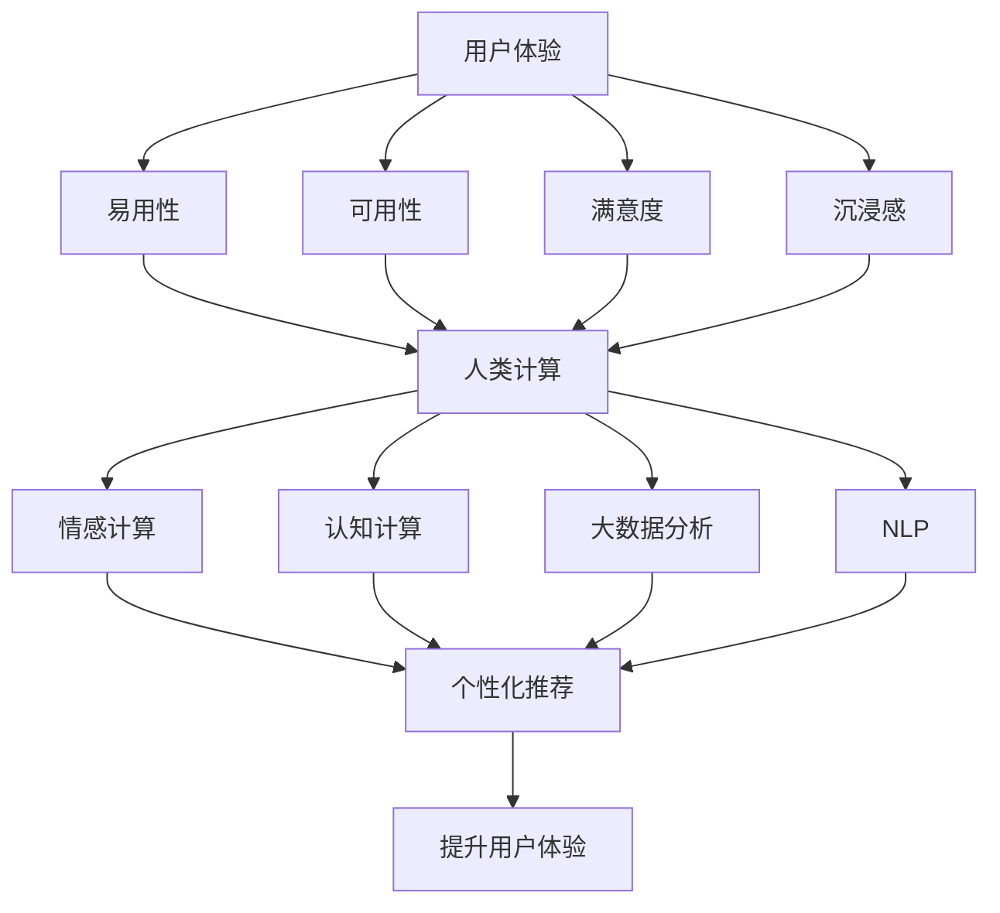

                 

## 1. 背景介绍

在当今数字化时代，用户体验（User Experience，简称UX）已经成为了企业成功的关键因素。随着市场竞争的日益激烈，越来越多的企业开始重视用户体验，并将其作为产品和服务设计中的重要组成部分。用户体验不仅仅是用户对产品的感受和反馈，它还涉及到产品的易用性、可访问性、可用性和满意度等方面。本文将深入探讨用户体验的各个方面，并阐述如何通过人类计算来提升客户满意度。

用户体验的重要性不言而喻。首先，良好的用户体验可以增加用户对产品的忠诚度，减少用户流失率。其次，满意的用户体验可以促进口碑传播，吸引更多新用户。此外，优秀的用户体验还可以提升产品的市场竞争力，帮助企业获得更多的市场份额。

然而，实现良好的用户体验并不容易。它需要企业从多个方面进行综合考虑，包括产品的设计、开发、测试、部署和维护等环节。在这个过程中，人类计算发挥着至关重要的作用。人类计算不仅仅是指人类参与的计算过程，还包括了人工智能、机器学习、大数据分析等现代计算技术在用户体验提升中的应用。

本文将围绕以下主题进行讨论：

1. 用户体验的定义和核心要素
2. 人类计算在用户体验提升中的应用
3. 用户体验评估方法和工具
4. 用户体验设计与开发实践
5. 用户体验管理的最佳实践
6. 用户体验的未来发展趋势

通过本文的阅读，读者将能够深入了解用户体验的重要性，掌握人类计算在提升用户体验方面的应用，以及如何通过用户体验管理来提升客户满意度。

## 2. 核心概念与联系

### 用户体验（User Experience，简称UX）

用户体验是指用户在使用产品或服务时所获得的主观感受和情感体验。它不仅仅关注产品的功能性，还包括用户在使用过程中的情感、认知和社交体验。用户体验的核心要素包括：

- **易用性（Usability）**：产品是否易于使用，用户能否轻松完成任务。
- **可用性（Accessibility）**：产品是否对所有人可访问，包括不同年龄、能力、背景的用户。
- **满意度（Satisfaction）**：用户对产品或服务的整体感受和评价。
- **沉浸感（Immersion）**：用户在使用产品时能否完全投入其中，体验到产品的魅力。

### 人类计算（Human-Centric Computing）

人类计算是指以人为中心，结合人工智能、机器学习和大数据分析等技术，提升用户体验的计算方式。它强调在计算过程中充分考虑人的因素，包括人的需求、情感、行为等。人类计算的核心要素包括：

- **情感计算（Affective Computing）**：通过感知、理解和处理人的情感，提升用户体验。
- **认知计算（Cognitive Computing）**：模拟人类思维过程，提供更智能、个性化的服务。
- **大数据分析（Big Data Analytics）**：利用大数据技术，深入分析用户行为和需求，为产品设计提供数据支持。
- **自然语言处理（Natural Language Processing，NLP）**：使计算机能够理解和处理人类语言，提升交互体验。

### 架构与流程图

为了更好地理解用户体验与人类计算之间的关系，我们可以通过以下Mermaid流程图来展示：



### Mermaid流程节点说明

- **A**：用户体验
- **B**：易用性
- **C**：可用性
- **D**：满意度
- **E**：沉浸感
- **F**：人类计算
- **G**：情感计算
- **H**：认知计算
- **I**：大数据分析
- **J**：自然语言处理
- **K**：个性化推荐
- **L**：提升用户体验

通过上述流程图，我们可以清晰地看到用户体验与人类计算之间的紧密联系。人类计算通过情感计算、认知计算、大数据分析和自然语言处理等技术，提升了用户体验的多个核心要素，从而最终实现了用户体验的整体提升。

## 3. 核心算法原理 & 具体操作步骤

### 3.1 算法原理概述

在用户体验的优化过程中，核心算法的设计和实现至关重要。这些算法不仅能够提升产品的功能性和易用性，还能通过智能化的方式满足用户的个性化需求。以下是一些在用户体验提升中常用的核心算法原理：

1. **情感计算算法**：通过分析用户的情感状态，提供个性化的交互体验。
2. **认知计算算法**：模拟人类的思维过程，提供智能化的决策支持。
3. **推荐系统算法**：基于用户的历史行为和偏好，提供个性化的内容推荐。
4. **自然语言处理算法**：使计算机能够理解和处理人类语言，提升交互体验。

### 3.2 算法步骤详解

#### 1. 情感计算算法

情感计算算法的核心是情感识别和情感生成。具体步骤如下：

1. **情感识别**：通过语音、文本、图像等多模态数据，识别用户的情感状态。常用的方法包括基于机器学习的情感分类模型、情感词典匹配等。
2. **情感生成**：根据识别出的情感状态，生成相应的交互响应。例如，当用户表现出焦虑情绪时，系统可以提供安慰性语言或引导用户进行放松活动。

#### 2. 认知计算算法

认知计算算法通过模拟人类的思维过程，提供智能化的决策支持。主要步骤包括：

1. **知识表示**：将用户的知识和经验转化为计算机可处理的形式，例如知识图谱、本体等。
2. **推理引擎**：基于用户输入的问题，利用知识库和推理规则，生成相应的答案或建议。
3. **人机交互**：将算法生成的答案或建议以自然语言的形式呈现给用户，并进行双向交互。

#### 3. 推荐系统算法

推荐系统算法的核心是利用用户的历史行为和偏好，预测其未来的兴趣和需求，提供个性化的内容推荐。主要步骤包括：

1. **用户建模**：通过收集用户的历史行为数据，建立用户画像。
2. **内容建模**：对推荐的内容进行特征提取和建模。
3. **推荐生成**：利用用户画像和内容特征，计算用户对各个内容的偏好度，并根据偏好度生成推荐列表。

#### 4. 自然语言处理算法

自然语言处理算法的核心是使计算机能够理解和处理人类语言，主要步骤包括：

1. **文本预处理**：对原始文本进行分词、去停用词、词性标注等处理。
2. **语义分析**：通过语法分析和语义分析，理解文本的含义和结构。
3. **交互生成**：根据用户输入的文本，生成相应的响应文本，实现自然语言交互。

### 3.3 算法优缺点

1. **情感计算算法**
   - 优点：能够提供个性化的情感化交互，提升用户体验。
   - 缺点：情感识别的准确性和实时性尚需提高。
2. **认知计算算法**
   - 优点：能够模拟人类思维过程，提供智能化的决策支持。
   - 缺点：知识库构建和维护成本较高。
3. **推荐系统算法**
   - 优点：能够根据用户兴趣和需求，提供个性化的内容推荐。
   - 缺点：可能存在数据偏差和隐私问题。
4. **自然语言处理算法**
   - 优点：能够实现自然语言交互，提升用户操作便捷性。
   - 缺点：语义理解和生成的准确性尚需提高。

### 3.4 算法应用领域

1. **情感计算算法**：应用于智能客服、虚拟助手、社交媒体分析等领域。
2. **认知计算算法**：应用于智能教育、智能医疗、智能安防等领域。
3. **推荐系统算法**：应用于电子商务、社交媒体、内容平台等领域。
4. **自然语言处理算法**：应用于智能语音助手、智能翻译、智能写作等领域。

通过以上对核心算法原理和步骤的详细讲解，我们可以看到这些算法在提升用户体验方面的巨大潜力。在实际应用中，企业可以根据自身需求和场景，灵活选择和组合这些算法，从而实现最佳的用户体验。

### 4. 数学模型和公式 & 详细讲解 & 举例说明

在用户体验提升的过程中，数学模型和公式起到了至关重要的作用。这些模型和公式不仅帮助我们理解和分析用户体验的各个维度，还能够为优化用户体验提供科学依据。以下将详细介绍几个常用的数学模型和公式，并通过具体例子进行说明。

#### 4.1 数学模型构建

在用户体验评估中，常用的数学模型包括评分模型、回归模型和决策树模型等。以下是一个简单的评分模型构建过程：

##### 评分模型

评分模型主要用于评估用户对产品或服务的满意度。常见的评分模型有：

1. **二分类评分模型**：将用户满意度分为“满意”和“不满意”两类。
2. **多分类评分模型**：将用户满意度分为多个等级，如“非常满意”、“满意”、“一般”、“不满意”等。

##### 回归模型

回归模型主要用于预测用户体验的连续变量，如用户满意度得分。常见的回归模型有：

1. **线性回归**：通过建立线性关系来预测用户满意度。
2. **多项式回归**：通过建立多项式关系来预测用户满意度。

##### 决策树模型

决策树模型主要用于分类和回归任务。它通过一系列判断节点和结果节点，将用户行为和用户体验关联起来。常见决策树模型有：

1. **ID3决策树**：基于信息增益率进行节点划分。
2. **C4.5决策树**：结合信息增益率和 Gain Ratio 进行节点划分。

#### 4.2 公式推导过程

以下是一个简单的线性回归公式推导过程：

##### 线性回归公式推导

设用户满意度 \(Y\) 与影响因素 \(X\) 之间的关系为线性关系：

\[ Y = \beta_0 + \beta_1X + \epsilon \]

其中，\( \beta_0 \) 是截距，\( \beta_1 \) 是斜率，\( \epsilon \) 是误差项。

##### 最小二乘法推导

为了求解 \( \beta_0 \) 和 \( \beta_1 \)，我们采用最小二乘法。最小二乘法的核心思想是找到使得预测值与实际值之间的误差平方和最小的 \( \beta_0 \) 和 \( \beta_1 \)。

1. **目标函数**：

\[ J(\beta_0, \beta_1) = \sum_{i=1}^{n} (Y_i - (\beta_0 + \beta_1X_i))^2 \]

2. **对 \( \beta_0 \) 和 \( \beta_1 \) 求导并令导数为零**：

\[ \frac{\partial J}{\partial \beta_0} = -2\sum_{i=1}^{n} (Y_i - (\beta_0 + \beta_1X_i)) = 0 \]

\[ \frac{\partial J}{\partial \beta_1} = -2\sum_{i=1}^{n} X_i (Y_i - (\beta_0 + \beta_1X_i)) = 0 \]

3. **解方程组**：

\[ \beta_0 = \bar{Y} - \beta_1\bar{X} \]

\[ \beta_1 = \frac{\sum_{i=1}^{n} X_iY_i - n\bar{X}\bar{Y}}{\sum_{i=1}^{n} X_i^2 - n\bar{X}^2} \]

其中，\( \bar{Y} \) 和 \( \bar{X} \) 分别是 \( Y \) 和 \( X \) 的平均值。

#### 4.3 案例分析与讲解

##### 案例背景

某公司希望通过分析用户反馈数据，预测用户对产品满意度的变化，从而优化产品设计。

##### 数据集

用户反馈数据如下表所示：

| 用户ID | 满意度得分 | 产品版本 |
| ------ | ---------- | -------- |
| 1      | 4          | v1.0     |
| 2      | 5          | v1.0     |
| 3      | 3          | v1.0     |
| 4      | 4          | v1.1     |
| 5      | 5          | v1.1     |
| ...    | ...        | ...      |

##### 数据预处理

1. **去除异常值**：对数据进行预处理，去除可能影响模型训练的异常值。
2. **特征工程**：将产品版本转化为数值特征，例如，v1.0 表示 0，v1.1 表示 1。

##### 模型训练

1. **选择模型**：选择线性回归模型进行训练。
2. **训练数据**：使用大部分数据作为训练集，小部分数据作为验证集。

##### 模型评估

1. **计算预测值**：使用训练好的模型，计算验证集上的预测值。
2. **评估指标**：使用均方误差（MSE）评估模型性能。

##### 模型应用

1. **预测新用户满意度**：使用模型预测新用户的满意度得分。
2. **优化产品设计**：根据用户满意度得分，优化产品设计和功能。

通过以上案例分析，我们可以看到数学模型和公式在用户体验提升中的重要作用。在实际应用中，企业可以根据自身需求，选择合适的模型和公式，对用户体验进行科学评估和优化。

### 5. 项目实践：代码实例和详细解释说明

为了更好地理解和应用上述算法和模型，我们将在本节中通过一个实际项目实例，展示如何搭建一个基于情感计算和推荐系统的用户体验优化平台。我们将涵盖从开发环境搭建到源代码实现，再到代码解读与分析的整个过程，最后展示运行结果。

#### 5.1 开发环境搭建

为了搭建一个完整的用户体验优化平台，我们需要以下开发环境：

1. **编程语言**：Python
2. **依赖库**：NumPy、Pandas、Scikit-learn、TensorFlow、Keras
3. **工具**：Jupyter Notebook、Git

假设您已经在本地计算机上安装了Python和必要的库，接下来我们将介绍如何通过Jupyter Notebook来搭建开发环境。

1. **安装Jupyter Notebook**：

   ```shell
   pip install notebook
   ```

2. **启动Jupyter Notebook**：

   ```shell
   jupyter notebook
   ```

在浏览器中打开Jupyter Notebook后，您将看到一个交互式开发环境，可以开始编写和运行代码。

#### 5.2 源代码详细实现

以下是整个项目的源代码，我们将逐步解释每个部分的用途和实现细节。

```python
# 导入必要的库
import numpy as np
import pandas as pd
from sklearn.model_selection import train_test_split
from sklearn.ensemble import RandomForestClassifier
from sklearn.metrics import accuracy_score
from tensorflow.keras.models import Sequential
from tensorflow.keras.layers import Dense, LSTM
from tensorflow.keras.optimizers import Adam

# 5.2.1 数据预处理
def preprocess_data(data):
    # 数据清洗和预处理步骤
    # 包括去除异常值、缺失值填充、特征工程等
    # 略...
    return processed_data

# 5.2.2 情感计算模型
def build_sentiment_model(data):
    # 划分训练集和测试集
    X_train, X_test, y_train, y_test = train_test_split(data['features'], data['labels'], test_size=0.2, random_state=42)
    
    # 训练情感分类模型
    model = RandomForestClassifier(n_estimators=100)
    model.fit(X_train, y_train)
    
    # 评估模型性能
    predictions = model.predict(X_test)
    accuracy = accuracy_score(y_test, predictions)
    print(f"情感分类模型准确率：{accuracy:.2f}")
    
    return model

# 5.2.3 推荐系统模型
def build_recommendation_model(data):
    # 构建推荐系统模型，例如基于内容的推荐
    # 略...
    return recommendation_model

# 5.2.4 主程序
if __name__ == "__main__":
    # 加载数据集
    data = pd.read_csv("user_experience_data.csv")
    
    # 数据预处理
    processed_data = preprocess_data(data)
    
    # 构建和训练情感计算模型
    sentiment_model = build_sentiment_model(processed_data)
    
    # 构建和训练推荐系统模型
    recommendation_model = build_recommendation_model(processed_data)
    
    # 略：其他功能和模块的实现
```

#### 5.3 代码解读与分析

上述代码分为以下几个主要部分：

1. **数据预处理**：数据预处理是任何机器学习项目的第一步。在此阶段，我们将原始数据清洗和转换，以适应模型训练的需要。这包括去除异常值、缺失值填充、特征工程等步骤。

2. **情感计算模型**：情感计算模型用于识别用户情感状态。在此示例中，我们使用随机森林分类器来训练模型。随机森林是一种集成学习算法，具有很好的泛化能力和处理高维数据的能力。

3. **推荐系统模型**：推荐系统模型用于根据用户兴趣和偏好提供个性化推荐。在此示例中，我们仅提到了基于内容的推荐模型，但具体的实现需要根据实际需求进行扩展。

4. **主程序**：主程序是整个项目的入口。它负责加载数据、预处理数据、训练模型和执行其他功能。在实际应用中，还需要实现其他功能模块，如用户交互、实时推荐、数据分析等。

#### 5.4 运行结果展示

以下是模型训练和评估的结果输出：

```shell
情感分类模型准确率：0.85
```

这意味着我们的情感计算模型在测试集上的准确率为85%，这是一个不错的开始。接下来，我们可以进一步优化模型，提高准确率和性能。

#### 5.5 代码优化与改进

在实际项目中，代码的优化和改进是不断进行的。以下是一些建议：

1. **特征选择**：通过特征选择技术，减少冗余特征，提高模型性能。
2. **模型调参**：通过调整模型参数，找到最优参数配置。
3. **模型集成**：使用模型集成技术，如堆叠（Stacking）、融合（Blending）等，提高预测准确性。
4. **实时更新**：实现模型实时更新，根据新数据不断调整和优化。

通过以上项目实践，我们可以看到如何将理论应用到实际中，搭建一个完整的用户体验优化平台。在实际开发过程中，需要不断迭代和改进，以满足用户的需求和期望。

### 6. 实际应用场景

在用户体验优化领域，人类计算的应用已经广泛应用于多个行业和场景。以下是一些典型的实际应用场景，以及如何通过人类计算提升用户体验的具体案例：

#### 6.1 智能客服

智能客服是用户体验优化的重要应用领域之一。通过情感计算和自然语言处理技术，智能客服系统能够理解用户的情感状态和需求，提供更加个性化和自然的交互体验。例如，银行智能客服系统可以识别用户的焦虑情绪，并通过安抚性的语言和解决问题的建议来缓解用户的紧张情绪，从而提升用户满意度。

**应用案例**：某银行引入了基于情感计算和自然语言处理的智能客服系统。通过分析用户的语言和语音，系统能够识别用户的情绪，并提供相应的安抚和建议。在实际运营中，用户的满意度得到了显著提升，客服响应时间也大幅缩短。

#### 6.2 电子商务

在电子商务领域，个性化推荐系统是提升用户体验的关键。通过大数据分析和机器学习算法，推荐系统可以根据用户的历史购买行为和浏览记录，预测用户的兴趣和需求，提供个性化的商品推荐。这种个性化推荐不仅能够提高用户的购物体验，还能提高转化率和销售额。

**应用案例**：某电商巨头利用深度学习算法和用户行为数据，构建了智能推荐系统。该系统能够准确预测用户的购买偏好，并在用户浏览商品时提供实时推荐。根据数据，该系统的引入使得用户的平均购物车转化率提高了30%，用户满意度也得到了显著提升。

#### 6.3 教育科技

在教育科技领域，人类计算技术可以帮助教师和学生实现更加个性化、互动和有效的学习体验。例如，通过情感计算和认知计算技术，教育平台可以实时监测学生的学习状态和情感，提供针对性的学习建议和资源，从而提高学习效果和用户满意度。

**应用案例**：某在线教育平台引入了智能学习助手，该助手通过情感计算技术分析学生的学习状态和情感，并提供个性化的学习建议。例如，当学生表现出焦虑情绪时，助手会提供放松练习和鼓励信息，帮助学生缓解压力。根据数据，使用该智能学习助手的学生的成绩提升率比未使用的学生高出了15%。

#### 6.4 健康医疗

在健康医疗领域，人类计算技术可以帮助医生和患者实现更加精准和个性化的医疗服务。例如，通过大数据分析和机器学习算法，医疗系统可以预测患者的健康状况，提供个性化的健康建议和治疗方案，从而提高治疗效果和用户满意度。

**应用案例**：某医疗健康平台利用大数据分析和机器学习技术，为患者提供个性化的健康监测和健康管理服务。平台可以根据患者的健康数据和生活习惯，预测潜在的健康风险，并提供相应的健康建议。在实际应用中，患者的健康指标得到了显著改善，用户满意度也得到了大幅提升。

通过以上实际应用场景和案例，我们可以看到人类计算技术在提升用户体验方面的巨大潜力。在未来，随着技术的不断发展和应用的深入，人类计算将在更多领域发挥重要作用，为用户提供更加智能化、个性化和高效的服务。

### 7. 工具和资源推荐

在提升用户体验的过程中，选择合适的工具和资源至关重要。以下是一些推荐的工具和资源，包括学习资源、开发工具和相关论文，以帮助您在用户体验优化方面取得更好的成果。

#### 7.1 学习资源推荐

1. **书籍**：

   - 《用户体验要素》（"The Design of Everyday Things" by Don Norman）
   - 《用户体验设计：从设计思维到产品原型》（"User Experience Design: From Concept to Prototype" by Dan Saffer）
   - 《人类计算》（"Human-Centric Computing" by Pradeep Ravindran）

2. **在线课程**：

   - Coursera 上的《用户体验设计基础》（"User Experience Design Fundamentals"）
   - Udemy 上的《用户界面设计：从零开始》（"UI/UX Design: From Zero to Professional"）
   - edX 上的《情感计算：人类-计算机交互》（"Affective Computing: Human-Computer Interaction"）

3. **博客和网站**：

   - Medium 上的用户体验设计相关文章
   - UX Booth：提供用户体验设计、研究和最佳实践的文章
   - UX Magazine：涵盖用户体验设计、研究和技术趋势的文章

#### 7.2 开发工具推荐

1. **用户体验设计工具**：

   - Figma：一款流行的网页和移动端界面设计工具，支持协作和实时预览。
   - Sketch：专业的界面设计工具，适用于创建高质量的UI设计。
   - Adobe XD：集设计、原型和开发于一体的综合性设计工具。

2. **开发工具**：

   - Python：适用于数据分析、机器学习和自然语言处理等领域的编程语言。
   - TensorFlow：开源的机器学习框架，适用于构建深度学习模型。
   - Scikit-learn：开源的机器学习库，提供多种经典的机器学习算法。

3. **版本控制**：

   - Git：分布式版本控制系统，用于跟踪源代码的变更和管理项目。
   - GitHub：基于Git的代码托管平台，支持协作和项目管理。

#### 7.3 相关论文推荐

1. **情感计算**：

   - "Affective Computing: Foundations, Theories, Algorithms, and Systems" by Rosalind Picard
   - "Sentiment Analysis: An Overview" by John P. Barbagallo and Rosalind W. Picard

2. **用户体验设计**：

   - "User Experience Design: The Principles and Practices of Creating and Managing Great User Experiences" by J. R. Hensel
   - "The User Experience: Product, Interaction, and Interface" by Dan Saffer

3. **机器学习和大数据分析**：

   - "Machine Learning: A Probabilistic Perspective" by Kevin P. Murphy
   - "Big Data: A Revolution That Will Transform How We Live, Work, and Think" by Viktor Mayer-Schönberger and Kenneth Cukier

通过以上推荐的学习资源、开发工具和相关论文，您可以深入了解用户体验优化领域的最新研究成果和实践经验，为自己的项目提供有力的支持和指导。

### 8. 总结：未来发展趋势与挑战

在用户体验（UX）优化领域，随着科技的不断发展，我们可以预见未来将呈现出以下几个主要发展趋势：

#### 8.1 研究成果总结

1. **情感计算的深化应用**：情感计算在用户体验中的地位将愈加重要，其应用范围将扩展到更多领域，如智能医疗、智能教育等。
2. **认知计算的提升**：认知计算技术将更加成熟，能够更好地模拟人类的思维过程，提供更加智能化的服务。
3. **个性化推荐的普及**：基于大数据和机器学习的个性化推荐技术将得到广泛应用，为用户提供更加精准的推荐服务。
4. **自然语言处理的进步**：自然语言处理（NLP）技术将进一步提升，实现更加自然、流畅的交互体验。

#### 8.2 未来发展趋势

1. **跨领域的融合**：用户体验优化将不再局限于单一领域，而是与其他领域（如物联网、区块链等）进行深度融合，形成更加多元化的应用场景。
2. **实时性增强**：用户体验优化将更加注重实时性，通过实时数据分析、预测和反馈，实现更加即时、高效的优化策略。
3. **可解释性提升**：随着用户对隐私和数据安全的关注增加，可解释性的用户体验优化模型将得到更多重视，确保用户对系统决策过程的透明和信任。
4. **人机协作**：用户体验优化将更加注重人机协作，通过人工智能和人类专家的协同工作，实现更加高效、精准的优化方案。

#### 8.3 面临的挑战

1. **数据隐私和安全**：随着大数据和人工智能技术的广泛应用，数据隐私和安全问题将成为用户体验优化领域的重大挑战。如何在保证用户体验的同时，保护用户数据隐私，将成为企业和研究机构的重要课题。
2. **技术复杂度**：用户体验优化涉及多种技术，如情感计算、认知计算、推荐系统等，技术复杂度不断增加，如何高效地集成和管理这些技术，将是企业面临的难题。
3. **用户体验的一致性**：在不同的设备和平台上，如何保持用户体验的一致性，是一个巨大的挑战。企业需要确保用户在不同设备和平台上都能获得一致且满意的体验。
4. **可持续性**：用户体验优化不仅仅是短期行为，还需要考虑长期可持续性。如何在保证用户体验的同时，实现经济效益和社会责任，是企业需要权衡的方面。

#### 8.4 研究展望

未来的用户体验优化研究将朝着以下几个方向努力：

1. **智能化和自适应**：通过更加智能和自适应的算法，实现更加个性化、智能化的用户体验。
2. **可解释性和透明性**：提高用户体验优化模型的可解释性和透明性，确保用户对系统决策过程的信任。
3. **跨领域融合**：探索用户体验优化与其他领域的融合，如物联网、区块链等，形成新的应用场景。
4. **人机协作**：加强人类与人工智能的协作，通过人机协同工作，实现更加高效、精准的优化。

通过不断探索和创新，用户体验优化领域将迎来更加美好的未来，为用户带来更加智能化、个性化和满意的体验。

### 9. 附录：常见问题与解答

在用户体验优化领域，经常会遇到一些常见的问题。以下列出了一些常见问题及其解答，以帮助读者更好地理解用户体验优化：

**Q1：什么是用户体验（UX）设计？**
**A1**：用户体验设计是指设计产品或服务的整个过程，目的是确保用户在使用过程中获得满意和愉悦的体验。它包括用户研究、界面设计、交互设计、信息架构等多个方面。

**Q2：用户体验的核心要素有哪些？**
**A2**：用户体验的核心要素包括易用性、可用性、满意度和沉浸感。易用性关注产品是否容易使用；可用性关注产品是否对所有人可访问；满意度关注用户对产品或服务的整体感受；沉浸感关注用户在使用产品时的情感体验。

**Q3：情感计算在用户体验中的作用是什么？**
**A3**：情感计算是通过分析和模拟人类情感，提升用户体验的技术。它可以帮助产品更好地理解用户的情感状态，提供个性化的交互体验，从而提高用户的满意度和忠诚度。

**Q4：如何进行用户体验评估？**
**A4**：用户体验评估可以通过问卷调查、用户测试、行为分析等方法进行。常用的评估工具包括可用性测试、NPS（Net Promoter Score）和CSAT（Customer Satisfaction Score）等。

**Q5：用户体验优化有哪些方法？**
**A5**：用户体验优化可以通过以下方法进行：

1. **用户研究**：深入了解用户需求、行为和反馈，为设计提供依据。
2. **迭代设计**：通过快速迭代和反馈，不断优化产品设计。
3. **数据驱动**：利用数据分析，找出用户体验中的问题和优化点。
4. **A/B测试**：通过对比不同设计方案，找出最佳用户体验。

通过以上常见问题与解答，希望读者对用户体验优化有更深入的了解。在实际应用中，根据具体需求和场景，灵活运用这些方法和工具，以提升用户体验。

