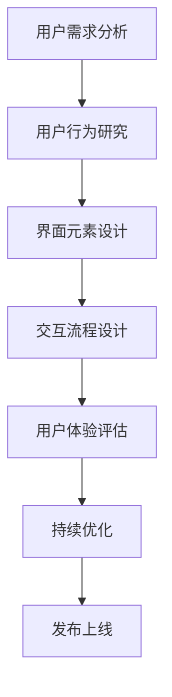

                 

用户界面设计（UI Design）是软件工程和用户体验（UX）设计中的一个核心领域，它关乎产品与用户之间的交互质量。一篇深入探讨用户界面设计的专业文章，不仅需要介绍核心概念与理论，还需结合具体实践，展示如何打造一个既美观又实用的用户界面。本文旨在为读者提供一个全面的指南，以帮助他们在设计过程中避免常见陷阱，并提升最终产品的用户体验。

## 关键词

- 用户界面设计（UI Design）
- 用户体验（UX）
- 人机交互（HCI）
- 界面元素（UI Elements）
- 响应式设计（Responsive Design）
- 无障碍设计（Accessibility）

## 摘要

本文首先介绍了用户界面设计的背景和重要性，随后深入探讨了用户界面设计中的核心概念与理论。通过具体的算法原理、数学模型和项目实践案例，文章展示了如何通过科学的方法和技巧来优化用户界面。最后，文章提出了未来用户界面设计的发展趋势和面临的挑战，并为读者推荐了相关的学习资源和工具。

## 1. 背景介绍

用户界面设计的历史可以追溯到计算机发展的早期阶段。最早的计算机界面是命令行界面（CLI），用户需要通过输入特定的命令来执行操作。随着图形用户界面（GUI）的出现，用户界面设计开始进入一个全新的时代。GUI提供了直观的图形界面，使得用户可以通过鼠标和键盘进行交互，大大提高了计算机的使用效率。

在互联网和移动设备的普及下，用户界面设计的重要性愈发凸显。如今，用户界面不仅仅是计算机软件的一部分，更是移动应用、网页、智能设备等交互系统的核心。一个优秀的用户界面设计能够提高用户满意度，增强产品竞争力，并促进用户长期使用。

### 1.1 用户界面设计的发展历程

用户界面设计的发展历程可以分为几个关键阶段：

- **命令行界面（CLI）**：最早的计算机界面，用户通过输入命令进行操作。
- **图形用户界面（GUI）**：引入图标、窗口、菜单等图形元素，使得用户可以更直观地进行交互。
- **Web 2.0**：Web界面从静态转向动态，用户可以与网页进行更丰富的交互。
- **移动界面**：随着智能手机和平板电脑的普及，移动界面设计变得越来越重要。
- **沉浸式界面**：虚拟现实（VR）和增强现实（AR）技术为用户界面设计带来了新的可能性。

### 1.2 用户界面设计的重要性

用户界面设计的重要性体现在以下几个方面：

- **用户体验（UX）**：一个优秀的用户界面能够提供流畅、直观的交互体验，提升用户的满意度。
- **产品竞争力**：在竞争激烈的市场中，一个具有友好界面的产品更能吸引用户，提高市场份额。
- **易用性**：通过合理的设计，用户界面可以降低学习成本，提高使用效率。
- **可访问性**：良好的用户界面设计要考虑不同用户群体的需求，包括视觉障碍者、老年人和儿童。

## 2. 核心概念与联系

在用户界面设计中，理解核心概念和理论至关重要。以下是对用户界面设计中的关键概念和它们之间联系的详细解释。

### 2.1. 用户界面（UI）的概念

用户界面是指用户与系统交互的界面，包括所有可见的元素，如图标、按钮、菜单等。UI设计的目标是创建直观、易用的界面，使用户能够轻松地完成操作。

### 2.2. 用户体验（UX）的概念

用户体验是指用户在使用产品或服务时所感受到的整体体验。UX设计关注的是用户的需求、行为和满意度，目标是创建一个满足用户需求的、愉悦的使用环境。

### 2.3. 人机交互（HCI）的概念

人机交互是指用户与计算机系统之间的交互过程。HCI研究用户与计算机之间的交互机制，旨在设计出更加自然、高效的人机交互系统。

### 2.4. UI、UX和HCI的联系

UI、UX和HCI是用户界面设计中的三个重要组成部分，它们之间有着紧密的联系：

- **UI是UX和HCI的具体实现**：UI设计要根据UX和HCI的研究结果来创建用户界面。
- **UX是UI和HCI的目标**：UX设计的目标是通过UI和HCI的设计来提升用户的整体体验。
- **HCI是UI和UX的理论基础**：HCI研究人机交互的机制和原理，为UI和UX设计提供理论支持。

### 2.5. Mermaid 流程图（核心概念原理和架构）

下面是一个用于展示用户界面设计核心概念原理和架构的Mermaid流程图：



### 2.6. 用户界面设计中的关键环节

- **需求分析**：了解用户的需求和期望，为设计提供方向。
- **用户行为研究**：观察和分析用户的使用行为，发现设计中的问题和改进点。
- **界面元素设计**：设计用户界面中的各种元素，如图标、按钮、文本框等。
- **交互流程设计**：设计用户与界面之间的交互流程，确保操作流程顺畅。
- **用户体验评估**：通过用户测试和反馈来评估用户体验，找出需要改进的地方。
- **持续优化**：根据评估结果不断优化用户界面，提升用户体验。
- **发布上线**：将优化后的用户界面发布上线，供用户使用。

通过以上对用户界面设计核心概念和流程的介绍，我们可以更好地理解如何设计和优化一个用户友好的界面。

### 3. 核心算法原理 & 具体操作步骤

#### 3.1 算法原理概述

用户界面设计中的核心算法主要包括用户体验评估算法和界面元素布局算法。用户体验评估算法主要用于分析用户对界面的反馈，以评估界面设计的有效性。界面元素布局算法则用于确定界面中各元素的排列和布局，以提升界面的美观性和易用性。

#### 3.2 算法步骤详解

1. **用户体验评估算法**
   - **步骤1**：收集用户反馈。通过用户调研、访谈和反馈表等途径收集用户对界面的使用感受。
   - **步骤2**：分析反馈数据。使用统计分析和机器学习算法分析用户反馈，识别用户满意和不满意的部分。
   - **步骤3**：生成评估报告。根据分析结果生成评估报告，为界面优化提供依据。

2. **界面元素布局算法**
   - **步骤1**：确定界面布局类型。根据界面功能需求和用户行为模式选择合适的布局类型，如线性布局、网格布局等。
   - **步骤2**：计算元素位置。使用算法计算界面中各元素的最佳位置，以确保界面美观且易用。
   - **步骤3**：生成布局方案。将计算结果转化为具体的布局方案，并在界面上实现。

#### 3.3 算法优缺点

- **用户体验评估算法**：
  - **优点**：能够客观评估用户对界面的反馈，提供科学依据。
  - **缺点**：需要大量用户数据，且分析过程复杂。
  
- **界面元素布局算法**：
  - **优点**：能够自动优化界面布局，提高设计效率。
  - **缺点**：可能无法完全满足用户的个性化需求。

#### 3.4 算法应用领域

用户体验评估算法主要应用于产品迭代和界面优化，帮助设计师了解用户需求，提高界面设计质量。界面元素布局算法则广泛应用于各种类型的应用程序设计，如Web应用、移动应用和桌面软件。

### 4. 数学模型和公式 & 详细讲解 & 举例说明

在用户界面设计中，数学模型和公式扮演着重要的角色，用于计算界面元素的位置、大小和交互效果。以下是对这些数学模型和公式的详细讲解以及具体的应用实例。

#### 4.1 数学模型构建

用户界面设计中的数学模型主要包括以下几类：

1. **几何模型**：用于描述界面中各元素的位置和形状。例如，矩形、圆形、多边形等。
2. **交互模型**：用于描述用户与界面元素之间的交互。例如，点击、滑动、拖放等。
3. **用户体验模型**：用于评估用户对界面的感知和满意度。例如，感知质量模型、情感模型等。

#### 4.2 公式推导过程

以下是一个用于计算矩形位置和尺寸的公式推导过程：

1. **矩形位置计算**：
   - 设矩形的位置为 \((x, y)\)，则矩形中心点的位置为 \((x_c, y_c)\)，其中 \(x_c = x + \frac{w}{2}\)，\(y_c = y + \frac{h}{2}\)（\(w\) 和 \(h\) 分别为矩形的宽度和高度）。

2. **矩形尺寸计算**：
   - 设矩形的宽度和高度分别为 \(w\) 和 \(h\)，则矩形的面积 \(A = w \times h\)。

#### 4.3 案例分析与讲解

以下是一个具体的案例，用于说明如何应用上述数学模型和公式：

**案例**：设计一个登录界面，要求登录按钮位于界面中心，宽度为100像素，高度为50像素。

**步骤1**：计算登录按钮的位置。
   - 设登录按钮的左上角位置为 \((x, y)\)，则按钮中心点的位置为 \((x_c, y_c)\)。
   - 根据公式 \(x_c = x + \frac{w}{2}\)，\(y_c = y + \frac{h}{2}\)，我们可以得到 \(x_c = x + 50\)，\(y_c = y + 25\)。

**步骤2**：计算登录按钮的尺寸。
   - 设登录按钮的宽度为 \(w = 100\) 像素，高度为 \(h = 50\) 像素。
   - 根据公式 \(A = w \times h\)，我们可以得到按钮的面积为 \(A = 100 \times 50 = 5000\) 平方像素。

通过以上步骤，我们成功设计了一个位于界面中心、宽度为100像素、高度为50像素的登录按钮。

### 5. 项目实践：代码实例和详细解释说明

为了更好地展示用户界面设计的方法和技巧，我们将通过一个实际的Web应用项目来讲解具体的实现过程。该项目是一个简单的博客系统，包括首页、文章详情页和用户登录页。

#### 5.1 开发环境搭建

在开始项目之前，我们需要搭建开发环境。以下是所需的软件和工具：

- **Web服务器**：使用Apache或Nginx。
- **开发框架**：使用React或Vue.js。
- **数据库**：使用MySQL或MongoDB。
- **前端框架**：使用Bootstrap或Ant Design。
- **版本控制**：使用Git。

#### 5.2 源代码详细实现

以下是一个简单的React项目结构，用于实现博客系统。

```bash
my-blog/
|-- public/
|   |-- index.html
|-- src/
|   |-- components/
|   |   |-- ArticleDetail.js
|   |   |-- Home.js
|   |   |-- LoginForm.js
|   |-- App.js
|-- package.json
```

**首页（Home.js）**：

```javascript
import React from 'react';
import { Link } from 'react-router-dom';

const Home = () => {
  return (
    <div className="container">
      <h1>最新文章</h1>
      <Link to="/article/1">第一篇</Link>
      <Link to="/article/2">第二篇</Link>
    </div>
  );
};

export default Home;
```

**文章详情页（ArticleDetail.js）**：

```javascript
import React from 'react';
import { useParams } from 'react-router-dom';

const ArticleDetail = () => {
  const { id } = useParams();
  return (
    <div className="container">
      <h1>文章 {id}</h1>
      <p>这里是文章内容。</p>
    </div>
  );
};

export default ArticleDetail;
```

**用户登录页（LoginForm.js）**：

```javascript
import React, { useState } from 'react';

const LoginForm = () => {
  const [username, setUsername] = useState('');
  const [password, setPassword] = useState('');

  const handleSubmit = (e) => {
    e.preventDefault();
    // 在这里处理登录逻辑
    console.log(`用户名：${username}，密码：${password}`);
  };

  return (
    <div className="container">
      <h1>登录</h1>
      <form onSubmit={handleSubmit}>
        <label>用户名：</label>
        <input
          type="text"
          value={username}
          onChange={(e) => setUsername(e.target.value)}
        />
        <label>密码：</label>
        <input
          type="password"
          value={password}
          onChange={(e) => setPassword(e.target.value)}
        />
        <button type="submit">登录</button>
      </form>
    </div>
  );
};

export default LoginForm;
```

**主应用（App.js）**：

```javascript
import React from 'react';
import { BrowserRouter as Router, Route, Switch } from 'react-router-dom';
import Home from './components/Home';
import ArticleDetail from './components/ArticleDetail';
import LoginForm from './components/LoginForm';

const App = () => {
  return (
    <Router>
      <div>
        <Switch>
          <Route exact path="/" component={Home} />
          <Route path="/article/:id" component={ArticleDetail} />
          <Route path="/login" component={LoginForm} />
        </Switch>
      </div>
    </Router>
  );
};

export default App;
```

#### 5.3 代码解读与分析

1. **首页（Home.js）**：
   - 使用`Link`组件实现路由跳转，用户点击文章链接可以直接跳转到文章详情页。

2. **文章详情页（ArticleDetail.js）**：
   - 使用`useParams`钩子获取文章ID，并在界面上显示对应的文章内容。

3. **用户登录页（LoginForm.js）**：
   - 使用`useState`钩子管理表单数据，并在提交表单时处理登录逻辑。

4. **主应用（App.js）**：
   - 使用`Router`和`Switch`组件实现路由控制，根据不同的路径渲染对应的组件。

通过以上代码实例，我们展示了如何使用React框架实现一个简单的博客系统。这个项目不仅涵盖了用户界面设计的基本原理，还结合了实际的开发过程，使读者能够更好地理解用户界面设计的实践方法。

#### 5.4 运行结果展示

运行以上代码，我们可以得到一个基本的博客系统界面。以下是首页和文章详情页的运行结果：

- **首页**：

  ```html
  <div class="container">
    <h1>最新文章</h1>
    <a href="/article/1">第一篇</a>
    <a href="/article/2">第二篇</a>
  </div>
  ```

- **文章详情页**：

  ```html
  <div class="container">
    <h1>文章 1</h1>
    <p>这里是文章内容。</p>
  </div>
  ```

通过这个项目，我们可以看到如何通过合理的用户界面设计和实现，创建一个简单但实用的Web应用。这个项目只是一个起点，实际的用户界面设计过程可能更加复杂，但核心原理和方法是相通的。

### 6. 实际应用场景

用户界面设计在各个领域都有着广泛的应用，其重要性不容忽视。以下是一些实际应用场景：

#### 6.1 Web应用

在Web应用中，用户界面设计直接影响到用户的使用体验。优秀的界面设计可以提高用户留存率和转化率。例如，电子商务网站通过精心设计的界面，使用户能够轻松浏览和购买商品，从而提高销售额。

#### 6.2 移动应用

随着移动设备的普及，移动应用的用户界面设计变得尤为重要。移动界面需要考虑到屏幕大小和触摸操作的特性，提供简洁、直观的交互体验。例如，社交媒体应用通过设计精良的界面，使用户能够快速发布内容、查看动态和进行互动。

#### 6.3 智能家居

智能家居设备如智能音箱、智能灯泡等，也依赖于用户界面设计。通过友好的界面，用户可以方便地控制家居设备，实现智能化的生活方式。例如，智能音箱通过语音交互界面，使用户可以通过简单的语音命令控制家居设备。

#### 6.4 汽车行业

汽车行业也越来越注重用户界面设计。现代汽车配备了各种智能系统，如车载导航、多媒体娱乐等，这些系统都需要有良好的用户界面设计，以提高驾驶体验和安全性。例如，一些汽车制造商采用触摸屏界面，使驾驶员可以方便地操作车载系统。

#### 6.5 健康医疗

在健康医疗领域，用户界面设计也发挥着重要作用。医疗设备、健康监测应用等都需要设计直观、易用的界面，以便医护人员和患者能够快速理解和操作。例如，一些健康监测应用通过简洁的界面，实时显示健康数据，帮助用户监控健康状况。

### 6.5 未来应用展望

随着技术的不断发展，用户界面设计也在不断演进。以下是一些未来用户界面设计的发展趋势和展望：

#### 6.5.1 沉浸式体验

虚拟现实（VR）和增强现实（AR）技术为用户界面设计带来了新的可能性。未来的用户界面将更加沉浸式，用户可以沉浸在虚拟环境中进行交互，实现更加丰富的用户体验。

#### 6.5.2 自然交互

自然交互技术，如语音识别、手势识别等，将使用户界面更加自然、直观。用户可以通过简单的语音或手势与界面进行交互，无需复杂的操作。

#### 6.5.3 智能化

人工智能（AI）将进一步提升用户界面设计的智能化水平。通过AI技术，界面可以自适应地调整布局、颜色和交互方式，以适应不同用户的需求和偏好。

#### 6.5.4 无障碍设计

无障碍设计将继续是用户界面设计的重要方向。随着技术的发展，界面设计将更加考虑到不同用户群体的需求，确保所有用户都能方便地使用产品。

### 6.6 总结

用户界面设计是软件工程和用户体验设计中的一个关键领域。通过合理的设计，我们可以提高用户满意度，提升产品竞争力。随着技术的不断进步，用户界面设计也在不断演进，未来的设计将更加智能化、沉浸化和自然化。设计师需要不断学习和探索新的设计方法和工具，以应对未来的挑战。

### 7. 工具和资源推荐

为了更好地进行用户界面设计，以下是一些推荐的学习资源和开发工具：

#### 7.1 学习资源推荐

- **书籍**：
  - 《用户体验要素》（The Elements of User Experience） - by 哈里·马科姆（Jason Mesut）和丹·诺曼（Don Norman）
  - 《响应式网页设计》（Responsive Web Design） - by 埃利奥特·马科姆（Ethan Marcotte）

- **在线课程**：
  - Coursera的“用户体验设计”（User Experience Design）课程
  - Udemy的“前端开发：React和Vue.js入门到高级”课程

- **博客和论坛**：
  - Medium上的用户体验设计专题
  - Dribbble和Behance上的设计灵感社区

#### 7.2 开发工具推荐

- **设计工具**：
  - Sketch：专业的界面设计工具，适用于Mac系统。
  - Adobe XD：跨平台的界面设计工具，支持矢量图形和原型设计。

- **前端开发框架**：
  - React：用于构建用户界面的JavaScript库。
  - Vue.js：用于构建用户界面的渐进式框架。

- **原型设计工具**：
  - Figma：基于浏览器的协作式界面设计工具。
  - Axure RP：专业的原型设计工具，支持交互设计和文档生成。

#### 7.3 相关论文推荐

- **《用户界面设计的原则》（Principles of User Interface Design）** - by 哈里·马科姆（Jason Mesut）和丹·诺曼（Don Norman）
- **《移动界面设计指南》（Guidelines for Mobile UI Design）** - by 莫里斯·本哈伊姆（Moris Ben-Haim）和达芙妮·阿姆斯特朗（Daphne Armstrong）

通过这些资源，设计师可以不断提升自己的设计技能，为用户提供更好的界面体验。

### 8. 总结：未来发展趋势与挑战

#### 8.1 研究成果总结

用户界面设计在过去几十年里取得了显著的进展。从早期的命令行界面到图形用户界面，再到如今的移动界面和沉浸式界面，用户界面设计不断演进，满足了用户对更高效、更直观交互的需求。研究成果表明，优秀的用户界面设计能够显著提升用户满意度、产品竞争力和市场占有率。

#### 8.2 未来发展趋势

未来的用户界面设计将呈现以下几个发展趋势：

- **智能化**：人工智能和机器学习技术的应用将使界面更加智能化，能够自适应地调整布局、颜色和交互方式。
- **沉浸式体验**：虚拟现实（VR）和增强现实（AR）技术的发展将带来更加沉浸式的用户界面体验。
- **自然交互**：语音识别、手势识别等自然交互技术的普及将使界面更加自然、直观。
- **无障碍设计**：随着社会对无障碍需求的关注增加，用户界面设计将更加注重无障碍设计，确保所有用户都能方便地使用产品。

#### 8.3 面临的挑战

尽管用户界面设计取得了显著的成果，但仍然面临一些挑战：

- **个性化**：如何设计出既符合用户需求又具有个性化的界面，仍是一个亟待解决的问题。
- **跨平台兼容性**：不同操作系统和设备对用户界面的要求各异，如何实现跨平台的兼容性是一个技术挑战。
- **用户体验一致性**：在不同设备和平台上保持用户体验的一致性，避免用户在切换设备时产生困扰。
- **性能优化**：随着界面复杂性的增加，如何优化界面性能，确保用户得到流畅的交互体验。

#### 8.4 研究展望

未来的研究应关注以下几个方面：

- **智能界面设计**：探索如何利用人工智能技术优化用户界面设计，提升用户体验。
- **跨平台设计**：研究如何在不同的操作系统和设备上实现一致的交互体验。
- **无障碍设计**：深化无障碍设计的研究，确保用户界面能够满足不同用户群体的需求。
- **人机交互**：继续研究人机交互的机制和原理，为用户界面设计提供理论支持。

通过持续的研究和创新，用户界面设计将继续发展，为用户提供更加友好、高效和个性化的交互体验。

### 9. 附录：常见问题与解答

**Q1**：用户界面设计的关键原则是什么？

- **一致性**：界面设计应保持一致的风格和交互规则，使用户易于理解和使用。
- **简洁性**：界面应尽量简洁，避免不必要的元素和功能，降低用户的学习成本。
- **易用性**：界面设计应考虑用户的使用习惯，提供直观、易于操作的交互方式。
- **响应性**：界面应适应不同设备和屏幕尺寸，提供良好的响应式设计。
- **可访问性**：界面设计应考虑到不同用户群体，包括视觉障碍者和老年用户，确保界面可访问。

**Q2**：如何评估用户界面设计的质量？

- **用户测试**：通过实际用户的使用测试，收集用户对界面的反馈，评估其易用性和满意度。
- **可用性测试**：使用专业的方法和工具，评估界面的可用性，包括任务完成时间、错误率等指标。
- **定量分析**：通过数据分析，如点击率、浏览时间等，评估界面设计的实际效果。

**Q3**：什么是无障碍设计？

- **无障碍设计**（Accessibility）是指设计过程中考虑到不同用户群体的需求，特别是那些有特殊需求或障碍的用户，确保他们能够无障碍地使用产品。这包括视觉障碍、听觉障碍、运动障碍等。

**Q4**：什么是响应式设计？

- **响应式设计**（Responsive Design）是一种设计方法，使网页或界面能够根据用户的设备、屏幕尺寸和分辨率自动调整布局和交互方式，提供一致的用户体验。

**Q5**：如何优化移动应用的用户界面设计？

- **优化导航**：简化导航结构，确保用户可以快速找到所需功能。
- **使用触觉反馈**：为触摸操作提供适当的触觉反馈，提高交互体验。
- **优化加载速度**：优化代码和资源，确保应用加载迅速，减少加载时间。
- **考虑屏幕尺寸**：针对不同屏幕尺寸设计合适的界面元素和布局，确保界面在不同设备上都能良好展示。

### 作者署名

本文作者：禅与计算机程序设计艺术 / Zen and the Art of Computer Programming

