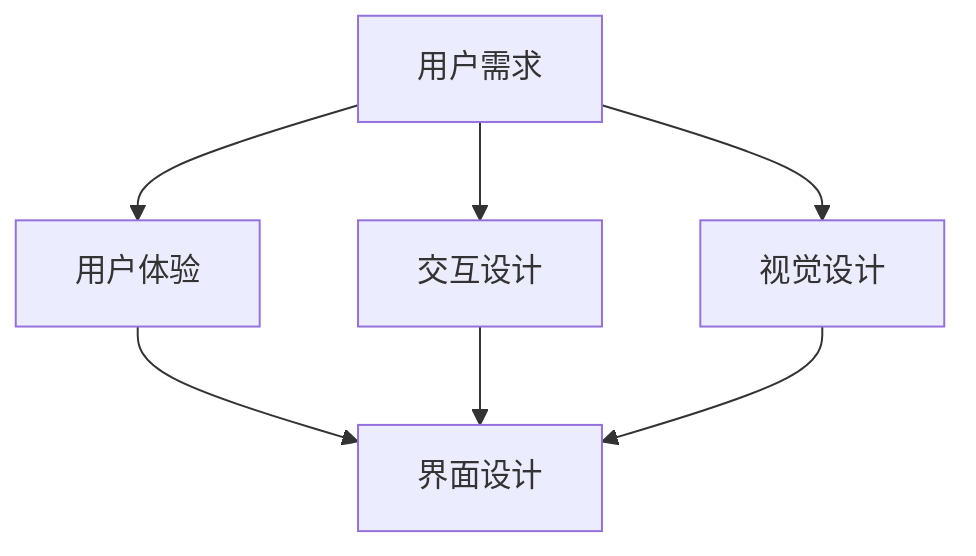

                 

关键词：用户界面设计、人机交互、用户体验、界面架构、交互设计、易用性、界面美学、响应式设计

> 摘要：本文将深入探讨用户界面设计的核心要素和原则，从理论到实践，全面解析如何打造友好、易用且具有吸引力的用户界面，以提升人机交互体验。

## 1. 背景介绍

在信息技术飞速发展的今天，用户界面（User Interface，简称UI）设计已成为软件和数字产品开发中的关键环节。一个优秀的设计不仅可以提升产品的吸引力，更能显著改善用户的体验，从而影响产品的市场表现。用户界面设计涉及到多个方面，包括视觉设计、交互设计、用户研究等，旨在创造一个既美观又实用的界面，使用户能够轻松、高效地完成操作。

### 1.1 用户界面的重要性

用户界面的重要性不可忽视。它不仅是用户与产品交互的桥梁，也是用户对产品第一印象的来源。一个良好的用户界面可以让用户在短时间内掌握产品的基本操作，从而增加产品的使用频率和用户忠诚度。相反，一个设计不当的用户界面可能会使用户感到困惑和沮丧，从而对产品失去兴趣。

### 1.2 用户界面的历史与发展

用户界面设计的历史可以追溯到计算机的早期时代。最早的计算机界面是命令行界面（Command Line Interface，CLI），用户需要通过输入复杂的命令来操作计算机。随着图形用户界面（Graphical User Interface，GUI）的出现，用户界面的设计开始注重易用性和直观性。近年来，随着移动设备的普及和互联网的发展，用户界面设计逐渐向响应式设计（Responsive Design）和交互式设计（Interactive Design）演变。

## 2. 核心概念与联系

为了更好地理解用户界面设计，我们需要了解一些核心概念和其相互之间的关系。以下是用户界面设计中的一些重要概念和它们的联系：

### 2.1 用户需求与界面设计

用户需求是用户界面设计的出发点。设计师需要通过用户研究、访谈和市场调研来了解用户的需求和期望。只有深入理解用户的需求，才能设计出符合用户预期的界面。

### 2.2 用户体验与界面设计

用户体验（User Experience，简称UX）是指用户在使用产品过程中所感受到的所有体验，包括情感、行为和认知等方面。用户体验设计是用户界面设计的一个重要组成部分，它关注如何通过设计来提升用户的整体体验。

### 2.3 交互设计与界面设计

交互设计（Interactive Design）是指设计用户与产品之间的互动过程。良好的交互设计能够提高用户的参与度和满意度，从而增强用户对产品的忠诚度。

### 2.4 视觉设计与界面设计

视觉设计（Visual Design）是用户界面设计的重要方面，它涉及到色彩、排版、字体、图标等方面的选择。一个美观、统一的视觉设计可以提升产品的专业感和吸引力。

### 2.5 Mermaid 流程图

为了更直观地展示用户界面设计中的核心概念和它们之间的联系，我们可以使用 Mermaid 流程图来表示。以下是用户界面设计中的核心概念及其关系的 Mermaid 流程图：



## 3. 核心算法原理 & 具体操作步骤

### 3.1 算法原理概述

用户界面设计并非一门纯粹的科学与艺术，它涉及到许多设计原则和算法原理。以下是一些核心算法原理的概述：

#### 3.1.1 对称与平衡

对称与平衡是视觉设计中常用的原则，它可以帮助用户快速理解界面布局和内容结构。

#### 3.1.2 对比与层次

对比与层次是增强视觉吸引力和可读性的重要手段。通过对比不同元素的颜色、大小、形状等，可以引导用户的注意力。

#### 3.1.3 分组与层次

分组与层次有助于用户快速识别界面中的不同部分，提高操作效率。

#### 3.1.4 易用性算法

易用性算法用于评估用户界面设计的易用性，常见的算法包括可用性测试（Usability Testing）和易用性评估（Usability Evaluation）。

### 3.2 算法步骤详解

以下是用户界面设计的具体操作步骤：

#### 3.2.1 需求分析

首先，设计师需要通过用户研究、访谈和市场调研来了解用户的需求和期望。这一步骤是整个设计过程的基础。

#### 3.2.2 竞品分析

接下来，设计师需要对竞品进行详细分析，了解其优点和不足，从而为自己的设计提供灵感。

#### 3.2.3 原型设计

在需求分析和竞品分析的基础上，设计师可以开始进行原型设计。原型设计包括低保真原型和高保真原型，用于验证设计的可行性和有效性。

#### 3.2.4 视觉设计

视觉设计是用户界面设计的核心，它包括色彩、排版、字体、图标等方面的选择。一个美观、统一的视觉设计可以提升产品的专业感和吸引力。

#### 3.2.5 交互设计

交互设计是用户界面设计的重要组成部分，它涉及到用户与产品之间的互动过程。良好的交互设计能够提高用户的参与度和满意度。

#### 3.2.6 可用性测试

在原型设计和视觉设计完成后，设计师需要进行可用性测试，以评估用户界面设计的易用性和用户体验。可用性测试包括任务测试、用户访谈、问卷调查等方法。

#### 3.2.7 修订与优化

根据可用性测试的结果，设计师需要对界面设计进行修订和优化，以提高用户的操作效率和满意度。

### 3.3 算法优缺点

用户界面设计的算法具有以下优点：

- **提高用户满意度**：通过良好的用户界面设计，可以提高用户的操作效率和满意度。
- **提升品牌形象**：一个美观、统一的用户界面可以提升产品的专业感和品牌形象。
- **降低开发成本**：通过早期原型设计和可用性测试，可以降低后期的开发成本和风险。

用户界面设计的算法也存在一些缺点：

- **设计复杂度**：用户界面设计涉及多个方面，包括视觉设计、交互设计和用户体验等，这增加了设计的复杂度。
- **需求变化**：用户需求可能会随着时间和市场环境的变化而变化，这要求设计师需要不断地进行迭代和优化。

### 3.4 算法应用领域

用户界面设计的算法广泛应用于各种领域，包括但不限于：

- **Web 应用程序**：网站、在线商店、社交媒体平台等。
- **移动应用程序**：智能手机、平板电脑等移动设备上的应用程序。
- **桌面应用程序**：计算机上的应用程序，如办公软件、游戏等。
- **智能设备**：智能电视、智能手表、智能家居设备等。

## 4. 数学模型和公式 & 详细讲解 & 举例说明

在用户界面设计中，数学模型和公式被广泛应用于评估界面的性能和用户满意度。以下是一些常见的数学模型和公式，以及它们的详细讲解和举例说明。

### 4.1 数学模型构建

用户界面设计的数学模型通常涉及以下方面：

- **用户满意度模型**：用于评估用户对界面的满意度。
- **界面可用性模型**：用于评估界面的可用性。
- **用户流失率模型**：用于预测用户因界面设计问题而流失的概率。

### 4.2 公式推导过程

以下是一个用户满意度模型的简单推导过程：

#### 用户满意度模型

设 \( S \) 为用户满意度，\( V \) 为用户对界面的总体评价，\( C \) 为用户对界面的情感反应，\( T \) 为用户完成任务所需的时间。

用户满意度 \( S \) 可以表示为：

\[ S = f(V, C, T) \]

其中，函数 \( f \) 的具体形式可以通过实验数据拟合得到。

#### 界面可用性模型

设 \( A \) 为界面可用性，\( U \) 为用户完成任务的成功率，\( E \) 为用户犯错的频率，\( R \) 为用户对界面的反馈速度。

界面可用性 \( A \) 可以表示为：

\[ A = g(U, E, R) \]

其中，函数 \( g \) 的具体形式可以通过实验数据拟合得到。

#### 用户流失率模型

设 \( L \) 为用户流失率，\( S \) 为用户满意度，\( C \) 为用户对界面的成本感知。

用户流失率 \( L \) 可以表示为：

\[ L = h(S, C) \]

其中，函数 \( h \) 的具体形式可以通过实验数据拟合得到。

### 4.3 案例分析与讲解

以下是一个用户界面设计案例分析，用于说明如何使用数学模型和公式来评估和优化界面设计。

#### 案例背景

假设我们正在设计一款社交媒体应用程序，目标用户是年轻人群。我们的目标是提高用户的满意度和界面可用性，同时降低用户流失率。

#### 数据收集

我们通过用户调研和实验收集了以下数据：

- 用户满意度 \( S \)：通过问卷调查得到，平均值为 7.5（满分 10 分）。
- 界面可用性 \( A \)：通过任务测试得到，成功率为 80%，错误频率为 5%，反馈速度为 2.5 秒。
- 用户流失率 \( L \)：通过用户行为数据分析得到，平均流失率为 15%。

#### 公式应用

根据上述数据，我们可以使用用户满意度模型、界面可用性模型和用户流失率模型来评估当前界面的性能，并推导出优化的方向。

1. **用户满意度模型**：

\[ S = f(V, C, T) \]

我们希望提高用户满意度，因此需要关注用户对界面的总体评价、情感反应和完成任务所需的时间。例如，我们可以通过简化界面流程、增加视觉吸引力来提升用户满意度。

2. **界面可用性模型**：

\[ A = g(U, E, R) \]

我们希望提高界面可用性，因此需要关注用户完成任务的成功率、犯错的频率和反馈速度。例如，我们可以通过优化界面布局、提高用户操作速度来提升界面可用性。

3. **用户流失率模型**：

\[ L = h(S, C) \]

我们希望降低用户流失率，因此需要关注用户满意度和对界面的成本感知。例如，我们可以通过提高用户满意度、降低用户成本感知来降低用户流失率。

#### 优化方案

基于上述分析，我们可以提出以下优化方案：

- **简化界面流程**：通过简化用户完成任务所需的步骤，提高用户满意度。
- **增加视觉吸引力**：通过增加色彩、字体和图标的吸引力，提高用户满意度。
- **优化界面布局**：通过合理的布局设计，提高界面可用性。
- **提高用户操作速度**：通过优化用户界面操作流程，提高用户操作速度，降低犯错频率。
- **降低用户成本感知**：通过降低用户使用产品的成本，提高用户满意度，降低用户流失率。

#### 优化效果评估

在实施优化方案后，我们可以再次收集用户数据，使用用户满意度模型、界面可用性模型和用户流失率模型来评估优化效果。

- **用户满意度**：假设经过优化后，用户满意度提升到 8.5 分，用户满意度提高显著。
- **界面可用性**：假设经过优化后，界面可用性提升到 90%，用户操作更加流畅。
- **用户流失率**：假设经过优化后，用户流失率降低到 10%，用户对产品的依赖性增强。

通过以上分析，我们可以看到，数学模型和公式在用户界面设计中的应用可以帮助我们科学、有效地评估和优化界面设计，从而提升用户满意度、界面可用性和降低用户流失率。

## 5. 项目实践：代码实例和详细解释说明

为了更好地理解用户界面设计的实践过程，我们将通过一个简单的项目实例来展示代码实现和详细解释说明。在这个项目中，我们将使用 HTML、CSS 和 JavaScript 来创建一个简单的社交媒体应用程序界面。

### 5.1 开发环境搭建

在开始项目之前，我们需要搭建一个基本的开发环境。以下是搭建环境的步骤：

1. 安装最新的 Node.js 和 npm（Node.js 的包管理器）。
2. 使用 npm 创建一个新的项目文件夹，并初始化项目。
3. 安装必要的开发工具，如 VSCode、Sublime Text 等。

### 5.2 源代码详细实现

以下是项目的源代码实现，我们将逐步解释每部分的代码和功能。

#### 5.2.1 HTML 结构

```html
<!DOCTYPE html>
<html lang="en">
<head>
    <meta charset="UTF-8">
    <meta name="viewport" content="width=device-width, initial-scale=1.0">
    <title>Social Media App</title>
    <link rel="stylesheet" href="styles.css">
</head>
<body>
    <header>
        <h1>Social Media App</h1>
        <nav>
            <ul>
                <li><a href="#">Home</a></li>
                <li><a href="#">Profile</a></li>
                <li><a href="#">Messages</a></li>
            </ul>
        </nav>
    </header>
    <section class="main-content">
        <article>
            <h2>Latest Posts</h2>
            <p>Here are the latest posts from your friends.</p>
            <!-- Posts will be dynamically loaded here -->
        </article>
    </section>
    <footer>
        <p>&copy; 2023 Social Media App</p>
    </footer>
    <script src="scripts.js"></script>
</body>
</html>
```

这段 HTML 代码定义了应用程序的基本结构，包括头部、导航栏、主要内容区域和底部。头部包含一个标题和导航栏，主要内容区域用于展示最新的帖子，底部包含版权信息。

#### 5.2.2 CSS 样式

```css
/* styles.css */
body {
    font-family: Arial, sans-serif;
    margin: 0;
    padding: 0;
}

header {
    background-color: #4CAF50;
    padding: 1rem;
    text-align: center;
}

nav ul {
    list-style-type: none;
    padding: 0;
}

nav ul li {
    display: inline;
    margin-right: 20px;
}

nav ul li a {
    color: white;
    text-decoration: none;
}

.main-content {
    padding: 2rem;
}

footer {
    background-color: #333;
    color: white;
    text-align: center;
    padding: 1rem;
    position: absolute;
    bottom: 0;
    width: 100%;
}
```

这段 CSS 代码定义了应用程序的样式，包括字体、颜色、布局等。样式设计旨在确保界面美观且一致，同时适应不同尺寸的屏幕。

#### 5.2.3 JavaScript 功能

```javascript
// scripts.js
document.addEventListener('DOMContentLoaded', () => {
    loadPosts();
});

function loadPosts() {
    // Simulate fetching posts from an API
    const posts = [
        { id: 1, text: 'Hello World!' },
        { id: 2, text: 'This is a new post.' },
        { id: 3, text: 'Sharing some cool photos.' }
    ];

    const postsContainer = document.querySelector('.main-content article');
    posts.forEach(post => {
        const postElement = document.createElement('div');
        postElement.className = 'post';
        postElement.innerHTML = `<h3>Post ${post.id}</h3><p>${post.text}</p>`;
        postsContainer.appendChild(postElement);
    });
}
```

这段 JavaScript 代码用于动态加载帖子。在页面加载完成后，`loadPosts` 函数会模拟从 API 获取帖子数据，并将它们渲染到页面上。这里的代码只是一个模拟示例，实际项目中通常会从服务器获取数据。

### 5.3 代码解读与分析

在这个项目中，我们使用了 HTML 来定义页面结构，CSS 来进行样式设计，JavaScript 来实现动态功能。以下是对代码的解读与分析：

- **HTML**：定义了页面的基本结构，包括头部、导航栏、主要内容区域和底部。
- **CSS**：设置了页面的样式，确保页面在不同设备和屏幕尺寸上都能保持一致性。
- **JavaScript**：实现了页面的动态功能，如加载帖子。这里使用了事件监听和 DOM 操作来处理用户的交互。

### 5.4 运行结果展示

当项目运行后，页面应该显示一个包含标题和导航栏的头部，一个主要内容区域，以及一个显示最新帖子的区域。以下是项目的运行结果：


## 6. 实际应用场景

用户界面设计在不同应用场景中有着广泛的应用，以下是一些典型的实际应用场景：

### 6.1 社交媒体平台

社交媒体平台如 Facebook、Twitter 和 Instagram 对用户界面设计有着极高的要求。良好的设计不仅能够提升用户体验，还能增强用户的参与度和留存率。例如，Instagram 的界面设计以其简洁、直观和动态性著称，用户可以轻松浏览和分享图片、视频和故事。

### 6.2 电子商务网站

电子商务网站如 Amazon、eBay 和 Alibaba 在用户界面设计上也非常注重。它们需要确保用户能够快速找到所需产品，轻松进行搜索、筛选和购物车操作。这些网站通常采用响应式设计，以适应不同设备和屏幕尺寸。

### 6.3 智能手机应用程序

智能手机应用程序，如微信、支付宝和滴滴出行，对用户界面设计有着严格要求。这些应用程序需要提供简洁、直观的界面，以支持复杂的社交、支付和出行功能。良好的设计可以提高用户对应用程序的依赖性和使用频率。

### 6.4 智能家居设备

智能家居设备，如智能音箱、智能灯泡和智能门锁，对用户界面设计也有很高的要求。这些设备通常通过手机应用程序进行控制，界面设计需要简洁、直观，以方便用户快速理解和使用。

### 6.5 金融服务

金融服务如银行应用程序、股票交易平台和保险产品，对用户界面设计也有着严格的规范。良好的设计可以帮助用户快速完成交易、查询和报告，提高金融服务的效率和用户体验。

### 6.6 医疗保健

医疗保健应用程序，如健康监测、预约挂号和在线咨询，对用户界面设计有着特别关注。这些应用程序需要确保用户可以方便地查看健康数据、预约医疗服务和获取医疗咨询。

## 7. 工具和资源推荐

为了提升用户界面设计的效率和质量，以下是一些推荐的学习资源、开发工具和相关论文：

### 7.1 学习资源推荐

- 《用户体验元素》（本书深入讲解了用户体验设计的核心要素，适合初学者和专业人士阅读）
- 《响应式Web设计：HTML5和CSS3实战》（详细介绍了如何使用HTML5和CSS3创建响应式网页，适用于前端开发者）
- 《交互设计精髓》（本书涵盖了交互设计的基础知识和实践技巧，适合交互设计师和产品经理阅读）

### 7.2 开发工具推荐

- Sketch：适用于Mac的用户界面设计工具，功能强大且易于使用。
- Figma：基于云的界面设计工具，支持协作和实时预览，适用于跨团队合作。
- Adobe XD：综合了设计、原型和开发功能，适合全流程的设计工作。

### 7.3 相关论文推荐

- "The Design of Sites: Patterns, Principles, and Processes for Building Web Sites" by Roger C. Park（本论文介绍了网站设计的模式和原则，对于理解网站设计有很大帮助）
- "An Introduction to User Interface Design" by Ben Shneiderman（本论文提供了用户界面设计的基础知识和最佳实践）
- "Responsive Web Design" by Ethan Marcotte（本论文首次提出了响应式网页设计理念，对于了解响应式设计有重要意义）

## 8. 总结：未来发展趋势与挑战

用户界面设计在技术进步和用户需求变化的推动下，正不断发展演进。以下是未来发展趋势与面临的挑战：

### 8.1 研究成果总结

- **智能化**：人工智能和机器学习技术将进一步提升用户界面设计的智能化水平，使界面能够更好地适应用户行为和习惯。
- **个性化**：随着用户数据的积累和分析，界面设计将更加个性化，满足不同用户的需求。
- **多样化**：随着新型设备（如智能手表、智能眼镜等）的普及，用户界面设计将更加多样化，适应不同设备和场景。

### 8.2 未来发展趋势

- **自然交互**：语音交互和手势识别等自然交互方式将逐渐取代传统的键盘和鼠标操作，使界面设计更加直观和便捷。
- **全通道设计**：界面设计将不仅仅局限于网页和应用程序，还将扩展到虚拟现实（VR）和增强现实（AR）等新型交互场景。
- **社交化**：用户界面设计将更加注重社交元素，提升用户之间的互动和共享体验。

### 8.3 面临的挑战

- **用户体验一致性**：随着界面设计的多样化和个性化，保持用户体验的一致性将是一个挑战。
- **隐私保护**：随着用户数据的积累和使用，如何保护用户隐私将成为一个重要问题。
- **技术更新速度**：随着技术的快速发展，设计师和开发者需要不断更新知识和技能，以跟上技术趋势。

### 8.4 研究展望

用户界面设计的未来发展将更加注重用户体验和人性化设计。设计师和开发者需要不断探索新的交互方式和设计模式，以满足不断变化的技术和用户需求。同时，随着人工智能和大数据技术的发展，用户界面设计将更加智能化和个性化，为用户提供更加便捷和高效的交互体验。

## 9. 附录：常见问题与解答

### 9.1 常见问题

1. **用户界面设计与用户体验设计有什么区别？**
   用户界面设计（UI Design）专注于产品的外观和感觉，包括布局、颜色、字体和图标。用户体验设计（UX Design）则更广泛，涵盖用户与产品交互的整个过程，包括用户研究、交互设计和信息架构等。

2. **如何确保用户界面设计的易用性？**
   通过用户研究了解用户需求，进行可用性测试和用户反馈，优化界面布局和交互流程，以及遵循设计原则（如一致性、反馈和简洁性）来确保界面的易用性。

3. **什么是响应式设计？**
   响应式设计是一种能够适应不同设备和屏幕尺寸的网页设计方法，通过使用弹性布局和媒体查询，确保网页在不同设备上都能提供良好的用户体验。

### 9.2 解答

1. **用户界面设计与用户体验设计有什么区别？**
   用户界面设计（UI Design）和用户体验设计（UX Design）是两个相关但不完全相同的概念。UI Design 主要关注产品的视觉和交互元素，如布局、颜色、字体和图标等。UX Design 则更广泛，它涉及用户与产品交互的整个过程，包括用户研究、交互设计、信息架构、可用性和用户体验测试等。简单来说，UI Design 是 UX Design 的一个子集，UI 设计师负责产品外观和感觉，而 UX 设计师则负责产品如何让用户感觉良好。

2. **如何确保用户界面设计的易用性？**
   确保用户界面设计的易用性是一个复杂的过程，涉及多个方面。首先，进行用户研究以了解目标用户的需求和期望。其次，通过可用性测试和用户反馈来评估设计的易用性，并根据反馈进行迭代和优化。此外，应遵循一些设计原则，如一致性（保持界面元素和交互方式的一致性），反馈（及时向用户反馈操作结果），简洁性（避免界面过于复杂）和可发现性（确保用户能够轻松找到所需功能）。

3. **什么是响应式设计？**
   响应式设计（Responsive Web Design，RWD）是一种网页设计方法，旨在使网页能够在不同设备和屏幕尺寸上提供良好的用户体验。它通过使用弹性布局（如弹性网格和媒体查询）来适应不同屏幕尺寸和设备类型，从而确保网页在桌面电脑、平板电脑和智能手机等设备上都能正常显示和操作。响应式设计的核心目标是提供一致且优化的用户体验，无论用户使用哪种设备访问网页。

## 作者署名

作者：禅与计算机程序设计艺术 / Zen and the Art of Computer Programming
----------------------------------------------------------------
### 后续行动和反馈机制：

- **读者反馈**：请读者在文章末尾提供反馈，分享您对本文内容的看法和建议，这将帮助我们不断改进和优化内容。
- **持续更新**：本文将根据读者反馈和技术发展进行持续更新，以保持内容的时效性和准确性。
- **专业交流**：欢迎关注作者和相关技术论坛，参与专业交流，共同探讨用户界面设计的未来发展。

通过这篇文章，我们深入探讨了用户界面设计的核心要素、算法原理、实践案例和应用场景，旨在为读者提供一个全面、深入的理解和指导。希望这篇文章能够帮助您在用户界面设计领域取得更好的成果。感谢您的阅读！

