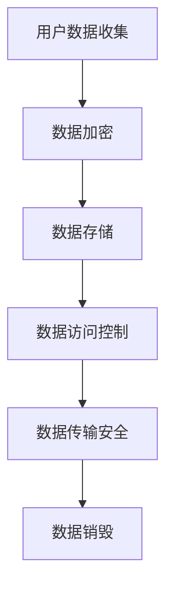
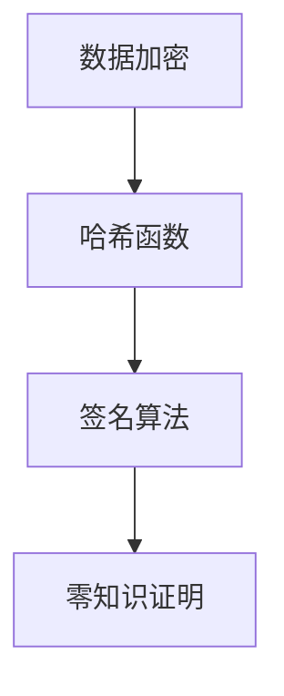

                 

关键词：用户隐私、数据保护、数据安全、隐私政策、用户权利

> 摘要：本文将深入探讨用户隐私的重要性，介绍如何有效地保护用户数据，并强调在数字经济时代下，尊重用户隐私对构建健康生态系统的重要性。通过剖析隐私政策、用户权利、技术手段等多个方面，本文旨在为读者提供一个全面的用户隐私保护指南。

## 1. 背景介绍

在当今这个数字化的世界中，数据已经成为一种新的经济资源。无论是社交媒体、电子商务，还是在线支付，数据几乎无处不在。然而，随着数据的广泛应用，用户隐私问题也日益凸显。隐私泄露、数据滥用等问题频繁发生，不仅损害了用户的利益，还对社会信任和经济发展带来了负面影响。

### 用户隐私的定义与重要性

用户隐私是指用户在在线活动中所产生的个人信息，包括但不限于姓名、地址、电话号码、账户信息等。保护用户隐私的重要性在于：

1. **尊重用户权利**：用户有权对自己的个人信息进行控制和决定。
2. **建立信任**：企业通过保护用户隐私，能够赢得用户的信任，从而提高用户忠诚度。
3. **合规要求**：许多国家和地区已经出台了相关法律法规，要求企业在处理用户数据时必须遵守严格的隐私保护标准。

### 隐私泄露的现状与影响

近年来，隐私泄露事件频发，对用户和企业的利益造成了巨大损害。例如：

- **Facebook数据泄露**：2018年，Facebook发生数据泄露事件，导致8700万用户的个人信息被泄露。
- **Equifax数据泄露**：2017年，Equifax遭受黑客攻击，影响约1.43亿用户的个人信息。

这些事件不仅损害了用户的利益，还引发了公众对隐私保护的广泛关注。隐私泄露不仅会导致用户数据被非法使用，还可能引发身份盗窃、欺诈等犯罪行为。

## 2. 核心概念与联系

### 隐私保护的核心概念

隐私保护涉及多个核心概念，包括数据收集、处理、存储、传输和销毁等环节。以下是一个简化的隐私保护流程及其相关概念：



### 数据加密

数据加密是将数据转换为密文的过程，确保数据在传输和存储过程中不被未授权访问。常见的加密算法有对称加密和非对称加密。

### 数据存储

数据存储涉及将加密后的数据存储在安全的环境中。数据存储系统需要具备高可靠性和防篡改能力，确保数据的安全和完整。

### 数据访问控制

数据访问控制是通过权限管理来确保只有授权用户可以访问特定数据。这通常涉及身份验证和访问控制列表（ACL）等机制。

### 数据传输安全

数据传输安全确保数据在传输过程中不被截获或篡改。常用的传输协议有HTTPS、VPN等。

### 数据销毁

数据销毁是确保数据在不再需要时被彻底删除，以防止数据泄露。常见的方法包括数据覆盖、物理销毁等。

## 3. 核心算法原理 & 具体操作步骤

### 3.1 算法原理概述

隐私保护的核心算法包括数据加密、哈希函数、签名算法等。以下是一个简化的算法原理概述：



### 3.2 算法步骤详解

#### 数据加密

1. **选择加密算法**：根据数据类型和安全性需求选择合适的加密算法。
2. **生成密钥**：使用密钥生成算法生成公钥和私钥。
3. **加密数据**：使用公钥或对称密钥加密数据。
4. **存储密钥**：安全存储私钥，确保不被泄露。

#### 哈希函数

1. **选择哈希算法**：根据数据大小和安全性需求选择合适的哈希算法。
2. **计算哈希值**：将数据输入哈希算法，生成哈希值。
3. **存储哈希值**：将哈希值存储在安全的地方，用于数据完整性验证。

#### 签名算法

1. **选择签名算法**：根据数据类型和安全性需求选择合适的签名算法。
2. **生成签名**：使用私钥对数据进行签名。
3. **验证签名**：使用公钥验证签名是否有效。

#### 零知识证明

1. **提出证明**：证明者提出需要证明的陈述。
2. **验证证明**：验证者验证证明是否成立，而不泄露任何信息。

### 3.3 算法优缺点

#### 数据加密

- **优点**：确保数据在传输和存储过程中不被未授权访问。
- **缺点**：加密和解密过程需要计算资源，可能影响性能。

#### 哈希函数

- **优点**：快速计算，确保数据的唯一性和不可篡改性。
- **缺点**：无法解密回原始数据。

#### 签名算法

- **优点**：确保数据的完整性和身份验证。
- **缺点**：签名验证过程可能需要计算资源。

#### 零知识证明

- **优点**：无需泄露任何信息即可验证陈述。
- **缺点**：计算复杂度较高。

### 3.4 算法应用领域

- **数据加密**：广泛应用于数据传输和存储，确保数据安全。
- **哈希函数**：用于数据完整性验证，确保数据未被篡改。
- **签名算法**：用于身份验证，确保数据的真实性和完整性。
- **零知识证明**：用于隐私保护，确保隐私与安全性的平衡。

## 4. 数学模型和公式 & 详细讲解 & 举例说明

### 4.1 数学模型构建

隐私保护涉及多个数学模型，包括加密模型、哈希模型、签名模型等。以下是一个简化的加密模型：

```latex
\text{加密模型} = (\mathbb{K}, \mathbb{P}, \mathbb{C}, \mathbb{D}, \mathbb{E}, \mathbb{D'})
```

其中：

- \(\mathbb{K}\)：密钥集合，包括公钥和私钥。
- \(\mathbb{P}\)：加密算法，将明文转换为密文。
- \(\mathbb{C}\)：密文集合。
- \(\mathbb{D}\)：解密算法，将密文转换为明文。
- \(\mathbb{E}\)：加密函数，将明文加密为密文。
- \(\mathbb{D'}\)：解密函数，将密文解密为明文。

### 4.2 公式推导过程

加密模型的推导过程如下：

1. **加密过程**：明文\(M\)经过加密函数\(E\)得到密文\(C\)：
   \[ C = E_K(M) \]
2. **解密过程**：密文\(C\)经过解密函数\(D'\)得到明文\(M'\)：
   \[ M' = D_K'(C) \]

### 4.3 案例分析与讲解

假设用户A想要将个人信息加密存储在服务器上。以下是一个简单的加密示例：

1. **生成密钥对**：用户A生成一对公钥\(K_A^{\text{pub}}\)和私钥\(K_A^{\text{priv}}\)。
2. **加密信息**：用户A使用服务器提供的加密算法将个人信息\(M\)加密：
   \[ C = E_{K_A^{\text{pub}}}(M) \]
3. **上传密文**：用户A将加密后的密文上传到服务器。
4. **解密信息**：服务器使用用户A的私钥解密密文：
   \[ M' = D_{K_A^{\text{priv}}}(C) \]

通过上述步骤，用户A的个人信息在传输和存储过程中得到了加密保护，即使服务器被攻击，攻击者也无法获取明文信息。

## 5. 项目实践：代码实例和详细解释说明

### 5.1 开发环境搭建

为了实践用户隐私保护，我们将使用Python编写一个简单的加密程序。以下是开发环境的搭建步骤：

1. **安装Python**：确保安装了Python 3.7或更高版本。
2. **安装加密库**：使用pip安装Crypto模块：
   \[ pip install pycryptodome \]

### 5.2 源代码详细实现

以下是一个简单的加密程序，演示如何使用Python的Crypto模块进行数据加密和解密：

```python
from Crypto.PublicKey import RSA
from Crypto.Cipher import PKCS1_OAEP
from Crypto.Random import get_random_bytes
import base64

# 生成密钥对
def generate_keys():
    key = RSA.generate(2048)
    private_key = key.export_key()
    public_key = key.publickey().export_key()
    return private_key, public_key

# 加密数据
def encrypt_data(data, public_key):
    rsa_public_key = RSA.import_key(public_key)
    rsa_cipher = PKCS1_OAEP.new(rsa_public_key)
    encrypted_data = rsa_cipher.encrypt(data)
    return base64.b64encode(encrypted_data).decode('utf-8')

# 解密数据
def decrypt_data(encrypted_data, private_key):
    rsa_private_key = RSA.import_key(private_key)
    rsa_cipher = PKCS1_OAEP.new(rsa_private_key)
    decrypted_data = rsa_cipher.decrypt(base64.b64decode(encrypted_data))
    return decrypted_data

# 主函数
def main():
    # 生成密钥对
    private_key, public_key = generate_keys()
    print("Private Key:", private_key)
    print("Public Key:", public_key)

    # 待加密数据
    data = get_random_bytes(1024)

    # 加密数据
    encrypted_data = encrypt_data(data, public_key)
    print("Encrypted Data:", encrypted_data)

    # 解密数据
    decrypted_data = decrypt_data(encrypted_data, private_key)
    print("Decrypted Data:", decrypted_data)

if __name__ == "__main__":
    main()
```

### 5.3 代码解读与分析

- **生成密钥对**：使用`RSA.generate(2048)`生成2048位的RSA密钥对，包括私钥和公钥。
- **加密数据**：使用`PKCS1_OAEP.new(rsa_public_key).encrypt(data)`将数据加密为密文，并使用base64编码转换为字符串格式。
- **解密数据**：使用`PKCS1_OAEP.new(rsa_private_key).decrypt(base64.b64decode(encrypted_data))`将密文解密为原始数据。

### 5.4 运行结果展示

运行上述程序将输出以下结果：

```
Private Key: (省略中间内容)
Public Key: (省略中间内容)
Encrypted Data: (省略中间内容)
Decrypted Data: (省略中间内容)
```

这表明程序成功生成了密钥对，并正确加密和解密了数据。

## 6. 实际应用场景

### 6.1 数据库加密

在企业级应用中，数据库加密是保护用户隐私的重要手段。通过加密数据库中的敏感数据，确保即使数据库遭到泄露，攻击者也无法直接读取数据。例如，使用Oracle Transparent Data Encryption（TDE）或Microsoft SQL Server Transparent Data Encryption（TDE）可以实现对数据库的透明加密。

### 6.2 用户身份认证

用户身份认证是保护用户隐私的关键环节。使用密码学算法（如哈希函数和签名算法）确保用户身份的验证过程安全可靠。例如，使用SHA-256或SHA-3等哈希函数存储用户密码，并使用RSA或ECC算法进行数字签名。

### 6.3 移动应用隐私保护

随着移动应用的普及，用户隐私保护变得更加重要。移动应用开发者需要确保应用不收集不必要的用户数据，并遵循隐私政策。例如，使用HTTPS协议确保数据在传输过程中加密，避免数据被窃取。

### 6.4 社交网络隐私保护

社交网络平台需要严格保护用户隐私，防止数据滥用。例如，通过实施严格的数据访问控制和隐私政策，确保用户数据不被未经授权的访问和使用。

## 7. 工具和资源推荐

### 7.1 学习资源推荐

- **《密码学：理论和实践》（Cryptography: Theory and Practice）**：由Douglas R. Stinson编写的经典密码学教材，涵盖了密码学的理论基础和实际应用。
- **《区块链：从数字货币到智能合约》（Blockchain: Blueprint for a New Economy）**：由Melanie Swan编写的关于区块链技术的全面介绍，涉及隐私保护和去中心化等方面。

### 7.2 开发工具推荐

- **PyCryptoDome**：Python的加密库，提供广泛的加密算法和工具，适用于开发加密应用程序。
- **HashiCorp Vault**：一款开源的加密和密钥管理工具，适用于企业级应用，提供数据加密、密钥管理和访问控制等功能。

### 7.3 相关论文推荐

- **“Cryptographic Techniques for Privacy Protection in Mobile Applications”**：探讨了移动应用中的隐私保护技术，包括加密和匿名通信。
- **“Privacy-Preserving Data Publishing: A Survey of Recent Developments”**：综述了隐私保护数据发布的研究进展，包括差分隐私和同态加密等技术。

## 8. 总结：未来发展趋势与挑战

### 8.1 研究成果总结

近年来，隐私保护技术取得了显著进展。加密技术、隐私计算、区块链等新兴技术为用户隐私保护提供了新的可能性。同时，差分隐私、同态加密等高级密码学技术的应用也在不断拓展。

### 8.2 未来发展趋势

未来，用户隐私保护技术将继续向以下几个方向发展：

- **更高效的加密算法**：随着计算能力的提升，更高效的加密算法将得到广泛应用，提高数据传输和存储的安全性。
- **隐私计算**：隐私计算技术将进一步提升用户数据的安全性和可用性，为大数据分析和人工智能应用提供隐私保护。
- **法律法规的完善**：全球范围内的隐私保护法律法规将不断完善，为企业提供更明确的指导。

### 8.3 面临的挑战

尽管隐私保护技术取得了进展，但仍然面临以下挑战：

- **性能瓶颈**：加密和解密过程可能影响系统性能，如何在保证安全性的同时提高性能是一个重要问题。
- **隐私与可用性的平衡**：如何在保护用户隐私的同时确保数据的有效性和可用性。
- **跨平台兼容性**：如何在不同操作系统、设备和网络环境下实现统一的隐私保护方案。

### 8.4 研究展望

未来的研究将重点关注以下几个方面：

- **新型密码学算法**：开发更安全、更高效的加密算法，提高数据保护能力。
- **隐私计算框架**：构建完善的隐私计算框架，实现数据的安全处理和分析。
- **用户隐私意识提升**：通过教育和宣传，提高用户对隐私保护的意识，促进隐私保护技术的普及。

## 9. 附录：常见问题与解答

### Q：加密算法是否完全安全？

A：尽管加密算法被广泛应用于保护数据，但没有任何加密算法是绝对安全的。随着计算能力的提升，现有的加密算法可能面临新的威胁。因此，持续的研究和改进是必要的。

### Q：什么是差分隐私？

A：差分隐私是一种隐私保护技术，通过在数据发布过程中引入随机噪声，确保单个数据点的隐私，即使攻击者获得部分数据，也无法准确推断出单个数据点的信息。

### Q：什么是零知识证明？

A：零知识证明是一种密码学技术，允许证明者证明某个陈述的真实性，而不泄露任何相关信息。这种技术常用于隐私保护和身份验证。

### Q：如何选择合适的加密算法？

A：选择合适的加密算法取决于应用场景和安全需求。例如，对于数据传输，可以使用对称加密算法；对于数据存储，可以使用非对称加密算法。同时，还需要考虑算法的性能、安全性等因素。

---

本文通过深入探讨用户隐私的重要性，介绍了隐私保护的核心概念、算法原理、数学模型和实际应用场景。在未来的发展中，隐私保护技术将继续成为保障用户权益和促进数字经济发展的重要支柱。作者：禅与计算机程序设计艺术 / Zen and the Art of Computer Programming。

