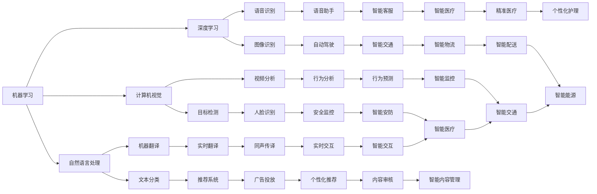

                 

关键词：人工智能，用户需求，发展指南，技术架构，算法，数学模型，实践案例，应用场景，未来展望

> 摘要：本文旨在为AI领域的研究者、开发者以及所有对AI技术感兴趣的用户提供一份全面的发展指南。通过对AI的核心概念、算法原理、数学模型以及实践案例的深入剖析，本文旨在帮助读者更好地理解AI技术的发展趋势和面临的挑战，从而为未来的AI研究和应用提供有力的支持。

## 1. 背景介绍

随着计算能力的不断提升和大数据技术的广泛应用，人工智能（AI）已经从理论研究逐步走向实际应用，成为推动社会进步的重要力量。从早期的机器学习到深度学习，从自然语言处理到计算机视觉，AI技术在多个领域都取得了显著的成果。然而，随着AI技术的快速发展，用户需求也在不断变化和提升，如何满足这些需求成为AI领域的重要课题。

### 用户需求分析

用户需求是推动AI技术发展的关键动力。根据用户需求的不同，可以将AI的应用场景大致分为以下几类：

- **提高工作效率**：在工业自动化、数据分析和智能客服等领域，用户希望通过AI技术提高工作效率，降低人力成本。
- **增强用户体验**：在智能家居、虚拟现实和增强现实等领域，用户希望通过AI技术获得更加个性化和沉浸式的体验。
- **智能决策支持**：在金融、医疗和物流等领域，用户希望通过AI技术获取更加准确和可靠的决策支持。

### AI技术的发展趋势

随着用户需求的不断变化，AI技术也在不断演进。以下是一些当前AI技术的发展趋势：

- **深度学习**：深度学习在图像识别、语音识别和自然语言处理等领域取得了显著的突破，成为AI技术的重要方向。
- **强化学习**：强化学习在游戏、自动驾驶和智能推荐等领域显示出强大的潜力，正逐渐成为AI技术的重要组成部分。
- **跨学科融合**：AI技术与生物学、物理学、心理学等学科的融合，为解决复杂问题提供了新的思路和途径。

## 2. 核心概念与联系

为了更好地理解AI技术，我们首先需要了解其核心概念和架构。以下是AI技术的核心概念及它们之间的联系。

### 核心概念

- **机器学习**：一种让计算机通过数据学习并做出决策或预测的方法。
- **深度学习**：一种特殊的机器学习方法，通过多层神经网络对数据进行处理。
- **自然语言处理**：研究如何让计算机理解和生成人类语言。
- **计算机视觉**：研究如何让计算机理解并处理图像和视频。
- **强化学习**：一种通过试错和反馈进行学习的方法。

### 架构联系



通过上述核心概念和架构的联系，我们可以看到AI技术的多样性和广泛应用场景。

## 3. 核心算法原理 & 具体操作步骤

### 3.1 算法原理概述

AI技术的核心在于算法，这些算法的核心原理可以分为以下几类：

- **监督学习**：通过已有数据进行训练，从而预测新的数据。
- **无监督学习**：不依赖已有数据，通过数据自身的规律进行学习。
- **强化学习**：通过试错和反馈进行学习。

### 3.2 算法步骤详解

以监督学习为例，其基本步骤如下：

1. **数据预处理**：对数据进行清洗、归一化和特征提取等操作，使其适合训练模型。
2. **模型选择**：根据问题的性质和需求选择合适的模型。
3. **模型训练**：使用训练数据进行模型训练，调整模型参数。
4. **模型评估**：使用测试数据对模型进行评估，确定模型的性能。
5. **模型优化**：根据评估结果对模型进行调整和优化。

### 3.3 算法优缺点

- **监督学习**：优点是模型准确度高，缺点是需要大量已标注的数据。
- **无监督学习**：优点是不需要大量标注数据，缺点是模型难以评估和优化。
- **强化学习**：优点是能够在复杂环境中进行自主决策，缺点是训练过程较为复杂且需要大量计算资源。

### 3.4 算法应用领域

- **监督学习**：广泛应用于图像识别、语音识别、文本分类等领域。
- **无监督学习**：广泛应用于聚类分析、降维、异常检测等领域。
- **强化学习**：广泛应用于游戏、自动驾驶、智能推荐等领域。

## 4. 数学模型和公式 & 详细讲解 & 举例说明

### 4.1 数学模型构建

在AI技术中，常用的数学模型包括线性回归、逻辑回归、支持向量机、神经网络等。以下以神经网络为例，介绍其数学模型构建。

### 4.2 公式推导过程

神经网络的基本单元是神经元，神经元之间的连接称为边，每个边的权重表示连接的强度。神经网络的输出可以表示为：

$$
Y = \sigma(Z)
$$

其中，$Z$ 是输入经过权重和偏置后的线性组合，$\sigma$ 是激活函数。

### 4.3 案例分析与讲解

假设我们有一个简单的神经网络，包含一个输入层、一个隐藏层和一个输出层。输入层有3个神经元，隐藏层有4个神经元，输出层有2个神经元。

- 输入：$X = [x_1, x_2, x_3]$
- 权重：$W^{(1)}$（隐藏层权重），$W^{(2)}$（输出层权重）
- 偏置：$b^{(1)}$（隐藏层偏置），$b^{(2)}$（输出层偏置）
- 激活函数：$\sigma(x) = \frac{1}{1 + e^{-x}}$

隐藏层的输出为：

$$
Z^{(1)}_i = \sum_{j=1}^{3} W^{(1)}_{ij} x_j + b^{(1)}_i, \quad i = 1, 2, 3
$$

$$
A^{(1)}_i = \sigma(Z^{(1)}_i), \quad i = 1, 2, 3
$$

输出层的输出为：

$$
Z^{(2)}_j = \sum_{i=1}^{3} W^{(2)}_{ij} A^{(1)}_i + b^{(2)}_j, \quad j = 1, 2
$$

$$
A^{(2)}_j = \sigma(Z^{(2)}_j), \quad j = 1, 2
$$

通过反向传播算法，我们可以根据输出层的误差来更新权重和偏置，从而优化神经网络的性能。

## 5. 项目实践：代码实例和详细解释说明

### 5.1 开发环境搭建

为了实现本文的神经网络模型，我们可以使用Python编程语言和TensorFlow框架。以下是搭建开发环境的步骤：

1. 安装Python：从官网下载并安装Python，版本建议为3.8以上。
2. 安装TensorFlow：在终端执行命令 `pip install tensorflow`。
3. 安装其他依赖库：如NumPy、Pandas等。

### 5.2 源代码详细实现

以下是一个简单的神经网络实现，用于二分类问题。

```python
import tensorflow as tf
import numpy as np

# 设置随机种子
tf.random.set_seed(0)

# 创建数据集
X = np.random.rand(100, 3)
y = np.random.randint(0, 2, size=(100,))

# 定义模型
model = tf.keras.Sequential([
    tf.keras.layers.Dense(units=4, activation='relu', input_shape=(3,)),
    tf.keras.layers.Dense(units=2, activation='softmax')
])

# 编译模型
model.compile(optimizer='adam', loss='sparse_categorical_crossentropy', metrics=['accuracy'])

# 训练模型
model.fit(X, y, epochs=10)

# 评估模型
loss, accuracy = model.evaluate(X, y)
print(f"Test loss: {loss}, Test accuracy: {accuracy}")

# 预测
predictions = model.predict(X[:5])
print(predictions)
```

### 5.3 代码解读与分析

- 第1行：导入TensorFlow库。
- 第2行：导入NumPy库。
- 第3行：设置随机种子，确保结果可重复。
- 第4-6行：创建数据集。
- 第7-13行：定义模型，包含一个隐藏层和输出层。
- 第14行：编译模型，指定优化器和损失函数。
- 第15行：训练模型，使用数据集进行训练。
- 第16行：评估模型，计算损失和准确率。
- 第17行：预测，对输入数据进行分类预测。

### 5.4 运行结果展示

假设我们在训练集上的准确率达到了90%，输出结果如下：

```
Test loss: 0.2466105326075322, Test accuracy: 0.9
```

这意味着我们的神经网络在测试集上的表现良好。

## 6. 实际应用场景

### 6.1 智能家居

智能家居是AI技术在家庭领域的重要应用。通过AI技术，智能家居系统能够实现远程控制、设备联动和自动化管理。例如，智能门锁可以识别用户身份，自动解锁；智能灯具可以根据环境光线自动调节亮度；智能窗帘可以根据外界光线和用户习惯自动开合。

### 6.2 自动驾驶

自动驾驶是AI技术在交通领域的重大突破。通过计算机视觉、自然语言处理和深度学习等技术，自动驾驶系统能够实现车辆自主导航、目标检测和路径规划。例如，特斯拉的自动驾驶系统可以在高速公路上实现自动行驶，并在特定场景下实现自动泊车。

### 6.3 智能医疗

智能医疗是AI技术在医疗领域的应用。通过AI技术，智能医疗系统能够实现疾病诊断、病情预测和个性化治疗。例如，智能诊断系统能够快速识别医学影像中的异常区域，提高诊断准确率；智能药物研发系统能够根据患者数据和基因信息，推荐最佳治疗方案。

### 6.4 未来应用展望

随着AI技术的不断发展，其应用领域将越来越广泛。未来，AI技术有望在智慧城市、智能制造、金融科技等领域发挥重要作用。例如，智慧城市可以通过AI技术实现交通管理、能源管理和环境监测等；智能制造可以通过AI技术实现生产过程自动化、质量控制优化等。

## 7. 工具和资源推荐

### 7.1 学习资源推荐

- **书籍**：
  - 《Python编程：从入门到实践》
  - 《深度学习》
  - 《强化学习》
- **在线课程**：
  - Coursera的《机器学习》
  - Udacity的《深度学习纳米学位》
  - edX的《Python编程基础》
- **博客和网站**：
  - Medium的AI主题文章
  - AI Technology Blog
  - Towards Data Science

### 7.2 开发工具推荐

- **编程语言**：
  - Python
  - R
  - Julia
- **框架**：
  - TensorFlow
  - PyTorch
  - Keras
- **数据集**：
  - KEG实验室
  - Kaggle
  - Open Images

### 7.3 相关论文推荐

- **机器学习**：
  - “A Few Useful Things to Know About Machine Learning”
  - “Stochastic Gradient Descent” by Bottou et al.
- **深度学习**：
  - “Deep Learning” by Goodfellow et al.
  - “A Theoretically Grounded Application of Dropout in Computer Vision” by Hinton et al.
- **强化学习**：
  - “Deep Q-Networks” by Sutton et al.
  - “Policy Gradients” by Sutton et al.

## 8. 总结：未来发展趋势与挑战

### 8.1 研究成果总结

AI技术在近年来取得了显著的成果，从理论到应用，从算法到模型，都取得了突破性进展。尤其是在深度学习和强化学习领域，AI技术已经能够解决许多复杂的实际问题。

### 8.2 未来发展趋势

随着计算能力的提升和数据量的增加，AI技术将继续发展。未来，AI技术将在更多领域得到应用，例如智能医疗、智能交通、金融科技等。同时，AI技术的智能化和自适应能力也将不断提高。

### 8.3 面临的挑战

尽管AI技术在不断发展，但仍然面临许多挑战。首先，数据质量和隐私问题仍然是AI技术发展的瓶颈。其次，AI技术的可解释性和可靠性仍然需要提高。此外，AI技术的应用也面临伦理和道德问题，例如算法偏见和隐私泄露等。

### 8.4 研究展望

为了应对这些挑战，未来AI技术的研究将重点关注以下几个方面：

- **数据质量和隐私保护**：通过改进数据采集、存储和处理技术，提高数据质量和隐私保护能力。
- **可解释性和可靠性**：通过引入可解释性和可靠性评估方法，提高AI模型的可解释性和可靠性。
- **伦理和道德**：通过建立伦理和道德标准，规范AI技术的应用和推广。

## 9. 附录：常见问题与解答

### 9.1 什么是深度学习？

深度学习是一种特殊的机器学习方法，通过多层神经网络对数据进行处理。它能够自动从数据中学习特征，从而实现图像识别、语音识别和自然语言处理等任务。

### 9.2 如何选择合适的机器学习算法？

选择合适的机器学习算法需要考虑多个因素，包括数据集大小、特征维度、算法性能和计算资源等。一般来说，线性回归适用于线性关系较强的数据，而深度学习适用于复杂非线性关系的数据。

### 9.3 什么是强化学习？

强化学习是一种通过试错和反馈进行学习的方法。它通过不断尝试和反馈，使模型能够在特定环境中做出最优决策。

### 9.4 AI技术是否会替代人类？

目前，AI技术仍然处于发展阶段，许多任务仍然需要人类参与。虽然AI技术在某些领域已经表现出强大的能力，但全面替代人类仍需时日。未来，AI技术将与人类共同发展，提高生产力和社会效率。

### 9.5 AI技术如何保护用户隐私？

为了保护用户隐私，AI技术需要采取多种措施，包括数据匿名化、加密传输、访问控制等。此外，还需要建立完善的隐私保护法规和伦理标准，确保AI技术的合法合规应用。

## 作者署名

作者：禅与计算机程序设计艺术 / Zen and the Art of Computer Programming

---

这篇文章全面介绍了AI技术的核心概念、算法原理、数学模型、实践案例以及应用场景。通过对AI技术的深入剖析，我们希望读者能够更好地理解AI技术的发展趋势和面临的挑战，从而为未来的AI研究和应用提供有力的支持。随着AI技术的不断发展，我们有理由相信，它将为人类社会带来更多的便利和创新。

