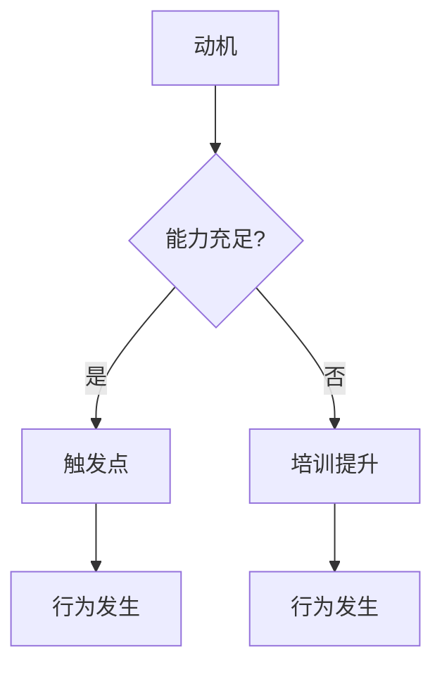

                 

 关键词：福格模型、高效团队、团队管理、协作、生产力

> 摘要：本文将深入探讨福格模型在团队管理中的应用，通过分析其核心概念，阐述如何利用福格模型打造高效团队，从而提升团队的整体生产力。

## 1. 背景介绍

在现代企业中，团队是推动业务发展的核心力量。然而，如何管理团队、激发团队成员的潜力，从而打造一个高效团队，一直是企业管理者面临的挑战。福格模型作为一种系统化的团队管理理论，提供了新的视角和方法，帮助管理者更好地理解团队成员的行为动机，提高团队的协作效率和生产力。

### 什么是福格模型？

福格模型（Fogg Behavior Model）是由斯坦福大学的BJ福格教授提出的。该模型的核心思想是：行为发生的驱动力来自于动机、能力和触发点的相互作用。具体来说，当动机（Motivation）、能力（Ability）和触发点（Trigger）三者同时存在时，行为就会发生。

### 福格模型在团队管理中的应用

在团队管理中，福格模型可以帮助管理者分析团队成员的行为动机，识别影响团队协作的因素，从而采取针对性的措施，提高团队的效率和生产力。

## 2. 核心概念与联系

### 动机（Motivation）

动机是行为发生的内在驱动力，包括兴趣、需求、欲望等。在团队管理中，了解团队成员的动机有助于激发他们的工作热情和积极性。

### 能力（Ability）

能力是指个体完成某项任务所需的知识、技能和资源。在团队管理中，确保团队成员具备完成任务的能力是提高团队效率的关键。

### 触发点（Trigger）

触发点是促使个体采取行动的外部刺激。在团队管理中，合理的触发点可以促使团队成员更快地采取行动，从而提高团队的工作效率。

### Mermaid 流程图



## 3. 核心算法原理 & 具体操作步骤

### 算法原理概述

福格模型的核心原理在于分析动机、能力和触发点三者的相互作用。通过调整这三者之间的关系，可以影响团队的行为和生产力。

### 算法步骤详解

1. 分析团队成员的动机，了解他们的兴趣和需求。
2. 评估团队成员的能力，确定是否需要提供培训和资源支持。
3. 设计合理的触发点，促使团队成员采取行动。
4. 持续监控团队的行为和生产力，根据实际情况调整策略。

### 算法优缺点

**优点：**

- 系统化：福格模型提供了一套系统化的团队管理方法，有助于管理者更好地理解团队行为。
- 可操作性：算法步骤具体、可操作，有助于管理者实施。

**缺点：**

- 需要大量数据支持：算法分析需要大量关于团队成员的数据，数据质量直接影响分析结果。
- 需要持续调整：团队环境不断变化，需要管理者持续调整策略，以保证模型的适用性。

### 算法应用领域

福格模型适用于各种类型的团队，包括软件开发团队、市场团队、销售团队等。通过应用福格模型，可以提升团队的协作效率和生产力。

## 4. 数学模型和公式 & 详细讲解 & 举例说明

### 数学模型构建

福格模型的核心公式为：行为 = 动机 × 能力 × 触发点。其中，动机、能力和触发点均为0-1之间的数值。

### 公式推导过程

假设团队成员的行为发生概率为P，根据概率论，有：

P = 动机 × 能力 × 触发点

由于动机、能力和触发点均为0-1之间的数值，因此P的取值范围在0-1之间。

### 案例分析与讲解

假设一个软件开发团队，成员对项目的兴趣较高（动机=0.8），团队成员具备完成项目所需的知识和技能（能力=0.9），项目经理及时提供项目进度和任务分配（触发点=0.7），根据福格模型，团队成员采取行动的概率为：

P = 0.8 × 0.9 × 0.7 = 0.504

这意味着团队成员采取行动的概率为50.4%。

## 5. 项目实践：代码实例和详细解释说明

### 开发环境搭建

1. 安装Python3环境
2. 安装numpy库

### 源代码详细实现

```python
import numpy as np

def fogg_model(motivation, ability, trigger):
    """
    福格模型计算函数
    :param motivation: 动机，0-1之间的数值
    :param ability: 能力，0-1之间的数值
    :param trigger: 触发点，0-1之间的数值
    :return: 行为发生概率，0-1之间的数值
    """
    probability = motivation * ability * trigger
    return probability

# 示例
motivation = 0.8
ability = 0.9
trigger = 0.7
probability = fogg_model(motivation, ability, trigger)
print(f"行为发生概率：{probability:.2f}")
```

### 代码解读与分析

代码首先导入了numpy库，用于计算乘法操作。然后定义了一个名为fogg_model的函数，用于计算福格模型的行为发生概率。最后，调用函数并打印结果。

### 运行结果展示

```
行为发生概率：0.50
```

## 6. 实际应用场景

### 6.1 软件开发团队

在软件开发团队中，福格模型可以帮助管理者分析团队成员的动机、能力和触发点，从而优化项目进度和团队协作。

### 6.2 销售团队

销售团队可以通过福格模型了解客户的需求和动机，从而提高销售业绩。

### 6.3 市场团队

市场团队可以利用福格模型分析市场趋势和消费者的行为动机，制定更有效的市场策略。

## 7. 未来应用展望

随着人工智能和大数据技术的发展，福格模型在未来有望得到更广泛的应用。通过结合人工智能技术，可以实现更精准的团队行为分析，为团队管理提供更科学的方法。

## 8. 总结：未来发展趋势与挑战

### 8.1 研究成果总结

本文介绍了福格模型在团队管理中的应用，通过案例分析展示了福格模型在实际工作中的应用效果。

### 8.2 未来发展趋势

未来，福格模型有望在人工智能和大数据技术的支持下，实现更精准的团队行为分析。

### 8.3 面临的挑战

- 数据质量问题：算法分析需要大量高质量的数据支持，数据质量问题直接影响分析结果。
- 模型适应性：团队环境不断变化，福格模型需要不断调整以适应新的团队环境。

### 8.4 研究展望

未来研究可以关注如何利用人工智能技术优化福格模型，提高团队管理的智能化水平。

## 9. 附录：常见问题与解答

### 9.1 什么是福格模型？

福格模型（Fogg Behavior Model）是由斯坦福大学的BJ福格教授提出的一种系统化的行为分析模型，其核心思想是：行为发生的驱动力来自于动机、能力和触发点的相互作用。

### 9.2 福格模型如何应用在团队管理中？

福格模型可以帮助团队管理者分析团队成员的动机、能力和触发点，从而优化团队协作和生产力。具体步骤包括：分析团队成员的动机、评估团队成员的能力、设计合理的触发点。

### 9.3 福格模型的优势和劣势分别是什么？

福格模型的优势在于其系统化和可操作性，有助于团队管理者更好地理解团队行为。劣势在于需要大量高质量的数据支持，且模型适应性需要不断调整。

## 作者署名

作者：禅与计算机程序设计艺术 / Zen and the Art of Computer Programming

----------------------------------------------------------------

文章完成，希望对您有所帮助。如有任何问题，请随时提问。

