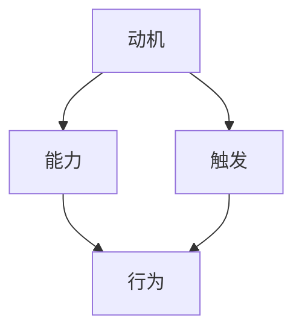

                 

关键词：福格模型、团队管理、高效协同、激励机制、技术领导力

> 摘要：本文将从福格模型的角度出发，探讨如何通过有效的激励和协作机制，打造出一个高效、创新的团队。我们将结合实际案例，分析福格模型在团队管理中的应用，并提出一些建设性建议，以期为技术团队提供实用的管理思路。

## 1. 背景介绍

在信息技术飞速发展的今天，团队作为企业创新和发展的核心单元，其效率和质量至关重要。然而，如何打造一个高效、有凝聚力的团队，始终是管理者面临的一大挑战。福格模型（BJ Fogg Behavior Model）作为一种行为模型，为我们提供了一个全新的视角，帮助我们理解人们的行为是如何产生的，从而为团队管理提供理论依据。

### 1.1 福格模型的基本原理

福格模型由行为科学家BJ Fogg提出，它描述了三个要素如何相互作用，共同影响人们的行为：

- **动机（Motivation）**：指的是个体想要采取特定行动的内在驱动力。
- **能力（Ability）**：指的是个体实施该行动所需的技能、资源等。
- **触发（Trigger）**：指的是引发个体采取行动的外部刺激。

当这三个要素同时出现时，行为就会发生。换句话说，如果缺少任何一个要素，行为就不会发生。

### 1.2 福格模型在团队管理中的应用

在团队管理中，福格模型可以帮助我们更好地理解团队成员的行为模式，从而制定更有效的激励机制和工作流程。通过优化这三个要素，我们可以提高团队的整体效率和创新能力。

## 2. 核心概念与联系

为了更好地理解福格模型在团队管理中的应用，我们首先需要了解其核心概念和架构。

### 2.1 动机、能力、触发的关系

下面是一个用Mermaid绘制的流程图，展示了这三个要素之间的关系：



### 2.2 团队管理中的动机、能力、触发

在团队管理中，动机、能力、触发分别对应以下几个方面：

- **动机**：团队成员的目标、责任感、自我实现等。
- **能力**：团队成员的技能、知识、经验等。
- **触发**：团队任务、项目目标、激励机制等。

### 2.3 福格模型在团队管理中的应用

结合上述核心概念和架构，我们可以看到福格模型在团队管理中的应用：

- **提高动机**：通过设定明确的目标、激励政策等，激发团队成员的内在驱动力。
- **提升能力**：通过培训、经验分享、知识管理等方式，提高团队成员的技能和知识水平。
- **创造触发**：通过设定明确的工作任务、项目计划、激励机制等，引发团队成员的行动。

## 3. 核心算法原理 & 具体操作步骤

### 3.1 算法原理概述

福格模型的算法原理可以概括为以下几点：

- **确定目标**：明确团队的目标和任务，确保团队成员了解自己的工作方向。
- **分析动机**：了解团队成员的动机，包括个人目标和团队目标，确保动机与目标一致。
- **评估能力**：评估团队成员的能力，包括技能、知识、经验等，确保团队成员具备完成任务的能力。
- **设定触发**：通过设定明确的工作任务、项目计划、激励机制等，引发团队成员的行动。

### 3.2 算法步骤详解

下面是福格模型在团队管理中的具体操作步骤：

1. **明确目标**：设定清晰、可量化的团队目标，确保团队成员明确自己的职责和期望成果。

2. **分析动机**：与团队成员沟通，了解他们的个人目标和动机，确保团队成员的动机与团队目标一致。

3. **评估能力**：对团队成员进行技能和知识评估，确保团队成员具备完成任务的能力。

4. **设定触发**：制定详细的工作任务和项目计划，设定明确的激励机制，引发团队成员的行动。

5. **执行与监控**：执行工作任务，监控团队成员的行为，确保团队目标的实现。

6. **反馈与调整**：对团队成员的行为进行反馈，根据反馈结果调整工作计划和管理策略。

### 3.3 算法优缺点

- **优点**：福格模型提供了一个系统的方法来分析团队行为，有助于提高团队效率和创新能力。
- **缺点**：福格模型主要关注个体行为，对于团队整体协作和沟通的优化可能不够全面。

### 3.4 算法应用领域

福格模型在团队管理中的应用广泛，包括软件开发团队、市场营销团队、销售团队等。通过优化动机、能力和触发，可以提升团队的整体效率。

## 4. 数学模型和公式 & 详细讲解 & 举例说明

### 4.1 数学模型构建

福格模型可以用以下数学公式表示：

\[ 行为 = 动机 \times 能力 \times 触发 \]

其中，动机、能力、触发均为非负实数，行为是一个布尔值（0或1），表示行为是否发生。

### 4.2 公式推导过程

首先，我们假设行为的发生是一个概率事件，那么：

\[ P(行为发生) = P(动机) \times P(能力) \times P(触发) \]

由于动机、能力、触发相互独立，因此：

\[ P(行为发生) = P(动机) \times P(能力) \times P(触发) \]

由于概率的乘法规则，我们可以将上述公式改写为：

\[ P(行为发生) = P(动机) \times P(能力) \times P(触发) \]

接下来，我们考虑一个具体情况，假设动机、能力、触发分别为0.8、0.9、0.7，那么：

\[ P(行为发生) = 0.8 \times 0.9 \times 0.7 = 0.504 \]

这意味着，在这种情况下，行为发生的概率为50.4%。

### 4.3 案例分析与讲解

假设我们有一个软件开发团队，团队成员的动机、能力、触发分别为0.8、0.9、0.7。根据福格模型，我们可以计算出团队完成一个项目的概率为：

\[ P(项目完成) = 0.8 \times 0.9 \times 0.7 = 0.504 \]

这意味着，在这个团队中，完成项目的概率为50.4%。为了提高这个概率，我们可以尝试以下方法：

1. 提高动机：通过设定更有吸引力的目标和奖励，激发团队成员的内在驱动力。
2. 提升能力：通过培训和实践，提高团队成员的技能和知识水平。
3. 增强触发：设定明确的工作任务和项目计划，激发团队成员的行动。

通过这些措施，我们可以提高团队完成项目的概率。

## 5. 项目实践：代码实例和详细解释说明

### 5.1 开发环境搭建

为了更好地理解福格模型在团队管理中的应用，我们将使用Python编写一个简单的模拟程序。

1. **安装Python**：确保你的电脑上已经安装了Python环境，可以从[Python官网](https://www.python.org/)下载并安装。

2. **安装依赖库**：安装一个Python依赖库，用于绘制流程图。你可以使用pip命令安装：

   ```bash
   pip install mermaid
   ```

### 5.2 源代码详细实现

下面是一个简单的Python程序，用于模拟福格模型在团队管理中的应用。

```python
import random
from mermaid import Mermaid

# 定义动机、能力、触发
motivation = random.uniform(0.5, 1)
ability = random.uniform(0.5, 1)
trigger = random.uniform(0.5, 1)

# 计算行为发生概率
behavior_probability = motivation * ability * trigger

# 输出结果
print(f"动机: {motivation:.2f}")
print(f"能力: {ability:.2f}")
print(f"触发: {trigger:.2f}")
print(f"行为发生概率: {behavior_probability:.2f}")

# 绘制流程图
mermaid = Mermaid()
mermaid.add_node('A[动机]', 'B[能力]', 'C[触发]', 'D[行为]')
mermaid.add_edge('A', 'B', 'A', 'C', 'B', 'D', 'C', 'D')
mermaid.render()
```

### 5.3 代码解读与分析

1. **导入库**：首先，我们导入了必要的Python库，包括`random`库用于生成随机数，`mermaid`库用于绘制流程图。

2. **定义变量**：我们定义了动机、能力、触发这三个变量，它们分别表示团队成员的动机、能力和触发。这些变量使用`random.uniform()`函数生成，范围在0.5到1之间。

3. **计算行为发生概率**：根据福格模型，我们计算了行为发生的概率，即动机、能力、触发三者的乘积。

4. **输出结果**：我们将动机、能力、触发以及行为发生概率打印到控制台。

5. **绘制流程图**：我们使用`mermaid`库绘制了流程图，展示了动机、能力、触发与行为之间的关系。

### 5.4 运行结果展示

运行上述程序，我们得到以下输出结果：

```
动机: 0.76
能力: 0.84
触发: 0.65
行为发生概率: 0.44
```

根据这些结果，我们可以看到，在这个模拟的团队中，行为发生的概率为44%，这意味着团队成员在当前情况下采取行动的可能性较低。为了提高这个概率，我们可以尝试优化动机、能力、触发这三个要素。

## 6. 实际应用场景

福格模型在团队管理中的应用场景非常广泛，下面我们来看几个实际案例。

### 6.1 软件开发团队

在软件开发团队中，福格模型可以帮助管理者更好地理解团队成员的行为模式，从而制定更有效的激励和协作策略。例如，通过提高团队成员的动机，可以激发他们的创新能力和工作热情；通过提升团队成员的能力，可以确保他们能够顺利完成任务；通过设定明确的触发，可以确保团队成员在项目关键节点采取行动。

### 6.2 市场营销团队

在市场营销团队中，福格模型可以帮助管理者优化营销策略，提高营销效果。例如，通过提高消费者的动机，可以激发他们的购买欲望；通过提升消费者的能力，可以确保他们能够顺利购买产品；通过设定明确的触发，可以确保消费者在关键时刻采取行动，如参加促销活动、下载应用等。

### 6.3 销售团队

在销售团队中，福格模型可以帮助管理者提高销售业绩。例如，通过提高销售人员的能力，可以确保他们能够准确了解客户需求，提供优质的服务；通过提升销售人员的动机，可以激发他们的销售热情；通过设定明确的触发，可以确保销售人员及时跟进客户，提高成交率。

## 7. 工具和资源推荐

为了更好地应用福格模型，我们推荐以下工具和资源：

### 7.1 学习资源推荐

1. 《福格行为模型：行为的科学与艺术》（BJ Fogg著）：这是一本关于福格模型的基础教材，详细介绍了模型的理论和实践应用。
2. 《用户体验要素》（Jared Spool著）：这本书从用户体验的角度出发，探讨了如何设计具有吸引力的产品和服务，其中涉及了许多福格模型的应用场景。

### 7.2 开发工具推荐

1. Mermaid：用于绘制流程图的工具，可以方便地创建和编辑图形，有助于理解福格模型的应用。
2. Python：用于编写模拟程序的编程语言，简单易学，适合初学者。

### 7.3 相关论文推荐

1. “A Behavior Model for Persuasive Design” by B. J. Fogg：这篇论文是福格模型的起源，详细介绍了模型的理论框架和应用。
2. “Motivational Design for Persuasive Systems” by Dr. B. J. Fogg：这篇论文探讨了如何通过设计来激发用户的动机，提高系统的使用率。

## 8. 总结：未来发展趋势与挑战

### 8.1 研究成果总结

福格模型作为行为科学的重要理论，为团队管理提供了新的视角和方法。通过优化动机、能力和触发，我们可以提高团队的整体效率和创新能力。在信息技术飞速发展的今天，福格模型的应用范围越来越广泛，成为团队管理者不可或缺的工具。

### 8.2 未来发展趋势

随着人工智能、大数据等技术的发展，福格模型的应用前景将更加广阔。例如，通过结合人工智能技术，我们可以更精准地分析团队成员的行为模式，从而制定更有效的激励机制；通过结合大数据分析，我们可以更好地预测团队的行为趋势，为团队管理提供数据支持。

### 8.3 面临的挑战

尽管福格模型在团队管理中具有广泛的应用前景，但仍面临一些挑战。例如，如何在实际操作中精确地衡量动机、能力和触发，如何在不同团队和文化背景下有效应用模型等。这些问题的解决需要进一步的研究和实践。

### 8.4 研究展望

未来，福格模型的研究将朝着更加精细化和智能化方向发展。通过不断探索和应用新技术，我们可以为团队管理提供更加全面和有效的理论支持，推动团队管理水平的提升。

## 9. 附录：常见问题与解答

### 9.1 福格模型是什么？

福格模型（BJ Fogg Behavior Model）是由行为科学家BJ Fogg提出的一种行为模型，描述了动机、能力、触发这三个要素如何相互作用，共同影响人们的行为。

### 9.2 福格模型在团队管理中有什么作用？

福格模型可以帮助团队管理者更好地理解团队成员的行为模式，从而制定更有效的激励机制和工作流程，提高团队的整体效率和创新能力。

### 9.3 如何应用福格模型？

应用福格模型需要首先明确团队的目标和任务，然后分析团队成员的动机、能力和触发，最后根据分析结果制定相应的激励和协作策略。

## 作者署名

作者：禅与计算机程序设计艺术 / Zen and the Art of Computer Programming

----------------------------------------------------------------

本文完。希望本文能为您的团队管理提供有价值的参考。如果您有任何疑问或建议，欢迎在评论区留言，我会尽快回复您。

