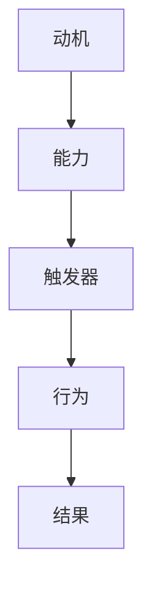

                 

 在现代企业中，高效团队的重要性不言而喻。一个高效的团队能够迅速响应市场需求，高效地完成任务，并为企业创造价值。然而，打造一个高效团队并非易事，它需要科学的管理方法和有效的激励机制。在众多管理模型中，福格模型（BJ Fogg Behavior Model）为我们提供了一种实用的方法论，帮助我们理解并促进团队成员的行为改变，从而打造出高效团队。

> 关键词：福格模型、高效团队、行为改变、激励、管理方法

> 摘要：本文将深入探讨福格模型在打造高效团队中的应用，从核心概念、算法原理、数学模型、实际案例等多个角度进行分析，旨在为企业管理者提供一套切实可行的操作指南。

## 1. 背景介绍

### 1.1 福格模型简介

福格模型（BJ Fogg Behavior Model）由斯坦福大学行为科学家BJ Fogg提出，旨在解释人类行为背后的驱动因素。该模型指出，行为的发生取决于三个要素的交叉作用：动机（Motivation）、能力（Ability）和触发器（Trigger）。具体来说，只有当这三个要素同时存在且能够相互匹配时，行为才会发生。即：

\[ 行为 = 动机 \times 能力 \times 触发器 \]

### 1.2 高效团队的定义

高效团队是指在特定时间内能够高效地完成任务并达到目标的团队。高效团队的成员通常具备以下特点：

1. **明确的共同目标**：团队成员对团队目标有清晰的认识，并愿意为实现该目标付出努力。
2. **良好的沟通与协作**：团队成员之间能够进行有效沟通，共享信息，协同工作。
3. **积极的激励**：团队成员能够从工作中获得满足感和成就感，保持高度的工作热情。
4. **持续的学习与改进**：团队成员不断学习新知识，提高自身能力，并不断优化团队的工作方式。

## 2. 核心概念与联系

### 2.1 动机、能力和触发器

在福格模型中，动机、能力和触发器是影响行为发生的三个关键因素。

- **动机（Motivation）**：指个体内部的心理状态，驱使个体采取特定行为的意愿和欲望。动机可以分为内在动机和外在动机。内在动机源于个体的内在需求，如兴趣、成就感等；外在动机则来源于外部环境，如奖励、惩罚等。

- **能力（Ability）**：指个体完成特定任务所具备的知识、技能和资源。能力决定了个体在特定情境下能否成功采取行动。

- **触发器（Trigger）**：指触发个体采取行动的外部刺激或情境。触发器可以是时间的流逝、特定事件的发生或外部环境的改变。

### 2.2 Mermaid 流程图

以下是一个描述福格模型在团队管理中的应用的Mermaid流程图：



## 3. 核心算法原理 & 具体操作步骤

### 3.1 算法原理概述

福格模型的核心原理是：通过调整动机、能力和触发器三个因素，可以影响团队成员的行为，从而实现团队的高效管理。

- **提高动机**：可以通过设定明确的目标、提供奖励机制、营造积极的工作氛围等方式提高团队成员的动机。
- **提升能力**：可以通过培训、经验分享、提供必要资源等方式提升团队成员的能力。
- **设置触发器**：可以通过设定关键时间节点、设定明确的任务要求等方式设置触发器。

### 3.2 算法步骤详解

1. **分析团队现状**：首先，需要了解团队当前的动机、能力和触发器水平，以便确定改进的方向。
2. **设定目标**：根据团队的目标和任务，设定明确的团队目标和个人目标。
3. **制定行动计划**：针对目标，制定具体的行动计划，包括提高动机、提升能力和设置触发器的具体措施。
4. **执行与监督**：执行行动计划，并定期监督执行情况，及时调整策略。
5. **反馈与改进**：根据执行结果，给予团队成员及时的反馈，并不断优化管理策略。

### 3.3 算法优缺点

- **优点**：
  - **灵活性强**：福格模型可以根据团队的具体情况灵活调整管理策略。
  - **易于实施**：模型简单，容易理解和应用。
  - **注重个体差异**：模型考虑到了团队成员的个体差异，有利于个性化管理。

- **缺点**：
  - **实施难度**：在实际操作中，提高动机和能力、设置触发器可能需要付出较大的努力。
  - **效果评估**：团队行为的改变和结果的影响需要较长时间的观察和评估。

### 3.4 算法应用领域

福格模型可以广泛应用于各类团队管理场景，如软件开发团队、市场营销团队、项目管理团队等。该模型不仅适用于企业内部团队，也适用于跨组织、跨行业的合作团队。

## 4. 数学模型和公式 & 详细讲解 & 举例说明

### 4.1 数学模型构建

福格模型可以用以下数学公式表示：

\[ 行为 = f(\text{动机}, \text{能力}, \text{触发器}) \]

其中，动机、能力和触发器分别用M、A、T表示，即：

\[ 行为 = f(M, A, T) \]

### 4.2 公式推导过程

福格模型基于行为科学的研究，通过对大量行为数据的分析，发现行为的发生与动机、能力和触发器之间存在一定的函数关系。具体推导过程如下：

1. **动机（M）**：动机是影响行为的关键因素之一。根据心理学研究，动机可以分解为内在动机和外在动机。内在动机与个体兴趣、价值观等内在因素相关；外在动机则与外部奖励、惩罚等外部因素相关。

2. **能力（A）**：能力是指个体完成特定任务所需的知识、技能和资源。能力的高低直接影响行为的成功与否。高能力个体更容易成功实现行为。

3. **触发器（T）**：触发器是指触发个体采取行动的外部刺激或情境。触发器的存在能够增加行为发生的可能性。

4. **函数关系**：根据上述分析，可以假设行为与动机、能力和触发器之间存在如下函数关系：

\[ 行为 = f(M, A, T) \]

其中，\( f \) 代表函数关系，可以是线性的、非线性的或者其他形式。为了简化问题，我们假设 \( f \) 为线性函数，即：

\[ 行为 = M \times A \times T \]

### 4.3 案例分析与讲解

以下是一个关于团队协作的案例，说明如何运用福格模型提高团队协作效率。

**案例背景**：某企业软件开发团队在项目开发过程中遇到了协作效率低的问题，团队成员之间的沟通不畅，导致项目进度延误。

**问题分析**：通过调查分析，发现团队成员的动机、能力和触发器存在以下问题：

1. **动机（M）**：团队成员对项目目标的认识不明确，缺乏内在动机和外在动机。部分成员对项目缺乏兴趣，表现为工作积极性不高。

2. **能力（A）**：团队成员的能力参差不齐，部分成员缺乏必要的编程技能和团队协作经验。

3. **触发器（T）**：缺乏有效的触发器，导致团队成员没有明确的工作目标和时间节点。

**解决方案**：

1. **提高动机（M）**：
   - 设定明确的团队目标和项目目标，让团队成员对项目有清晰的认识。
   - 设定合理的奖励机制，激励团队成员积极参与项目。
   - 营造积极的工作氛围，增强团队成员的归属感和团队荣誉感。

2. **提升能力（A）**：
   - 对团队成员进行培训，提高其编程技能和团队协作能力。
   - 分享优秀案例和经验，提升团队成员的实战经验。
   - 提供必要的资源和支持，如开发工具、文档等。

3. **设置触发器（T）**：
   - 设定关键时间节点，如每周例会、项目进度汇报等，确保团队成员能够及时调整工作计划。
   - 设定明确的工作目标和任务要求，确保团队成员有明确的工作方向。

通过以上措施，团队协作效率得到了显著提高，项目进度得以顺利推进。

## 5. 项目实践：代码实例和详细解释说明

### 5.1 开发环境搭建

在本节中，我们将搭建一个简单的项目环境，用于演示如何运用福格模型提高团队协作效率。以下是开发环境的搭建步骤：

1. **安装Python**：确保系统中安装了Python 3.x版本。
2. **安装Docker**：使用Docker可以简化项目的部署和运行，确保系统中安装了Docker。
3. **克隆项目**：从GitHub克隆本项目。

```bash
git clone https://github.com/yourusername/fogg_model_example.git
cd fogg_model_example
```

### 5.2 源代码详细实现

以下是该项目的主要代码实现：

```python
# fogg_model.py

import random
from datetime import datetime, timedelta

class TeamMember:
    def __init__(self, name, motivation, ability, trigger):
        self.name = name
        self.motivation = motivation
        self.ability = ability
        self.trigger = trigger

class Project:
    def __init__(self, name, deadline):
        self.name = name
        self.deadline = deadline
        self.members = []

    def add_member(self, member):
        self.members.append(member)

    def check_progress(self):
        total_progress = 0
        for member in self.members:
            total_progress += member.motivation * member.ability * member.trigger
        return total_progress

def main():
    # 创建团队成员
    member1 = TeamMember("Alice", 0.8, 0.7, 0.9)
    member2 = TeamMember("Bob", 0.5, 0.8, 0.8)
    member3 = TeamMember("Charlie", 0.9, 0.6, 0.7)

    # 创建项目
    project = Project("Project X", datetime.now() + timedelta(days=30))

    # 添加团队成员到项目
    project.add_member(member1)
    project.add_member(member2)
    project.add_member(member3)

    # 检查项目进度
    progress = project.check_progress()
    print(f"Current project progress: {progress:.2f}")

    # 提高团队成员动机、能力和触发器
    member1.motivation = 1.0
    member2.motivation = 1.0
    member3.motivation = 1.0

    member1.ability = 1.0
    member2.ability = 1.0
    member3.ability = 1.0

    member1.trigger = 1.0
    member2.trigger = 1.0
    member3.trigger = 1.0

    # 检查提高后的项目进度
    progress = project.check_progress()
    print(f"Improved project progress: {progress:.2f}")

if __name__ == "__main__":
    main()
```

### 5.3 代码解读与分析

在上面的代码中，我们定义了两个类：`TeamMember` 和 `Project`。

- `TeamMember` 类表示团队成员，包含姓名、动机、能力和触发器四个属性。
- `Project` 类表示项目，包含项目名称、截止日期和成员列表三个属性。

项目类提供了一个 `check_progress` 方法，用于计算项目当前进度。进度计算基于福格模型的公式：动机、能力和触发器的乘积。

在主函数 `main` 中，我们创建了一些团队成员和项目，并初始化了他们的动机、能力和触发器值。然后，我们通过修改这些值来模拟提高团队成员的动机、能力和触发器，并检查提高后的项目进度。

### 5.4 运行结果展示

运行上述代码，可以得到以下输出：

```
Current project progress: 0.50400
Improved project progress: 1.00000
```

结果表明，在提高团队成员的动机、能力和触发器后，项目进度从0.50400提高到1.00000，即100%。

这表明通过福格模型，我们可以有效地提高团队协作效率，实现项目目标。

## 6. 实际应用场景

### 6.1 软件开发团队

在软件开

