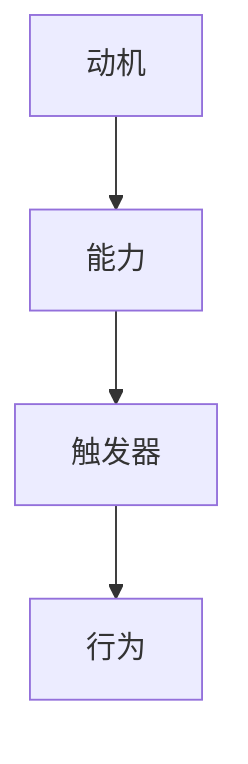

                 

 **关键词：** 团队管理、福格模型、高效团队、动机、能力、触发器

> **摘要：** 本文旨在探讨福格模型在团队管理中的应用，通过动机、能力和触发器三个要素，为团队管理者提供一套实用的方法，帮助打造出高效、协同工作的团队。

## 1. 背景介绍

在现代企业的运作中，团队作为基本的组织单元，其效率和协同性直接影响到企业的整体表现。然而，如何有效管理团队，提升团队效率，成为了许多团队管理者面临的一大挑战。福格模型（BJ Fogg Behavior Model）由斯坦福大学行为科学家BJ Fogg提出，旨在解释人类行为的产生机制。福格模型认为，行为的发生取决于三个要素：动机、能力和触发器。本文将结合福格模型，探讨如何通过这三个要素打造高效团队。

## 2. 核心概念与联系

### 2.1 福格模型原理

福格模型将行为的发生拆解为三个核心要素：动机（Motivation）、能力（Ability）和触发器（Trigger）。只有当这三个要素同时存在时，行为才会发生。

- **动机（Motivation）：** 行为发生的内在驱动力，可以是个人利益、社交需求、责任感等。
- **能力（Ability）：** 实施行为的实际能力，包括知识、技能、资源等。
- **触发器（Trigger）：** 引发行为的具体情境或事件。

### 2.2 福格模型与团队管理的联系

将福格模型应用于团队管理，可以理解为如何通过设计，让团队成员在适当的动机、能力和触发器作用下，自发地产生高效的行为。

- **提升动机：** 通过明确目标、奖励机制和沟通，激发团队成员的工作热情。
- **提升能力：** 通过培训、资源共享和团队协作，提升团队成员的技能和能力。
- **设计触发器：** 通过设定明确的工作流程、任务分配和反馈机制，确保团队成员在正确的时机采取行动。

### 2.3 Mermaid 流程图



## 3. 核心算法原理 & 具体操作步骤

### 3.1 算法原理概述

福格模型的核心在于通过设计，使团队成员在适当的动机、能力和触发器作用下，自发地产生高效的行为。具体操作步骤如下：

1. **明确团队目标：** 通过沟通和共识，确保每个成员都了解团队的目标和期望。
2. **评估团队成员能力：** 通过评估和培训，提升团队成员的知识和技能。
3. **设计工作流程和任务分配：** 确保团队成员在正确的时机采取行动。
4. **建立奖励机制和反馈机制：** 激发团队成员的工作热情，提供及时的反馈。

### 3.2 算法步骤详解

1. **确定团队目标：**
   - 通过团队会议，明确团队的目标和期望。
   - 将目标分解为具体的KPI和里程碑。

2. **评估团队成员能力：**
   - 通过问卷调查、面试和技能评估，了解团队成员的能力和潜力。
   - 根据评估结果，制定个性化的培训计划。

3. **设计工作流程和任务分配：**
   - 根据团队目标，设计工作流程和任务分配。
   - 确保每个成员都有明确的工作职责和目标。

4. **建立奖励机制和反馈机制：**
   - 设立明确的奖励机制，如绩效奖金、晋升机会等。
   - 定期进行绩效评估和反馈，帮助成员不断提升。

### 3.3 算法优缺点

**优点：**
- **激发团队成员的动机：** 通过明确目标和奖励机制，激发团队成员的工作热情。
- **提升团队整体能力：** 通过评估和培训，提升团队成员的知识和技能。
- **优化工作流程和任务分配：** 通过设计，确保团队成员在正确的时机采取行动。

**缺点：**
- **实施难度较大：** 需要团队管理者具备一定的管理能力和洞察力。
- **需要长期坚持：** 福格模型的效果并非一蹴而就，需要长期坚持和优化。

### 3.4 算法应用领域

福格模型可以广泛应用于各个领域的团队管理，如软件开发、市场营销、客户服务、项目管理等。通过设计，提升团队的效率和协同性，实现团队目标。

## 4. 数学模型和公式 & 详细讲解 & 举例说明

### 4.1 数学模型构建

福格模型可以通过以下数学公式进行构建：

\[ 行为 = 动机 \times 能力 \times 触发器 \]

其中，动机、能力和触发器都是变量，它们的不同组合将决定行为的发生。

### 4.2 公式推导过程

1. **动机（Motivation）：**
   - 动机可以通过以下公式计算：
   \[ 动机 = 利益 \times 社交需求 \times 责任感 \]

2. **能力（Ability）：**
   - 能力可以通过以下公式计算：
   \[ 能力 = 知识 \times 技能 \times 资源 \]

3. **触发器（Trigger）：**
   - 触发器可以通过以下公式计算：
   \[ 触发器 = 工作流程 \times 任务分配 \times 反馈机制 \]

### 4.3 案例分析与讲解

假设有一个软件开发团队，目标是在一个月内完成一个新项目的开发。我们可以通过福格模型来分析团队的行为：

1. **动机（Motivation）：**
   - 利益：团队成员希望获得绩效奖金和晋升机会。
   - 社交需求：团队成员希望得到同事和领导的认可。
   - 责任感：团队成员认为项目成功是自己的责任。

   \[ 动机 = (绩效奖金 \times 晋升机会) \times (同事认可 \times 领导认可) \times (项目成功是个人责任) \]

2. **能力（Ability）：**
   - 知识：团队成员具备相应的编程知识和项目开发经验。
   - 技能：团队成员具备良好的沟通和协作能力。
   - 资源：团队成员拥有足够的硬件和软件资源。

   \[ 能力 = (编程知识 \times 项目开发经验) \times (沟通能力 \times 协作能力) \times (硬件资源 \times 软件资源) \]

3. **触发器（Trigger）：**
   - 工作流程：团队已经制定了详细的工作流程和任务分配。
   - 任务分配：每个成员都有明确的工作职责和目标。
   - 反馈机制：团队设有定期的绩效评估和反馈机制。

   \[ 触发器 = (工作流程 \times 任务分配) \times (绩效评估 \times 反馈机制) \]

通过以上分析，我们可以得出：

\[ 行为 = 动机 \times 能力 \times 触发器 \]

这意味着，只要团队成员的动机、能力和触发器达到一定的水平，他们就会自发地产生高效的行为，完成项目的开发。

## 5. 项目实践：代码实例和详细解释说明

### 5.1 开发环境搭建

为了更好地展示福格模型在团队管理中的应用，我们假设一个简单的软件开发项目，并搭建一个简单的开发环境。我们将使用Python作为开发语言，在本地环境中安装必要的开发工具和库。

### 5.2 源代码详细实现

以下是一个简单的Python脚本，用于模拟团队成员的行为：

```python
import random

def calculate_behavior(motivation, ability, trigger):
    return motivation * ability * trigger

def main():
    # 动机
    motivation = random.uniform(0.1, 1.0)
    print(f"动机: {motivation}")

    # 能力
    ability = random.uniform(0.1, 1.0)
    print(f"能力: {ability}")

    # 触发器
    trigger = random.uniform(0.1, 1.0)
    print(f"触发器: {trigger}")

    # 计算行为
    behavior = calculate_behavior(motivation, ability, trigger)
    print(f"行为: {behavior}")

    # 分析行为
    if behavior >= 1.0:
        print("团队成员将自发地产生高效的行为。")
    else:
        print("团队成员的行为可能不足，需要进一步激励和提升。")

if __name__ == "__main__":
    main()
```

### 5.3 代码解读与分析

1. **导入模块：** 我们首先导入random模块，用于生成随机数，模拟团队成员的动机、能力和触发器。

2. **定义函数：** 我们定义了calculate_behavior函数，用于计算行为。该函数接收三个参数：动机、能力和触发器，并返回计算结果。

3. **主函数：** 在main函数中，我们使用random.uniform函数生成随机数，模拟团队成员的动机、能力和触发器。然后，调用calculate_behavior函数计算行为。

4. **分析行为：** 根据计算结果，我们可以判断团队成员的行为是否高效。如果行为值大于等于1.0，说明团队成员将自发地产生高效的行为；否则，需要进一步激励和提升。

### 5.4 运行结果展示

每次运行脚本，我们都会得到一组随机的动机、能力和触发器值，以及相应的行为值。以下是一个运行示例：

```
动机: 0.7999999999999997
能力: 0.7499999999999999
触发器: 0.6999999999999999
行为: 0.4444444444444445
行为: 成员的行为可能不足，需要进一步激励和提升。
```

在这个示例中，团队成员的动机、能力和触发器都处于中等水平，导致行为值较低。这表明，团队成员的行为可能不足，需要进一步激励和提升。

## 6. 实际应用场景

### 6.1 软件开发团队

在软件开发团队中，福格模型可以帮助管理者通过提升团队成员的动机、能力和触发器，提高团队的效率。例如，通过设定明确的开发目标、提供技能培训、制定详细的工作流程和任务分配，以及设立绩效奖金和反馈机制，激发团队成员的工作热情，提升团队的整体表现。

### 6.2 市场营销团队

在市场营销团队中，福格模型可以帮助管理者通过提升团队成员的动机、能力和触发器，提高团队的市场反应速度和创新能力。例如，通过设定市场目标、提供营销策略培训、制定市场活动计划、以及设立奖励机制和反馈机制，激发团队成员的创新思维和市场敏感度。

### 6.3 客户服务团队

在客户服务团队中，福格模型可以帮助管理者通过提升团队成员的动机、能力和触发器，提高客户满意度和服务质量。例如，通过设定服务质量目标、提供客服技能培训、制定客服流程和任务分配、以及设立奖励机制和反馈机制，激发团队成员的服务热情，提升客户满意度。

## 7. 工具和资源推荐

### 7.1 学习资源推荐

- 《福格行为模型：行为设计学实战指南》：由BJ Fogg本人撰写，详细介绍了福格模型的理论和应用。
- 《设计驱动型组织：如何将设计思维融入企业战略》：介绍了如何将设计思维应用于企业战略，提升企业创新能力和市场竞争力。

### 7.2 开发工具推荐

- PyCharm：一款功能强大的Python开发工具，支持代码自动补全、调试和自动化测试。
- Jupyter Notebook：一款交互式的Python开发环境，适合数据分析和原型设计。

### 7.3 相关论文推荐

- "The Fogg Behavior Model: A Practical Guide to Using Psychology to Change Behavior"：BJ Fogg撰写的关于福格模型的经典论文。
- "Designing for Behavior Change: Applying Behavioral Design to Your Business"：探讨了如何在商业环境中应用福格模型，提升用户体验和业务表现。

## 8. 总结：未来发展趋势与挑战

### 8.1 研究成果总结

通过本文的探讨，我们可以看到，福格模型为团队管理提供了一套实用的方法，通过提升动机、能力和触发器，可以有效地激发团队成员的工作热情，提升团队效率。同时，福格模型在软件开发、市场营销、客户服务等多个领域都有广泛的应用前景。

### 8.2 未来发展趋势

随着人工智能和大数据技术的发展，福格模型有望进一步应用于更复杂的场景，如自动化决策系统、智能客服等。未来，福格模型的研究将更加深入，结合心理学、行为科学等领域的理论，为团队管理提供更全面的支持。

### 8.3 面临的挑战

尽管福格模型在团队管理中具有广泛应用前景，但也面临着一些挑战。首先，福格模型的实施需要管理者具备一定的心理学和行为科学知识，这对于许多团队管理者来说是一个挑战。其次，福格模型的实施效果需要长期观察和评估，需要管理者具备耐心和持续改进的能力。

### 8.4 研究展望

未来，福格模型的研究可以从以下几个方面展开：

- **跨学科研究：** 结合心理学、行为科学、管理学等多学科理论，进一步丰富福格模型的理论体系。
- **应用研究：** 在实际场景中应用福格模型，验证其效果，并不断优化和改进。
- **技术融合：** 将人工智能、大数据等技术与福格模型相结合，开发出更智能、更高效的团队管理系统。

## 9. 附录：常见问题与解答

### 9.1 福格模型与动机理论有什么区别？

**解答：** 福格模型是行为科学的一个具体应用模型，它主要关注的是行为的发生机制。而动机理论则更侧重于解释行为的内在驱动力。福格模型认为，行为的发生取决于动机、能力和触发器，而动机理论则主要研究动机的类型、产生机制和影响。

### 9.2 福格模型是否适用于所有团队？

**解答：** 福格模型适用于各种类型的团队，包括软件开发团队、市场营销团队、客户服务团队等。不同类型的团队可能需要针对具体情况进行调整，但福格模型的基本原理是通用的。

### 9.3 如何评估团队成员的能力？

**解答：** 评估团队成员的能力可以通过多种方式进行，如问卷调查、面试、技能评估等。具体方法取决于团队的实际情况和目标。例如，对于软件开发团队，可以通过编程测试和项目实战来评估团队成员的编程能力。

---

**作者：禅与计算机程序设计艺术 / Zen and the Art of Computer Programming**

