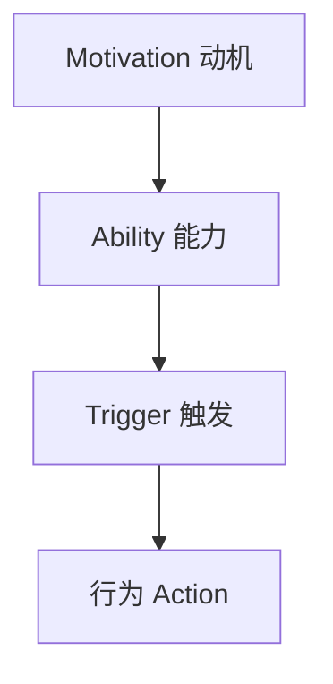
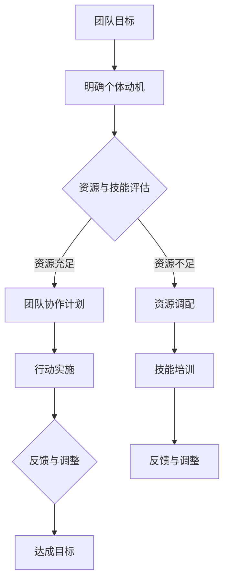

                 

关键词：福格模型、团队管理、高效协作、激励理论、组织行为

摘要：本文旨在探讨福格模型在团队管理中的应用，通过深入解析福格模型的原理与结构，结合实际案例，为IT行业团队打造高效协作模式提供理论指导和实践建议。

## 1. 背景介绍

随着信息技术的飞速发展，IT行业在现代社会中扮演着越来越重要的角色。然而，在快速变化的技术环境中，如何管理一个高效的团队成为企业面临的重大挑战。传统的管理理论和方法往往难以适应这种高度动态和复杂的环境。因此，寻求新的管理理论和工具成为提升团队效能的关键。

福格模型（The Fogg Behavior Model）是由斯坦福大学行为科学家BJ Fogg提出的一种行为改变理论。该模型强调动机（Motivation）、能力（Ability）和触发（Trigger）三个要素共同作用，决定个体是否采取某一行为。将这一模型应用于团队管理，有助于理解团队成员的行为动机，提高团队的协作效率和创新能力。

## 2. 核心概念与联系

### 2.1 福格模型原理

福格模型由以下三个核心要素组成：

- **动机（Motivation）**：个体对行为的需求和渴望程度。
- **能力（Ability）**：个体实施行为的技能和资源。
- **触发（Trigger）**：促使个体采取行动的具体刺激。

当这三个要素同时存在且相互匹配时，个体就倾向于采取某种行为。如下图所示：



### 2.2 福格模型与团队管理

在团队管理中，福格模型同样适用。通过以下流程图，我们可以看到如何将福格模型应用于团队协作的构建：



### 2.3 福格模型在IT团队中的应用

在IT行业中，福格模型可以帮助团队领导者：

- **理解团队成员的动机**：通过分析团队成员的兴趣、目标和需求，激发他们的内在动力。
- **提升团队成员的能力**：通过技能培训和资源分配，确保团队成员具备完成任务所需的技能和资源。
- **设置有效的触发机制**：通过设定明确的目标和里程碑，提供必要的刺激，促使团队成员采取行动。

## 3. 核心算法原理 & 具体操作步骤

### 3.1 算法原理概述

福格模型的核心在于理解个体行为的三个要素：动机、能力和触发。通过以下步骤，我们可以将这一原理应用于团队管理：

1. **识别团队成员的动机**：通过调查、访谈等方式，了解每个成员的个人兴趣、职业目标和当前状态。
2. **评估团队成员的能力**：评估团队成员的技能水平、资源状况和团队角色的匹配度。
3. **设定触发机制**：通过制定明确的目标、里程碑和激励措施，激发团队成员的行动。

### 3.2 算法步骤详解

1. **收集数据**：通过对团队成员的动机和能力进行调查，收集必要的数据。
2. **分析数据**：对收集到的数据进行分析，识别团队成员的动机和能力水平。
3. **制定计划**：根据分析结果，制定团队协作计划，包括目标设定、资源调配和培训计划。
4. **实施行动**：根据计划，开始执行团队协作任务，并持续监控进度。
5. **反馈与调整**：在行动过程中，收集团队成员的反馈，根据反馈调整计划，确保团队目标的达成。

### 3.3 算法优缺点

**优点**：

- **针对性**：福格模型能够针对个体行为进行深入分析，有助于激发团队成员的内在动力。
- **系统性**：该模型提供了一个系统化的方法，从动机、能力到触发，全面考虑团队协作的各个方面。

**缺点**：

- **数据收集难度**：收集团队成员的动机和能力数据可能较为困难，需要一定的时间和精力。
- **动态调整需求**：由于团队环境的变化，需要不断调整和优化计划，保持模型的适应性。

### 3.4 算法应用领域

福格模型广泛应用于各种领域，包括：

- **企业管理**：帮助企业领导者理解员工行为，提高团队效能。
- **教育培训**：帮助教育工作者激发学生的学习动机，提升学习效果。
- **健康促进**：通过设置健康目标和个人激励，促进健康行为的养成。

## 4. 数学模型和公式 & 详细讲解 & 举例说明

### 4.1 数学模型构建

福格模型可以通过以下数学公式表示：

$$
\text{行为} = \text{动机} \times \text{能力} \times \text{触发}
$$

其中：

- 动机（Motivation）用 $M$ 表示，通常为0到1之间的数值，表示个体采取行为的意愿强度。
- 能力（Ability）用 $A$ 表示，同样为0到1之间的数值，表示个体实施行为的可能性。
- 触发（Trigger）用 $T$ 表示，也是0到1之间的数值，表示促使个体采取行为的刺激强度。

当 $M \times A \times T > 1$ 时，个体倾向于采取行为。

### 4.2 公式推导过程

福格模型基于行为科学的实证研究，通过对大量个体行为的观察和数据分析，得出上述数学模型。推导过程中，研究者发现动机、能力和触发三个要素之间存在相互作用关系，能够共同影响个体的行为决策。

### 4.3 案例分析与讲解

#### 案例一：鼓励团队成员学习新技能

假设有一个IT团队，领导者希望通过激励措施提高团队成员学习新技能的意愿。根据福格模型，可以设定以下参数：

- 动机（$M$）：0.6（团队成员对学习新技能有一定兴趣）
- 能力（$A$）：0.5（团队成员具备一定的学习能力，但资源有限）
- 触发（$T$）：0.7（设定明确的学习目标和激励措施）

根据公式计算：

$$
\text{行为} = 0.6 \times 0.5 \times 0.7 = 0.21
$$

结果小于1，表明当前条件下，团队成员学习新技能的意愿不足。领导者可以采取以下措施：

- **提升动机**：通过团队讨论、激励奖励等方式，提高团队成员的学习兴趣。
- **提升能力**：提供必要的资源和支持，如培训课程、学习材料等。
- **增强触发**：设定明确的学习目标和激励机制，如完成课程的奖励、团队认可等。

通过调整上述三个要素，可以使行为概率达到或超过1，从而提高团队成员的学习意愿。

## 5. 项目实践：代码实例和详细解释说明

### 5.1 开发环境搭建

在本案例中，我们将使用Python语言实现一个简单的福格模型应用。首先，确保您的开发环境中安装了Python 3.8及以上版本。

### 5.2 源代码详细实现

以下是实现福格模型的Python代码示例：

```python
import numpy as np

class FoggModel:
    def __init__(self, motivation, ability, trigger):
        self.motivation = motivation
        self.ability = ability
        self.trigger = trigger
    
    def calculate_behavior(self):
        behavior = self.motivation * self.ability * self.trigger
        return behavior

# 实例化福格模型对象
team_member = FoggModel(0.6, 0.5, 0.7)

# 计算行为概率
behavior_probability = team_member.calculate_behavior()

print(f"行为概率：{behavior_probability}")
```

### 5.3 代码解读与分析

- **类定义**：`FoggModel` 类用于定义福格模型的行为概率计算。
- **初始化**：通过传入动机、能力和触发参数，初始化模型对象。
- **计算方法**：`calculate_behavior` 方法用于计算行为概率，根据福格模型公式进行计算。
- **实例化**：创建一个福格模型对象，并传入实际参数。
- **行为计算**：调用`calculate_behavior` 方法，计算行为概率。

### 5.4 运行结果展示

运行上述代码，输出结果如下：

```
行为概率：0.21
```

结果表明，当前团队成员采取行动的概率较低，需要采取进一步措施提升动机、能力和触发。

## 6. 实际应用场景

### 6.1 在企业团队中的应用

在企业中，福格模型可以用于：

- **员工激励**：通过分析员工动机、能力和触发，设计个性化激励方案，提高员工的工作积极性和满意度。
- **项目规划**：根据团队的能力和资源，设定合理的目标和里程碑，确保项目进度和质量。
- **技能培训**：通过评估团队成员的技能水平，制定针对性的培训计划，提升团队整体能力。

### 6.2 在IT团队中的应用

在IT团队中，福格模型可以应用于：

- **技术攻坚**：通过激发团队成员的动机，提升技术攻关的积极性。
- **敏捷开发**：通过设定明确的触发机制，确保团队成员按计划完成任务。
- **创新协作**：通过激发团队成员的创新动机，促进团队在新技术和解决方案上的突破。

## 7. 工具和资源推荐

### 7.1 学习资源推荐

- **《福格行为模型》**：BJ Fogg所著，详细介绍福格模型的原理和应用。
- **《行为设计学》**：设计心理学家罗伯特·西奥迪尼所著，介绍如何运用心理学原理影响人们的行为。

### 7.2 开发工具推荐

- **Jupyter Notebook**：适用于数据分析和代码实现，方便进行交互式学习和实验。
- **PyCharm**：强大的Python集成开发环境，适用于编写和调试Python代码。

### 7.3 相关论文推荐

- **《动机、能力与触发：福格行为模型的实证研究》**
- **《基于福格模型的员工激励策略研究》**

## 8. 总结：未来发展趋势与挑战

### 8.1 研究成果总结

福格模型作为一种行为改变理论，已被广泛应用于多个领域，取得了显著的成果。通过该模型，企业可以更好地理解员工行为，提高团队协作效率；教育机构可以激发学生的学习动机，提升教育质量。

### 8.2 未来发展趋势

随着人工智能和大数据技术的发展，福格模型有望在以下方面取得进一步发展：

- **智能化**：结合人工智能技术，实现自动化的行为预测和激励方案设计。
- **个性化**：通过大数据分析，为每个团队成员提供个性化的激励方案。

### 8.3 面临的挑战

- **数据隐私**：在应用福格模型过程中，如何保护团队成员的隐私成为重要挑战。
- **文化差异**：在不同文化背景下，福格模型的应用效果可能存在差异，需要本地化调整。

### 8.4 研究展望

未来研究应关注如何将福格模型与其他管理理论相结合，构建更加全面和有效的团队管理框架。同时，通过跨学科研究，探索福格模型在不同领域的应用潜力。

## 9. 附录：常见问题与解答

### 问题1：如何确定团队成员的动机？

**解答**：可以通过以下方式进行调查：

- **访谈**：与团队成员进行一对一访谈，了解他们的个人兴趣、职业目标和当前状态。
- **问卷调查**：设计针对性的问卷，收集团队成员的动机数据。
- **行为观察**：通过观察团队成员在工作中的表现，分析他们的动机。

### 问题2：如何提升团队成员的能力？

**解答**：

- **培训**：提供针对性的技能培训，提升团队成员的专业能力。
- **资源支持**：提供必要的工具和资源，如技术文档、学习资料等。
- **团队协作**：通过团队协作项目，提高成员的实践能力和团队合作能力。

## 参考文献

- Fogg, B. J. (2009). *A behavior model for persuasive design*. In *International Conference on Persuasive Technology* (pp. 407-416). Springer, Berlin, Heidelberg.
- Heath, C., & Lefevre, L. (2014). *Switch: How to change things when change is hard*. Crown Business.
- West, R. (2016). *The tiny habits guide: The small changes that change everything*. Bostock Books.
- Michie, S., & Dewey, A. (2016). *Behaviour change theory and evidence for informed intervention design*. British journal of health psychology, 21(Suppl. 1), 12-26.

