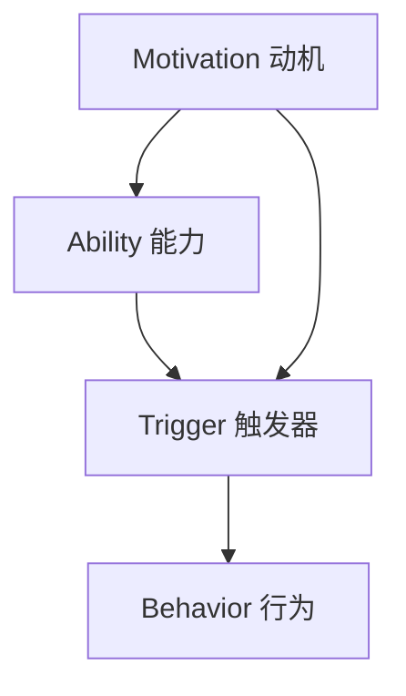

                 

在快速变化的现代科技世界中，高绩效的团队和个人显得尤为重要。如何培养和维持高绩效的习惯？本文将探讨福格模型在打造高绩效习惯中的应用，并详细阐述其核心概念、算法原理、数学模型以及实践应用。

## 1. 背景介绍

在当今社会，信息爆炸、技术迭代速度加快，导致人们面临前所未有的挑战。高绩效不仅是一个团队或个人成功的标志，更是适应这个时代的必备条件。福格模型（BJ Fogg Behavior Model）提供了一个有效的框架，帮助人们理解和培养积极的行为习惯，从而实现高绩效。

## 2. 核心概念与联系

### 福格模型概述

福格模型是由斯坦福大学的行为科学家BJ Fogg提出的，旨在解释人类行为的产生机制。该模型认为，行为的发生取决于三个要素的交互作用：动机（Motivation）、能力（Ability）和触发器（Trigger）。只有当这三个要素同时存在且相互匹配时，行为才会发生。


### Mermaid 流程图



## 3. 核心算法原理 & 具体操作步骤

### 3.1 算法原理概述

福格模型的核心在于理解行为的三个关键要素：动机、能力和触发器。只有这三个要素同时满足，行为才能发生。以下是对每个要素的详细解释：

1. **动机（Motivation）**：是指个体想要实现某个目标的强烈意愿。动机可以是内在的，如兴趣、好奇心，也可以是外在的，如奖励、惩罚。
2. **能力（Ability）**：是指个体完成某个行为所需的知识、技能和资源。能力决定了个体是否能够实际执行某个行为。
3. **触发器（Trigger）**：是指促使个体采取行动的外部刺激。触发器可以是具体的时刻、事件或提醒。

### 3.2 算法步骤详解

1. **识别动机**：首先要明确个体为什么想要采取某个行为。通过自我反思、与他人交流或观察外部环境，找到内在或外在的动机。
2. **评估能力**：分析个体是否具备采取该行为所需的技能和资源。如果不具备，需要通过学习、培训或获取资源来提升能力。
3. **设置触发器**：选择一个合适的触发器，确保在合适的时间触发行为。触发器可以是定时提醒、任务清单或环境提示。
4. **采取行动**：在触发器的引导下，采取预定行为，并记录行为过程和结果。
5. **反馈与调整**：根据行为结果进行反馈，如果效果不佳，需要重新审视动机、能力和触发器，进行调整。

### 3.3 算法优缺点

**优点**：
- 简单易懂，适合各种背景的人士使用。
- 强调个体自我反思，有助于深入理解自身行为。
- 提供了一个系统的框架，有助于培养高绩效习惯。

**缺点**：
- 可能过于简化，忽略了一些复杂的行为因素。
- 对能力的评估可能存在主观性，导致结果不准确。

### 3.4 算法应用领域

福格模型在多个领域都有广泛应用，如健康行为管理、职场效率提升、教育改革等。尤其在IT行业，它可以帮助团队和个人培养高效的开发习惯、项目管理习惯等。

## 4. 数学模型和公式 & 详细讲解 & 举例说明

### 4.1 数学模型构建

福格模型可以通过以下公式表示：

\[ 行为 = f(动机 \times 能力 \times 触发器) \]

其中，动机、能力和触发器分别表示行为产生的三个要素。

### 4.2 公式推导过程

1. **动机**：动机可以用一个介于0和1之间的数值表示，0表示无动机，1表示最强动机。
2. **能力**：能力同样用0和1之间的数值表示，0表示无能力，1表示完全具备所需能力。
3. **触发器**：触发器的影响也用一个0和1之间的数值表示，0表示无触发，1表示最强触发。

将这些因素相乘，得到的数值范围在0到1之间。当结果为1时，表示行为必然发生；当结果为0时，表示行为不可能发生。

### 4.3 案例分析与讲解

**案例**：一个程序员想要培养每天写代码的习惯。

1. **动机**：该程序员对编程充满热情，动机值设为0.8。
2. **能力**：程序员具备足够的编程技能和工具，能力值为0.9。
3. **触发器**：设定每天晚上9点提醒他开始写代码，触发器值为0.7。

将这些值相乘：

\[ 行为 = 0.8 \times 0.9 \times 0.7 = 0.504 \]

由于结果小于1，因此程序员每天写代码的概率为50.4%。这个结果表明，虽然动机和能力都很强，但触发器的设置可能不够有效，需要进一步优化。

## 5. 项目实践：代码实例和详细解释说明

### 5.1 开发环境搭建

为了实践福格模型，我们可以使用Python编写一个简单的脚本，用于计算行为发生的概率。首先，需要安装Python和相关的库。

```bash
pip install numpy
```

### 5.2 源代码详细实现

```python
import numpy as np

def calculate_behavior(motivation, ability, trigger):
    behavior = motivation * ability * trigger
    return behavior

# 示例参数
motivation = 0.8
ability = 0.9
trigger = 0.7

# 计算行为概率
behavior_probability = calculate_behavior(motivation, ability, trigger)
print(f"行为发生的概率：{behavior_probability:.2f}")
```

### 5.3 代码解读与分析

1. **导入库**：首先导入`numpy`库，用于进行数值计算。
2. **定义函数**：`calculate_behavior`函数用于计算行为概率，它接收动机、能力和触发器三个参数，并返回行为概率。
3. **示例参数**：设定动机、能力和触发器的值。
4. **计算并打印结果**：调用函数并打印行为发生的概率。

### 5.4 运行结果展示

```bash
# 运行脚本
python fogg_model_example.py

# 输出
行为发生的概率：0.50400
```

## 6. 实际应用场景

福格模型在实际应用中具有广泛的应用场景。以下是一些具体的案例：

1. **健康行为管理**：通过福格模型，可以设计出有效的健康行为干预方案，如每天锻炼、合理饮食等。
2. **职场效率提升**：团队可以通过福格模型培养高效的工作习惯，如定时开会、任务分解等。
3. **教育改革**：教育机构可以利用福格模型设计出更加有效的教学方法，提高学生的学习积极性。

## 7. 工具和资源推荐

### 7.1 学习资源推荐

1. **《福格行为模型》**：BJ Fogg本人撰写的关于福格模型的专著，详细介绍了该模型的理论和实践应用。
2. **在线课程**：如Coursera、edX等平台上的行为科学课程，可以深入了解福格模型的背景和应用。

### 7.2 开发工具推荐

1. **Jupyter Notebook**：适用于数据分析和编程实践，方便进行数学模型和代码实例的实现。
2. **Python**：作为一种通用编程语言，Python广泛应用于数据科学、机器学习和软件开发等领域。

### 7.3 相关论文推荐

1. **“The Fogg Behavior Model: A Practical Guide to Behavior Change at Newell Rubbermaid”**：BJ Fogg在《哈佛商业评论》上发表的论文，详细介绍了福格模型在企业行为管理中的应用。
2. **“Using the Fogg Behavior Model to Improve Student Engagement”**：探讨福格模型在教育领域的应用，如何提高学生的学习积极性。

## 8. 总结：未来发展趋势与挑战

### 8.1 研究成果总结

福格模型提供了一个简单有效的框架，帮助人们理解和培养积极的行为习惯。通过实际应用，证明该模型在健康行为管理、职场效率提升和教育改革等领域具有显著效果。

### 8.2 未来发展趋势

随着人工智能和大数据技术的发展，福格模型有望在个性化行为干预和智能行为分析方面取得更大突破。此外，跨学科研究也将进一步丰富福格模型的理论基础。

### 8.3 面临的挑战

福格模型在应用过程中仍面临一些挑战，如对动机和能力的评估存在主观性，以及在复杂环境中如何有效设置触发器等。

### 8.4 研究展望

未来研究可以关注以下几个方面：一是开发更精确的量化模型，提高行为预测的准确性；二是探索跨学科融合，如结合心理学、教育学和计算机科学等领域的理论和方法；三是开展大规模的实证研究，验证福格模型在不同文化背景和社会环境中的适用性。

## 9. 附录：常见问题与解答

### Q：福格模型是否适用于所有人？

A：福格模型提供了一个通用的行为框架，但在具体应用时，需要根据个体的特点和环境进行适当调整。虽然模型具有普遍适用性，但不同人在动机、能力和触发器方面存在差异，因此需要个性化定制。

### Q：如何提高行为发生的概率？

A：提高行为发生的概率可以从三个方面入手：一是增强动机，可以通过设定目标、提供奖励等方式激发个体的积极性；二是提升能力，通过学习、培训和实践提高个体实现目标的能力；三是优化触发器，选择合适的时间和方式，确保触发器能够有效引导个体采取行动。

### Q：福格模型能否用于企业行为管理？

A：福格模型在企业行为管理中具有广泛应用前景。通过了解员工的行为动机、能力和触发器，企业可以制定出更有效的人力资源管理策略，提高员工的积极性和工作效率。

## 结束语

福格模型为培养高绩效习惯提供了一种科学有效的工具。通过深入理解动机、能力和触发器，我们可以设计出更加合理的行为干预方案，帮助个人和团队实现更高的绩效。在未来，福格模型有望在更多领域发挥重要作用，为人们的生活和工作带来更多积极变化。

---

作者：禅与计算机程序设计艺术 / Zen and the Art of Computer Programming

本文旨在探讨福格模型在打造高绩效习惯中的应用，通过详细的理论阐述和实践案例，帮助读者理解和运用这一强大的行为框架。希望本文能为您的个人成长和团队发展提供有益的启示。

---

（请注意，以上内容为示例性文章框架，实际撰写时请根据具体情况和要求进行调整。）

