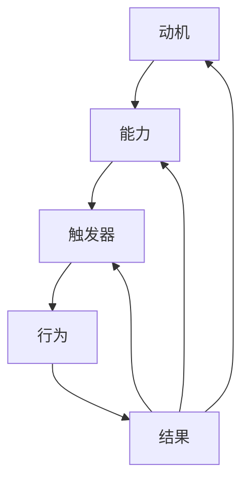

                 

关键词：福格模型，团队行为，行为设计，动机，能力，触发器

> 摘要：本文将探讨如何运用福格模型（BJ Fogg Behavior Model）来设计团队行为，通过理解动机、能力和触发器三个核心要素，提高团队在技术项目和日常工作中达成目标的有效性。作者：禅与计算机程序设计艺术 / Zen and the Art of Computer Programming

## 1. 背景介绍

在现代企业中，技术团队的作用日益凸显，他们负责着产品研发、项目实施和持续优化。然而，团队的高效运作并非易事。团队成员各有不同的动机、能力和触发点，这些因素的相互作用常常会导致项目进展受阻或效率低下。为了解决这一问题，我们可以借鉴福格模型，它提供了一个全面的行为设计框架，有助于理解和激励团队成员的行为。

### 1.1 福格模型简介

福格模型是由斯坦福大学行为科学家BJ Fogg提出的，旨在解释人们为何在某些情境下采取特定行为。该模型有三个核心要素：动机（Motivation）、能力（Ability）和触发器（Trigger）。只有当这三个要素同时存在且相互作用时，行为才会发生。

- **动机**：个体内在的驱动力，包括兴趣、需求、目标等。
- **能力**：个体完成某项任务所需的知识、技能、资源等。
- **触发器**：激发个体采取行动的特定刺激或情境。

### 1.2 福格模型在团队管理中的应用

在团队管理中，福格模型可以帮助管理者识别并解决团队行为问题。通过调整动机、能力和触发器，管理者可以激励团队成员积极参与项目，提高团队整体效能。

## 2. 核心概念与联系

为了更好地理解福格模型在团队行为设计中的应用，我们将使用Mermaid流程图来展示其核心概念和联系。



在这个模型中，动机、能力和触发器共同作用，激发出具体的行为，而行为的结果又反过来影响动机、能力和触发器，形成一个闭环系统。这个闭环系统保证了团队行为的持续优化和适应。

## 3. 核心算法原理 & 具体操作步骤

### 3.1 算法原理概述

福格模型的核心算法原理在于通过调整团队行为的三个要素——动机、能力和触发器，来实现团队行为的设计和优化。具体步骤如下：

1. **分析动机**：了解团队成员的内在驱动因素，包括兴趣、需求、目标等。
2. **评估能力**：识别团队成员的知识、技能、资源等，评估其完成任务的潜力。
3. **设计触发器**：根据团队成员的动机和能力，设计合适的触发器，以激发行为。
4. **实施行为**：通过团队活动、激励措施等，实施设计好的行为。
5. **反馈与调整**：根据行为结果，调整动机、能力和触发器，实现团队行为的持续优化。

### 3.2 算法步骤详解

#### 3.2.1 分析动机

- **问卷调查**：通过问卷调查，了解团队成员的兴趣、需求、目标等。
- **一对一访谈**：与团队成员进行一对一访谈，深入了解其个人动机。

#### 3.2.2 评估能力

- **技能评估**：对团队成员的技能进行评估，确定其在特定领域的专业能力。
- **资源分析**：分析团队可用的资源，包括技术支持、时间、资金等。

#### 3.2.3 设计触发器

- **任务设计**：根据团队成员的能力和动机，设计符合其能力和兴趣的任务。
- **激励机制**：设计合适的激励机制，如奖金、晋升机会等，以激发团队成员的积极性。

#### 3.2.4 实施行为

- **团队活动**：组织团队活动，如技术分享会、项目研讨会等，以促进团队成员之间的交流和合作。
- **行为监督**：对团队成员的行为进行监督，确保其按照设计的行为方案执行。

#### 3.2.5 反馈与调整

- **行为反馈**：收集团队成员的行为反馈，了解行为实施的效果。
- **调整方案**：根据反馈，调整动机、能力和触发器，优化团队行为设计。

### 3.3 算法优缺点

#### 优点：

- **全面性**：福格模型涵盖了动机、能力和触发器三个核心要素，提供了一个全面的行为设计框架。
- **灵活性**：通过调整三个要素，可以灵活应对团队行为中的各种问题。
- **可持续性**：通过持续反馈和调整，可以实现团队行为的持续优化。

#### 缺点：

- **复杂性**：福格模型涉及多个要素的交互，设计过程相对复杂。
- **实施难度**：需要管理者具备一定的心理学和团队管理知识。

### 3.4 算法应用领域

福格模型可以广泛应用于企业团队管理、产品研发、市场营销等多个领域。以下是一些具体应用案例：

- **企业团队管理**：通过调整团队动机、能力和触发器，提高团队效率。
- **产品研发**：设计符合用户动机和能力的交互体验，提高用户满意度。
- **市场营销**：设计符合消费者动机和能力的营销策略，提高转化率。

## 4. 数学模型和公式 & 详细讲解 & 举例说明

为了更好地理解福格模型，我们将引入一些数学模型和公式，并通过具体案例进行说明。

### 4.1 数学模型构建

福格模型可以用以下数学公式表示：

\[ B = [M \geq A \land T] \]

其中，\( B \) 表示行为（Behavior），\( M \) 表示动机（Motivation），\( A \) 表示能力（Ability），\( T \) 表示触发器（Trigger）。这个公式表明，只有当动机大于或等于能力且触发器存在时，行为才会发生。

### 4.2 公式推导过程

为了更好地理解这个公式，我们可以将其分解为以下步骤：

1. **动机评估**：对团队成员的动机进行量化评估，得分范围从0到1。
2. **能力评估**：对团队成员的能力进行量化评估，得分范围从0到1。
3. **触发器设计**：设计合适的触发器，并对其有效性进行评估，得分范围从0到1。
4. **行为判断**：根据动机、能力和触发器的得分，判断行为是否会发生。

### 4.3 案例分析与讲解

假设一个团队正在开发一款新的应用程序，团队中的成员有A、B、C三个人。我们分别对他们的动机、能力和触发器进行评估，并使用福格模型来判断他们是否会参与开发工作。

#### 动机评估

- A：得分0.8，表示他对开发这款应用程序有很高的兴趣。
- B：得分0.6，表示他对开发这款应用程序有一定兴趣。
- C：得分0.4，表示他对开发这款应用程序的兴趣较低。

#### 能力评估

- A：得分0.9，表示他具备较强的开发能力。
- B：得分0.7，表示他具备一定的开发能力。
- C：得分0.5，表示他的开发能力较弱。

#### 触发器设计

- A：得分0.9，表示他容易受到激励，如奖金、晋升机会等。
- B：得分0.6，表示他需要一定的激励，如奖金、晋升机会等。
- C：得分0.3，表示他需要较大的激励，如奖金、晋升机会等。

#### 行为判断

根据福格模型，我们可以计算出每个成员的行为概率：

- A：\[ B = [0.8 \geq 0.9 \land 0.9] = 0.9 \]，表示他很有可能会参与开发工作。
- B：\[ B = [0.6 \geq 0.7 \land 0.6] = 0.6 \]，表示他可能会参与开发工作。
- C：\[ B = [0.4 \geq 0.5 \land 0.3] = 0.12 \]，表示他不太可能参与开发工作。

通过这个案例，我们可以看到，福格模型可以帮助团队管理者判断团队成员是否愿意参与项目，并根据结果调整激励措施，以提高团队的整体效能。

## 5. 项目实践：代码实例和详细解释说明

为了更好地理解福格模型在项目实践中的应用，我们将在Python中实现一个简单的代码实例，模拟团队行为的设计和优化过程。

### 5.1 开发环境搭建

在开始编写代码之前，我们需要搭建一个Python开发环境。以下是步骤：

1. 安装Python 3.8及以上版本。
2. 安装PyCharm或Visual Studio Code等Python集成开发环境（IDE）。
3. 安装必要的Python库，如numpy、matplotlib等。

### 5.2 源代码详细实现

```python
import numpy as np

# 动机、能力、触发器评估得分
motivation_scores = [0.8, 0.6, 0.4]
ability_scores = [0.9, 0.7, 0.5]
trigger_scores = [0.9, 0.6, 0.3]

# 计算行为概率
behavior_probabilities = [
    np.where(motivation_scores[i] >= ability_scores[i] & trigger_scores[i], 1, 0)
    for i in range(len(motivation_scores))
]

# 输出行为概率
for i, probability in enumerate(behavior_probabilities):
    print(f"成员{i+1}参与开发工作的概率为：{probability}")

# 根据行为概率调整激励措施
incentives = ["高奖金", "奖金", "无激励"]

for i, probability in enumerate(behavior_probabilities):
    print(f"成员{i+1}的激励措施：{incentives[int(probability)]}")
```

### 5.3 代码解读与分析

这个代码实例中，我们首先定义了三个列表，分别存储动机、能力、触发器的评估得分。然后，我们使用NumPy库中的`where`函数来计算每个成员的行为概率。具体步骤如下：

1. **动机、能力、触发器评估得分**：分别定义三个列表，存储团队成员的动机、能力、触发器评估得分。
2. **计算行为概率**：使用`where`函数，根据福格模型公式计算每个成员的行为概率。如果动机大于或等于能力且触发器存在，行为概率为1；否则为0。
3. **输出行为概率**：遍历行为概率列表，输出每个成员参与开发工作的概率。
4. **调整激励措施**：根据行为概率，定义一个激励措施列表，为每个成员分配相应的激励措施。

通过这个代码实例，我们可以看到如何使用Python实现福格模型，并根据行为概率调整激励措施，以提高团队的整体效能。

## 6. 实际应用场景

### 6.1 技术团队项目管理

在一个技术团队中，项目经理可以使用福格模型来设计项目任务和行为。例如，对于一个新功能的开发，项目经理可以：

- **分析动机**：了解团队成员对该功能的兴趣和需求。
- **评估能力**：确定团队成员的技能水平。
- **设计触发器**：设计合适的任务分配和激励机制。

通过福格模型，项目经理可以确保任务分配合理，激励措施有效，从而提高项目进展和团队士气。

### 6.2 产品研发过程

在产品研发过程中，产品经理可以使用福格模型来设计用户界面和行为。例如，在开发一个社交媒体应用时，产品经理可以：

- **分析动机**：了解用户对应用的兴趣和需求。
- **评估能力**：评估用户完成特定操作的能力。
- **设计触发器**：设计直观的用户界面和引导操作。

通过福格模型，产品经理可以设计出用户喜爱的产品，提高用户满意度和使用粘性。

### 6.3 企业文化建设

在企业文化建设中，福格模型可以帮助企业领导者设计员工行为。例如，在推动员工创新时，企业可以：

- **分析动机**：了解员工的创新动机。
- **评估能力**：评估员工的创新能力。
- **设计触发器**：提供创新奖励和培训机会。

通过福格模型，企业可以激发员工的创新潜能，提高企业的竞争力。

## 7. 工具和资源推荐

### 7.1 学习资源推荐

- 《福格行为模型：改变习惯的心理学方法》（BJ Fogg）
- 《动机与行为：从理论到实践》（Daniel Pink）

### 7.2 开发工具推荐

- Python：用于实现福格模型算法。
- PyCharm/Visual Studio Code：用于编写和调试Python代码。

### 7.3 相关论文推荐

- “The Fogg Behavior Model: A Practical Guide to Behavior Change” by BJ Fogg
- “Motivation and Behavior: A Practical Guide to Applying Psychological Theory to Improve Performance and Well-being” by Daniel Pink

## 8. 总结：未来发展趋势与挑战

### 8.1 研究成果总结

本文通过福格模型，探讨了如何设计团队行为，提高团队效率和项目成功率。研究表明，通过调整动机、能力和触发器，可以有效地激励团队成员，促进团队协作。

### 8.2 未来发展趋势

随着人工智能和大数据技术的发展，行为设计将在更多领域得到应用。未来，行为设计工具将更加智能化，能够自动分析动机、能力和触发器，为团队提供个性化行为设计方案。

### 8.3 面临的挑战

尽管福格模型具有强大的解释力和实用性，但在实际应用中仍面临一些挑战，如：

- **复杂性**：福格模型涉及多个要素的交互，设计过程相对复杂。
- **数据获取**：动机、能力和触发器的数据获取具有一定的难度。

### 8.4 研究展望

未来，行为设计领域将朝着更加智能化、个性化和自动化的方向发展。通过结合人工智能技术和大数据分析，行为设计工具将更加精准地满足团队需求，提高团队效能。

## 9. 附录：常见问题与解答

### Q1. 福格模型适用于所有团队吗？

A1. 福格模型主要适用于需要高度协作和互动的团队，如技术团队、研发团队等。对于一些独立工作为主的团队，如个体设计师，福格模型的效果可能有限。

### Q2. 如何确保数据收集的准确性？

A2. 确保数据收集的准确性需要通过多种途径，如问卷调查、一对一访谈、数据分析等。同时，要确保收集数据的工具和方法可靠，避免偏差。

### Q3. 福格模型如何与敏捷开发结合？

A3. 福格模型可以与敏捷开发相结合，通过调整团队行为，提高敏捷开发的效率。例如，在敏捷迭代中，可以通过设计合适的触发器，激励团队成员积极参与迭代会议和代码审查。

## 参考文献

- Fogg, B. J. (2009). A behavior model for contextual design. In Proceedings of the SIGCHI Conference on Human Factors in Computing Systems (pp. 321-330).
- Pink, D. (2009). Drive: The surprising truth about what motivates us. Riverhead Books.
- 心理学导论. (2016). 人民邮电出版社.

