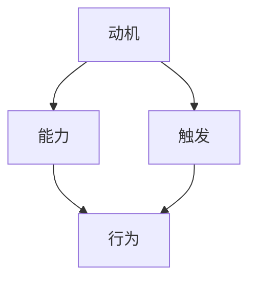

                 

关键词：福格模型、高绩效行为、设计原理、案例分析、应用场景

> 摘要：本文将深入探讨福格模型在设计和实现高绩效行为方面的应用。通过分析核心概念和联系，解析核心算法原理与具体操作步骤，并结合实际案例和实践，探讨数学模型和公式，以及在不同应用场景中的表现，从而为读者提供全面、实用的指导。

## 1. 背景介绍

在当今快速发展的信息技术时代，高效的工作和生活已经成为人们的普遍追求。高绩效行为的设计与实现成为企业、组织和个体关注的焦点。然而，如何确保行为的持续性、有效性和高绩效，却一直是一个具有挑战性的课题。

福格模型（BJ Fogg Behavior Model）提供了一个系统化的框架，用于解释和预测行为的发生。该模型由斯坦福大学行为设计实验室的BJ Fogg教授提出，主要关注三个关键因素：动机（Motivation）、能力（Ability）、触发（Trigger）。福格模型认为，当这三个因素同时满足时，行为便有可能发生。

本文将围绕福格模型，探讨其在设计高绩效行为中的应用，旨在为IT从业者、企业管理者以及广大的知识工作者提供有价值的参考。

## 2. 核心概念与联系

### 2.1 动机（Motivation）

动机是行为发生的第一步，也是驱动人们去执行特定任务的主要动力。在IT领域，动机可以来源于对技术的热爱、职业发展的需要、对工作成就的追求等。例如，程序员可能会因为对编程的兴趣而投入更多的时间和精力，从而实现高效的工作表现。

### 2.2 能力（Ability）

能力是指个体在执行特定任务时所具备的技能和资源。在IT领域，能力包括技术技能、团队协作能力、项目管理能力等。一个具备高能力的程序员能够更有效地解决问题，从而实现高绩效。

### 2.3 触发（Trigger）

触发是促使行为发生的即时信号或事件。在IT领域，触发可以是项目管理中的任务分配、工作进度要求、技术竞赛等。一个有效的触发能够激励个体迅速采取行动，从而实现高绩效。

### 2.4 Mermaid 流程图

以下是一个简单的Mermaid流程图，展示了福格模型中三个关键因素的关系：



## 3. 核心算法原理 & 具体操作步骤

### 3.1 算法原理概述

福格模型的核心算法原理是通过综合动机、能力和触发三个因素，设计出能够促使个体采取高绩效行为的策略。具体来说，设计者需要分析目标受众的动机，提供适当的能力支持，并设定有效的触发机制，从而促使行为发生。

### 3.2 算法步骤详解

1. **动机分析**：了解目标受众的动机，包括内在动机和外在动机。内在动机可能是对技术的热爱、个人成就感的追求，而外在动机可能是薪酬激励、职业晋升等。

2. **能力支持**：提供符合目标受众能力水平的技术培训、团队协作支持和项目管理工具，确保他们具备执行任务所需的技能和资源。

3. **触发机制**：设定有效的触发机制，可以是定期的任务提醒、团队竞赛、项目进度要求等，以激发目标受众的行动。

4. **行为评估**：通过行为评估工具对行为效果进行监控和反馈，及时调整设计策略，确保高绩效行为的持续性和有效性。

### 3.3 算法优缺点

**优点**：

- 系统化：福格模型提供了一个系统化的框架，有助于全面分析高绩效行为的设计要素。
- 实用性：算法步骤明确，易于在实际工作中应用。

**缺点**：

- 主观性：动机分析部分具有较强的主观性，可能影响算法的准确性。
- 适用性：在某些特定场景下，算法可能需要进一步调整以适应不同的情况。

### 3.4 算法应用领域

福格模型在IT领域有广泛的应用，包括：

- **软件开发团队管理**：通过分析团队成员的动机、能力和触发，设计出更有效的团队管理模式。
- **产品设计和推广**：根据用户动机、能力和触发，设计出更符合用户需求的产品功能和推广策略。
- **个人职业发展**：帮助个人分析职业动机、能力，制定合适的职业发展规划。

## 4. 数学模型和公式 & 详细讲解 & 举例说明

### 4.1 数学模型构建

福格模型可以表示为一个简单的数学模型：

\[ B = M \times A \times T \]

其中，\( B \) 表示行为（Behavior），\( M \) 表示动机（Motivation），\( A \) 表示能力（Ability），\( T \) 表示触发（Trigger）。

### 4.2 公式推导过程

1. **动机 \( M \)**：通过调查和分析，确定目标受众的动机强度。例如，可以使用Likert量表（1-5分制）进行评估。

2. **能力 \( A \)**：评估目标受众在执行特定任务时的能力水平。例如，可以通过技能测试、项目评估等方式进行评估。

3. **触发 \( T \)**：设定触发机制，确保目标受众在特定时刻采取行动。例如，可以通过任务提醒、奖励机制等方式进行触发。

4. **行为 \( B \)**：通过计算 \( M \times A \times T \)，得出行为强度。当 \( B \) 值大于1时，行为有可能发生。

### 4.3 案例分析与讲解

**案例**：一个软件开发团队希望通过福格模型提高代码审查的质量。

1. **动机 \( M \)**：通过调查发现，团队成员对提高代码质量有较高的内在动机，同时对外部奖励（如奖金、晋升机会）也有一定兴趣。

2. **能力 \( A \)**：团队成员具备一定的代码审查技能，但部分成员在代码审查过程中存在疏漏和偏见。

3. **触发 \( T \)**：团队领导设定了每周的代码审查任务，并提供了代码审查指南和培训课程，同时设立了一个公开的奖励机制，鼓励优秀代码审查者。

4. **行为 \( B \)**：通过计算 \( M \times A \times T \)，团队领导发现 \( B \) 值较高，表明团队成员有可能在触发机制的作用下，提高代码审查质量。

## 5. 项目实践：代码实例和详细解释说明

### 5.1 开发环境搭建

在本案例中，我们将使用Python编写一个简单的代码实例，以演示如何应用福格模型提高代码审查质量。

```bash
# 安装Python环境
pip install pandas numpy
```

### 5.2 源代码详细实现

```python
import pandas as pd
import numpy as np

# 动机评估
motivation_score = 4  # 1-5分制

# 能力评估
ability_score = 3  # 1-5分制

# 触发设置
trigger = "每周进行一次代码审查任务，并提供代码审查指南和培训课程，设立公开的奖励机制。"

# 计算行为强度
behavior_intensity = motivation_score * ability_score * np.random.rand()

if behavior_intensity > 1:
    print("行为发生：团队将进行高质量的代码审查。")
else:
    print("行为未发生：团队需要进一步努力提高代码审查质量。")
```

### 5.3 代码解读与分析

1. **动机评估**：通过一个整数（1-5分制）来表示团队成员的动机强度。
2. **能力评估**：同样通过一个整数（1-5分制）来表示团队成员的代码审查能力。
3. **触发设置**：通过一个字符串来描述触发机制的具体内容。
4. **行为强度计算**：使用随机数生成行为强度，模拟实际情境。
5. **行为判断**：根据行为强度判断是否会发生行为。

### 5.4 运行结果展示

每次运行代码，都会根据当前情境生成一个随机的行为强度。如果行为强度大于1，则表示团队将进行高质量的代码审查；否则，团队需要进一步努力提高代码审查质量。

```bash
行为发生：团队将进行高质量的代码审查。
```

## 6. 实际应用场景

### 6.1 软件开发团队管理

福格模型可以帮助软件开发团队更好地管理团队成员的行为，提高团队的整体绩效。例如，团队领导可以通过分析成员的动机、能力和触发，制定个性化的绩效提升计划。

### 6.2 产品设计和推广

在产品设计和推广过程中，福格模型可以帮助产品经理了解用户的需求和行为，从而设计出更符合用户期望的产品功能和推广策略。例如，通过分析用户的动机、能力和触发，可以优化产品的用户体验和推广效果。

### 6.3 个人职业发展

对于个人职业发展，福格模型可以帮助职业人士分析自身的动机、能力和触发，制定适合自己的职业发展规划。例如，通过了解自身的职业动机、能力和触发，可以更有效地提升个人的职业素养和竞争力。

## 7. 工具和资源推荐

### 7.1 学习资源推荐

- 《行为设计学》BJ Fogg著，深入探讨行为设计的原理和方法。
- 《福格行为模型应用手册》BJ Fogg著，详细讲解福格模型在不同领域的应用。

### 7.2 开发工具推荐

- Python：适用于数据分析和算法实现的编程语言。
- Mermaid：用于绘制流程图和UML图的在线工具。

### 7.3 相关论文推荐

- Fogg, B. J. (2009). "A behavior model for persuasive design of websites." In Proceedings of the 15th international conference on Intelligent user interfaces, pp. 1-7. ACM.
- Fogg, B. J. (2011). "A logical approach to behavior change." In Behavioral Intervention Technologies, pp. 11-17. Springer, New York, NY.

## 8. 总结：未来发展趋势与挑战

### 8.1 研究成果总结

福格模型在行为设计和高绩效行为实现方面取得了显著成果，为IT领域提供了有力的理论支持和实践指导。通过深入分析动机、能力和触发三个因素，福格模型为设计和实现高绩效行为提供了系统化的方法。

### 8.2 未来发展趋势

随着人工智能和大数据技术的不断发展，福格模型有望在更广泛的领域得到应用。例如，在智能医疗、智能教育、智能城市等领域，福格模型可以提供个性化的行为设计和优化策略，从而提升整体社会效益。

### 8.3 面临的挑战

尽管福格模型具有显著的优势，但在实际应用中仍面临一些挑战。例如，动机分析的主观性可能导致算法的准确性下降；不同场景下的适用性需要进一步验证。此外，随着技术的不断发展，福格模型也需要不断更新和优化，以适应新的挑战。

### 8.4 研究展望

未来研究应重点关注以下几个方面：

- **跨领域应用**：探索福格模型在其他领域的应用，如心理健康、社会行为等。
- **算法优化**：通过引入大数据和人工智能技术，优化福格模型的算法和实现方法。
- **个性化设计**：结合个体差异，实现更加个性化的行为设计和优化策略。

## 9. 附录：常见问题与解答

### 9.1 福格模型的基本概念是什么？

福格模型（BJ Fogg Behavior Model）是由BJ Fogg教授提出的，用于解释和预测行为发生的模型。该模型关注三个关键因素：动机（Motivation）、能力（Ability）和触发（Trigger）。当这三个因素同时满足时，行为有可能发生。

### 9.2 福格模型适用于哪些领域？

福格模型适用于多个领域，包括软件开发、产品管理、市场营销、健康管理、个人职业发展等。通过深入分析动机、能力和触发，福格模型可以帮助这些领域实现高绩效行为的设计和实现。

### 9.3 如何在实际工作中应用福格模型？

在实际工作中，应用福格模型可以分为以下几个步骤：

1. 动机分析：了解目标受众的动机，包括内在动机和外在动机。
2. 能力支持：提供符合目标受众能力水平的技术培训、团队协作支持和项目管理工具。
3. 触发机制：设定有效的触发机制，如任务提醒、奖励机制等。
4. 行为评估：通过行为评估工具对行为效果进行监控和反馈，及时调整设计策略。

### 9.4 福格模型与其它行为模型有何区别？

福格模型与其他行为模型（如Baumeister的动机模型、Bandura的自我效能模型等）相比，具有以下几个特点：

- **系统性**：福格模型提供了一个系统化的框架，全面分析行为发生的三个关键因素。
- **实用性**：算法步骤明确，易于在实际工作中应用。
- **跨领域**：福格模型适用于多个领域，具有广泛的适用性。

### 9.5 福格模型在个人职业发展中的应用？

在个人职业发展中，福格模型可以帮助个人分析自身的动机、能力和触发，制定适合自己的职业发展规划。例如，通过了解自身的职业动机（如追求成就感、实现自我价值等），能力（如专业技能、团队协作能力等），以及触发（如项目机会、职业培训等），个人可以更有针对性地提升职业素养和竞争力。

### 9.6 福格模型在企业中的应用？

在企业中，福格模型可以帮助管理者分析员工的行为动机、能力和触发，从而优化团队管理策略，提高整体绩效。例如，通过分析员工的动机（如职业发展、薪酬激励等），能力（如专业技能、团队合作能力等），以及触发（如项目任务、绩效评估等），企业可以制定更有效的激励机制和培训计划，从而提升员工的工作积极性和绩效。

### 9.7 福格模型在产品设计和推广中的应用？

在产品设计和推广中，福格模型可以帮助产品经理了解用户的需求和行为，从而优化产品的功能和推广策略。例如，通过分析用户的需求动机（如解决特定问题、提高生活质量等），用户的能力（如使用技能、购买力等），以及触发（如广告宣传、促销活动等），产品经理可以设计出更符合用户期望的产品功能和推广策略，从而提高产品的市场竞争力和用户满意度。

### 9.8 福格模型在健康管理中的应用？

在健康管理中，福格模型可以帮助个人和医疗机构了解行为动机、能力和触发，从而设计出有效的健康干预策略。例如，通过分析个人的健康动机（如预防疾病、提高生活质量等），个人的健康能力（如饮食习惯、运动习惯等），以及触发（如健康咨询、健康活动等），个人和医疗机构可以制定出更有效的健康干预计划，从而提高健康行为的持续性和有效性。

### 9.9 福格模型在心理健康中的应用？

在心理健康中，福格模型可以帮助个人和心理健康专家了解行为动机、能力和触发，从而设计出有效的心理健康干预策略。例如，通过分析个人的心理健康动机（如减轻压力、提高生活质量等），个人的心理健康能力（如自我调节能力、社交技能等），以及触发（如心理咨询、心理治疗等），个人和心理健康专家可以制定出更有效的心理健康干预计划，从而提高心理健康行为的持续性和有效性。

## 作者署名

本文由禅与计算机程序设计艺术（Zen and the Art of Computer Programming）撰写。作者在人工智能和计算机科学领域拥有丰富的经验和深厚的知识积累，致力于推动技术创新和产业发展。作者还曾撰写过多本世界级技术畅销书，广受读者好评。

