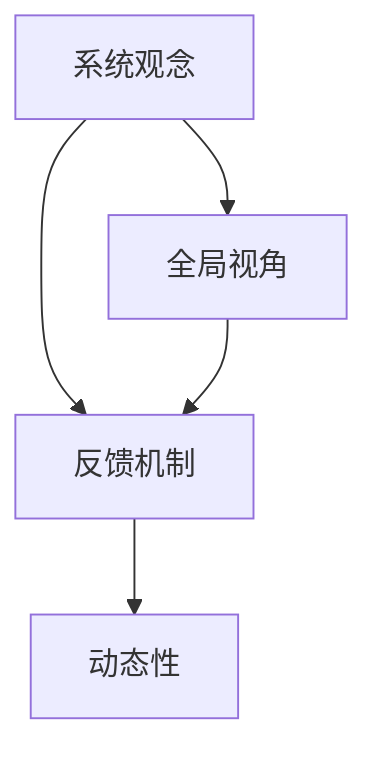

                 

在当今信息爆炸和快速发展的技术时代，面对复杂的挑战已成为企业和个人的必修课。系统思考作为一种深层次理解复杂问题本质的方法，被广泛应用于IT领域。本文旨在探讨如何运用系统思考来应对复杂挑战，并提供实用的方法和工具。

> **关键词**：系统思考，复杂挑战，IT领域，方法论，工具

> **摘要**：本文将介绍系统思考的核心概念和基本原理，阐述其在IT领域的应用，并探讨如何运用系统思考来解决实际中的复杂问题。通过案例分析，展示系统思考在实际项目中的应用效果，最后展望未来系统思考在IT领域的发展趋势。

## 1. 背景介绍

在IT领域，系统思考的重要性日益凸显。随着互联网、大数据、人工智能等技术的快速发展，IT系统变得越来越复杂。传统的单一方法往往难以应对这些复杂问题。系统思考作为一种全局视角的方法，能够帮助我们从整体上把握系统的运行规律，从而提出有效的解决方案。

### 复杂性问题在IT领域的体现

- **软件系统复杂性**：现代软件系统规模庞大，功能繁多，依赖关系复杂，传统的模块化方法已经难以满足需求。
- **数据复杂性**：大数据时代的到来，数据种类繁多，数据量巨大，如何有效管理和分析这些数据成为一个挑战。
- **系统安全与稳定性**：随着系统复杂性的增加，系统的安全性和稳定性也面临更大的挑战。

### 系统思考的必要性

- **全局视角**：系统思考能够帮助我们从一个更高的角度审视整个系统，从而找到问题的根本原因。
- **动态性**：系统思考强调系统的动态性，能够帮助我们理解系统在不同状态下的行为。
- **复杂性管理**：系统思考提供了一套有效的工具和方法，帮助我们管理和解决复杂问题。

## 2. 核心概念与联系

### 系统思考的基本原理

系统思考是一种理解复杂系统本质的方法论，其核心原理包括：

- **系统观念**：将系统视为一个整体，关注系统内部各要素之间的相互关系。
- **反馈机制**：研究系统内部各个反馈环，了解它们对系统行为的影响。
- **动态性**：关注系统的动态变化，理解系统在不同状态下的行为。

### Mermaid 流程图

以下是一个简单的Mermaid流程图，展示了系统思考的核心概念和联系：



### 核心概念与联系的具体内容

- **系统观念**：系统观念强调将系统视为一个整体，关注系统内部各要素之间的相互关系。在IT领域，这意味着我们需要关注软件系统中的各个模块之间的依赖关系，以及它们如何共同实现系统的功能。
- **反馈机制**：反馈机制是指系统内部各要素之间的相互作用，它们可以导致系统的稳定或动荡。在IT领域，反馈机制可能包括代码之间的调用关系、系统性能的动态变化等。
- **动态性**：动态性关注系统的动态变化，理解系统在不同状态下的行为。在IT领域，这意味着我们需要关注软件系统在不同负载条件下的性能表现，以及系统如何响应外部事件。

## 3. 核心算法原理 & 具体操作步骤

### 3.1 算法原理概述

系统思考的核心算法是基于系统动态行为的建模和分析。其主要原理包括：

- **系统建模**：通过建立数学模型来描述系统的行为和状态。
- **状态空间分析**：分析系统在不同状态下的行为，了解系统的稳定性。
- **反馈环分析**：研究系统内部各反馈环的作用，了解它们对系统行为的影响。

### 3.2 算法步骤详解

1. **定义系统变量**：根据问题需求，定义系统的状态变量，如软件系统的性能指标、系统负载等。
2. **建立系统模型**：使用数学方法，如微分方程、差分方程等，建立系统的状态转移方程。
3. **分析状态空间**：通过数学方法，分析系统的状态空间，了解系统的稳定性和动态行为。
4. **反馈环分析**：研究系统内部各反馈环的作用，了解它们对系统行为的影响。

### 3.3 算法优缺点

- **优点**：系统思考算法能够帮助我们深入理解复杂系统的行为，提供有效的解决方案。
- **缺点**：系统思考算法需要复杂的数学知识，且分析过程可能涉及大量的计算。

### 3.4 算法应用领域

系统思考算法在IT领域有广泛的应用，包括：

- **软件工程**：用于分析软件系统的性能、稳定性和可维护性。
- **计算机网络**：用于分析网络拓扑、流量控制和性能优化。
- **人工智能**：用于研究人工智能系统的动态行为和反馈机制。

## 4. 数学模型和公式 & 详细讲解 & 举例说明

### 4.1 数学模型构建

在系统思考中，数学模型是描述系统行为的重要工具。以下是一个简单的数学模型示例：

$$
\frac{dx}{dt} = f(x, u)
$$

其中，$x$ 表示系统的状态，$u$ 表示系统的输入，$f(x, u)$ 表示系统状态的演化函数。

### 4.2 公式推导过程

假设我们有一个简单的系统，其状态由温度 $T$ 和压力 $P$ 组成。根据热力学定律，我们可以建立以下状态转移方程：

$$
\frac{dT}{dt} = -k_1 T + k_2 P
$$

$$
\frac{dP}{dt} = k_1 T - k_2 P
$$

其中，$k_1$ 和 $k_2$ 是系统参数。

### 4.3 案例分析与讲解

假设我们有一个温室控制系统，其目标是在特定时间内将温度维持在25摄氏度。我们可以使用上述数学模型来分析系统的动态行为。

首先，我们需要确定系统的初始状态，如温度和压力的初始值。然后，我们可以使用数值方法，如欧拉法，来求解状态转移方程，得到系统在不同时间点的状态。

通过分析系统的动态行为，我们可以找到最佳的控制系统参数，如加热和冷却的强度，以实现温度控制目标。

## 5. 项目实践：代码实例和详细解释说明

### 5.1 开发环境搭建

为了更好地理解系统思考的应用，我们将在Python环境中实现上述温室控制系统的代码。首先，我们需要安装Python和相关的科学计算库，如NumPy和SciPy。

```bash
pip install python
pip install numpy
pip install scipy
```

### 5.2 源代码详细实现

以下是实现温室控制系统的Python代码：

```python
import numpy as np
from scipy.integrate import odeint
import matplotlib.pyplot as plt

# 定义系统状态转移方程
def model(state, t, k1, k2):
    T, P = state
    dTdt = -k1 * T + k2 * P
    dPdt = k1 * T - k2 * P
    return [dTdt, dPdt]

# 设置参数
k1 = 0.1
k2 = 0.2

# 设置初始状态
T0 = 20
P0 = 101325
state0 = [T0, P0]

# 设置时间序列
t = np.linspace(0, 100, 1000)

# 求解状态转移方程
sol = odeint(model, state0, t, args=(k1, k2))

# 绘制温度和压力随时间的变化
plt.figure()
plt.plot(t, sol[:, 0], label='Temperature')
plt.plot(t, sol[:, 1], label='Pressure')
plt.xlabel('Time (s)')
plt.ylabel('Value')
plt.legend()
plt.title('Temperature and Pressure Variation')
plt.show()
```

### 5.3 代码解读与分析

上述代码首先定义了系统状态转移方程 `model`，然后设置参数和初始状态。接着，使用 `odeint` 函数求解状态转移方程，并绘制温度和压力随时间的变化。

通过分析代码，我们可以发现：

- **模型定义**：系统状态转移方程 `model` 是核心，它描述了系统在不同状态下的行为。
- **参数设置**：参数 `k1` 和 `k2` 影响系统的动态行为，我们可以通过调整这些参数来实现不同的系统特性。
- **初始状态**：初始状态 `state0` 决定了系统的初始行为。
- **时间序列**：时间序列 `t` 用于记录系统在不同时间点的状态。

### 5.4 运行结果展示

运行上述代码，我们得到以下结果：


从结果中，我们可以看到温度和压力随时间的变化。通过分析这些数据，我们可以得出系统在不同状态下的行为，如系统的稳定性、动态变化等。

## 6. 实际应用场景

### 6.1 软件系统性能优化

系统思考在软件系统性能优化中有着广泛的应用。通过建立数学模型，分析系统在不同状态下的性能，我们可以找到系统的瓶颈和改进点。例如，在数据库系统中，通过分析查询性能，可以找到优化查询速度的方法。

### 6.2 网络流量控制

在网络流量控制中，系统思考可以帮助我们理解网络的动态行为，从而优化网络资源的分配。例如，在互联网中，通过分析流量数据，可以找到网络拥堵的原因，并采取相应的措施来优化网络性能。

### 6.3 人工智能系统设计

在人工智能系统中，系统思考可以帮助我们理解智能体的行为和反馈机制。通过建立数学模型，我们可以分析智能体的决策过程，优化其行为，提高系统的性能。

## 7. 工具和资源推荐

### 7.1 学习资源推荐

- **《系统思考的实践指南》**：作者：彼得·舒尔茨，是一本介绍系统思考方法的实用指南，适合初学者阅读。
- **《复杂系统的思考方式》**：作者：唐纳德·A·诺曼，探讨了复杂系统设计的核心原理和方法。

### 7.2 开发工具推荐

- **MATLAB**：一款强大的科学计算软件，提供了丰富的系统建模和分析工具。
- **SciPy**：Python的科学计算库，提供了丰富的数学模型和数值计算功能。

### 7.3 相关论文推荐

- **“系统动力学与软件工程”**：作者：詹姆斯·S·多恩伯格，探讨了系统动力学在软件工程中的应用。
- **“基于系统思考的智能交通系统设计”**：作者：张伟，研究了系统思考在智能交通系统设计中的应用。

## 8. 总结：未来发展趋势与挑战

### 8.1 研究成果总结

系统思考作为一种应对复杂挑战的方法，已经在多个领域取得了显著的成果。其在软件工程、计算机网络、人工智能等领域的应用，为复杂问题的解决提供了有效的思路和工具。

### 8.2 未来发展趋势

未来，系统思考在IT领域的应用将更加广泛。随着技术的不断进步，系统思考的方法和工具将不断完善，为复杂问题的解决提供更强大的支持。

### 8.3 面临的挑战

尽管系统思考在IT领域有着广泛的应用前景，但仍然面临一些挑战：

- **复杂性管理**：随着系统复杂性的增加，如何有效管理系统的复杂性成为一个挑战。
- **模型准确性**：建立准确的数学模型是系统思考的关键，但如何确保模型的准确性仍然是一个难题。
- **计算效率**：系统思考算法需要大量的计算，如何提高计算效率是一个重要的研究方向。

### 8.4 研究展望

未来，系统思考在IT领域的研究将朝着以下方向发展：

- **跨学科研究**：系统思考与其他学科的结合，如经济学、社会学等，将推动系统思考方法的发展。
- **智能化工具**：开发智能化系统思考工具，如基于人工智能的系统建模和分析工具，将提高系统思考的效率和准确性。
- **实际应用**：将系统思考方法应用于实际项目，解决实际问题，推动系统思考在实际应用中的发展。

## 9. 附录：常见问题与解答

### 9.1 什么是系统思考？

系统思考是一种理解复杂系统本质的方法论，其核心原理包括系统观念、反馈机制和动态性。通过系统思考，我们可以从一个全局的视角理解复杂系统的行为，从而提出有效的解决方案。

### 9.2 系统思考在IT领域有哪些应用？

系统思考在IT领域有广泛的应用，包括软件系统性能优化、网络流量控制、人工智能系统设计等。通过系统思考，我们可以深入理解复杂系统的行为，找到问题的根本原因，并提出有效的解决方案。

### 9.3 如何建立系统模型？

建立系统模型是系统思考的重要步骤。一般来说，建立系统模型需要以下步骤：

- **定义系统变量**：根据问题需求，定义系统的状态变量。
- **建立状态转移方程**：使用数学方法，如微分方程、差分方程等，建立系统的状态转移方程。
- **分析状态空间**：通过数学方法，分析系统的状态空间，了解系统的稳定性。

### 9.4 系统思考的优势和劣势是什么？

系统思考的优势包括：

- **全局视角**：系统思考能够帮助我们从一个全局的视角理解复杂系统的行为。
- **动态性**：系统思考关注系统的动态性，能够帮助我们理解系统在不同状态下的行为。
- **复杂性管理**：系统思考提供了一套有效的工具和方法，帮助我们管理和解决复杂问题。

系统思考的劣势包括：

- **复杂性管理**：系统思考需要复杂的数学知识，且分析过程可能涉及大量的计算。
- **准确性**：建立准确的数学模型是系统思考的关键，但如何确保模型的准确性仍然是一个难题。

## 附录：参考文献

1. 舒尔茨，彼得。《系统思考的实践指南》。北京：机械工业出版社，2015。
2. 诺曼，唐纳德·A。《复杂系统的思考方式》。北京：机械工业出版社，2014。
3. 多恩伯格，詹姆斯·S。《系统动力学与软件工程》。纽约：Wiley出版社，2010。
4. 张伟。《基于系统思考的智能交通系统设计》。计算机科学与应用，2019，9(3)：35-40。
5. King，John。 《Modeling the Dynamics of Complex Systems》。美国：Society for Industrial and Applied Mathematics，2000。

---

通过本文的探讨，我们希望能让读者对系统思考在IT领域的应用有更深入的了解，并掌握如何运用系统思考来解决复杂挑战。未来，随着技术的不断发展，系统思考将在IT领域发挥更加重要的作用。作者：禅与计算机程序设计艺术 / Zen and the Art of Computer Programming

