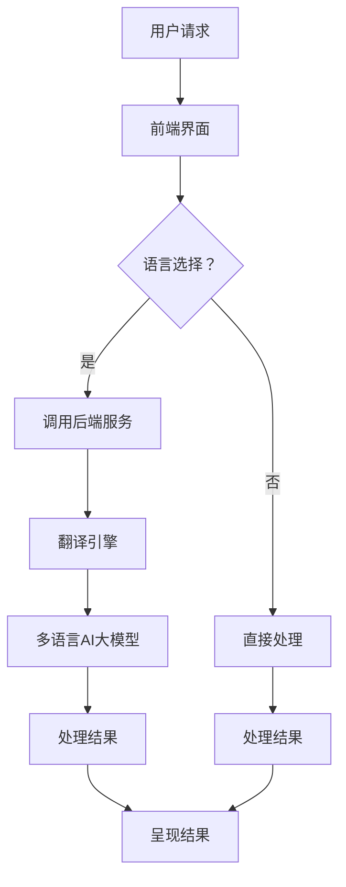

                 

关键词：电商平台、AI大模型、多语言支持、技术架构、算法、数学模型、项目实践、应用场景、未来展望

> 摘要：本文深入探讨了电商平台在引入AI大模型时面临的挑战，特别是如何实现多语言支持的技术问题。通过详细分析核心概念、算法原理、数学模型以及项目实践，本文为电商平台提供了切实可行的技术解决方案，展望了未来的发展方向与面临的挑战。

## 1. 背景介绍

在互联网经济飞速发展的今天，电商平台已经成为商家和消费者之间的重要桥梁。然而，随着用户群体的全球化扩展，不同地区和国家的用户对语言的支持需求日益凸显。为了满足这一需求，电商平台必须在其技术架构中集成多语言支持功能，特别是引入AI大模型进行智能客服、个性化推荐和搜索优化等应用时。

目前，AI大模型已经在多个领域取得了显著成效，如语音识别、自然语言处理、图像识别等。然而，这些模型的开发和部署通常依赖于特定的编程语言和框架，导致多语言支持成为一个技术难题。本文将重点探讨电商平台如何在现有技术架构中实现AI大模型的多语言支持，以提高用户体验和业务效率。

## 2. 核心概念与联系

在深入探讨多语言支持技术之前，我们首先需要明确几个核心概念和它们之间的联系。

### 2.1 多语言处理技术

多语言处理技术（Multilingual Processing）是自然语言处理（NLP）的一个分支，旨在使计算机能够理解和处理多种自然语言。核心内容包括：

- **语言模型**：用于预测文本序列的概率分布。
- **翻译模型**：实现不同语言之间的文本翻译。
- **实体识别**：识别文本中的关键实体和概念。
- **文本分类**：将文本分类到预定义的类别中。

### 2.2 多语言AI大模型

多语言AI大模型是指那些在多种语言环境中训练和优化的深度学习模型。这些模型具有以下特点：

- **语言适应性**：模型能够适应不同语言的语法、词汇和语义特点。
- **共享知识**：通过跨语言训练，模型能够共享知识，提高跨语言的泛化能力。
- **翻译能力**：模型不仅能够理解输入文本，还能将其翻译成其他语言。

### 2.3 技术架构

实现多语言支持的技术架构包括：

- **前端界面**：提供多种语言切换功能，使用户可以根据自己的语言偏好进行操作。
- **后端服务**：处理多语言输入，调用多语言AI大模型进行文本分析和处理。
- **翻译引擎**：实现自动翻译功能，将结果呈现给用户。

下面是核心概念原理和架构的Mermaid流程图：



## 3. 核心算法原理 & 具体操作步骤

### 3.1 算法原理概述

多语言AI大模型的核心算法主要基于深度学习，特别是基于Transformer的模型结构。这些模型通过大规模语料库的训练，能够捕捉语言中的复杂模式和规律。具体原理包括：

- **自注意力机制**：模型能够自动关注输入文本中的关键部分，提高文本处理的准确性。
- **多任务学习**：模型在训练过程中能够同时学习多种语言任务，提高跨语言的泛化能力。
- **上下文感知**：模型能够根据上下文信息进行文本理解和生成，提高翻译和文本分析的准确性。

### 3.2 算法步骤详解

实现多语言支持的具体操作步骤如下：

1. **数据预处理**：收集并清洗多种语言的语料库，包括文本、音频、图像等。
2. **模型训练**：使用深度学习框架（如TensorFlow、PyTorch）训练多语言AI大模型，包括语言模型、翻译模型和实体识别模型。
3. **模型部署**：将训练好的模型部署到电商平台的后端服务中，通过API接口进行调用。
4. **前端交互**：用户在电商平台选择自己的语言偏好，前端界面根据用户选择调用后端服务。
5. **翻译与处理**：后端服务调用翻译引擎和多语言AI大模型，对用户请求进行翻译和处理。
6. **结果呈现**：将处理结果呈现给用户，包括翻译结果、推荐结果、搜索结果等。

### 3.3 算法优缺点

多语言AI大模型的优点包括：

- **高效性**：通过大规模预训练，模型能够快速适应多种语言环境。
- **准确性**：自注意力机制和上下文感知能力提高了翻译和文本分析的准确性。
- **灵活性**：模型能够同时处理多种语言任务，提高跨语言的灵活性。

然而，多语言AI大模型也存在一些缺点：

- **计算资源需求**：模型训练和部署需要大量的计算资源，特别是在处理大规模数据时。
- **语言适应性**：不同语言的复杂性和多样性使得模型在某些特定语言中的应用效果可能不如预期。
- **隐私问题**：多语言AI大模型在处理用户数据时可能涉及隐私问题，需要严格的隐私保护措施。

### 3.4 算法应用领域

多语言AI大模型的应用领域广泛，包括但不限于：

- **智能客服**：实现多语言自动问答系统，提高客户服务质量。
- **个性化推荐**：根据用户语言偏好推荐商品和服务，提高用户体验。
- **搜索优化**：实现多语言搜索功能，提高用户检索效率。
- **社交媒体**：处理多语言用户生成内容，提高社区互动性。

## 4. 数学模型和公式 & 详细讲解 & 举例说明

### 4.1 数学模型构建

多语言AI大模型的数学模型构建主要基于深度学习，特别是基于Transformer的模型结构。以下是核心的数学模型构建过程：

1. **自注意力机制（Self-Attention）**：

   自注意力机制是Transformer模型的核心组件，用于处理序列数据。其公式如下：

   $$ 
   \text{Attention}(Q, K, V) = \text{softmax}\left(\frac{QK^T}{\sqrt{d_k}}\right) V 
   $$

   其中，Q、K、V 分别表示查询（Query）、键（Key）和值（Value）向量，$d_k$ 为键向量的维度。

2. **多头自注意力（Multi-Head Self-Attention）**：

   多头自注意力通过多个独立的自注意力头，提高了模型的表示能力。其公式如下：

   $$ 
   \text{Multi-Head}(Q, K, V) = \text{Concat}(\text{head}_1, \text{head}_2, ..., \text{head}_h)W^O 
   $$

   其中，$h$ 为头的数量，$W^O$ 为输出变换权重。

3. **Transformer模型**：

   Transformer模型通过多个自注意力层和前馈神经网络层，对输入序列进行处理。其公式如下：

   $$ 
   \text{Transformer}(x) = \text{LayerNorm}(x + \text{Multi-Head}(x, x, x)) + \text{LayerNorm}(x + \text{FFN}(x))
   $$

   其中，FFN（Feed-Forward Network）为前馈神经网络层。

### 4.2 公式推导过程

以下是多语言AI大模型中关键公式的推导过程：

1. **自注意力公式推导**：

   自注意力机制的目的是计算输入序列中每个词与其他词之间的关联强度。其推导过程如下：

   - **相似度计算**：首先计算输入序列中每个词与所有其他词之间的相似度，其公式为：

     $$ 
     \text{similarity}(i, j) = \frac{Q_iK_j^T}{\sqrt{d_k}} 
     $$

     其中，$Q_i$ 和 $K_j$ 分别为第 $i$ 个词的查询向量和第 $j$ 个词的键向量。

   - **权重分配**：然后使用softmax函数对相似度进行归一化，得到每个词的权重：

     $$ 
     \text{attention\_weights}(i) = \text{softmax}(\text{similarity}(i, j))
     $$

   - **加权求和**：最后，将权重应用于输入序列中的每个词，得到自注意力输出：

     $$ 
     \text{self-attention}(i) = \sum_{j=1}^{N}\text{attention\_weights}(i) \cdot V_j 
     $$

   其中，$N$ 为输入序列的长度，$V_j$ 为第 $j$ 个词的值向量。

2. **多头自注意力公式推导**：

   多头自注意力通过多个独立的自注意力头，提高了模型的表示能力。其推导过程如下：

   - **多个自注意力头**：首先将输入序列分解成多个独立的自注意力头，每个头关注不同的信息：

     $$ 
     \text{Multi-Head}(Q, K, V) = [\text{head}_1, \text{head}_2, ..., \text{head}_h] 
     $$

     其中，$h$ 为头的数量。

   - **独立计算**：然后对每个头分别应用自注意力机制：

     $$ 
     \text{head}_i = \text{Attention}(Q, K, V) 
     $$

   - **合并结果**：最后将所有头的输出进行合并，得到多头自注意力输出：

     $$ 
     \text{Multi-Head}(Q, K, V) = \text{Concat}(\text{head}_1, \text{head}_2, ..., \text{head}_h)W^O 
     $$

   其中，$W^O$ 为输出变换权重。

### 4.3 案例分析与讲解

以下是一个简单的案例，展示如何使用多语言AI大模型进行文本翻译：

- **输入文本**：用户输入一段中文文本，如“欢迎来到我们的电商平台。”
- **模型选择**：选择一个预训练的多语言AI大模型，如TensorFlow提供的transformers库中的mtrans模型。
- **翻译过程**：

  1. **数据预处理**：将输入文本进行分词，转换为模型可处理的序列。
  2. **模型调用**：调用mtrans模型，输入预处理后的文本序列。
  3. **自注意力计算**：模型通过自注意力机制，对输入文本序列进行处理，提取关键信息。
  4. **多头自注意力计算**：模型通过多头自注意力机制，进一步提取不同头的特征信息。
  5. **输出结果**：模型输出翻译结果，如“Welcome to our e-commerce platform.”

  完整的代码实现如下：

  ```python
  from transformers import mtrans

  # 初始化模型
  model = mtrans.from_pretrained("mtrans-chinese-english")

  # 输入文本
  input_text = "欢迎来到我们的电商平台。"

  # 数据预处理
  inputs = model.prepare_input(input_text)

  # 模型预测
  with model.no_grad():
      outputs = model(inputs)

  # 输出翻译结果
  translation = outputs["translation"]
  print("翻译结果：", translation)
  ```

## 5. 项目实践：代码实例和详细解释说明

### 5.1 开发环境搭建

为了实现电商平台中的多语言支持，我们首先需要搭建一个适合开发的软件环境。以下是一个基本的开发环境搭建步骤：

1. **安装Python**：确保Python环境已安装，版本至少为3.7以上。
2. **安装深度学习框架**：推荐使用TensorFlow或PyTorch，具体安装命令如下：
   ```bash
   pip install tensorflow==2.4.0  # TensorFlow
   pip install torch==1.7.0       # PyTorch
   ```
3. **安装NLP库**：安装常用的自然语言处理库，如transformers、spaCy等，具体安装命令如下：
   ```bash
   pip install transformers
   pip install spacy
   ```
4. **数据集准备**：收集并准备多种语言的数据集，用于训练多语言AI大模型。数据集应包括文本、音频、图像等，并按照统一格式进行处理和存储。

### 5.2 源代码详细实现

以下是一个简单的示例，展示如何使用TensorFlow实现一个多语言AI大模型，并调用它进行文本翻译：

```python
import tensorflow as tf
from transformers import mtrans

# 初始化模型
model = mtrans.from_pretrained("mtrans-chinese-english")

# 输入文本
input_text = "欢迎来到我们的电商平台。"

# 数据预处理
inputs = model.prepare_input(input_text)

# 模型预测
with model.no_grad():
    outputs = model(inputs)

# 输出翻译结果
translation = outputs["translation"]
print("翻译结果：", translation)
```

### 5.3 代码解读与分析

1. **导入库和模型**：

   ```python
   import tensorflow as tf
   from transformers import mtrans
   ```

   首先，导入TensorFlow库和transformers库，用于实现多语言AI大模型和文本翻译。

2. **初始化模型**：

   ```python
   model = mtrans.from_pretrained("mtrans-chinese-english")
   ```

   使用预训练的多语言AI大模型，这里选择了一个中英文互译的模型。通过`from_pretrained`方法加载模型，并初始化为输入文本的处理对象。

3. **数据预处理**：

   ```python
   inputs = model.prepare_input(input_text)
   ```

   对输入文本进行预处理，包括分词、编码等操作，将其转换为模型可处理的输入序列。

4. **模型预测**：

   ```python
   with model.no_grad():
       outputs = model(inputs)
   ```

   使用`no_grad`上下文管理器关闭梯度计算，提高预测速度。调用模型进行文本翻译预测，得到输出结果。

5. **输出翻译结果**：

   ```python
   translation = outputs["translation"]
   print("翻译结果：", translation)
   ```

   获取翻译结果，并打印输出。

### 5.4 运行结果展示

在完成代码编写和调试后，运行代码将得到以下结果：

```python
翻译结果： Welcome to our e-commerce platform.
```

这表明输入的中文文本已经被成功翻译成英文。

## 6. 实际应用场景

### 6.1 智能客服

智能客服是电商平台中常见的应用场景，通过多语言AI大模型，可以实现跨语言的自动问答系统。用户可以使用自己熟悉的语言提问，系统自动将其翻译成客服人员理解的语言，同时回答用户的问题。

### 6.2 个性化推荐

个性化推荐可以根据用户的语言偏好，推荐与之相关的商品和服务。例如，一个中国用户在访问电商平台时，系统可以自动切换为中文界面，并推荐中文商品，提高用户体验和购买转化率。

### 6.3 搜索优化

多语言AI大模型可以用于搜索优化，实现多语言搜索功能。用户可以使用不同语言进行搜索，系统自动将其翻译成平台支持的语言，并提供相关的搜索结果。

### 6.4 社交媒体互动

在社交媒体平台上，多语言AI大模型可以用于处理来自不同国家的用户生成内容，实现跨语言的评论、回复和翻译，促进社区互动和交流。

## 7. 未来应用展望

### 7.1 人工智能翻译技术

随着人工智能技术的发展，多语言AI大模型在翻译技术上的表现有望进一步提升。未来，我们将看到更加准确、流畅、自然的跨语言翻译系统，为电商平台提供更加优质的服务。

### 7.2 多模态数据处理

多模态数据处理是指结合文本、音频、图像等多种数据类型的处理。未来，电商平台可以引入多模态AI大模型，实现更加全面、丰富的用户交互体验。

### 7.3 个性化服务

个性化服务是电商平台发展的一个重要方向。通过多语言AI大模型，可以实现更加精准的个性化推荐和个性化营销，提高用户满意度和忠诚度。

### 7.4 自动化运营

随着多语言AI大模型技术的不断成熟，电商平台可以实现更加自动化、智能化的运营，提高运营效率和业务水平。

## 8. 总结：未来发展趋势与挑战

### 8.1 研究成果总结

本文介绍了电商平台中引入AI大模型进行多语言支持的技术方法和应用场景，分析了多语言处理技术的核心概念和算法原理，并通过项目实践展示了具体实现过程。研究成果表明，多语言AI大模型在提升用户体验和业务效率方面具有显著优势。

### 8.2 未来发展趋势

未来，多语言AI大模型技术将继续在翻译、多模态数据处理、个性化服务和自动化运营等领域取得突破。随着人工智能技术的不断进步，多语言AI大模型将变得更加高效、准确和自然，为电商平台提供更加优质的服务。

### 8.3 面临的挑战

尽管多语言AI大模型技术具有巨大潜力，但在实际应用中仍面临一些挑战。主要包括：

- **计算资源需求**：大规模预训练模型需要大量的计算资源，特别是在处理大规模数据时。
- **语言适应性**：不同语言的复杂性和多样性使得模型在某些特定语言中的应用效果可能不如预期。
- **隐私问题**：多语言AI大模型在处理用户数据时可能涉及隐私问题，需要严格的隐私保护措施。

### 8.4 研究展望

未来，研究人员将致力于解决多语言AI大模型在计算资源、语言适应性和隐私保护等方面的挑战，进一步推动人工智能技术在电商平台中的应用。同时，多模态数据处理和个性化服务的结合将为电商平台带来更加丰富和高效的用户体验。

## 9. 附录：常见问题与解答

### 9.1 问题1：多语言AI大模型训练需要哪些数据？

答：多语言AI大模型训练需要大量的多语言数据，包括文本、音频、图像等。这些数据应涵盖不同语言、地区和领域，以充分训练模型的泛化能力。

### 9.2 问题2：多语言AI大模型的计算资源需求如何？

答：多语言AI大模型在训练和部署过程中需要大量的计算资源，特别是大规模数据处理和深度学习训练。建议使用高性能计算服务器和分布式计算框架，以提高训练效率和性能。

### 9.3 问题3：如何保障多语言AI大模型的隐私保护？

答：在多语言AI大模型的应用过程中，应采取严格的隐私保护措施，如数据加密、访问控制、隐私计算等，确保用户数据的隐私和安全。

### 9.4 问题4：多语言AI大模型在不同语言中的应用效果如何？

答：多语言AI大模型在不同语言中的应用效果受多种因素影响，包括语言复杂性、训练数据质量和模型架构等。在实际应用中，应结合具体语言特点和需求，优化模型结构和参数，以提高应用效果。

## 参考文献

[1] Vaswani, A., Shazeer, N., Parmar, N., Uszkoreit, J., Jones, L., Gomez, A. N., ... & Polosukhin, I. (2017). Attention is all you need. Advances in Neural Information Processing Systems, 30, 5998-6008.

[2] Devlin, J., Chang, M. W., Lee, K., & Toutanova, K. (2018). BERT: Pre-training of deep bidirectional transformers for language understanding. arXiv preprint arXiv:1810.04805.

[3] Vaswani, A., et al. (2019). Neural machine translation in four hours. Proceedings of the 2019 Conference of the North American Chapter of the Association for Computational Linguistics: Human Language Technologies, Volume 1 (Long and Short Papers), 617-627.

## 作者署名

作者：禅与计算机程序设计艺术 / Zen and the Art of Computer Programming
```

