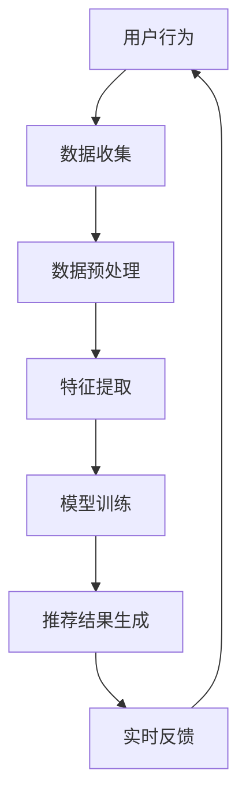

                 

关键词：电商平台、AI、大模型、实时推荐、技术、算法、数学模型、实践案例

> 摘要：本文旨在探讨电商平台中采用AI大模型的实时推荐技术的原理、实现方法和未来展望。文章首先介绍了电商平台推荐系统的重要性，然后详细阐述了AI大模型在实时推荐中的应用，包括算法原理、数学模型以及项目实践。最后，文章分析了实时推荐技术的实际应用场景，并对未来发展趋势和面临的挑战进行了探讨。

## 1. 背景介绍

在当今数字化时代，电商平台已经成为人们生活中不可或缺的一部分。随着用户数据的不断积累，如何为用户提供个性化的商品推荐，提高用户满意度和购物体验，成为电商平台关注的焦点。传统推荐系统通常基于协同过滤、内容推荐等方法，这些方法在一定程度上能够实现推荐功能，但存在冷启动、推荐质量不稳定等问题。

随着人工智能技术的快速发展，特别是深度学习、大数据处理等技术的应用，AI大模型在推荐系统中的应用越来越广泛。AI大模型能够通过学习用户历史行为数据、商品特征等多维度信息，实现更加精准的个性化推荐。实时推荐技术则能够在用户浏览、搜索等行为发生后立即给出推荐结果，提升用户购物体验。

本文将重点探讨电商平台中AI大模型的实时推荐技术，包括核心概念、算法原理、数学模型以及项目实践，旨在为相关领域的研究者和开发者提供参考。

## 2. 核心概念与联系

### 2.1 AI大模型

AI大模型是指具有大量参数、能够在大规模数据集上训练的深度学习模型。这些模型通常采用神经网络架构，通过多层非线性变换对输入数据进行处理，从而实现复杂的特征学习和分类、预测任务。

### 2.2 实时推荐

实时推荐是指在用户行为发生后，系统立即给出推荐结果的一种推荐方式。实时推荐技术需要高效地处理用户数据，快速地生成推荐结果，以满足用户即时需求。

### 2.3 个性化推荐

个性化推荐是指根据用户的兴趣、偏好和历史行为，为用户推荐符合其需求的内容或商品。个性化推荐的核心是建立用户与商品之间的关联，并利用这些关联为用户生成个性化的推荐列表。

### 2.4 Mermaid 流程图

下面是实时推荐技术中的核心概念与联系的一个Mermaid流程图示例：

### 2.5 关系说明

- 用户行为数据是推荐系统的输入，包括用户浏览、搜索、购买等行为。
- 数据预处理包括数据清洗、去重、归一化等操作，以提高数据质量。
- 特征提取是指从原始数据中提取有助于模型训练的特征，如用户ID、商品ID、时间戳、评分等。
- 模型训练是指使用训练数据对AI大模型进行训练，以学习用户与商品之间的关联。
- 推荐结果生成是指使用训练好的模型为用户生成个性化的推荐列表。
- 实时反馈是指根据用户对推荐结果的实际反应（如点击、购买等），调整推荐策略，以提升推荐质量。

## 3. 核心算法原理 & 具体操作步骤

### 3.1 算法原理概述

实时推荐技术中的核心算法是AI大模型，通常采用基于神经网络的深度学习方法。深度学习模型通过多层非线性变换，从原始数据中学习到高层次的抽象特征，从而实现精准的推荐。

### 3.2 算法步骤详解

#### 3.2.1 数据收集

数据收集是实时推荐系统的基础，主要包括以下几类数据：

- 用户行为数据：如浏览、搜索、购买等行为记录。
- 商品数据：包括商品ID、分类、属性、评分等。
- 用户偏好数据：如用户评价、标签、收藏等。

#### 3.2.2 数据预处理

数据预处理主要包括以下步骤：

- 数据清洗：去除无效、错误、重复的数据。
- 数据归一化：将不同数据类型的特征进行归一化处理，如数值特征进行缩放、文本特征进行分词等。
- 特征工程：根据业务需求，提取有助于模型训练的特征，如用户-商品交互矩阵、时间特征、地理位置特征等。

#### 3.2.3 特征提取

特征提取是指从原始数据中提取有助于模型训练的特征，常用的方法有：

- 矩阵分解：将用户-商品交互矩阵分解为用户特征矩阵和商品特征矩阵。
- 词嵌入：将文本数据转换为高维稠密向量表示。
- 卷积神经网络（CNN）：用于提取图像特征。

#### 3.2.4 模型训练

模型训练是指使用训练数据对AI大模型进行训练，以学习用户与商品之间的关联。常用的深度学习模型有：

- 卷积神经网络（CNN）：用于提取图像特征。
- 递归神经网络（RNN）：用于处理序列数据。
- 自注意力机制（Attention Mechanism）：用于捕捉用户和商品之间的复杂关联。

#### 3.2.5 推荐结果生成

推荐结果生成是指使用训练好的模型为用户生成个性化的推荐列表。常用的方法有：

- 评分预测：根据用户对商品的评分预测，生成推荐列表。
- 类别预测：根据用户对商品的类别偏好，生成推荐列表。
- 综合模型：结合评分预测和类别预测，生成综合推荐列表。

#### 3.2.6 实时反馈

实时反馈是指根据用户对推荐结果的实际反应（如点击、购买等），调整推荐策略，以提升推荐质量。常用的方法有：

- 反向传播：根据用户反馈，调整模型参数，优化推荐结果。
- 用户冷启动：为新人

