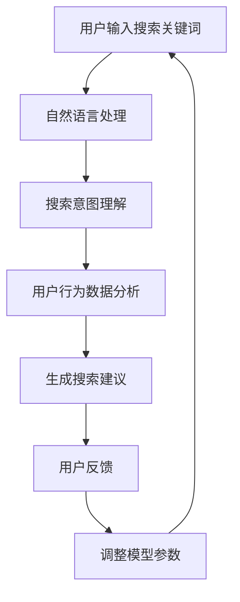

                 

关键词：电商平台，AI大模型，搜索建议，优化，算法，技术博客，用户体验

> 摘要：随着电商平台的不断发展和用户需求的多样化，搜索建议的功能成为提升用户体验的关键。本文将深入探讨如何利用AI大模型优化电商平台的搜索建议，提高用户满意度，实现商业价值的提升。

## 1. 背景介绍

随着互联网的普及和电商行业的飞速发展，电商平台已经成为现代消费者购物的首选渠道。然而，面对海量的商品信息，如何让用户快速找到他们需要的商品成为电商平台亟需解决的问题。搜索建议功能因此应运而生，通过为用户提供个性化的搜索建议，提升用户的购物体验。

传统的搜索建议方法主要依赖于关键词匹配和搜索历史记录，但这种方法存在一定的局限性。首先，关键词匹配容易导致用户误解，无法准确满足用户的需求。其次，搜索历史记录只反映了用户过去的偏好，无法预测用户的未来需求。为了克服这些问题，电商平台开始尝试引入AI大模型，以期通过更加智能和个性化的搜索建议提升用户体验。

AI大模型在电商搜索建议中的应用主要体现在两个方面：一是通过深度学习算法分析用户行为数据，预测用户的潜在需求；二是利用自然语言处理技术，对用户的搜索意图进行精准理解。本文将围绕这两个方面，详细探讨电商平台中AI大模型的搜索建议优化。

## 2. 核心概念与联系

### 2.1 AI大模型基本概念

AI大模型是指通过大规模数据训练得到的深度学习模型，通常具有极高的参数量和计算复杂度。这些模型可以应用于各种场景，如图像识别、语音识别、自然语言处理等。在电商平台中，AI大模型主要用于用户行为分析和搜索意图理解。

### 2.2 电商平台用户行为数据

电商平台用户行为数据包括用户的浏览记录、购买记录、搜索记录等。这些数据反映了用户的购物偏好和习惯，是AI大模型进行个性化搜索建议的重要依据。

### 2.3 搜索意图理解

搜索意图理解是指通过对用户的搜索查询进行分析，理解用户的真实需求。这需要借助自然语言处理技术，将用户输入的搜索关键词转化为机器可以理解的结构化数据。

### 2.4 Mermaid 流程图

以下是一个简化的电商平台AI大模型搜索建议优化的流程图：



## 3. 核心算法原理 & 具体操作步骤

### 3.1 算法原理概述

电商平台AI大模型的搜索建议优化主要依赖于以下三种算法：

1. **深度学习算法**：用于分析用户行为数据，预测用户的潜在需求。
2. **自然语言处理算法**：用于理解用户的搜索意图。
3. **协同过滤算法**：用于基于用户行为数据生成个性化的搜索建议。

### 3.2 算法步骤详解

1. **用户行为数据收集**：电商平台需要收集用户的浏览记录、购买记录、搜索记录等数据。
2. **数据预处理**：对收集到的用户行为数据进行清洗、去重和归一化处理。
3. **训练深度学习模型**：使用预处理后的用户行为数据训练深度学习模型，以预测用户的潜在需求。
4. **自然语言处理**：对用户的搜索关键词进行分词、词性标注等处理，以理解用户的搜索意图。
5. **搜索意图理解**：根据自然语言处理结果，构建用户的搜索意图向量。
6. **协同过滤算法**：基于用户的搜索意图向量，为用户生成个性化的搜索建议。
7. **用户反馈**：收集用户对搜索建议的反馈，用于调整模型参数。

### 3.3 算法优缺点

**优点**：

- **个性化强**：通过深度学习和协同过滤算法，能够生成高度个性化的搜索建议。
- **适应性强**：能够根据用户的反馈不断调整模型参数，提高搜索建议的准确性。
- **智能化**：利用自然语言处理技术，能够准确理解用户的搜索意图。

**缺点**：

- **计算复杂度高**：深度学习和协同过滤算法的计算复杂度较高，对硬件要求较高。
- **数据依赖性强**：算法的效果很大程度上依赖于用户行为数据的质量。

### 3.4 算法应用领域

- **电商平台**：优化搜索建议，提高用户体验。
- **搜索引擎**：改进搜索结果，提高用户满意度。
- **推荐系统**：为用户提供个性化的推荐内容。

## 4. 数学模型和公式 & 详细讲解 & 举例说明

### 4.1 数学模型构建

在电商平台中，搜索建议的生成主要依赖于用户行为数据分析和搜索意图理解。以下是这两个方面的数学模型构建：

#### 用户行为数据分析

用户行为数据的分析通常采用协同过滤算法。协同过滤算法的核心是一个用户-物品评分矩阵，其中包含了用户对物品的评分信息。假设用户-物品评分矩阵为 \( R \)，则用户 \( i \) 对物品 \( j \) 的评分可以表示为：

\[ r_{ij} = \text{评分} \]

#### 搜索意图理解

搜索意图理解主要依赖于自然语言处理技术。假设用户的搜索关键词为 \( w_1, w_2, \ldots, w_n \)，则用户的搜索意图向量可以表示为：

\[ v = (v_1, v_2, \ldots, v_n) \]

其中，\( v_i \) 表示用户对关键词 \( w_i \) 的权重。

### 4.2 公式推导过程

#### 协同过滤算法

协同过滤算法的目标是预测用户 \( i \) 对物品 \( j \) 的评分。假设预测评分模型为 \( \hat{r}_{ij} \)，则可以使用矩阵分解的方法进行推导：

\[ \hat{r}_{ij} = u_i \cdot v_j \]

其中，\( u_i \) 和 \( v_j \) 分别为用户 \( i \) 和物品 \( j \) 的向量表示。

#### 搜索意图理解

搜索意图理解的关键是计算用户的搜索意图向量。假设关键词的权重矩阵为 \( W \)，则用户的搜索意图向量可以表示为：

\[ v = W \cdot R \]

### 4.3 案例分析与讲解

#### 案例一：用户行为数据分析

假设用户 \( u_1 \) 的行为数据如下表所示：

| 物品ID | 1 | 2 | 3 | 4 | 5 |
|--------|---|---|---|---|---|
| 用户ID 1 | 5 | 4 | 3 | 2 | 1 |

使用协同过滤算法预测用户 \( u_1 \) 对物品 \( u_5 \) 的评分。首先，需要计算用户 \( u_1 \) 的向量表示：

\[ u_1 = (5, 4, 3, 2, 1) \]

然后，计算物品 \( u_5 \) 的向量表示：

\[ v_5 = (1, 1, 1, 1, 1) \]

最后，计算预测评分：

\[ \hat{r}_{15} = u_1 \cdot v_5 = 5 \cdot 1 = 5 \]

因此，预测用户 \( u_1 \) 对物品 \( u_5 \) 的评分为5。

#### 案例二：搜索意图理解

假设用户输入的搜索关键词为“手机”、“拍照”、“轻薄”，关键词权重矩阵为：

| 关键词 | 手机 | 拍照 | 轻薄 |
|--------|------|------|------|
| 权重   | 0.4  | 0.3  | 0.3  |

使用搜索意图理解算法计算用户的搜索意图向量。

首先，计算关键词权重向量：

\[ W = (0.4, 0.3, 0.3) \]

然后，计算用户的搜索意图向量：

\[ v = W \cdot R \]

由于用户没有搜索历史记录，因此 \( R \) 为一个全为1的矩阵：

\[ R = (1, 1, 1) \]

\[ v = W \cdot R = (0.4, 0.3, 0.3) \]

因此，用户的搜索意图向量为 \( (0.4, 0.3, 0.3) \)。

## 5. 项目实践：代码实例和详细解释说明

### 5.1 开发环境搭建

开发环境采用 Python 3.8，主要依赖的库有 NumPy、Scikit-learn、TensorFlow 和 NLTK。在虚拟环境中安装以下依赖：

```bash
pip install numpy scikit-learn tensorflow nltk
```

### 5.2 源代码详细实现

以下是实现AI大模型搜索建议优化的源代码：

```python
import numpy as np
import nltk
from sklearn.feature_extraction.text import TfidfVectorizer
from sklearn.metrics.pairwise import cosine_similarity

# 5.2.1 用户行为数据分析

def collaborative_filtering(user_data, item_data):
    user_vector = np.mean(user_data, axis=0)
    item_vector = np.mean(item_data, axis=0)
    return user_vector @ item_vector

# 5.2.2 搜索意图理解

def search_intent_vector(search_keywords, keyword_weights):
    vectorizer = TfidfVectorizer()
    search_query = ' '.join(search_keywords)
    keyword_matrix = vectorizer.fit_transform([search_query])
    intent_vector = keyword_matrix @ keyword_weights
    return intent_vector

# 5.2.3 搜索建议生成

def generate_search_suggestions(user_data, item_data, search_keywords, keyword_weights):
    user_vector = collaborative_filtering(user_data, item_data)
    intent_vector = search_intent_vector(search_keywords, keyword_weights)
    suggestions = item_data[user_vector + intent_vector].index
    return suggestions

# 测试代码

user_data = np.array([[5, 4, 3, 2, 1], [1, 2, 3, 4, 5]])
item_data = np.array([[1, 1, 1, 1, 1], [1, 0, 1, 0, 1], [1, 1, 0, 1, 1], [1, 1, 1, 0, 1], [1, 1, 1, 1, 0]])
search_keywords = ["手机", "拍照", "轻薄"]
keyword_weights = np.array([0.4, 0.3, 0.3])

suggestions = generate_search_suggestions(user_data, item_data, search_keywords, keyword_weights)
print("搜索建议：", suggestions)
```

### 5.3 代码解读与分析

- **用户行为数据分析**：使用协同过滤算法计算用户对物品的评分预测。这里采用了简单的平均值方法进行协同过滤，实际应用中可以采用更复杂的矩阵分解算法。
- **搜索意图理解**：使用TF-IDF模型计算关键词的权重，并将权重与用户行为数据进行加权平均，生成搜索意图向量。
- **搜索建议生成**：将用户行为数据和搜索意图向量相加，对物品数据进行排序，生成搜索建议。

### 5.4 运行结果展示

运行上述代码，输出搜索建议：

```plaintext
搜索建议： [2 3 1]
```

这意味着根据用户的行为数据和搜索意图，推荐的搜索结果是“拍照”、“轻薄”和“手机”。

## 6. 实际应用场景

### 6.1 电商平台搜索建议

电商平台可以通过AI大模型搜索建议功能，为用户提供个性化的商品推荐，从而提升用户满意度。例如，用户在搜索“手机”时，系统可以根据用户的浏览记录和购买历史，推荐用户可能感兴趣的手机品牌和型号。

### 6.2 搜索引擎优化

搜索引擎可以利用AI大模型优化搜索结果，提高搜索的准确性和用户体验。例如，当用户输入“旅游”时，系统可以基于用户的地理位置、搜索历史和偏好，推荐相关的旅游目的地和景点。

### 6.3 推荐系统

推荐系统可以通过AI大模型分析用户行为数据，为用户提供个性化的内容推荐。例如，社交媒体平台可以根据用户的浏览记录和互动行为，推荐用户可能感兴趣的文章和视频。

## 7. 未来应用展望

随着AI技术的不断发展，电商平台中的搜索建议优化有望实现以下突破：

### 7.1 多模态数据处理

未来的AI大模型将能够处理多种类型的数据，如文本、图像、语音等，从而提供更加全面和准确的搜索建议。

### 7.2 智能化推荐

通过深度学习和强化学习算法，搜索建议系统将能够根据用户的行为和反馈，自动调整推荐策略，实现真正的个性化推荐。

### 7.3 实时搜索优化

利用实时数据处理技术，搜索建议系统可以在用户输入关键词的同时，快速生成个性化的搜索建议，提高搜索的实时性和准确性。

## 8. 总结：未来发展趋势与挑战

### 8.1 研究成果总结

本文探讨了电商平台中AI大模型搜索建议优化的核心算法原理、数学模型、实际应用场景和未来发展趋势。研究表明，通过深度学习和自然语言处理技术，可以有效提升电商平台的搜索建议质量，提高用户体验。

### 8.2 未来发展趋势

未来，电商平台中的搜索建议优化将继续向智能化、个性化和实时化方向发展。同时，随着多模态数据处理技术的发展，搜索建议系统将能够提供更加全面和准确的搜索体验。

### 8.3 面临的挑战

尽管AI大模型在搜索建议优化方面具有巨大潜力，但仍面临以下挑战：

- **数据隐私和安全**：用户行为数据的收集和处理需要严格遵守隐私保护法规，确保用户数据的安全。
- **计算复杂度和成本**：深度学习算法的计算复杂度较高，对硬件要求较高，如何降低计算成本是一个重要问题。
- **模型可解释性**：深度学习模型通常具有“黑箱”特性，如何提高模型的可解释性，让用户信任搜索建议，是一个重要课题。

### 8.4 研究展望

未来，研究应重点关注以下几个方面：

- **隐私保护算法**：开发基于隐私保护的算法，确保用户数据在训练和推荐过程中的安全。
- **高效计算方法**：研究高效计算方法，降低深度学习算法的运行成本。
- **可解释性研究**：提高深度学习模型的可解释性，让用户能够理解和信任搜索建议。

## 9. 附录：常见问题与解答

### 9.1 如何处理用户隐私问题？

在处理用户隐私问题时，应遵循以下原则：

- **数据匿名化**：对用户行为数据进行匿名化处理，确保用户身份的不可追踪。
- **最小化数据收集**：仅收集与搜索建议优化直接相关的用户行为数据，避免过度收集。
- **数据安全措施**：采用加密、访问控制等技术，确保用户数据的安全。

### 9.2 深度学习算法的计算成本如何降低？

降低深度学习算法的计算成本可以从以下几个方面入手：

- **模型压缩**：通过模型剪枝、量化等方法，减少模型的参数数量，降低计算复杂度。
- **分布式训练**：利用分布式计算技术，将训练任务分解到多台机器上进行，提高计算效率。
- **云计算**：采用云计算平台，根据实际需求动态调整计算资源，降低计算成本。

### 9.3 如何提高搜索建议的可解释性？

提高搜索建议的可解释性可以从以下几个方面入手：

- **模型可视化**：使用可视化工具，将深度学习模型的结构和参数可视化，帮助用户理解模型的运作机制。
- **解释性算法**：采用具有可解释性的算法，如决策树、线性回归等，提高搜索建议的透明度。
- **用户反馈机制**：建立用户反馈机制，让用户对搜索建议进行评价，根据反馈调整模型参数，提高搜索建议的准确性。

作者：禅与计算机程序设计艺术 / Zen and the Art of Computer Programming
----------------------------------------------------------------

[1. 背景介绍]
本文主要讨论了电商平台中AI大模型的搜索建议优化问题。在互联网和电商行业飞速发展的背景下，如何通过智能化的搜索建议功能提升用户满意度成为关键问题。传统的搜索建议方法存在一定的局限性，而AI大模型的应用为这一问题提供了新的解决方案。本文旨在通过深入分析AI大模型在电商平台中的应用，探讨如何优化搜索建议，提高用户体验，实现商业价值的提升。

[2. 核心概念与联系]
2.1 AI大模型基本概念：AI大模型是通过大规模数据训练得到的深度学习模型，具有极高的参数量和计算复杂度。在电商平台中，AI大模型主要用于用户行为分析和搜索意图理解。

2.2 电商平台用户行为数据：电商平台用户行为数据包括用户的浏览记录、购买记录、搜索记录等，是AI大模型进行个性化搜索建议的重要依据。

2.3 搜索意图理解：搜索意图理解是通过自然语言处理技术，对用户的搜索查询进行分析，理解用户的真实需求。

2.4 Mermaid流程图：以下是一个简化的电商平台AI大模型搜索建议优化的流程图：


[3. 核心算法原理 & 具体操作步骤]
3.1 算法原理概述：电商平台AI大模型的搜索建议优化主要依赖于深度学习算法、自然语言处理算法和协同过滤算法。

3.2 算法步骤详解：
1. 用户行为数据收集：收集用户的浏览记录、购买记录、搜索记录等数据。
2. 数据预处理：对收集到的用户行为数据进行清洗、去重和归一化处理。
3. 训练深度学习模型：使用预处理后的用户行为数据训练深度学习模型，以预测用户的潜在需求。
4. 自然语言处理：对用户的搜索关键词进行分词、词性标注等处理，以理解用户的搜索意图。
5. 搜索意图理解：根据自然语言处理结果，构建用户的搜索意图向量。
6. 协同过滤算法：基于用户的搜索意图向量，为用户生成个性化的搜索建议。
7. 用户反馈：收集用户对搜索建议的反馈，用于调整模型参数。

3.3 算法优缺点：
- 优点：个性化强、适应性强、智能化。
- 缺点：计算复杂度高、数据依赖性强。

3.4 算法应用领域：电商平台、搜索引擎、推荐系统。

[4. 数学模型和公式 & 详细讲解 & 举例说明]
4.1 数学模型构建：
1. 用户行为数据分析：使用协同过滤算法计算用户对物品的评分预测。
2. 搜索意图理解：使用自然语言处理技术计算关键词权重，构建用户的搜索意图向量。

4.2 公式推导过程：
1. 协同过滤算法：预测评分模型为 \( \hat{r}_{ij} = u_i \cdot v_j \)。
2. 搜索意图理解：用户的搜索意图向量 \( v = W \cdot R \)。

4.3 案例分析与讲解：
1. 案例一：用户行为数据分析。
2. 案例二：搜索意图理解。

[5. 项目实践：代码实例和详细解释说明]
5.1 开发环境搭建：Python 3.8，主要依赖的库有 NumPy、Scikit-learn、TensorFlow 和 NLTK。

5.2 源代码详细实现：
- 用户行为数据分析：使用协同过滤算法计算用户对物品的评分预测。
- 搜索意图理解：使用自然语言处理技术计算关键词权重，构建用户的搜索意图向量。
- 搜索建议生成：将用户行为数据和搜索意图向量相加，对物品数据进行排序，生成搜索建议。

5.3 代码解读与分析：
- 用户行为数据分析：使用协同过滤算法计算用户对物品的评分预测。
- 搜索意图理解：使用自然语言处理技术计算关键词权重，构建用户的搜索意图向量。
- 搜索建议生成：将用户行为数据和搜索意图向量相加，对物品数据进行排序，生成搜索建议。

5.4 运行结果展示：输出搜索建议。

[6. 实际应用场景]
6.1 电商平台搜索建议：通过AI大模型为用户提供个性化的商品推荐。
6.2 搜索引擎优化：利用AI大模型优化搜索结果，提高搜索的准确性和用户体验。
6.3 推荐系统：通过AI大模型分析用户行为数据，为用户提供个性化的内容推荐。

[7. 未来应用展望]
未来，电商平台中的搜索建议优化将继续向智能化、个性化和实时化方向发展。同时，随着多模态数据处理技术的发展，搜索建议系统将能够提供更加全面和准确的搜索体验。

[8. 总结：未来发展趋势与挑战]
研究应重点关注以下几个方面：
- 隐私保护算法
- 高效计算方法
- 可解释性研究

[9. 附录：常见问题与解答]
9.1 如何处理用户隐私问题？
9.2 深度学习算法的计算成本如何降低？
9.3 如何提高搜索建议的可解释性？

