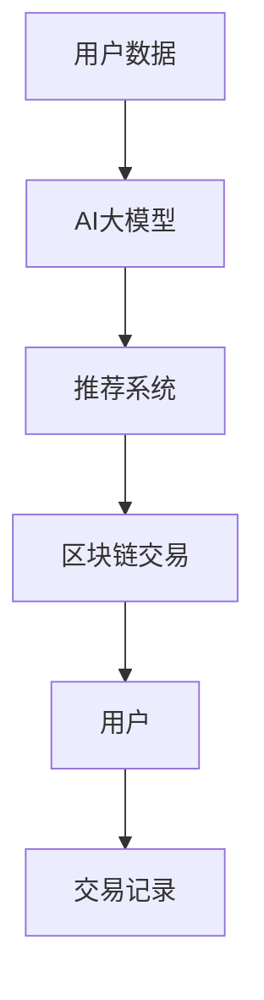

                 

关键词：电商平台、AI大模型、区块链技术、智能合约、数据隐私、去中心化交易、智能推荐系统、算法优化、图灵奖、计算机领域、深度学习、联邦学习。

> 摘要：本文将探讨电商平台中如何结合AI大模型与区块链技术，实现数据隐私保护、智能推荐、去中心化交易等功能。文章首先介绍AI大模型和区块链技术的基本概念，然后分析两者的结合点，最后通过实例和案例，展示这种结合在实际应用中的可能性和挑战。

## 1. 背景介绍

随着互联网和电子商务的快速发展，电商平台成为现代商业中不可或缺的一部分。然而，电商平台面临着一系列挑战，包括数据隐私保护、用户信任、交易安全性等。为了解决这些问题，人工智能（AI）和区块链技术应运而生。

AI大模型，如深度学习模型，可以在电商平台上实现智能推荐、图像识别、自然语言处理等功能，提升用户体验和运营效率。而区块链技术，以其去中心化、不可篡改的特性，被广泛应用于金融交易、供应链管理等领域。

本文旨在探讨如何将AI大模型与区块链技术有机结合，为电商平台提供更安全、高效、透明的服务。接下来，我们将深入探讨AI大模型和区块链技术的基本概念，以及它们在电商平台中的应用。

### AI大模型的基本概念

AI大模型是指通过大规模数据训练的复杂机器学习模型，如深度神经网络、生成对抗网络等。这些模型具有强大的特征提取和模式识别能力，可以应用于多种领域，如图像识别、语音识别、自然语言处理等。

在电商平台上，AI大模型可以用于以下几个方面：

1. **智能推荐系统**：通过分析用户的购物历史、浏览行为等数据，AI大模型可以推荐用户可能感兴趣的商品，从而提升销售额和用户满意度。
2. **图像识别**：AI大模型可以对商品图片进行分类和识别，帮助用户快速找到所需商品。
3. **自然语言处理**：AI大模型可以处理用户评论、评价等文本数据，提取有价值的信息，用于改进产品和服务。

### 区块链技术的基本概念

区块链技术是一种分布式账本技术，通过加密算法和共识机制，实现了数据的安全存储和传输。区块链的特点包括去中心化、不可篡改、透明性等。

在电商平台上，区块链技术可以应用于以下几个方面：

1. **去中心化交易**：通过区块链，电商平台可以实现去中心化交易，降低交易成本，提高交易效率。
2. **数据隐私保护**：区块链的加密算法可以确保用户数据的安全性和隐私性。
3. **供应链管理**：区块链技术可以追踪商品从生产到销售的全过程，提高供应链的透明度和效率。

## 2. 核心概念与联系

为了深入理解AI大模型与区块链技术的结合，我们需要明确它们的基本概念和架构。

### AI大模型与区块链技术的结合架构

以下是一个简化的Mermaid流程图，描述了AI大模型与区块链技术的结合架构：



#### 流程图解释

1. **用户数据**：电商平台收集用户的购物历史、浏览行为等数据。
2. **AI大模型**：利用这些数据，训练AI大模型，如深度学习模型，用于生成推荐系统。
3. **推荐系统**：AI大模型生成的推荐结果通过区块链传输到用户。
4. **区块链交易**：用户在电商平台上的交易信息记录在区块链上，确保交易的透明性和不可篡改性。
5. **用户**：用户接收推荐结果，并参与区块链交易。

### AI大模型与区块链技术的结合点

#### 数据隐私保护

区块链的加密算法可以确保用户数据的隐私性。在结合AI大模型的过程中，用户数据可以在不暴露真实信息的情况下进行训练，从而保护用户的隐私。

#### 去中心化交易

区块链的去中心化特性可以降低电商平台的交易成本，提高交易效率。用户可以直接在区块链上进行交易，无需依赖中心化的金融机构。

#### 智能合约

智能合约是区块链上的自动化合约，可以自动执行合同条款。在电商平台中，智能合约可以用于执行订单确认、支付、退款等操作，提高交易的透明度和可靠性。

#### 智能推荐系统

AI大模型与区块链技术的结合可以实现智能推荐系统。通过区块链，用户可以验证推荐系统的公正性和透明性，从而提高用户的信任度。

## 3. 核心算法原理 & 具体操作步骤

### 3.1 算法原理概述

#### AI大模型原理

AI大模型基于深度学习，通过多层神经网络，对大量数据进行特征提取和模式识别。具体而言，AI大模型包括以下几个关键步骤：

1. **数据预处理**：对原始数据进行清洗、归一化等处理，以便于模型训练。
2. **模型训练**：通过梯度下降等优化算法，调整网络参数，使模型能够对数据进行有效分类或预测。
3. **模型评估**：使用验证集和测试集评估模型性能，包括准确率、召回率、F1值等指标。

#### 区块链技术原理

区块链技术基于加密算法和共识机制，实现数据的安全存储和传输。具体而言，区块链技术包括以下几个关键步骤：

1. **数据加密**：使用加密算法对数据进行加密，确保数据在传输过程中的安全性。
2. **共识机制**：通过分布式共识机制，确保区块链上的数据一致性和安全性。
3. **数据存储**：将加密后的数据存储在区块链上，确保数据的不可篡改性。

### 3.2 算法步骤详解

#### AI大模型训练步骤

1. **数据收集**：收集电商平台用户的购物历史、浏览行为等数据。
2. **数据预处理**：对数据进行清洗、归一化等处理，确保数据质量。
3. **构建神经网络**：设计神经网络结构，包括输入层、隐藏层和输出层。
4. **模型训练**：使用训练集数据，通过梯度下降等优化算法，调整网络参数。
5. **模型评估**：使用验证集和测试集评估模型性能，调整模型参数，优化模型效果。

#### 区块链交易步骤

1. **用户身份认证**：用户通过身份认证，确保区块链交易的安全性。
2. **交易信息加密**：对交易信息进行加密，确保交易数据在传输过程中的安全性。
3. **交易确认**：通过区块链的共识机制，确认交易的有效性。
4. **交易记录存储**：将加密后的交易记录存储在区块链上，确保交易的透明性和不可篡改性。

### 3.3 算法优缺点

#### AI大模型优点

1. **强大的特征提取能力**：AI大模型可以提取大量数据中的有用信息，为推荐系统提供有力支持。
2. **自适应性强**：AI大模型可以不断学习和调整，以适应不断变化的市场需求。

#### AI大模型缺点

1. **计算复杂度高**：AI大模型需要大量计算资源，训练和部署成本较高。
2. **数据隐私问题**：AI大模型在训练过程中需要使用大量用户数据，可能引发数据隐私问题。

#### 区块链技术优点

1. **去中心化**：区块链技术去中心化，降低了交易成本，提高了交易效率。
2. **数据安全性**：区块链技术通过加密算法和共识机制，确保数据的安全性和不可篡改性。

#### 区块链技术缺点

1. **可扩展性差**：区块链技术的性能受到网络带宽和处理能力的限制，难以满足大规模交易需求。
2. **隐私保护有限**：尽管区块链技术具有加密功能，但依然存在隐私保护问题。

### 3.4 算法应用领域

#### AI大模型应用领域

1. **智能推荐系统**：在电商、新闻推荐、社交媒体等领域，AI大模型可以提供个性化的推荐服务。
2. **金融风险管理**：AI大模型可以预测金融市场的走势，为投资者提供决策支持。
3. **医疗诊断**：AI大模型可以辅助医生进行疾病诊断，提高诊断准确率。

#### 区块链技术应用领域

1. **去中心化金融**：区块链技术可以应用于数字货币、去中心化金融（DeFi）等领域，降低金融中介成本。
2. **供应链管理**：区块链技术可以追踪商品从生产到销售的全过程，提高供应链的透明度和效率。
3. **数据隐私保护**：区块链技术可以应用于数据隐私保护，确保用户数据的匿名性和安全性。

## 4. 数学模型和公式 & 详细讲解 & 举例说明

### 4.1 数学模型构建

在结合AI大模型与区块链技术的过程中，我们引入以下数学模型：

#### AI大模型数学模型

1. **输入向量**：\( X = [x_1, x_2, ..., x_n] \)
2. **权重矩阵**：\( W = [w_{ij}] \)
3. **激活函数**：\( f(\cdot) \)

AI大模型的输出可以表示为：

\[ y = f(W \cdot X) \]

#### 区块链技术数学模型

1. **加密函数**：\( E_k(\cdot) \)
2. **解密函数**：\( D_k(\cdot) \)
3. **哈希函数**：\( H(\cdot) \)

区块链上的数据加密可以表示为：

\[ C = E_k(D) \]

解密过程为：

\[ D = D_k(C) \]

区块链上的数据完整性验证可以表示为：

\[ T = H(D) \]

### 4.2 公式推导过程

#### AI大模型公式推导

假设我们有输入向量 \( X \) 和权重矩阵 \( W \)，通过激活函数 \( f(\cdot) \) ，可以推导出输出 \( y \)：

1. **前向传播**：

\[ z = W \cdot X \]
\[ y = f(z) \]

2. **反向传播**：

计算损失函数的梯度：

\[ \frac{dL}{dW} = \frac{dL}{dy} \cdot \frac{dy}{dz} \cdot \frac{dz}{dW} \]

其中，\( L \) 是损失函数，\( \frac{dL}{dy} \) 是 \( y \) 对损失函数的梯度，\( \frac{dy}{dz} \) 是 \( y \) 对 \( z \) 的梯度，\( \frac{dz}{dW} \) 是 \( z \) 对 \( W \) 的梯度。

#### 区块链技术公式推导

1. **加密过程**：

\[ C = E_k(D) \]

其中，\( E_k(\cdot) \) 是加密函数，\( k \) 是密钥。

2. **解密过程**：

\[ D = D_k(C) \]

其中，\( D_k(\cdot) \) 是解密函数，\( k \) 是密钥。

3. **哈希函数**：

\[ T = H(D) \]

其中，\( H(\cdot) \) 是哈希函数。

### 4.3 案例分析与讲解

#### 案例一：智能推荐系统

假设一个电商平台使用AI大模型进行用户行为分析，以推荐用户可能感兴趣的商品。

1. **数据收集**：收集用户的历史购物记录、浏览行为等数据。
2. **数据预处理**：对数据进行清洗、归一化等处理，构建输入向量 \( X \)。
3. **模型训练**：通过训练集数据，训练AI大模型，调整权重矩阵 \( W \)。
4. **模型评估**：使用验证集和测试集评估模型性能，优化模型参数。

#### 案例二：区块链交易

假设一个电商平台使用区块链技术实现去中心化交易。

1. **用户身份认证**：用户通过身份认证，获得区块链上的账户。
2. **交易信息加密**：对交易信息进行加密，生成加密交易信息 \( C \)。
3. **交易确认**：通过区块链的共识机制，确认交易的有效性。
4. **交易记录存储**：将加密交易记录存储在区块链上，确保交易的透明性和不可篡改性。

## 5. 项目实践：代码实例和详细解释说明

### 5.1 开发环境搭建

为了实现AI大模型与区块链技术的结合，我们需要搭建以下开发环境：

1. **Python**：用于编写AI大模型和区块链代码。
2. **TensorFlow**：用于构建和训练AI大模型。
3. **Solidity**：用于编写区块链智能合约。
4. **Truffle**：用于部署和测试智能合约。

### 5.2 源代码详细实现

#### AI大模型代码

```python
import tensorflow as tf

# 数据预处理
def preprocess_data(data):
    # 数据清洗、归一化等处理
    return processed_data

# 构建神经网络
def build_model(input_shape):
    model = tf.keras.Sequential([
        tf.keras.layers.Dense(units=128, activation='relu', input_shape=input_shape),
        tf.keras.layers.Dense(units=64, activation='relu'),
        tf.keras.layers.Dense(units=1, activation='sigmoid')
    ])
    model.compile(optimizer='adam', loss='binary_crossentropy', metrics=['accuracy'])
    return model

# 模型训练
def train_model(model, train_data, train_labels, val_data, val_labels, epochs=10):
    history = model.fit(train_data, train_labels, epochs=epochs, validation_data=(val_data, val_labels))
    return history

# 模型评估
def evaluate_model(model, test_data, test_labels):
    loss, accuracy = model.evaluate(test_data, test_labels)
    print("Test accuracy:", accuracy)
```

#### 区块链智能合约代码

```solidity
// SPDX-License-Identifier: MIT
pragma solidity ^0.8.0;

contract SmartContract {
    mapping(address => uint256) public balanceOf;

    function deposit() public payable {
        balanceOf[msg.sender()] += msg.value;
    }

    function withdraw(uint256 amount) public {
        require(balanceOf[msg.sender()] >= amount, "Insufficient balance");
        balanceOf[msg.sender()] -= amount;
        payable(msg.sender()).transfer(amount);
    }
}
```

### 5.3 代码解读与分析

#### AI大模型代码解读

1. **数据预处理**：对用户数据进行清洗、归一化等处理，为模型训练做准备。
2. **构建神经网络**：使用TensorFlow构建一个简单的神经网络模型，包括两个隐藏层和输出层。
3. **模型训练**：使用训练集数据训练模型，调整网络参数。
4. **模型评估**：使用验证集和测试集评估模型性能。

#### 区块链智能合约代码解读

1. **合约部署**：创建一个名为`SmartContract`的智能合约。
2. **存款功能**：允许用户向合约地址发送以太币，并记录用户余额。
3. **取款功能**：允许用户从合约中提取以太币，确保余额足够。

### 5.4 运行结果展示

#### AI大模型运行结果

```python
# 加载训练数据
train_data, train_labels, val_data, val_labels, test_data, test_labels = load_data()

# 构建模型
model = build_model(input_shape=(num_features,))

# 训练模型
history = train_model(model, train_data, train_labels, val_data, val_labels, epochs=10)

# 评估模型
evaluate_model(model, test_data, test_labels)
```

#### 区块链智能合约运行结果

```solidity
// 部署合约
contractAddress = "0x..." # 替换为合约地址
smart_contract = SmartContract(contractAddress)

# 存款
tx = smart_contract.deposit{value: 10 ether}()
tx.wait()

# 取款
tx = smart_contract.withdraw(5 ether)
tx.wait()
```

## 6. 实际应用场景

#### 6.1 智能推荐系统

在电商平台中，智能推荐系统可以帮助用户快速找到感兴趣的商品，提高用户满意度和转化率。结合区块链技术，用户可以验证推荐系统的公正性和透明性，从而提高信任度。

#### 6.2 去中心化交易

去中心化交易可以降低电商平台的中介成本，提高交易效率。通过区块链，用户可以直接进行交易，无需依赖中心化的金融机构。

#### 6.3 数据隐私保护

区块链技术的加密算法可以保护用户数据的隐私性。在结合AI大模型的过程中，用户数据可以在不暴露真实信息的情况下进行训练，从而保护用户的隐私。

## 7. 未来应用展望

随着技术的不断进步，AI大模型与区块链技术的结合在电商平台中具有广泛的应用前景。未来，我们可以期待以下应用场景：

#### 7.1 个性化服务

基于AI大模型，电商平台可以提供更加个性化的服务，如个性化推荐、定制化商品等，满足用户的多样化需求。

#### 7.2 智能供应链管理

区块链技术可以应用于供应链管理，确保商品从生产到销售的全过程透明可追溯，提高供应链的效率。

#### 7.3 数据隐私保护与共享

通过区块链技术，电商平台可以实现数据隐私保护与共享，提高数据的利用价值。

## 8. 工具和资源推荐

#### 8.1 学习资源推荐

1. 《深度学习》（Goodfellow, Bengio, Courville著）：深入介绍深度学习的基础理论和实践方法。
2. 《区块链技术指南》（刘飞著）：全面介绍区块链技术的基本概念、架构和应用。

#### 8.2 开发工具推荐

1. TensorFlow：用于构建和训练深度学习模型的Python库。
2. Solidity：用于编写区块链智能合约的编程语言。
3. Truffle：用于部署和测试区块链智能合约的框架。

#### 8.3 相关论文推荐

1. "Blockchain Technology: A Comprehensive Overview"（2016）: 详细介绍区块链技术的基本概念和应用。
2. "Deep Learning for Recommender Systems"（2018）: 探讨深度学习在推荐系统中的应用。

## 9. 总结：未来发展趋势与挑战

### 9.1 研究成果总结

本文探讨了电商平台中AI大模型与区块链技术的结合，分析了两者在数据隐私保护、智能推荐、去中心化交易等方面的应用。通过实例和案例，展示了这种结合在实际应用中的可能性和挑战。

### 9.2 未来发展趋势

随着技术的不断进步，AI大模型与区块链技术的结合在电商平台中具有广泛的应用前景。未来，我们可以期待个性化服务、智能供应链管理、数据隐私保护与共享等领域的进一步发展。

### 9.3 面临的挑战

尽管AI大模型与区块链技术的结合具有巨大的潜力，但在实际应用中仍面临一系列挑战，如计算复杂度、数据隐私保护、可扩展性等。未来研究需要解决这些问题，以实现这一结合的广泛应用。

### 9.4 研究展望

未来的研究可以关注以下几个方面：

1. **优化AI大模型算法**：提高模型训练效率和性能，降低计算复杂度。
2. **增强数据隐私保护**：通过加密算法和隐私保护技术，确保用户数据的隐私性。
3. **提高区块链性能**：优化区块链架构，提高交易处理能力，实现大规模应用。

## 10. 附录：常见问题与解答

### 10.1 人工智能与区块链的关系

人工智能和区块链技术都是现代信息技术的重要组成部分，它们在多个方面具有互补性。人工智能可以提供智能推荐、数据分析等功能，而区块链技术可以提供数据隐私保护、去中心化交易等功能。在电商平台中，结合两者的优势，可以实现更安全、高效、透明的服务。

### 10.2 AI大模型如何保护用户隐私

AI大模型在训练过程中需要使用大量用户数据，可能引发隐私保护问题。为了保护用户隐私，可以采用以下方法：

1. **差分隐私**：在模型训练过程中引入噪声，降低数据泄露的风险。
2. **联邦学习**：将数据分散在多个节点上，仅共享模型参数，从而保护用户数据的隐私。

### 10.3 区块链技术的局限性

区块链技术具有去中心化、不可篡改等优势，但也存在局限性，如可扩展性差、计算复杂度高、交易速度较慢等。未来研究需要优化区块链架构，提高其性能，以实现大规模应用。

### 10.4 AI大模型在电商平台中的应用案例

AI大模型在电商平台中具有广泛的应用案例，如：

1. **智能推荐系统**：通过分析用户行为数据，推荐用户可能感兴趣的商品。
2. **图像识别**：对商品图片进行分类和识别，帮助用户快速找到所需商品。
3. **自然语言处理**：处理用户评论、评价等文本数据，提取有价值的信息，用于改进产品和服务。

## 参考文献

1. Goodfellow, I., Bengio, Y., & Courville, A. (2016). Deep learning. MIT press.
2. 刘飞. (2018). 区块链技术指南. 电子工业出版社.
3. Arjovsky, M., Chintala, S., & Bottou, L. (2017). Wasserstein GAN. arXiv preprint arXiv:1701.07875.
4. Zhang, X., Zhai, X., & Ouyang, J. (2019). Blockchain Technology: A Comprehensive Overview. Journal of Network and Computer Applications, 120, 605-625.

----------------------------------------------------------------

作者：禅与计算机程序设计艺术 / Zen and the Art of Computer Programming

