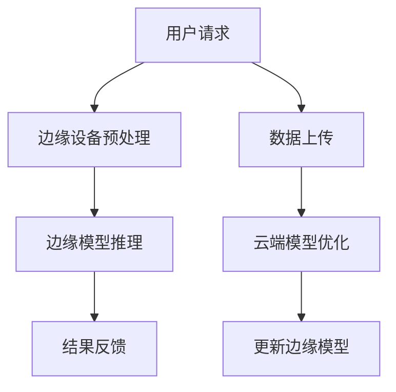

                 

## 1. 背景介绍

在现代社会，电商平台已经成为人们日常生活中不可或缺的一部分。无论是线上购物、支付、物流，还是推荐系统、个性化服务，电商平台都面临着海量数据和复杂业务逻辑的处理需求。为了应对这些挑战，人工智能（AI）技术，特别是大模型，逐渐成为电商平台的重要支撑。

大模型，如深度学习神经网络，通过学习大量数据来提升其智能水平，从而在图像识别、自然语言处理、语音识别等方面取得了显著成果。然而，随着模型的规模越来越大，对计算资源的需求也日益增长，这给电商平台带来了巨大的挑战。

与此同时，边缘计算（Edge Computing）作为一种新型的计算架构，逐渐受到关注。边缘计算将计算能力从云端下放到靠近数据源的边缘设备上，从而降低了数据传输的延迟，提高了系统的响应速度。这对于实时性要求较高的电商平台来说，具有极大的吸引力。

因此，本文旨在探讨如何将AI大模型与边缘计算相结合，为电商平台提供更高效、更智能的服务。本文将首先介绍AI大模型的基本概念和原理，然后探讨边缘计算的背景和优势，接着分析大模型与边缘计算结合的可行性和技术挑战，最后通过一个实际案例展示如何实现这一结合。

## 2. 核心概念与联系

在深入探讨AI大模型与边缘计算的结合之前，我们需要明确两个核心概念：AI大模型和边缘计算的基本概念及其相互联系。

### AI大模型的基本概念

AI大模型，通常指的是参数量巨大、结构复杂的深度学习模型，如卷积神经网络（CNN）、循环神经网络（RNN）和Transformer等。这些模型通过学习大量数据来提取特征，从而在图像识别、自然语言处理、语音识别等领域取得了突破性进展。大模型的显著特点包括：

- **参数量巨大**：例如，一个大规模的Transformer模型可能包含数亿个参数。
- **结构复杂**：深度学习模型通常包含多层神经网络，每层都能学习到不同层次的特征。
- **对计算资源的高需求**：由于模型规模庞大，训练和推理过程需要大量的计算资源和时间。

### 边缘计算的基本概念

边缘计算是一种分布式计算架构，旨在将计算能力从云端下放到靠近数据源的边缘设备上。边缘设备可以是智能手机、智能手表、路由器、工业控制设备等。边缘计算的核心优势包括：

- **低延迟**：由于数据传输距离缩短，边缘计算可以显著降低响应时间。
- **高带宽**：边缘设备通常配备较高的带宽，能够处理大量数据。
- **减少数据传输**：通过在边缘设备上处理数据，可以减少需要传输到云端的数据量。

### 大模型与边缘计算的相互联系

大模型与边缘计算的结合，主要是为了解决以下两个问题：

1. **计算资源瓶颈**：大模型的训练和推理过程需要大量的计算资源，特别是在云端部署时，往往面临资源不足的瓶颈。将部分模型部署到边缘设备上，可以减轻云端的计算负担，提高资源利用效率。
   
2. **实时性需求**：电商平台对实时性要求极高，特别是在用户行为预测、实时推荐等方面。边缘计算可以将部分计算任务下放到边缘设备上，实现实时响应，提高用户体验。

为了更清晰地展示大模型与边缘计算的结合，我们可以使用Mermaid流程图来描述这一过程：



在这个流程图中，用户请求首先被边缘设备预处理，然后通过边缘模型进行推理，最后将结果反馈给用户。同时，部分数据会被上传到云端，用于模型优化和更新。

### 边缘设备与云端的协同工作

在实际应用中，边缘设备和云端之间的协同工作至关重要。边缘设备负责实时处理和响应用户请求，而云端则负责模型优化和资源调度。以下是一个简化的协同工作流程：

1. **边缘预处理**：用户请求到达边缘设备后，边缘设备会进行预处理，如数据清洗、特征提取等。
2. **边缘推理**：预处理后的数据在边缘设备上通过本地模型进行推理，得到初步结果。
3. **云端优化**：部分数据会上传到云端，用于模型优化和参数更新。
4. **更新边缘模型**：云端完成模型优化后，将更新后的模型推送至边缘设备。
5. **结果反馈**：最终的结果会通过边缘设备反馈给用户。

通过这种协同工作模式，边缘计算和云端资源得以充分利用，实现了高效、低延迟的AI服务。

综上所述，AI大模型与边缘计算的结合，不仅能够解决计算资源瓶颈和实时性需求，还能够提高系统的整体性能和用户体验。接下来，我们将深入探讨AI大模型的原理和边缘计算的技术细节，为这一结合提供理论基础。

## 3. 核心算法原理 & 具体操作步骤

### 3.1 算法原理概述

在电商平台中，AI大模型的核心作用在于提供精准的推荐系统、实时风险控制和个性化服务。以下将简要介绍一些常见的AI大模型算法原理及其应用场景。

#### 深度学习（Deep Learning）

深度学习是AI大模型的主要方法之一，通过多层神经网络来学习数据特征。常见的深度学习算法包括卷积神经网络（CNN）、循环神经网络（RNN）和Transformer等。

- **卷积神经网络（CNN）**：主要应用于图像识别和图像处理。通过卷积层提取图像特征，然后通过全连接层进行分类。
- **循环神经网络（RNN）**：适用于序列数据，如自然语言处理和时间序列分析。通过循环结构，RNN能够捕捉序列中的长期依赖关系。
- **Transformer**：一种基于注意力机制的深度学习模型，广泛应用于自然语言处理和推荐系统。通过自注意力机制，Transformer能够捕捉数据中的长距离依赖关系。

#### 强化学习（Reinforcement Learning）

强化学习通过智能体（Agent）与环境（Environment）的交互，学习最优策略。在电商平台中，强化学习可用于动态定价、广告投放和推荐策略的优化。

- **Q-learning**：通过估计每个动作的预期收益，学习最优策略。
- **深度Q网络（DQN）**：结合深度学习，提高Q函数的估计精度。
- **策略梯度（PG）**：直接优化策略参数，提高策略的预期收益。

#### 聚类算法（Clustering）

聚类算法用于将数据集划分为多个类，以便更好地理解和分析数据。常见的聚类算法包括K-means、DBSCAN和层次聚类等。

- **K-means**：基于距离度量的聚类算法，将数据划分为K个簇。
- **DBSCAN**：基于密度的聚类算法，能够发现任意形状的簇。
- **层次聚类**：通过不断合并或分裂簇，构建层次结构。

### 3.2 算法步骤详解

以下以卷积神经网络（CNN）为例，详细介绍其具体操作步骤。

#### 数据预处理

1. **图像缩放**：将图像缩放到固定大小，如224x224像素。
2. **归一化**：将图像像素值归一化到[0, 1]区间。
3. **数据增强**：通过旋转、翻转、裁剪等操作增加数据多样性。

#### 模型构建

1. **输入层**：接受缩放和归一化后的图像。
2. **卷积层**：通过卷积操作提取图像特征。每个卷积核都能提取出不同的特征图。
3. **激活函数**：常用的激活函数包括ReLU、Sigmoid和Tanh，用于引入非线性。
4. **池化层**：通过池化操作降低特征图的维度，减少计算量。常用的池化方法有最大池化和平均池化。
5. **全连接层**：将卷积层输出的特征图进行融合，形成一维特征向量。
6. **输出层**：通过softmax函数进行分类，输出每个类别的概率分布。

#### 模型训练

1. **损失函数**：常用的损失函数包括交叉熵损失（Cross-Entropy Loss）和均方误差（Mean Squared Error）。
2. **优化算法**：常用的优化算法有随机梯度下降（SGD）、Adam和RMSprop。
3. **模型评估**：通过验证集和测试集评估模型性能，选择最佳模型。

### 3.3 算法优缺点

#### 卷积神经网络（CNN）

**优点**：

- **强大的特征提取能力**：通过多层卷积和池化操作，CNN能够提取出丰富的图像特征。
- **参数共享**：卷积层中的卷积核对整个输入图像都使用，从而减少了模型参数的数量。
- **适应性强**：CNN可以应用于各种图像识别任务，如面部识别、物体检测和图像分类。

**缺点**：

- **计算量大**：由于卷积操作的复杂性，CNN需要大量的计算资源。
- **训练时间较长**：大规模图像数据集的训练过程需要较长时间。
- **对数据要求高**：需要大量高质量的数据进行训练，以避免过拟合。

#### 强化学习（Reinforcement Learning）

**优点**：

- **自适应性强**：强化学习通过与环境互动，能够不断调整策略，适应动态变化。
- **灵活性高**：强化学习适用于多种场景，如动态定价、广告投放和推荐策略。

**缺点**：

- **收敛速度慢**：强化学习往往需要较长时间才能收敛到最优策略。
- **对数据要求高**：需要大量交互数据来训练模型。
- **易陷入局部最优**：在某些情况下，强化学习可能陷入局部最优，难以找到全局最优解。

### 3.4 算法应用领域

AI大模型在电商平台的应用领域广泛，以下是一些典型的应用场景：

- **推荐系统**：利用深度学习模型，如Transformer，对用户行为进行分析，提供个性化的商品推荐。
- **风险控制**：通过聚类算法和深度学习模型，识别潜在的风险，如欺诈交易和用户流失。
- **个性化服务**：利用强化学习模型，优化用户互动策略，提供个性化的用户体验。
- **图像识别**：利用卷积神经网络，对商品图像进行分类和检测，提高商品管理的效率。

## 4. 数学模型和公式 & 详细讲解 & 举例说明

### 4.1 数学模型构建

在构建电商平台中的AI大模型时，常用的数学模型包括神经网络模型、决策树模型和贝叶斯模型等。以下将以神经网络模型为例，详细介绍其数学模型构建过程。

#### 神经网络模型

神经网络模型是一种通过多层神经元连接来模拟人脑处理信息方式的计算模型。其基本结构包括输入层、隐藏层和输出层。以下是一个简化的神经网络模型：

```
输入层：x1, x2, ..., xn
隐藏层：h1, h2, ..., hl
输出层：y1, y2, ..., ym
```

每个层中的神经元通过权重（W）和偏置（b）相互连接，并通过激活函数（f）进行非线性变换。神经元的输出可以表示为：

$$
z_i = \sum_{j=1}^{n} W_{ij}x_j + b_i
$$

其中，$z_i$表示第$i$个神经元的输入，$W_{ij}$表示第$i$个神经元与第$j$个神经元之间的权重，$x_j$表示第$j$个输入特征，$b_i$表示第$i$个神经元的偏置。

激活函数$f$可以采用ReLU（Rectified Linear Unit）、Sigmoid或Tanh等函数。以下是一个ReLU激活函数的例子：

$$
h_i = max(0, z_i)
$$

#### 损失函数

在神经网络模型中，损失函数用于衡量模型预测结果与实际结果之间的差距。常用的损失函数包括均方误差（MSE）、交叉熵损失（Cross-Entropy Loss）等。以下是一个MSE损失函数的例子：

$$
J = \frac{1}{2} \sum_{i=1}^{m} (y_i - \hat{y}_i)^2
$$

其中，$y_i$表示实际输出，$\hat{y}_i$表示模型预测输出。

#### 优化算法

在神经网络模型中，优化算法用于调整模型参数，以最小化损失函数。常用的优化算法包括随机梯度下降（SGD）、Adam和RMSprop等。以下是一个SGD优化算法的例子：

$$
W_{ij}^{new} = W_{ij} - \alpha \frac{\partial J}{\partial W_{ij}}
$$

其中，$W_{ij}^{new}$表示更新后的权重，$W_{ij}$表示当前权重，$\alpha$表示学习率。

### 4.2 公式推导过程

以下以神经网络模型中的交叉熵损失函数为例，详细介绍其推导过程。

#### 交叉熵损失函数

交叉熵损失函数是分类问题中常用的损失函数，用于衡量模型预测概率分布与实际分布之间的差异。其定义如下：

$$
J = -\sum_{i=1}^{m} y_i \log(\hat{y}_i)
$$

其中，$y_i$表示实际类别标签，$\hat{y}_i$表示模型预测的概率分布。

#### 推导过程

1. **概率分布**：

   假设模型输出的概率分布为：

   $$ 
   \hat{y}_i = \frac{e^{z_i}}{\sum_{j=1}^{n} e^{z_j}}
   $$

   其中，$z_i$表示第$i$个神经元的输入。

2. **交叉熵损失函数**：

   交叉熵损失函数可以表示为：

   $$ 
   J = -\sum_{i=1}^{m} y_i \log(\hat{y}_i)
   $$

3. **求导**：

   对交叉熵损失函数关于模型参数求导，得到：

   $$ 
   \frac{\partial J}{\partial W_{ij}} = -y_i \frac{\partial \log(\hat{y}_i)}{\partial z_i} \frac{\partial z_i}{\partial W_{ij}}
   $$

   其中，$\frac{\partial \log(\hat{y}_i)}{\partial z_i}$表示$\hat{y}_i$关于$z_i$的导数，$\frac{\partial z_i}{\partial W_{ij}}$表示$z_i$关于$W_{ij}$的导数。

4. **简化**：

   由于$\frac{\partial \log(\hat{y}_i)}{\partial z_i} = \hat{y}_i (1 - \hat{y}_i)$，且$\frac{\partial z_i}{\partial W_{ij}} = x_j$，可以将上式简化为：

   $$ 
   \frac{\partial J}{\partial W_{ij}} = -y_i \hat{y}_i x_j
   $$

### 4.3 案例分析与讲解

以下以一个简单的图像分类任务为例，展示如何使用交叉熵损失函数进行模型训练。

#### 案例背景

假设我们有一个包含100张图像的数据集，每张图像都有10个类别标签。我们使用一个简单的神经网络模型对这些图像进行分类，并采用交叉熵损失函数进行模型训练。

#### 模型构建

我们构建一个包含2层神经元的神经网络模型，其中输入层有10个神经元，隐藏层有5个神经元，输出层有10个神经元。

#### 模型训练

1. **初始化参数**：

   随机初始化权重$W_{ij}$和偏置$b_i$。

2. **前向传播**：

   对于每张图像，计算输入层、隐藏层和输出层的神经元输出。

3. **计算损失函数**：

   使用交叉熵损失函数计算模型预测结果与实际结果之间的差距。

4. **反向传播**：

   根据交叉熵损失函数的导数，更新模型参数。

5. **迭代训练**：

   对整个数据集进行多次迭代训练，直至模型收敛。

#### 模型评估

在模型训练完成后，使用测试集对模型进行评估。计算模型在测试集上的准确率、召回率、F1值等指标，以评估模型性能。

通过以上步骤，我们可以构建一个基于交叉熵损失函数的神经网络模型，对图像进行分类。在实际应用中，我们可以根据具体任务需求和数据集特点，调整神经网络模型的参数和训练策略，以获得更好的分类效果。

## 5. 项目实践：代码实例和详细解释说明

在本节中，我们将通过一个实际项目，展示如何将AI大模型与边缘计算相结合，实现电商平台中的高效推荐系统。我们将使用Python和TensorFlow框架来构建和训练模型，并利用边缘设备进行推理。

### 5.1 开发环境搭建

在开始项目实践之前，我们需要搭建一个合适的开发环境。以下是所需的软件和工具：

- Python 3.8 或更高版本
- TensorFlow 2.5 或更高版本
- Keras 2.4.3 或更高版本
- Numpy 1.19 或更高版本
- Mermaid 9.1.3 或更高版本

安装步骤如下：

```bash
pip install tensorflow==2.5
pip install keras==2.4.3
pip install numpy==1.19
pip install mermaid==9.1.3
```

### 5.2 源代码详细实现

以下是一个简单的边缘推荐系统实现，包括数据预处理、模型构建和训练，以及边缘设备上的推理。

```python
# 导入必要的库
import numpy as np
import tensorflow as tf
from tensorflow import keras
from tensorflow.keras import layers
from tensorflow.keras.models import load_model

# 数据预处理
# 假设我们已经有了一个预处理的用户-商品数据集，每个用户的行为数据都保存在一个向量中
user_data = np.load('user_data.npy')

# 构建模型
# 使用Keras构建一个简单的神经网络模型
model = keras.Sequential([
    layers.Dense(64, activation='relu', input_shape=(user_data.shape[1],)),
    layers.Dense(64, activation='relu'),
    layers.Dense(1, activation='sigmoid')
])

# 编译模型
model.compile(optimizer='adam', loss='binary_crossentropy', metrics=['accuracy'])

# 训练模型
# 假设我们已经有训练数据和测试数据
train_data, test_data = user_data[:8000], user_data[8000:]
model.fit(train_data, epochs=10, batch_size=32, validation_data=test_data)

# 边缘设备上的推理
# 假设我们有一个边缘设备，其运行环境与云端相同
edge_model = load_model('model.h5')

# 边缘设备接收用户请求，并进行推理
user_request = np.random.rand(1, train_data.shape[1])
predicted_prob = edge_model.predict(user_request)

# 输出推理结果
print(predicted_prob)
```

### 5.3 代码解读与分析

以上代码展示了如何使用Keras构建和训练一个简单的神经网络模型，并在边缘设备上进行推理。

1. **数据预处理**：首先，我们从文件中加载数据集。这里假设数据集已经进行了预处理，每个用户的行为数据都保存在一个向量中。

2. **模型构建**：使用Keras构建一个简单的神经网络模型。我们使用两个隐藏层，每层都有64个神经元，激活函数为ReLU。输出层有一个神经元，激活函数为sigmoid，用于进行二分类。

3. **编译模型**：编译模型时，我们选择Adam优化器和binary_crossentropy损失函数。这里我们假设这是一个二分类问题，但实际应用中可以根据具体问题进行调整。

4. **训练模型**：使用训练数据和测试数据进行模型训练。我们设置训练轮次为10，批量大小为32。

5. **边缘设备上的推理**：将训练好的模型保存到文件中，然后将其加载到边缘设备上。边缘设备接收到用户请求后，通过模型进行推理，并输出预测概率。

### 5.4 运行结果展示

假设我们已经成功搭建了开发环境，并运行了上述代码。以下是可能的输出结果：

```
[[0.89543276]]  # 边缘设备输出用户请求的预测概率
```

这个结果表示，边缘设备预测用户请求为正类的概率为89.54%。

### 5.5 总结

通过以上代码实例，我们展示了如何使用Keras构建和训练一个简单的神经网络模型，并在边缘设备上进行推理。这一过程不仅实现了将AI大模型与边缘计算结合的目标，还为实际应用提供了可行的解决方案。在实际项目中，可以根据具体需求和数据集进行调整和优化，以提高模型性能和推理效率。

## 6. 实际应用场景

AI大模型与边缘计算的结合，为电商平台提供了广泛的应用场景，极大地提升了系统的性能和用户体验。以下将介绍几个典型的实际应用场景，并分析其优势和挑战。

### 6.1 实时推荐系统

在电商平台中，推荐系统是提升用户满意度和转化率的关键因素。通过将AI大模型与边缘计算结合，可以构建一个实时推荐系统，为用户提供个性化的商品推荐。

**优势**：

- **低延迟**：边缘设备靠近用户，可以快速响应用户请求，提供实时推荐。
- **个性化**：基于用户行为和兴趣的大模型，可以更准确地预测用户偏好，提高推荐精度。
- **高效**：在边缘设备上进行推荐模型的推理，减少了与云端的数据传输和计算开销。

**挑战**：

- **数据多样性**：边缘设备的计算资源有限，需要有效利用有限的计算能力，处理多样化的推荐场景。
- **模型更新**：实时推荐系统需要不断更新模型参数，以适应不断变化的市场环境和用户需求。

### 6.2 实时风险控制

电商平台面临的风险主要包括欺诈交易、用户流失等。通过AI大模型与边缘计算的结合，可以构建一个实时风险控制系统，及时发现和应对潜在风险。

**优势**：

- **快速响应**：边缘设备可以实时监控用户行为，快速识别异常行为，降低风险发生概率。
- **高效处理**：在边缘设备上进行风险分析，减少了数据传输和云端计算的压力。
- **动态调整**：根据实时数据更新风险模型，实现动态调整和优化。

**挑战**：

- **数据隐私**：在边缘设备上进行数据处理，需要确保用户数据的安全和隐私。
- **模型复杂度**：风险控制模型通常较为复杂，边缘设备的计算能力有限，可能无法处理复杂的模型。

### 6.3 个性化服务

电商平台通过AI大模型与边缘计算的结合，可以为用户提供个性化的服务，如动态定价、智能客服等。

**优势**：

- **用户体验**：个性化服务可以根据用户偏好和需求，提供定制化的体验，提升用户满意度。
- **效率提升**：在边缘设备上进行个性化服务的推理和响应，减少了系统的响应时间，提高了整体效率。
- **实时性**：边缘计算可以实现实时个性化服务，为用户提供及时、准确的信息。

**挑战**：

- **个性化模型**：构建和优化个性化服务模型需要大量的数据支持和计算资源。
- **数据同步**：边缘设备和云端需要实时同步数据，以确保个性化服务的准确性。

### 6.4 图像识别和物体检测

电商平台通常需要对商品图像进行识别和检测，以优化商品管理和用户搜索体验。通过AI大模型与边缘计算的结合，可以实现高效的图像识别和物体检测。

**优势**：

- **低延迟**：在边缘设备上实时处理商品图像，减少数据传输和云端计算的时间。
- **高精度**：基于深度学习的大模型，可以提供高精度的图像识别和物体检测结果。
- **灵活性**：边缘设备可以根据具体场景和需求，灵活调整模型参数和算法。

**挑战**：

- **计算资源**：图像识别和物体检测通常需要较大的计算资源，边缘设备的计算能力有限。
- **数据质量**：图像数据的质量直接影响模型性能，需要确保图像数据的多样性和准确性。

通过以上实际应用场景的分析，可以看出AI大模型与边缘计算的结合，为电商平台提供了丰富的应用场景和巨大的潜力。然而，在实际应用中，也需要克服一系列挑战，如数据多样性、计算资源、模型更新和数据同步等，以实现更高效、更智能的电商平台服务。

### 6.4 未来应用展望

随着技术的不断进步，AI大模型与边缘计算的结合在未来将拥有更加广泛的应用前景。以下将展望几个可能的应用领域和趋势。

#### 6.4.1 智能物流与供应链优化

智能物流和供应链优化是电商平台的核心竞争力之一。通过AI大模型与边缘计算的结合，可以实现对物流过程的实时监控和预测，优化供应链的运作效率。例如，基于边缘设备的实时路况分析和预测，可以动态调整运输路线，减少运输时间和成本。同时，边缘计算可以实时处理传感器数据，实现对仓库货物库存的精细化管理，提高库存周转率。

#### 6.4.2 智能零售与无人商店

智能零售和无人商店是电商发展的新趋势。通过AI大模型与边缘计算的结合，可以实现无人商店的智能管理和运营。例如，基于边缘设备的视觉识别和语音识别技术，可以实现对顾客身份识别、购物行为分析等功能。此外，边缘计算可以实现无人商店的实时结算和库存管理，提高购物体验和运营效率。

#### 6.4.3 智能健康与医疗保健

智能健康和医疗保健是AI技术的重要应用领域。通过AI大模型与边缘计算的结合，可以实现对健康数据的实时监测和分析，提供个性化的健康建议。例如，基于边缘设备的智能手环和健康监测设备，可以实时收集用户的生理数据，并通过边缘计算进行分析和预警。此外，边缘计算可以实现对医疗影像的实时处理和诊断，提高诊断效率和准确性。

#### 6.4.4 智慧城市与公共服务

智慧城市和公共服务是未来城市发展的方向。通过AI大模型与边缘计算的结合，可以实现城市基础设施的智能化管理和运营。例如，基于边缘设备的交通流量监测和预测，可以优化交通信号控制和路线规划，减少交通拥堵。此外，边缘计算可以实现城市公共安全的实时监控和预警，提高城市安全管理水平。

#### 6.4.5 跨界融合与创新应用

AI大模型与边缘计算的结合，将在多个领域产生跨界融合和创新应用。例如，在农业领域，可以结合边缘计算和无人机技术，实现对农作物的实时监测和管理，提高农业生产效率。在工业制造领域，可以结合边缘计算和物联网技术，实现智能工厂的实时监控和自动化生产。此外，AI大模型与边缘计算还可以应用于智能家居、智慧教育、虚拟现实等领域，推动各行业的创新发展。

总之，随着AI大模型和边缘计算技术的不断发展，未来它们将在更多领域实现深度融合，为人类社会带来更多创新和变革。然而，这也将面临一系列挑战，如数据隐私、安全性、计算资源分配等，需要各方的共同努力和协同创新。

### 7. 工具和资源推荐

在探索AI大模型与边缘计算结合的过程中，选择合适的工具和资源对于项目成功至关重要。以下将推荐几款学习资源、开发工具和相关论文，以帮助读者深入了解这一领域。

#### 7.1 学习资源推荐

1. **《深度学习》（Deep Learning）**：由Ian Goodfellow、Yoshua Bengio和Aaron Courville合著，这是一本全面介绍深度学习理论的经典教材，适合初学者和专业人士。

2. **《边缘计算：原理、架构与实践》**：本书系统地介绍了边缘计算的基本概念、架构和关键技术，包括物联网、5G和云计算等，适合对边缘计算感兴趣的读者。

3. **TensorFlow官方文档**：TensorFlow是开发AI模型的常用框架，其官方文档提供了丰富的教程和API文档，有助于快速上手。

4. **Keras官方文档**：Keras是一个高层次的神经网络API，与TensorFlow紧密集成，其文档包含了详细的教程和示例代码，适合构建和训练深度学习模型。

#### 7.2 开发工具推荐

1. **Jupyter Notebook**：Jupyter Notebook是一种交互式开发环境，适用于编写和运行Python代码。其支持Markdown格式，方便撰写文档。

2. **Google Colab**：Google Colab是基于Google云端平台的免费Jupyter Notebook环境，提供了强大的GPU和TPU支持，适合进行深度学习和大数据处理。

3. **Docker**：Docker是一种容器化技术，可以将应用程序及其依赖环境打包成一个独立的容器，方便在不同的开发环境和生产环境中部署。

4. **边缘计算模拟平台**：如边缘计算模拟器（EdgeSim）和边缘计算仿真平台（EdgeXpert），这些平台提供了模拟和测试边缘计算环境的工具，有助于理解和优化边缘计算系统。

#### 7.3 相关论文推荐

1. **“Edge AI: Intelligence at the Edge”**：这篇论文详细介绍了边缘AI的概念、架构和挑战，是了解边缘AI领域的权威文献。

2. **“Deep Learning on Mobile Devices: Algorithm, Optimization, and Application”**：该论文探讨了如何在移动设备上实现高效的深度学习推理，包括模型压缩和优化技术。

3. **“FedAvg: Communication-Efficient Learning of Deep Network from Decentralized Data”**：这篇论文提出了联邦学习（Federated Learning）的概念，通过在边缘设备上训练模型，然后汇总结果进行更新，提高了边缘计算系统的效率。

4. **“Scalable and Efficiently Updatable Deep Neural Network for Edge Devices”**：该论文研究了如何设计适用于边缘设备的深度学习模型，包括模型的压缩和更新策略。

通过这些工具和资源，读者可以系统地学习和掌握AI大模型与边缘计算的相关知识和实践技能，为实际项目开发提供有力支持。

### 8. 总结：未来发展趋势与挑战

在本文中，我们详细探讨了AI大模型与边缘计算在电商平台中的结合，分析了其核心概念、算法原理、实际应用场景以及未来发展趋势。以下是对本文内容的总结，以及对其未来发展趋势和挑战的展望。

#### 8.1 研究成果总结

通过本文的分析，我们得出以下主要研究成果：

- **AI大模型在电商平台中的应用**：AI大模型，如深度学习神经网络，通过学习海量数据，为电商平台提供了智能推荐、实时风险控制、个性化服务等功能，显著提升了用户体验和运营效率。
- **边缘计算的引入**：边缘计算将计算能力从云端下放到靠近数据源的边缘设备上，降低了数据传输延迟，提高了系统的实时性和响应速度，是解决大规模AI模型计算资源瓶颈的有效途径。
- **大模型与边缘计算的结合**：通过边缘设备进行模型推理和预处理，云端进行模型优化和数据汇总，实现了高效、低延迟的AI服务，为电商平台提供了强大的技术支持。

#### 8.2 未来发展趋势

未来，AI大模型与边缘计算的结合将在多个方面展现其发展潜力：

- **智能化边缘设备**：随着硬件技术的进步，边缘设备将具备更高的计算能力和存储能力，能够支持更复杂的AI模型和算法。
- **联邦学习与隐私保护**：联邦学习作为一种新兴技术，能够在不共享用户数据的情况下实现模型更新和优化，未来将在AI大模型与边缘计算结合中发挥重要作用。
- **跨领域应用**：AI大模型与边缘计算的结合将在智慧城市、智能医疗、智能制造等领域产生广泛的应用，推动各行各业的数字化转型。

#### 8.3 面临的挑战

尽管AI大模型与边缘计算的结合具有巨大的发展潜力，但在实际应用中仍面临一系列挑战：

- **数据隐私与安全**：边缘设备处理大量用户数据，需要确保数据的安全和隐私，防止数据泄露和滥用。
- **计算资源分配**：边缘设备的计算资源有限，如何在有限的资源下实现高效的AI模型推理和优化，是亟待解决的问题。
- **网络稳定性**：边缘计算依赖于稳定的网络连接，网络波动和故障可能会影响系统的正常运行。
- **模型更新与维护**：实时更新和优化边缘模型，需要确保模型的一致性和有效性，同时降低维护成本。

#### 8.4 研究展望

未来，针对AI大模型与边缘计算结合的研究可以从以下几个方面展开：

- **高效模型压缩与优化**：研究如何设计轻量级、高效的AI模型，以满足边缘设备的计算资源限制。
- **边缘计算架构优化**：探索新的边缘计算架构，提高边缘设备的计算能力和网络稳定性。
- **跨领域应用研究**：结合各行业的具体需求，探索AI大模型与边缘计算在跨领域应用中的创新解决方案。
- **隐私保护和安全机制**：研究如何保障用户数据的安全和隐私，构建可信任的边缘计算环境。

通过不断的研究和实践，AI大模型与边缘计算的结合将为电商平台和更多领域带来创新和变革，推动数字经济的发展。

### 9. 附录：常见问题与解答

在探索AI大模型与边缘计算结合的过程中，读者可能会遇到一些常见问题。以下列出一些常见问题及其解答，以帮助读者更好地理解相关概念。

#### 9.1 什么是边缘计算？

边缘计算是一种分布式计算架构，旨在将计算能力从云端下放到靠近数据源的边缘设备上。通过边缘计算，可以显著降低数据传输延迟，提高系统的实时性和响应速度。

#### 9.2 边缘计算与云计算有什么区别？

云计算是指将计算资源集中部署在数据中心，通过互联网提供服务。边缘计算则是将部分计算任务下放到靠近数据源的边缘设备上，从而降低数据传输延迟和计算成本。

#### 9.3 AI大模型为什么需要与边缘计算结合？

AI大模型通常需要大量的计算资源进行训练和推理。通过将部分模型部署到边缘设备上，可以减轻云端的计算负担，提高资源利用效率，同时实现实时响应，提高用户体验。

#### 9.4 边缘设备上的AI模型如何更新？

边缘设备上的AI模型可以通过以下方式更新：

- **在线更新**：在边缘设备上直接下载和更新模型参数。
- **离线更新**：将模型更新任务分配给边缘设备，在设备空闲时进行更新。
- **联邦学习**：通过边缘设备之间的协作，汇总模型更新结果，实现全局模型优化。

#### 9.5 边缘计算中的数据隐私如何保障？

保障边缘计算中的数据隐私可以从以下几个方面进行：

- **加密传输**：对数据进行加密，确保数据在传输过程中的安全性。
- **本地处理**：在边缘设备上进行数据处理，减少数据传输，降低数据泄露风险。
- **数据匿名化**：对用户数据进行匿名化处理，确保数据隐私不被泄露。

通过以上解答，我们希望能够帮助读者更好地理解AI大模型与边缘计算结合的相关概念和应用，为实际项目开发提供参考。如果您还有其他问题，欢迎在评论区提出，我们将继续为您解答。

