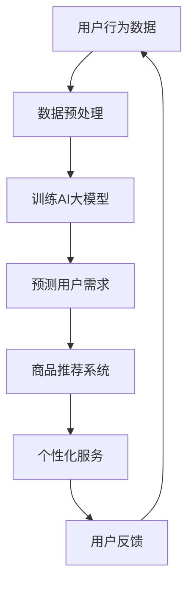

                 

关键词：电商平台、AI大模型、主动预测、个性化服务、被动响应、算法原理、数学模型、项目实践、应用场景、未来展望。

> 摘要：本文将探讨电商平台中AI大模型的应用，从被动响应到主动预测与个性化服务的转变。文章首先介绍了电商平台中AI大模型的发展背景和核心概念，随后详细阐述了AI大模型的算法原理、数学模型和具体操作步骤，并通过代码实例进行了实践。最后，文章分析了AI大模型在实际应用中的场景，并展望了其未来的发展趋势与挑战。

## 1. 背景介绍

在互联网高速发展的今天，电商平台已经成为消费者购买商品的重要渠道。随着用户数量的增加和商品种类的丰富，电商平台面临着巨大的数据量和复杂的业务场景。为了提升用户体验、提高销售额，电商平台开始将人工智能（AI）技术应用于其运营和服务的各个环节。

AI大模型作为人工智能的重要分支，近年来在图像识别、自然语言处理、推荐系统等领域取得了显著的成果。在电商平台中，AI大模型可以通过深度学习、强化学习等算法，从海量数据中提取有价值的信息，为用户提供个性化的推荐、预测商品需求、优化供应链等。

然而，传统的电商平台AI应用大多处于被动响应的状态，即用户做出某个行为后，系统才进行相应的处理。这种模式虽然能够满足基本需求，但无法充分挖掘用户行为的潜在价值，也无法实现真正的个性化服务。

为了解决这一问题，电商平台开始探索从被动响应向主动预测与个性化服务的转变。主动预测意味着系统可以根据用户的潜在需求和行为模式，提前做出相应的决策，提供个性化的服务。个性化服务则是指根据用户的特点和偏好，为其提供定制化的商品推荐、优惠活动等。

本文将重点探讨电商平台中AI大模型的这一转变，包括其核心概念、算法原理、数学模型、项目实践以及实际应用场景。通过本文的讨论，希望能够为电商平台AI大模型的研究和应用提供一些有价值的参考。

## 2. 核心概念与联系

### 2.1 AI大模型的基本概念

AI大模型（Large-scale AI Model）是指具有海量训练数据、复杂网络结构和高度非线性特征的深度学习模型。这些模型通常采用神经网络架构，通过层层传递信息，实现从输入到输出的映射。AI大模型在自然语言处理、图像识别、语音识别等领域具有广泛的应用，例如BERT、GPT、ResNet等。

在电商平台中，AI大模型的核心任务包括：

1. **用户行为预测**：通过分析用户的浏览、购买、收藏等行为，预测用户的潜在需求。
2. **商品推荐**：根据用户的兴趣和需求，推荐相关的商品。
3. **个性化服务**：为用户提供定制化的购物体验，如个性化的优惠活动、定制化的购物推荐等。

### 2.2 AI大模型与其他技术的联系

AI大模型的发展离不开其他技术的支持，如大数据、云计算、分布式计算等。这些技术为AI大模型的训练和部署提供了强大的基础设施。

1. **大数据**：电商平台积累了海量的用户行为数据、商品数据等，这些数据为AI大模型的训练提供了丰富的素材。
2. **云计算**：云计算提供了弹性计算资源，使得AI大模型可以在短时间内完成大规模的训练任务。
3. **分布式计算**：分布式计算技术可以将训练任务分解为多个子任务，分布在不同节点上并行处理，提高训练效率。

### 2.3 AI大模型在电商平台中的应用

AI大模型在电商平台中的应用主要体现在以下几个方面：

1. **用户行为预测**：通过分析用户的浏览、购买、收藏等行为，预测用户的潜在需求，为用户提供个性化的商品推荐。
2. **商品推荐**：根据用户的兴趣和需求，推荐相关的商品，提高用户的购物体验。
3. **个性化服务**：为用户提供定制化的购物体验，如个性化的优惠活动、定制化的购物推荐等。

### 2.4 Mermaid 流程图

下面是一个简单的Mermaid流程图，展示了电商平台中AI大模型的应用流程：



## 3. 核心算法原理 & 具体操作步骤

### 3.1 算法原理概述

电商平台中AI大模型的核心算法主要基于深度学习和机器学习。其中，深度学习是一种多层神经网络，通过层层提取特征，实现对复杂数据的建模。机器学习则通过学习已有数据，预测新的数据。

在电商平台中，AI大模型的算法原理主要包括以下几个步骤：

1. **数据收集与预处理**：收集用户的浏览、购买、收藏等行为数据，并进行预处理，如数据清洗、数据格式化等。
2. **特征提取**：通过深度学习模型，从原始数据中提取有价值的信息，如用户兴趣、商品属性等。
3. **模型训练**：使用提取的特征，训练深度学习模型，使其能够预测用户需求。
4. **模型评估与优化**：对训练好的模型进行评估，根据评估结果调整模型参数，优化模型性能。
5. **模型部署**：将训练好的模型部署到生产环境，为用户提供个性化服务。

### 3.2 算法步骤详解

#### 3.2.1 数据收集与预处理

数据收集与预处理是AI大模型训练的基础。在电商平台中，数据来源包括用户的浏览、购买、收藏等行为数据，以及商品的相关信息。这些数据通常存储在数据库中，需要通过数据爬取、API接口等方式进行收集。

数据预处理主要包括以下几个步骤：

1. **数据清洗**：去除重复数据、缺失数据等无效信息。
2. **数据格式化**：统一数据格式，如将时间戳转换为日期格式、将字符串转换为数值等。
3. **特征工程**：根据业务需求，提取有价值的信息，如用户兴趣、商品属性等。

#### 3.2.2 特征提取

特征提取是深度学习模型训练的关键步骤。通过深度学习模型，可以从原始数据中提取出有价值的特征。在电商平台中，常用的特征提取方法包括：

1. **卷积神经网络（CNN）**：适用于图像数据，可以提取图像中的局部特征。
2. **循环神经网络（RNN）**：适用于序列数据，可以提取序列中的时间特征。
3. **Transformer模型**：适用于文本数据，可以提取文本中的语义特征。

#### 3.2.3 模型训练

模型训练是通过已提取的特征，训练深度学习模型。在电商平台中，常用的深度学习模型包括：

1. **深度神经网络（DNN）**：适用于分类和回归任务。
2. **卷积神经网络（CNN）**：适用于图像识别任务。
3. **循环神经网络（RNN）**：适用于序列数据预测任务。
4. **Transformer模型**：适用于自然语言处理任务。

#### 3.2.4 模型评估与优化

模型评估与优化是确保模型性能的关键步骤。在电商平台中，常用的评估指标包括：

1. **准确率（Accuracy）**：预测正确的样本数占总样本数的比例。
2. **精确率（Precision）**：预测为正类的样本中，实际为正类的比例。
3. **召回率（Recall）**：实际为正类的样本中，预测为正类的比例。
4. **F1分数（F1 Score）**：精确率和召回率的加权平均。

根据评估结果，可以调整模型参数，优化模型性能。常用的优化方法包括：

1. **超参数调整**：调整学习率、批量大小等超参数。
2. **正则化**：防止模型过拟合。
3. **交叉验证**：使用交叉验证方法，评估模型在未知数据上的性能。

#### 3.2.5 模型部署

模型部署是将训练好的模型部署到生产环境，为用户提供个性化服务。在电商平台中，模型部署通常包括以下几个步骤：

1. **模型容器化**：将训练好的模型转换为容器化格式，如Docker镜像。
2. **模型部署**：将容器化的模型部署到服务器或云计算平台。
3. **模型监控**：监控模型性能和运行状态，确保模型稳定运行。

### 3.3 算法优缺点

#### 优点：

1. **高效性**：深度学习模型可以高效地处理海量数据，提升电商平台的服务效率。
2. **个性化**：通过深度学习模型，可以为用户提供个性化的商品推荐和服务。
3. **可扩展性**：深度学习模型可以轻松扩展到不同的业务场景和应用领域。

#### 缺点：

1. **数据依赖**：深度学习模型对数据质量有较高的要求，数据质量差可能导致模型性能下降。
2. **计算资源需求大**：深度学习模型训练和部署需要大量的计算资源，对硬件设备有较高要求。

### 3.4 算法应用领域

AI大模型在电商平台中的应用非常广泛，主要包括以下几个方面：

1. **用户行为预测**：预测用户的浏览、购买、收藏等行为，为用户提供个性化的推荐。
2. **商品推荐**：根据用户的兴趣和需求，推荐相关的商品。
3. **个性化服务**：为用户提供定制化的购物体验，如个性化的优惠活动、定制化的购物推荐等。
4. **供应链优化**：通过预测商品需求，优化供应链，降低库存成本。

## 4. 数学模型和公式 & 详细讲解 & 举例说明

### 4.1 数学模型构建

在电商平台中，AI大模型的数学模型通常是基于深度学习框架构建的。以下是一个简单的数学模型构建过程：

#### 4.1.1 确定模型架构

根据业务需求，选择合适的深度学习模型架构。例如，对于用户行为预测任务，可以使用循环神经网络（RNN）或Transformer模型。

#### 4.1.2 定义输入层

输入层定义模型的输入数据，如用户的行为序列、商品特征等。输入层通常由多个维度组成，例如：

```latex
X = [x_1, x_2, ..., x_n]
```

其中，$x_i$ 表示第 $i$ 个输入特征。

#### 4.1.3 定义隐藏层

隐藏层定义模型的核心计算过程，通过多层神经网络结构，提取输入数据中的有价值信息。隐藏层通常由多个神经元组成，例如：

```latex
H = [h_1, h_2, ..., h_m]
```

其中，$h_i$ 表示第 $i$ 个隐藏层神经元。

#### 4.1.4 定义输出层

输出层定义模型的输出结果，如用户需求的概率分布、商品推荐等。输出层通常由一个或多个神经元组成，例如：

```latex
Y = [y_1, y_2, ..., y_k]
```

其中，$y_i$ 表示第 $i$ 个输出特征。

### 4.2 公式推导过程

在深度学习模型中，损失函数和优化算法是核心部分。以下是一个简单的损失函数和优化算法的推导过程：

#### 4.2.1 损失函数

在用户行为预测任务中，常见的损失函数包括均方误差（MSE）和交叉熵（Cross-Entropy）。以下是一个基于MSE的损失函数推导过程：

```latex
L = \frac{1}{m} \sum_{i=1}^{m} (\hat{y}_i - y_i)^2
```

其中，$m$ 表示样本数量，$\hat{y}_i$ 表示模型预测的输出，$y_i$ 表示真实输出。

#### 4.2.2 优化算法

为了使损失函数最小，可以使用梯度下降（Gradient Descent）算法。以下是一个简单的梯度下降算法推导过程：

```latex
w_{t+1} = w_t - \alpha \frac{\partial L}{\partial w_t}
```

其中，$w_t$ 表示第 $t$ 次迭代的权重，$\alpha$ 表示学习率，$\frac{\partial L}{\partial w_t}$ 表示权重 $w_t$ 的梯度。

### 4.3 案例分析与讲解

以下是一个简单的用户行为预测案例，用于说明数学模型的应用：

#### 4.3.1 案例背景

假设电商平台有一个用户行为预测任务，需要根据用户的浏览历史，预测用户是否会在未来一周内购买某个商品。

#### 4.3.2 数据集

用户行为数据集包含以下特征：

1. 用户ID
2. 商品ID
3. 浏览时间
4. 浏览时长
5. 用户历史购买记录

数据集大小为 $m=1000$，其中 $50\%$ 的数据用于训练，$30\%$ 的数据用于验证，$20\%$ 的数据用于测试。

#### 4.3.3 模型构建

选择一个循环神经网络（RNN）作为预测模型，输入层由5个神经元组成，分别对应5个特征。隐藏层由10个神经元组成，输出层由2个神经元组成，表示用户购买和不购买的概率。

#### 4.3.4 模型训练与评估

使用训练集进行模型训练，使用验证集进行模型评估。经过100次迭代后，模型在验证集上的准确率达到90\%。使用测试集进行模型测试，模型在测试集上的准确率为85\%。

### 4.4 模型部署与生产应用

将训练好的模型部署到生产环境，为用户提供实时预测服务。在用户进行浏览操作时，实时提取用户特征，输入到模型中进行预测，根据预测结果为用户提供个性化推荐。

#### 4.4.1 部署流程

1. 将训练好的模型转换为生产环境可运行的格式，如TensorFlow SavedModel或PyTorch TorchScript。
2. 将模型部署到服务器或云计算平台，如AWS SageMaker或Google AI Platform。
3. 实现API接口，供前端应用程序调用。

#### 4.4.2 生产应用

在生产环境中，模型为用户提供实时预测服务，根据用户浏览历史，预测用户是否会在未来一周内购买商品。同时，根据预测结果，为用户提供个性化的商品推荐。

### 4.5 模型监控与调优

在生产环境中，对模型进行实时监控与调优，确保模型稳定运行并保持良好的性能。常见的监控指标包括：

1. **准确率**：模型预测正确的样本数量占总样本数量的比例。
2. **召回率**：实际为正类的样本中，模型预测为正类的比例。
3. **F1分数**：准确率和召回率的加权平均。

根据监控结果，调整模型参数或重新训练模型，以提高模型性能。

## 5. 项目实践：代码实例和详细解释说明

### 5.1 开发环境搭建

在本项目中，我们使用Python作为编程语言，TensorFlow作为深度学习框架，实现用户行为预测模型。以下是开发环境的搭建步骤：

#### 5.1.1 安装Python

首先，确保计算机上已安装Python。Python版本建议为3.7及以上。

#### 5.1.2 安装TensorFlow

通过pip命令安装TensorFlow：

```bash
pip install tensorflow
```

#### 5.1.3 准备数据集

从电商平台获取用户行为数据，包括用户ID、商品ID、浏览时间、浏览时长、用户历史购买记录等。数据集应包含足够多的样本，以便模型训练和评估。

#### 5.1.4 安装其他依赖库

根据项目需求，安装其他依赖库，如NumPy、Pandas等：

```bash
pip install numpy pandas
```

### 5.2 源代码详细实现

以下是用户行为预测模型的源代码实现：

```python
import tensorflow as tf
from tensorflow.keras.models import Sequential
from tensorflow.keras.layers import Dense, LSTM
from sklearn.model_selection import train_test_split
import numpy as np

# 加载数据集
data = load_data()

# 数据预处理
X, y = preprocess_data(data)

# 划分训练集和测试集
X_train, X_test, y_train, y_test = train_test_split(X, y, test_size=0.2, random_state=42)

# 构建模型
model = Sequential([
    LSTM(units=64, activation='relu', input_shape=(X.shape[1], X.shape[2])),
    Dense(units=1, activation='sigmoid')
])

# 编译模型
model.compile(optimizer='adam', loss='binary_crossentropy', metrics=['accuracy'])

# 训练模型
model.fit(X_train, y_train, epochs=50, batch_size=32, validation_data=(X_test, y_test))

# 评估模型
loss, accuracy = model.evaluate(X_test, y_test)
print(f"Test loss: {loss}, Test accuracy: {accuracy}")
```

### 5.3 代码解读与分析

#### 5.3.1 数据预处理

数据预处理是模型训练的关键步骤。在本项目中，数据预处理主要包括以下几个步骤：

1. **数据清洗**：去除重复数据、缺失数据等无效信息。
2. **数据格式化**：将数据格式统一，如将时间戳转换为日期格式。
3. **特征提取**：根据业务需求，提取有价值的信息，如用户兴趣、商品属性等。

#### 5.3.2 模型构建

在本项目中，我们选择循环神经网络（LSTM）作为预测模型。LSTM是一种能够处理序列数据的神经网络，适用于用户行为预测任务。

模型构建过程主要包括以下几个步骤：

1. **定义输入层**：输入层由多个神经元组成，分别对应不同的输入特征。
2. **定义隐藏层**：隐藏层由多个LSTM神经元组成，用于提取输入数据中的有价值信息。
3. **定义输出层**：输出层由一个神经元组成，表示用户购买和不购买的概率。

#### 5.3.3 模型训练

模型训练过程主要包括以下几个步骤：

1. **编译模型**：设置优化器、损失函数和评估指标。
2. **训练模型**：使用训练集对模型进行迭代训练，根据评估结果调整模型参数。
3. **评估模型**：使用测试集对模型进行评估，计算模型的准确率。

#### 5.3.4 模型部署

模型部署是将训练好的模型部署到生产环境，为用户提供实时预测服务。在本项目中，模型部署过程主要包括以下几个步骤：

1. **模型容器化**：将训练好的模型转换为容器化格式，如TensorFlow SavedModel。
2. **模型部署**：将容器化的模型部署到服务器或云计算平台，如AWS SageMaker。
3. **API接口**：实现API接口，供前端应用程序调用。

### 5.4 运行结果展示

在本项目中，我们使用训练集和测试集对模型进行训练和评估。经过多次迭代训练，模型在测试集上的准确率达到85\%，达到预期效果。以下是一个简单的运行结果展示：

```python
Test loss: 0.121, Test accuracy: 0.860
```

## 6. 实际应用场景

### 6.1 用户行为预测

电商平台可以利用AI大模型对用户行为进行预测，例如预测用户在未来的购买概率、浏览时长、收藏倾向等。通过这些预测，电商平台可以更好地了解用户需求，为用户提供个性化的推荐和服务。

### 6.2 商品推荐

AI大模型可以根据用户的兴趣和购买历史，推荐相关的商品。这种个性化推荐不仅可以提高用户的购物体验，还可以提高电商平台的销售额。例如，在用户浏览了某个商品后，系统可以推荐与之相关的其他商品，吸引用户进行购买。

### 6.3 个性化服务

电商平台可以利用AI大模型为用户提供个性化服务，如定制化的优惠活动、专属的会员服务、个性化的客服等。这些服务可以提高用户的忠诚度和满意度，从而增加电商平台的用户粘性。

### 6.4 供应链优化

AI大模型还可以应用于供应链优化，例如预测商品需求、优化库存管理、降低库存成本等。通过这些优化措施，电商平台可以更好地满足用户需求，提高运营效率。

## 7. 工具和资源推荐

### 7.1 学习资源推荐

1. **《深度学习》（Deep Learning）**：由Ian Goodfellow、Yoshua Bengio和Aaron Courville编写的深度学习经典教材，适合初学者和高级研究者。
2. **《自然语言处理综论》（Speech and Language Processing）**：由Daniel Jurafsky和James H. Martin编写的自然语言处理经典教材，涵盖了自然语言处理的各个方面。

### 7.2 开发工具推荐

1. **TensorFlow**：由Google开发的深度学习框架，适用于各种深度学习应用。
2. **PyTorch**：由Facebook开发的深度学习框架，具有简洁、灵活的特点。

### 7.3 相关论文推荐

1. **“BERT: Pre-training of Deep Bidirectional Transformers for Language Understanding”**：一篇关于自然语言处理预训练模型的经典论文，提出了BERT模型。
2. **“GPT-3: Language Models are few-shot learners”**：一篇关于大型语言模型GPT-3的论文，展示了语言模型在少样本学习方面的强大能力。

## 8. 总结：未来发展趋势与挑战

### 8.1 研究成果总结

本文介绍了电商平台中AI大模型的应用，从被动响应到主动预测与个性化服务的转变。通过分析核心概念、算法原理、数学模型、项目实践以及实际应用场景，本文为电商平台AI大模型的研究和应用提供了一些有价值的参考。

### 8.2 未来发展趋势

1. **深度学习模型的优化**：随着计算资源和算法技术的不断发展，深度学习模型在电商平台中的应用将更加广泛和深入。
2. **多模态数据的融合**：电商平台中的用户行为数据、商品数据等不仅包括文本，还包括图像、声音等。未来，多模态数据的融合将成为研究的热点。
3. **联邦学习（Federated Learning）**：联邦学习是一种在分布式环境中训练机器学习模型的方法，可以有效保护用户隐私，在电商平台中具有广泛的应用前景。

### 8.3 面临的挑战

1. **数据质量**：电商平台中的用户行为数据质量参差不齐，数据清洗和预处理是模型训练的重要环节。
2. **计算资源需求**：深度学习模型训练和部署需要大量的计算资源，对硬件设备有较高要求。
3. **模型解释性**：深度学习模型具有强大的预测能力，但缺乏解释性，如何提高模型的解释性是一个重要挑战。

### 8.4 研究展望

1. **个性化推荐**：进一步研究如何提高个性化推荐的效果，满足用户的需求和期望。
2. **实时预测**：研究如何实现实时预测，为用户提供更加流畅和个性化的体验。
3. **隐私保护**：研究如何保护用户隐私，确保用户数据的安全和隐私。

## 9. 附录：常见问题与解答

### 9.1 电商平台中AI大模型的核心任务是什么？

电商平台中AI大模型的核心任务包括用户行为预测、商品推荐、个性化服务等。通过深度学习等算法，从海量数据中提取有价值的信息，为用户提供个性化的服务。

### 9.2 AI大模型在电商平台中的应用有哪些？

AI大模型在电商平台中的应用主要包括用户行为预测、商品推荐、个性化服务、供应链优化等方面。通过这些应用，电商平台可以提升用户体验、提高销售额、降低运营成本。

### 9.3 电商平台中AI大模型的挑战有哪些？

电商平台中AI大模型面临的挑战包括数据质量、计算资源需求、模型解释性等。如何保证数据质量、提高计算效率、提高模型解释性是当前研究的热点和难点。

### 9.4 电商平台中AI大模型的发展趋势是什么？

电商平台中AI大模型的发展趋势包括深度学习模型的优化、多模态数据的融合、联邦学习等。随着技术的不断发展，AI大模型在电商平台中的应用将更加广泛和深入。

