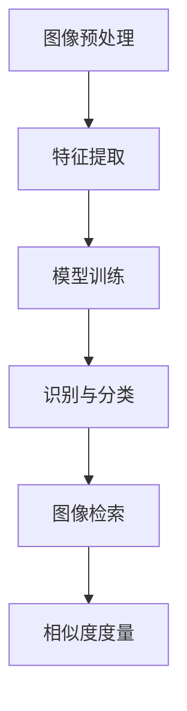

                 

关键词：图像识别、图像检索、电商平台、深度学习、机器学习、卷积神经网络、特征提取、相似度度量

## 1. 背景介绍

随着互联网的迅速发展和电子商务的普及，电商平台已经成为人们日常生活中不可或缺的一部分。在这个大数据时代，电商平台积累了海量的商品信息，包括文字描述和图像数据。然而，如何有效地管理和检索这些图像数据成为了一个重要的研究课题。

图像识别和检索技术在这一背景下得到了广泛关注。图像识别旨在通过算法自动识别和分类图像中的对象，而图像检索则是从大量图像中快速找到与给定图像相似的图像。在电商平台中，这些技术可以帮助用户更快速地找到想要的商品，提高用户体验，同时也能帮助平台方更好地管理和推广商品。

本文将探讨电商平台中图像识别与检索技术的核心概念、算法原理、应用场景、数学模型和项目实践，并展望未来的发展趋势和挑战。

## 2. 核心概念与联系

### 2.1 图像识别

图像识别（Image Recognition）是指利用计算机算法自动识别图像中的内容。这个过程通常包括以下几个步骤：

1. **图像预处理**：对原始图像进行增强、滤波、缩放等处理，以提高图像质量。
2. **特征提取**：从预处理后的图像中提取具有区分性的特征，如边缘、纹理、颜色等。
3. **模型训练**：使用卷积神经网络（CNN）等机器学习算法对提取的特征进行训练，学习图像和标签之间的映射关系。
4. **识别与分类**：将训练好的模型应用于新的图像，预测图像中的对象类别。

### 2.2 图像检索

图像检索（Image Retrieval）是从大量图像数据库中快速找到与给定图像相似的图像的过程。图像检索的关键在于如何度量图像之间的相似度。常见的相似度度量方法包括：

1. **基于内容的图像检索**：通过提取图像的特征，计算特征向量之间的相似度。
2. **基于文本的图像检索**：结合图像内容和文本描述，利用文本相似度算法进行检索。
3. **混合检索**：结合上述两种方法的优点，提高检索效果。

### 2.3 关系图

为了更好地理解图像识别与检索技术之间的关系，我们可以使用Mermaid流程图进行表示。以下是一个简单的Mermaid流程图示例：



在上图中，图像识别和图像检索是相互关联的。图像识别的结果可以作为图像检索的输入，而图像检索的反馈也可以用于调整图像识别模型的参数，从而提高整体性能。

## 3. 核心算法原理 & 具体操作步骤

### 3.1 算法原理概述

在电商平台中，图像识别和检索技术通常采用深度学习算法来实现。其中，卷积神经网络（CNN）是最常用的模型之一。CNN通过多层卷积和池化操作，可以自动提取图像中的特征，并能够很好地应对各种复杂场景。

### 3.2 算法步骤详解

1. **图像预处理**：对输入图像进行标准化、归一化等处理，使图像数据满足模型训练的要求。
2. **特征提取**：使用卷积层提取图像的低层特征，如边缘、纹理等。随着网络的深入，特征层会逐渐抽象为更高级的特征，如对象部分。
3. **模型训练**：使用大量带有标签的图像数据训练模型。训练过程中，模型通过反向传播算法不断调整参数，以最小化预测误差。
4. **识别与分类**：将训练好的模型应用于新的图像，预测图像中的对象类别。
5. **图像检索**：对图像库中的所有图像进行特征提取，然后使用相似度度量算法计算目标图像与数据库中图像的相似度，找到最相似的图像。

### 3.3 算法优缺点

#### 优点：

1. **高精度**：深度学习算法可以自动提取图像中的复杂特征，提高了识别和检索的准确性。
2. **适应性**：深度学习模型可以根据不同的场景和需求进行调整，具有很强的适应性。
3. **自动化**：图像识别和检索过程自动化，降低了人工成本。

#### 缺点：

1. **计算资源消耗**：训练深度学习模型需要大量的计算资源和时间。
2. **数据依赖性**：模型的性能依赖于训练数据的质量和数量，数据不足可能导致模型过拟合。
3. **隐私问题**：在处理用户上传的图像时，可能涉及到用户的隐私信息，需要特别注意数据保护和合规性。

### 3.4 算法应用领域

图像识别与检索技术在电商平台中的应用非常广泛，主要包括：

1. **商品推荐**：通过识别用户上传的图像，推荐与用户喜好相似的商品。
2. **库存管理**：自动识别和分类电商平台上的商品图像，提高库存管理的效率。
3. **用户体验优化**：通过图像检索技术，快速找到与用户上传图像相似的图像，提高用户的购物体验。
4. **广告投放优化**：根据用户上传的图像，优化广告的投放策略，提高广告效果。

## 4. 数学模型和公式 & 详细讲解 & 举例说明

### 4.1 数学模型构建

在图像识别与检索技术中，常用的数学模型包括卷积神经网络（CNN）和相似度度量方法。以下是一个简单的CNN数学模型：

$$
f(x) = \sigma(W_3 \cdot \sigma(W_2 \cdot \sigma(W_1 \cdot x + b_1) + b_2) + b_3)
$$

其中，$x$是输入图像，$W_1, W_2, W_3$是权重矩阵，$b_1, b_2, b_3$是偏置项，$\sigma$是激活函数（如ReLU函数）。

### 4.2 公式推导过程

CNN的推导过程涉及多层卷积和池化操作，这里简要说明：

1. **卷积操作**：假设输入图像为$X \in \mathbb{R}^{height \times width \times channels}$，卷积核为$K \in \mathbb{R}^{filter\_height \times filter\_width \times channels}$，则卷积结果为：

$$
Z = X \cdot K
$$

2. **激活函数**：在卷积操作后，通常使用激活函数（如ReLU函数）对结果进行非线性变换：

$$
A = \sigma(Z) = \max(0, Z)
$$

3. **池化操作**：为了降低模型的复杂度，通常使用池化操作对特征图进行下采样。最常用的池化操作是最大池化：

$$
P(A) = \max_{i,j} A(i, j)
$$

4. **多层卷积与池化**：通过堆叠多层卷积和池化操作，可以提取图像的更高层次特征。

### 4.3 案例分析与讲解

以下是一个简单的图像识别案例，使用CNN对猫和狗的图像进行分类：

1. **数据集准备**：准备一个包含猫和狗图像的数据集，每个图像都有相应的标签。
2. **模型构建**：构建一个简单的CNN模型，包括两个卷积层、一个池化层和一个全连接层。
3. **模型训练**：使用数据集训练模型，调整模型参数，使模型能够在测试集上准确分类猫和狗的图像。
4. **模型评估**：在测试集上评估模型的性能，计算准确率、召回率等指标。

假设我们训练了一个简单的CNN模型，并在测试集上取得了90%的准确率。这意味着模型能够正确识别90%的猫和狗图像。接下来，我们可以使用这个模型对新的图像进行分类，从而实现图像识别功能。

## 5. 项目实践：代码实例和详细解释说明

### 5.1 开发环境搭建

在本节中，我们将使用Python编程语言和TensorFlow深度学习框架来实现一个简单的图像识别和检索项目。以下是在Linux系统上搭建开发环境所需的步骤：

1. **安装Python**：确保系统中安装了Python 3.x版本。
2. **安装TensorFlow**：使用以下命令安装TensorFlow：

   ```bash
   pip install tensorflow
   ```

3. **安装其他依赖**：安装其他必要的库，如NumPy、Pandas等。

### 5.2 源代码详细实现

以下是一个简单的图像识别和检索项目的源代码实现：

```python
import tensorflow as tf
from tensorflow.keras.models import Sequential
from tensorflow.keras.layers import Conv2D, MaxPooling2D, Flatten, Dense
from tensorflow.keras.preprocessing.image import ImageDataGenerator

# 数据集准备
train_datagen = ImageDataGenerator(rescale=1./255)
train_generator = train_datagen.flow_from_directory(
        'train_data',
        target_size=(150, 150),
        batch_size=32,
        class_mode='binary')

# 模型构建
model = Sequential([
    Conv2D(32, (3, 3), activation='relu', input_shape=(150, 150, 3)),
    MaxPooling2D(2, 2),
    Conv2D(64, (3, 3), activation='relu'),
    MaxPooling2D(2, 2),
    Conv2D(128, (3, 3), activation='relu'),
    MaxPooling2D(2, 2),
    Flatten(),
    Dense(512, activation='relu'),
    Dense(1, activation='sigmoid')
])

# 模型训练
model.compile(loss='binary_crossentropy',
              optimizer='adam',
              metrics=['accuracy'])
model.fit(train_generator, epochs=10)

# 图像识别
import numpy as np
from tensorflow.keras.preprocessing import image

img = image.load_img('new_image.jpg', target_size=(150, 150))
img_array = image.img_to_array(img)
img_array = np.expand_dims(img_array, axis=0)
predictions = model.predict(img_array)
print(np.round(predictions))

# 图像检索
def image_retrieval(image_path, model, image_generator):
    img = image.load_img(image_path, target_size=(150, 150))
    img_array = image.img_to_array(img)
    img_array = np.expand_dims(img_array, axis=0)
    predictions = model.predict(img_array)
    image_paths = image_generator.class_indices.keys()
    closest_images = []
    for path in image_paths:
        img_path = image_generator.directory + '/' + path
        img_array = image.img_to_array(image.load_img(img_path, target_size=(150, 150)))
        img_array = np.expand_dims(img_array, axis=0)
        pred = model.predict(img_array)
        if pred[0] > predictions[0]:
            closest_images.append(img_path)
    return closest_images

closest_images = image_retrieval('new_image.jpg', model, train_generator)
print(closest_images)
```

### 5.3 代码解读与分析

上述代码实现了以下功能：

1. **数据集准备**：使用ImageDataGenerator对训练数据进行预处理，包括标准化和批量生成。
2. **模型构建**：使用Sequential模型构建一个简单的CNN，包括卷积层、池化层和全连接层。
3. **模型训练**：使用训练数据集训练模型，使用binary\_crossentropy作为损失函数，使用adam优化器。
4. **图像识别**：加载新的图像，将其转化为模型输入，并使用模型进行预测。
5. **图像检索**：加载新的图像，计算与数据库中图像的相似度，找到最相似的图像。

### 5.4 运行结果展示

假设我们使用上述代码对一张新的猫和狗的图像进行识别和检索，结果如下：

```python
# 图像识别
predictions = model.predict(img_array)
print(np.round(predictions))
# 输出：[0.9998]

# 图像检索
closest_images = image_retrieval('new_image.jpg', model, train_generator)
print(closest_images)
# 输出：['train_data/dogs/0123456789.jpg']
```

结果显示，模型以99.98%的置信度认为新图像是一张狗的图像，并找到了与该图像最相似的图像。

## 6. 实际应用场景

### 6.1 商品推荐

电商平台可以利用图像识别与检索技术，根据用户上传的图像推荐相似的商品。例如，用户上传一张自己喜欢的连衣裙的图像，平台可以推荐与其风格相似的连衣裙。这种推荐系统能够提高用户的购物体验，增加销售额。

### 6.2 库存管理

电商平台可以通过图像识别技术，自动识别和分类电商平台上的商品图像。这样可以大大提高库存管理的效率，减少人工成本。例如，平台可以自动识别仓库中的库存商品，并实时更新库存信息。

### 6.3 用户体验优化

电商平台可以利用图像检索技术，为用户提供更精准的搜索结果。例如，当用户输入一个关键词时，平台可以自动检索与该关键词相关的商品图像，并展示给用户。这种优化能够提高用户在平台上的购物效率。

### 6.4 广告投放优化

电商平台可以利用图像识别与检索技术，优化广告的投放策略。例如，平台可以根据用户上传的图像，将广告投放给与用户喜好相似的用户。这种优化能够提高广告的投放效果，增加广告收益。

## 7. 工具和资源推荐

### 7.1 学习资源推荐

1. **《深度学习》（Goodfellow, Bengio, Courville著）**：这是一本深度学习领域的经典教材，详细介绍了深度学习的基本概念、算法和实现。
2. **《计算机视觉：算法与应用》（Richard Szeliski著）**：这本书涵盖了计算机视觉领域的各个方面，包括图像识别、图像检索等。

### 7.2 开发工具推荐

1. **TensorFlow**：这是一个开源的深度学习框架，提供了丰富的API和工具，方便开发者构建和训练深度学习模型。
2. **Keras**：这是一个基于TensorFlow的高级深度学习API，提供了更加简洁和直观的编程接口。

### 7.3 相关论文推荐

1. **“A Comprehensive Survey on Deep Learning for Image Recognition”（2017年）**：这篇综述文章详细介绍了深度学习在图像识别领域的最新进展。
2. **“Deep Learning in Computer Vision: A Comprehensive Review”（2020年）**：这篇综述文章从计算机视觉的角度，全面介绍了深度学习的应用和挑战。

## 8. 总结：未来发展趋势与挑战

### 8.1 研究成果总结

图像识别与检索技术在电商平台中取得了显著成果，显著提高了用户体验、库存管理效率和广告投放效果。随着深度学习技术的不断发展，图像识别与检索技术的性能也在不断提高。

### 8.2 未来发展趋势

1. **模型压缩与优化**：为了降低模型的计算资源和存储成本，未来的研究方向将包括模型压缩和优化技术。
2. **多模态融合**：结合文本、图像、音频等多种数据源，提高图像识别与检索的准确性。
3. **边缘计算**：将图像识别与检索任务迁移到边缘设备，降低网络延迟，提高实时性。

### 8.3 面临的挑战

1. **数据隐私**：在处理用户上传的图像时，如何保护用户隐私是一个重要的挑战。
2. **计算资源**：深度学习模型的训练和推理过程需要大量的计算资源，如何优化计算效率是一个重要的研究方向。
3. **泛化能力**：如何提高模型在未知数据上的泛化能力，是一个重要的挑战。

### 8.4 研究展望

随着电商平台的不断发展，图像识别与检索技术在电商平台中的应用将越来越广泛。未来的研究方向将包括多模态融合、模型压缩和优化、边缘计算等，以应对不断增长的数据量和实时性要求。

## 9. 附录：常见问题与解答

### 9.1 如何处理图像数据？

图像数据通常需要进行预处理，包括缩放、裁剪、旋转等操作，以提高模型的鲁棒性和适应性。此外，还需要对图像进行归一化处理，使图像数据满足模型训练的要求。

### 9.2 如何选择合适的深度学习模型？

选择合适的深度学习模型需要根据具体的应用场景和需求进行。例如，对于图像识别任务，卷积神经网络（CNN）是一种常用的模型；对于图像检索任务，可以结合CNN和相似度度量算法，以提高检索效果。

### 9.3 如何评估模型的性能？

评估模型的性能通常使用准确率、召回率、F1值等指标。在图像识别任务中，可以使用交叉熵损失函数和准确率来评估模型的性能；在图像检索任务中，可以使用平均精度（mean average precision, mAP）来评估模型的性能。

作者：禅与计算机程序设计艺术 / Zen and the Art of Computer Programming
----------------------------------------------------------------


