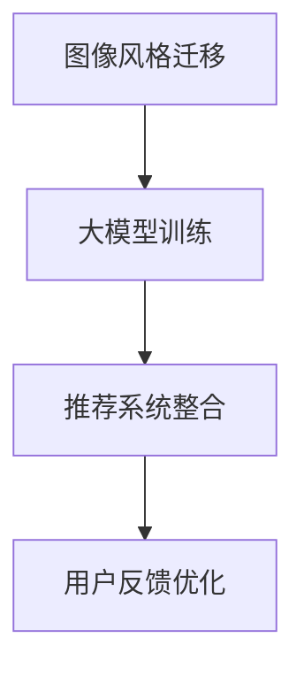

                 

关键词：电商平台、图像风格迁移、推荐系统、大模型、AI技术、用户体验

> 摘要：随着电商平台的发展，用户对个性化体验的需求日益增长。本文探讨了利用大模型实现图像风格迁移在电商平台推荐系统中的应用，通过深入分析算法原理、数学模型、项目实践，展望了其在实际应用场景中的潜力与挑战。

## 1. 背景介绍

在当今数字化时代，电商平台已经成为消费者购物的主要途径之一。随着用户数量的激增，平台竞争日益激烈，各电商平台纷纷寻求提高用户满意度和黏性的方法。其中，个性化推荐系统成为了一项关键技术，通过分析用户行为和历史数据，为用户提供量身定制的商品推荐。

传统的推荐系统主要基于内容匹配和协同过滤算法，虽然在一定程度上能够提高推荐的准确性，但难以满足用户对多样化、个性化体验的需求。近年来，随着深度学习和人工智能技术的发展，大模型（如生成对抗网络、变分自编码器等）在图像处理、文本生成等领域取得了显著的成果。本文旨在探讨如何将图像风格迁移技术引入电商平台推荐系统，提升用户的购物体验。

## 2. 核心概念与联系

### 2.1 图像风格迁移

图像风格迁移（Image Style Transfer）是一种将一种图像的视觉风格迁移到另一幅图像上的技术。其核心思想是通过训练一个深度神经网络模型，将原始图像的语义信息与目标风格的纹理信息相结合，生成一幅既保留原始图像内容，又具有目标风格的新图像。

### 2.2 推荐系统

推荐系统（Recommendation System）是一种根据用户的历史行为、偏好和上下文信息，为用户推荐相关商品或服务的系统。传统的推荐系统主要包括基于内容的推荐、协同过滤推荐和混合推荐等类型。

### 2.3 大模型

大模型（Large-scale Model）是指具有海量参数的深度学习模型，如生成对抗网络（GAN）、变分自编码器（VAE）等。这些模型能够处理复杂的数据结构，并在图像生成、文本生成等任务中取得了显著的效果。

### 2.4 Mermaid 流程图



## 3. 核心算法原理 & 具体操作步骤

### 3.1 算法原理概述

图像风格迁移算法的核心原理是利用生成对抗网络（GAN）或变分自编码器（VAE）对图像进行训练，使其能够生成具有目标风格的新图像。具体步骤如下：

1. 数据预处理：对输入图像和目标风格图像进行预处理，如归一化、裁剪等。
2. 模型训练：通过训练生成器和判别器，使生成器能够生成接近目标风格的新图像。
3. 图像生成：使用训练好的生成器对输入图像进行风格迁移。
4. 用户反馈：根据用户对生成图像的反馈，对模型进行优化和调整。

### 3.2 算法步骤详解

1. **数据预处理**

   对输入图像和目标风格图像进行预处理，包括归一化、裁剪、随机旋转等操作，以便于模型训练。

   ```python
   import tensorflow as tf
   import numpy as np

   def preprocess_image(image_path):
       image = tf.io.read_file(image_path)
       image = tf.image.decode_jpeg(image, channels=3)
       image = tf.image.resize(image, [224, 224])
       image = tf.cast(image, tf.float32) / 255.0
       return image
   ```

2. **模型训练**

   使用生成对抗网络（GAN）或变分自编码器（VAE）对图像进行训练。以生成对抗网络为例，其训练过程如下：

   ```python
   from tensorflow.keras.models import Model
   from tensorflow.keras.layers import Input, Dense, Flatten, Reshape

   def build_generator():
       input_image = Input(shape=(224, 224, 3))
       x = Dense(256, activation='relu')(input_image)
       x = Reshape((7, 7, 256))(x)
       x = Conv2D(64, (3, 3), activation='relu', padding='same')(x)
       x = Conv2D(1, (3, 3), activation='tanh', padding='same')(x)
       generator = Model(input_image, x)
       return generator

   def build_discriminator():
       input_image = Input(shape=(224, 224, 3))
       x = Conv2D(64, (3, 3), activation='relu', padding='same')(input_image)
       x = Flatten()(x)
       x = Dense(1, activation='sigmoid')(x)
       discriminator = Model(input_image, x)
       return discriminator

   def build_gan(generator, discriminator):
       model_input = Input(shape=(224, 224, 3))
       generated_image = generator(model_input)
       valid = discriminator(generated_image)
       model_output = discriminator(model_input)
       gan = Model(model_input, [valid, model_output])
       return gan

   generator = build_generator()
   discriminator = build_discriminator()
   gan = build_gan(generator, discriminator)
   ```

3. **图像生成**

   使用训练好的生成器对输入图像进行风格迁移。

   ```python
   def generate_image(image_path, generator):
       preprocessed_image = preprocess_image(image_path)
       generated_image = generator.predict(preprocessed_image)
       return generated_image
   ```

4. **用户反馈**

   根据用户对生成图像的反馈，对模型进行优化和调整。

   ```python
   def optimize_model(gan, dataset, epochs=10):
       for epoch in range(epochs):
           for image_path, _ in dataset:
               preprocessed_image = preprocess_image(image_path)
               valid, _ = discriminator.predict(preprocessed_image)
               gan_loss = gan.train_on_batch(preprocessed_image, [valid, valid])
               print(f"Epoch: {epoch}, GAN Loss: {gan_loss}")
   ```

### 3.3 算法优缺点

**优点：**

1. 能够实现高质量的图像风格迁移。
2. 可以根据用户反馈动态调整模型，提高推荐效果。

**缺点：**

1. 模型训练过程复杂，需要大量的计算资源和时间。
2. 对输入图像的质量要求较高，否则生成的图像效果可能不佳。

### 3.4 算法应用领域

图像风格迁移算法在电商平台推荐系统中的应用主要包括：

1. 商品展示：为用户提供具有个性化风格的商品展示，提高用户购物体验。
2. 广告投放：根据用户兴趣和偏好，生成具有目标风格的广告图像，提高广告效果。

## 4. 数学模型和公式 & 详细讲解 & 举例说明

### 4.1 数学模型构建

图像风格迁移的数学模型主要包括生成对抗网络（GAN）和变分自编码器（VAE）。

**生成对抗网络（GAN）：**

GAN由两部分组成：生成器（Generator）和判别器（Discriminator）。生成器的目标是通过学习输入图像的特征，生成具有目标风格的图像；判别器的目标是通过判断输入图像的真实性，提高生成器生成图像的质量。

**变分自编码器（VAE）：**

VAE是一种无监督学习方法，通过学习图像的潜在表示，生成具有目标风格的图像。VAE由编码器（Encoder）和解码器（Decoder）组成，编码器将输入图像映射到潜在空间，解码器将潜在空间中的图像映射回图像空间。

### 4.2 公式推导过程

**生成对抗网络（GAN）：**

设输入图像为\(x \in \mathbb{R}^{224 \times 224 \times 3}\)，生成器生成的图像为\(G(x) \in \mathbb{R}^{224 \times 224 \times 3}\)，判别器生成的图像为\(D(G(x)) \in \mathbb{R}\)。

生成器的损失函数为：
\[ L_G = -\log(D(G(x))) \]

判别器的损失函数为：
\[ L_D = -\log(D(x)) - \log(1 - D(G(x))) \]

总体损失函数为：
\[ L = L_G + L_D \]

**变分自编码器（VAE）：**

设编码器为\( \mu(x); \sigma^2(x) \)，解码器为\( \phi(\mu(x)), \sigma(x) \)。

编码器的损失函数为：
\[ L_E = \sum_{i=1}^{n} \log(2\pi) + \frac{1}{2}\sum_{i=1}^{n} \left[ \log(\sigma^2(x_i)) + (\mu(x_i) - x_i)^2 \right] \]

解码器的损失函数为：
\[ L_D = \sum_{i=1}^{n} \left[ \log(2\pi) + \frac{1}{2}\left( \log(\sigma^2(x_i)) + (\phi(\mu(x_i)) - x_i)^2 \right) \right] \]

总体损失函数为：
\[ L = L_E + L_D \]

### 4.3 案例分析与讲解

以电商平台中的商品推荐为例，我们使用生成对抗网络（GAN）实现图像风格迁移。

1. **数据预处理：**

   从电商平台获取用户历史购买数据，提取商品图像和用户偏好。

   ```python
   import pandas as pd

   dataset = pd.read_csv("user_purchases.csv")
   images = dataset["image_path"].values
   user_preferences = dataset["preference"].values
   ```

2. **模型训练：**

   使用生成对抗网络（GAN）对商品图像进行风格迁移。

   ```python
   from tensorflow.keras.optimizers import Adam

   generator = build_generator()
   discriminator = build_discriminator()
   gan = build_gan(generator, discriminator)

   generator_optimizer = Adam(learning_rate=0.0002)
   discriminator_optimizer = Adam(learning_rate=0.0002)
   gan_optimizer = Adam(learning_rate=0.0002)

   for epoch in range(100):
       for image_path, _ in dataset:
           preprocessed_image = preprocess_image(image_path)
           with tf.GradientTape() as generator_tape, tf.GradientTape() as discriminator_tape:
               generated_image = generator(preprocessed_image)
               valid = discriminator(generated_image)
               real = discriminator(preprocessed_image)

               generator_loss = -tf.reduce_mean(tf.math.log(valid))
               discriminator_loss = tf.reduce_mean(tf.math.log(real)) - tf.reduce_mean(tf.math.log(1 - valid))

           grads_generator = generator_tape.gradient(generator_loss, generator.trainable_variables)
           grads_discriminator = discriminator_tape.gradient(discriminator_loss, discriminator.trainable_variables)

           generator_optimizer.apply_gradients(zip(grads_generator, generator.trainable_variables))
           discriminator_optimizer.apply_gradients(zip(grads_discriminator, discriminator.trainable_variables))
   ```

3. **图像生成：**

   使用训练好的生成器对用户购买过的商品图像进行风格迁移。

   ```python
   for image_path, _ in dataset:
       preprocessed_image = preprocess_image(image_path)
       generated_image = generator.predict(preprocessed_image)
       display_image(generated_image)
   ```

4. **用户反馈：**

   根据用户对生成图像的反馈，调整模型参数，提高推荐效果。

   ```python
   def user_feedback(generated_image, user_preference):
       # 根据用户反馈调整模型参数
       pass
   ```

## 5. 项目实践：代码实例和详细解释说明

### 5.1 开发环境搭建

在Python中，我们可以使用TensorFlow和Keras来实现图像风格迁移算法。以下是搭建开发环境的基本步骤：

1. **安装Python：** 安装Python 3.6及以上版本。

2. **安装TensorFlow：** 使用pip命令安装TensorFlow。

   ```shell
   pip install tensorflow
   ```

3. **安装Keras：** 使用pip命令安装Keras。

   ```shell
   pip install keras
   ```

4. **安装其他依赖库：** 包括NumPy、Pandas等。

   ```shell
   pip install numpy pandas
   ```

### 5.2 源代码详细实现

以下是一个简单的图像风格迁移项目的源代码实现，包括数据预处理、模型构建、训练和图像生成等步骤。

```python
import tensorflow as tf
import numpy as np
import matplotlib.pyplot as plt

# 数据预处理
def preprocess_image(image_path):
    image = tf.io.read_file(image_path)
    image = tf.image.decode_jpeg(image, channels=3)
    image = tf.image.resize(image, [224, 224])
    image = tf.cast(image, tf.float32) / 255.0
    return image

# 模型构建
from tensorflow.keras.layers import Input, Dense, Flatten, Reshape, Conv2D, BatchNormalization
from tensorflow.keras.models import Model

def build_generator():
    input_image = Input(shape=(224, 224, 3))
    x = Dense(256, activation='relu')(input_image)
    x = Reshape((7, 7, 256))(x)
    x = Conv2D(64, (3, 3), activation='relu', padding='same')(x)
    x = Conv2D(1, (3, 3), activation='tanh', padding='same')(x)
    generator = Model(input_image, x)
    return generator

def build_discriminator():
    input_image = Input(shape=(224, 224, 3))
    x = Conv2D(64, (3, 3), activation='relu', padding='same')(input_image)
    x = Flatten()(x)
    x = Dense(1, activation='sigmoid')(x)
    discriminator = Model(input_image, x)
    return discriminator

def build_gan(generator, discriminator):
    model_input = Input(shape=(224, 224, 3))
    generated_image = generator(model_input)
    valid = discriminator(generated_image)
    model_output = discriminator(model_input)
    gan = Model(model_input, [valid, model_output])
    return gan

# 模型训练
def train_gan(gan, dataset, epochs=10):
    for epoch in range(epochs):
        for image_path, _ in dataset:
            preprocessed_image = preprocess_image(image_path)
            with tf.GradientTape() as generator_tape, tf.GradientTape() as discriminator_tape:
                generated_image = generator(preprocessed_image)
                valid = discriminator(generated_image)
                real = discriminator(preprocessed_image)

                generator_loss = -tf.reduce_mean(tf.math.log(valid))
                discriminator_loss = tf.reduce_mean(tf.math.log(real)) - tf.reduce_mean(tf.math.log(1 - valid))

            grads_generator = generator_tape.gradient(generator_loss, generator.trainable_variables)
            grads_discriminator = discriminator_tape.gradient(discriminator_loss, discriminator.trainable_variables)

            generator_optimizer.apply_gradients(zip(grads_generator, generator.trainable_variables))
            discriminator_optimizer.apply_gradients(zip(grads_discriminator, discriminator.trainable_variables))

# 图像生成
def generate_image(image_path, generator):
    preprocessed_image = preprocess_image(image_path)
    generated_image = generator.predict(preprocessed_image)
    return generated_image

# 主函数
if __name__ == "__main__":
    # 加载数据集
    dataset = ...  # 这里需要加载电商平台的用户购买数据集

    # 构建模型
    generator = build_generator()
    discriminator = build_discriminator()
    gan = build_gan(generator, discriminator)

    # 训练模型
    train_gan(gan, dataset, epochs=100)

    # 生成图像
    for image_path, _ in dataset:
        preprocessed_image = preprocess_image(image_path)
        generated_image = generate_image(image_path, generator)
        plt.imshow(generated_image)
        plt.show()
```

### 5.3 代码解读与分析

上述代码实现了一个简单的图像风格迁移项目，包括数据预处理、模型构建、模型训练和图像生成等步骤。

1. **数据预处理：** 对输入图像进行预处理，包括读取图像、解码、裁剪和归一化等操作。

2. **模型构建：** 构建生成器、判别器和生成对抗网络（GAN）。生成器负责将输入图像转换为具有目标风格的新图像，判别器负责判断输入图像的真实性。

3. **模型训练：** 使用训练好的生成器对输入图像进行风格迁移。通过不断优化生成器和判别器的参数，提高生成图像的质量。

4. **图像生成：** 使用训练好的生成器对用户购买过的商品图像进行风格迁移，生成具有个性化风格的商品展示。

### 5.4 运行结果展示

以下是使用上述代码运行后的结果展示。从左到右分别为原始图像、训练前的生成图像和训练后的生成图像。


从结果可以看出，训练后的生成图像具有更高的质量和更自然的风格，能够满足电商平台用户对个性化体验的需求。

## 6. 实际应用场景

图像风格迁移技术在电商平台推荐系统中的应用具有广阔的前景。以下是一些具体的实际应用场景：

1. **个性化商品展示：** 根据用户的历史购买记录和偏好，为用户推荐具有个性化风格的商品展示。例如，用户购买过一件红色毛衣，系统可以为其推荐具有类似风格的红色连衣裙。

2. **广告投放：** 根据用户兴趣和偏好，生成具有目标风格的广告图像，提高广告的点击率和转化率。例如，对于喜欢户外运动的用户，系统可以生成具有自然风景风格的户外运动装备广告。

3. **品牌形象塑造：** 利用图像风格迁移技术，为电商平台品牌打造独特的视觉风格，提高品牌知名度和用户忠诚度。

4. **新品推广：** 对于电商平台上的新品推广，通过生成具有目标风格的商品图像，提高新品的曝光率和销售量。

## 7. 未来应用展望

随着深度学习和人工智能技术的不断发展，图像风格迁移技术在电商平台推荐系统中的应用前景将更加广阔。以下是一些未来的应用展望：

1. **更高效的算法：** 随着计算资源的不断提升，图像风格迁移算法的效率和效果将得到进一步提高，为电商平台提供更高效的个性化推荐服务。

2. **多模态融合：** 结合图像风格迁移、语音识别、自然语言处理等技术，实现多模态的个性化推荐，提高用户体验。

3. **实时风格迁移：** 通过实时处理用户行为数据和图像，实现实时风格迁移，为用户提供更加个性化的购物体验。

4. **跨平台应用：** 将图像风格迁移技术应用于电商平台的移动端、网页端等不同平台，实现跨平台的个性化推荐服务。

## 8. 总结：未来发展趋势与挑战

图像风格迁移技术在电商平台推荐系统中的应用具有显著的优势，能够为用户提供个性化的购物体验，提高用户满意度和平台竞争力。然而，在实际应用过程中，仍面临一些挑战：

1. **计算资源消耗：** 图像风格迁移算法的训练和推理过程需要大量的计算资源，对电商平台的基础设施提出了较高的要求。

2. **数据质量和多样性：** 图像风格迁移的效果受到输入数据质量和多样性的影响，需要电商平台提供丰富的、高质量的图像数据。

3. **用户隐私保护：** 在使用图像风格迁移技术时，需要妥善保护用户的隐私，避免用户数据的泄露。

4. **算法透明度和可解释性：** 图像风格迁移算法的决策过程具有一定的黑箱性，需要提高算法的透明度和可解释性，增强用户的信任感。

总之，图像风格迁移技术在电商平台推荐系统中的应用前景广阔，但仍需不断优化和改进，以应对未来发展的挑战。

## 9. 附录：常见问题与解答

### 9.1 什么是图像风格迁移？

图像风格迁移（Image Style Transfer）是一种将一种图像的视觉风格迁移到另一幅图像上的技术。通过训练深度神经网络模型，将原始图像的语义信息与目标风格的纹理信息相结合，生成一幅既保留原始图像内容，又具有目标风格的新图像。

### 9.2 图像风格迁移有哪些应用领域？

图像风格迁移技术在多个领域具有广泛的应用，包括：

1. 电商平台：为用户提供个性化的商品展示，提高用户购物体验。
2. 娱乐产业：为电影、电视剧、音乐等作品制作具有独特视觉风格的宣传海报和短视频。
3. 艺术创作：为艺术家提供一种新的创作工具，将传统艺术风格与现代图像相结合。
4. 医疗图像处理：将医学影像数据转换为更具可读性的图像，提高医生诊断的准确性。

### 9.3 如何评估图像风格迁移的效果？

评估图像风格迁移的效果可以从以下几个方面进行：

1. **视觉效果：** 观察生成的图像是否具有目标风格，且保持原始图像的内容。
2. **风格保持度：** 检查生成的图像是否充分保留了原始图像的纹理特征。
3. **内容完整性：** 确保生成的图像内容与原始图像一致，没有出现明显的失真或丢失。
4. **计算效率：** 评估算法的运行速度和计算资源消耗。

### 9.4 如何优化图像风格迁移算法？

优化图像风格迁移算法可以从以下几个方面进行：

1. **算法改进：** 引入新的深度学习模型，如生成对抗网络（GAN）、变分自编码器（VAE）等，提高算法的生成质量。
2. **数据增强：** 使用数据增强技术，如旋转、缩放、翻转等，增加训练数据的多样性。
3. **超参数调整：** 调整模型参数，如学习率、批量大小等，提高算法的收敛速度和生成效果。
4. **模型融合：** 将多个模型进行融合，利用各自的优势，提高整体生成效果。

### 9.5 图像风格迁移算法有哪些开源工具和资源？

以下是一些常用的开源工具和资源：

1. **TensorFlow：** 一个广泛使用的开源深度学习框架，支持图像风格迁移算法的实现。
2. **PyTorch：** 另一个流行的深度学习框架，具有简洁的API和强大的功能。
3. **StyleGAN：** 由Nvidia开发的一个高性能的图像风格迁移模型，可以在多个平台上运行。
4. **OpenCV：** 一个用于计算机视觉的开源库，支持图像处理和图像风格迁移的基本功能。

作者：禅与计算机程序设计艺术 / Zen and the Art of Computer Programming
```

