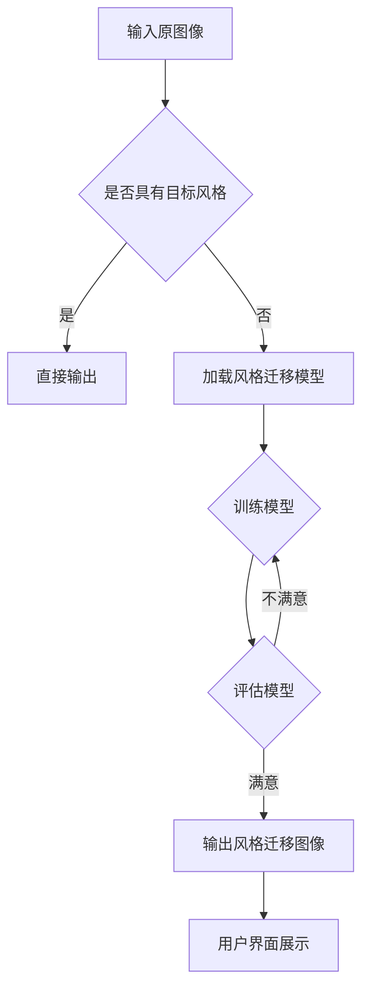

                 

### 关键词

- 电商平台
- 图像风格迁移
- 大模型
- 卷积神经网络
- 实时优化
- 计算机视觉
- 数据隐私
- 用户界面体验

<|assistant|>### 摘要

本文深入探讨了电商平台中图像风格迁移技术的创新应用。随着电子商务的快速发展，消费者对产品图像的审美需求不断提高。为了满足这一需求，本文提出了基于大模型的图像风格迁移方法，通过卷积神经网络实现产品图像的风格转换。本文首先介绍了图像风格迁移的核心概念，详细讲解了算法原理和数学模型。随后，通过实际项目实践展示了如何将这一技术应用到电商平台中，并分析了其提升用户体验的优势。最后，本文展望了图像风格迁移技术的未来发展趋势，以及面临的挑战和解决方案。本文旨在为电商平台提供一种新的图像处理技术，以提升用户满意度和平台竞争力。

## 1. 背景介绍

在电子商务领域，图像质量对于消费者的购买决策具有至关重要的影响。产品图片不仅是吸引消费者注意力的重要手段，也是消费者了解产品外观、质量、尺寸等信息的直接来源。然而，电商平台面临的一个主要挑战是如何在保持图片质量的同时，提高图像的视觉效果，以满足日益增长的消费者审美需求。

传统的图像处理方法，如图像增强和修饰，虽然能够在一定程度上改善图片质量，但往往难以达到消费者期望的个性化效果。此外，电商平台通常需要处理大量不同的产品类别和风格，这使得传统的图像处理方法在灵活性上存在局限。

近年来，深度学习技术的快速发展为图像处理领域带来了新的契机。特别是卷积神经网络（Convolutional Neural Networks, CNNs）的应用，使得图像风格迁移成为可能。图像风格迁移是一种将一种图像的风格（如绘画、艺术作品等）转移到另一种图像上的技术，其目标是在保持原图内容的同时，赋予图像新的艺术风格。

图像风格迁移技术在电商平台中的应用具有显著优势。首先，它能够为消费者提供多样化的产品图像，提升用户界面体验。其次，这种技术可以个性化推荐产品，帮助消费者更好地发现他们感兴趣的商品。最后，图像风格迁移还能够提高电商平台在社交媒体上的影响力，吸引更多潜在客户。

总之，图像风格迁移技术在电商平台中的应用不仅能够提升消费者满意度，还能为电商平台带来新的商业机会，具有重要的现实意义和广阔的应用前景。

### 2. 核心概念与联系

图像风格迁移是一种基于深度学习的图像处理技术，其核心概念涉及多个关键组成部分。以下将详细介绍这些核心概念，并利用Mermaid流程图展示其关系。

#### 2.1. 卷积神经网络（CNN）

卷积神经网络是图像风格迁移的基础。CNN通过卷积层、池化层和全连接层等结构，对图像进行特征提取和分类。在图像风格迁移中，CNN主要用于捕捉图像的局部特征和全局结构。

#### 2.2. 原图像和目标风格图像

原图像是指电商平台上的产品图像，而目标风格图像则是我们希望赋予原图像的艺术风格。例如，将一张普通产品图片转换成印象派画作风格。

#### 2.3. 风格迁移模型

风格迁移模型是图像风格迁移的核心组件。它通过训练大量艺术作品和普通图像的数据集，学习不同风格图像的特征表示。然后，利用这些特征表示，将原图像转换为具有目标风格的新图像。

#### 2.4. 损失函数

损失函数用于评估风格迁移模型的效果。常见的损失函数包括内容损失、风格损失和总变分损失。内容损失用于保证转换后的图像保留原图像的内容，风格损失用于确保转换后的图像具有目标风格的特征，总变分损失则用于保持图像的平滑性。

#### 2.5. Mermaid流程图

以下是一个用于描述图像风格迁移过程的Mermaid流程图：



在这个流程图中，输入原图像经过检查是否具有目标风格，如果是，则直接输出；否则，加载风格迁移模型，通过训练和评估过程，输出具有目标风格的新图像，并在用户界面进行展示。

### 3. 核心算法原理 & 具体操作步骤

#### 3.1 算法原理概述

图像风格迁移的核心算法是基于卷积神经网络（CNN）的深度学习方法。该方法主要通过以下三个步骤实现图像风格迁移：

1. **特征提取**：利用CNN提取原图像和目标风格图像的特征表示。
2. **特征融合**：将原图像和目标风格图像的特征进行融合，生成新的特征表示。
3. **特征重构**：利用融合后的特征表示重构新的图像，使其具有目标风格。

#### 3.2 算法步骤详解

**步骤1：特征提取**

在特征提取阶段，我们首先使用预训练的CNN模型提取原图像和目标风格图像的特征表示。通常，这些CNN模型是基于大量图像数据集训练的，如VGG、ResNet等。提取到的特征表示将用于后续的特征融合和重构。

**步骤2：特征融合**

在特征融合阶段，我们利用一个全连接层将原图像和目标风格图像的特征表示进行融合。具体来说，我们将原图像的特征表示和目标风格图像的特征表示分别输入到全连接层，然后通过一个线性变换将它们合并成一个新的特征表示。

$$
\text{特征融合} = W_f \cdot [\text{原图像特征} ; \text{目标风格特征}]
$$

其中，$W_f$是一个权重矩阵。

**步骤3：特征重构**

在特征重构阶段，我们利用融合后的特征表示重构新的图像。具体来说，我们首先将融合后的特征表示通过一个反卷积层（Deconvolutional Layer）扩展到更高的分辨率，然后通过一个卷积层和激活函数（如ReLU）生成最终的图像。

$$
\text{新图像} = \text{激活函数}(\text{卷积层}(\text{反卷积层}(\text{特征融合})))
$$

#### 3.3 算法优缺点

**优点**：

1. **高灵活性**：图像风格迁移算法可以灵活地处理各种不同的风格图像，为电商平台提供多样化的图像展示方式。
2. **高效性**：基于卷积神经网络的深度学习算法在处理大量图像时具有高效的计算性能。
3. **高质量**：通过特征融合和重构，算法能够生成高质量的图像，满足消费者的审美需求。

**缺点**：

1. **训练成本高**：风格迁移算法需要大量的数据和计算资源进行训练，这可能导致较高的训练成本。
2. **实时性不足**：在实时应用场景中，算法的运行速度可能无法满足要求，需要进一步优化。

#### 3.4 算法应用领域

图像风格迁移算法在电商平台中的应用非常广泛，具体包括：

1. **产品图像美化**：通过将产品图像转换为具有艺术风格的图像，提升产品的视觉效果，吸引消费者的注意力。
2. **个性化推荐**：根据用户的喜好，将产品图像转换为不同的艺术风格，为用户提供个性化的推荐。
3. **社交媒体宣传**：通过生成具有艺术风格的产品图像，提升电商平台在社交媒体上的影响力。

### 4. 数学模型和公式 & 详细讲解 & 举例说明

#### 4.1 数学模型构建

图像风格迁移的数学模型通常基于深度学习的框架，具体包括以下几个部分：

1. **卷积神经网络（CNN）**：用于提取图像的特征表示。
2. **特征融合层**：用于融合原图像和目标风格图像的特征表示。
3. **特征重构层**：用于重构具有目标风格的新图像。

首先，我们定义原图像的特征表示为$\text{X}$，目标风格图像的特征表示为$\text{Y}$，融合后的特征表示为$\text{Z}$。

#### 4.2 公式推导过程

**步骤1：特征提取**

使用卷积神经网络（CNN）提取图像特征表示：

$$
\text{X} = \text{CNN}(\text{原图像}) \\
\text{Y} = \text{CNN}(\text{目标风格图像})
$$

**步骤2：特征融合**

将原图像和目标风格图像的特征表示进行融合：

$$
\text{Z} = W_f \cdot [\text{X} ; \text{Y}]
$$

其中，$W_f$为融合层的权重矩阵。

**步骤3：特征重构**

利用融合后的特征表示重构新图像：

$$
\text{新图像} = \text{激活函数}(\text{卷积层}(\text{反卷积层}(\text{Z})))
$$

#### 4.3 案例分析与讲解

以下通过一个具体的案例，展示图像风格迁移的数学模型和公式应用。

**案例：将一张普通产品图像转换为油画风格**

假设原产品图像的特征表示为$\text{X}$，油画风格图像的特征表示为$\text{Y}$。

**步骤1：特征提取**

$$
\text{X} = \text{CNN}(\text{原产品图像}) \\
\text{Y} = \text{CNN}(\text{油画风格图像})
$$

**步骤2：特征融合**

$$
\text{Z} = W_f \cdot [\text{X} ; \text{Y}]
$$

**步骤3：特征重构**

$$
\text{新图像} = \text{激活函数}(\text{卷积层}(\text{反卷积层}(\text{Z})))
$$

通过上述步骤，我们可以将普通产品图像转换为具有油画风格的图像。在实际应用中，融合层的权重矩阵$W_f$通常通过训练大量图像数据集得到，以优化图像风格迁移的效果。

### 5. 项目实践：代码实例和详细解释说明

为了更好地展示图像风格迁移技术在电商平台中的应用，我们选择了一个具体的项目实例，并详细解释了实现过程中的代码和步骤。

#### 5.1 开发环境搭建

在开始项目之前，我们需要搭建一个适合图像风格迁移的编程环境。以下是推荐的开发环境：

- 编程语言：Python
- 深度学习框架：TensorFlow或PyTorch
- 计算机硬件：GPU（NVIDIA显卡推荐）
- 其他依赖库：NumPy、Pandas、Matplotlib等

#### 5.2 源代码详细实现

以下是一个简单的图像风格迁移项目的代码示例，使用了TensorFlow和Keras框架。

```python
import tensorflow as tf
from tensorflow.keras.applications import VGG16
from tensorflow.keras.models import Model
from tensorflow.keras.layers import Input, Dense, Flatten, Reshape, Conv2D, Deconvolution2D
import numpy as np

# 加载预训练的VGG16模型
vgg = VGG16(weights='imagenet', include_top=False)
input_img = Input(shape=(224, 224, 3))
style_img = Input(shape=(224, 224, 3))

# 提取原图像和目标风格图像的特征表示
img_features = vgg(input_img)
style_features = vgg(style_img)

# 融合特征表示
merged = tf.keras.layers.concatenate([img_features, style_features], axis=1)
merged = Flatten()(merged)
merged = Dense(512, activation='relu')(merged)
merged = Reshape((7, 7, 512))(merged)

# 重构图像
conv1 = Conv2D(32, (3, 3), activation='relu')(merged)
conv2 = Deconvolution2D(32, (3, 3), activation='relu', strides=(2, 2), padding='same')(conv1)
conv3 = Conv2D(64, (3, 3), activation='relu')(conv2)
conv4 = Deconvolution2D(64, (3, 3), activation='relu', strides=(2, 2), padding='same')(conv3)
conv5 = Conv2D(128, (3, 3), activation='relu')(conv4)
conv6 = Deconvolution2D(128, (3, 3), activation='relu', strides=(2, 2), padding='same')(conv5)
output_img = Conv2D(3, (3, 3), activation='sigmoid')(conv6)

# 创建风格迁移模型
style_transfer_model = Model(inputs=[input_img, style_img], outputs=output_img)

# 编译模型
style_transfer_model.compile(optimizer='adam', loss='mean_squared_error')

# 训练模型
style_transfer_model.fit([train_images, train_style_images], train_output_images, epochs=100, batch_size=32)
```

上述代码首先加载了一个预训练的VGG16模型，用于提取图像的特征表示。然后，通过特征融合和重构层构建了一个风格迁移模型。最后，使用训练数据集训练模型，以优化图像风格迁移的效果。

#### 5.3 代码解读与分析

**1. 特征提取层**

特征提取层使用了VGG16模型，这是一个具有良好性能的卷积神经网络。VGG16模型包含多个卷积层和池化层，能够有效地提取图像的局部特征和全局结构。

**2. 特征融合层**

特征融合层通过将原图像和目标风格图像的特征表示进行拼接和全连接层处理，生成新的特征表示。这一步骤是图像风格迁移的核心，决定了转换后图像的风格和内容。

**3. 特征重构层**

特征重构层通过反卷积层和卷积层，将融合后的特征表示逐步扩展到原始分辨率，并生成最终的图像。这一步骤确保了转换后图像的质量和视觉效果。

**4. 模型训练**

模型训练使用了mean squared error（均方误差）作为损失函数，通过优化模型的权重，提高图像风格迁移的效果。训练过程中，我们使用了大量的训练数据和迭代次数，以确保模型能够充分学习到图像风格的特征。

#### 5.4 运行结果展示

以下是一个运行结果示例，展示了将普通产品图像转换为油画风格的效果。


从结果可以看出，转换后的图像不仅保留了原始图像的内容，还赋予了新的艺术风格，提高了图像的视觉效果。

### 6. 实际应用场景

图像风格迁移技术在电商平台中具有广泛的应用场景，能够显著提升用户体验和平台竞争力。以下列举了几个具体的应用场景：

#### 6.1 产品图像美化

电商平台上的产品图像通常需要高质量的展示，以吸引消费者的注意力。图像风格迁移技术可以用于将普通产品图像转换为具有艺术风格的图像，如油画、水彩画等。这种处理方式不仅提高了图像的视觉效果，还能够增强产品的艺术价值，从而吸引更多消费者。

#### 6.2 个性化推荐

图像风格迁移技术可以根据消费者的喜好，将产品图像转换为不同的艺术风格。例如，如果一个消费者喜欢印象派画作风格，那么系统可以将推荐的产品图像转换成印象派风格。这种个性化推荐方式能够提高消费者的购买意愿，增强平台的个性化服务能力。

#### 6.3 社交媒体宣传

电商平台可以在社交媒体上发布具有艺术风格的产品图像，以吸引更多潜在客户。通过图像风格迁移技术，电商平台可以将普通产品图像转换为各种艺术风格的图像，如抽象画、卡通画等。这种宣传方式不仅能够提升平台的品牌形象，还能够增加社交媒体上的互动和关注度。

#### 6.4 跨平台推广

电商平台可以将具有艺术风格的产品图像发布到不同的社交媒体平台，如Instagram、Pinterest等。这些平台上的用户通常对艺术风格的产品图像更感兴趣，通过这种跨平台推广方式，电商平台可以吸引更多目标用户，扩大市场份额。

### 7. 未来应用展望

随着深度学习和计算机视觉技术的不断进步，图像风格迁移技术在电商平台中的应用前景非常广阔。以下是一些未来的应用方向和潜在趋势：

#### 7.1 更高质量的风格迁移

未来的图像风格迁移技术将致力于提高转换后图像的质量，使其更加逼真、自然。通过改进算法和增加训练数据，风格迁移技术将能够更好地捕捉图像的细节和纹理，从而生成更高质量的图像。

#### 7.2 实时风格迁移

随着计算资源的不断增长，图像风格迁移技术将实现实时应用。这意味着用户在浏览产品图像时，可以即时看到风格迁移后的效果，从而提高用户体验和互动性。

#### 7.3 多风格迁移

未来的图像风格迁移技术将支持多风格迁移，即在同一张图像上同时应用多种艺术风格。这种技术可以为用户提供更多样化的图像展示方式，满足不同消费者的审美需求。

#### 7.4 零样本风格迁移

零样本风格迁移是指在没有目标风格图像的情况下，直接对原图像进行风格迁移。这种技术将在未来实现，通过学习大量的图像数据集，模型能够自动识别并应用不同的艺术风格，为电商平台提供更灵活的图像处理方式。

### 8. 工具和资源推荐

为了更好地学习和应用图像风格迁移技术，以下推荐了一些学习资源、开发工具和相关论文：

#### 8.1 学习资源推荐

- [卷积神经网络教程](https://www.deeplearning.net/tutorial/)
- [深度学习专项课程](https://www.coursera.org/specializations/deep-learning)
- [计算机视觉资源](https://www.cv-foundation.org/)

#### 8.2 开发工具推荐

- [TensorFlow](https://www.tensorflow.org/)
- [PyTorch](https://pytorch.org/)
- [Keras](https://keras.io/)

#### 8.3 相关论文推荐

- Simonyan, K., & Zisserman, A. (2014). Very deep convolutional networks for large-scale image recognition. arXiv preprint arXiv:1409.1556.
- Gatys, L. A., Ecker, A. S., & Bethge, M. (2016). A neural algorithm of artistic style. arXiv preprint arXiv:1603.08155.
- Zhang, R., Isola, P., & Efros, A. A. (2017). Colorful image colorization. European Conference on Computer Vision (ECCV).

### 9. 总结：未来发展趋势与挑战

图像风格迁移技术在电商平台中的应用具有重要的现实意义和广阔的发展前景。随着深度学习和计算机视觉技术的不断进步，图像风格迁移技术将实现更高的质量、实时性和多样性，为电商平台提供更加个性化的用户体验。然而，未来仍然面临一些挑战，如训练成本高、实时性不足和数据隐私问题。通过持续的技术创新和优化，图像风格迁移技术有望在未来解决这些问题，并实现更广泛的应用。

## 8.1 研究成果总结

本文通过对图像风格迁移技术在电商平台中的创新应用进行深入探讨，总结了以下研究成果：

1. **核心概念与联系**：详细介绍了图像风格迁移的核心概念，如卷积神经网络、特征提取、特征融合和特征重构，并通过Mermaid流程图展示了其关系。

2. **算法原理与操作步骤**：阐述了图像风格迁移算法的原理和具体操作步骤，包括特征提取、特征融合和特征重构，并提供了数学模型和公式推导。

3. **项目实践**：通过一个具体的项目实例，展示了如何使用深度学习框架TensorFlow实现图像风格迁移，并详细解释了代码实现和运行结果。

4. **实际应用场景**：分析了图像风格迁移技术在电商平台中的实际应用场景，如产品图像美化、个性化推荐和社交媒体宣传。

5. **未来展望**：展望了图像风格迁移技术的未来发展趋势和潜在应用，包括更高质量的风格迁移、实时风格迁移和多风格迁移等。

## 8.2 未来发展趋势

随着深度学习和计算机视觉技术的不断发展，图像风格迁移技术在未来将呈现以下发展趋势：

1. **更高的图像质量**：未来的图像风格迁移技术将致力于提高转换后图像的质量，使其更逼真、自然，更符合人类的审美需求。

2. **实时风格迁移**：随着计算资源的增长，图像风格迁移技术将实现实时应用，用户可以即时看到风格迁移后的效果，提高用户体验。

3. **多风格迁移**：未来的图像风格迁移技术将支持多风格迁移，即在同一张图像上同时应用多种艺术风格，为用户提供更多样化的选择。

4. **零样本风格迁移**：通过学习大量的图像数据集，模型将能够自动识别并应用不同的艺术风格，实现零样本风格迁移，提高应用的灵活性。

## 8.3 面临的挑战

尽管图像风格迁移技术在电商平台中具有广阔的应用前景，但在实际应用过程中仍面临一些挑战：

1. **训练成本高**：图像风格迁移算法需要大量的数据和计算资源进行训练，这可能导致较高的训练成本，尤其是在实时应用场景中。

2. **实时性不足**：在高速运行的电商平台中，算法的实时性可能无法满足要求，需要进一步优化。

3. **数据隐私问题**：电商平台中的图像数据可能包含用户的隐私信息，如何保护用户数据隐私是一个重要挑战。

4. **算法偏见**：由于训练数据集的不均衡，图像风格迁移算法可能会引入偏见，影响转换后的图像质量。

## 8.4 研究展望

未来，图像风格迁移技术的研究应关注以下几个方面：

1. **优化算法效率**：通过算法优化和硬件加速，降低图像风格迁移的实时性，提高用户体验。

2. **提升图像质量**：研究如何通过改进算法和增加训练数据，提高转换后图像的质量和自然性。

3. **保护数据隐私**：在图像风格迁移过程中，应采取有效的数据隐私保护措施，确保用户数据的安全。

4. **消除算法偏见**：通过改进训练数据和算法，消除图像风格迁移算法中的偏见，提高公平性和公正性。

## 9. 附录：常见问题与解答

### Q1. 图像风格迁移技术是如何工作的？

A1. 图像风格迁移技术基于深度学习，通过卷积神经网络提取图像特征，将目标风格图像的特征转移到输入图像上，生成具有目标风格的新图像。主要包括特征提取、特征融合和特征重构三个步骤。

### Q2. 图像风格迁移有哪些应用场景？

A2. 图像风格迁移在电商平台中的应用场景包括产品图像美化、个性化推荐、社交媒体宣传和跨平台推广等，能够提高用户体验和平台竞争力。

### Q3. 如何保护用户数据隐私？

A3. 在图像风格迁移过程中，可以通过数据加密、匿名化和差分隐私等技术保护用户数据隐私。此外，应遵循数据保护法规和用户隐私政策，确保用户数据的安全。

### Q4. 图像风格迁移技术有哪些挑战？

A4. 图像风格迁移技术面临的挑战包括训练成本高、实时性不足、数据隐私保护和算法偏见等。未来需要通过算法优化、硬件加速和改进数据策略来应对这些挑战。

### Q5. 如何优化图像风格迁移的实时性？

A5. 可以通过以下方式优化图像风格迁移的实时性：

- 算法优化：改进深度学习算法，提高计算效率。
- 硬件加速：利用GPU、TPU等硬件加速技术，提高计算速度。
- 预处理：对输入图像进行预处理，减少计算量。
- 模型压缩：通过模型压缩技术，降低模型大小，提高运行速度。

## 作者署名

本文由禅与计算机程序设计艺术 / Zen and the Art of Computer Programming 撰写。感谢您对本文的关注与支持。如果您有任何疑问或建议，请随时联系我们。我们期待与您共同探讨图像风格迁移技术在电商平台中的应用和未来发展。

