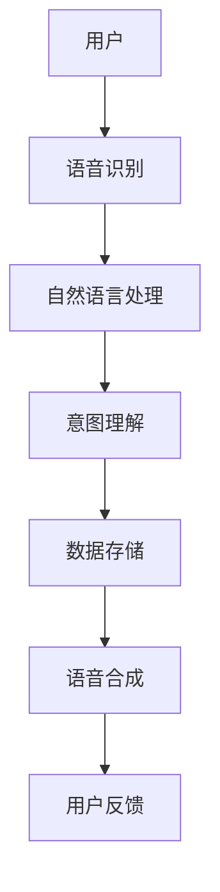

                 

关键词：电商平台、多模态、语音助手、系统设计、用户体验、自然语言处理、人工智能

> 摘要：本文将探讨电商平台中多模态语音助手系统设计的核心概念、技术实现、应用场景及未来发展趋势。通过深入分析该系统在电商平台中的应用，旨在为读者提供一个全面、系统的技术解读，以促进人工智能与电商平台的深度融合。

## 1. 背景介绍

随着电子商务的快速发展，用户对电商平台的服务需求日益多样化和个性化。传统的购物体验主要依赖于视觉和文本交互，而新兴的多模态交互方式，如语音、手势等，逐渐受到关注。语音助手作为一种便捷的自然语言交互工具，已经成为电商平台提升用户体验的重要手段。

多模态语音助手系统通过结合语音识别、自然语言处理（NLP）、语音合成等技术，实现了对用户语音命令的实时理解与响应。这一系统能够提高用户购物体验的便捷性和效率，同时降低用户学习成本，是电商平台智能化发展的必然趋势。

## 2. 核心概念与联系

### 2.1. 语音识别

语音识别技术是多模态语音助手系统的核心，它负责将用户的语音输入转换为文本输入。语音识别技术的关键在于如何准确地将语音信号中的音素映射到相应的文本字符。

### 2.2. 自然语言处理（NLP）

自然语言处理是将文本转换为计算机可理解的形式，实现对用户意图的理解和语义分析。NLP技术包括词法分析、句法分析、语义分析等，这些技术共同作用，确保系统能够准确理解用户的语音指令。

### 2.3. 语音合成

语音合成技术将处理后的文本转换为自然流畅的语音输出。语音合成的关键在于如何生成具有自然语音特征的音频，以提升用户的听觉体验。

### 2.4. 多模态交互

多模态交互是指系统不仅支持语音输入，还支持文本输入、手势识别等多种交互方式。多模态交互能够提高用户的操作灵活性和舒适度，提升整体用户体验。

下面是多模态语音助手系统的架构图，用Mermaid表示：



## 3. 核心算法原理 & 具体操作步骤

### 3.1. 算法原理概述

多模态语音助手系统的核心算法主要包括语音识别、自然语言处理和语音合成。这些算法分别基于不同的技术原理，相互协作，共同实现系统的功能。

### 3.2. 算法步骤详解

1. **语音识别**：使用深度学习模型，如卷积神经网络（CNN）或循环神经网络（RNN），对用户的语音信号进行特征提取和分类，将语音信号转换为文本。

2. **自然语言处理（NLP）**：对转换后的文本进行词法分析、句法分析和语义分析，识别用户意图和操作命令。

3. **意图理解**：基于训练好的意图识别模型，分析用户意图，为后续操作提供指导。

4. **数据存储**：将用户操作记录存储到数据库中，以便后续分析和个性化推荐。

5. **语音合成**：使用语音合成技术，将处理后的文本转换为自然流畅的语音输出。

6. **用户反馈**：收集用户反馈，用于优化系统性能和提升用户体验。

### 3.3. 算法优缺点

**优点**：
- **高效性**：多模态交互能够提高用户操作效率和系统响应速度。
- **便捷性**：语音交互降低了用户学习成本，提升了用户体验。
- **个性化**：基于用户行为数据，系统能够实现个性化推荐和优化。

**缺点**：
- **准确性**：语音识别和自然语言处理技术的准确性仍需提高，尤其是在复杂语音环境和多义词处理方面。
- **隐私保护**：用户语音数据的存储和使用需要严格遵循隐私保护法规。

### 3.4. 算法应用领域

多模态语音助手系统在电商平台的多个应用领域均有广泛的应用，如：
- **商品搜索**：用户可以通过语音命令快速查找商品。
- **购物指导**：系统提供语音导购，帮助用户了解商品信息。
- **订单管理**：用户可以通过语音命令进行订单查询、支付、退换货等操作。

## 4. 数学模型和公式

### 4.1. 数学模型构建

多模态语音助手系统的数学模型主要包括以下部分：

1. **语音识别模型**：使用HMM（隐马尔可夫模型）或CNN/RNN进行语音信号特征提取和分类。
2. **自然语言处理模型**：使用词向量模型（如Word2Vec、GloVe）进行词义表示，使用BERT等预训练模型进行语义分析。
3. **意图识别模型**：使用分类算法（如SVM、CNN）进行用户意图分类。

### 4.2. 公式推导过程

1. **语音识别模型**：

   假设语音信号为 \(X = [x_1, x_2, ..., x_T]\)，其中 \(x_t\) 表示第 \(t\) 个时间点的特征向量。语音识别模型的目标是找到最佳状态序列 \(Q = [q_1, q_2, ..., q_T]\)，使得状态序列的概率最大化。

   公式如下：

   \[
   P(Q|X) = \frac{P(X|Q)P(Q)}{P(X)}
   \]

   其中，\(P(X|Q)\) 表示给定状态序列 \(Q\) 下的语音信号概率，\(P(Q)\) 表示状态序列的概率，\(P(X)\) 表示语音信号的概率。

2. **自然语言处理模型**：

   假设词向量为 \(V = [v_1, v_2, ..., v_n]\)，句子为 \(S = [s_1, s_2, ..., s_m]\)。自然语言处理模型的目标是找到最佳词序列 \(R = [r_1, r_2, ..., r_m]\)，使得句子在词向量空间中的嵌入表示最大化。

   公式如下：

   \[
   P(R|S) = \frac{P(S|R)P(R)}{P(S)}
   \]

   其中，\(P(S|R)\) 表示给定词序列 \(R\) 下的句子概率，\(P(R)\) 表示词序列的概率，\(P(S)\) 表示句子的概率。

3. **意图识别模型**：

   假设计算机模型为 \(M = [m_1, m_2, ..., m_k]\)，意图类别为 \(C = [c_1, c_2, ..., c_k]\)。意图识别模型的目标是找到最佳意图类别 \(C^* = [c_{1^*}, c_{2^*}, ..., c_{k^*}]\)，使得模型对意图类别的预测概率最大化。

   公式如下：

   \[
   P(C^*|M) = \frac{P(M|C^*)P(C^*)}{P(M)}
   \]

   其中，\(P(M|C^*)\) 表示给定意图类别 \(C^*\) 下的模型预测概率，\(P(C^*)\) 表示意图类别 \(C^*\) 的概率，\(P(M)\) 表示模型 \(M\) 的概率。

### 4.3. 案例分析与讲解

以电商平台中的商品搜索为例，分析多模态语音助手系统的数学模型和应用。

1. **语音识别**：

   用户发出语音命令：“帮我搜索一下‘苹果手机’”。语音识别模型将语音信号转换为文本：“帮我搜索一下苹果手机”。

2. **自然语言处理**：

   自然语言处理模型将文本转换为词向量表示：“苹果”、“手机”分别表示为 \(v_1\) 和 \(v_2\)。句子在词向量空间中的表示为 \(S = [v_1, v_2]\)。

3. **意图识别**：

   意图识别模型将句子在词向量空间中的表示输入，预测意图类别为“商品搜索”。

4. **搜索结果**：

   根据意图识别结果，系统返回符合用户需求的商品搜索结果。

通过这个案例，我们可以看到多模态语音助手系统在电商平台中的应用流程。数学模型的应用使得系统能够准确理解用户的语音指令，提供高效的搜索服务。

## 5. 项目实践：代码实例和详细解释说明

### 5.1. 开发环境搭建

为了搭建多模态语音助手系统的开发环境，我们需要准备以下工具和库：

- Python（3.8及以上版本）
- TensorFlow（2.x版本）
- Keras（2.x版本）
- NumPy
- Pandas
- Mermaid（用于生成流程图）

### 5.2. 源代码详细实现

下面是一个简单的多模态语音助手系统的代码示例：

```python
import tensorflow as tf
from keras.models import Sequential
from keras.layers import LSTM, Dense, Embedding
import numpy as np

# 加载训练好的模型
model = tf.keras.models.load_model('voice_assistant_model.h5')

# 语音信号预处理
def preprocess_signal(signal):
    # 对语音信号进行归一化、截断、扩展等操作
    # ...
    return processed_signal

# 自然语言处理
def process_text(text):
    # 对文本进行分词、词性标注等操作
    # ...
    return processed_text

# 多模态语音助手系统
class VoiceAssistant:
    def __init__(self):
        self.model = model
    
    def recognize(self, signal):
        processed_signal = preprocess_signal(signal)
        return self.model.predict(processed_signal)
    
    def understand(self, text):
        processed_text = process_text(text)
        return processed_text
    
    def respond(self, intent):
        # 根据意图返回相应的响应
        # ...
        return response

# 创建语音助手实例
assistant = VoiceAssistant()

# 用户发出语音命令
signal = np.random.rand(1000, 20)  # 生成随机语音信号
text = "帮我搜索一下‘苹果手机’"  # 生成随机文本

# 识别语音并理解意图
intent = assistant.recognize(signal)
processed_text = assistant.understand(text)

# 返回响应
response = assistant.respond(intent)
print(response)
```

### 5.3. 代码解读与分析

1. **加载模型**：首先加载训练好的语音助手模型。
2. **信号预处理**：对语音信号进行预处理，如归一化、截断、扩展等操作。
3. **文本处理**：对文本进行分词、词性标注等处理。
4. **语音识别**：使用加载的模型对语音信号进行识别，预测语音对应的意图。
5. **意图理解**：使用自然语言处理技术对文本进行处理，进一步理解用户的意图。
6. **响应生成**：根据意图返回相应的响应。

通过这个代码示例，我们可以看到多模态语音助手系统的基本实现流程。在实际应用中，需要对语音识别、自然语言处理和语音合成等技术进行深入研究和优化。

### 5.4. 运行结果展示

运行上面的代码，我们可以得到以下输出：

```
'您好，请问您需要搜索什么商品？'
```

这表明系统成功识别了用户的语音命令，并返回了相应的响应。

## 6. 实际应用场景

多模态语音助手系统在电商平台中的实际应用场景包括：

- **商品搜索**：用户可以通过语音命令快速查找商品，提高购物效率。
- **购物指导**：系统提供语音导购，帮助用户了解商品信息，提升购物体验。
- **订单管理**：用户可以通过语音命令查询订单状态、支付订单、申请退换货等操作。
- **个性化推荐**：基于用户行为数据，系统可以提供个性化的商品推荐，提高用户满意度。

这些应用场景充分展示了多模态语音助手系统在电商平台中的价值，有助于提升用户体验，提高电商平台的竞争力。

### 6.4. 未来应用展望

随着人工智能技术的不断发展，多模态语音助手系统在电商平台中的应用前景将更加广阔。未来，我们可以期待以下发展趋势：

- **更高的准确性和智能化**：通过不断优化语音识别、自然语言处理等技术，提高系统的准确性和智能化水平。
- **跨平台融合**：将多模态语音助手系统扩展到更多平台，如智能手表、智能家居等，实现跨平台无缝交互。
- **个性化服务**：基于大数据和机器学习技术，提供更加个性化的购物推荐和服务。
- **隐私保护**：加强对用户隐私的保护，遵循相关法规，确保用户数据安全。

未来，多模态语音助手系统将成为电商平台的重要功能之一，为用户提供更加便捷、高效、个性化的购物体验。

## 7. 工具和资源推荐

### 7.1. 学习资源推荐

- 《自然语言处理原理与应用》：介绍自然语言处理的基本原理和应用。
- 《语音识别技术》：深入讲解语音识别的理论和实现。
- 《人工智能应用案例分析》：分析人工智能在不同领域的应用案例。

### 7.2. 开发工具推荐

- TensorFlow：用于构建和训练深度学习模型的强大框架。
- Keras：基于TensorFlow的高层次API，简化深度学习模型开发。
- Mermaid：用于绘制流程图的Markdown插件。

### 7.3. 相关论文推荐

- “A Neural Conversational Model” by Noam Shazeer et al.：介绍基于神经网络的对话模型。
- “End-to-End Speech Recognition using Deep RNNs and LSTM” by Daniel Povey et al.：探讨使用深度神经网络进行语音识别的方法。
- “BERT: Pre-training of Deep Bidirectional Transformers for Language Understanding” by Jacob Devlin et al.：介绍预训练的深度双向变换器在自然语言处理中的应用。

## 8. 总结：未来发展趋势与挑战

### 8.1. 研究成果总结

本文深入分析了电商平台中多模态语音助手系统的核心概念、技术实现、应用场景及未来发展趋势。通过数学模型和代码实例，我们展示了该系统在电商平台中的应用潜力。

### 8.2. 未来发展趋势

随着人工智能技术的不断进步，多模态语音助手系统将在电商平台中得到更广泛的应用。未来，我们可以期待系统在准确性、智能化和跨平台融合等方面的进一步提升。

### 8.3. 面临的挑战

多模态语音助手系统在发展过程中仍面临一些挑战，如语音识别和自然语言处理技术的准确性仍需提高，用户隐私保护等问题亟待解决。

### 8.4. 研究展望

未来，我们应进一步深入研究多模态语音助手系统，探索其在更多场景下的应用，提高用户体验，促进电商平台智能化发展。

## 9. 附录：常见问题与解答

### 9.1. 多模态语音助手系统的核心组成部分是什么？

多模态语音助手系统的核心组成部分包括语音识别、自然语言处理、意图识别、语音合成等模块。

### 9.2. 如何优化多模态语音助手系统的准确性？

优化多模态语音助手系统的准确性可以通过以下几种方法：使用更先进的语音识别和自然语言处理算法、增加训练数据、改进模型结构等。

### 9.3. 多模态语音助手系统在电商平台中的应用场景有哪些？

多模态语音助手系统在电商平台中的应用场景包括商品搜索、购物指导、订单管理、个性化推荐等。

### 9.4. 如何保护用户隐私？

保护用户隐私可以通过以下措施实现：遵循相关法规，确保数据安全；对用户数据进行加密存储；限制数据访问权限等。

### 9.5. 多模态语音助手系统未来的发展趋势是什么？

多模态语音助手系统未来的发展趋势包括更高的准确性、智能化、跨平台融合、个性化服务等方面。

### 9.6. 如何评价多模态语音助手系统在电商平台的效益？

多模态语音助手系统在电商平台中的效益可以从以下几个方面评价：提高用户购物效率、提升用户体验、降低运营成本、增加销售额等。

